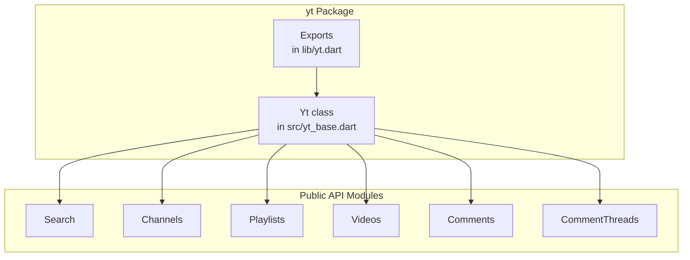
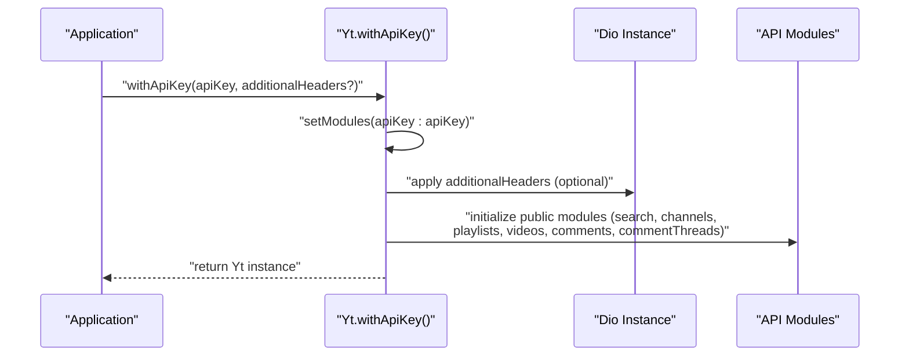
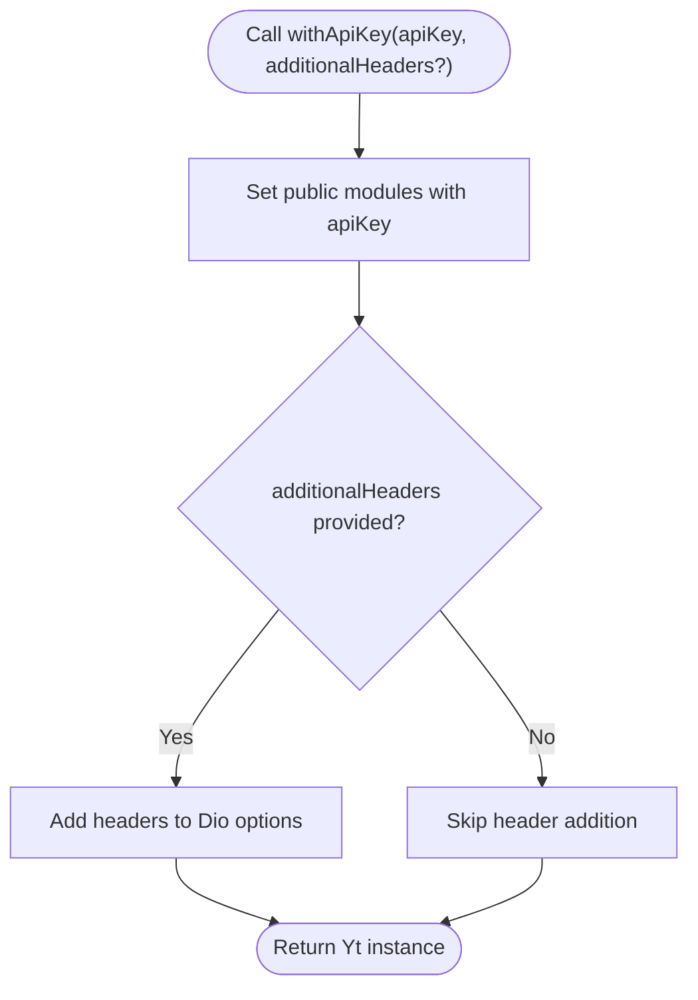
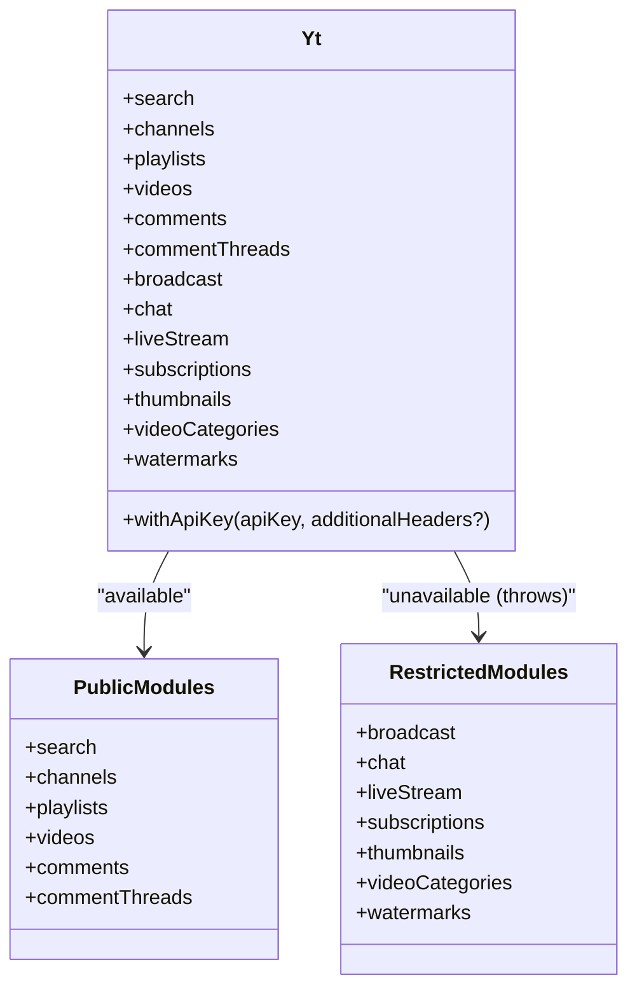
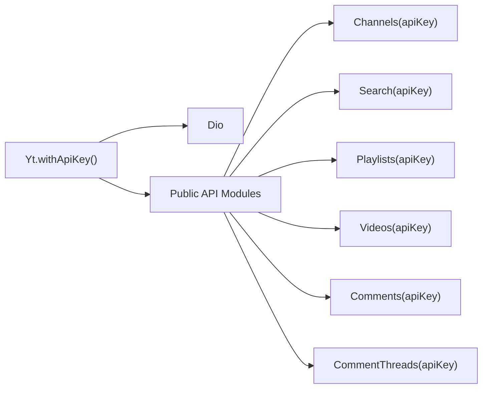

# API Key Authentication

<cite>
**Referenced Files in This Document**
- [README.md](file://README.md)
- [packages/yt/README.md](file://packages/yt/README.md)
- [packages/yt/lib/yt.dart](file://packages/yt/lib/yt.dart)
- [packages/yt/lib/src/yt_base.dart](file://packages/yt/lib/src/yt_base.dart)
- [packages/yt/lib/src/util/extras.dart](file://packages/yt/lib/src/util/extras.dart)
- [packages/yt/lib/src/util/authorization_exception.dart](file://packages/yt/lib/src/util/authorization_exception.dart)
- [packages/yt/example/example.dart](file://packages/yt/example/example.dart)
</cite>

## Table of Contents
1. [Introduction](#introduction)
2. [Project Structure](#project-structure)
3. [Core Components](#core-components)
4. [Architecture Overview](#architecture-overview)
5. [Detailed Component Analysis](#detailed-component-analysis)
6. [Dependency Analysis](#dependency-analysis)
7. [Performance Considerations](#performance-considerations)
8. [Troubleshooting Guide](#troubleshooting-guide)
9. [Conclusion](#conclusion)

## Introduction
This document explains how to configure and use API key authentication in the YouTube API Dart SDK for read-only operations such as video search, channel information retrieval, and public content access. It focuses on the Yt.withApiKey() factory constructor, configuration options, limitations, and best practices for secure usage. It also provides practical guidance for handling rate limits, implementing robust error handling, and troubleshooting common authentication failures.

## Project Structure
The YouTube Dart SDK is organized as a workspace with multiple packages. API key authentication is implemented in the core yt package. The primary entry point for initialization is the Yt class, which exposes static factory constructors for different authentication modes.

**Diagram sources**
- [packages/yt/lib/src/yt_base.dart:88-103](file://packages/yt/lib/src/yt_base.dart#L88-L103)
- [packages/yt/lib/yt.dart:58-66](file://packages/yt/lib/yt.dart#L58-L66)

**Section sources**
- [packages/yt/README.md:111-119](file://packages/yt/README.md#L111-L119)
- [packages/yt/lib/yt.dart:58-66](file://packages/yt/lib/yt.dart#L58-L66)

## Core Components
- Yt.withApiKey(): Initializes the SDK with an API key for read-only access to public YouTube Data API endpoints.
- Additional headers support: Optional custom headers can be added globally to outgoing requests.
- Module availability: Certain modules (e.g., live streaming, live chat, watermarks) are unavailable under API key authentication and will throw exceptions if accessed.

Key behaviors:
- API key mode sets up modules for public endpoints (search, channels, playlists, videos, comments, comment threads).
- Accessing restricted modules under API key mode triggers a module-unavailable exception.
- Global headers are applied to all requests when provided.

**Section sources**
- [packages/yt/lib/src/yt_base.dart:88-103](file://packages/yt/lib/src/yt_base.dart#L88-L103)
- [packages/yt/lib/src/yt_base.dart:16-17](file://packages/yt/lib/src/yt_base.dart#L16-L17)
- [packages/yt/lib/src/yt_base.dart:34-74](file://packages/yt/lib/src/yt_base.dart#L34-L74)
- [packages/yt/lib/src/yt_base.dart:228-254](file://packages/yt/lib/src/yt_base.dart#L228-L254)

## Architecture Overview
The following sequence illustrates how Yt.withApiKey() initializes the SDK and prepares modules for public endpoints.

**Diagram sources**
- [packages/yt/lib/src/yt_base.dart:88-103](file://packages/yt/lib/src/yt_base.dart#L88-L103)
- [packages/yt/lib/src/yt_base.dart:187-255](file://packages/yt/lib/src/yt_base.dart#L187-L255)

## Detailed Component Analysis

### Yt.withApiKey() Constructor
- Purpose: Creates a Yt instance configured for API key authentication.
- Parameters:
  - apiKey: Required string containing the YouTube API key.
  - additionalHeaders: Optional map of headers to attach to all outgoing requests.
- Behavior:
  - Sets up public modules (search, channels, playlists, videos, comments, comment threads).
  - Applies optional additional headers to the underlying Dio instance.
  - Does not enable restricted modules (live streaming, live chat, watermarks) under API key mode.

**Diagram sources**
- [packages/yt/lib/src/yt_base.dart:88-103](file://packages/yt/lib/src/yt_base.dart#L88-L103)

**Section sources**
- [packages/yt/lib/src/yt_base.dart:88-103](file://packages/yt/lib/src/yt_base.dart#L88-L103)

### Module Availability Under API Key Mode
- Public modules (search, channels, playlists, videos, comments, comment threads) are available.
- Restricted modules (broadcast, chat, liveStream, subscriptions, thumbnails, videoCategories, watermarks) are intentionally disabled and will throw an exception if accessed.

**Diagram sources**
- [packages/yt/lib/src/yt_base.dart:34-74](file://packages/yt/lib/src/yt_base.dart#L34-L74)
- [packages/yt/lib/src/yt_base.dart:228-254](file://packages/yt/lib/src/yt_base.dart#L228-L254)

**Section sources**
- [packages/yt/lib/src/yt_base.dart:16-17](file://packages/yt/lib/src/yt_base.dart#L16-L17)
- [packages/yt/lib/src/yt_base.dart:34-74](file://packages/yt/lib/src/yt_base.dart#L34-L74)

### Practical Usage Examples
- Initializing with an API key:
  - See the example pattern in the package documentation that demonstrates constructing a Yt instance with an API key for public endpoints.
- Performing read-only operations:
  - Use the initialized instance to call public endpoints such as search, channels, playlists, videos, comments, and comment threads.
- Example reference:
  - The example file demonstrates typical usage patterns for public endpoints.

Note: Replace placeholder identifiers with actual values appropriate to your application.

**Section sources**
- [packages/yt/README.md:153-176](file://packages/yt/README.md#L153-L176)
- [packages/yt/example/example.dart:1-47](file://packages/yt/example/example.dart#L1-L47)

## Dependency Analysis
- Yt.withApiKey() depends on:
  - The Dio HTTP client for request handling.
  - Public API module constructors that accept the apiKey parameter.
- Interceptors:
  - No authorization interceptors are added automatically under API key mode.
  - Optional additional headers are merged into Dio’s global headers.

**Diagram sources**
- [packages/yt/lib/src/yt_base.dart:88-103](file://packages/yt/lib/src/yt_base.dart#L88-L103)
- [packages/yt/lib/src/yt_base.dart:228-254](file://packages/yt/lib/src/yt_base.dart#L228-L254)

**Section sources**
- [packages/yt/lib/src/yt_base.dart:88-103](file://packages/yt/lib/src/yt_base.dart#L88-L103)
- [packages/yt/lib/src/yt_base.dart:228-254](file://packages/yt/lib/src/yt_base.dart#L228-L254)

## Performance Considerations
- Rate limits:
  - Public endpoints under API key authentication are subject to YouTube Data API quotas. Plan request frequency accordingly and implement retry/backoff strategies.
- Caching:
  - Consider adding caching layers for repeated queries to reduce quota consumption and latency.
- Header overhead:
  - Additional headers are applied globally; keep the number minimal to avoid unnecessary payload size.

[No sources needed since this section provides general guidance]

## Troubleshooting Guide
Common issues and resolutions for API key authentication:

- Unauthorized or invalid API key:
  - Symptom: Requests fail with authorization-related errors.
  - Resolution: Verify the API key is correct, active, and enabled for the YouTube Data API in the Google API Console. Confirm the key is not restricted to disallowed IP/domains.

- Accessing restricted modules:
  - Symptom: Calling broadcast, chat, liveStream, subscriptions, thumbnails, videoCategories, or watermarks throws an exception.
  - Resolution: These modules are not available under API key mode. Switch to OAuth 2.0 authentication if you need these features.

- Quota exceeded or daily limit reached:
  - Symptom: Requests receive quota-related errors.
  - Resolution: Monitor your quota usage, implement exponential backoff, and consider upgrading your API key limits.

- Unexpected error messages:
  - Use the usage extension to extract actionable error details from Dio exceptions.
  - Wrap API calls in try/catch blocks and inspect the error message and response data.

Security considerations:
- Store API keys securely (e.g., environment variables, secrets managers).
- Avoid committing keys to version control.
- Restrict API key usage to trusted domains/IPs in the Google API Console.
- Rotate keys periodically and revoke compromised keys promptly.

**Section sources**
- [packages/yt/lib/src/yt_base.dart:16-17](file://packages/yt/lib/src/yt_base.dart#L16-L17)
- [packages/yt/lib/src/util/extras.dart:3-9](file://packages/yt/lib/src/util/extras.dart#L3-L9)
- [packages/yt/lib/src/util/authorization_exception.dart:1-10](file://packages/yt/lib/src/util/authorization_exception.dart#L1-L10)

## Conclusion
API key authentication in the YouTube API Dart SDK enables efficient read-only access to public YouTube Data API endpoints. Use Yt.withApiKey() to initialize the SDK, apply optional headers if needed, and restrict your usage to supported public modules. Follow best practices for key storage, monitor quotas, and leverage error handling utilities to diagnose and recover from failures. For features requiring user context or write access, use OAuth 2.0 authentication instead.