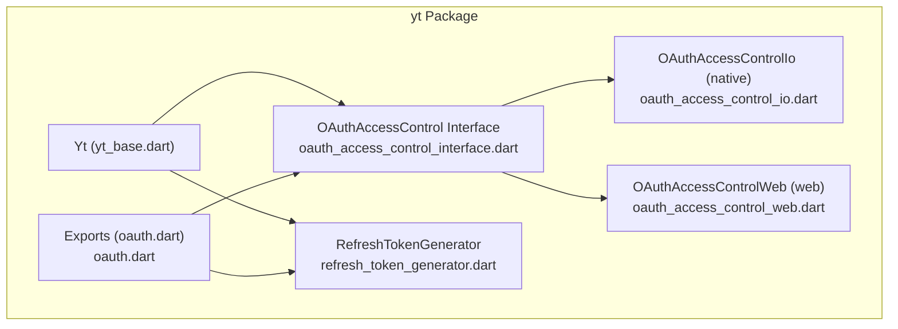
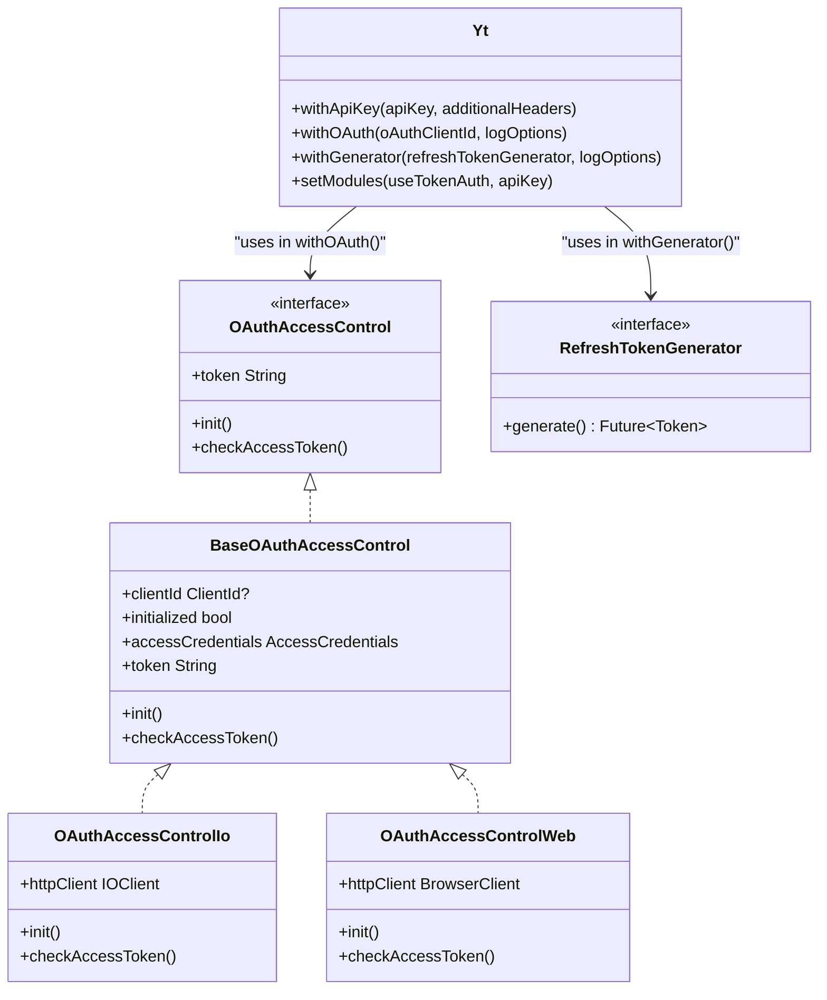
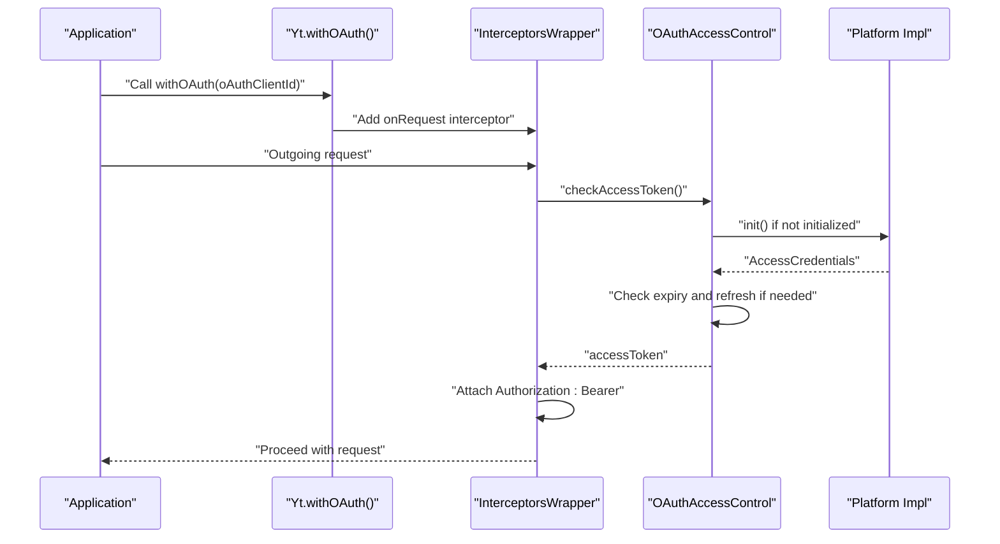
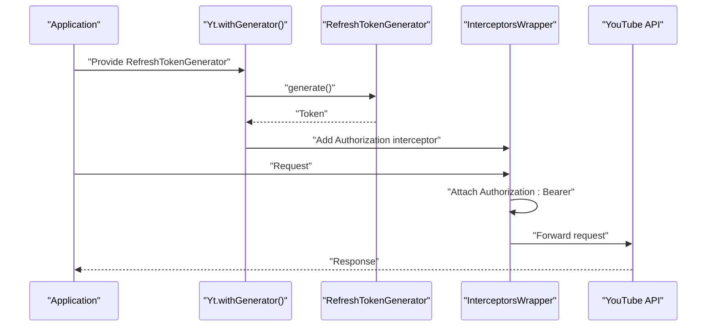
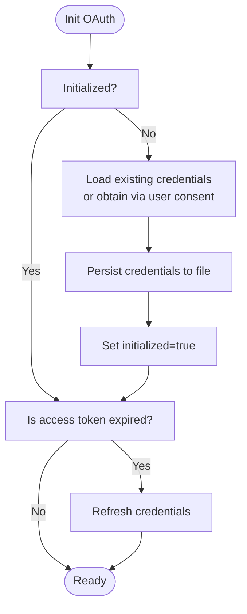
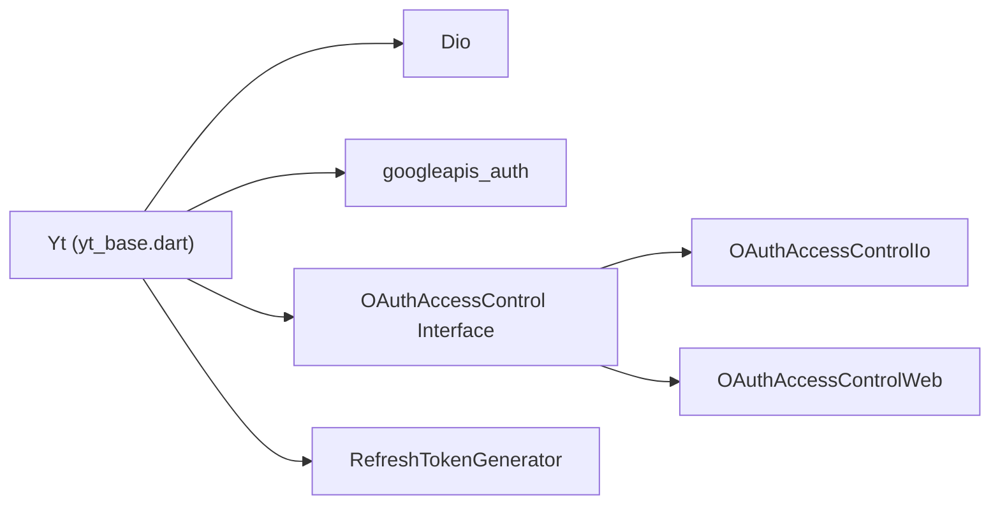

# Authentication System

<cite>
**Referenced Files in This Document**
- [README.md](file://README.md)
- [yt.dart](file://packages/yt/lib/yt.dart)
- [oauth.dart](file://packages/yt/lib/oauth.dart)
- [yt_base.dart](file://packages/yt/lib/src/yt_base.dart)
- [oauth_access_control_interface.dart](file://packages/yt/lib/src/oauth/oauth_access_control_interface.dart)
- [oauth_access_control.dart](file://packages/yt/lib/src/oauth/oauth_access_control.dart)
- [oauth_access_control_io.dart](file://packages/yt/lib/src/oauth/oauth_access_control_io.dart)
- [oauth_access_control_web.dart](file://packages/yt/lib/src/oauth/oauth_access_control_web.dart)
- [refresh_token_generator.dart](file://packages/yt/lib/src/oauth/refresh_token_generator.dart)
</cite>

## Table of Contents
1. [Introduction](#introduction)
2. [Project Structure](#project-structure)
3. [Core Components](#core-components)
4. [Architecture Overview](#architecture-overview)
5. [Detailed Component Analysis](#detailed-component-analysis)
6. [Dependency Analysis](#dependency-analysis)
7. [Performance Considerations](#performance-considerations)
8. [Troubleshooting Guide](#troubleshooting-guide)
9. [Conclusion](#conclusion)
10. [Appendices](#appendices)

## Introduction
This document explains the authentication system of the YouTube API Dart SDK. It covers three authentication methods:
- API key authentication for read-only operations
- OAuth 2.0 for full access with user consent
- Token generator for custom authentication flows

It documents the factory pattern exposed by the Yt class with withApiKey(), withOAuth(), and withGenerator() methods, and details platform-specific OAuth implementations for web browsers and native Dart applications. It also includes authentication flow diagrams, token management strategies, refresh token handling, security considerations, and practical examples with error handling and best practices.

## Project Structure
The authentication system is implemented primarily in the yt package. Key files include:
- Yt class and factory methods for authentication initialization
- OAuth access control abstraction and platform-specific implementations
- Refresh token generator interface for custom token flows
- Exports for OAuth-related utilities

**Diagram sources**
- [yt_base.dart:1-259](file://packages/yt/lib/src/yt_base.dart#L1-L259)
- [oauth_access_control_interface.dart:1-33](file://packages/yt/lib/src/oauth/oauth_access_control_interface.dart#L1-L33)
- [oauth_access_control_io.dart:1-80](file://packages/yt/lib/src/oauth/oauth_access_control_io.dart#L1-L80)
- [oauth_access_control_web.dart:1-41](file://packages/yt/lib/src/oauth/oauth_access_control_web.dart#L1-L41)
- [refresh_token_generator.dart:1-6](file://packages/yt/lib/src/oauth/refresh_token_generator.dart#L1-L6)
- [oauth.dart:1-6](file://packages/yt/lib/oauth.dart#L1-L6)

**Section sources**
- [README.md:1-119](file://README.md#L1-L119)
- [yt_base.dart:1-259](file://packages/yt/lib/src/yt_base.dart#L1-L259)
- [oauth.dart:1-6](file://packages/yt/lib/oauth.dart#L1-L6)

## Core Components
- Yt: Central class exposing factory methods for authentication and module initialization.
- OAuthAccessControl: Abstraction for acquiring and refreshing access tokens.
- OAuthAccessControlIo: Native Dart implementation using local credential storage and console consent.
- OAuthAccessControlWeb: Web implementation using browser-based OAuth.
- RefreshTokenGenerator: Interface for custom token generation flows.

Key responsibilities:
- Yt.withApiKey(): Initializes API key-based requests and sets read-only modules.
- Yt.withOAuth(): Adds an Authorization interceptor and initializes OAuth access control per platform.
- Yt.withGenerator(): Uses a custom RefreshTokenGenerator to supply tokens and adds an Authorization interceptor.
- OAuthAccessControl implementations manage token lifecycle and persistence.

**Section sources**
- [yt_base.dart:88-169](file://packages/yt/lib/src/yt_base.dart#L88-L169)
- [oauth_access_control_interface.dart:7-32](file://packages/yt/lib/src/oauth/oauth_access_control_interface.dart#L7-L32)
- [oauth_access_control_io.dart:10-79](file://packages/yt/lib/src/oauth/oauth_access_control_io.dart#L10-L79)
- [oauth_access_control_web.dart:6-40](file://packages/yt/lib/src/oauth/oauth_access_control_web.dart#L6-L40)
- [refresh_token_generator.dart:3-5](file://packages/yt/lib/src/oauth/refresh_token_generator.dart#L3-L5)

## Architecture Overview
The authentication architecture uses a factory pattern on Yt and a platform-aware OAuth access control layer. Requests are intercepted to attach Authorization headers. Modules are selectively instantiated based on the chosen authentication mode.

**Diagram sources**
- [yt_base.dart:88-169](file://packages/yt/lib/src/yt_base.dart#L88-L169)
- [oauth_access_control_interface.dart:7-32](file://packages/yt/lib/src/oauth/oauth_access_control_interface.dart#L7-L32)
- [oauth_access_control_io.dart:13-79](file://packages/yt/lib/src/oauth/oauth_access_control_io.dart#L13-L79)
- [oauth_access_control_web.dart:9-40](file://packages/yt/lib/src/oauth/oauth_access_control_web.dart#L9-L40)
- [refresh_token_generator.dart:3-5](file://packages/yt/lib/src/oauth/refresh_token_generator.dart#L3-L5)

## Detailed Component Analysis

### Yt Factory Methods and Module Initialization
- withApiKey():
  - Creates a Yt instance and sets modules for read-only operations.
  - Optionally merges additional headers into Dio options.
  - Applies stored interceptors to the Dio instance.
- withOAuth():
  - Creates a Yt instance with logging options.
  - Adds an InterceptorsWrapper to onRequest that checks and refreshes access tokens via OAuthAccessControl and attaches an Authorization header.
  - Sets modules for full access operations.
  - Applies stored interceptors to the Dio instance.
- withGenerator():
  - Accepts a RefreshTokenGenerator and generates a Token.
  - Adds an InterceptorsWrapper to onRequest that attaches an Authorization header with the generated access token.
  - Sets modules for full access operations.
  - Applies stored interceptors to the Dio instance.

Module initialization:
- setModules() conditionally instantiates modules for live streaming, chat, and other write/read capabilities when useTokenAuth is true.
- Always instantiates read-only modules (channels, comments, comment threads, playlists, playlist items, search, thumbnails) with apiKey.

Security and availability:
- Several modules throw an exception when API key mode is active, indicating they require token-based authentication.

**Section sources**
- [yt_base.dart:88-169](file://packages/yt/lib/src/yt_base.dart#L88-L169)
- [yt_base.dart:187-255](file://packages/yt/lib/src/yt_base.dart#L187-L255)

### OAuth Access Control Abstraction and Platform Implementations
- Abstraction:
  - OAuthAccessControl defines token retrieval and lifecycle management.
  - BaseOAuthAccessControl centralizes clientId handling, initialized state, and accessCredentials access.
- Native (Io):
  - Loads client credentials from a JSON file in the user’s home directory if present.
  - If missing, obtains user consent via a URL printed to the console and persists credentials to a file.
  - Automatically refreshes expired tokens using refreshCredentials.
- Web:
  - Requires a clientId and uses requestAccessCredentials to obtain AccessCredentials in the browser.
  - Automatically refreshes expired tokens using refreshCredentials.

**Diagram sources**
- [yt_base.dart:109-141](file://packages/yt/lib/src/yt_base.dart#L109-L141)
- [oauth_access_control_interface.dart:13-15](file://packages/yt/lib/src/oauth/oauth_access_control_interface.dart#L13-L15)
- [oauth_access_control_io.dart:33-78](file://packages/yt/lib/src/oauth/oauth_access_control_io.dart#L33-L78)
- [oauth_access_control_web.dart:26-39](file://packages/yt/lib/src/oauth/oauth_access_control_web.dart#L26-L39)

**Section sources**
- [oauth_access_control_interface.dart:7-32](file://packages/yt/lib/src/oauth/oauth_access_control_interface.dart#L7-L32)
- [oauth_access_control_io.dart:10-79](file://packages/yt/lib/src/oauth/oauth_access_control_io.dart#L10-L79)
- [oauth_access_control_web.dart:6-40](file://packages/yt/lib/src/oauth/oauth_access_control_web.dart#L6-L40)

### Token Generator Pattern
- RefreshTokenGenerator:
  - Defines a generate() method returning a Token with accessToken and optional metadata.
- Yt.withGenerator():
  - Calls generate() to obtain a Token.
  - Attaches Authorization: Bearer <accessToken> to all requests.
  - Suitable for server-to-server or service account scenarios where tokens are minted by a trusted backend.

**Diagram sources**
- [yt_base.dart:143-169](file://packages/yt/lib/src/yt_base.dart#L143-L169)
- [refresh_token_generator.dart:3-5](file://packages/yt/lib/src/oauth/refresh_token_generator.dart#L3-L5)

**Section sources**
- [yt_base.dart:143-169](file://packages/yt/lib/src/yt_base.dart#L143-L169)
- [refresh_token_generator.dart:3-5](file://packages/yt/lib/src/oauth/refresh_token_generator.dart#L3-L5)

### Platform-Specific OAuth Implementations
- Native (Dart VM):
  - Reads/writes credentials to a JSON file in the user’s home directory.
  - Uses obtainAccessCredentialsViaUserConsent to guide the user to a consent URL and capture the authorization code.
  - Persists refreshed credentials for future sessions.
- Web (Browser):
  - Uses requestAccessCredentials to obtain AccessCredentials directly in the browser.
  - Refreshes tokens automatically when expired.

**Diagram sources**
- [oauth_access_control_io.dart:33-78](file://packages/yt/lib/src/oauth/oauth_access_control_io.dart#L33-L78)
- [oauth_access_control_web.dart:26-39](file://packages/yt/lib/src/oauth/oauth_access_control_web.dart#L26-L39)

**Section sources**
- [oauth_access_control_io.dart:33-78](file://packages/yt/lib/src/oauth/oauth_access_control_io.dart#L33-L78)
- [oauth_access_control_web.dart:14-39](file://packages/yt/lib/src/oauth/oauth_access_control_web.dart#L14-L39)

## Dependency Analysis
- Yt depends on:
  - Dio for HTTP requests and interceptors
  - googleapis_auth for OAuth flows and token management
  - Platform-specific OAuth access control implementations
  - RefreshTokenGenerator for custom token flows
- OAuthAccessControl is resolved via conditional import:
  - dart.library.io -> OAuthAccessControlIo
  - dart.library.html -> OAuthAccessControlWeb
  - Otherwise -> throws unimplemented in the base factory

**Diagram sources**
- [yt_base.dart:1-10](file://packages/yt/lib/src/yt_base.dart#L1-L10)
- [oauth_access_control_interface.dart:3-5](file://packages/yt/lib/src/oauth/oauth_access_control_interface.dart#L3-L5)

**Section sources**
- [yt_base.dart:1-10](file://packages/yt/lib/src/yt_base.dart#L1-L10)
- [oauth_access_control_interface.dart:3-5](file://packages/yt/lib/src/oauth/oauth_access_control_interface.dart#L3-L5)

## Performance Considerations
- Token caching:
  - Native implementation caches credentials to disk to avoid repeated consent prompts and network calls.
- Request interception:
  - Authorization header injection occurs per request; keep interceptors minimal to reduce overhead.
- Token refresh:
  - Automatic refresh on expiry avoids request failures but may incur network latency; consider batching requests or pre-refreshing near expiry windows.
- Logging:
  - Default log level is error; adjust LogOptions for diagnostics without impacting production performance.

[No sources needed since this section provides general guidance]

## Troubleshooting Guide
Common issues and resolutions:
- API key mode limitations:
  - Some modules throw exceptions when using API key authentication. Switch to OAuth or token generator for write/read capabilities.
- OAuth consent flow:
  - Native: Ensure the credentials file exists or follow the printed consent URL. Verify the user’s home directory path and permissions.
  - Web: Ensure a clientId is configured and the browser supports the OAuth flow.
- Token expiry:
  - If requests fail with unauthorized errors, the token may have expired. The OAuth implementations refresh tokens automatically; re-run the consent flow if manual intervention is required.
- Interceptor conflicts:
  - If additional interceptors are added, ensure they do not overwrite Authorization headers unintentionally.

**Section sources**
- [yt_base.dart:16-17](file://packages/yt/lib/src/yt_base.dart#L16-L17)
- [yt_base.dart:34-74](file://packages/yt/lib/src/yt_base.dart#L34-L74)
- [oauth_access_control_io.dart:46-60](file://packages/yt/lib/src/oauth/oauth_access_control_io.dart#L46-L60)
- [oauth_access_control_web.dart:18-24](file://packages/yt/lib/src/oauth/oauth_access_control_web.dart#L18-L24)

## Conclusion
The yt package provides a flexible authentication system tailored for multiple platforms and use cases. The Yt factory methods simplify initialization for API key, OAuth, and token generator flows. Platform-aware OAuth implementations handle user consent and token refresh transparently. By leveraging interceptors and selective module instantiation, the SDK balances ease of use with robust security and performance.

[No sources needed since this section summarizes without analyzing specific files]

## Appendices

### Practical Examples and Best Practices
- API key authentication (read-only):
  - Initialize with withApiKey(apiKey, additionalHeaders).
  - Use read-only modules (channels, comments, comment threads, playlists, playlist items, search, thumbnails).
  - Best practice: Store apiKey securely and limit scope to read-only endpoints.
- OAuth 2.0 (full access with user consent):
  - Initialize with withOAuth(oAuthClientId).
  - Native: Consent URL is printed; credentials are persisted locally.
  - Web: Consent is handled in-browser via requestAccessCredentials.
  - Best practice: Use short-lived access tokens and rely on automatic refresh.
- Token generator (custom flows):
  - Initialize with withGenerator(refreshTokenGenerator).
  - Use when tokens are minted by a trusted backend or service account.
  - Best practice: Rotate tokens periodically and handle refresh failures gracefully.

**Section sources**
- [yt_base.dart:88-103](file://packages/yt/lib/src/yt_base.dart#L88-L103)
- [yt_base.dart:109-141](file://packages/yt/lib/src/yt_base.dart#L109-L141)
- [yt_base.dart:143-169](file://packages/yt/lib/src/yt_base.dart#L143-L169)
- [README.md:20-41](file://README.md#L20-L41)