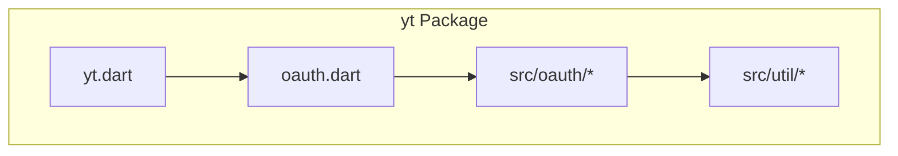
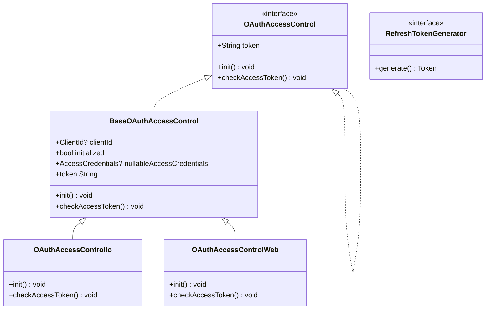
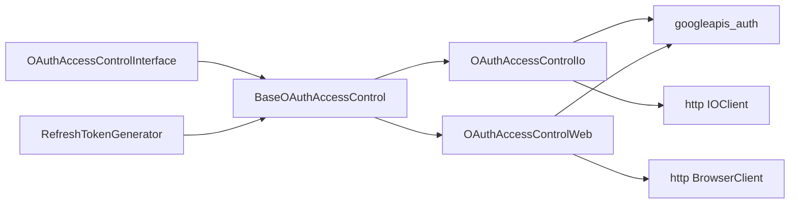
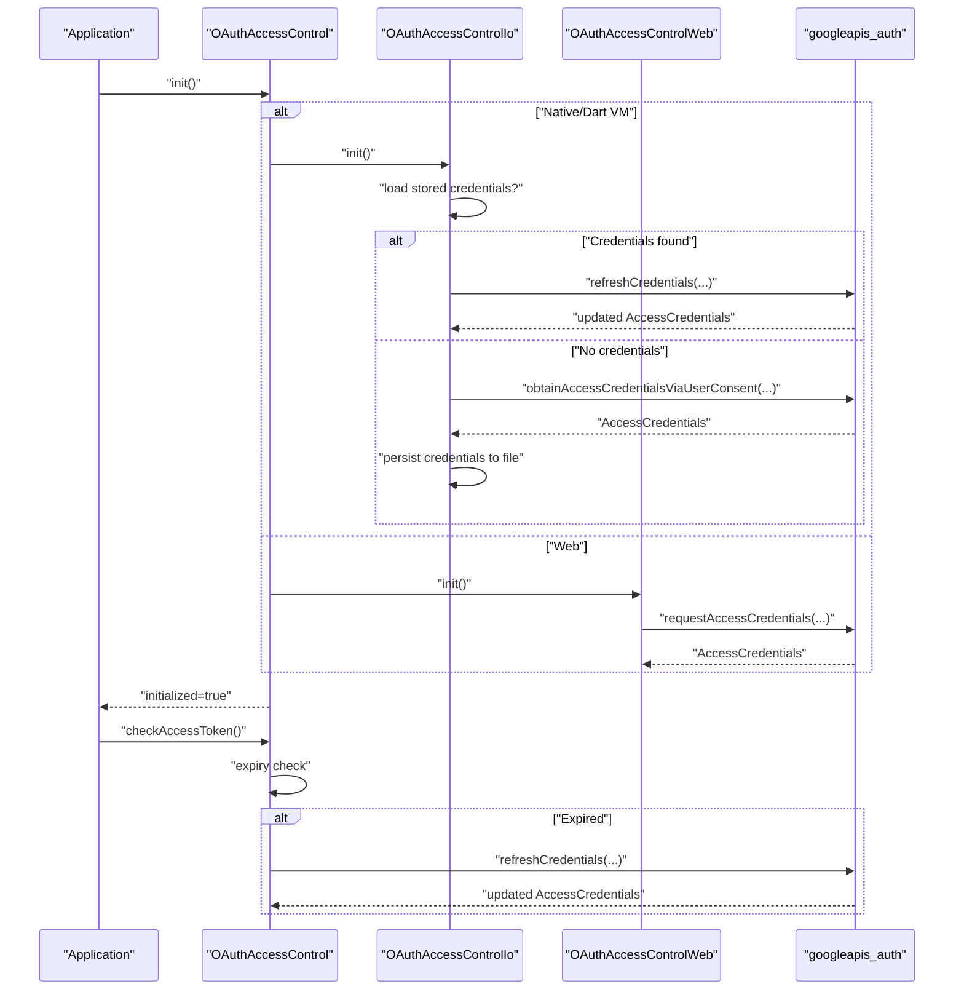

# OAuth 2.0 Authentication

<cite>
**Referenced Files in This Document**
- [README.md](file://README.md)
- [pubspec.yaml](file://pubspec.yaml)
- [yt.dart](file://packages/yt/lib/yt.dart)
- [oauth.dart](file://packages/yt/lib/oauth.dart)
- [oauth_access_control_interface.dart](file://packages/yt/lib/src/oauth/oauth_access_control_interface.dart)
- [oauth_access_control.dart](file://packages/yt/lib/src/oauth/oauth_access_control.dart)
- [oauth_access_control_io.dart](file://packages/yt/lib/src/oauth/oauth_access_control_io.dart)
- [oauth_access_control_web.dart](file://packages/yt/lib/src/oauth/oauth_access_control_web.dart)
- [refresh_token_generator.dart](file://packages/yt/lib/src/oauth/refresh_token_generator.dart)
- [yt_base.dart](file://packages/yt/lib/src/yt_base.dart)
- [authorization_exception.dart](file://packages/yt/lib/src/util/authorization_exception.dart)
- [util.dart](file://packages/yt/lib/src/util/util.dart)
</cite>

## Table of Contents
1. [Introduction](#introduction)
2. [Project Structure](#project-structure)
3. [Core Components](#core-components)
4. [Architecture Overview](#architecture-overview)
5. [Detailed Component Analysis](#detailed-component-analysis)
6. [Dependency Analysis](#dependency-analysis)
7. [Performance Considerations](#performance-considerations)
8. [Troubleshooting Guide](#troubleshooting-guide)
9. [Conclusion](#conclusion)
10. [Appendices](#appendices)

## Introduction
This document explains the OAuth 2.0 authentication implementation in the YouTube API Dart SDK. It focuses on the Yt.withOAuth() factory constructor, OAuth flow configuration, token management strategies, and the OAuthAccessControlInterface with platform-specific implementations for web and native Dart applications. It also documents the complete OAuth authorization flow, token refresh mechanisms, scope configuration, consent handling, and practical guidance for secure token storage and refresh logic.

## Project Structure
The OAuth implementation is organized under the yt package’s src/oauth directory and integrates with the public API surface exposed by the package. The key files include:
- Public exports for OAuth-related utilities
- Platform-specific OAuth access control implementations
- Token refresh generator abstraction
- Base authorization exception type

**Diagram sources**
- [yt.dart:1-75](file://packages/yt/lib/yt.dart#L1-L75)
- [oauth.dart:1-6](file://packages/yt/lib/oauth.dart#L1-L6)

**Section sources**
- [README.md:1-119](file://README.md#L1-L119)
- [pubspec.yaml:1-69](file://pubspec.yaml#L1-L69)
- [yt.dart:1-75](file://packages/yt/lib/yt.dart#L1-L75)
- [oauth.dart:1-6](file://packages/yt/lib/oauth.dart#L1-L6)

## Core Components
- OAuthAccessControlInterface: Defines the contract for obtaining and refreshing access credentials, including initialization and token validity checks.
- BaseOAuthAccessControl: Provides shared behavior for managing ClientId, initialized state, and access credentials.
- OAuthAccessControlIo: Native/Dart VM implementation that reads/writes credentials to disk, requests user consent, and refreshes tokens.
- OAuthAccessControlWeb: Web implementation that uses browser-based OAuth flows to obtain and refresh tokens.
- RefreshTokenGenerator: Abstraction for generating tokens, enabling custom token storage and refresh strategies.
- AuthorizationException: Standardized exception type for authorization failures.

Key responsibilities:
- Initialize OAuth client configuration
- Acquire initial access credentials via user consent or existing stored credentials
- Refresh expired tokens transparently
- Expose current access token for authenticated API calls

**Section sources**
- [oauth_access_control_interface.dart:1-33](file://packages/yt/lib/src/oauth/oauth_access_control_interface.dart#L1-L33)
- [oauth_access_control_io.dart:1-80](file://packages/yt/lib/src/oauth/oauth_access_control_io.dart#L1-L80)
- [oauth_access_control_web.dart:1-41](file://packages/yt/lib/src/oauth/oauth_access_control_web.dart#L1-L41)
- [refresh_token_generator.dart:1-6](file://packages/yt/lib/src/oauth/refresh_token_generator.dart#L1-L6)
- [authorization_exception.dart:1-50](file://packages/yt/lib/src/util/authorization_exception.dart#L1-L50)

## Architecture Overview
The OAuth subsystem uses a platform-aware factory to select the appropriate implementation. Initialization attempts to load existing credentials; otherwise, it triggers user consent. Tokens are refreshed automatically when nearing expiry.

**Diagram sources**
- [oauth_access_control_interface.dart:7-32](file://packages/yt/lib/src/oauth/oauth_access_control_interface.dart#L7-L32)
- [oauth_access_control_io.dart:13-79](file://packages/yt/lib/src/oauth/oauth_access_control_io.dart#L13-L79)
- [oauth_access_control_web.dart:9-40](file://packages/yt/lib/src/oauth/oauth_access_control_web.dart#L9-L40)
- [refresh_token_generator.dart:3-5](file://packages/yt/lib/src/oauth/refresh_token_generator.dart#L3-L5)

## Detailed Component Analysis

### OAuthAccessControlInterface and BaseOAuthAccessControl
- OAuthAccessControl defines the contract for token retrieval and lifecycle management.
- BaseOAuthAccessControl centralizes shared state and behavior, including lazy initialization and access to the current access token.

Implementation highlights:
- Access to the current token via a property that throws if uninitialized
- Initialization guard to ensure credentials are loaded before use
- AccessCredentials encapsulates the current token and expiry

**Section sources**
- [oauth_access_control_interface.dart:7-32](file://packages/yt/lib/src/oauth/oauth_access_control_interface.dart#L7-L32)

### OAuthAccessControlIo (Native/Dart VM)
Behavior:
- Loads default ClientId from a JSON file in the user’s home directory if not provided
- Attempts to read stored AccessCredentials from a credentials file
- If missing or invalid/expired, initiates user consent flow and writes new credentials to disk
- Automatically refreshes tokens when expiry is detected

Security considerations:
- Credentials are persisted locally; ensure appropriate file permissions and secure defaults
- Uses an IO HTTP client suitable for native environments

**Section sources**
- [oauth_access_control_io.dart:10-31](file://packages/yt/lib/src/oauth/oauth_access_control_io.dart#L10-L31)
- [oauth_access_control_io.dart:34-63](file://packages/yt/lib/src/oauth/oauth_access_control_io.dart#L34-L63)
- [oauth_access_control_io.dart:66-79](file://packages/yt/lib/src/oauth/oauth_access_control_io.dart#L66-L79)
- [util.dart:1-200](file://packages/yt/lib/src/util/util.dart#L1-L200)

### OAuthAccessControlWeb (Web)
Behavior:
- Requires a ClientId and requests access credentials via browser OAuth
- Uses a BrowserClient for HTTP requests
- Automatically refreshes tokens when expiry is detected

Security considerations:
- Browser-based flows rely on redirect-based consent; ensure proper OAuth app configuration
- Tokens are held in memory during the session

**Section sources**
- [oauth_access_control_web.dart:6-7](file://packages/yt/lib/src/oauth/oauth_access_control_web.dart#L6-L7)
- [oauth_access_control_web.dart:14-24](file://packages/yt/lib/src/oauth/oauth_access_control_web.dart#L14-L24)
- [oauth_access_control_web.dart:26-40](file://packages/yt/lib/src/oauth/oauth_access_control_web.dart#L26-L40)

### RefreshTokenGenerator
Purpose:
- Abstracts token generation to support custom storage and refresh strategies
- Enables integration with external secret managers or custom persistence layers

Usage pattern:
- Implementations can read/write tokens from/to secure storage
- Coordinate with the base access control to update AccessCredentials

**Section sources**
- [refresh_token_generator.dart:3-5](file://packages/yt/lib/src/oauth/refresh_token_generator.dart#L3-L5)

### AuthorizationException
Purpose:
- Standardized exception type for authorization-related failures
- Enables consistent error handling across platforms

**Section sources**
- [authorization_exception.dart:1-50](file://packages/yt/lib/src/util/authorization_exception.dart#L1-L50)

## Dependency Analysis
The OAuth subsystem depends on:
- googleapis_auth for OAuth flows and credential management
- http clients tailored to the platform (IOClient for native, BrowserClient for web)
- Internal utilities for file path resolution and credential file locations

**Diagram sources**
- [oauth_access_control_interface.dart:1-33](file://packages/yt/lib/src/oauth/oauth_access_control_interface.dart#L1-L33)
- [oauth_access_control_io.dart:1-80](file://packages/yt/lib/src/oauth/oauth_access_control_io.dart#L1-L80)
- [oauth_access_control_web.dart:1-41](file://packages/yt/lib/src/oauth/oauth_access_control_web.dart#L1-L41)
- [refresh_token_generator.dart:1-6](file://packages/yt/lib/src/oauth/refresh_token_generator.dart#L1-L6)

**Section sources**
- [oauth_access_control_interface.dart:1-33](file://packages/yt/lib/src/oauth/oauth_access_control_interface.dart#L1-L33)
- [oauth_access_control_io.dart:1-80](file://packages/yt/lib/src/oauth/oauth_access_control_io.dart#L1-L80)
- [oauth_access_control_web.dart:1-41](file://packages/yt/lib/src/oauth/oauth_access_control_web.dart#L1-L41)
- [refresh_token_generator.dart:1-6](file://packages/yt/lib/src/oauth/refresh_token_generator.dart#L1-L6)

## Performance Considerations
- Minimize repeated initialization: The access control sets an initialized flag after successful setup; reuse instances across API calls.
- Network overhead: Token refresh involves network calls; batch API requests to reduce redundant refresh attempts.
- Disk I/O (native): Persisting credentials to disk is synchronous; avoid frequent writes by reusing refreshed credentials.
- Browser storage (web): Tokens are kept in memory; ensure minimal cross-page navigation to avoid losing state.

## Troubleshooting Guide
Common issues and resolutions:
- Uninitialized access control: Ensure init() is called before accessing the token or making authenticated requests.
- Expired token errors: The checkAccessToken() method refreshes tokens automatically; verify that expiry checks occur before API calls.
- Missing credentials file (native): On first run, user consent is required; confirm the consent URL is opened and the resulting credentials are written.
- Incorrect ClientId configuration: Provide a valid ClientId; for native, ensure default credentials are present in the expected location.
- Scope mismatches: The implementation requests a specific YouTube scope; ensure the OAuth client is configured accordingly.
- AuthorizationException: Catch and handle authorization exceptions to recover gracefully, possibly by re-initiating consent.

**Section sources**
- [oauth_access_control_interface.dart:25-32](file://packages/yt/lib/src/oauth/oauth_access_control_interface.dart#L25-L32)
- [oauth_access_control_io.dart:34-63](file://packages/yt/lib/src/oauth/oauth_access_control_io.dart#L34-L63)
- [oauth_access_control_web.dart:14-24](file://packages/yt/lib/src/oauth/oauth_access_control_web.dart#L14-L24)
- [authorization_exception.dart:1-50](file://packages/yt/lib/src/util/authorization_exception.dart#L1-L50)

## Conclusion
The yt OAuth subsystem provides a clean, platform-aware abstraction for acquiring and maintaining access tokens for YouTube API calls. By leveraging BaseOAuthAccessControl and platform-specific implementations, developers can implement robust authentication flows with minimal boilerplate. Proper initialization, automatic token refresh, and standardized error handling enable reliable integration across native and web environments.

## Appendices

### Step-by-Step: Setting Up OAuth Clients and Managing Tokens
- Native/Dart VM
  - Provide a ClientId; if not provided, the implementation loads defaults from a credentials file in the user’s home directory.
  - On first run, user consent is initiated; after consent, credentials are persisted to a credentials file.
  - Subsequent runs load stored credentials and refresh automatically when needed.
- Web
  - Provide a ClientId and initialize OAuth; the browser-based flow requests consent and returns credentials.
  - Tokens are refreshed automatically when expiry is detected.

References:
- [oauth_access_control_io.dart:24-31](file://packages/yt/lib/src/oauth/oauth_access_control_io.dart#L24-L31)
- [oauth_access_control_io.dart:46-60](file://packages/yt/lib/src/oauth/oauth_access_control_io.dart#L46-L60)
- [oauth_access_control_web.dart:18-21](file://packages/yt/lib/src/oauth/oauth_access_control_web.dart#L18-L21)

### Security Best Practices
- Protect local credentials files with appropriate OS permissions (native).
- Use HTTPS and configure OAuth clients with strict redirect URIs.
- Limit token scope to the minimum required (the implementation requests a specific YouTube scope).
- Avoid logging sensitive tokens; sanitize logs and error messages.
- Rotate secrets and revoke compromised tokens promptly.

### OAuth Authorization Flow Sequence

**Diagram sources**
- [oauth_access_control_io.dart:34-63](file://packages/yt/lib/src/oauth/oauth_access_control_io.dart#L34-L63)
- [oauth_access_control_web.dart:14-24](file://packages/yt/lib/src/oauth/oauth_access_control_web.dart#L14-L24)
- [oauth_access_control_interface.dart:13-16](file://packages/yt/lib/src/oauth/oauth_access_control_interface.dart#L13-L16)