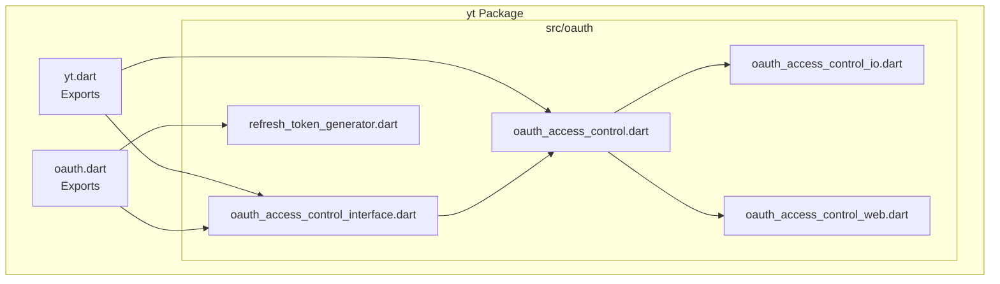
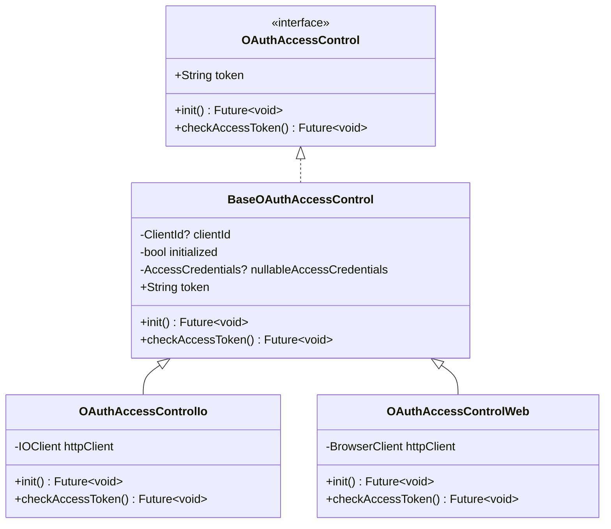
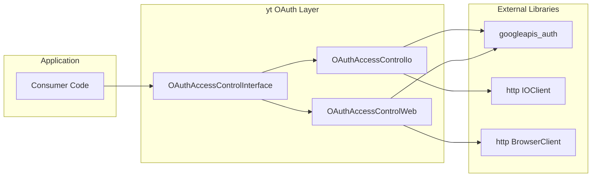

# OAuth Flow Implementation

<cite>
**Referenced Files in This Document**
- [oauth.dart](file://packages/yt/lib/oauth.dart)
- [yt.dart](file://packages/yt/lib/yt.dart)
- [oauth_access_control_interface.dart](file://packages/yt/lib/src/oauth/oauth_access_control_interface.dart)
- [oauth_access_control.dart](file://packages/yt/lib/src/oauth/oauth_access_control.dart)
- [oauth_access_control_io.dart](file://packages/yt/lib/src/oauth/oauth_access_control_io.dart)
- [oauth_access_control_web.dart](file://packages/yt/lib/src/oauth/oauth_access_control_web.dart)
- [refresh_token_generator.dart](file://packages/yt/lib/src/oauth/refresh_token_generator.dart)
</cite>

## Table of Contents
1. [Introduction](#introduction)
2. [Project Structure](#project-structure)
3. [Core Components](#core-components)
4. [Architecture Overview](#architecture-overview)
5. [Detailed Component Analysis](#detailed-component-analysis)
6. [Dependency Analysis](#dependency-analysis)
7. [Performance Considerations](#performance-considerations)
8. [Troubleshooting Guide](#troubleshooting-guide)
9. [Conclusion](#conclusion)
10. [Appendices](#appendices)

## Introduction
This document explains the OAuth 2.0 flow implementation used by the YouTube API Dart SDK. It covers the end-to-end authorization process from client registration to user consent, including redirect URI configuration, scope specification, and authorization code exchange. It also documents the OAuthAccessControl factory constructor and how it selects platform-specific implementations for native (IO) and web environments. Additional topics include authorization URL construction, state parameter handling, PKCE support, step-by-step setup examples, common issues, security considerations, and production best practices.

## Project Structure
The OAuth implementation is organized under the yt package’s src/oauth module and integrates with the googleapis_auth library for cross-platform OAuth handling. The public API surface for OAuth is exposed via the main package exports.

**Diagram sources**
- [yt.dart:1-75](file://packages/yt/lib/yt.dart#L1-L75)
- [oauth.dart:1-6](file://packages/yt/lib/oauth.dart#L1-L6)
- [oauth_access_control_interface.dart:1-33](file://packages/yt/lib/src/oauth/oauth_access_control_interface.dart#L1-L33)
- [oauth_access_control.dart:1-7](file://packages/yt/lib/src/oauth/oauth_access_control.dart#L1-L7)
- [oauth_access_control_io.dart:1-80](file://packages/yt/lib/src/oauth/oauth_access_control_io.dart#L1-L80)
- [oauth_access_control_web.dart:1-41](file://packages/yt/lib/src/oauth/oauth_access_control_web.dart#L1-L41)
- [refresh_token_generator.dart:1-6](file://packages/yt/lib/src/oauth/refresh_token_generator.dart#L1-L6)

**Section sources**
- [yt.dart:1-75](file://packages/yt/lib/yt.dart#L1-L75)
- [oauth.dart:1-6](file://packages/yt/lib/oauth.dart#L1-L6)

## Core Components
- OAuthAccessControl interface and base class define the contract for obtaining and refreshing access tokens across platforms.
- Platform-specific implementations:
  - OAuthAccessControlIo: Native (Dart IO) implementation that reads/writes credentials locally and obtains tokens via user consent.
  - OAuthAccessControlWeb: Browser implementation that requests access credentials directly in the browser.
- Factory selection: The getOAuthAccessControl factory chooses the appropriate implementation based on the current runtime environment.
- Token refresh capability: Both implementations support checking token expiry and refreshing tokens when needed.

Key responsibilities:
- Client ID resolution and initialization
- Scope definition (YouTube force-ssl scope)
- Authorization URL construction and user consent flow
- Token storage and retrieval
- Automatic token refresh on expiry

**Section sources**
- [oauth_access_control_interface.dart:7-33](file://packages/yt/lib/src/oauth/oauth_access_control_interface.dart#L7-L33)
- [oauth_access_control_io.dart:13-80](file://packages/yt/lib/src/oauth/oauth_access_control_io.dart#L13-L80)
- [oauth_access_control_web.dart:9-41](file://packages/yt/lib/src/oauth/oauth_access_control_web.dart#L9-L41)
- [oauth_access_control.dart:5-7](file://packages/yt/lib/src/oauth/oauth_access_control.dart#L5-L7)

## Architecture Overview
The OAuth subsystem uses a layered design:
- Public API: Consumers call OAuthAccessControl with a ClientId to obtain a platform-aware controller.
- Factory: Selects OAuthAccessControlIo on native platforms or OAuthAccessControlWeb on browsers.
- Platform implementations: Handle credential persistence, consent flow, and token refresh.
- Integration: Uses googleapis_auth for OAuth primitives (ClientId, AccessCredentials, refreshCredentials, requestAccessCredentials).

**Diagram sources**
- [oauth_access_control_interface.dart:7-33](file://packages/yt/lib/src/oauth/oauth_access_control_interface.dart#L7-L33)
- [oauth_access_control_io.dart:13-80](file://packages/yt/lib/src/oauth/oauth_access_control_io.dart#L13-L80)
- [oauth_access_control_web.dart:9-41](file://packages/yt/lib/src/oauth/oauth_access_control_web.dart#L9-L41)

## Detailed Component Analysis

### OAuthAccessControl Factory and Platform Selection
- The factory function getOAuthAccessControl resolves to a platform-specific implementation:
  - On native (Dart IO): OAuthAccessControlIo
  - On web (Dart HTML): OAuthAccessControlWeb
- The factory is imported conditionally via platform guards in the interface file, ensuring the correct implementation is selected automatically.

Implementation highlights:
- OAuthAccessControlIo initializes from local credentials or triggers user consent flow and persists tokens.
- OAuthAccessControlWeb requests credentials directly in the browser using requestAccessCredentials.

**Section sources**
- [oauth_access_control_interface.dart:3-6](file://packages/yt/lib/src/oauth/oauth_access_control_interface.dart#L3-L6)
- [oauth_access_control.dart:5-7](file://packages/yt/lib/src/oauth/oauth_access_control.dart#L5-L7)
- [oauth_access_control_io.dart:10-11](file://packages/yt/lib/src/oauth/oauth_access_control_io.dart#L10-L11)
- [oauth_access_control_web.dart:6-7](file://packages/yt/lib/src/oauth/oauth_access_control_web.dart#L6-L7)

### Native (IO) Implementation Details
- Credential loading: Reads a JSON file containing ClientId and AccessCredentials from the user’s home directory.
- Consent flow: If no credentials exist, triggers obtainAccessCredentialsViaUserConsent with the YouTube force-ssl scope and prints the authorization URL for manual approval.
- Persistence: Writes AccessCredentials to disk after successful consent.
- Token refresh: Checks expiry and refreshes tokens using refreshCredentials.

Scope and redirect considerations:
- Scope: Uses the YouTube force-ssl scope.
- Redirect URI: Not explicitly configured here; the underlying googleapis_auth handles redirect behavior during consent.

State parameter and PKCE:
- The implementation relies on googleapis_auth for the consent flow. State parameter handling and PKCE are managed internally by the auth library.

**Section sources**
- [oauth_access_control_io.dart:14-31](file://packages/yt/lib/src/oauth/oauth_access_control_io.dart#L14-L31)
- [oauth_access_control_io.dart:46-60](file://packages/yt/lib/src/oauth/oauth_access_control_io.dart#L46-L60)
- [oauth_access_control_io.dart:66-78](file://packages/yt/lib/src/oauth/oauth_access_control_io.dart#L66-L78)

### Web Implementation Details
- Initialization: Requires a ClientId and requests access credentials via requestAccessCredentials with the YouTube force-ssl scope.
- Token refresh: Similar to IO implementation, checks expiry and refreshes tokens when needed.

Scope and redirect considerations:
- Scope: Same YouTube force-ssl scope.
- Redirect URI: Managed by the browser-based requestAccessCredentials flow.

State parameter and PKCE:
- Delegated to googleapis_auth; internal handling is not exposed in this layer.

**Section sources**
- [oauth_access_control_web.dart:14-24](file://packages/yt/lib/src/oauth/oauth_access_control_web.dart#L14-L24)
- [oauth_access_control_web.dart:26-40](file://packages/yt/lib/src/oauth/oauth_access_control_web.dart#L26-L40)

### Authorization URL Construction and Consent Flow
- The authorization URL is constructed internally by googleapis_auth during the consent flow.
- For native, the URL is printed for manual approval; for web, the browser handles the flow.
- The flow exchanges authorization code for tokens and stores AccessCredentials for subsequent use.

Note: The explicit URL construction logic resides in googleapis_auth and is not visible in this codebase.

**Section sources**
- [oauth_access_control_io.dart:46-54](file://packages/yt/lib/src/oauth/oauth_access_control_io.dart#L46-L54)
- [oauth_access_control_web.dart:18-21](file://packages/yt/lib/src/oauth/oauth_access_control_web.dart#L18-L21)

### Token Management and Expiry Handling
- Access token expiry is checked before use; if expired, tokens are refreshed using refreshCredentials.
- Tokens are stored in memory and persisted to disk in native mode.

**Section sources**
- [oauth_access_control_io.dart:34-63](file://packages/yt/lib/src/oauth/oauth_access_control_io.dart#L34-L63)
- [oauth_access_control_web.dart:14-40](file://packages/yt/lib/src/oauth/oauth_access_control_web.dart#L14-L40)

### Refresh Token Generator
- The RefreshTokenGenerator abstract class defines a contract for generating tokens, intended for future or custom implementations.

**Section sources**
- [refresh_token_generator.dart:3-6](file://packages/yt/lib/src/oauth/refresh_token_generator.dart#L3-L6)

## Dependency Analysis
The OAuth layer depends on googleapis_auth for OAuth primitives and http clients for transport. Platform-specific clients are used to integrate with the environment.

**Diagram sources**
- [oauth_access_control_interface.dart:1-33](file://packages/yt/lib/src/oauth/oauth_access_control_interface.dart#L1-L33)
- [oauth_access_control_io.dart:1-80](file://packages/yt/lib/src/oauth/oauth_access_control_io.dart#L1-L80)
- [oauth_access_control_web.dart:1-41](file://packages/yt/lib/src/oauth/oauth_access_control_web.dart#L1-L41)

**Section sources**
- [oauth_access_control_interface.dart:1-33](file://packages/yt/lib/src/oauth/oauth_access_control_interface.dart#L1-L33)
- [oauth_access_control_io.dart:1-80](file://packages/yt/lib/src/oauth/oauth_access_control_io.dart#L1-L80)
- [oauth_access_control_web.dart:1-41](file://packages/yt/lib/src/oauth/oauth_access_control_web.dart#L1-L41)

## Performance Considerations
- Minimize repeated consent prompts by persisting AccessCredentials locally in native mode.
- Use token refresh judiciously; avoid unnecessary refresh calls by checking expiry before use.
- Prefer browser-native flows on web to leverage built-in caching and session management.
- Keep HTTP clients scoped to the OAuth layer to reduce overhead.

## Troubleshooting Guide
Common issues and resolutions:
- Missing ClientId or credentials:
  - Ensure ClientId is provided or present in the expected credentials file path.
  - Verify file permissions for the credentials directory.
- Expired or invalid tokens:
  - Call checkAccessToken to refresh automatically; handle exceptions from refreshCredentials.
- Incorrect scope:
  - Confirm the YouTube force-ssl scope is included in the consent flow.
- Redirect URI mismatches:
  - For web, ensure the registered origin matches the browser environment.
  - For native, confirm the consent flow uses the expected redirect behavior handled by the auth library.
- State parameter and PKCE:
  - These are managed by googleapis_auth; if encountering errors, verify the underlying library version and environment compatibility.

**Section sources**
- [oauth_access_control_io.dart:24-31](file://packages/yt/lib/src/oauth/oauth_access_control_io.dart#L24-L31)
- [oauth_access_control_io.dart:46-60](file://packages/yt/lib/src/oauth/oauth_access_control_io.dart#L46-L60)
- [oauth_access_control_web.dart:18-21](file://packages/yt/lib/src/oauth/oauth_access_control_web.dart#L18-L21)

## Conclusion
The YouTube API Dart SDK’s OAuth implementation provides a clean abstraction over platform differences while leveraging googleapis_auth for robust consent flows and token management. The factory-based selection ensures the correct implementation is used automatically, and both native and web flows support token refresh and persistence. Following the setup steps below and adhering to the best practices will help ensure a secure and reliable OAuth experience.

## Appendices

### Step-by-Step Setup Examples

- Configure OAuth client in Google Cloud Console:
  - Create a project and enable the YouTube Data and YouTube Live Streaming APIs.
  - Navigate to APIs & Services > Credentials and create OAuth 2.0 Client ID.
  - For web applications, add authorized JavaScript origins and redirect URIs.
  - For desktop applications, configure the client type and note the Client ID and Client Secret.

- Prepare credentials file:
  - Place a JSON file containing ClientId and AccessCredentials in the expected path on the user’s machine for native mode.
  - Ensure the file is readable and writable by the application.

- Initialize OAuth in code:
  - Obtain an OAuthAccessControl instance via the factory with your ClientId.
  - Call init to trigger consent or load existing credentials.
  - Use checkAccessToken before making API calls to ensure a valid token.

- Implement authorization callback handler (web):
  - Use requestAccessCredentials to initiate the browser-based flow.
  - The underlying library manages the redirect and token exchange.

- Security considerations:
  - Store credentials securely and limit file permissions.
  - Use HTTPS origins and restrict redirect URIs.
  - Rotate secrets periodically and monitor for misuse.
  - Avoid logging sensitive tokens or URLs.

- Production best practices:
  - Centralize credential management and refresh logic.
  - Add retry and exponential backoff for token refresh failures.
  - Monitor token expiry and refresh proactively.
  - Validate scopes and enforce least privilege access.