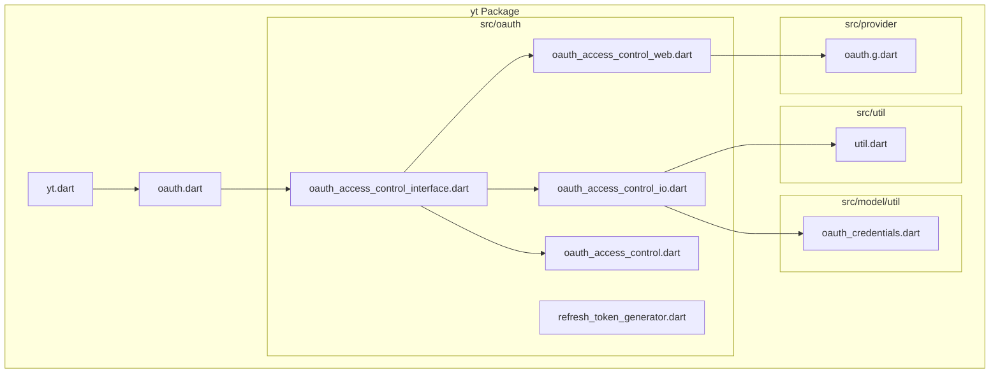
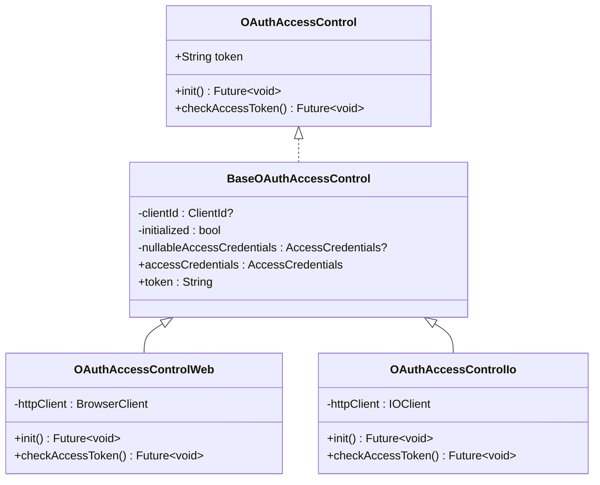
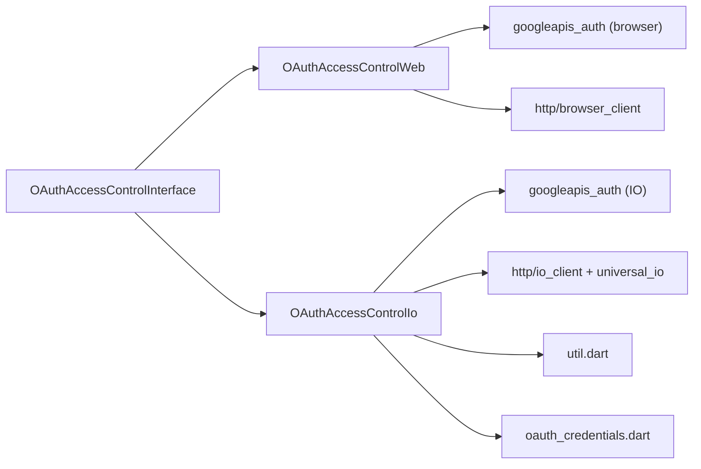

# Platform-Specific Implementations

<cite>
**Referenced Files in This Document**
- [oauth.dart](file://packages/yt/lib/oauth.dart)
- [oauth_access_control_interface.dart](file://packages/yt/lib/src/oauth/oauth_access_control_interface.dart)
- [oauth_access_control_web.dart](file://packages/yt/lib/src/oauth/oauth_access_control_web.dart)
- [oauth_access_control_io.dart](file://packages/yt/lib/src/oauth/oauth_access_control_io.dart)
- [oauth_access_control.dart](file://packages/yt/lib/src/oauth/oauth_access_control.dart)
- [util.dart](file://packages/yt/lib/src/util/util.dart)
- [oauth_credentials.dart](file://packages/yt/lib/src/model/util/oauth_credentials.dart)
- [oauth.g.dart](file://packages/yt/lib/src/provider/oauth.g.dart)
- [yt.dart](file://packages/yt/lib/yt.dart)
- [youtube_authorize_command.dart](file://packages/yt_cli/lib/src/cmd/youtube_authorize_command.dart)
</cite>

## Table of Contents
1. [Introduction](#introduction)
2. [Project Structure](#project-structure)
3. [Core Components](#core-components)
4. [Architecture Overview](#architecture-overview)
5. [Detailed Component Analysis](#detailed-component-analysis)
6. [Dependency Analysis](#dependency-analysis)
7. [Performance Considerations](#performance-considerations)
8. [Troubleshooting Guide](#troubleshooting-guide)
9. [Conclusion](#conclusion)
10. [Appendices](#appendices)

## Introduction
This document explains the platform-specific OAuth implementations in the YouTube API Dart SDK. It compares the browser-based OAuthAccessControlWeb and the native Dart OAuthAccessControlIo implementations, covering authentication mechanisms, storage capabilities, user interaction patterns, and platform-specific configuration. It also documents browser-based OAuth flows for web applications (popup handling, redirect-based flows, and iframe considerations), native Dart specifics for server-side applications (credential file handling, service account authentication, and headless environment considerations), cross-platform compatibility, conditional imports, and runtime platform detection.

## Project Structure
The OAuth implementation is organized around a shared interface with platform-specific implementations selected at compile-time using conditional imports. The core files are located under packages/yt/lib/src/oauth, with supporting utilities and model definitions under packages/yt/lib/src/util and packages/yt/lib/src/model/util.

**Diagram sources**
- [yt.dart:1-75](file://packages/yt/lib/yt.dart#L1-L75)
- [oauth.dart:1-6](file://packages/yt/lib/oauth.dart#L1-L6)
- [oauth_access_control_interface.dart:1-33](file://packages/yt/lib/src/oauth/oauth_access_control_interface.dart#L1-L33)
- [oauth_access_control_web.dart:1-41](file://packages/yt/lib/src/oauth/oauth_access_control_web.dart#L1-L41)
- [oauth_access_control_io.dart:1-80](file://packages/yt/lib/src/oauth/oauth_access_control_io.dart#L1-L80)
- [oauth_access_control.dart:1-7](file://packages/yt/lib/src/oauth/oauth_access_control.dart#L1-L7)
- [util.dart:1-104](file://packages/yt/lib/src/util/util.dart#L1-L104)
- [oauth_credentials.dart:1-54](file://packages/yt/lib/src/model/util/oauth_credentials.dart#L1-L54)
- [oauth.g.dart:1-22](file://packages/yt/lib/src/provider/oauth.g.dart#L1-L22)

**Section sources**
- [yt.dart:1-75](file://packages/yt/lib/yt.dart#L1-L75)
- [oauth.dart:1-6](file://packages/yt/lib/oauth.dart#L1-L6)
- [oauth_access_control_interface.dart:1-33](file://packages/yt/lib/src/oauth/oauth_access_control_interface.dart#L1-L33)
- [oauth_access_control_web.dart:1-41](file://packages/yt/lib/src/oauth/oauth_access_control_web.dart#L1-L41)
- [oauth_access_control_io.dart:1-80](file://packages/yt/lib/src/oauth/oauth_access_control_io.dart#L1-L80)
- [oauth_access_control.dart:1-7](file://packages/yt/lib/src/oauth/oauth_access_control.dart#L1-L7)
- [util.dart:1-104](file://packages/yt/lib/src/util/util.dart#L1-L104)
- [oauth_credentials.dart:1-54](file://packages/yt/lib/src/model/util/oauth_credentials.dart#L1-L54)
- [oauth.g.dart:1-22](file://packages/yt/lib/src/provider/oauth.g.dart#L1-L22)

## Core Components
- OAuthAccessControlInterface: Defines the contract for OAuth access control and delegates to platform-specific implementations via conditional imports.
- OAuthAccessControlWeb: Browser-based implementation using the browser HTTP client and Google Auth browser utilities.
- OAuthAccessControlIo: Native Dart implementation for server/desktop environments, including credential file handling and user consent flows.
- Utilities and Models: Support for credential file locations, YAML/JSON parsing, and provider configuration.

Key responsibilities:
- Token retrieval and lifecycle management
- Initialization and refresh of access credentials
- Storage of access credentials on disk (Io)
- Platform-specific HTTP clients and user prompts

**Section sources**
- [oauth_access_control_interface.dart:7-32](file://packages/yt/lib/src/oauth/oauth_access_control_interface.dart#L7-L32)
- [oauth_access_control_web.dart:6-41](file://packages/yt/lib/src/oauth/oauth_access_control_web.dart#L6-L41)
- [oauth_access_control_io.dart:10-80](file://packages/yt/lib/src/oauth/oauth_access_control_io.dart#L10-L80)
- [util.dart:63-66](file://packages/yt/lib/src/util/util.dart#L63-L66)
- [oauth_credentials.dart:10-54](file://packages/yt/lib/src/model/util/oauth_credentials.dart#L10-L54)

## Architecture Overview
The OAuth subsystem uses a factory method that selects the appropriate implementation based on the Dart platform at compile-time. The browser implementation relies on browser HTTP client and browser-based OAuth flows. The Io implementation uses an IO HTTP client, reads/writes credentials to disk, and initiates user-consent flows when necessary.

**Diagram sources**
- [oauth_access_control_interface.dart:7-32](file://packages/yt/lib/src/oauth/oauth_access_control_interface.dart#L7-L32)
- [oauth_access_control_web.dart:9-41](file://packages/yt/lib/src/oauth/oauth_access_control_web.dart#L9-L41)
- [oauth_access_control_io.dart:13-80](file://packages/yt/lib/src/oauth/oauth_access_control_io.dart#L13-L80)

## Detailed Component Analysis

### OAuthAccessControlInterface and Conditional Imports
- The interface defines the token property, initialization, and access token refresh logic.
- Conditional imports select OAuthAccessControlWeb for dart.library.html and OAuthAccessControlIo for dart.library.io at compile-time.
- A default stub implementation throws if invoked on unsupported platforms.

Implementation highlights:
- Factory delegates to getOAuthAccessControl, which resolves to the platform-specific class.
- BaseOAuthAccessControl centralizes shared state and access to credentials.

**Section sources**
- [oauth_access_control_interface.dart:3-6](file://packages/yt/lib/src/oauth/oauth_access_control_interface.dart#L3-L6)
- [oauth_access_control_interface.dart:7-32](file://packages/yt/lib/src/oauth/oauth_access_control_interface.dart#L7-L32)
- [oauth_access_control.dart:5-7](file://packages/yt/lib/src/oauth/oauth_access_control.dart#L5-L7)

### OAuthAccessControlWeb (Browser)
- Uses a browser HTTP client and browser-based OAuth utilities.
- Initializes by requesting access credentials with the required YouTube scope.
- Refreshes tokens automatically when expiration is detected.

Key behaviors:
- Requires a ClientId to be provided during construction.
- Uses requestAccessCredentials and refreshCredentials from the browser auth utilities.
- Exposes the current access token via the token property.

Limitations and considerations:
- Requires a browser environment.
- Relies on browser OAuth flows; popup/redirect handling is managed by the underlying browser utilities.

**Section sources**
- [oauth_access_control_web.dart:6-41](file://packages/yt/lib/src/oauth/oauth_access_control_web.dart#L6-L41)

### OAuthAccessControlIo (Native/Dart VM)
- Reads default credentials from a user-scoped JSON/YAML file.
- Persists access credentials to a separate file in the user’s home directory.
- Initiates user consent flow when no stored access credentials are present.
- Refreshes tokens automatically when expiration is detected.

Key behaviors:
- Resolves ClientId from a default credentials file if not provided.
- Writes access credentials to a file in the user’s home directory under a hidden folder.
- Prints a URL for user consent and writes the resulting credentials to disk.

Headless considerations:
- Requires manual intervention to approve consent in non-browser environments.
- Suitable for CLI tools and server-side applications.

**Section sources**
- [oauth_access_control_io.dart:10-80](file://packages/yt/lib/src/oauth/oauth_access_control_io.dart#L10-L80)
- [util.dart:63-66](file://packages/yt/lib/src/util/util.dart#L63-L66)
- [oauth_credentials.dart:19-45](file://packages/yt/lib/src/model/util/oauth_credentials.dart#L19-L45)

### Credential Models and Provider Configuration
- OAuthCredentials supports loading from YAML/JSON and exposes a ClientId getter.
- Provider stub for OAuth accounts endpoint is generated and sets a default base URL.

Practical implications:
- Credentials can be provided via YAML/JSON files and loaded programmatically.
- Provider configuration is prepared for OAuth-related endpoints.

**Section sources**
- [oauth_credentials.dart:10-54](file://packages/yt/lib/src/model/util/oauth_credentials.dart#L10-L54)
- [oauth.g.dart:13-22](file://packages/yt/lib/src/provider/oauth.g.dart#L13-L22)

### Authorization Workflow (CLI)
- The CLI command demonstrates end-to-end authorization using OAuthAccessControl.
- It optionally overwrites existing access credentials, collects client ID and secret, persists default credentials, initializes OAuthAccessControl, and closes the HTTP client.

Operational notes:
- Ensures a ClientId is available before initializing OAuthAccessControl.
- Useful pattern for headless environments requiring interactive consent.

**Section sources**
- [youtube_authorize_command.dart:47-88](file://packages/yt_cli/lib/src/cmd/youtube_authorize_command.dart#L47-L88)

## Dependency Analysis
The OAuth subsystem depends on:
- googleapis_auth for OAuth utilities (requestAccessCredentials, refreshCredentials, obtainAccessCredentialsViaUserConsent)
- http clients (browser_client for web, io_client for native)
- universal_io for file operations
- json/yaml parsing for credential files

**Diagram sources**
- [oauth_access_control_interface.dart:1-6](file://packages/yt/lib/src/oauth/oauth_access_control_interface.dart#L1-L6)
- [oauth_access_control_web.dart:1-2](file://packages/yt/lib/src/oauth/oauth_access_control_web.dart#L1-L2)
- [oauth_access_control_io.dart:1-7](file://packages/yt/lib/src/oauth/oauth_access_control_io.dart#L1-L7)
- [util.dart:1-104](file://packages/yt/lib/src/util/util.dart#L1-L104)
- [oauth_credentials.dart:1-7](file://packages/yt/lib/src/model/util/oauth_credentials.dart#L1-L7)

**Section sources**
- [oauth_access_control_interface.dart:1-6](file://packages/yt/lib/src/oauth/oauth_access_control_interface.dart#L1-L6)
- [oauth_access_control_web.dart:1-2](file://packages/yt/lib/src/oauth/oauth_access_control_web.dart#L1-L2)
- [oauth_access_control_io.dart:1-7](file://packages/yt/lib/src/oauth/oauth_access_control_io.dart#L1-L7)
- [util.dart:1-104](file://packages/yt/lib/src/util/util.dart#L1-L104)
- [oauth_credentials.dart:1-7](file://packages/yt/lib/src/model/util/oauth_credentials.dart#L1-L7)

## Performance Considerations
- Token refresh occurs on-demand when expiration is detected, minimizing unnecessary network calls.
- Browser implementation leverages the browser’s built-in OAuth handling, reducing overhead.
- Io implementation performs local file I/O; ensure credentials are cached appropriately to avoid repeated disk writes.
- Scope requests are minimal (YouTube SSL scope), keeping consent and refresh operations efficient.

## Troubleshooting Guide
Common issues and resolutions:
- Missing ClientId in browser builds: Ensure a ClientId is provided; otherwise initialization will fail.
- No stored access credentials in Io builds: The first run triggers a user-consent flow; ensure the printed URL is opened and approved.
- Headless environments: Provide default credentials or pre-provision access credentials to avoid interactive prompts.
- File permissions: Verify write access to the user’s home directory for storing credentials.
- Expiration handling: checkAccessToken automatically refreshes tokens; ensure network connectivity and proper time synchronization.

**Section sources**
- [oauth_access_control_web.dart:14-24](file://packages/yt/lib/src/oauth/oauth_access_control_web.dart#L14-L24)
- [oauth_access_control_io.dart:34-63](file://packages/yt/lib/src/oauth/oauth_access_control_io.dart#L34-L63)
- [util.dart:63-66](file://packages/yt/lib/src/util/util.dart#L63-L66)

## Conclusion
The YouTube API Dart SDK provides a clean abstraction for OAuth across platforms. OAuthAccessControlInterface delegates to platform-specific implementations, enabling seamless browser and native Dart usage. Browser builds rely on browser OAuth utilities, while Io builds manage credentials locally and support user-consent flows. The design supports headless environments with optional pre-provisioning of credentials and robust token refresh logic.

## Appendices

### Browser-Based OAuth Flow (Web Applications)
- Popup handling: The browser implementation uses browser OAuth utilities; popups are managed by the underlying browser libraries.
- Redirect-based flows: The browser utilities handle redirect URIs and token exchange transparently.
- Iframe considerations: When embedding in iframes, ensure third-party cookies and cross-origin restrictions are configured to allow OAuth redirects.

**Section sources**
- [oauth_access_control_web.dart:14-24](file://packages/yt/lib/src/oauth/oauth_access_control_web.dart#L14-L24)

### Native Dart Implementation (Server/Desktop)
- Credential file handling: Default credentials are loaded from a user-scoped JSON/YAML file; access credentials are persisted to a separate file.
- Service account authentication: Not demonstrated in the referenced files; typical implementations use service account credentials via googleapis_auth utilities.
- Headless environment considerations: Requires manual consent on first run; subsequent runs refresh tokens silently.

**Section sources**
- [oauth_access_control_io.dart:23-63](file://packages/yt/lib/src/oauth/oauth_access_control_io.dart#L23-L63)
- [util.dart:63-66](file://packages/yt/lib/src/util/util.dart#L63-L66)
- [oauth_credentials.dart:19-45](file://packages/yt/lib/src/model/util/oauth_credentials.dart#L19-L45)

### Cross-Platform Compatibility and Runtime Detection
- Conditional imports select OAuthAccessControlWeb for dart.library.html and OAuthAccessControlIo for dart.library.io.
- The default stub implementation throws if invoked on unsupported platforms, preventing silent failures.

**Section sources**
- [oauth_access_control_interface.dart:3-6](file://packages/yt/lib/src/oauth/oauth_access_control_interface.dart#L3-L6)
- [oauth_access_control.dart:5-7](file://packages/yt/lib/src/oauth/oauth_access_control.dart#L5-L7)

### End-to-End Authorization Pattern (CLI)
- Demonstrates collecting client credentials, persisting defaults, initializing OAuthAccessControl, and completing authorization.

**Section sources**
- [youtube_authorize_command.dart:47-88](file://packages/yt_cli/lib/src/cmd/youtube_authorize_command.dart#L47-L88)