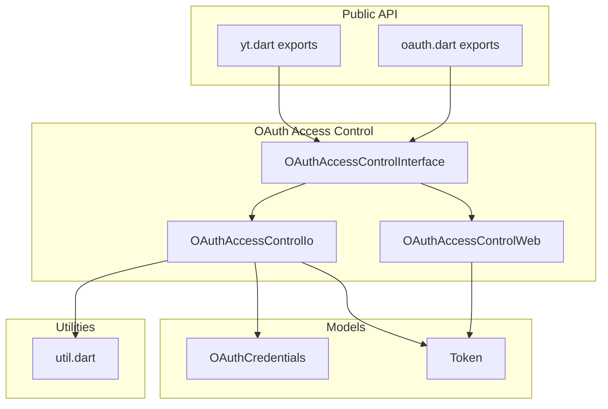
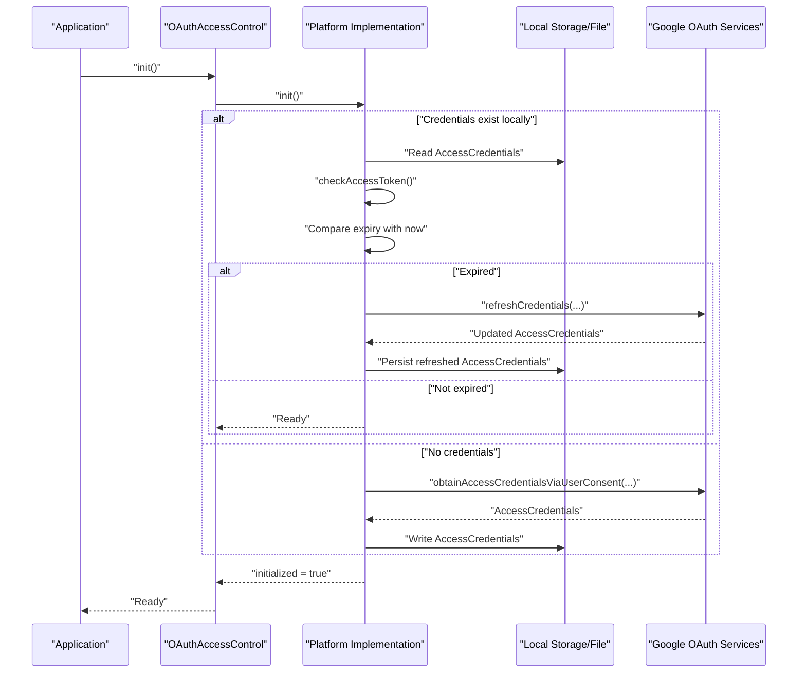
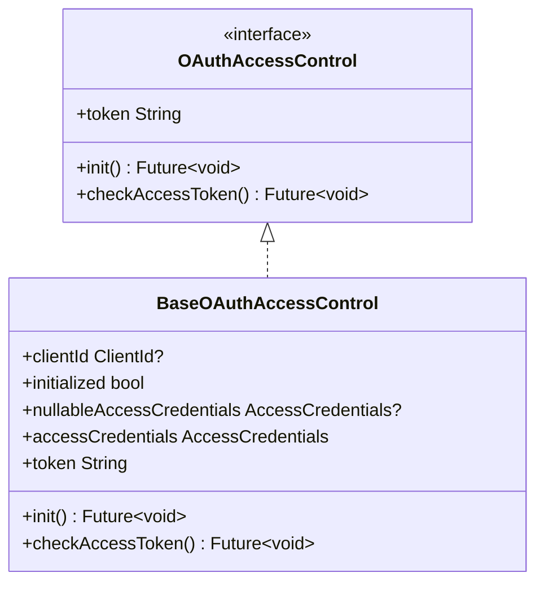
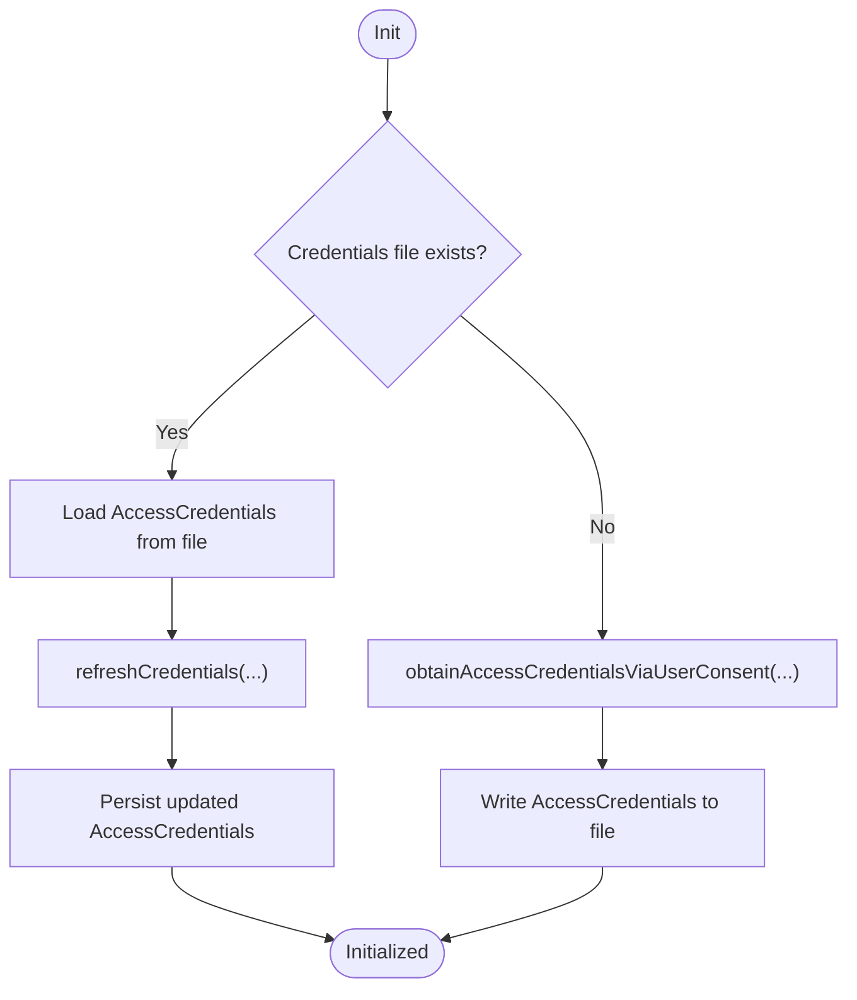
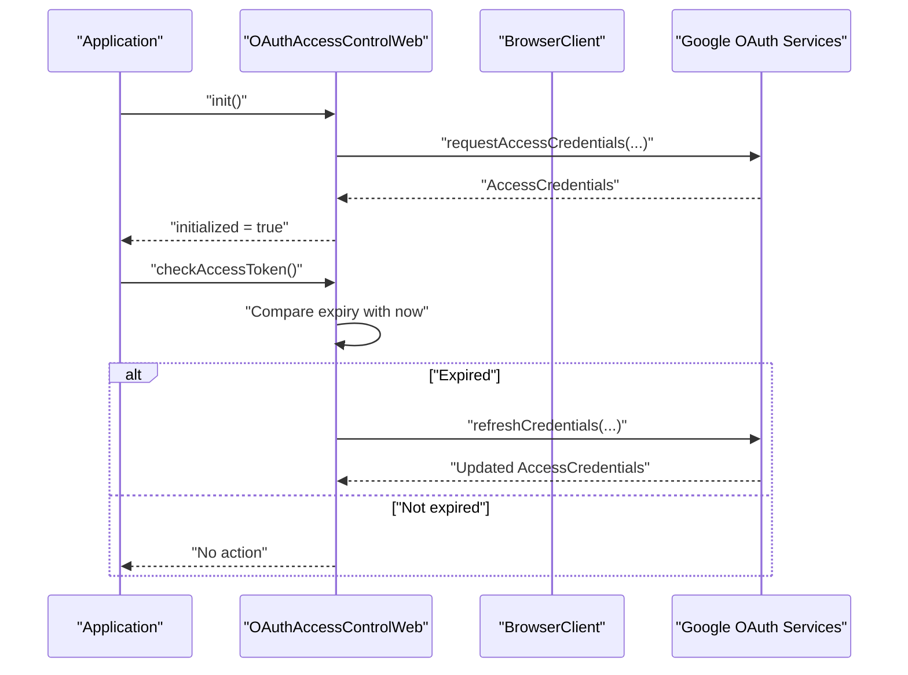
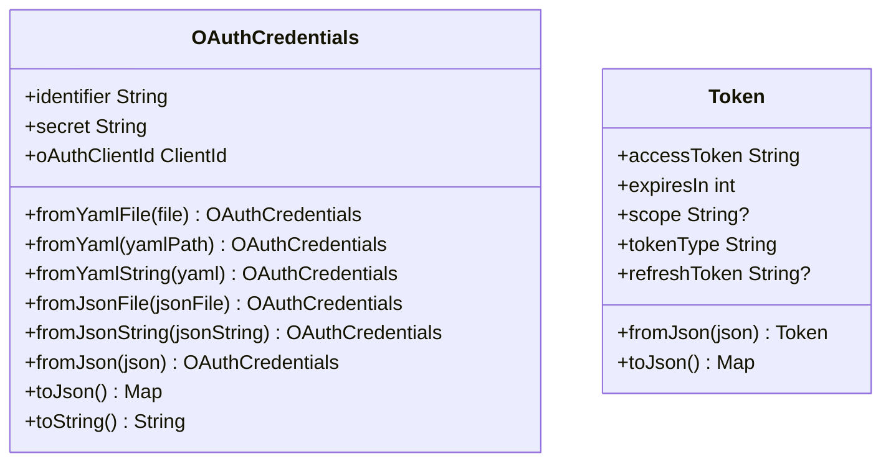
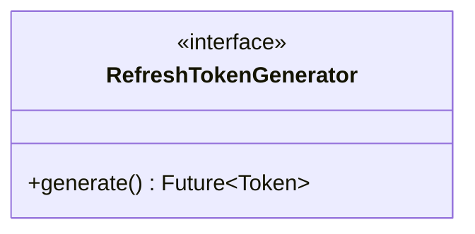
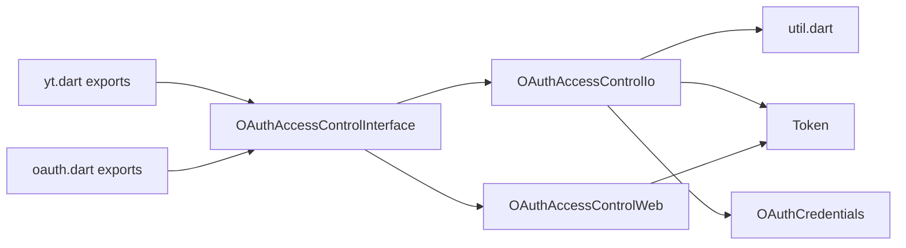

# Token Management

<cite>
**Referenced Files in This Document**
- [oauth.dart](file://packages/yt/lib/oauth.dart)
- [yt.dart](file://packages/yt/lib/yt.dart)
- [oauth_access_control_interface.dart](file://packages/yt/lib/src/oauth/oauth_access_control_interface.dart)
- [oauth_access_control_io.dart](file://packages/yt/lib/src/oauth/oauth_access_control_io.dart)
- [oauth_access_control_web.dart](file://packages/yt/lib/src/oauth/oauth_access_control_web.dart)
- [refresh_token_generator.dart](file://packages/yt/lib/src/oauth/refresh_token_generator.dart)
- [oauth_credentials.dart](file://packages/yt/lib/src/model/util/oauth_credentials.dart)
- [token.dart](file://packages/yt/lib/src/model/util/token.dart)
- [util.dart](file://packages/yt/lib/src/util/util.dart)
</cite>

## Table of Contents
1. [Introduction](#introduction)
2. [Project Structure](#project-structure)
3. [Core Components](#core-components)
4. [Architecture Overview](#architecture-overview)
5. [Detailed Component Analysis](#detailed-component-analysis)
6. [Dependency Analysis](#dependency-analysis)
7. [Performance Considerations](#performance-considerations)
8. [Troubleshooting Guide](#troubleshooting-guide)
9. [Conclusion](#conclusion)

## Introduction
This document explains OAuth token management in the YouTube API Dart SDK with a focus on access token storage, refresh token handling, and automatic renewal. It covers the AccessCredentials object structure, token expiration detection, and secure storage options across platforms. Practical guidance is provided for persisting tokens on native (mobile/desktop) and web environments, validating tokens, and managing the token lifecycle securely.

## Project Structure
The token management implementation is organized around platform-specific access control and shared model classes:
- Platform abstraction: OAuthAccessControl with platform-specific implementations for IO and Web
- Credential models: OAuthCredentials and Token for client and token payloads
- Utilities: Shared utilities for file paths and platform helpers
- Exports: Public API surface for OAuth-related functionality

**Diagram sources**
- [yt.dart:1-75](file://packages/yt/lib/yt.dart#L1-L75)
- [oauth.dart:1-6](file://packages/yt/lib/oauth.dart#L1-L6)
- [oauth_access_control_interface.dart:1-33](file://packages/yt/lib/src/oauth/oauth_access_control_interface.dart#L1-L33)
- [oauth_access_control_io.dart:1-80](file://packages/yt/lib/src/oauth/oauth_access_control_io.dart#L1-L80)
- [oauth_access_control_web.dart:1-41](file://packages/yt/lib/src/oauth/oauth_access_control_web.dart#L1-L41)
- [oauth_credentials.dart:1-55](file://packages/yt/lib/src/model/util/oauth_credentials.dart#L1-L55)
- [token.dart:1-29](file://packages/yt/lib/src/model/util/token.dart#L1-L29)
- [util.dart](file://packages/yt/lib/src/util/util.dart)

**Section sources**
- [yt.dart:1-75](file://packages/yt/lib/yt.dart#L1-L75)
- [oauth.dart:1-6](file://packages/yt/lib/oauth.dart#L1-L6)

## Core Components
- OAuthAccessControl: Abstract interface defining token retrieval and initialization, plus a base implementation that exposes AccessCredentials and an accessor for the current access token string.
- OAuthAccessControlIo: Native/desktop implementation that reads/writes AccessCredentials to a local file, obtains credentials via user consent when missing, and refreshes tokens automatically when expired.
- OAuthAccessControlWeb: Browser implementation that requests credentials via the browser’s OAuth flow and refreshes tokens when needed.
- OAuthCredentials: Serializable client credentials container for OAuth client ID and secret, with YAML/JSON loading helpers.
- Token: Serializable token payload including access_token, expires_in, token_type, optional scope, and optional refresh_token.
- RefreshTokenGenerator: Abstraction for generating a new Token when a refresh is required.

These components collectively implement secure, platform-aware token lifecycle management.

**Section sources**
- [oauth_access_control_interface.dart:1-33](file://packages/yt/lib/src/oauth/oauth_access_control_interface.dart#L1-L33)
- [oauth_access_control_io.dart:1-80](file://packages/yt/lib/src/oauth/oauth_access_control_io.dart#L1-L80)
- [oauth_access_control_web.dart:1-41](file://packages/yt/lib/src/oauth/oauth_access_control_web.dart#L1-L41)
- [oauth_credentials.dart:1-55](file://packages/yt/lib/src/model/util/oauth_credentials.dart#L1-L55)
- [token.dart:1-29](file://packages/yt/lib/src/model/util/token.dart#L1-L29)
- [refresh_token_generator.dart:1-6](file://packages/yt/lib/src/oauth/refresh_token_generator.dart#L1-L6)

## Architecture Overview
The SDK uses a platform-targeted access control layer to manage OAuth credentials and tokens. Initialization either loads persisted credentials or triggers user consent to obtain them. Automatic renewal occurs when the stored access token is expired.

**Diagram sources**
- [oauth_access_control_interface.dart:10-16](file://packages/yt/lib/src/oauth/oauth_access_control_interface.dart#L10-L16)
- [oauth_access_control_io.dart:33-63](file://packages/yt/lib/src/oauth/oauth_access_control_io.dart#L33-L63)
- [oauth_access_control_web.dart:14-24](file://packages/yt/lib/src/oauth/oauth_access_control_web.dart#L14-L24)

## Detailed Component Analysis

### OAuthAccessControl and BaseOAuthAccessControl
- Purpose: Define the contract for token access and initialization, and provide a base implementation that manages AccessCredentials and exposes the current access token string.
- Key behaviors:
  - Lazy initialization flag and exception when accessed before init
  - AccessCredentials getter that throws if uninitialized
  - token property delegating to the underlying AccessCredentials

**Diagram sources**
- [oauth_access_control_interface.dart:7-32](file://packages/yt/lib/src/oauth/oauth_access_control_interface.dart#L7-L32)

**Section sources**
- [oauth_access_control_interface.dart:7-32](file://packages/yt/lib/src/oauth/oauth_access_control_interface.dart#L7-L32)

### OAuthAccessControlIo (Native/Desktop)
- Purpose: Manage OAuth credentials on native/desktop platforms with persistent storage.
- Key behaviors:
  - Reads/writes AccessCredentials to a user-scoped file path resolved via shared utilities
  - Initializes by loading existing credentials or prompting user consent to obtain them
  - Automatically refreshes credentials when the access token is expired
  - Uses an IO HTTP client for network operations

**Diagram sources**
- [oauth_access_control_io.dart:33-63](file://packages/yt/lib/src/oauth/oauth_access_control_io.dart#L33-L63)

**Section sources**
- [oauth_access_control_io.dart:13-80](file://packages/yt/lib/src/oauth/oauth_access_control_io.dart#L13-L80)
- [util.dart](file://packages/yt/lib/src/util/util.dart)

### OAuthAccessControlWeb (Browser)
- Purpose: Manage OAuth credentials in a browser environment.
- Key behaviors:
  - Requests AccessCredentials via the browser OAuth flow
  - Automatically refreshes credentials when the access token is expired
  - Uses a browser HTTP client for network operations

**Diagram sources**
- [oauth_access_control_web.dart:14-40](file://packages/yt/lib/src/oauth/oauth_access_control_web.dart#L14-L40)

**Section sources**
- [oauth_access_control_web.dart:9-41](file://packages/yt/lib/src/oauth/oauth_access_control_web.dart#L9-L41)

### OAuthCredentials and Token Models
- OAuthCredentials:
  - Holds OAuth client identifier and secret
  - Provides constructors for YAML/JSON loading
  - Exposes a ClientId getter for downstream auth libraries
- Token:
  - Serializable representation of OAuth token payload
  - Includes access_token, expires_in, token_type, optional scope, and optional refresh_token

**Diagram sources**
- [oauth_credentials.dart:10-54](file://packages/yt/lib/src/model/util/oauth_credentials.dart#L10-L54)
- [token.dart:5-28](file://packages/yt/lib/src/model/util/token.dart#L5-L28)

**Section sources**
- [oauth_credentials.dart:10-54](file://packages/yt/lib/src/model/util/oauth_credentials.dart#L10-L54)
- [token.dart:5-28](file://packages/yt/lib/src/model/util/token.dart#L5-L28)

### RefreshTokenGenerator
- Purpose: Abstraction for generating a new Token when a refresh is required.
- Usage: Integrates with token refresh flows to produce updated token payloads.

**Diagram sources**
- [refresh_token_generator.dart:3-5](file://packages/yt/lib/src/oauth/refresh_token_generator.dart#L3-L5)

**Section sources**
- [refresh_token_generator.dart:1-6](file://packages/yt/lib/src/oauth/refresh_token_generator.dart#L1-L6)

## Dependency Analysis
- Platform selection: The interface chooses the appropriate implementation based on the runtime environment (IO vs Web).
- Data models: AccessCredentials and Token are used across implementations for serialization and refresh operations.
- Utilities: Shared utilities provide platform-specific paths for credential storage on native/desktop.

**Diagram sources**
- [oauth_access_control_interface.dart:3-5](file://packages/yt/lib/src/oauth/oauth_access_control_interface.dart#L3-L5)
- [oauth_access_control_io.dart:1-80](file://packages/yt/lib/src/oauth/oauth_access_control_io.dart#L1-L80)
- [oauth_access_control_web.dart:1-41](file://packages/yt/lib/src/oauth/oauth_access_control_web.dart#L1-L41)
- [yt.dart:1-75](file://packages/yt/lib/yt.dart#L1-L75)
- [oauth.dart:1-6](file://packages/yt/lib/oauth.dart#L1-L6)
- [util.dart](file://packages/yt/lib/src/util/util.dart)
- [oauth_credentials.dart:1-55](file://packages/yt/lib/src/model/util/oauth_credentials.dart#L1-L55)
- [token.dart:1-29](file://packages/yt/lib/src/model/util/token.dart#L1-L29)

**Section sources**
- [oauth_access_control_interface.dart:3-5](file://packages/yt/lib/src/oauth/oauth_access_control_interface.dart#L3-L5)
- [oauth_access_control_io.dart:1-80](file://packages/yt/lib/src/oauth/oauth_access_control_io.dart#L1-L80)
- [oauth_access_control_web.dart:1-41](file://packages/yt/lib/src/oauth/oauth_access_control_web.dart#L1-L41)
- [yt.dart:1-75](file://packages/yt/lib/yt.dart#L1-L75)
- [oauth.dart:1-6](file://packages/yt/lib/oauth.dart#L1-L6)

## Performance Considerations
- Minimize disk I/O: Persist only after successful refresh to avoid frequent writes.
- Efficient expiry checks: Compare expiry timestamps once per request cycle and cache AccessCredentials until refresh is needed.
- Network efficiency: Reuse HTTP clients across operations to reduce overhead.
- Avoid blocking UI: Perform initialization and refresh off the UI thread on mobile/web.

## Troubleshooting Guide
Common issues and resolutions:
- Uninitialized access: Ensure init() completes successfully before accessing token or performing operations.
- Expired token errors: Call checkAccessToken() to refresh credentials automatically; handle exceptions from refresh flows gracefully.
- Missing credentials file (native/desktop): On first run, consent-based initialization will write the file; verify file permissions and path resolution.
- Browser storage limitations: On web, rely on the browser’s OAuth flow and session storage; ensure cookies and local storage are enabled.
- Serialization failures: Validate JSON/YAML payloads for OAuthCredentials and Token; confirm keys match expected schema.

Operational references:
- Initialization and persistence logic for native/desktop
- Browser OAuth flow and refresh logic
- Token expiry comparison and refresh invocation

**Section sources**
- [oauth_access_control_io.dart:33-78](file://packages/yt/lib/src/oauth/oauth_access_control_io.dart#L33-L78)
- [oauth_access_control_web.dart:14-40](file://packages/yt/lib/src/oauth/oauth_access_control_web.dart#L14-L40)

## Conclusion
The SDK provides a robust, platform-aware OAuth token management system. It supports secure, automatic token renewal and integrates seamlessly with native and browser environments. By leveraging AccessCredentials and Token models, and using platform-specific access control implementations, applications can reliably maintain authenticated sessions with the YouTube APIs while following security best practices.