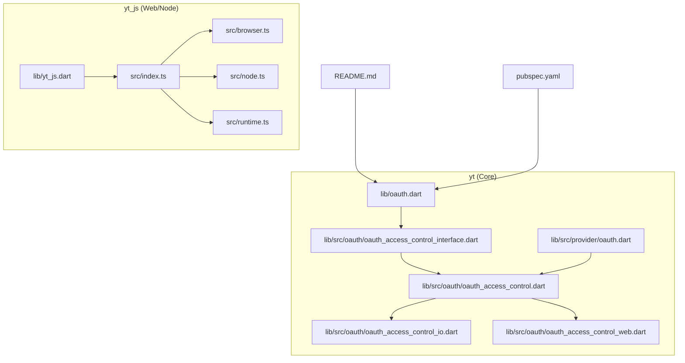
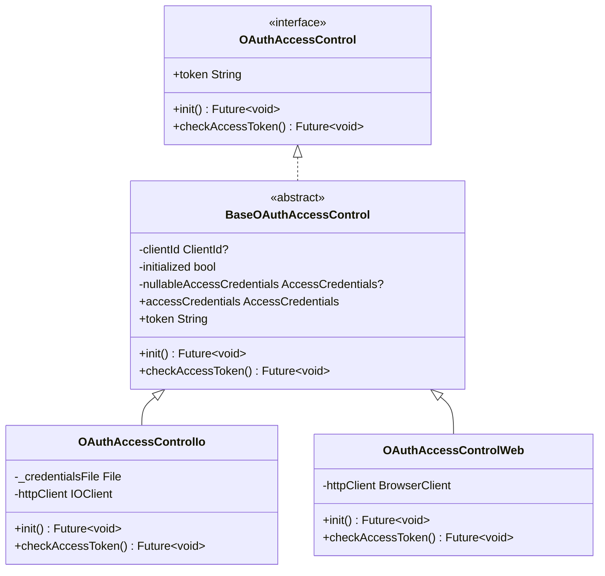
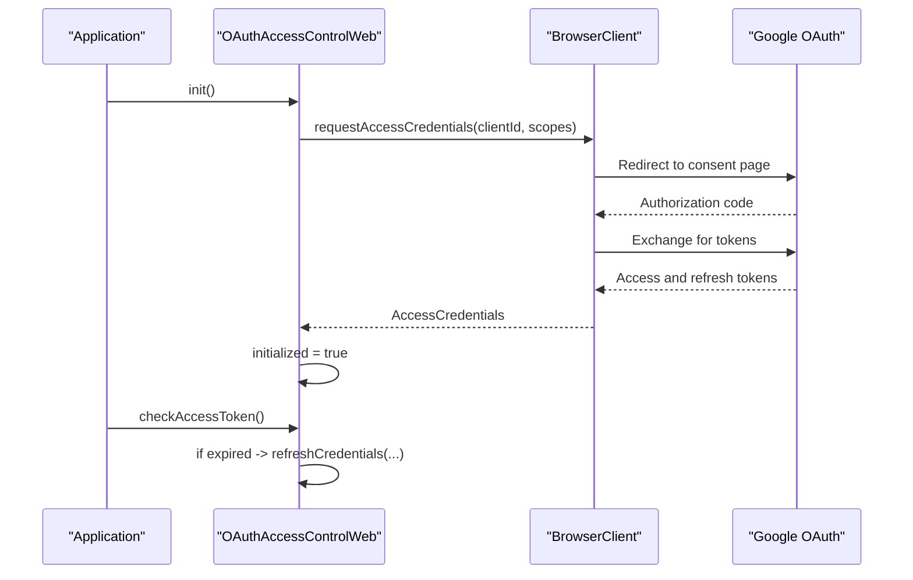
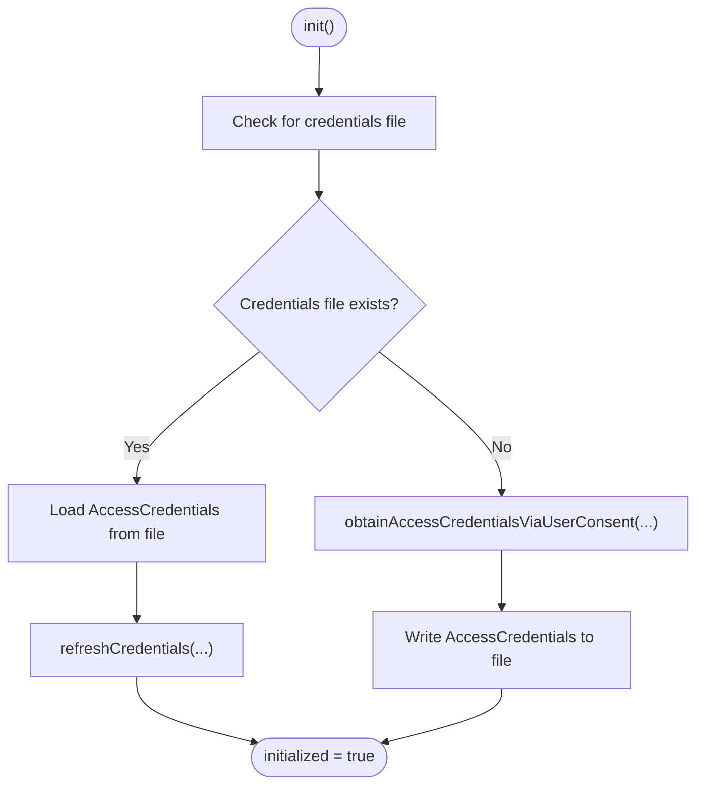
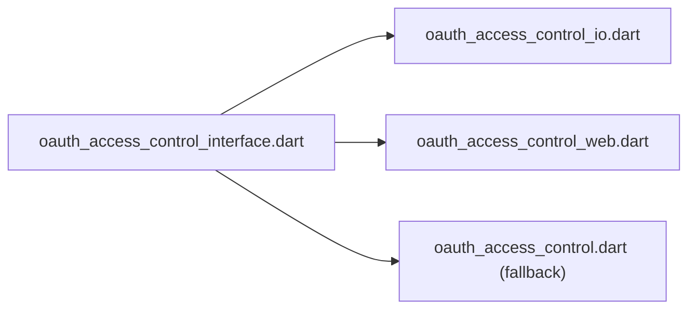
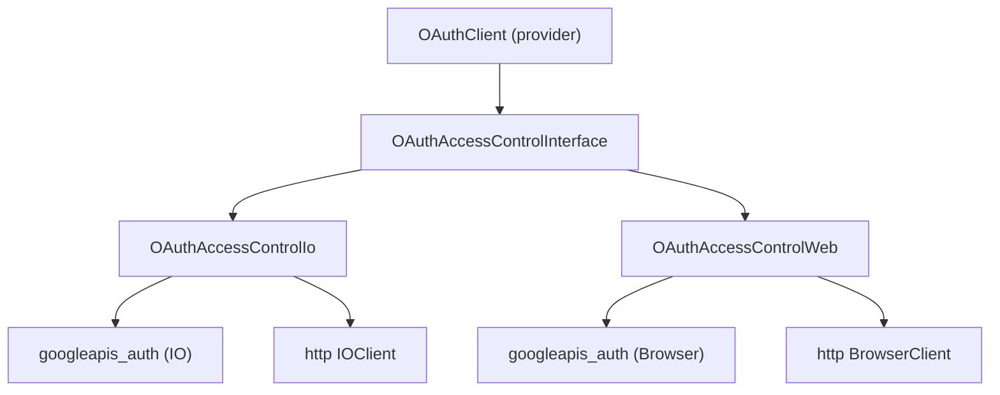

# Platform-Specific Considerations

<cite>
**Referenced Files in This Document**
- [README.md](file://README.md)
- [pubspec.yaml](file://pubspec.yaml)
- [oauth.dart](file://packages/yt/lib/oauth.dart)
- [oauth_access_control_interface.dart](file://packages/yt/lib/src/oauth/oauth_access_control_interface.dart)
- [oauth_access_control.dart](file://packages/yt/lib/src/oauth/oauth_access_control.dart)
- [oauth_access_control_io.dart](file://packages/yt/lib/src/oauth/oauth_access_control_io.dart)
- [oauth_access_control_web.dart](file://packages/yt/lib/src/oauth/oauth_access_control_web.dart)
- [oauth.dart (provider)](file://packages/yt/lib/src/provider/oauth.dart)
- [yt_js.dart](file://packages/yt_js/lib/yt_js.dart)
- [index.ts (yt_js)](file://packages/yt_js/src/index.ts)
- [browser.ts (yt_js)](file://packages/yt_js/src/browser.ts)
- [node.ts (yt_js)](file://packages/yt_js/src/node.ts)
- [runtime.ts (yt_js)](file://packages/yt_js/src/runtime.ts)
</cite>

## Table of Contents
1. [Introduction](#introduction)
2. [Project Structure](#project-structure)
3. [Core Components](#core-components)
4. [Architecture Overview](#architecture-overview)
5. [Detailed Component Analysis](#detailed-component-analysis)
6. [Dependency Analysis](#dependency-analysis)
7. [Performance Considerations](#performance-considerations)
8. [Troubleshooting Guide](#troubleshooting-guide)
9. [Conclusion](#conclusion)

## Introduction
This document explains platform-specific authentication considerations for the YouTube API Dart SDK, focusing on how OAuth is implemented differently for web browsers versus native Dart applications. It covers browser-specific handling (redirect URIs, local storage, CORS), native application credential storage and token persistence, and provides practical guidance for common issues such as CORS, browser compatibility, and native app security requirements.

## Project Structure
The repository is a Melos-managed workspace containing multiple packages. Authentication logic is primarily implemented in the core yt package under the oauth directory, with platform selection handled via conditional imports. The yt_js package provides JavaScript/TypeScript bindings for web and Node.js environments.

**Diagram sources**
- [oauth.dart:1-6](file://packages/yt/lib/oauth.dart#L1-L6)
- [oauth_access_control_interface.dart:1-33](file://packages/yt/lib/src/oauth/oauth_access_control_interface.dart#L1-L33)
- [oauth_access_control.dart:1-7](file://packages/yt/lib/src/oauth/oauth_access_control.dart#L1-L7)
- [oauth_access_control_io.dart:1-80](file://packages/yt/lib/src/oauth/oauth_access_control_io.dart#L1-L80)
- [oauth_access_control_web.dart:1-41](file://packages/yt/lib/src/oauth/oauth_access_control_web.dart#L1-L41)
- [oauth.dart (provider):1-17](file://packages/yt/lib/src/provider/oauth.dart#L1-L17)
- [yt_js.dart:1-14](file://packages/yt_js/lib/yt_js.dart#L1-L14)
- [index.ts (yt_js)](file://packages/yt_js/src/index.ts)
- [browser.ts (yt_js)](file://packages/yt_js/src/browser.ts)
- [node.ts (yt_js)](file://packages/yt_js/src/node.ts)
- [runtime.ts (yt_js)](file://packages/yt_js/src/runtime.ts)
- [README.md:1-119](file://README.md#L1-L119)
- [pubspec.yaml:1-69](file://pubspec.yaml#L1-L69)

**Section sources**
- [README.md:1-119](file://README.md#L1-L119)
- [pubspec.yaml:1-69](file://pubspec.yaml#L1-L69)
- [oauth.dart:1-6](file://packages/yt/lib/oauth.dart#L1-L6)

## Core Components
- OAuthAccessControlInterface: Defines the contract for OAuth access control across platforms, including initialization and token lifecycle checks.
- Platform-specific implementations:
  - OAuthAccessControlIo: Native/Dart VM implementation using filesystem-backed credentials and console-based consent flow.
  - OAuthAccessControlWeb: Browser implementation using browser client and requestAccessCredentials for OAuth flow.
- Provider OAuthClient: Retrofit-based client for token exchange endpoints used by the OAuth flow.

Key responsibilities:
- Token acquisition and refresh
- Client ID resolution (from JSON files or constructor)
- Credential persistence and expiry handling
- Platform-aware HTTP client usage

**Section sources**
- [oauth_access_control_interface.dart:1-33](file://packages/yt/lib/src/oauth/oauth_access_control_interface.dart#L1-L33)
- [oauth_access_control_io.dart:1-80](file://packages/yt/lib/src/oauth/oauth_access_control_io.dart#L1-L80)
- [oauth_access_control_web.dart:1-41](file://packages/yt/lib/src/oauth/oauth_access_control_web.dart#L1-L41)
- [oauth.dart (provider):1-17](file://packages/yt/lib/src/provider/oauth.dart#L1-L17)

## Architecture Overview
The SDK selects the appropriate OAuth implementation at runtime using conditional imports. On the web, OAuthAccessControlWeb is used; on native Dart, OAuthAccessControlIo is used. Both derive from BaseOAuthAccessControl and share common behaviors for token access and refresh.

**Diagram sources**
- [oauth_access_control_interface.dart:7-32](file://packages/yt/lib/src/oauth/oauth_access_control_interface.dart#L7-L32)
- [oauth_access_control_io.dart:13-79](file://packages/yt/lib/src/oauth/oauth_access_control_io.dart#L13-L79)
- [oauth_access_control_web.dart:9-40](file://packages/yt/lib/src/oauth/oauth_access_control_web.dart#L9-L40)

## Detailed Component Analysis

### Web Browser OAuth Implementation
- Initialization flow:
  - Requires a ClientId configured for the web environment.
  - Uses requestAccessCredentials with the configured scopes to initiate OAuth.
  - Stores credentials in a browser-compatible manner via the browser client.
- Token lifecycle:
  - checkAccessToken verifies expiry and refreshes tokens when needed using refreshCredentials.
- Redirect URI and consent:
  - The web implementation relies on the browser client’s OAuth handling; ensure the OAuth client configuration matches the registered redirect URI in Google Cloud Console.
- Local storage and cookies:
  - Credentials are stored by the browser client; avoid mixing with manual localStorage unless integrating with custom flows.
- Security considerations:
  - Restrict origins in Google Cloud Console OAuth client settings.
  - Prefer HTTPS for production deployments.
  - Avoid exposing ClientId in client-side code; use short-lived tokens and scopes minimally required.

**Diagram sources**
- [oauth_access_control_web.dart:14-40](file://packages/yt/lib/src/oauth/oauth_access_control_web.dart#L14-L40)

**Section sources**
- [oauth_access_control_web.dart:1-41](file://packages/yt/lib/src/oauth/oauth_access_control_web.dart#L1-L41)

### Native Dart Application OAuth Implementation
- Initialization flow:
  - Optionally reads default ClientId from a JSON file in the user’s home directory.
  - If credentials file exists, loads and refreshes tokens; otherwise, obtains user consent via a console prompt and saves credentials to disk.
- Credential storage:
  - Stores AccessCredentials in a JSON file under the user’s home directory for reuse.
- Token lifecycle:
  - checkAccessToken refreshes tokens when expired using refreshCredentials with an IOClient.
- Security considerations:
  - Keep the credentials file protected and restrict filesystem permissions.
  - Avoid committing credentials files to version control.
  - Rotate secrets and revoke tokens when compromised.

**Diagram sources**
- [oauth_access_control_io.dart:34-63](file://packages/yt/lib/src/oauth/oauth_access_control_io.dart#L34-L63)

**Section sources**
- [oauth_access_control_io.dart:1-80](file://packages/yt/lib/src/oauth/oauth_access_control_io.dart#L1-L80)

### Platform Selection and Conditional Imports
- The interface file conditionally imports platform-specific implementations:
  - dart.library.io -> oauth_access_control_io.dart
  - dart.library.html -> oauth_access_control_web.dart
- This ensures the correct OAuth implementation is used depending on the target platform.

**Diagram sources**
- [oauth_access_control_interface.dart:3-5](file://packages/yt/lib/src/oauth/oauth_access_control_interface.dart#L3-L5)
- [oauth_access_control.dart:5-6](file://packages/yt/lib/src/oauth/oauth_access_control.dart#L5-L6)

**Section sources**
- [oauth_access_control_interface.dart:1-6](file://packages/yt/lib/src/oauth/oauth_access_control_interface.dart#L1-L6)
- [oauth_access_control.dart:1-7](file://packages/yt/lib/src/oauth/oauth_access_control.dart#L1-L7)

### Provider OAuthClient (Token Exchange)
- Retrofit-based client for token exchange endpoints.
- Used internally by OAuth flows to exchange authorization codes for tokens when applicable.
- Configured with appropriate headers for form-encoded requests.

**Section sources**
- [oauth.dart (provider):1-17](file://packages/yt/lib/src/provider/oauth.dart#L1-L17)

### JavaScript/TypeScript Bindings (Web/Node)
- The yt_js package exposes a dart2js entry point and TypeScript surface for web and Node.js.
- The browser entry points and runtime helpers enable interoperability with web OAuth flows.

**Section sources**
- [yt_js.dart:1-14](file://packages/yt_js/lib/yt_js.dart#L1-L14)
- [index.ts (yt_js)](file://packages/yt_js/src/index.ts)
- [browser.ts (yt_js)](file://packages/yt_js/src/browser.ts)
- [node.ts (yt_js)](file://packages/yt_js/src/node.ts)
- [runtime.ts (yt_js)](file://packages/yt_js/src/runtime.ts)

## Dependency Analysis
- Platform selection depends on conditional imports resolving to platform-specific OAuth implementations.
- OAuthAccessControlIo and OAuthAccessControlWeb both depend on googleapis_auth and http clients appropriate to their platform.
- The provider OAuthClient is part of the OAuth flow but is not directly imported by the interface; it complements the platform implementations.

**Diagram sources**
- [oauth_access_control_interface.dart:1-6](file://packages/yt/lib/src/oauth/oauth_access_control_interface.dart#L1-L6)
- [oauth_access_control_io.dart:1-8](file://packages/yt/lib/src/oauth/oauth_access_control_io.dart#L1-L8)
- [oauth_access_control_web.dart:1-4](file://packages/yt/lib/src/oauth/oauth_access_control_web.dart#L1-L4)
- [oauth.dart (provider):1-17](file://packages/yt/lib/src/provider/oauth.dart#L1-L17)

**Section sources**
- [oauth_access_control_interface.dart:1-6](file://packages/yt/lib/src/oauth/oauth_access_control_interface.dart#L1-L6)
- [oauth_access_control_io.dart:1-8](file://packages/yt/lib/src/oauth/oauth_access_control_io.dart#L1-L8)
- [oauth_access_control_web.dart:1-4](file://packages/yt/lib/src/oauth/oauth_access_control_web.dart#L1-L4)
- [oauth.dart (provider):1-17](file://packages/yt/lib/src/provider/oauth.dart#L1-L17)

## Performance Considerations
- Minimize unnecessary token refreshes by checking expiry before making API calls.
- On the web, prefer short-lived access tokens and rely on refreshTokens for seamless renewal.
- On native, cache credentials to disk to avoid repeated user consent prompts.
- Use scoped permissions to reduce token refresh failures and improve responsiveness.

## Troubleshooting Guide

Common issues and resolutions:
- CORS errors in the browser:
  - Ensure the OAuth client configuration matches the registered redirect URI and origin.
  - Verify that the application runs on HTTPS in production.
- Browser compatibility:
  - Confirm that the browser supports the OAuth redirect flow and pop-ups/redirects are not blocked.
- Redirect URI mismatches:
  - Validate that the ClientId used in the app matches the one configured in Google Cloud Console.
- Excessive user consent prompts:
  - On native, ensure credentials are persisted and readable; on web, confirm the browser client stores tokens correctly.
- Token expiry handling:
  - Implement checkAccessToken before API calls to refresh tokens automatically.
- Credentials file not found (native):
  - Verify the default credentials file path and permissions in the user’s home directory.

Practical steps:
- Web:
  - Confirm requestAccessCredentials is called with the correct ClientId and scopes.
  - Check browser client behavior and network tab for OAuth redirects.
- Native:
  - Verify the presence of the credentials file and that it is readable/writable.
  - Ensure refreshCredentials is invoked when access tokens expire.

**Section sources**
- [oauth_access_control_web.dart:14-40](file://packages/yt/lib/src/oauth/oauth_access_control_web.dart#L14-L40)
- [oauth_access_control_io.dart:34-78](file://packages/yt/lib/src/oauth/oauth_access_control_io.dart#L34-L78)

## Conclusion
The YouTube API Dart SDK provides a unified OAuth interface with platform-specific implementations. Web applications use browser clients and redirect-based flows, while native applications persist credentials to disk and use console-based consent when needed. By aligning OAuth configurations with platform capabilities and following the troubleshooting steps, developers can implement secure and reliable authentication across environments.