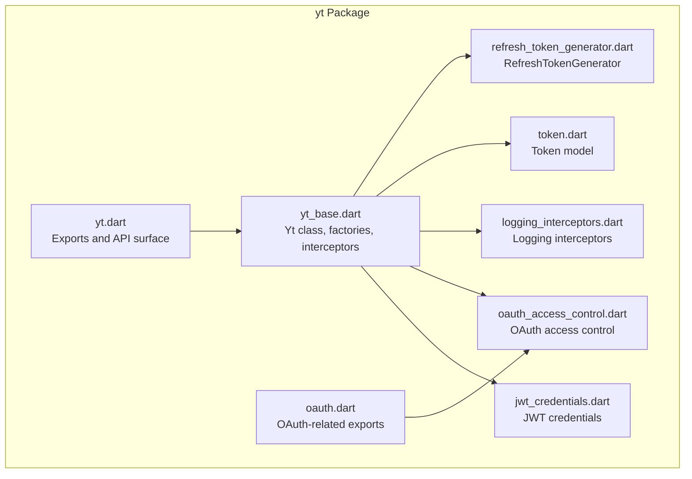
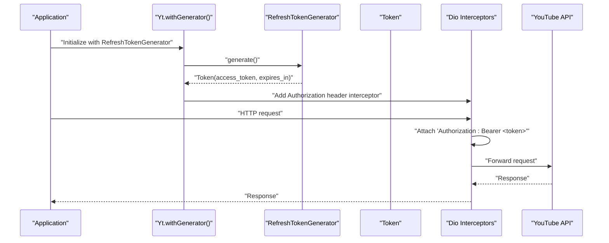
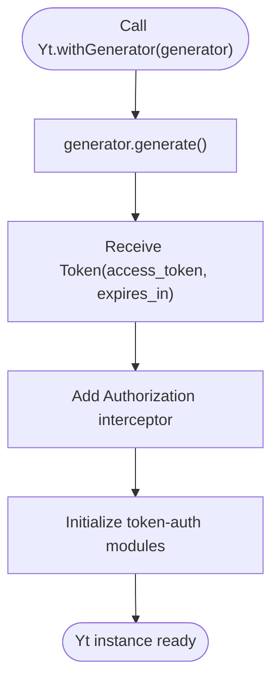
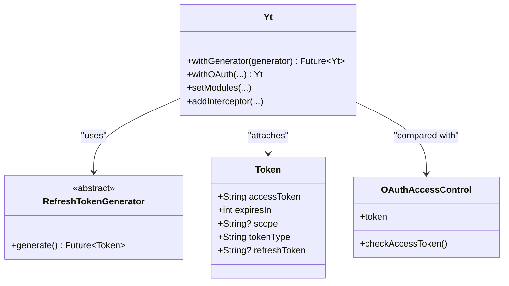

# Token Generator Authentication

<cite>
**Referenced Files in This Document**
- [README.md](file://packages/yt/README.md)
- [yt.dart](file://packages/yt/lib/yt.dart)
- [yt_base.dart](file://packages/yt/lib/src/yt_base.dart)
- [oauth.dart](file://packages/yt/lib/oauth.dart)
- [refresh_token_generator.dart](file://packages/yt/lib/src/oauth/refresh_token_generator.dart)
- [token.dart](file://packages/yt/lib/src/model/util/token.dart)
- [jwt_credentials.dart](file://packages/yt/lib/src/model/util/jwt_credentials.dart)
- [oauth_access_control.dart](file://packages/yt/lib/src/oauth/oauth_access_control.dart)
- [logging_interceptors.dart](file://packages/yt/lib/src/util/logging_interceptors.dart)
</cite>

## Table of Contents
1. [Introduction](#introduction)
2. [Project Structure](#project-structure)
3. [Core Components](#core-components)
4. [Architecture Overview](#architecture-overview)
5. [Detailed Component Analysis](#detailed-component-analysis)
6. [Dependency Analysis](#dependency-analysis)
7. [Performance Considerations](#performance-considerations)
8. [Troubleshooting Guide](#troubleshooting-guide)
9. [Conclusion](#conclusion)

## Introduction
This document explains token generator authentication in the YouTube API Dart SDK with a focus on the Yt.withGenerator() factory constructor and custom authentication flows. It covers how to implement custom token generators for specialized scenarios, JWT token handling, and integration with existing authentication systems. Practical examples are provided via file references and code snippet paths to guide implementation, validation, and error handling strategies for enterprise authentication, custom OAuth providers, and integration with existing security infrastructure.

## Project Structure
The YouTube Dart SDK organizes authentication and API modules under the yt package. Key areas relevant to token generator authentication include:
- Public API surface and exports in yt.dart
- Core client initialization and interceptors in yt_base.dart
- Token model and JWT credentials in model/util
- Token generation abstraction in oauth/refresh_token_generator.dart
- OAuth access control and platform-specific implementations in oauth/

**Diagram sources**
- [yt.dart:1-75](file://packages/yt/lib/yt.dart#L1-L75)
- [yt_base.dart:1-259](file://packages/yt/lib/src/yt_base.dart#L1-L259)
- [oauth.dart:1-6](file://packages/yt/lib/oauth.dart#L1-L6)
- [refresh_token_generator.dart:1-6](file://packages/yt/lib/src/oauth/refresh_token_generator.dart#L1-L6)
- [token.dart:1-29](file://packages/yt/lib/src/model/util/token.dart#L1-L29)
- [jwt_credentials.dart:1-24](file://packages/yt/lib/src/model/util/jwt_credentials.dart#L1-L24)
- [oauth_access_control.dart:1-7](file://packages/yt/lib/src/oauth/oauth_access_control.dart#L1-L7)
- [logging_interceptors.dart](file://packages/yt/lib/src/util/logging_interceptors.dart)

**Section sources**
- [yt.dart:1-75](file://packages/yt/lib/yt.dart#L1-L75)
- [yt_base.dart:1-259](file://packages/yt/lib/src/yt_base.dart#L1-L259)
- [oauth.dart:1-6](file://packages/yt/lib/oauth.dart#L1-L6)

## Core Components
- Yt.withGenerator(): Factory that accepts a RefreshTokenGenerator, generates a token, attaches an Authorization header interceptor, and initializes API modules for token-authenticated operations.
- RefreshTokenGenerator: Abstract interface defining generate() to produce a Token.
- Token: Data model representing access tokens, expiration, type, and optional refresh token.
- OAuthAccessControl: Used by Yt.withOAuth() to manage access tokens for OAuth flows.
- LoggingInterceptors: Optional logging of HTTP requests/responses for diagnostics.

Key implementation references:
- [Yt.withGenerator():143-169](file://packages/yt/lib/src/yt_base.dart#L143-L169)
- [RefreshTokenGenerator.generate():3-5](file://packages/yt/lib/src/oauth/refresh_token_generator.dart#L3-L5)
- [Token model:5-28](file://packages/yt/lib/src/model/util/token.dart#L5-L28)
- [Yt.withOAuth() Authorization header injection:119-141](file://packages/yt/lib/src/yt_base.dart#L119-L141)
- [Logging interceptors usage](file://packages/yt/lib/src/yt_base.dart#L85)

**Section sources**
- [yt_base.dart:143-169](file://packages/yt/lib/src/yt_base.dart#L143-L169)
- [refresh_token_generator.dart:3-5](file://packages/yt/lib/src/oauth/refresh_token_generator.dart#L3-L5)
- [token.dart:5-28](file://packages/yt/lib/src/model/util/token.dart#L5-L28)
- [yt_base.dart:119-141](file://packages/yt/lib/src/yt_base.dart#L119-L141)
- [logging_interceptors.dart](file://packages/yt/lib/src/util/logging_interceptors.dart)

## Architecture Overview
The token generator authentication flow integrates a custom generator with the SDK’s HTTP client via interceptors. The flow ensures every outgoing request includes a Bearer token in the Authorization header.

**Diagram sources**
- [yt_base.dart:143-169](file://packages/yt/lib/src/yt_base.dart#L143-L169)
- [refresh_token_generator.dart:3-5](file://packages/yt/lib/src/oauth/refresh_token_generator.dart#L3-L5)
- [token.dart:5-28](file://packages/yt/lib/src/model/util/token.dart#L5-L28)

## Detailed Component Analysis

### Yt.withGenerator() Factory Constructor
Purpose:
- Accepts a RefreshTokenGenerator
- Generates a Token synchronously
- Attaches an Authorization header interceptor using the token’s access token
- Initializes API modules configured for token-authenticated operations

Behavior highlights:
- Adds an InterceptorsWrapper to inject Authorization: Bearer <token> on each request
- Uses setModules(useTokenAuth: true) to enable live streaming and chat modules
- Supports adding additional interceptors via addInterceptor()

References:
- [Yt.withGenerator() implementation:143-169](file://packages/yt/lib/src/yt_base.dart#L143-L169)
- [Yt.addInterceptor():171-185](file://packages/yt/lib/src/yt_base.dart#L171-L185)
- [Yt.setModules(useTokenAuth: true):187-226](file://packages/yt/lib/src/yt_base.dart#L187-L226)

**Diagram sources**
- [yt_base.dart:143-169](file://packages/yt/lib/src/yt_base.dart#L143-L169)

**Section sources**
- [yt_base.dart:143-169](file://packages/yt/lib/src/yt_base.dart#L143-L169)
- [yt_base.dart:171-185](file://packages/yt/lib/src/yt_base.dart#L171-L185)
- [yt_base.dart:187-226](file://packages/yt/lib/src/yt_base.dart#L187-L226)

### RefreshTokenGenerator Interface
Purpose:
- Defines a single method generate() returning a Future<Token>
- Enables custom token generation strategies (OAuth, JWT, enterprise SSO, etc.)

References:
- [RefreshTokenGenerator.generate():3-5](file://packages/yt/lib/src/oauth/refresh_token_generator.dart#L3-L5)

Implementation pattern:
- Implement generate() to fetch or mint a token from your provider
- Return a Token with accessToken, expiresIn, and optional refreshToken

**Section sources**
- [refresh_token_generator.dart:3-5](file://packages/yt/lib/src/oauth/refresh_token_generator.dart#L3-L5)

### Token Model
Purpose:
- Represents OAuth token metadata for HTTP bearer authentication
- Fields include access_token, expires_in, scope, token_type, and optional refresh_token

References:
- [Token class:5-28](file://packages/yt/lib/src/model/util/token.dart#L5-L28)

Validation considerations:
- Ensure accessToken is present and not expired before attaching to requests
- Use expiresIn to trigger pre-emptive refresh if needed

**Section sources**
- [token.dart:5-28](file://packages/yt/lib/src/model/util/token.dart#L5-L28)

### OAuth Access Control (for comparison)
Purpose:
- Demonstrates how the SDK manages OAuth tokens internally
- Useful reference when implementing custom token generators that mimic OAuth behavior

References:
- [Yt.withOAuth() Authorization header injection:119-141](file://packages/yt/lib/src/yt_base.dart#L119-L141)
- [OAuth access control placeholder:5-6](file://packages/yt/lib/src/oauth/oauth_access_control.dart#L5-L6)

**Section sources**
- [yt_base.dart:119-141](file://packages/yt/lib/src/yt_base.dart#L119-L141)
- [oauth_access_control.dart:5-6](file://packages/yt/lib/src/oauth/oauth_access_control.dart#L5-L6)

### JWT Credentials
Purpose:
- Provides a structured representation of JWT-related settings and scope
- Useful when building custom token generators that produce JWT-based tokens

References:
- [JwtCredentials class:9-23](file://packages/yt/lib/src/model/util/jwt_credentials.dart#L9-L23)

Integration guidance:
- Combine JwtCredentials with your token generation logic to produce tokens compatible with YouTube OAuth scopes

**Section sources**
- [jwt_credentials.dart:9-23](file://packages/yt/lib/src/model/util/jwt_credentials.dart#L9-L23)

### Practical Implementation Patterns

#### Custom Token Generator Example
- Implement RefreshTokenGenerator.generate() to return a Token
- Attach the resulting token to Authorization headers via Yt.withGenerator()
- Initialize API modules and perform authenticated operations

References:
- [Yt.withGenerator():143-169](file://packages/yt/lib/src/yt_base.dart#L143-L169)
- [RefreshTokenGenerator.generate():3-5](file://packages/yt/lib/src/oauth/refresh_token_generator.dart#L3-L5)
- [Token model:5-28](file://packages/yt/lib/src/model/util/token.dart#L5-L28)

#### Token Validation and Expiration Handling
- Validate token presence and freshness before use
- Preemptively refresh tokens before expiration to avoid 401 responses
- Use expiresIn to schedule refresh logic

References:
- [Token model fields:7-15](file://packages/yt/lib/src/model/util/token.dart#L7-L15)

#### Error Handling Strategies
- Wrap token generation in try/catch blocks
- Handle missing accessToken gracefully
- Log HTTP failures and token errors using LoggingInterceptors

References:
- [Logging interceptors usage](file://packages/yt/lib/src/yt_base.dart#L85)
- [Authorization header injection:154-162](file://packages/yt/lib/src/yt_base.dart#L154-L162)

#### Enterprise Authentication Scenarios
- Integrate with internal identity providers by implementing generate() to call your IdP
- Support refresh tokens via refreshToken field in Token when applicable
- Align scopes with YouTube OAuth requirements

References:
- [Token.refreshToken field:14-15](file://packages/yt/lib/src/model/util/token.dart#L14-L15)
- [YouTube OAuth scope guidance:296-370](file://packages/yt/README.md#L296-L370)

#### Custom OAuth Provider Integration
- Implement generate() to exchange provider credentials for an access token
- Ensure token_type and scope align with YouTube API expectations

References:
- [Token.tokenType and Token.scope:11-13](file://packages/yt/lib/src/model/util/token.dart#L11-L13)
- [Flutter example with TokenGenerator:296-370](file://packages/yt/README.md#L296-L370)

## Dependency Analysis
Relationships among core authentication components:

**Diagram sources**
- [yt_base.dart:143-169](file://packages/yt/lib/src/yt_base.dart#L143-L169)
- [refresh_token_generator.dart:3-5](file://packages/yt/lib/src/oauth/refresh_token_generator.dart#L3-L5)
- [token.dart:5-28](file://packages/yt/lib/src/model/util/token.dart#L5-L28)
- [oauth_access_control.dart:5-6](file://packages/yt/lib/src/oauth/oauth_access_control.dart#L5-L6)

**Section sources**
- [yt_base.dart:143-169](file://packages/yt/lib/src/yt_base.dart#L143-L169)
- [refresh_token_generator.dart:3-5](file://packages/yt/lib/src/oauth/refresh_token_generator.dart#L3-L5)
- [token.dart:5-28](file://packages/yt/lib/src/model/util/token.dart#L5-L28)
- [oauth_access_control.dart:5-6](file://packages/yt/lib/src/oauth/oauth_access_control.dart#L5-L6)

## Performance Considerations
- Minimize token generation overhead by caching tokens until expiration
- Use pre-expiration refresh to avoid latency spikes during requests
- Limit unnecessary logging in production; adjust LogOptions accordingly

## Troubleshooting Guide
Common issues and resolutions:
- Missing Authorization header: Verify Yt.withGenerator() adds the interceptor and that generate() returns a non-empty accessToken
- 401 Unauthorized responses: Confirm token validity and scope; refresh if expired
- Logging and diagnostics: Enable LoggingInterceptors to inspect request/response headers and bodies

References:
- [Authorization header injection:154-162](file://packages/yt/lib/src/yt_base.dart#L154-L162)
- [Logging interceptors usage](file://packages/yt/lib/src/yt_base.dart#L85)
- [Token model fields:7-15](file://packages/yt/lib/src/model/util/token.dart#L7-L15)

**Section sources**
- [yt_base.dart:154-162](file://packages/yt/lib/src/yt_base.dart#L154-L162)
- [yt_base.dart:85](file://packages/yt/lib/src/yt_base.dart#L85)
- [token.dart:7-15](file://packages/yt/lib/src/model/util/token.dart#L7-L15)

## Conclusion
The Yt.withGenerator() factory constructor enables flexible, custom authentication flows by delegating token acquisition to a RefreshTokenGenerator. Combined with the Token model and Dio interceptors, it supports enterprise-grade integrations, custom OAuth providers, and JWT-based scenarios. Implement robust validation, pre-expiration refresh, and comprehensive logging to ensure reliable operation across diverse environments.