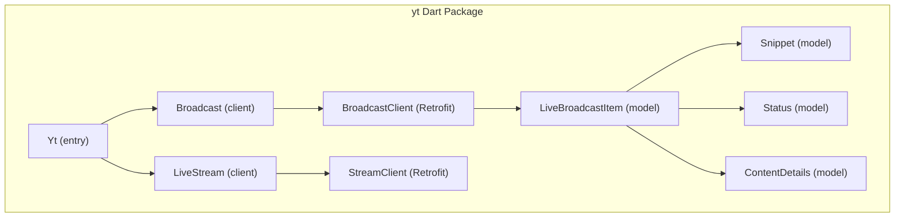
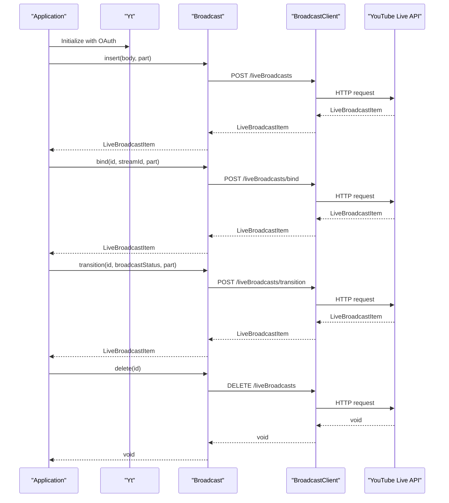
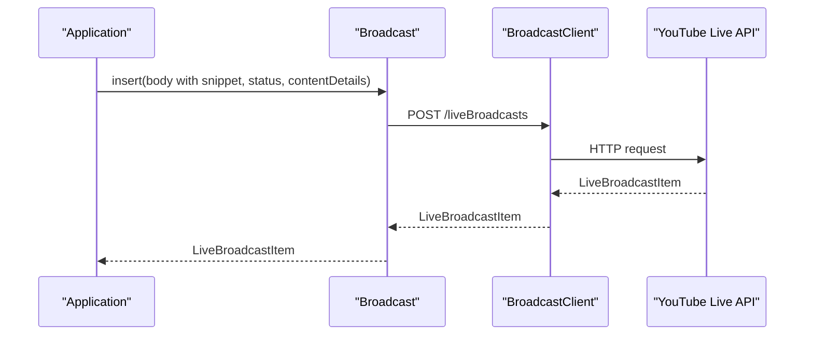
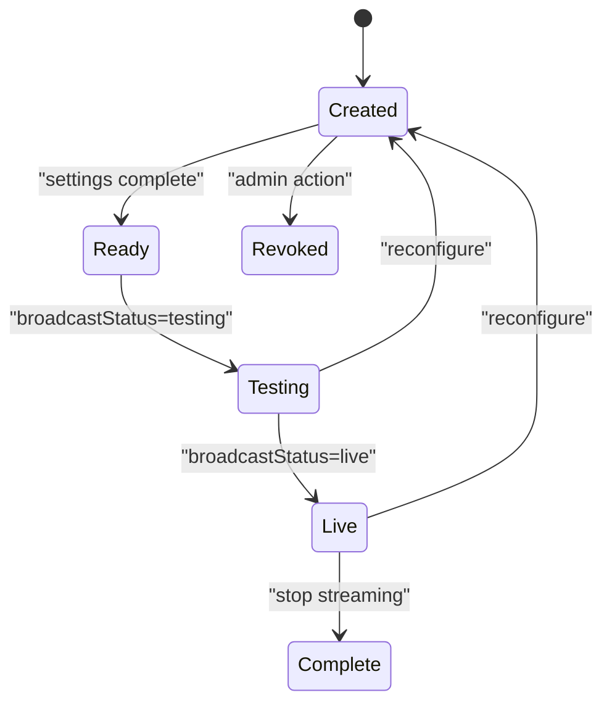
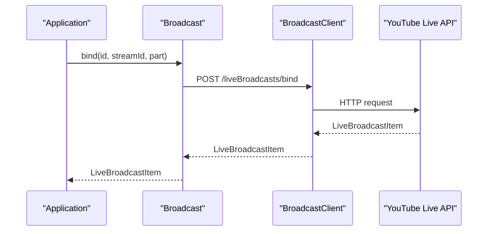
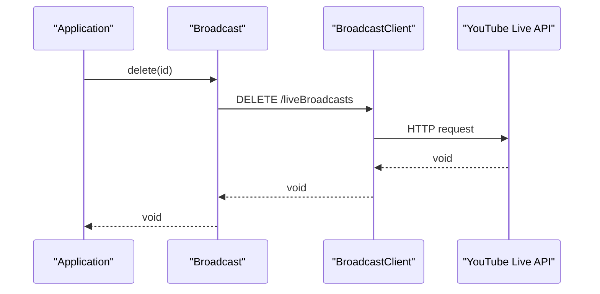
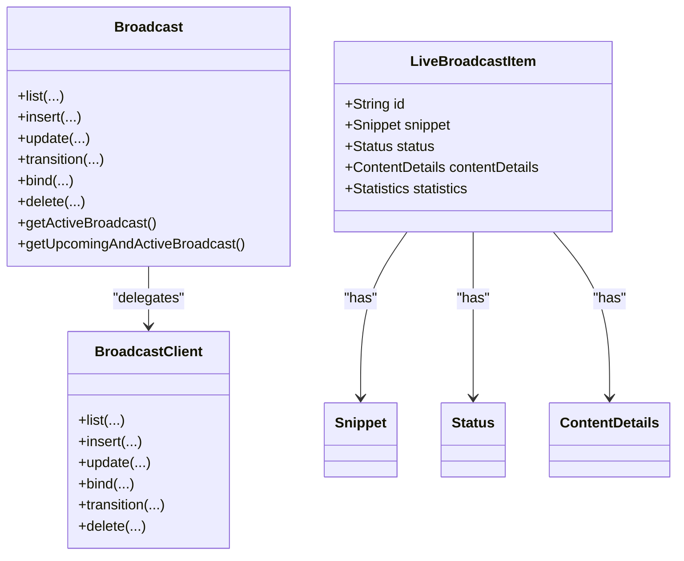

# Broadcast Lifecycle Operations

<cite>
**Referenced Files in This Document**
- [README.md](file://README.md)
- [packages/yt/README.md](file://packages/yt/README.md)
- [packages/yt/lib/src/broadcast.dart](file://packages/yt/lib/src/broadcast.dart)
- [packages/yt/lib/src/provider/live/broadcast.dart](file://packages/yt/lib/src/provider/live/broadcast.dart)
- [packages/yt/lib/src/provider/live/broadcast.g.dart](file://packages/yt/lib/src/provider/live/broadcast.g.dart)
- [packages/yt/lib/src/live_stream.dart](file://packages/yt/lib/src/live_stream.dart)
- [packages/yt/lib/src/model/broadcast/live_broadcast_item.dart](file://packages/yt/lib/src/model/broadcast/live_broadcast_item.dart)
- [packages/yt/lib/src/model/broadcast/content_details.dart](file://packages/yt/lib/src/model/broadcast/content_details.dart)
- [packages/yt/lib/src/model/broadcast/status.dart](file://packages/yt/lib/src/model/broadcast/status.dart)
- [packages/yt/lib/src/model/broadcast/snippet.dart](file://packages/yt/lib/src/model/broadcast/snippet.dart)
- [packages/yt/example/example.dart](file://packages/yt/example/example.dart)
</cite>

## Table of Contents
1. [Introduction](#introduction)
2. [Project Structure](#project-structure)
3. [Core Components](#core-components)
4. [Architecture Overview](#architecture-overview)
5. [Detailed Component Analysis](#detailed-component-analysis)
6. [Dependency Analysis](#dependency-analysis)
7. [Performance Considerations](#performance-considerations)
8. [Troubleshooting Guide](#troubleshooting-guide)
9. [Conclusion](#conclusion)
10. [Appendices](#appendices)

## Introduction
This document explains the complete broadcast lifecycle for YouTube Live Streaming API as implemented in the yt Dart package. It covers:
- Creating a broadcast with initial setup, configuration options, and metadata
- Managing broadcast status transitions (created → testing → live → completed)
- Binding a broadcast to a stream and removing bindings
- Deleting broadcasts and cleanup procedures
- Practical examples for privacy settings (public, private, unlisted)
- Configuring broadcast details (title, description, scheduling)
- Handling lifecycle events and common error scenarios
- Best practices for robust broadcast management workflows

The content is grounded in the repository’s source files and provides precise references to the relevant implementation points.

## Project Structure
The yt package exposes a high-level Broadcast client that wraps Retrofit-generated REST clients for YouTube Live Streaming API endpoints. The Broadcast client orchestrates list, insert, update, transition, bind, and delete operations. Supporting models represent the broadcast resource shape (snippet, status, contentDetails).

**Diagram sources**
- [packages/yt/lib/src/broadcast.dart:1-168](file://packages/yt/lib/src/broadcast.dart#L1-L168)
- [packages/yt/lib/src/live_stream.dart:1-81](file://packages/yt/lib/src/live_stream.dart#L1-L81)
- [packages/yt/lib/src/provider/live/broadcast.dart:1-96](file://packages/yt/lib/src/provider/live/broadcast.dart#L1-L96)
- [packages/yt/lib/src/provider/live/stream.dart:1-68](file://packages/yt/lib/src/provider/live/stream.dart#L1-L68)
- [packages/yt/lib/src/model/broadcast/live_broadcast_item.dart:1-63](file://packages/yt/lib/src/model/broadcast/live_broadcast_item.dart#L1-L63)
- [packages/yt/lib/src/model/broadcast/snippet.dart:1-64](file://packages/yt/lib/src/model/broadcast/snippet.dart#L1-L64)
- [packages/yt/lib/src/model/broadcast/status.dart:1-60](file://packages/yt/lib/src/model/broadcast/status.dart#L1-L60)
- [packages/yt/lib/src/model/broadcast/content_details.dart:1-121](file://packages/yt/lib/src/model/broadcast/content_details.dart#L1-L121)

**Section sources**
- [packages/yt/README.md:205-250](file://packages/yt/README.md#L205-L250)
- [packages/yt/lib/src/broadcast.dart:1-168](file://packages/yt/lib/src/broadcast.dart#L1-L168)
- [packages/yt/lib/src/live_stream.dart:1-81](file://packages/yt/lib/src/live_stream.dart#L1-L81)

## Core Components
- Broadcast client: Provides methods to list, insert, update, transition, bind/unbind, and delete broadcasts.
- LiveStream client: Manages live streams and their lifecycle.
- Models: LiveBroadcastItem, Snippet, Status, ContentDetails encapsulate the broadcast resource structure and metadata.

Key capabilities:
- Create a broadcast with snippet (title, description, scheduling), status (privacy), and contentDetails (DVR, embed, encryption, latency, monitor stream, etc.).
- Transition lifecycle status (created → testing → live → complete).
- Bind/unbind a broadcast to/from a stream.
- Delete a broadcast.

**Section sources**
- [packages/yt/lib/src/broadcast.dart:12-168](file://packages/yt/lib/src/broadcast.dart#L12-L168)
- [packages/yt/lib/src/provider/live/broadcast.dart:12-96](file://packages/yt/lib/src/provider/live/broadcast.dart#L12-L96)
- [packages/yt/lib/src/live_stream.dart:12-81](file://packages/yt/lib/src/live_stream.dart#L12-L81)
- [packages/yt/lib/src/model/broadcast/live_broadcast_item.dart:13-63](file://packages/yt/lib/src/model/broadcast/live_broadcast_item.dart#L13-L63)
- [packages/yt/lib/src/model/broadcast/snippet.dart:9-64](file://packages/yt/lib/src/model/broadcast/snippet.dart#L9-L64)
- [packages/yt/lib/src/model/broadcast/status.dart:7-60](file://packages/yt/lib/src/model/broadcast/status.dart#L7-L60)
- [packages/yt/lib/src/model/broadcast/content_details.dart:9-121](file://packages/yt/lib/src/model/broadcast/content_details.dart#L9-L121)

## Architecture Overview
The Broadcast client delegates to a Retrofit-generated BroadcastClient that calls YouTube’s liveBroadcasts endpoints. The LiveStream client manages streams. Models are JSON-serializable DTOs representing the broadcast resource.

**Diagram sources**
- [packages/yt/lib/src/broadcast.dart:39-126](file://packages/yt/lib/src/broadcast.dart#L39-L126)
- [packages/yt/lib/src/provider/live/broadcast.dart:28-94](file://packages/yt/lib/src/provider/live/broadcast.dart#L28-L94)
- [packages/yt/lib/src/provider/live/broadcast.g.dart:214-254](file://packages/yt/lib/src/provider/live/broadcast.g.dart#L214-L254)

## Detailed Component Analysis

### Broadcast Creation Workflow
- Use the insert method to create a broadcast. The body includes snippet (title, description, scheduled start/end), status (privacy), and contentDetails (DVR, embed, encryption, latency preference, monitor stream, etc.).
- The response is a LiveBroadcastItem containing the created broadcast’s id and metadata.

Practical guidance:
- Set privacy via status.privacyStatus: private, public, or unlisted.
- Configure scheduling with snippet.scheduledStartTime and optional snippet.scheduledEndTime.
- Tune contentDetails for latency, encryption, DVR, embedding, and monitor stream behavior.

**Diagram sources**
- [packages/yt/lib/src/broadcast.dart:39-56](file://packages/yt/lib/src/broadcast.dart#L39-L56)
- [packages/yt/lib/src/provider/live/broadcast.dart:28-41](file://packages/yt/lib/src/provider/live/broadcast.dart#L28-L41)
- [packages/yt/lib/src/model/broadcast/status.dart:23-29](file://packages/yt/lib/src/model/broadcast/status.dart#L23-L29)
- [packages/yt/lib/src/model/broadcast/snippet.dart:18-31](file://packages/yt/lib/src/model/broadcast/snippet.dart#L18-L31)
- [packages/yt/lib/src/model/broadcast/content_details.dart:32-94](file://packages/yt/lib/src/model/broadcast/content_details.dart#L32-L94)

**Section sources**
- [packages/yt/README.md:205-250](file://packages/yt/README.md#L205-L250)
- [packages/yt/lib/src/broadcast.dart:39-56](file://packages/yt/lib/src/broadcast.dart#L39-L56)
- [packages/yt/lib/src/provider/live/broadcast.dart:28-41](file://packages/yt/lib/src/provider/live/broadcast.dart#L28-L41)
- [packages/yt/lib/src/model/broadcast/status.dart:23-29](file://packages/yt/lib/src/model/broadcast/status.dart#L23-L29)
- [packages/yt/lib/src/model/broadcast/snippet.dart:18-31](file://packages/yt/lib/src/model/broadcast/snippet.dart#L18-L31)
- [packages/yt/lib/src/model/broadcast/content_details.dart:32-94](file://packages/yt/lib/src/model/broadcast/content_details.dart#L32-L94)

### Broadcast Status Transitions
Supported lifecycle statuses (from the Status model):
- created: Incomplete settings; not ready to go live/testing yet.
- ready: Complete settings; can transition to testing or live.
- testing: Visible internally; monitor stream active.
- testStarting: Transitioning to testing.
- live: Active broadcast.
- liveStarting: Transitioning to live.
- complete: Finished.
- revoked: Removed by admin action.

Transitions are performed via the transition method with broadcastStatus set to the target state.

Operational notes:
- Before transitioning to testing or live, ensure the bound stream’s status is active.
- Some contentDetails settings become immutable after entering testing/live.

**Diagram sources**
- [packages/yt/lib/src/model/broadcast/status.dart:10-21](file://packages/yt/lib/src/model/broadcast/status.dart#L10-L21)
- [packages/yt/lib/src/broadcast.dart:77-93](file://packages/yt/lib/src/broadcast.dart#L77-L93)
- [packages/yt/lib/src/provider/live/broadcast.dart:70-82](file://packages/yt/lib/src/provider/live/broadcast.dart#L70-L82)
- [packages/yt/lib/src/model/broadcast/content_details.dart:34-94](file://packages/yt/lib/src/model/broadcast/content_details.dart#L34-L94)

**Section sources**
- [packages/yt/lib/src/model/broadcast/status.dart:10-21](file://packages/yt/lib/src/model/broadcast/status.dart#L10-L21)
- [packages/yt/lib/src/broadcast.dart:77-93](file://packages/yt/lib/src/broadcast.dart#L77-L93)
- [packages/yt/lib/src/provider/live/broadcast.dart:70-82](file://packages/yt/lib/src/provider/live/broadcast.dart#L70-L82)
- [packages/yt/lib/src/model/broadcast/content_details.dart:34-94](file://packages/yt/lib/src/model/broadcast/content_details.dart#L34-L94)

### Binding a Broadcast to a Stream
- Use the bind method to attach a broadcast to a stream or to remove an existing binding.
- A broadcast can be bound to only one stream at a time; a stream can be bound to multiple broadcasts.

Best practices:
- Verify the stream’s status is active before binding.
- Unbind before re-binding to a different stream.

**Diagram sources**
- [packages/yt/lib/src/broadcast.dart:95-111](file://packages/yt/lib/src/broadcast.dart#L95-L111)
- [packages/yt/lib/src/provider/live/broadcast.dart:56-68](file://packages/yt/lib/src/provider/live/broadcast.dart#L56-L68)
- [packages/yt/lib/src/live_stream.dart:1-81](file://packages/yt/lib/src/live_stream.dart#L1-L81)

**Section sources**
- [packages/yt/lib/src/broadcast.dart:95-111](file://packages/yt/lib/src/broadcast.dart#L95-L111)
- [packages/yt/lib/src/provider/live/broadcast.dart:56-68](file://packages/yt/lib/src/provider/live/broadcast.dart#L56-L68)
- [packages/yt/lib/src/live_stream.dart:1-81](file://packages/yt/lib/src/live_stream.dart#L1-L81)

### Broadcast Deletion and Cleanup
- Use the delete method to remove a broadcast.
- Ensure the broadcast is not currently bound to an active stream and is in a deletable state per API rules.

Cleanup checklist:
- Unbind the broadcast from its stream if bound.
- Transition to a terminal state (e.g., complete) before deletion if required by workflow.
- Confirm deletion via list or handle API errors appropriately.

**Diagram sources**
- [packages/yt/lib/src/broadcast.dart:113-126](file://packages/yt/lib/src/broadcast.dart#L113-L126)
- [packages/yt/lib/src/provider/live/broadcast.dart:84-94](file://packages/yt/lib/src/provider/live/broadcast.dart#L84-L94)

**Section sources**
- [packages/yt/lib/src/broadcast.dart:113-126](file://packages/yt/lib/src/broadcast.dart#L113-L126)
- [packages/yt/lib/src/provider/live/broadcast.dart:84-94](file://packages/yt/lib/src/provider/live/broadcast.dart#L84-L94)

### Practical Examples

#### Example: Create a Private Broadcast with Scheduling
- Body includes snippet (title, description, scheduledStartTime) and status (privacyStatus: private).
- Optional contentDetails for DVR, embed, encryption, latency preference, and monitor stream.

Reference:
- [packages/yt/README.md:205-250](file://packages/yt/README.md#L205-L250)

#### Example: List Existing Broadcasts and Inspect Lifecycle Status
- Use list with broadcastStatus filters (active, upcoming) and inspect status.lifeCycleStatus.

Reference:
- [packages/yt/example/example.dart:37-46](file://packages/yt/example/example.dart#L37-L46)

#### Example: Transition to Testing and Live
- Call transition with broadcastStatus set to testing, then to live after verifying stream readiness.

Reference:
- [packages/yt/lib/src/broadcast.dart:77-93](file://packages/yt/lib/src/broadcast.dart#L77-L93)
- [packages/yt/lib/src/provider/live/broadcast.dart:70-82](file://packages/yt/lib/src/provider/live/broadcast.dart#L70-L82)

#### Example: Bind to a Stream
- Call bind with the broadcast id and the desired stream id.

Reference:
- [packages/yt/lib/src/broadcast.dart:95-111](file://packages/yt/lib/src/broadcast.dart#L95-L111)
- [packages/yt/lib/src/provider/live/broadcast.dart:56-68](file://packages/yt/lib/src/provider/live/broadcast.dart#L56-L68)

#### Example: Delete a Broadcast
- Call delete with the broadcast id.

Reference:
- [packages/yt/lib/src/broadcast.dart:113-126](file://packages/yt/lib/src/broadcast.dart#L113-L126)
- [packages/yt/lib/src/provider/live/broadcast.dart:84-94](file://packages/yt/lib/src/provider/live/broadcast.dart#L84-L94)

## Dependency Analysis
The Broadcast client composes a Retrofit-generated BroadcastClient and delegates HTTP operations to it. LiveBroadcastItem aggregates Snippet, Status, and ContentDetails models. The LiveStream client operates independently for stream management.

**Diagram sources**
- [packages/yt/lib/src/broadcast.dart:7-168](file://packages/yt/lib/src/broadcast.dart#L7-L168)
- [packages/yt/lib/src/provider/live/broadcast.dart:9-96](file://packages/yt/lib/src/provider/live/broadcast.dart#L9-L96)
- [packages/yt/lib/src/model/broadcast/live_broadcast_item.dart:14-40](file://packages/yt/lib/src/model/broadcast/live_broadcast_item.dart#L14-L40)
- [packages/yt/lib/src/model/broadcast/snippet.dart:10-64](file://packages/yt/lib/src/model/broadcast/snippet.dart#L10-L64)
- [packages/yt/lib/src/model/broadcast/status.dart:8-60](file://packages/yt/lib/src/model/broadcast/status.dart#L8-L60)
- [packages/yt/lib/src/model/broadcast/content_details.dart:10-121](file://packages/yt/lib/src/model/broadcast/content_details.dart#L10-L121)

**Section sources**
- [packages/yt/lib/src/broadcast.dart:7-168](file://packages/yt/lib/src/broadcast.dart#L7-L168)
- [packages/yt/lib/src/provider/live/broadcast.dart:9-96](file://packages/yt/lib/src/provider/live/broadcast.dart#L9-L96)
- [packages/yt/lib/src/model/broadcast/live_broadcast_item.dart:14-40](file://packages/yt/lib/src/model/broadcast/live_broadcast_item.dart#L14-L40)
- [packages/yt/lib/src/model/broadcast/snippet.dart:10-64](file://packages/yt/lib/src/model/broadcast/snippet.dart#L10-L64)
- [packages/yt/lib/src/model/broadcast/status.dart:8-60](file://packages/yt/lib/src/model/broadcast/status.dart#L8-L60)
- [packages/yt/lib/src/model/broadcast/content_details.dart:10-121](file://packages/yt/lib/src/model/broadcast/content_details.dart#L10-L121)

## Performance Considerations
- Batch operations: Use list with appropriate filters (broadcastStatus, mine, maxResults) to minimize API calls.
- Efficient polling: Poll for active/upcoming broadcasts only when necessary; cache results locally.
- Minimize payload size: Request only required parts (snippet, status, contentDetails) to reduce bandwidth.
- Stream readiness: Ensure the bound stream is active before transitioning to testing/live to avoid retries and wasted attempts.

## Troubleshooting Guide
Common issues and remedies:
- Transition errors: If transitioning fails, verify the bound stream is active and contentDetails settings are valid for the target state.
- Privacy mismatch: Ensure privacyStatus aligns with channel policy and intended audience.
- Binding failures: Confirm the stream exists and is not already bound to another broadcast if applicable.
- Deletion errors: Ensure the broadcast is not actively streaming and is in a deletable state.

Operational checks:
- Use list with broadcastStatus filters to locate the broadcast and inspect status.lifeCycleStatus.
- Validate contentDetails immutability constraints before attempting updates after testing/live.

**Section sources**
- [packages/yt/lib/src/broadcast.dart:128-166](file://packages/yt/lib/src/broadcast.dart#L128-L166)
- [packages/yt/lib/src/model/broadcast/status.dart:10-21](file://packages/yt/lib/src/model/broadcast/status.dart#L10-L21)
- [packages/yt/lib/src/model/broadcast/content_details.dart:34-94](file://packages/yt/lib/src/model/broadcast/content_details.dart#L34-L94)
- [packages/yt/example/example.dart:37-46](file://packages/yt/example/example.dart#L37-L46)

## Conclusion
The yt package provides a concise, model-driven interface to manage YouTube Live Streaming broadcasts. By combining Broadcast and LiveStream clients with strongly typed models, developers can reliably create, configure, transition, bind, and delete broadcasts. Following the lifecycle constraints and best practices outlined here ensures predictable behavior and smoother integrations.

## Appendices

### API Endpoints Used
- GET /liveBroadcasts
- POST /liveBroadcasts
- PUT /liveBroadcasts
- POST /liveBroadcasts/bind
- POST /liveBroadcasts/transition
- DELETE /liveBroadcasts
- GET /liveStreams
- POST /liveStreams
- PUT /liveStreams
- DELETE /liveStreams

**Section sources**
- [packages/yt/lib/src/provider/live/broadcast.dart:12-94](file://packages/yt/lib/src/provider/live/broadcast.dart#L12-L94)
- [packages/yt/lib/src/provider/live/stream.dart:12-67](file://packages/yt/lib/src/provider/live/stream.dart#L12-L67)