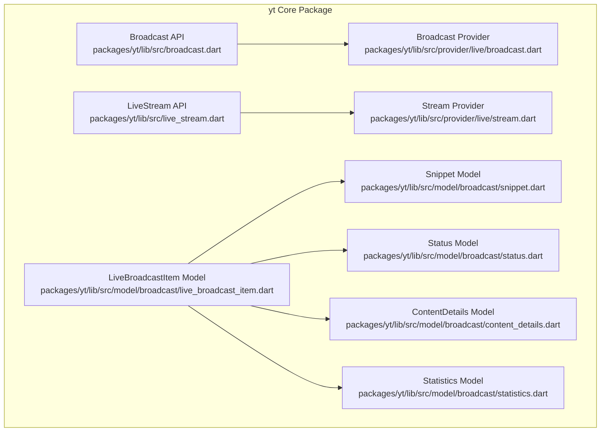
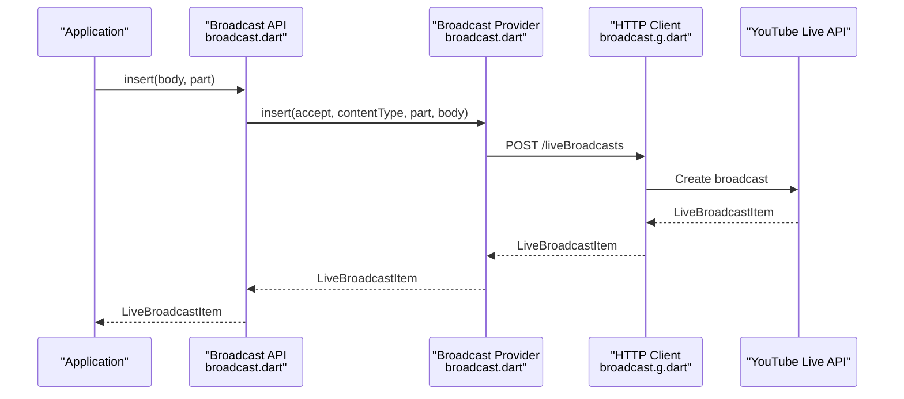
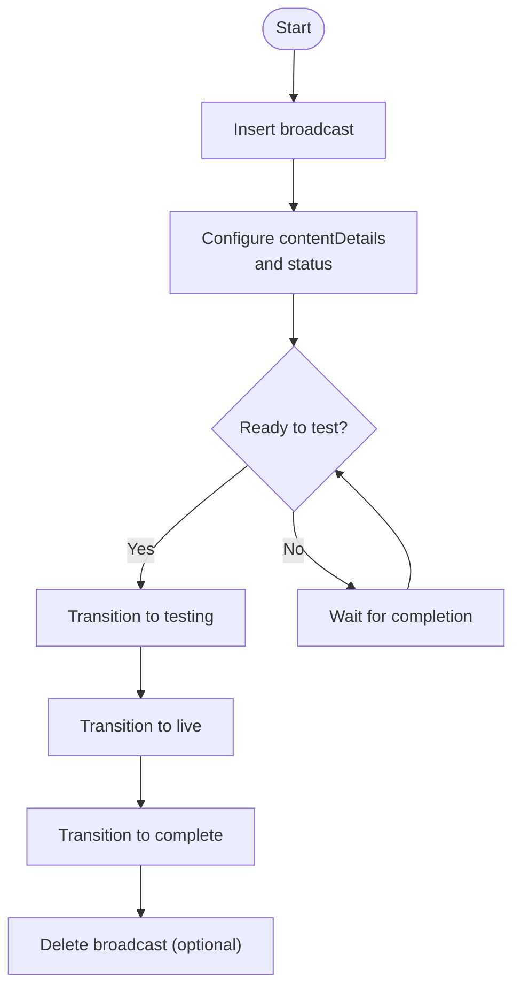
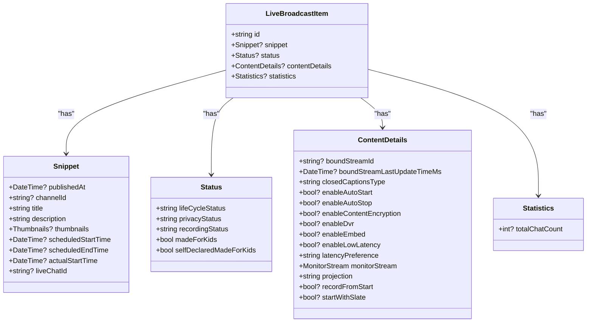
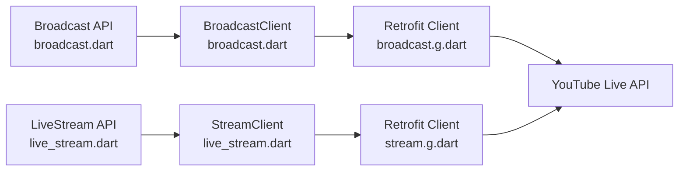

# Broadcast Management

<cite>
**Referenced Files in This Document**
- [README.md](file://README.md)
- [packages/yt/README.md](file://packages/yt/README.md)
- [packages/yt/lib/src/broadcast.dart](file://packages/yt/lib/src/broadcast.dart)
- [packages/yt/lib/src/live_stream.dart](file://packages/yt/lib/src/live_stream.dart)
- [packages/yt/lib/src/provider/live/broadcast.dart](file://packages/yt/lib/src/provider/live/broadcast.dart)
- [packages/yt/lib/src/provider/live/stream.dart](file://packages/yt/lib/src/provider/live/stream.dart)
- [packages/yt/lib/src/model/broadcast/live_broadcast_item.dart](file://packages/yt/lib/src/model/broadcast/live_broadcast_item.dart)
- [packages/yt/lib/src/model/broadcast/snippet.dart](file://packages/yt/lib/src/model/broadcast/snippet.dart)
- [packages/yt/lib/src/model/broadcast/status.dart](file://packages/yt/lib/src/model/broadcast/status.dart)
- [packages/yt/lib/src/model/broadcast/content_details.dart](file://packages/yt/lib/src/model/broadcast/content_details.dart)
- [packages/yt/lib/src/model/broadcast/statistics.dart](file://packages/yt/lib/src/model/broadcast/statistics.dart)
- [packages/yt/example/example.dart](file://packages/yt/example/example.dart)
</cite>

## Table of Contents
1. [Introduction](#introduction)
2. [Project Structure](#project-structure)
3. [Core Components](#core-components)
4. [Architecture Overview](#architecture-overview)
5. [Detailed Component Analysis](#detailed-component-analysis)
6. [Dependency Analysis](#dependency-analysis)
7. [Performance Considerations](#performance-considerations)
8. [Troubleshooting Guide](#troubleshooting-guide)
9. [Conclusion](#conclusion)
10. [Appendices](#appendices)

## Introduction
This document provides comprehensive broadcast management guidance for the YouTube Live Streaming API using the yt Dart library. It explains the complete broadcast lifecycle: creation, configuration, status management, binding to streams, and termination. It documents the LiveBroadcastItem model and its properties for broadcast metadata, outlines broadcast states and configurations, and provides practical examples for common workflows such as creating broadcasts with different privacy settings, updating broadcast details, binding streams, and handling status transitions. It also includes best practices, error handling strategies, and troubleshooting tips for reliable live streaming workflows.

## Project Structure
The broadcast management functionality is implemented in the yt core package. Key areas:
- Public API surface for broadcasts and streams
- Provider clients that wrap Retrofit-generated HTTP clients
- Strongly typed models representing YouTube resources

**Diagram sources**
- [packages/yt/lib/src/broadcast.dart:1-168](file://packages/yt/lib/src/broadcast.dart#L1-L168)
- [packages/yt/lib/src/live_stream.dart:1-81](file://packages/yt/lib/src/live_stream.dart#L1-L81)
- [packages/yt/lib/src/provider/live/broadcast.dart:1-96](file://packages/yt/lib/src/provider/live/broadcast.dart#L1-L96)
- [packages/yt/lib/src/provider/live/stream.dart:1-68](file://packages/yt/lib/src/provider/live/stream.dart#L1-L68)
- [packages/yt/lib/src/model/broadcast/live_broadcast_item.dart:1-63](file://packages/yt/lib/src/model/broadcast/live_broadcast_item.dart#L1-L63)
- [packages/yt/lib/src/model/broadcast/snippet.dart:1-64](file://packages/yt/lib/src/model/broadcast/snippet.dart#L1-L64)
- [packages/yt/lib/src/model/broadcast/status.dart:1-60](file://packages/yt/lib/src/model/broadcast/status.dart#L1-L60)
- [packages/yt/lib/src/model/broadcast/content_details.dart:1-121](file://packages/yt/lib/src/model/broadcast/content_details.dart#L1-L121)
- [packages/yt/lib/src/model/broadcast/statistics.dart:1-23](file://packages/yt/lib/src/model/broadcast/statistics.dart#L1-L23)

**Section sources**
- [README.md:55-71](file://README.md#L55-L71)
- [packages/yt/README.md:445-449](file://packages/yt/README.md#L445-L449)

## Core Components
- Broadcast API: Provides methods to list, insert, update, transition, bind, and delete live broadcasts.
- LiveStream API: Manages live streams used for transmission and binding to broadcasts.
- Provider Clients: Retrofit-based HTTP clients for liveBroadcasts and liveStreams endpoints.
- Models: Strongly typed models for LiveBroadcastItem, Snippet, Status, ContentDetails, and Statistics.

Key capabilities:
- Create broadcasts with snippet, status, and contentDetails.
- Update broadcast settings (e.g., contentDetails).
- Transition broadcast lifecycle states.
- Bind/unbind streams to/from broadcasts.
- List broadcasts filtered by status or ownership.
- Retrieve broadcast statistics while live.

**Section sources**
- [packages/yt/lib/src/broadcast.dart:12-168](file://packages/yt/lib/src/broadcast.dart#L12-L168)
- [packages/yt/lib/src/live_stream.dart:12-81](file://packages/yt/lib/src/live_stream.dart#L12-L81)
- [packages/yt/lib/src/provider/live/broadcast.dart:12-95](file://packages/yt/lib/src/provider/live/broadcast.dart#L12-L95)
- [packages/yt/lib/src/provider/live/stream.dart:12-67](file://packages/yt/lib/src/provider/live/stream.dart#L12-L67)

## Architecture Overview
The broadcast management architecture follows a layered pattern:
- API Layer: Public Broadcast and LiveStream classes expose high-level operations.
- Provider Layer: Retrofit-generated clients encapsulate HTTP calls to YouTube endpoints.
- Model Layer: JSON-serializable models represent YouTube resources.

**Diagram sources**
- [packages/yt/lib/src/broadcast.dart:39-56](file://packages/yt/lib/src/broadcast.dart#L39-L56)
- [packages/yt/lib/src/provider/live/broadcast.dart:28-41](file://packages/yt/lib/src/provider/live/broadcast.dart#L28-L41)

## Detailed Component Analysis

### Broadcast Lifecycle Management
The Broadcast API exposes lifecycle operations:
- List: Filter by broadcastStatus, mine, id, etc.
- Insert: Create a broadcast with snippet, status, contentDetails.
- Update: Modify broadcast settings (e.g., contentDetails).
- Transition: Change lifecycle state (testing, live, complete).
- Bind: Bind/unbind a stream to a broadcast.
- Delete: Remove a broadcast.

**Diagram sources**
- [packages/yt/lib/src/broadcast.dart:12-168](file://packages/yt/lib/src/broadcast.dart#L12-L168)
- [packages/yt/lib/src/provider/live/broadcast.dart:12-95](file://packages/yt/lib/src/provider/live/broadcast.dart#L12-L95)

**Section sources**
- [packages/yt/lib/src/broadcast.dart:12-168](file://packages/yt/lib/src/broadcast.dart#L12-L168)
- [packages/yt/lib/src/provider/live/broadcast.dart:12-95](file://packages/yt/lib/src/provider/live/broadcast.dart#L12-L95)

### LiveBroadcastItem Model and Properties
LiveBroadcastItem aggregates metadata and settings:
- id: Unique broadcast identifier.
- snippet: Title, description, scheduled times, live chat id, thumbnails.
- status: Lifecycle status, privacy status, recording status, madeForKids flags.
- contentDetails: Bound stream id, closed captions type, enableDVR/embed, encryption, latency preference, monitor stream, projection, recordFromStart, startWithSlate.
- statistics: Live chat counts (when available).

**Diagram sources**
- [packages/yt/lib/src/model/broadcast/live_broadcast_item.dart:13-63](file://packages/yt/lib/src/model/broadcast/live_broadcast_item.dart#L13-L63)
- [packages/yt/lib/src/model/broadcast/snippet.dart:9-64](file://packages/yt/lib/src/model/broadcast/snippet.dart#L9-L64)
- [packages/yt/lib/src/model/broadcast/status.dart:7-60](file://packages/yt/lib/src/model/broadcast/status.dart#L7-L60)
- [packages/yt/lib/src/model/broadcast/content_details.dart:9-121](file://packages/yt/lib/src/model/broadcast/content_details.dart#L9-L121)
- [packages/yt/lib/src/model/broadcast/statistics.dart:7-23](file://packages/yt/lib/src/model/broadcast/statistics.dart#L7-L23)

**Section sources**
- [packages/yt/lib/src/model/broadcast/live_broadcast_item.dart:13-63](file://packages/yt/lib/src/model/broadcast/live_broadcast_item.dart#L13-L63)
- [packages/yt/lib/src/model/broadcast/snippet.dart:9-64](file://packages/yt/lib/src/model/broadcast/snippet.dart#L9-L64)
- [packages/yt/lib/src/model/broadcast/status.dart:7-60](file://packages/yt/lib/src/model/broadcast/status.dart#L7-L60)
- [packages/yt/lib/src/model/broadcast/content_details.dart:9-121](file://packages/yt/lib/src/model/broadcast/content_details.dart#L9-L121)
- [packages/yt/lib/src/model/broadcast/statistics.dart:7-23](file://packages/yt/lib/src/model/broadcast/statistics.dart#L7-L23)

### Broadcast States and Configurations
States (from Status):
- created: Incomplete settings; not ready for live/testing.
- testing: Visible internally; monitor stream active.
- live: Active broadcast.
- complete: Finished.
- liveStarting, testStarting: Transitioning to target state.
- revoked: Removed by admin.
- ready: Settings complete; can transition to live/testing.

Privacy settings (from Status):
- private
- public
- unlisted

Content protection and recording settings (from ContentDetails):
- enableContentEncryption
- enableDvr
- enableEmbed
- recordFromStart
- startWithSlate
- latencyPreference (normal, low, ultraLow)
- closedCaptionsType (disabled, httpPost, embedded)

Scheduling:
- scheduledStartTime/scheduledEndTime in Snippet.
- actualStartTime becomes available when live.

**Section sources**
- [packages/yt/lib/src/model/broadcast/status.dart:10-43](file://packages/yt/lib/src/model/broadcast/status.dart#L10-L43)
- [packages/yt/lib/src/model/broadcast/content_details.dart:32-94](file://packages/yt/lib/src/model/broadcast/content_details.dart#L32-L94)
- [packages/yt/lib/src/model/broadcast/snippet.dart:27-34](file://packages/yt/lib/src/model/broadcast/snippet.dart#L27-L34)

### Practical Examples

#### Create a broadcast with privacy settings
- Use Broadcast.insert with snippet (title, description, scheduledStartTime), status (privacyStatus), and contentDetails (enableDVR, enableEmbed, enableContentEncryption, recordFromStart, monitorStream settings).
- Example reference: [packages/yt/README.md:205-250](file://packages/yt/README.md#L205-L250)

#### Update broadcast details
- Use Broadcast.update to modify contentDetails (e.g., enableDVR, latencyPreference).
- Example reference: [packages/yt/README.md:205-250](file://packages/yt/README.md#L205-L250)

#### Bind a stream to a broadcast
- Use Broadcast.bind with id and streamId.
- Example reference: [packages/yt/README.md:205-250](file://packages/yt/README.md#L205-L250)

#### Handle broadcast status transitions
- Use Broadcast.transition to move between states (testing, live, complete).
- Ensure the bound stream’s status is active before transitioning to testing/live.
- Example reference: [packages/yt/README.md:205-250](file://packages/yt/README.md#L205-L250)

#### List active/upcoming broadcasts
- Use Broadcast.list with broadcastStatus filters.
- Example reference: [packages/yt/README.md:251-264](file://packages/yt/README.md#L251-L264), [packages/yt/example/example.dart:37-46](file://packages/yt/example/example.dart#L37-L46)

**Section sources**
- [packages/yt/README.md:205-250](file://packages/yt/README.md#L205-L250)
- [packages/yt/README.md:251-264](file://packages/yt/README.md#L251-L264)
- [packages/yt/example/example.dart:37-46](file://packages/yt/example/example.dart#L37-L46)

### Best Practices
- Pre-configure contentDetails before transitioning to testing/live to avoid restrictions.
- Set enableDVR and recordFromStart appropriately for immediate playback availability.
- Use scheduledStartTime to pre-schedule broadcasts and manage viewer expectations.
- Keep privacyStatus aligned with intended audience visibility.
- Monitor boundStreamId and boundStreamLastUpdateTimeMs to detect stream binding issues.
- Use getActiveBroadcast and getUpcomingAndActiveBroadcast helpers to simplify state queries.

**Section sources**
- [packages/yt/lib/src/broadcast.dart:128-166](file://packages/yt/lib/src/broadcast.dart#L128-L166)
- [packages/yt/lib/src/model/broadcast/content_details.dart:32-94](file://packages/yt/lib/src/model/broadcast/content_details.dart#L32-L94)

## Dependency Analysis
The Broadcast API depends on the Retrofit-generated BroadcastClient, which targets the YouTube Live API endpoints. The LiveStream API similarly depends on StreamClient. Models are decoupled and used across both layers.

**Diagram sources**
- [packages/yt/lib/src/broadcast.dart:7-11](file://packages/yt/lib/src/broadcast.dart#L7-L11)
- [packages/yt/lib/src/provider/live/broadcast.dart:8-11](file://packages/yt/lib/src/provider/live/broadcast.dart#L8-L11)
- [packages/yt/lib/src/live_stream.dart:7-11](file://packages/yt/lib/src/live_stream.dart#L7-L11)
- [packages/yt/lib/src/provider/live/stream.dart:8-11](file://packages/yt/lib/src/provider/live/stream.dart#L8-L11)

**Section sources**
- [packages/yt/lib/src/broadcast.dart:7-11](file://packages/yt/lib/src/broadcast.dart#L7-L11)
- [packages/yt/lib/src/live_stream.dart:7-11](file://packages/yt/lib/src/live_stream.dart#L7-L11)
- [packages/yt/lib/src/provider/live/broadcast.dart:8-11](file://packages/yt/lib/src/provider/live/broadcast.dart#L8-L11)
- [packages/yt/lib/src/provider/live/stream.dart:8-11](file://packages/yt/lib/src/provider/live/stream.dart#L8-L11)

## Performance Considerations
- Minimize repeated list calls; cache results when appropriate.
- Batch updates to contentDetails to reduce API churn.
- Use latencyPreference judiciously; ultraLow may limit features and resolution.
- Avoid unnecessary enableContentEncryption toggles after testing/live states.

## Troubleshooting Guide
Common issues and strategies:
- No active broadcast found: Use getActiveBroadcast or getUpcomingAndActiveBroadcast helpers; handle exceptions when no broadcasts are present.
  - Reference: [packages/yt/lib/src/broadcast.dart:128-166](file://packages/yt/lib/src/broadcast.dart#L128-L166)
- Forbidden or modificationNotAllowed errors: Some contentDetails properties cannot be changed once in testing/live; adjust before transitioning.
  - Reference: [packages/yt/lib/src/model/broadcast/content_details.dart:82-88](file://packages/yt/lib/src/model/broadcast/content_details.dart#L82-L88)
- Stream binding problems: Verify boundStreamId and boundStreamLastUpdateTimeMs; ensure the stream’s status is active before transitioning.
  - Reference: [packages/yt/lib/src/model/broadcast/content_details.dart:12-16](file://packages/yt/lib/src/model/broadcast/content_details.dart#L12-L16)
- Privacy mismatch: Confirm privacyStatus aligns with intended audience; update via status.
  - Reference: [packages/yt/lib/src/model/broadcast/status.dart:23-28](file://packages/yt/lib/src/model/broadcast/status.dart#L23-L28)

**Section sources**
- [packages/yt/lib/src/broadcast.dart:128-166](file://packages/yt/lib/src/broadcast.dart#L128-L166)
- [packages/yt/lib/src/model/broadcast/content_details.dart:82-88](file://packages/yt/lib/src/model/broadcast/content_details.dart#L82-L88)
- [packages/yt/lib/src/model/broadcast/content_details.dart:12-16](file://packages/yt/lib/src/model/broadcast/content_details.dart#L12-L16)
- [packages/yt/lib/src/model/broadcast/status.dart:23-28](file://packages/yt/lib/src/model/broadcast/status.dart#L23-L28)

## Conclusion
The yt library provides a robust, model-driven interface to YouTube Live Streaming API. By leveraging Broadcast and LiveStream APIs, strongly typed models, and provider clients, developers can reliably manage the entire broadcast lifecycle—from creation and configuration to binding, status transitions, and termination—while adhering to platform constraints and best practices.

## Appendices

### API Operations Summary
- Broadcast.list: Filter by broadcastStatus, mine, id, etc.
- Broadcast.insert: Create broadcast with snippet, status, contentDetails.
- Broadcast.update: Modify contentDetails and other writable fields.
- Broadcast.transition: Move between lifecycle states.
- Broadcast.bind: Bind/unbind stream to broadcast.
- Broadcast.delete: Remove broadcast.

**Section sources**
- [packages/yt/lib/src/broadcast.dart:12-168](file://packages/yt/lib/src/broadcast.dart#L12-L168)
- [packages/yt/lib/src/provider/live/broadcast.dart:12-95](file://packages/yt/lib/src/provider/live/broadcast.dart#L12-L95)