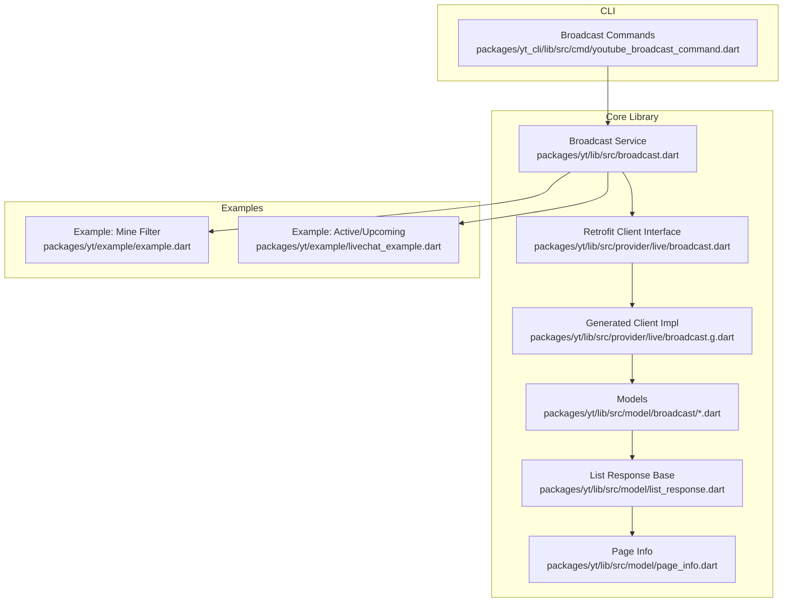
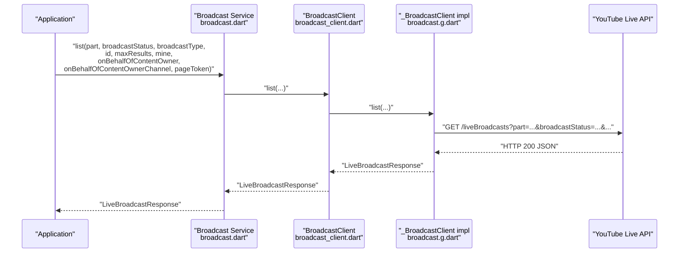
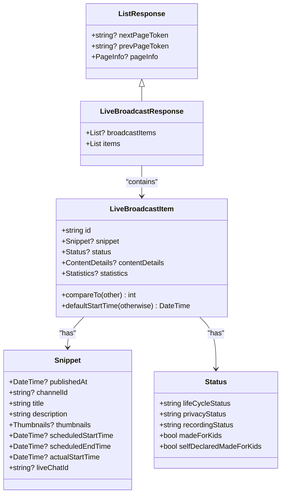
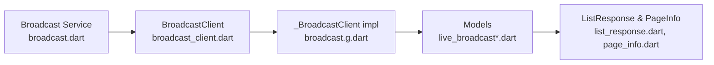
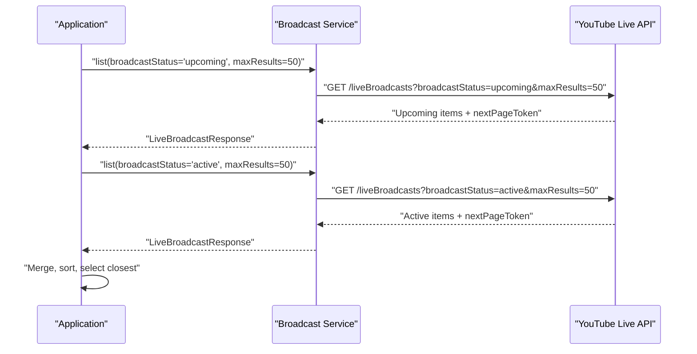

# Broadcast Querying and Filtering

<cite>
**Referenced Files in This Document**
- [broadcast.dart](file://packages/yt/lib/src/broadcast.dart)
- [broadcast.g.dart](file://packages/yt/lib/src/provider/live/broadcast.g.dart)
- [broadcast_client.dart](file://packages/yt/lib/src/provider/live/broadcast.dart)
- [live_broadcast_response.dart](file://packages/yt/lib/src/model/broadcast/live_broadcast_response.dart)
- [live_broadcast_item.dart](file://packages/yt/lib/src/model/broadcast/live_broadcast_item.dart)
- [list_response.dart](file://packages/yt/lib/src/model/list_response.dart)
- [page_info.dart](file://packages/yt/lib/src/model/page_info.dart)
- [snippet.dart](file://packages/yt/lib/src/model/broadcast/snippet.dart)
- [status.dart](file://packages/yt/lib/src/model/broadcast/status.dart)
- [livechat_example.dart](file://packages/yt/example/livechat_example.dart)
- [example.dart](file://packages/yt/example/example.dart)
- [youtube_broadcast_command.dart](file://packages/yt_cli/lib/src/cmd/youtube_broadcast_command.dart)
</cite>

## Table of Contents
1. [Introduction](#introduction)
2. [Project Structure](#project-structure)
3. [Core Components](#core-components)
4. [Architecture Overview](#architecture-overview)
5. [Detailed Component Analysis](#detailed-component-analysis)
6. [Dependency Analysis](#dependency-analysis)
7. [Performance Considerations](#performance-considerations)
8. [Troubleshooting Guide](#troubleshooting-guide)
9. [Conclusion](#conclusion)
10. [Appendices](#appendices)

## Introduction
This document explains how to query and filter YouTube Live Streaming broadcasts using the core library and CLI. It covers the list method parameters for filtering by broadcast status and type, ownership, and specific IDs, along with pagination support. Practical examples demonstrate retrieving active broadcasts, upcoming broadcasts, and filtered results. Guidance is also provided for optimizing queries and managing large broadcast lists efficiently.

## Project Structure
The broadcast querying capability is implemented in the core library and surfaced through a CLI command. The core library exposes a Broadcast service that wraps a Retrofit-generated client. Responses are strongly typed using model classes.

**Diagram sources**
- [broadcast.dart:1-167](file://packages/yt/lib/src/broadcast.dart#L1-L167)
- [broadcast_client.dart:1-26](file://packages/yt/lib/src/provider/live/broadcast.dart#L1-L26)
- [broadcast.g.dart:1-72](file://packages/yt/lib/src/provider/live/broadcast.g.dart#L1-L72)
- [live_broadcast_response.dart:1-54](file://packages/yt/lib/src/model/broadcast/live_broadcast_response.dart#L1-L54)
- [list_response.dart:1-23](file://packages/yt/lib/src/model/list_response.dart#L1-L23)
- [page_info.dart:1-26](file://packages/yt/lib/src/model/page_info.dart#L1-L26)
- [example.dart:37-46](file://packages/yt/example/example.dart#L37-L46)
- [livechat_example.dart:1-29](file://packages/yt/example/livechat_example.dart#L1-L29)
- [youtube_broadcast_command.dart:1-374](file://packages/yt_cli/lib/src/cmd/youtube_broadcast_command.dart#L1-L374)

**Section sources**
- [broadcast.dart:1-167](file://packages/yt/lib/src/broadcast.dart#L1-L167)
- [broadcast_client.dart:1-26](file://packages/yt/lib/src/provider/live/broadcast.dart#L1-L26)
- [broadcast.g.dart:1-72](file://packages/yt/lib/src/provider/live/broadcast.g.dart#L1-L72)
- [live_broadcast_response.dart:1-54](file://packages/yt/lib/src/model/broadcast/live_broadcast_response.dart#L1-L54)
- [list_response.dart:1-23](file://packages/yt/lib/src/model/list_response.dart#L1-L23)
- [page_info.dart:1-26](file://packages/yt/lib/src/model/page_info.dart#L1-L26)
- [example.dart:37-46](file://packages/yt/example/example.dart#L37-L46)
- [livechat_example.dart:1-29](file://packages/yt/example/livechat_example.dart#L1-L29)
- [youtube_broadcast_command.dart:1-374](file://packages/yt_cli/lib/src/cmd/youtube_broadcast_command.dart#L1-L374)

## Core Components
- Broadcast service: Exposes the list method with parameters for filtering and pagination.
- Retrofit client: Translates the list call into a REST GET request to the liveBroadcasts endpoint.
- Models: Strongly typed responses including LiveBroadcastResponse, LiveBroadcastItem, PageInfo, and related sub-models.
- CLI: Provides a command-line interface to list broadcasts with the same parameters.

Key capabilities:
- Filter by broadcastStatus: active, upcoming, completed, all
- Filter by broadcastType: all, event, persistent
- Filter by ownership: mine
- Filter by specific IDs: id
- Pagination: pageToken, maxResults
- Content owner scoping: onBehalfOfContentOwner, onBehalfOfContentOwnerChannel

**Section sources**
- [broadcast.dart:12-36](file://packages/yt/lib/src/broadcast.dart#L12-L36)
- [broadcast_client.dart:12-26](file://packages/yt/lib/src/provider/live/broadcast.dart#L12-L26)
- [broadcast.g.dart:24-72](file://packages/yt/lib/src/provider/live/broadcast.g.dart#L24-L72)
- [live_broadcast_response.dart:11-32](file://packages/yt/lib/src/model/broadcast/live_broadcast_response.dart#L11-L32)
- [live_broadcast_item.dart:13-40](file://packages/yt/lib/src/model/broadcast/live_broadcast_item.dart#L13-L40)
- [list_response.dart:4-22](file://packages/yt/lib/src/model/list_response.dart#L4-L22)
- [page_info.dart:7-25](file://packages/yt/lib/src/model/page_info.dart#L7-L25)
- [youtube_broadcast_command.dart:96-179](file://packages/yt_cli/lib/src/cmd/youtube_broadcast_command.dart#L96-L179)

## Architecture Overview
The Broadcast service delegates to a Retrofit-generated client that constructs and executes HTTP requests. The response is deserialized into strongly typed models.

**Diagram sources**
- [broadcast.dart:12-36](file://packages/yt/lib/src/broadcast.dart#L12-L36)
- [broadcast_client.dart:12-26](file://packages/yt/lib/src/provider/live/broadcast.dart#L12-L26)
- [broadcast.g.dart:24-72](file://packages/yt/lib/src/provider/live/broadcast.g.dart#L24-L72)

## Detailed Component Analysis

### Broadcast Service: list Method
The Broadcast service provides a single entry point to list broadcasts with comprehensive filtering and pagination options.

- Parameters:
  - part: Comma-separated list of response parts
  - broadcastStatus: active | upcoming | completed | all
  - broadcastType: all | event | persistent
  - id: Comma-separated broadcast IDs
  - maxResults: Integer limit per page
  - mine: Boolean ownership filter
  - onBehalfOfContentOwner: String
  - onBehalfOfContentOwnerChannel: String
  - pageToken: String for pagination

- Behavior:
  - Delegates to the generated client
  - Supports optional content owner scoping
  - Returns a LiveBroadcastResponse containing items and pagination metadata

- Convenience helpers:
  - getActiveBroadcast: Retrieves the first active broadcast
  - getUpcomingAndActiveBroadcast: Combines upcoming and active lists, sorts, and selects the closest

**Section sources**
- [broadcast.dart:12-36](file://packages/yt/lib/src/broadcast.dart#L12-L36)
- [broadcast.dart:128-166](file://packages/yt/lib/src/broadcast.dart#L128-L166)

### Retrofit Client and Generated Implementation
The Retrofit client defines the REST endpoint and maps query parameters to the HTTP request.

- Endpoint: GET /liveBroadcasts
- Query parameters:
  - part (required by Retrofit)
  - broadcastStatus, broadcastType, id, maxResults, mine
  - onBehalfOfContentOwner, onBehalfOfContentOwnerChannel
  - pageToken

- Implementation:
  - Builds query parameters map
  - Removes null values
  - Executes request and deserializes to LiveBroadcastResponse

**Section sources**
- [broadcast_client.dart:12-26](file://packages/yt/lib/src/provider/live/broadcast.dart#L12-L26)
- [broadcast.g.dart:24-72](file://packages/yt/lib/src/provider/live/broadcast.g.dart#L24-L72)

### Response Models
- LiveBroadcastResponse: Extends ListResponse and contains items (List<LiveBroadcastItem>) plus pagination tokens and pageInfo.
- LiveBroadcastItem: Represents a single broadcast with id, snippet, status, contentDetails, and statistics.
- ListResponse: Base class with nextPageToken, prevPageToken, and pageInfo.
- PageInfo: Total results and results per page.
- Snippet: Title, description, scheduled times, thumbnails, liveChatId.
- Status: Lifecycle status, privacy status, recording status, and kid-directed flags.

**Diagram sources**
- [list_response.dart:4-22](file://packages/yt/lib/src/model/list_response.dart#L4-L22)
- [live_broadcast_response.dart:11-32](file://packages/yt/lib/src/model/broadcast/live_broadcast_response.dart#L11-L32)
- [live_broadcast_item.dart:13-62](file://packages/yt/lib/src/model/broadcast/live_broadcast_item.dart#L13-L62)
- [snippet.dart:9-63](file://packages/yt/lib/src/model/broadcast/snippet.dart#L9-L63)
- [status.dart:7-59](file://packages/yt/lib/src/model/broadcast/status.dart#L7-L59)

**Section sources**
- [live_broadcast_response.dart:11-54](file://packages/yt/lib/src/model/broadcast/live_broadcast_response.dart#L11-L54)
- [live_broadcast_item.dart:13-62](file://packages/yt/lib/src/model/broadcast/live_broadcast_item.dart#L13-L62)
- [list_response.dart:4-22](file://packages/yt/lib/src/model/list_response.dart#L4-L22)
- [page_info.dart:7-25](file://packages/yt/lib/src/model/page_info.dart#L7-L25)
- [snippet.dart:9-63](file://packages/yt/lib/src/model/broadcast/snippet.dart#L9-L63)
- [status.dart:7-59](file://packages/yt/lib/src/model/broadcast/status.dart#L7-L59)

### Practical Examples

- Retrieve broadcasts owned by the authenticated user:
  - Use the mine parameter to restrict results to the caller’s channel.
  - Example invocation pattern is demonstrated in the example app.

- Retrieve active broadcasts:
  - Set broadcastStatus to active.
  - Optionally combine with mine for ownership filtering.

- Retrieve upcoming broadcasts:
  - Set broadcastStatus to upcoming.
  - Use maxResults to limit the number of upcoming broadcasts returned.

- Retrieve specific broadcast IDs:
  - Pass a comma-separated list of IDs via the id parameter.

- Filter by broadcast type:
  - Use broadcastType with values all, event, or persistent.
  - The CLI documentation clarifies allowed values and defaults.

- Pagination:
  - Use pageToken to fetch subsequent pages.
  - Use maxResults to control page size.

- Content owner scoping:
  - Use onBehalfOfContentOwner and onBehalfOfContentOwnerChannel to act on behalf of a content owner and/or their channel.

**Section sources**
- [example.dart:37-46](file://packages/yt/example/example.dart#L37-L46)
- [livechat_example.dart:11-16](file://packages/yt/example/livechat_example.dart#L11-L16)
- [broadcast.dart:128-166](file://packages/yt/lib/src/broadcast.dart#L128-L166)
- [youtube_broadcast_command.dart:105-179](file://packages/yt_cli/lib/src/cmd/youtube_broadcast_command.dart#L105-L179)

## Dependency Analysis
The Broadcast service depends on the Retrofit client, which depends on the generated implementation. Models depend on shared base classes for list responses and page info.

**Diagram sources**
- [broadcast.dart:7-10](file://packages/yt/lib/src/broadcast.dart#L7-L10)
- [broadcast_client.dart:8-10](file://packages/yt/lib/src/provider/live/broadcast.dart#L8-L10)
- [broadcast.g.dart:1-5](file://packages/yt/lib/src/provider/live/broadcast.g.dart#L1-L5)
- [live_broadcast_response.dart:1-9](file://packages/yt/lib/src/model/broadcast/live_broadcast_response.dart#L1-L9)
- [list_response.dart:1-5](file://packages/yt/lib/src/model/list_response.dart#L1-L5)
- [page_info.dart:1-5](file://packages/yt/lib/src/model/page_info.dart#L1-L5)

**Section sources**
- [broadcast.dart:7-10](file://packages/yt/lib/src/broadcast.dart#L7-L10)
- [broadcast_client.dart:8-10](file://packages/yt/lib/src/provider/live/broadcast.dart#L8-L10)
- [broadcast.g.dart:1-5](file://packages/yt/lib/src/provider/live/broadcast.g.dart#L1-L5)
- [live_broadcast_response.dart:1-9](file://packages/yt/lib/src/model/broadcast/live_broadcast_response.dart#L1-L9)
- [list_response.dart:1-5](file://packages/yt/lib/src/model/list_response.dart#L1-L5)
- [page_info.dart:1-5](file://packages/yt/lib/src/model/page_info.dart#L1-L5)

## Performance Considerations
- Use broadcastStatus to narrow results early and reduce payload size.
- Limit maxResults to reasonable values to minimize network overhead.
- Prefer pagination with pageToken for large result sets to avoid long-running requests.
- Use mine to restrict to the authenticated user’s broadcasts when applicable.
- Filter by broadcastType to exclude irrelevant broadcast kinds.
- Filter by specific IDs to retrieve targeted broadcasts efficiently.
- Sort and select only required parts via the part parameter to reduce deserialization cost.

[No sources needed since this section provides general guidance]

## Troubleshooting Guide
Common issues and resolutions:
- Empty results:
  - Verify broadcastStatus and broadcastType combinations.
  - Confirm mine flag aligns with the intended ownership scope.
  - Ensure onBehalfOfContentOwner and onBehalfOfContentOwnerChannel are set correctly when acting on behalf of a content owner.

- Pagination:
  - Use nextPageToken from the previous response to fetch subsequent pages.
  - Respect maxResults limits and handle truncated results.

- Authentication and permissions:
  - Ensure OAuth credentials are configured.
  - Confirm the authenticated account has permission to view the requested broadcasts.

- Parameter validation:
  - Validate allowed values for broadcastStatus and broadcastType.
  - Ensure id is a comma-separated list of valid broadcast IDs.

**Section sources**
- [live_broadcast_response.dart:11-32](file://packages/yt/lib/src/model/broadcast/live_broadcast_response.dart#L11-L32)
- [broadcast.g.dart:24-72](file://packages/yt/lib/src/provider/live/broadcast.g.dart#L24-L72)
- [youtube_broadcast_command.dart:105-179](file://packages/yt_cli/lib/src/cmd/youtube_broadcast_command.dart#L105-L179)

## Conclusion
The Broadcast service provides a robust, strongly typed interface to query and filter YouTube Live Streaming broadcasts. By combining broadcastStatus, broadcastType, ownership flags, and ID-based filters with pagination, applications can efficiently discover and manage broadcasts. The CLI and example apps demonstrate practical usage patterns for common scenarios.

[No sources needed since this section summarizes without analyzing specific files]

## Appendices

### API Workflow: Retrieving Upcoming and Active Broadcasts

**Diagram sources**
- [broadcast.dart:138-166](file://packages/yt/lib/src/broadcast.dart#L138-L166)
- [broadcast.g.dart:24-72](file://packages/yt/lib/src/provider/live/broadcast.g.dart#L24-L72)