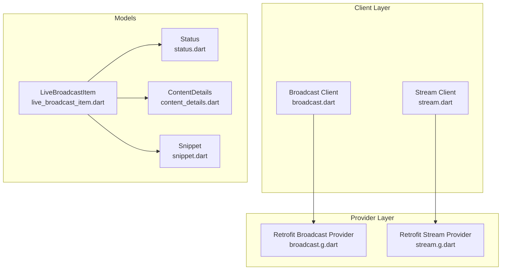
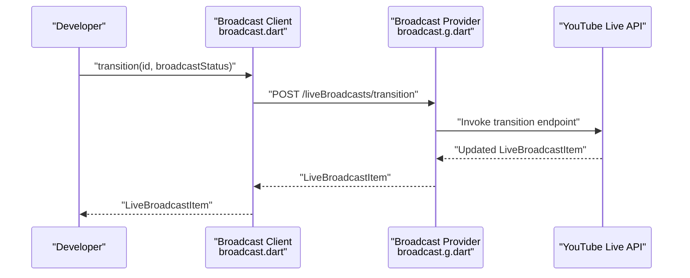
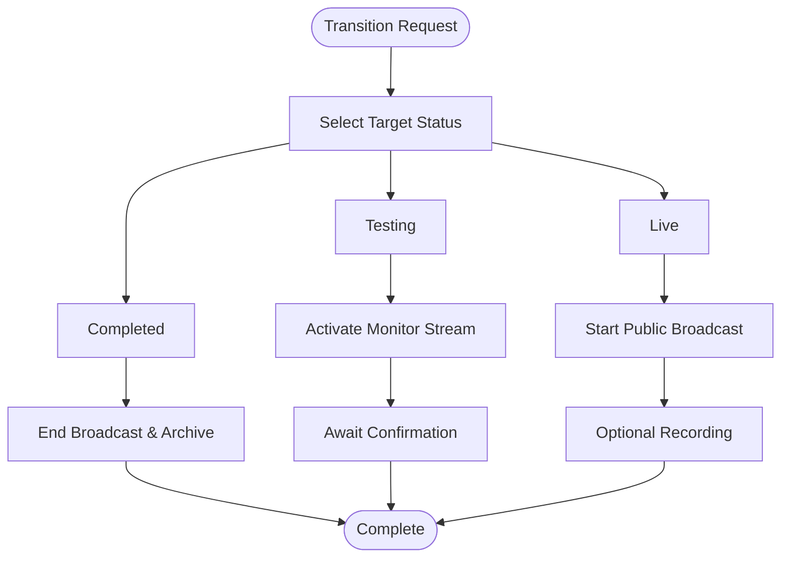
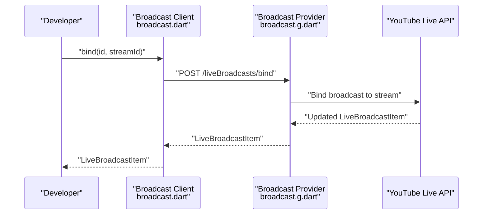
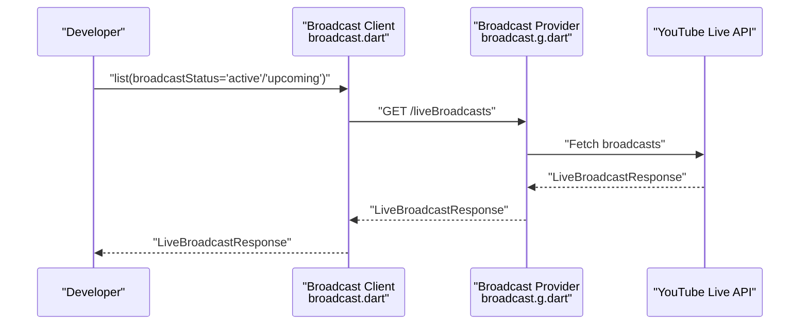
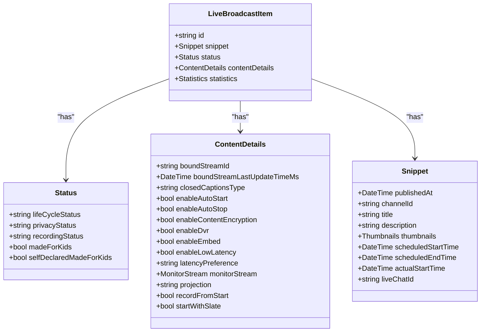
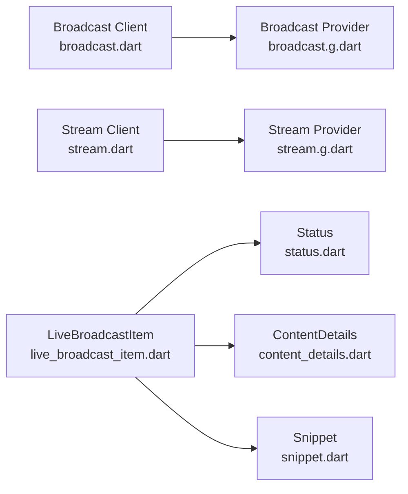

# Broadcast Status Management

<cite>
**Referenced Files in This Document**
- [broadcast.dart](file://packages/yt/lib/src/broadcast.dart)
- [broadcast.g.dart](file://packages/yt/lib/src/provider/live/broadcast.dart)
- [stream.dart](file://packages/yt/lib/src/live_stream.dart)
- [stream.g.dart](file://packages/yt/lib/src/provider/live/stream.dart)
- [status.dart](file://packages/yt/lib/src/model/broadcast/status.dart)
- [content_details.dart](file://packages/yt/lib/src/model/broadcast/content_details.dart)
- [live_broadcast_item.dart](file://packages/yt/lib/src/model/broadcast/live_broadcast_item.dart)
- [snippet.dart](file://packages/yt/lib/src/model/broadcast/snippet.dart)
</cite>

## Table of Contents
1. [Introduction](#introduction)
2. [Project Structure](#project-structure)
3. [Core Components](#core-components)
4. [Architecture Overview](#architecture-overview)
5. [Detailed Component Analysis](#detailed-component-analysis)
6. [Dependency Analysis](#dependency-analysis)
7. [Performance Considerations](#performance-considerations)
8. [Troubleshooting Guide](#troubleshooting-guide)
9. [Conclusion](#conclusion)

## Introduction
This document explains broadcast status management in the YouTube Live Streaming API as implemented in the repository. It covers all lifecycle states (created, testing, live, completed, and upcoming), the transition mechanism, and status-specific configurations such as monitor stream activation during testing, live stream initiation, and broadcast completion. Practical workflows, validation considerations, and best practices are included to help developers reliably manage broadcast availability and scheduling.

## Project Structure
The broadcast and live streaming capabilities are implemented as a client wrapper around Retrofit-generated providers. The broadcast module exposes high-level methods for listing, inserting, updating, transitioning, binding, and deleting live broadcasts. The live stream module provides similar operations for streams. Models define the structure of broadcast items, status, content details, and snippets.

**Diagram sources**
- [broadcast.dart:1-168](file://packages/yt/lib/src/broadcast.dart#L1-L168)
- [broadcast.g.dart:1-96](file://packages/yt/lib/src/provider/live/broadcast.dart#L1-L96)
- [stream.dart:1-81](file://packages/yt/lib/src/live_stream.dart#L1-L81)
- [stream.g.dart:1-68](file://packages/yt/lib/src/provider/live/stream.dart#L1-L68)
- [live_broadcast_item.dart:1-63](file://packages/yt/lib/src/model/broadcast/live_broadcast_item.dart#L1-L63)
- [status.dart:1-60](file://packages/yt/lib/src/model/broadcast/status.dart#L1-L60)
- [content_details.dart:1-121](file://packages/yt/lib/src/model/broadcast/content_details.dart#L1-L121)
- [snippet.dart:1-64](file://packages/yt/lib/src/model/broadcast/snippet.dart#L1-L64)

**Section sources**
- [broadcast.dart:1-168](file://packages/yt/lib/src/broadcast.dart#L1-L168)
- [broadcast.g.dart:1-96](file://packages/yt/lib/src/provider/live/broadcast.dart#L1-L96)
- [stream.dart:1-81](file://packages/yt/lib/src/live_stream.dart#L1-L81)
- [stream.g.dart:1-68](file://packages/yt/lib/src/provider/live/stream.dart#L1-L68)
- [live_broadcast_item.dart:1-63](file://packages/yt/lib/src/model/broadcast/live_broadcast_item.dart#L1-L63)
- [status.dart:1-60](file://packages/yt/lib/src/model/broadcast/status.dart#L1-L60)
- [content_details.dart:1-121](file://packages/yt/lib/src/model/broadcast/content_details.dart#L1-L121)
- [snippet.dart:1-64](file://packages/yt/lib/src/model/broadcast/snippet.dart#L1-L64)

## Core Components
- Broadcast client: Provides methods to list, insert, update, transition, bind, and delete live broadcasts. The transition method updates the broadcast’s lifecycle state and triggers related actions (e.g., monitor stream activation during testing).
- Stream client: Manages live streams, enabling creation, updates, listing, and deletion.
- Models:
  - LiveBroadcastItem: Encapsulates broadcast metadata, status, content details, and statistics.
  - Status: Defines lifecycle status, privacy status, recording status, and child-directed flags.
  - ContentDetails: Contains stream binding, closed captions mode, auto-start/stop, encryption, DVR, embed, latency preference, monitor stream, projection, recording behavior, and slate options.
  - Snippet: Holds broadcast title, description, scheduling, and live chat identifiers.

Key responsibilities:
- Transitioning a broadcast to testing activates the monitor stream for preview.
- Transitioning to live initiates the public broadcast and optional recording.
- Completing a broadcast ends the stream and finalizes archival/recording.
- Upcoming broadcasts are scheduled and can be discovered via list filters.

**Section sources**
- [broadcast.dart:77-93](file://packages/yt/lib/src/broadcast.dart#L77-L93)
- [broadcast.g.dart:70-82](file://packages/yt/lib/src/provider/live/broadcast.dart#L70-L82)
- [status.dart:8-59](file://packages/yt/lib/src/model/broadcast/status.dart#L8-L59)
- [content_details.dart:11-120](file://packages/yt/lib/src/model/broadcast/content_details.dart#L11-L120)
- [live_broadcast_item.dart:14-62](file://packages/yt/lib/src/model/broadcast/live_broadcast_item.dart#L14-L62)
- [snippet.dart:11-63](file://packages/yt/lib/src/model/broadcast/snippet.dart#L11-L63)

## Architecture Overview
The broadcast lifecycle is orchestrated by the Broadcast client, which delegates HTTP operations to the Retrofit-generated BroadcastClient. The LiveBroadcastItem returned by operations carries the current state in its Status and ContentDetails fields. The Stream client manages the underlying live stream that can be bound to a broadcast.

**Diagram sources**
- [broadcast.dart:77-93](file://packages/yt/lib/src/broadcast.dart#L77-L93)
- [broadcast.g.dart:70-82](file://packages/yt/lib/src/provider/live/broadcast.dart#L70-L82)

## Detailed Component Analysis

### Broadcast Lifecycle States and Transitions
Supported lifecycle statuses include created, testing, live, completed, and upcoming. The transition method updates the broadcast’s lifecycle status and triggers associated behaviors.

- Created: Broadcast exists but lacks complete settings; cannot transition to live/testing until ready.
- Testing: Visible only to the partner; monitor stream activated for preview.
- Live: Publicly streaming; optional recording may be enabled.
- Completed: Broadcast finalized; stream ends and archival completes.
- Upcoming: Scheduled broadcast awaiting start.

Transition effects:
- Transition to testing: Activates monitor stream for review.
- Transition to live: Starts public broadcast; optional recording begins.
- Transition to completed: Ends broadcast and finalizes archival.

**Diagram sources**
- [broadcast.dart:77-93](file://packages/yt/lib/src/broadcast.dart#L77-L93)
- [status.dart:10-21](file://packages/yt/lib/src/model/broadcast/status.dart#L10-L21)
- [content_details.dart:68-69](file://packages/yt/lib/src/model/broadcast/content_details.dart#L68-L69)

**Section sources**
- [broadcast.dart:77-93](file://packages/yt/lib/src/broadcast.dart#L77-L93)
- [status.dart:10-21](file://packages/yt/lib/src/model/broadcast/status.dart#L10-L21)

### Status-Specific Configurations
Monitor stream activation during testing:
- The monitor stream object is part of ContentDetails and becomes active when transitioning to testing.

Live stream initiation:
- A stream must be bound to a broadcast before transitioning to testing or live.
- Auto-start behavior can be configured via ContentDetails.enableAutoStart.

Broadcast completion procedures:
- Transition to completed to finalize the broadcast and end the stream.
- Recording behavior is controlled by ContentDetails.recordFromStart and related flags.

Privacy and visibility:
- Privacy status affects who can view the broadcast; managed via Status.privacyStatus.

Child-directed settings:
- Flags indicate child-directed designation and self-declarations.

**Section sources**
- [content_details.dart:68-69](file://packages/yt/lib/src/model/broadcast/content_details.dart#L68-L69)
- [content_details.dart:26-30](file://packages/yt/lib/src/model/broadcast/content_details.dart#L26-L30)
- [status.dart:23-29](file://packages/yt/lib/src/model/broadcast/status.dart#L23-L29)
- [status.dart:39-43](file://packages/yt/lib/src/model/broadcast/status.dart#L39-L43)

### Binding a Stream to a Broadcast
Binding associates a live stream with a broadcast. The bind operation ensures the broadcast can transition to testing or live using the bound stream.

**Diagram sources**
- [broadcast.dart:95-111](file://packages/yt/lib/src/broadcast.dart#L95-L111)
- [broadcast.g.dart:56-68](file://packages/yt/lib/src/provider/live/broadcast.dart#L56-L68)

**Section sources**
- [broadcast.dart:95-111](file://packages/yt/lib/src/broadcast.dart#L95-L111)
- [broadcast.g.dart:56-68](file://packages/yt/lib/src/provider/live/broadcast.dart#L56-L68)

### Listing and Managing Broadcasts
- List broadcasts filtered by status (e.g., active, upcoming) to discover current or scheduled events.
- Retrieve the closest upcoming or active broadcast for operational workflows.

**Diagram sources**
- [broadcast.dart:12-37](file://packages/yt/lib/src/broadcast.dart#L12-L37)
- [broadcast.g.dart:12-26](file://packages/yt/lib/src/provider/live/broadcast.dart#L12-L26)

**Section sources**
- [broadcast.dart:128-166](file://packages/yt/lib/src/broadcast.dart#L128-L166)
- [broadcast.g.dart:12-26](file://packages/yt/lib/src/provider/live/broadcast.dart#L12-L26)

### Data Model Relationships
The broadcast item aggregates status, content details, and snippet information. These fields collectively represent the broadcast’s state, configuration, and metadata.

**Diagram sources**
- [live_broadcast_item.dart:14-62](file://packages/yt/lib/src/model/broadcast/live_broadcast_item.dart#L14-L62)
- [status.dart:9-59](file://packages/yt/lib/src/model/broadcast/status.dart#L9-L59)
- [content_details.dart:11-120](file://packages/yt/lib/src/model/broadcast/content_details.dart#L11-L120)
- [snippet.dart:11-63](file://packages/yt/lib/src/model/broadcast/snippet.dart#L11-L63)

**Section sources**
- [live_broadcast_item.dart:14-62](file://packages/yt/lib/src/model/broadcast/live_broadcast_item.dart#L14-L62)
- [status.dart:9-59](file://packages/yt/lib/src/model/broadcast/status.dart#L9-L59)
- [content_details.dart:11-120](file://packages/yt/lib/src/model/broadcast/content_details.dart#L11-L120)
- [snippet.dart:11-63](file://packages/yt/lib/src/model/broadcast/snippet.dart#L11-L63)

## Dependency Analysis
- Broadcast client depends on the Retrofit-generated BroadcastClient for HTTP operations.
- Live stream client depends on the Retrofit-generated StreamClient for HTTP operations.
- LiveBroadcastItem composes Status, ContentDetails, and Snippet to represent a complete broadcast entity.

**Diagram sources**
- [broadcast.dart:1-168](file://packages/yt/lib/src/broadcast.dart#L1-L168)
- [broadcast.g.dart:1-96](file://packages/yt/lib/src/provider/live/broadcast.dart#L1-L96)
- [stream.dart:1-81](file://packages/yt/lib/src/live_stream.dart#L1-L81)
- [stream.g.dart:1-68](file://packages/yt/lib/src/provider/live/stream.dart#L1-L68)
- [live_broadcast_item.dart:14-62](file://packages/yt/lib/src/model/broadcast/live_broadcast_item.dart#L14-L62)
- [status.dart:9-59](file://packages/yt/lib/src/model/broadcast/status.dart#L9-L59)
- [content_details.dart:11-120](file://packages/yt/lib/src/model/broadcast/content_details.dart#L11-L120)
- [snippet.dart:11-63](file://packages/yt/lib/src/model/broadcast/snippet.dart#L11-L63)

**Section sources**
- [broadcast.dart:1-168](file://packages/yt/lib/src/broadcast.dart#L1-L168)
- [broadcast.g.dart:1-96](file://packages/yt/lib/src/provider/live/broadcast.dart#L1-L96)
- [stream.dart:1-81](file://packages/yt/lib/src/live_stream.dart#L1-L81)
- [stream.g.dart:1-68](file://packages/yt/lib/src/provider/live/stream.dart#L1-L68)
- [live_broadcast_item.dart:14-62](file://packages/yt/lib/src/model/broadcast/live_broadcast_item.dart#L14-L62)
- [status.dart:9-59](file://packages/yt/lib/src/model/broadcast/status.dart#L9-L59)
- [content_details.dart:11-120](file://packages/yt/lib/src/model/broadcast/content_details.dart#L11-L120)
- [snippet.dart:11-63](file://packages/yt/lib/src/model/broadcast/snippet.dart#L11-L63)

## Performance Considerations
- Minimize repeated polling by leveraging list filters (e.g., broadcastStatus) to fetch only relevant broadcasts.
- Batch operations where possible to reduce network overhead.
- Use appropriate parts parameters to limit payload sizes when listing or retrieving broadcasts.

## Troubleshooting Guide
Common issues and validations:
- Transition to testing requires a bound stream with an active status; otherwise, the API may reject the transition.
- Attempting to update immutable properties (e.g., certain content details) after testing or live may fail; adjust settings before transitioning.
- Privacy and child-directed flags must be set appropriately before transitioning to live.
- Monitor stream activation occurs upon transitioning to testing; verify monitor stream configuration in ContentDetails.

Operational tips:
- Confirm stream binding before transitioning to testing or live.
- Validate broadcast status before attempting transitions.
- Use list operations to discover upcoming or active broadcasts for scheduling workflows.

**Section sources**
- [broadcast.dart:77-93](file://packages/yt/lib/src/broadcast.dart#L77-L93)
- [broadcast.dart:128-166](file://packages/yt/lib/src/broadcast.dart#L128-L166)
- [content_details.dart:32-37](file://packages/yt/lib/src/model/broadcast/content_details.dart#L32-L37)
- [content_details.dart:40-44](file://packages/yt/lib/src/model/broadcast/content_details.dart#L40-L44)
- [content_details.dart:48-51](file://packages/yt/lib/src/model/broadcast/content_details.dart#L48-L51)
- [content_details.dart:82-89](file://packages/yt/lib/src/model/broadcast/content_details.dart#L82-L89)
- [status.dart:23-29](file://packages/yt/lib/src/model/broadcast/status.dart#L23-L29)
- [status.dart:39-43](file://packages/yt/lib/src/model/broadcast/status.dart#L39-L43)

## Conclusion
The broadcast status management system centers on the Broadcast client’s transition method and the associated lifecycle states. Proper configuration of ContentDetails (monitor stream, auto-start/stop, encryption, DVR, embed, latency, recording, slate) and Status (privacy, recording, child-directed flags) ensures reliable transitions from testing to live and completion. By binding streams early, validating settings before transitions, and using list filters for discovery, developers can implement robust broadcast availability and scheduling workflows.