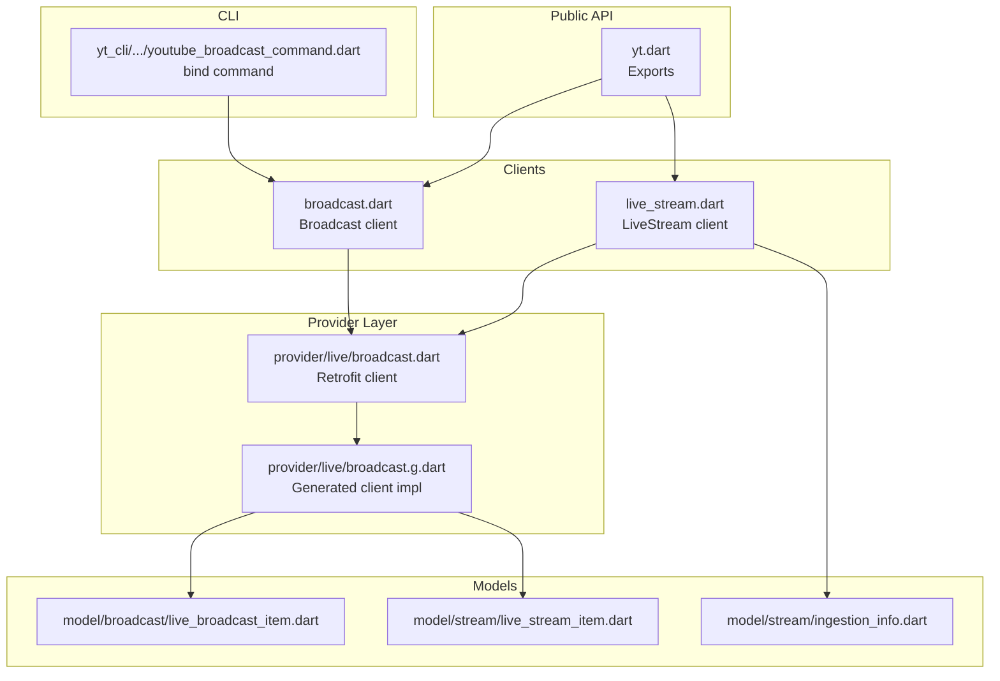
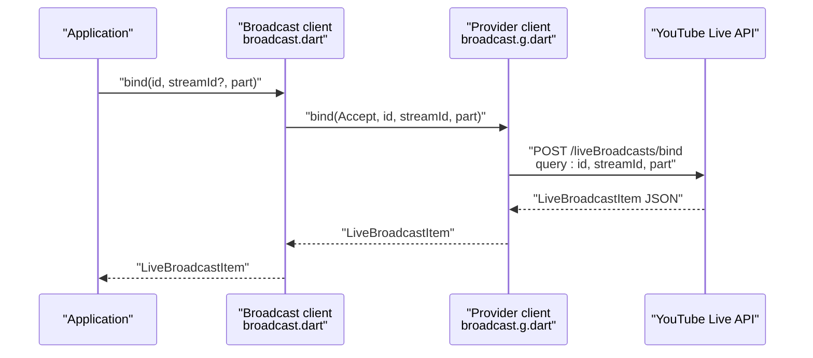
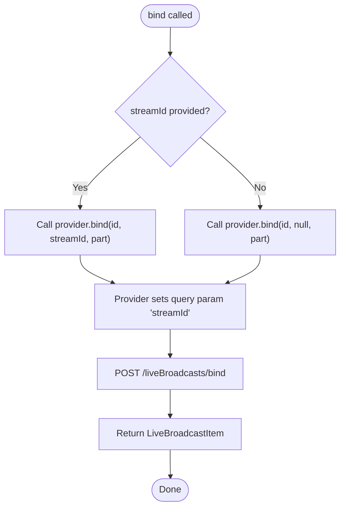
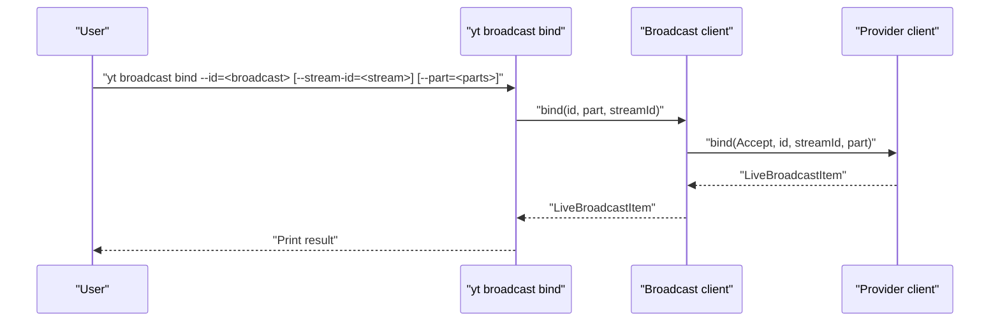
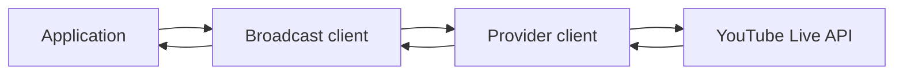

# Broadcast-Stream Binding Operations

<cite>
**Referenced Files in This Document**
- [README.md](file://README.md)
- [packages/yt/README.md](file://packages/yt/README.md)
- [packages/yt/lib/yt.dart](file://packages/yt/lib/yt.dart)
- [packages/yt/lib/src/broadcast.dart](file://packages/yt/lib/src/broadcast.dart)
- [packages/yt/lib/src/live_stream.dart](file://packages/yt/lib/src/live_stream.dart)
- [packages/yt/lib/src/provider/live/broadcast.dart](file://packages/yt/lib/src/provider/live/broadcast.dart)
- [packages/yt/lib/src/provider/live/broadcast.g.dart](file://packages/yt/lib/src/provider/live/broadcast.g.dart)
- [packages/yt/lib/src/model/broadcast/live_broadcast_item.dart](file://packages/yt/lib/src/model/broadcast/live_broadcast_item.dart)
- [packages/yt/lib/src/model/stream/live_stream_item.dart](file://packages/yt/lib/src/model/stream/live_stream_item.dart)
- [packages/yt/lib/src/model/stream/ingestion_info.dart](file://packages/yt/lib/src/model/stream/ingestion_info.dart)
- [packages/yt_cli/lib/src/cmd/youtube_broadcast_command.dart](file://packages/yt_cli/lib/src/cmd/youtube_broadcast_command.dart)
</cite>

## Table of Contents
1. [Introduction](#introduction)
2. [Project Structure](#project-structure)
3. [Core Components](#core-components)
4. [Architecture Overview](#architecture-overview)
5. [Detailed Component Analysis](#detailed-component-analysis)
6. [Dependency Analysis](#dependency-analysis)
7. [Performance Considerations](#performance-considerations)
8. [Troubleshooting Guide](#troubleshooting-guide)
9. [Conclusion](#conclusion)

## Introduction
This document explains broadcast-stream binding operations in the YouTube Live Streaming API as implemented in the repository. It focuses on how to bind and unbind a live broadcast to a video stream, the relationship between broadcasts and streams (one-to-one broadcast-to-stream, and multi-broadcast-to-one-stream), validation requirements, error handling, and practical workflows. It also provides examples and best practices for preparing streams and coordinating broadcasts.

## Project Structure
The repository provides a Dart/Flutter client for YouTube APIs, including the Live Streaming API. The relevant modules for broadcast-stream binding are organized as follows:
- Public API surface exports in the main library
- Broadcast and LiveStream client wrappers
- Retrofit-generated provider for YouTube Live Streaming API endpoints
- Strongly-typed models for broadcast and stream resources
- CLI command for binding a broadcast to a stream

**Diagram sources**
- [packages/yt/lib/yt.dart:11-66](file://packages/yt/lib/yt.dart#L11-L66)
- [packages/yt/lib/src/broadcast.dart:1-168](file://packages/yt/lib/src/broadcast.dart#L1-L168)
- [packages/yt/lib/src/live_stream.dart:1-81](file://packages/yt/lib/src/live_stream.dart#L1-L81)
- [packages/yt/lib/src/provider/live/broadcast.dart:1-96](file://packages/yt/lib/src/provider/live/broadcast.dart#L1-L96)
- [packages/yt/lib/src/provider/live/broadcast.g.dart:172-254](file://packages/yt/lib/src/provider/live/broadcast.g.dart#L172-L254)
- [packages/yt/lib/src/model/broadcast/live_broadcast_item.dart:13-63](file://packages/yt/lib/src/model/broadcast/live_broadcast_item.dart#L13-L63)
- [packages/yt/lib/src/model/stream/live_stream_item.dart:12-44](file://packages/yt/lib/src/model/stream/live_stream_item.dart#L12-L44)
- [packages/yt/lib/src/model/stream/ingestion_info.dart:7-30](file://packages/yt/lib/src/model/stream/ingestion_info.dart#L7-L30)
- [packages/yt_cli/lib/src/cmd/youtube_broadcast_command.dart:329-373](file://packages/yt_cli/lib/src/cmd/youtube_broadcast_command.dart#L329-L373)

**Section sources**
- [README.md:55-71](file://README.md#L55-L71)
- [packages/yt/README.md:445-449](file://packages/yt/README.md#L445-L449)
- [packages/yt/lib/yt.dart:11-66](file://packages/yt/lib/yt.dart#L11-L66)

## Core Components
- Broadcast client: Provides list, insert, update, transition, bind, and delete operations for live broadcasts.
- LiveStream client: Provides list, insert, update, and delete operations for live streams.
- Provider layer: Retrofit-based client that maps to YouTube Live Streaming API endpoints, including bind and transition.
- Models: Strongly typed resources for LiveBroadcastItem and LiveStreamItem, plus ingestion metadata.

Key responsibilities:
- Bind operation: Connects a broadcast to a stream or removes an existing binding when streamId is omitted.
- Relationship semantics: One broadcast binds to one stream; one stream can be bound to multiple broadcasts.
- Validation: Requires a valid broadcast id and optional stream id; missing stream id removes binding.
- Error handling: Generated client wraps responses and propagates exceptions.

**Section sources**
- [packages/yt/lib/src/broadcast.dart:95-111](file://packages/yt/lib/src/broadcast.dart#L95-L111)
- [packages/yt/lib/src/live_stream.dart:6](file://packages/yt/lib/src/live_stream.dart#L6)
- [packages/yt/lib/src/provider/live/broadcast.dart:56-68](file://packages/yt/lib/src/provider/live/broadcast.dart#L56-L68)
- [packages/yt/lib/src/provider/live/broadcast.g.dart:172-212](file://packages/yt/lib/src/provider/live/broadcast.g.dart#L172-L212)
- [packages/yt/lib/src/model/broadcast/live_broadcast_item.dart:13-63](file://packages/yt/lib/src/model/broadcast/live_broadcast_item.dart#L13-L63)
- [packages/yt/lib/src/model/stream/live_stream_item.dart:12-44](file://packages/yt/lib/src/model/stream/live_stream_item.dart#L12-L44)

## Architecture Overview
The binding workflow integrates the client wrapper, provider, and models to call the YouTube Live Streaming API endpoint for binding.

**Diagram sources**
- [packages/yt/lib/src/broadcast.dart:95-111](file://packages/yt/lib/src/broadcast.dart#L95-L111)
- [packages/yt/lib/src/provider/live/broadcast.g.dart:172-212](file://packages/yt/lib/src/provider/live/broadcast.g.dart#L172-L212)
- [packages/yt/lib/src/model/broadcast/live_broadcast_item.dart:13-63](file://packages/yt/lib/src/model/broadcast/live_broadcast_item.dart#L13-L63)

## Detailed Component Analysis

### Broadcast Client and Bind Operation
The Broadcast client exposes a bind method that forwards to the provider’s bind endpoint. It supports:
- Required id: The broadcast identifier to bind
- Optional streamId: The stream identifier to bind to; omitting removes existing binding
- Part selection: Controls which broadcast resource parts are returned

Behavioral notes:
- One-to-one binding: A broadcast can only be bound to one stream at a time
- Multi-broadcast-to-one-stream: A stream can be bound to multiple broadcasts
- Unbind: Passing no streamId removes the current binding

**Diagram sources**
- [packages/yt/lib/src/broadcast.dart:95-111](file://packages/yt/lib/src/broadcast.dart#L95-L111)
- [packages/yt/lib/src/provider/live/broadcast.g.dart:172-212](file://packages/yt/lib/src/provider/live/broadcast.g.dart#L172-L212)

**Section sources**
- [packages/yt/lib/src/broadcast.dart:95-111](file://packages/yt/lib/src/broadcast.dart#L95-L111)
- [packages/yt/lib/src/provider/live/broadcast.dart:56-68](file://packages/yt/lib/src/provider/live/broadcast.dart#L56-L68)
- [packages/yt/lib/src/provider/live/broadcast.g.dart:172-212](file://packages/yt/lib/src/provider/live/broadcast.g.dart#L172-L212)

### Provider Layer: Bind Endpoint
The provider defines the bind endpoint and handles query parameters:
- Path: /liveBroadcasts/bind
- Method: POST
- Query parameters: id, streamId (optional), part, onBehalfOfContentOwner, onBehalfOfContentOwnerChannel
- Returns: LiveBroadcastItem

Error handling:
- The generated client catches deserialization errors and logs them before rethrowing.

**Section sources**
- [packages/yt/lib/src/provider/live/broadcast.dart:56-68](file://packages/yt/lib/src/provider/live/broadcast.dart#L56-L68)
- [packages/yt/lib/src/provider/live/broadcast.g.dart:172-212](file://packages/yt/lib/src/provider/live/broadcast.g.dart#L172-L212)

### Models: LiveBroadcastItem and LiveStreamItem
- LiveBroadcastItem: Contains id, snippet, status, contentDetails, statistics, and comparison helpers
- LiveStreamItem: Contains id, snippet, cdn, status

These models represent the canonical shapes returned by the API and used across binding operations.

**Section sources**
- [packages/yt/lib/src/model/broadcast/live_broadcast_item.dart:13-63](file://packages/yt/lib/src/model/broadcast/live_broadcast_item.dart#L13-L63)
- [packages/yt/lib/src/model/stream/live_stream_item.dart:12-44](file://packages/yt/lib/src/model/stream/live_stream_item.dart#L12-L44)

### Stream Preparation and Ingestion Metadata
LiveStreamItem includes CDN settings and ingestion information. The ingestion info model provides:
- Stream name and primary/backup ingestion addresses
- RTMPS ingestion endpoints

This information is essential for configuring encoders and streaming software to target YouTube’s ingest endpoints.

**Section sources**
- [packages/yt/lib/src/model/stream/live_stream_item.dart:12-44](file://packages/yt/lib/src/model/stream/live_stream_item.dart#L12-L44)
- [packages/yt/lib/src/model/stream/ingestion_info.dart:7-30](file://packages/yt/lib/src/model/stream/ingestion_info.dart#L7-L30)

### CLI Binding Workflow
The CLI provides a ready-to-use bind command:
- Accepts id, part, and optional stream-id
- Calls the broadcast.bind method internally
- Prints the resulting LiveBroadcastItem
- Wraps API errors into usage errors for clear feedback

**Diagram sources**
- [packages/yt_cli/lib/src/cmd/youtube_broadcast_command.dart:329-373](file://packages/yt_cli/lib/src/cmd/youtube_broadcast_command.dart#L329-L373)
- [packages/yt/lib/src/broadcast.dart:95-111](file://packages/yt/lib/src/broadcast.dart#L95-L111)
- [packages/yt/lib/src/provider/live/broadcast.g.dart:172-212](file://packages/yt/lib/src/provider/live/broadcast.g.dart#L172-L212)

**Section sources**
- [packages/yt_cli/lib/src/cmd/youtube_broadcast_command.dart:329-373](file://packages/yt_cli/lib/src/cmd/youtube_broadcast_command.dart#L329-L373)

## Dependency Analysis
The binding operation traverses the following dependency chain:
- Application code calls Broadcast.bind
- Broadcast client delegates to provider client
- Provider client executes HTTP request to YouTube API
- Response is parsed into LiveBroadcastItem

**Diagram sources**
- [packages/yt/lib/src/broadcast.dart:95-111](file://packages/yt/lib/src/broadcast.dart#L95-L111)
- [packages/yt/lib/src/provider/live/broadcast.g.dart:172-212](file://packages/yt/lib/src/provider/live/broadcast.g.dart#L172-L212)

**Section sources**
- [packages/yt/lib/src/broadcast.dart:95-111](file://packages/yt/lib/src/broadcast.dart#L95-L111)
- [packages/yt/lib/src/provider/live/broadcast.g.dart:172-212](file://packages/yt/lib/src/provider/live/broadcast.g.dart#L172-L212)

## Performance Considerations
- Minimize unnecessary part selections: Request only the parts needed to reduce payload size.
- Batch operations: When preparing multiple broadcasts or streams, reuse the same client instance.
- Network reliability: The provider uses Dio; ensure appropriate retry/backoff policies at the application level if needed.

## Troubleshooting Guide
Common issues and resolutions:
- Invalid broadcast id: Ensure the broadcast exists and the caller has permission to modify it.
- Invalid stream id: Verify the stream exists, is active, and belongs to the same content owner/channel context.
- Removing a binding: Omit the stream-id parameter to remove the current binding.
- API errors: The provider logs and rethrows exceptions; inspect the underlying error for details.

Operational tips:
- Confirm stream availability: Check LiveStreamItem status before binding.
- Validate parts: Use appropriate part values to receive the required fields.
- Use CLI for quick checks: The CLI bind command demonstrates correct parameter usage.

**Section sources**
- [packages/yt/lib/src/provider/live/broadcast.g.dart:172-212](file://packages/yt/lib/src/provider/live/broadcast.g.dart#L172-L212)
- [packages/yt_cli/lib/src/cmd/youtube_broadcast_command.dart:329-373](file://packages/yt_cli/lib/src/cmd/youtube_broadcast_command.dart#L329-L373)

## Conclusion
The repository provides a clean, strongly-typed interface for YouTube Live Streaming API broadcast-stream binding. The design enforces a one-to-one relationship between broadcasts and streams while allowing a single stream to serve multiple broadcasts. The provider layer encapsulates API specifics, and the models offer predictable response shapes. Use the documented bind workflow, validate identifiers, and leverage the CLI for quick verification.