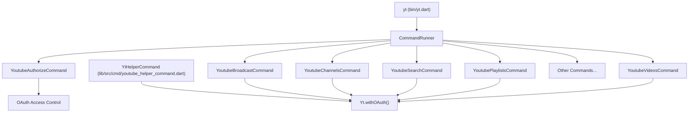
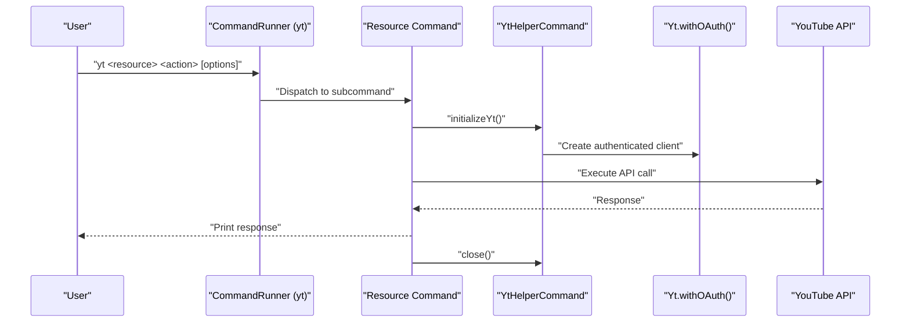
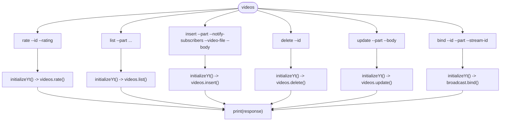
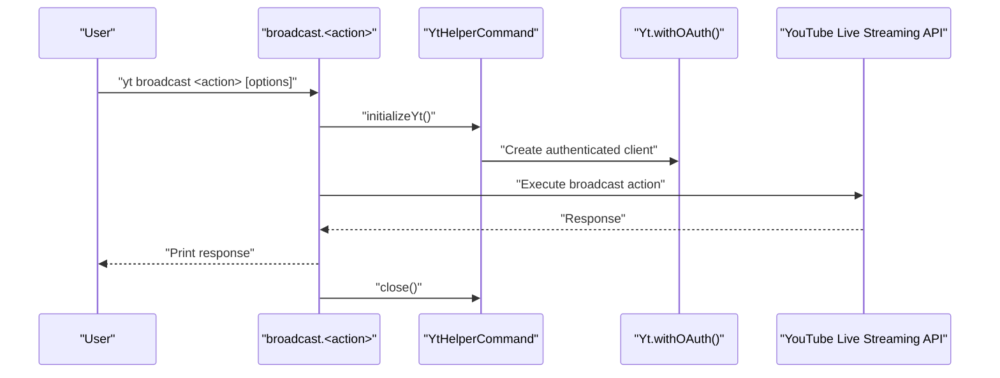
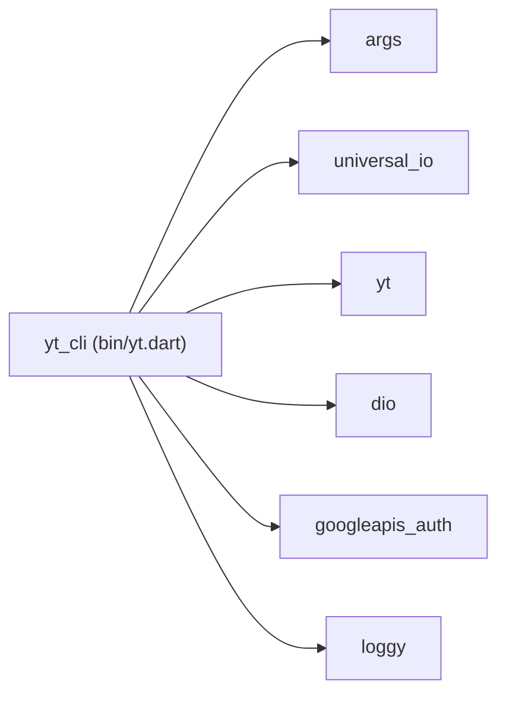

# CLI Tool

<cite>
**Referenced Files in This Document**
- [README.md](file://README.md)
- [pubspec.yaml](file://pubspec.yaml)
- [packages/yt_cli/README.md](file://packages/yt_cli/README.md)
- [packages/yt_cli/pubspec.yaml](file://packages/yt_cli/pubspec.yaml)
- [packages/yt_cli/bin/yt.dart](file://packages/yt_cli/bin/yt.dart)
- [packages/yt_cli/lib/yt_cli.dart](file://packages/yt_cli/lib/yt_cli.dart)
- [packages/yt_cli/lib/src/cmd/youtube_helper_command.dart](file://packages/yt_cli/lib/src/cmd/youtube_helper_command.dart)
- [packages/yt_cli/lib/src/cmd/youtube_authorize_command.dart](file://packages/yt_cli/lib/src/cmd/youtube_authorize_command.dart)
- [packages/yt_cli/lib/src/cmd/youtube_videos_command.dart](file://packages/yt_cli/lib/src/cmd/youtube_videos_command.dart)
- [packages/yt_cli/lib/src/cmd/youtube_broadcast_command.dart](file://packages/yt_cli/lib/src/cmd/youtube_broadcast_command.dart)
- [packages/yt_cli/lib/src/cmd/youtube_search_command.dart](file://packages/yt_cli/lib/src/cmd/youtube_search_command.dart)
- [packages/yt_cli/lib/src/cmd/youtube_playlists_command.dart](file://packages/yt_cli/lib/src/cmd/youtube_playlists_command.dart)
- [packages/yt_cli/lib/src/cmd/youtube_channels_command.dart](file://packages/yt_cli/lib/src/cmd/youtube_channels_command.dart)
</cite>

## Table of Contents
1. [Introduction](#introduction)
2. [Project Structure](#project-structure)
3. [Core Components](#core-components)
4. [Architecture Overview](#architecture-overview)
5. [Detailed Component Analysis](#detailed-component-analysis)
6. [Dependency Analysis](#dependency-analysis)
7. [Performance Considerations](#performance-considerations)
8. [Troubleshooting Guide](#troubleshooting-guide)
9. [Conclusion](#conclusion)
10. [Appendices](#appendices)

## Introduction
This document provides comprehensive CLI tool documentation for the yt_cli package. It explains all available commands, options, and configuration parameters for automating YouTube Data and Live Streaming API operations. It covers command syntax, parameter validation, output formatting, and practical examples for batch operations, scheduled tasks, and CI/CD integration. It also addresses CLI configuration, credential management, environment setup, scripting patterns, error handling in automated contexts, and best practices for production environments.

## Project Structure
The yt_cli package is a Dart-based command-line tool that exposes a set of commands for interacting with YouTube APIs. The CLI binary registers a top-level runner and a set of subcommands grouped by resource categories (videos, broadcasts, playlists, channels, search, etc.). Each subcommand defines its own options and validations.

**Diagram sources**
- [packages/yt_cli/bin/yt.dart:1-38](file://packages/yt_cli/bin/yt.dart#L1-L38)
- [packages/yt_cli/lib/src/cmd/youtube_helper_command.dart:1-46](file://packages/yt_cli/lib/src/cmd/youtube_helper_command.dart#L1-L46)
- [packages/yt_cli/lib/src/cmd/youtube_authorize_command.dart:1-89](file://packages/yt_cli/lib/src/cmd/youtube_authorize_command.dart#L1-L89)

**Section sources**
- [packages/yt_cli/bin/yt.dart:1-38](file://packages/yt_cli/bin/yt.dart#L1-L38)
- [packages/yt_cli/lib/yt_cli.dart:1-20](file://packages/yt_cli/lib/yt_cli.dart#L1-L20)
- [packages/yt_cli/lib/src/cmd/youtube_helper_command.dart:1-46](file://packages/yt_cli/lib/src/cmd/youtube_helper_command.dart#L1-L46)

## Core Components
- Top-level CLI entrypoint registers the command runner and global options.
- Helper base class initializes the authenticated client and exposes resource APIs.
- Authorization command manages OAuth credentials and access tokens.
- Resource-specific commands implement subcommands for list, insert, update, delete, and specialized actions.

Key capabilities:
- OAuth-based authentication and credential storage.
- Support for YouTube Data API and Live Streaming API operations.
- Structured option parsing with validation and help text.
- Standardized output printing and controlled exit behavior.

**Section sources**
- [packages/yt_cli/bin/yt.dart:1-38](file://packages/yt_cli/bin/yt.dart#L1-L38)
- [packages/yt_cli/lib/src/cmd/youtube_helper_command.dart:1-46](file://packages/yt_cli/lib/src/cmd/youtube_helper_command.dart#L1-L46)
- [packages/yt_cli/lib/src/cmd/youtube_authorize_command.dart:1-89](file://packages/yt_cli/lib/src/cmd/youtube_authorize_command.dart#L1-L89)

## Architecture Overview
The CLI architecture follows a command pattern with a central runner delegating to resource-specific commands. Each command inherits from a helper that initializes the authenticated client and exposes resource APIs. Options are parsed per-command with explicit validation and constraints.

**Diagram sources**
- [packages/yt_cli/bin/yt.dart:1-38](file://packages/yt_cli/bin/yt.dart#L1-L38)
- [packages/yt_cli/lib/src/cmd/youtube_helper_command.dart:1-46](file://packages/yt_cli/lib/src/cmd/youtube_helper_command.dart#L1-L46)
- [packages/yt_cli/lib/src/cmd/youtube_videos_command.dart:1-409](file://packages/yt_cli/lib/src/cmd/youtube_videos_command.dart#L1-L409)

## Detailed Component Analysis

### Global Options and Entrypoint
- Global option: --log-level with allowed values all, debug, info, warning, error, off; default off.
- Exit behavior: Non-UsageException errors cause process exit with code 64.

**Section sources**
- [packages/yt_cli/bin/yt.dart:10-14](file://packages/yt_cli/bin/yt.dart#L10-L14)
- [packages/yt_cli/bin/yt.dart:30-36](file://packages/yt_cli/bin/yt.dart#L30-L36)

### Authentication and Credentials
- Command: authorize
- Flags:
  - --overwrite-credentials (-o): Overwrite existing stored credentials.
- Behavior:
  - Prompts for client identifier and client secret when needed.
  - Stores credentials to a default location under the user’s home directory.
  - Initializes OAuth access control and prints completion message.

Credential locations:
- Default credentials file path derived from a utility constant under the user’s home directory.
- Access credentials file managed separately and removed when overwrite is requested.

**Section sources**
- [packages/yt_cli/lib/src/cmd/youtube_authorize_command.dart:9-89](file://packages/yt_cli/lib/src/cmd/youtube_authorize_command.dart#L9-L89)

### Videos Command Group
- Parent command: videos
- Subcommands:
  - rate: Adds or removes a like/dislike rating; requires id and rating (dislike, like, none).
  - list: Retrieves videos with extensive filtering and pagination options; requires part.
  - insert: Uploads a video with optional metadata; requires part, notify-subscribers, video-file, body.
  - delete: Removes a video; requires id.
  - update: Updates video metadata; requires part and body.
  - bind: Binds a broadcast to a stream (specialized).
- Validation:
  - Mandatory options enforced per subcommand.
  - Allowed values validated (e.g., rating, chart, my-rating).
  - Numeric bounds checked for max-height, max-width, max-results.
- Output:
  - Prints API responses; exits after completion.

**Diagram sources**
- [packages/yt_cli/lib/src/cmd/youtube_videos_command.dart:1-409](file://packages/yt_cli/lib/src/cmd/youtube_videos_command.dart#L1-L409)

**Section sources**
- [packages/yt_cli/lib/src/cmd/youtube_videos_command.dart:1-409](file://packages/yt_cli/lib/src/cmd/youtube_videos_command.dart#L1-L409)

### Broadcast Command Group
- Parent command: broadcast
- Subcommands:
  - transition: Changes broadcast status (complete, live, testing); requires broadcast-status and id.
  - list: Lists broadcasts with filters (broadcast-status, broadcast-type, id, max-results, pageToken).
  - insert: Creates a broadcast from JSON body or file; requires part and body.
  - delete: Removes a broadcast; requires id.
  - update: Updates broadcast settings; requires part and body.
  - bind: Binds/unbinds a broadcast to a stream; requires id and optional stream-id.
- Validation:
  - Allowed values enforced for status and type.
  - Body can be inline JSON or file path.
- Output:
  - Prints API responses; exits after completion.

**Diagram sources**
- [packages/yt_cli/lib/src/cmd/youtube_broadcast_command.dart:1-374](file://packages/yt_cli/lib/src/cmd/youtube_broadcast_command.dart#L1-L374)

**Section sources**
- [packages/yt_cli/lib/src/cmd/youtube_broadcast_command.dart:1-374](file://packages/yt_cli/lib/src/cmd/youtube_broadcast_command.dart#L1-L374)

### Search Command Group
- Parent command: search
- Subcommands:
  - list: Searches videos, channels, or playlists with numerous filters and ordering options; requires part.
- Validation:
  - Comprehensive allowed values for filters (e.g., safe-search, type, order).
  - Date-time values validated via RFC 3339 string format.
- Output:
  - Prints API responses; exits after completion.

**Section sources**
- [packages/yt_cli/lib/src/cmd/youtube_search_command.dart:1-303](file://packages/yt_cli/lib/src/cmd/youtube_search_command.dart#L1-L303)

### Playlists Command Group
- Parent command: playlists
- Subcommands:
  - list: Retrieves playlists with filters (channel-id, id, mine, max-results, pageToken); requires part.
  - insert: Creates a playlist from JSON body; requires part and body.
  - update: Updates playlist metadata; requires part and body.
  - delete: Removes a playlist; requires id.
- Validation:
  - Required options enforced.
  - JSON body decoding performed.
- Output:
  - Prints API responses; exits after completion.

**Section sources**
- [packages/yt_cli/lib/src/cmd/youtube_playlists_command.dart:1-240](file://packages/yt_cli/lib/src/cmd/youtube_playlists_command.dart#L1-L240)

### Channels Command Group
- Parent command: channels
- Subcommands:
  - list: Retrieves channel resources with filters (for-username, id); requires part.
  - update: Updates channel branding/localization/promotion; requires part and body.
- Validation:
  - Required options enforced.
  - JSON body decoding performed.
- Output:
  - Prints API responses; exits after completion.

**Section sources**
- [packages/yt_cli/lib/src/cmd/youtube_channels_command.dart:1-129](file://packages/yt_cli/lib/src/cmd/youtube_channels_command.dart#L1-L129)

### Helper Base Class
- Provides typed accessors for all major resource groups (broadcast, chat, liveStream, channels, comments, commentThreads, playlists, search, subscriptions, thumbnails, videos, videoCategories, watermarks).
- initializeYt: Creates an authenticated Yt client configured with the global --log-level.
- close: Closes the client and exits with success.

**Section sources**
- [packages/yt_cli/lib/src/cmd/youtube_helper_command.dart:1-46](file://packages/yt_cli/lib/src/cmd/youtube_helper_command.dart#L1-L46)

## Dependency Analysis
The CLI depends on:
- yt: Core library for YouTube APIs.
- args: Command parsing and help generation.
- dio: HTTP client for API calls.
- googleapis_auth: OAuth access control.
- loggy: Logging options conversion.
- universal_io: Cross-platform I/O and platform detection.

**Diagram sources**
- [packages/yt_cli/bin/yt.dart:1-38](file://packages/yt_cli/bin/yt.dart#L1-L38)
- [packages/yt_cli/pubspec.yaml:1-31](file://packages/yt_cli/pubspec.yaml#L1-L31)

**Section sources**
- [packages/yt_cli/pubspec.yaml:1-31](file://packages/yt_cli/pubspec.yaml#L1-L31)

## Performance Considerations
- Pagination: Many list operations support max-results and page-token; use pageToken to iterate efficiently.
- Part selection: Limit the part parameter to only the necessary fields to reduce payload size.
- Logging: Keep --log-level at off for automation runs; increase to debug only when diagnosing issues.
- Batch operations: Prefer streaming responses and process incrementally to avoid large memory usage.

## Troubleshooting Guide
Common issues and resolutions:
- Usage errors: The CLI catches Dio exceptions and rethrows them as UsageException with usage hints; review printed usage and correct invalid options.
- Authentication failures: Re-run authorize and ensure client credentials are present and valid.
- Network timeouts: Retry with smaller max-results or adjust client-side timeout settings.
- Permission errors: Verify OAuth scopes and account permissions for the target resource.

Operational tips:
- Capture stderr/stdout for logs in CI/CD pipelines.
- Validate JSON bodies for insert/update operations before execution.
- Use dry-run patterns by echoing options without executing writes.

**Section sources**
- [packages/yt_cli/lib/src/cmd/youtube_videos_command.dart:67-70](file://packages/yt_cli/lib/src/cmd/youtube_videos_command.dart#L67-L70)
- [packages/yt_cli/lib/src/cmd/youtube_search_command.dart:298-301](file://packages/yt_cli/lib/src/cmd/youtube_search_command.dart#L298-L301)
- [packages/yt_cli/lib/src/cmd/youtube_playlists_command.dart:153-156](file://packages/yt_cli/lib/src/cmd/youtube_playlists_command.dart#L153-L156)
- [packages/yt_cli/lib/src/cmd/youtube_channels_command.dart:124-127](file://packages/yt_cli/lib/src/cmd/youtube_channels_command.dart#L124-L127)

## Conclusion
The yt_cli package provides a robust, extensible command-line interface for automating YouTube Data and Live Streaming API operations. With structured commands, strict option validation, and standardized output, it supports reliable scripting, batch processing, and CI/CD integration. Proper credential management, logging configuration, and pagination strategies enable efficient and maintainable automation at scale.

## Appendices

### Command Reference Summary
- Global options:
  - --log-level: Set logging level (all, debug, info, warning, error, off).
- Authorization:
  - yt authorize [--overwrite-credentials]
- Videos:
  - yt videos rate --id --rating
  - yt videos list --part ...
  - yt videos insert --part --notify-subscribers --video-file --body
  - yt videos delete --id
  - yt videos update --part --body
  - yt videos bind --id --part --stream-id
- Broadcast:
  - yt broadcast transition --broadcast-status --part --id
  - yt broadcast list --part ...
  - yt broadcast insert --part --body
  - yt broadcast delete --id
  - yt broadcast update --part --body
  - yt broadcast bind --id --part --stream-id
- Search:
  - yt search list --part ...
- Playlists:
  - yt playlists list --part ...
  - yt playlists insert --part --body
  - yt playlists update --part --body
  - yt playlists delete --id
- Channels:
  - yt channels list --part ...
  - yt channels update --part --body

**Section sources**
- [packages/yt_cli/README.md:34-49](file://packages/yt_cli/README.md#L34-L49)
- [packages/yt_cli/lib/src/cmd/youtube_videos_command.dart:17-24](file://packages/yt_cli/lib/src/cmd/youtube_videos_command.dart#L17-L24)
- [packages/yt_cli/lib/src/cmd/youtube_broadcast_command.dart:19-27](file://packages/yt_cli/lib/src/cmd/youtube_broadcast_command.dart#L19-L27)
- [packages/yt_cli/lib/src/cmd/youtube_search_command.dart:18-21](file://packages/yt_cli/lib/src/cmd/youtube_search_command.dart#L18-L21)
- [packages/yt_cli/lib/src/cmd/youtube_playlists_command.dart:17-31](file://packages/yt_cli/lib/src/cmd/youtube_playlists_command.dart#L17-L31)
- [packages/yt_cli/lib/src/cmd/youtube_channels_command.dart:9-21](file://packages/yt_cli/lib/src/cmd/youtube_channels_command.dart#L9-L21)

### Configuration and Environment Setup
- Install the CLI globally via Dart pub or Homebrew as documented.
- Run yt authorize to generate and store OAuth credentials.
- Configure environment variables if needed for platform-specific paths (e.g., HOME/USERPROFILE).
- Set --log-level according to operational needs.

**Section sources**
- [packages/yt_cli/README.md:9-18](file://packages/yt_cli/README.md#L9-L18)
- [packages/yt_cli/README.md:51-59](file://packages/yt_cli/README.md#L51-L59)
- [packages/yt_cli/lib/src/cmd/youtube_authorize_command.dart:11-19](file://packages/yt_cli/lib/src/cmd/youtube_authorize_command.dart#L11-L19)

### Scripting Patterns and Automation Examples
- Batch list and export:
  - Iterate list operations with pageToken and write outputs to separate files.
- Scheduled tasks:
  - Use cron/systemd to run yt search list or videos list periodically.
- CI/CD integration:
  - Store credentials securely in CI secrets; run yt authorize once per job; execute targeted operations with --log-level off.
- Error handling:
  - Wrap commands in shell scripts with set -e and capture exit codes; retry transient failures.

[No sources needed since this section provides general guidance]