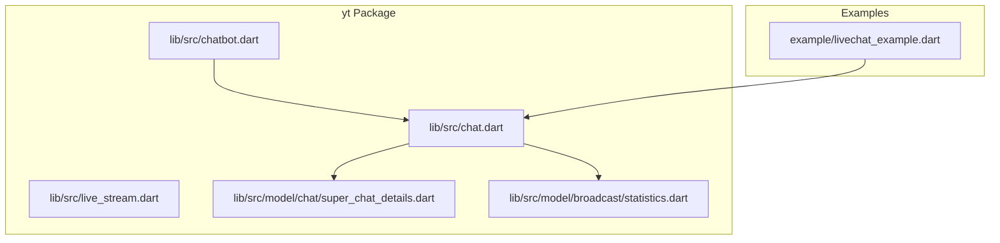
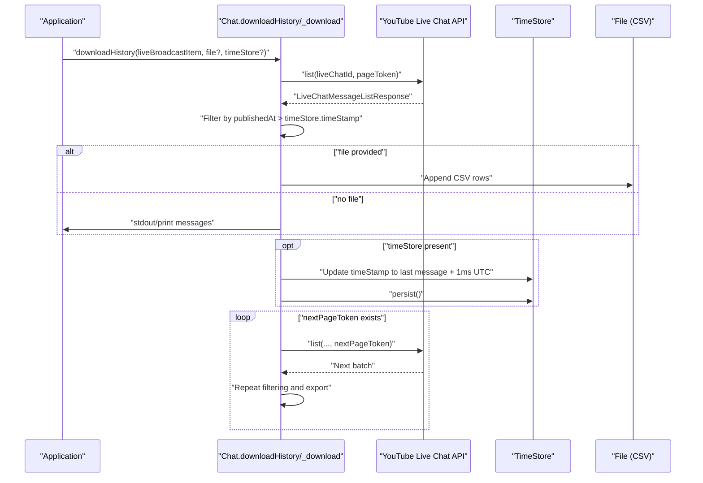
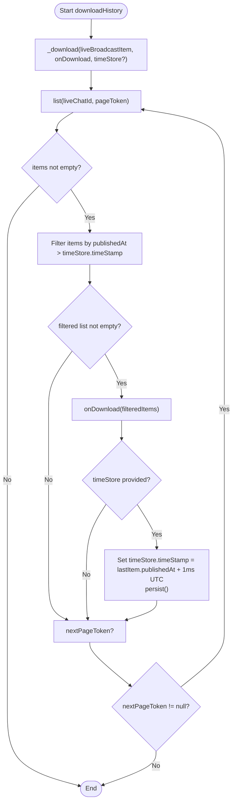
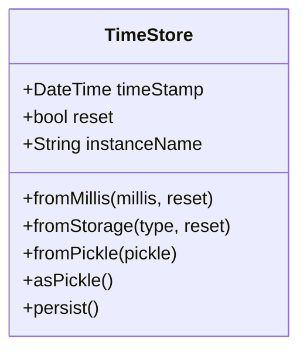
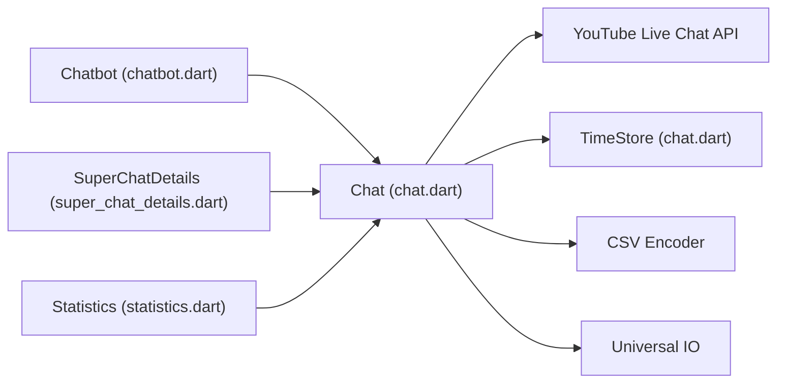

# Chat Analytics & History

<cite>
**Referenced Files in This Document**
- [README.md](file://README.md)
- [pubspec.yaml](file://pubspec.yaml)
- [chat.dart](file://packages/yt/lib/src/chat.dart)
- [live_stream.dart](file://packages/yt/lib/src/live_stream.dart)
- [livechat_example.dart](file://packages/yt/example/livechat_example.dart)
- [super_chat_details.dart](file://packages/yt/lib/src/model/chat/super_chat_details.dart)
- [statistics.dart](file://packages/yt/lib/src/model/broadcast/statistics.dart)
- [chatbot.dart](file://packages/yt/lib/src/chatbot.dart)
</cite>

## Table of Contents
1. [Introduction](#introduction)
2. [Project Structure](#project-structure)
3. [Core Components](#core-components)
4. [Architecture Overview](#architecture-overview)
5. [Detailed Component Analysis](#detailed-component-analysis)
6. [Dependency Analysis](#dependency-analysis)
7. [Performance Considerations](#performance-considerations)
8. [Troubleshooting Guide](#troubleshooting-guide)
9. [Conclusion](#conclusion)
10. [Appendices](#appendices)

## Introduction
This document explains chat analytics and historical data management capabilities centered on the YouTube Live Chat APIs. It focuses on:
- Downloading chat history with CSV export and timestamp-based filtering
- Efficient incremental retrieval using a TimeStore mechanism
- Practical analytics techniques (sentiment and engagement metrics)
- Storage strategies and memory management for large datasets
- Dashboard and trend analysis examples
- Privacy, retention, and compliance considerations

The repository provides a Dart/Flutter SDK for YouTube’s Data and Live Streaming APIs, including chat history retrieval and a lightweight TimeStore for resuming batch processing.

## Project Structure
The workspace includes multiple packages. The relevant components for chat analytics and history are primarily located under the core package yt.

**Diagram sources**
- [chat.dart:1-258](file://packages/yt/lib/src/chat.dart#L1-L258)
- [live_stream.dart:1-81](file://packages/yt/lib/src/live_stream.dart#L1-L81)
- [chatbot.dart:1-53](file://packages/yt/lib/src/chatbot.dart#L1-L53)
- [super_chat_details.dart:1-45](file://packages/yt/lib/src/model/chat/super_chat_details.dart#L1-L45)
- [statistics.dart:1-23](file://packages/yt/lib/src/model/broadcast/statistics.dart#L1-L23)
- [livechat_example.dart:1-29](file://packages/yt/example/livechat_example.dart#L1-L29)

**Section sources**
- [README.md:1-119](file://README.md#L1-L119)
- [pubspec.yaml:1-69](file://pubspec.yaml#L1-L69)

## Core Components
- Chat: Provides listing, inserting, deleting, sending, and downloading live chat history. It supports CSV export and timestamp-based filtering via a callback-driven pipeline.
- TimeStore: A persistent timestamp tracker used to resume downloads from the last processed message, ensuring incremental retrieval.
- Chatbot: A simple intent-matching assistant that can respond to chat messages and integrate with the download pipeline.
- LiveStream: Related to live broadcast infrastructure; useful for discovering active or upcoming live chats.
- SuperChatDetails and Statistics: Data models for monetized chat events and broadcast statistics.

**Section sources**
- [chat.dart:12-216](file://packages/yt/lib/src/chat.dart#L12-L216)
- [chat.dart:218-257](file://packages/yt/lib/src/chat.dart#L218-L257)
- [chatbot.dart:10-53](file://packages/yt/lib/src/chatbot.dart#L10-L53)
- [live_stream.dart:6-81](file://packages/yt/lib/src/live_stream.dart#L6-L81)
- [super_chat_details.dart:7-44](file://packages/yt/lib/src/model/chat/super_chat_details.dart#L7-L44)
- [statistics.dart:7-22](file://packages/yt/lib/src/model/broadcast/statistics.dart#L7-L22)

## Architecture Overview
The chat analytics flow integrates API retrieval, optional CSV export, and incremental tracking.

**Diagram sources**
- [chat.dart:92-182](file://packages/yt/lib/src/chat.dart#L92-L182)
- [chat.dart:218-257](file://packages/yt/lib/src/chat.dart#L218-L257)

## Detailed Component Analysis

### downloadHistory and Incremental Retrieval
- Purpose: Export chat history to CSV or print to console, with optional timestamp-based filtering.
- Key behaviors:
  - Iterates through paginated results until nextPageToken is null.
  - Filters messages newer than the stored timestamp when TimeStore is provided.
  - Exports to CSV append mode when a File is supplied; otherwise prints to stdout.
  - Updates TimeStore with the latest message timestamp plus one millisecond and persists it.

**Diagram sources**
- [chat.dart:137-182](file://packages/yt/lib/src/chat.dart#L137-L182)
- [chat.dart:92-135](file://packages/yt/lib/src/chat.dart#L92-L135)

**Section sources**
- [chat.dart:92-182](file://packages/yt/lib/src/chat.dart#L92-L182)

### TimeStore Mechanism
- Purpose: Track the last processed message timestamp to enable incremental batch processing.
- Persistence: Uses binary pickling to serialize the timestamp to a file named .$instanceName.ts.
- Factory helpers:
  - fromMillis: Construct from milliseconds since epoch.
  - fromStorage: Load from persisted file if present; fallback to a default date.
  - fromPickle: Deserialize from a Pickle payload.
- Behavior: On successful batches, updates the stored timestamp to the last message’s timestamp plus one millisecond and persists it.

**Diagram sources**
- [chat.dart:218-257](file://packages/yt/lib/src/chat.dart#L218-L257)

**Section sources**
- [chat.dart:218-257](file://packages/yt/lib/src/chat.dart#L218-L257)

### CSV Export Capabilities
- When a File is provided to downloadHistory, messages are converted to CSV rows and appended to the file.
- Columns include timestamp, author display name, and message text.
- Export uses a CSV encoder and appends to avoid rewriting the entire file.

**Section sources**
- [chat.dart:114-132](file://packages/yt/lib/src/chat.dart#L114-L132)

### Timestamp-Based Filtering
- Messages are filtered to include only those newer than the stored timestamp.
- This ensures incremental processing and avoids reprocessing old messages.

**Section sources**
- [chat.dart:160-168](file://packages/yt/lib/src/chat.dart#L160-L168)

### Sentiment Analysis Integration
- The repository does not include built-in sentiment analysis.
- Recommended approach:
  - Use the exported CSV or message stream to feed external NLP services (e.g., local models or cloud APIs).
  - Apply sentiment labeling per message and aggregate by time windows for trends.
  - Store labeled results alongside raw messages for auditability.

[No sources needed since this section provides general guidance]

### Engagement Metrics Calculation
- Message volume: Count messages per time window.
- Unique posters: Track unique author IDs or display names per window.
- Super Chat events: Use SuperChatDetails to extract monetary tiers and amounts for revenue attribution.
- Total chat count: Use broadcast Statistics to track cumulative counts during live sessions.

**Section sources**
- [super_chat_details.dart:7-44](file://packages/yt/lib/src/model/chat/super_chat_details.dart#L7-L44)
- [statistics.dart:7-22](file://packages/yt/lib/src/model/broadcast/statistics.dart#L7-L22)

### File-Based Storage Options and Memory Management
- CSV export to file: Append mode minimizes overhead and supports large histories.
- In-memory batching: The pipeline processes pages and filters in memory; for very large datasets, consider:
  - Writing to separate CSV files per day/week/month.
  - Streaming to external systems (e.g., data lakes) during export.
  - Periodic compaction and pruning of temporary files.

**Section sources**
- [chat.dart:114-132](file://packages/yt/lib/src/chat.dart#L114-L132)

### Data Persistence Strategies
- TimeStore persistence: Binary-pickled timestamps to .$instanceName.ts files.
- CSV archival: Append-only exports for long-term storage.
- Optional: Compress CSVs or partition by date to reduce I/O overhead.

**Section sources**
- [chat.dart:236-257](file://packages/yt/lib/src/chat.dart#L236-L257)

### Implementing Dashboards, Trend Analysis, and Community Insights
- Dashboards:
  - Use CSV outputs to power charts for message volume, top posters, and sentiment distribution.
- Trend analysis:
  - Aggregate counts per hour/day; detect spikes and seasonal patterns.
- Community insights:
  - Identify recurring themes via keyword extraction and categorization.
  - Correlate Super Chat activity with engagement peaks.

[No sources needed since this section provides general guidance]

### Example: Using Chatbot with Incremental Processing
- The example demonstrates periodic execution with a Chatbot and TimeStore to avoid repeating answers.

**Section sources**
- [livechat_example.dart:21-27](file://packages/yt/example/livechat_example.dart#L21-L27)
- [chatbot.dart:27-43](file://packages/yt/lib/src/chatbot.dart#L27-L43)
- [chat.dart:184-215](file://packages/yt/lib/src/chat.dart#L184-L215)

## Dependency Analysis
- Chat depends on:
  - YouTube API helper base class for HTTP interactions
  - Live broadcast item to resolve liveChatId
  - CSV encoder for export
  - Universal IO for file operations
  - TimeStore for persistence
- Chatbot depends on YAML/JSON serialization and phrase matching logic.

**Diagram sources**
- [chat.dart:1-258](file://packages/yt/lib/src/chat.dart#L1-L258)
- [chatbot.dart:1-53](file://packages/yt/lib/src/chatbot.dart#L1-L53)
- [super_chat_details.dart:1-45](file://packages/yt/lib/src/model/chat/super_chat_details.dart#L1-L45)
- [statistics.dart:1-23](file://packages/yt/lib/src/model/broadcast/statistics.dart#L1-L23)

**Section sources**
- [chat.dart:1-258](file://packages/yt/lib/src/chat.dart#L1-L258)
- [chatbot.dart:1-53](file://packages/yt/lib/src/chatbot.dart#L1-L53)

## Performance Considerations
- Pagination: The download pipeline iterates through all pages; monitor rate limits and implement backoff if needed.
- Filtering cost: Filtering by timestamp is O(n); keep batches reasonably sized.
- Export I/O: Append-only CSV writes are efficient; consider compression or partitioning for very large archives.
- Memory: For extremely large histories, process and export in chunks, then archive or stream to external systems.

[No sources needed since this section provides general guidance]

## Troubleshooting Guide
- Empty results:
  - Verify the liveChatId is correct and the broadcast has active chat.
- Repeated messages:
  - Ensure TimeStore is updated and persisted after each batch.
- Permission errors:
  - Confirm OAuth credentials and required scopes for live chat access.
- Rate limiting:
  - Introduce delays or exponential backoff between requests.

**Section sources**
- [chat.dart:148-182](file://packages/yt/lib/src/chat.dart#L148-L182)
- [chat.dart:173-179](file://packages/yt/lib/src/chat.dart#L173-L179)

## Conclusion
The yt package provides robust primitives for chat analytics and historical data management:
- Efficient CSV export and stdout printing
- Timestamp-based incremental retrieval via TimeStore
- Lightweight persistence and extensibility for analytics and integrations
- Clear pathways to incorporate sentiment analysis, engagement metrics, and community insights

By combining these building blocks, teams can implement scalable dashboards, trend analysis, and compliance-aware data handling.

## Appendices

### API and Feature References
- YouTube Data API and Live Streaming API references are linked in the workspace README.

**Section sources**
- [README.md:64-71](file://README.md#L64-L71)