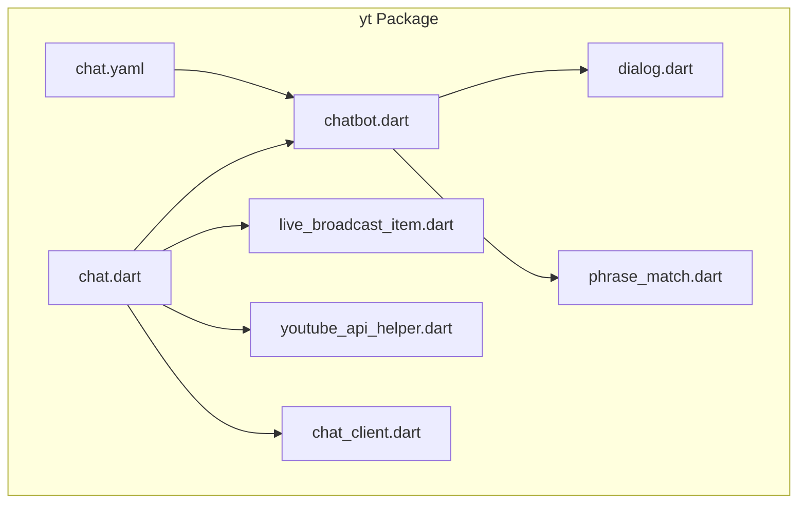
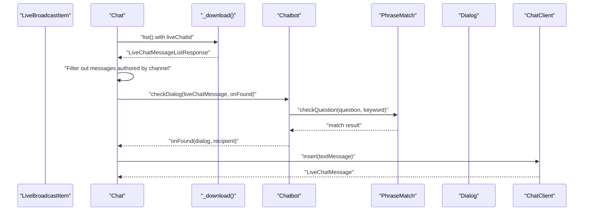
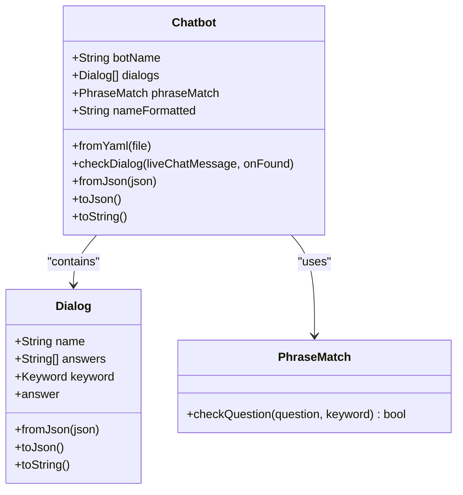
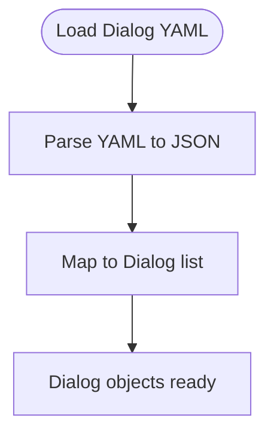
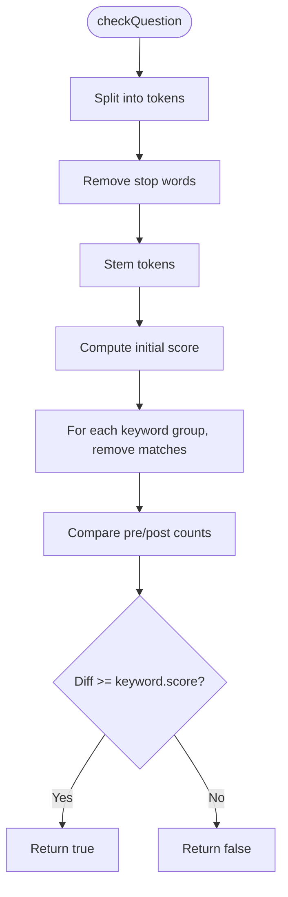
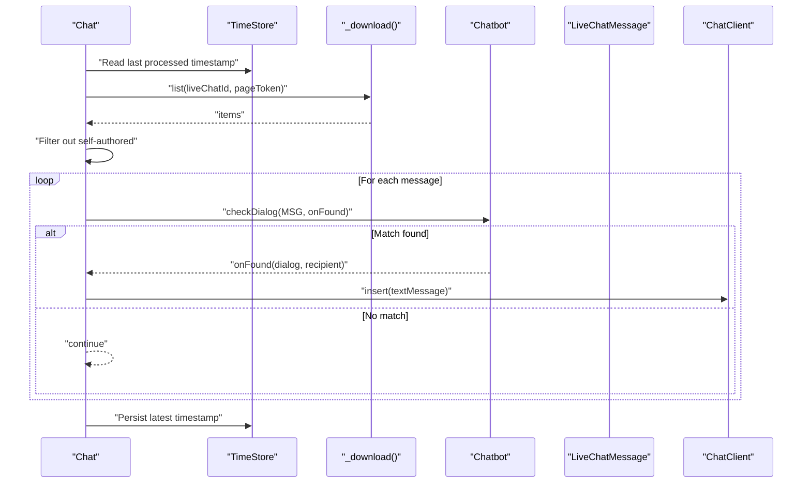
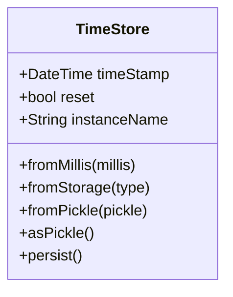
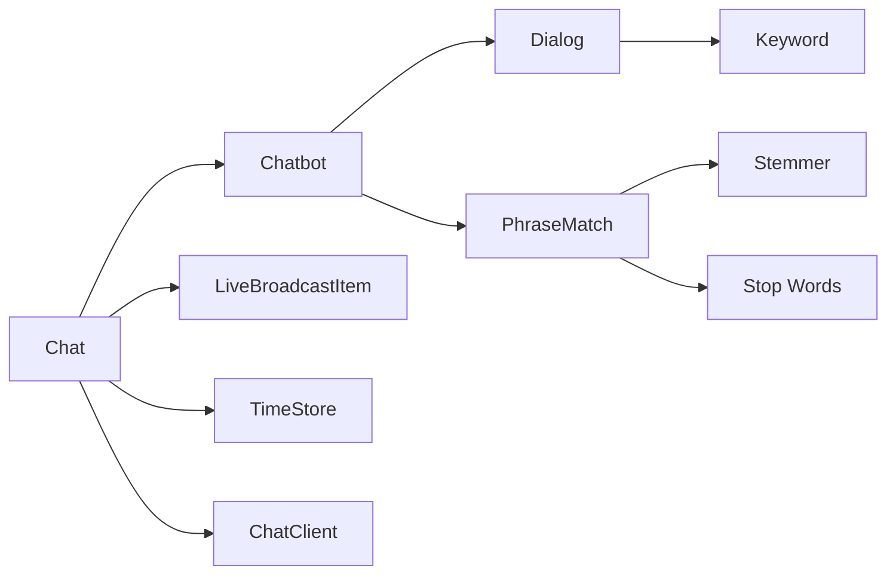

# Chat Bots

<cite>
**Referenced Files in This Document**
- [README.md](file://README.md)
- [pubspec.yaml](file://pubspec.yaml)
- [chatbot.dart](file://packages/yt/lib/src/chatbot.dart)
- [chatbot.g.dart](file://packages/yt/lib/src/chatbot.g.dart)
- [dialog.dart](file://packages/yt/lib/src/model/chat/dialog.dart)
- [dialog.g.dart](file://packages/yt/lib/src/model/chat/dialog.g.dart)
- [phrase_match.dart](file://packages/yt/lib/src/util/phrase_match.dart)
- [chat.dart](file://packages/yt/lib/src/chat.dart)
- [chat.yaml](file://packages/yt/example/chatbot.yaml)
- [live_broadcast_item.dart](file://packages/yt/lib/src/model/broadcast/live_broadcast_item.dart)
- [youtube_api_helper.dart](file://packages/yt/lib/src/youtube_api_helper.dart)
- [chat_client.dart](file://packages/yt/lib/src/provider/live/chat.dart)
</cite>

## Table of Contents
1. [Introduction](#introduction)
2. [Project Structure](#project-structure)
3. [Core Components](#core-components)
4. [Architecture Overview](#architecture-overview)
5. [Detailed Component Analysis](#detailed-component-analysis)
6. [Dependency Analysis](#dependency-analysis)
7. [Performance Considerations](#performance-considerations)
8. [Troubleshooting Guide](#troubleshooting-guide)
9. [Conclusion](#conclusion)
10. [Appendices](#appendices)

## Introduction
This document explains the chat bot integration and automation capabilities built around live YouTube chat. It focuses on the Chatbot class, dialog management, question answering, and automated response generation. It also covers the answerBot workflow for processing live chat messages, dialog configuration via YAML, response templates, and conversation flow management. Finally, it outlines integration patterns with external AI services, NLP, and ML models, along with practical examples, deployment strategies, performance optimization, and monitoring.

## Project Structure
The chat bot functionality resides primarily in the yt package under packages/yt. Key areas include:
- Chatbot orchestration and YAML loading
- Dialog definitions and response templates
- NLP-based phrase matching
- Live chat API client and answerBot workflow
- Time-based pagination for historical downloads
- Live broadcast metadata

**Diagram sources**
- [chatbot.dart:1-53](file://packages/yt/lib/src/chatbot.dart#L1-L53)
- [dialog.dart:1-40](file://packages/yt/lib/src/model/chat/dialog.dart#L1-L40)
- [phrase_match.dart:1-56](file://packages/yt/lib/src/util/phrase_match.dart#L1-L56)
- [chat.dart:1-258](file://packages/yt/lib/src/chat.dart#L1-L258)
- [chat.yaml:1-25](file://packages/yt/example/chatbot.yaml#L1-L25)
- [live_broadcast_item.dart:1-63](file://packages/yt/lib/src/model/broadcast/live_broadcast_item.dart#L1-L63)
- [youtube_api_helper.dart:1-30](file://packages/yt/lib/src/youtube_api_helper.dart#L1-L30)
- [chat_client.dart:1-45](file://packages/yt/lib/src/provider/live/chat.dart#L1-L45)

**Section sources**
- [README.md:1-119](file://README.md#L1-L119)
- [pubspec.yaml:1-69](file://pubspec.yaml#L1-L69)

## Core Components
- Chatbot: Orchestrates dialog matching against incoming live chat messages and triggers responses. Supports YAML-based configuration and JSON serialization.
- Dialog: Defines a named set of answers and keyword patterns used to match user questions.
- PhraseMatch: Implements keyword-based matching with stemming and stop-word filtering.
- Chat: Provides live chat listing, insertion, deletion, and automated answering via answerBot. Includes time-based pagination for historical downloads.
- TimeStore: Persists timestamps to support incremental downloads.
- LiveBroadcastItem: Metadata for live broadcasts, including the associated live chat identifier.

**Section sources**
- [chatbot.dart:1-53](file://packages/yt/lib/src/chatbot.dart#L1-L53)
- [dialog.dart:1-40](file://packages/yt/lib/src/model/chat/dialog.dart#L1-L40)
- [phrase_match.dart:1-56](file://packages/yt/lib/src/util/phrase_match.dart#L1-L56)
- [chat.dart:1-258](file://packages/yt/lib/src/chat.dart#L1-L258)
- [live_broadcast_item.dart:1-63](file://packages/yt/lib/src/model/broadcast/live_broadcast_item.dart#L1-L63)

## Architecture Overview
The chat bot architecture integrates live chat retrieval, NLP-based matching, and automated responses. The Chat class orchestrates downloading messages, filtering out bot/self-authored messages, invoking Chatbot to match dialogs, and sending templated replies.

**Diagram sources**
- [chat.dart:184-215](file://packages/yt/lib/src/chat.dart#L184-L215)
- [chatbot.dart:27-43](file://packages/yt/lib/src/chatbot.dart#L27-L43)
- [phrase_match.dart:33-55](file://packages/yt/lib/src/util/phrase_match.dart#L33-L55)
- [dialog.dart:24-40](file://packages/yt/lib/src/model/chat/dialog.dart#L24-L40)
- [chat_client.dart:14-43](file://packages/yt/lib/src/provider/live/chat.dart#L14-L43)

## Detailed Component Analysis

### Chatbot Class
Responsibilities:
- Load configuration from YAML and serialize to/from JSON
- Iterate configured dialogs and match incoming messages using PhraseMatch
- Invoke a callback with matched dialog and recipient when a match occurs

Key behaviors:
- Name formatting supports emoji formatting
- YAML loading converts YAML to JSON then deserializes to Chatbot
- Matching uses keyword patterns and scoring thresholds

**Diagram sources**
- [chatbot.dart:10-52](file://packages/yt/lib/src/chatbot.dart#L10-L52)
- [dialog.dart:24-40](file://packages/yt/lib/src/model/chat/dialog.dart#L24-L40)
- [phrase_match.dart:4-56](file://packages/yt/lib/src/util/phrase_match.dart#L4-L56)

**Section sources**
- [chatbot.dart:1-53](file://packages/yt/lib/src/chatbot.dart#L1-L53)
- [chatbot.g.dart:9-19](file://packages/yt/lib/src/chatbot.g.dart#L9-L19)

### Dialog and Keyword Configuration
- Dialog defines a name, multiple answers, and a Keyword pattern set
- Answers are randomized per selection to vary responses
- DialogLoader supports loading multiple dialogs from a single YAML file
- Keyword patterns are used by PhraseMatch to compute a match score

**Diagram sources**
- [dialog.dart:12-22](file://packages/yt/lib/src/model/chat/dialog.dart#L12-L22)

**Section sources**
- [dialog.dart:1-40](file://packages/yt/lib/src/model/chat/dialog.dart#L1-L40)
- [dialog.g.dart:9-19](file://packages/yt/lib/src/model/chat/dialog.g.dart#L9-L19)

### PhraseMatch Algorithm
- Uses stemming and stop-word removal to normalize tokens
- Compares normalized question tokens against grouped keyword lists
- Computes a score based on how many keywords are removed from the question
- Returns true if the score meets or exceeds the configured threshold

**Diagram sources**
- [phrase_match.dart:33-55](file://packages/yt/lib/src/util/phrase_match.dart#L33-L55)

**Section sources**
- [phrase_match.dart:1-56](file://packages/yt/lib/src/util/phrase_match.dart#L1-L56)

### Chat AnswerBot Workflow
- Downloads live chat messages incrementally using time-based pagination
- Filters out messages authored by the channel owner
- Invokes Chatbot.checkDialog for each eligible message
- Sends a formatted reply using the matched dialog’s answer template

**Diagram sources**
- [chat.dart:184-215](file://packages/yt/lib/src/chat.dart#L184-L215)
- [chat.dart:137-182](file://packages/yt/lib/src/chat.dart#L137-L182)
- [chat_client.dart:14-43](file://packages/yt/lib/src/provider/live/chat.dart#L14-L43)

**Section sources**
- [chat.dart:184-215](file://packages/yt/lib/src/chat.dart#L184-L215)
- [chat.dart:137-182](file://packages/yt/lib/src/chat.dart#L137-L182)

### TimeStore Persistence
- Stores the last processed message timestamp
- Supports loading from persisted storage and saving updates
- Used to avoid reprocessing old messages and to resume from the correct position

**Diagram sources**
- [chat.dart:218-257](file://packages/yt/lib/src/chat.dart#L218-L257)

**Section sources**
- [chat.dart:218-257](file://packages/yt/lib/src/chat.dart#L218-L257)

### Live Broadcast Metadata
- LiveBroadcastItem encapsulates broadcast details including the live chat identifier
- Used to derive the liveChatId for message listing and insertion

**Section sources**
- [live_broadcast_item.dart:1-63](file://packages/yt/lib/src/model/broadcast/live_broadcast_item.dart#L1-L63)

### API Client Integration
- ChatClient exposes Retrofit-generated methods for listing and inserting live chat messages
- YouTubeApiHelper centralizes common headers and part parameter construction

**Section sources**
- [chat_client.dart:1-45](file://packages/yt/lib/src/provider/live/chat.dart#L1-L45)
- [youtube_api_helper.dart:1-30](file://packages/yt/lib/src/youtube_api_helper.dart#L1-L30)

## Dependency Analysis
- Chatbot depends on Dialog and PhraseMatch for matching logic
- Chat depends on Chatbot, LiveBroadcastItem, TimeStore, and ChatClient
- DialogLoader depends on YAML parsing and JSON conversion
- PhraseMatch depends on a stemmer and stop-word list
- Chat relies on Retrofit-generated ChatClient and YouTubeApiHelper for HTTP operations

**Diagram sources**
- [chatbot.dart:1-53](file://packages/yt/lib/src/chatbot.dart#L1-L53)
- [dialog.dart:1-40](file://packages/yt/lib/src/model/chat/dialog.dart#L1-L40)
- [phrase_match.dart:1-56](file://packages/yt/lib/src/util/phrase_match.dart#L1-L56)
- [chat.dart:1-258](file://packages/yt/lib/src/chat.dart#L1-L258)
- [chat_client.dart:1-45](file://packages/yt/lib/src/provider/live/chat.dart#L1-L45)

**Section sources**
- [chatbot.dart:1-53](file://packages/yt/lib/src/chatbot.dart#L1-L53)
- [dialog.dart:1-40](file://packages/yt/lib/src/model/chat/dialog.dart#L1-L40)
- [phrase_match.dart:1-56](file://packages/yt/lib/src/util/phrase_match.dart#L1-L56)
- [chat.dart:1-258](file://packages/yt/lib/src/chat.dart#L1-L258)

## Performance Considerations
- Incremental processing: Use TimeStore to avoid reprocessing messages and reduce API load.
- Batch downloads: The downloader paginates through results; tune maxResults and polling intervals to balance latency and throughput.
- Matching efficiency: PhraseMatch normalizes tokens and removes stop words; keep keyword patterns concise and grouped to improve matching speed.
- Response rate limiting: Respect YouTube API quotas and consider backoff strategies when inserting messages rapidly.
- Serialization overhead: YAML-to-JSON conversion happens during Chatbot.fromYaml; cache parsed configurations when running long-lived bots.
- Memory usage: Avoid retaining large histories; process and discard messages promptly.

[No sources needed since this section provides general guidance]

## Troubleshooting Guide
Common issues and resolutions:
- Empty message text: The insert method validates non-empty message text and throws an exception if invalid. Ensure message bodies are properly formed before sending.
- Authentication failures: Verify Accept and Content-Type headers are set correctly via YouTubeApiHelper and that credentials are configured for ChatClient.
- No matches found: Adjust keyword patterns and scores in Dialog YAML to increase sensitivity or refine wording to align with user phrasing.
- Duplicate responses: Confirm TimeStore persistence and that messages authored by the channel owner are filtered out before processing.
- Rate limits: Implement exponential backoff and reduce polling frequency if receiving throttling errors from the YouTube API.

**Section sources**
- [chat.dart:38-56](file://packages/yt/lib/src/chat.dart#L38-L56)
- [youtube_api_helper.dart:14-28](file://packages/yt/lib/src/youtube_api_helper.dart#L14-L28)
- [chat_client.dart:14-43](file://packages/yt/lib/src/provider/live/chat.dart#L14-L43)

## Conclusion
The chat bot system provides a robust foundation for automating YouTube live chat interactions. By combining YAML-driven dialog definitions, NLP-based matching, and a streamlined answerBot workflow, it enables efficient community engagement. Extending the system with external AI services, advanced ML models, and improved monitoring will further enhance accuracy and scalability.

[No sources needed since this section summarizes without analyzing specific files]

## Appendices

### Practical Examples

- Building a custom chat bot
  - Define dialogs and keyword patterns in YAML
  - Load configuration into Chatbot
  - Integrate with answerBot to process live chat messages
  - Example configuration path: [chat.yaml:1-25](file://packages/yt/example/chatbot.yaml#L1-L25)

- Implementing an FAQ system
  - Map frequently asked questions to Dialog entries with multiple answers
  - Use grouped keyword patterns to capture variations in phrasing
  - Randomize answers to avoid repetition

- Automating community engagement
  - Filter out self-authored messages
  - Send contextual replies with user mentions
  - Persist timestamps to maintain continuity across runs

**Section sources**
- [chatbot.dart:21-25](file://packages/yt/lib/src/chatbot.dart#L21-L25)
- [chat.yaml:1-25](file://packages/yt/example/chatbot.yaml#L1-L25)
- [chat.dart:184-215](file://packages/yt/lib/src/chat.dart#L184-L215)

### Deployment Strategies
- Containerization: Package the bot as a service with scheduled polling or continuous streaming.
- Environment isolation: Separate development, staging, and production configurations.
- Secrets management: Store API keys and tokens securely; avoid embedding in YAML files.
- Health checks: Expose metrics and liveness probes to monitor uptime and message processing rates.

[No sources needed since this section provides general guidance]

### Monitoring Capabilities
- Log message ingestion and response rates
- Track matching accuracy and keyword effectiveness
- Monitor API quota usage and error rates
- Persist TimeStore to resume after restarts

[No sources needed since this section provides general guidance]