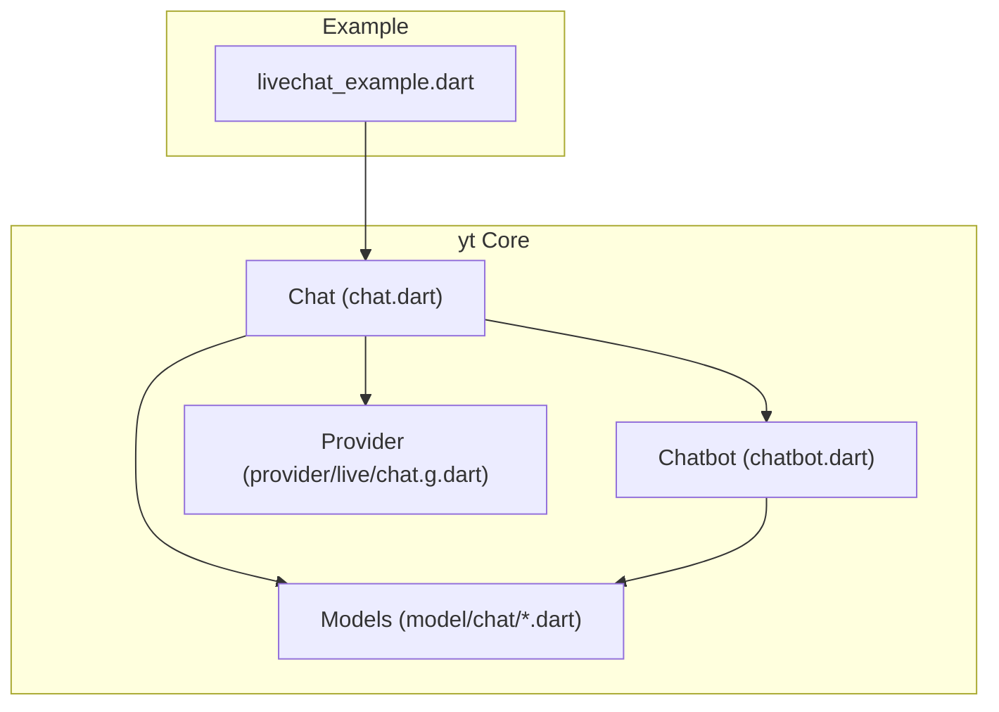
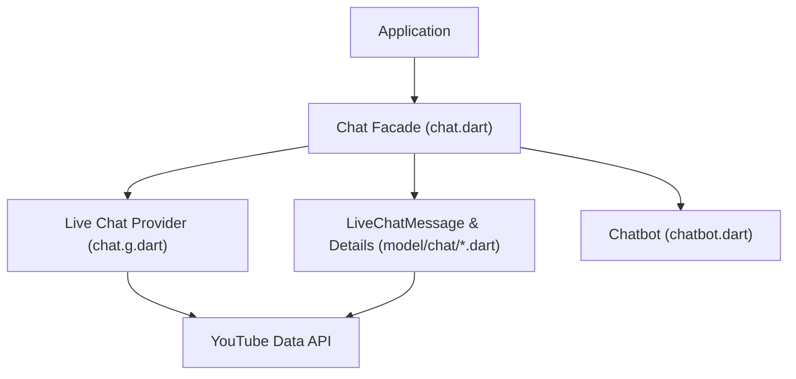
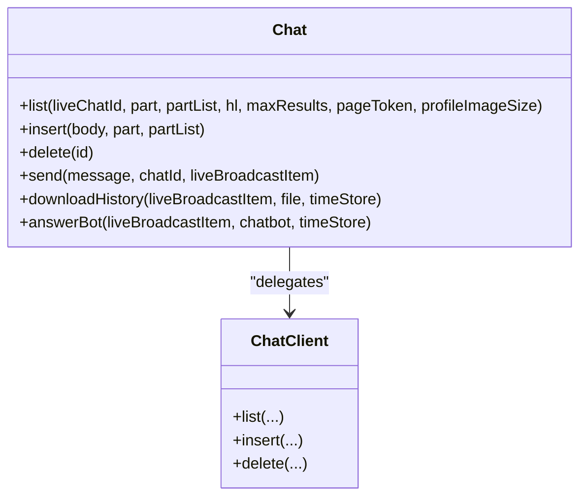
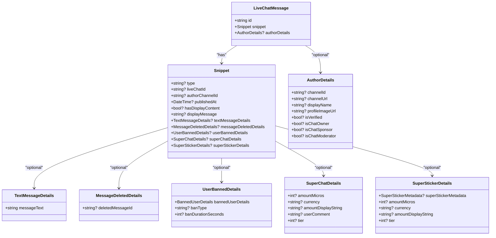
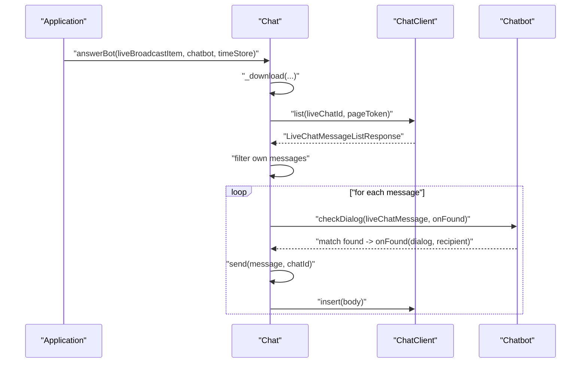
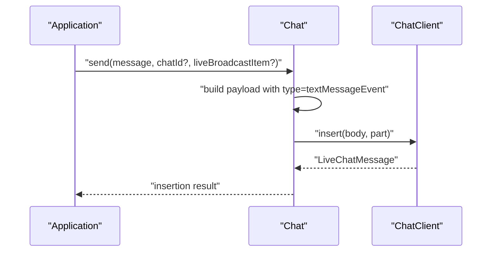
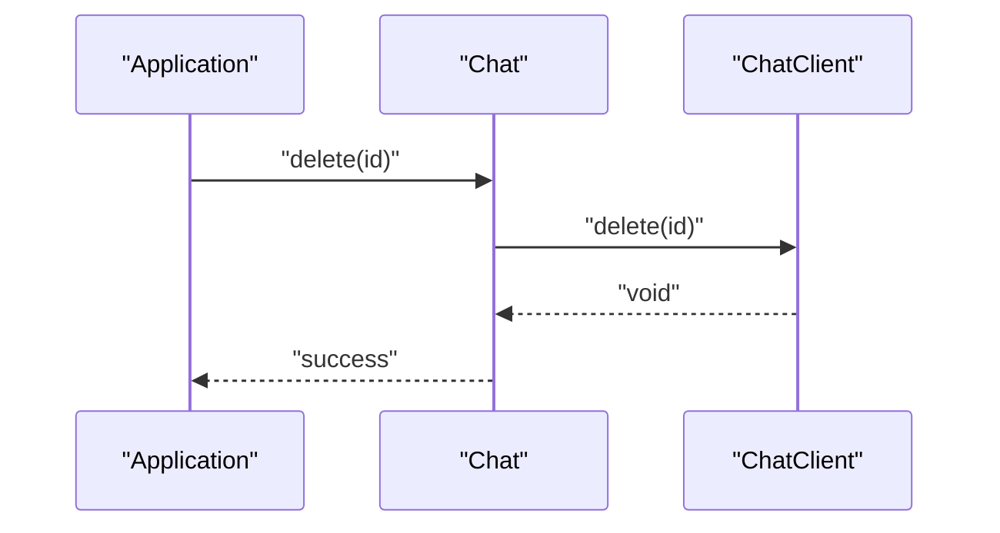
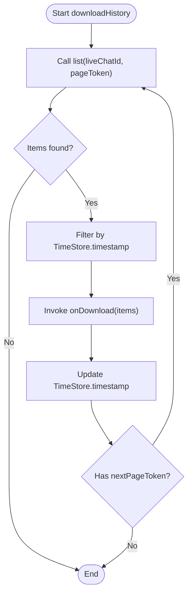
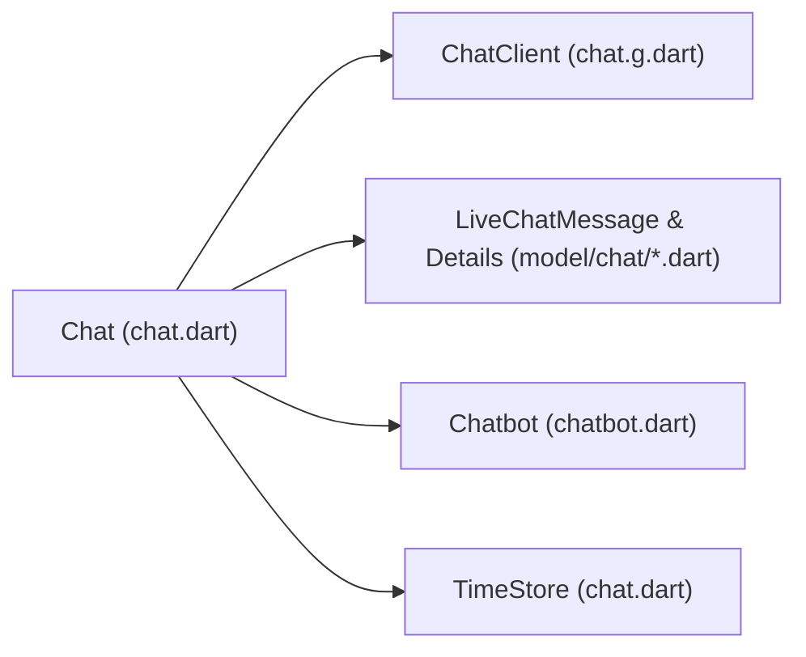

# Chat Management

<cite>
**Referenced Files in This Document**
- [README.md](file://README.md)
- [pubspec.yaml](file://pubspec.yaml)
- [chat.dart](file://packages/yt/lib/src/chat.dart)
- [livechat_example.dart](file://packages/yt/example/livechat_example.dart)
- [chatbot.dart](file://packages/yt/lib/src/chatbot.dart)
- [live_chat_message.dart](file://packages/yt/lib/src/model/chat/live_chat_message.dart)
- [snippet.dart](file://packages/yt/lib/src/model/chat/snippet.dart)
- [author_details.dart](file://packages/yt/lib/src/model/chat/author_details.dart)
- [text_message_details.dart](file://packages/yt/lib/src/model/chat/text_message_details.dart)
- [message_deleted_details.dart](file://packages/yt/lib/src/model/chat/message_deleted_details.dart)
- [user_banned_details.dart](file://packages/yt/lib/src/model/chat/user_banned_details.dart)
- [super_chat_details.dart](file://packages/yt/lib/src/model/chat/super_chat_details.dart)
- [super_sticker_details.dart](file://packages/yt/lib/src/model/chat/super_sticker_details.dart)
- [chat.g.dart](file://packages/yt/lib/src/provider/live/chat.g.dart)
- [live_chat_message_list_response.dart](file://packages/yt/lib/src/model/chat/live_chat_message_list_response.dart)
</cite>

## Table of Contents
1. [Introduction](#introduction)
2. [Project Structure](#project-structure)
3. [Core Components](#core-components)
4. [Architecture Overview](#architecture-overview)
5. [Detailed Component Analysis](#detailed-component-analysis)
6. [Dependency Analysis](#dependency-analysis)
7. [Performance Considerations](#performance-considerations)
8. [Troubleshooting Guide](#troubleshooting-guide)
9. [Conclusion](#conclusion)
10. [Appendices](#appendices)

## Introduction
This document explains how to manage YouTube Live Chat using the yt Dart library. It covers real-time chat functionality, message sending, moderation, and user interaction patterns. It documents the LiveChatMessage model and chat moderation features such as message removal, user timeouts, and ban management. It also explains polling-based retrieval of chat history, event handling, and chat bot integration capabilities. Practical examples demonstrate monitoring chat activity, automated moderation, chat bot creation, and managing chat settings. Guidance is included for chat analytics, message filtering, user permission management, and integrating with live streaming workflows. Finally, it outlines moderation best practices and community management strategies.

## Project Structure
The yt workspace provides a Dart library for YouTube Data and Live Streaming APIs, including Live Chat support. The relevant parts for chat management are organized under the core package and example:

- Core library: packages/yt/lib/src
- Examples: packages/yt/example
- Models for chat resources: packages/yt/lib/src/model/chat
- Provider for Live Chat REST operations: packages/yt/lib/src/provider/live

Key files for chat management:
- Chat API facade: packages/yt/lib/src/chat.dart
- Chat bot model and logic: packages/yt/lib/src/chatbot.dart
- Live Chat message model and related types: packages/yt/lib/src/model/chat/*.dart
- Live Chat REST provider: packages/yt/lib/src/provider/live/chat.g.dart
- Example usage: packages/yt/example/livechat_example.dart

**Diagram sources**
- [chat.dart:12-216](file://packages/yt/lib/src/chat.dart#L12-L216)
- [chatbot.dart:10-52](file://packages/yt/lib/src/chatbot.dart#L10-L52)
- [live_chat_message.dart:14-40](file://packages/yt/lib/src/model/chat/live_chat_message.dart#L14-L40)
- [chat.g.dart:68-158](file://packages/yt/lib/src/provider/live/chat.g.dart#L68-L158)
- [livechat_example.dart:1-29](file://packages/yt/example/livechat_example.dart#L1-L29)

**Section sources**
- [README.md:55-71](file://README.md#L55-L71)
- [pubspec.yaml:1-69](file://pubspec.yaml#L1-L69)

## Core Components
This section describes the primary building blocks for chat management.

- Chat facade
  - Provides methods to list, insert, delete, and send live chat messages.
  - Implements a polling loop to download chat history and supports a time-based checkpoint to avoid reprocessing.
  - Integrates with a chat bot to automatically answer questions.

- LiveChatMessage model
  - Represents a single chat message with snippet and author details.
  - Supports multiple message types (text, deleted, banned, Super Chat/Sticker, etc.).

- Chatbot
  - Loads dialog definitions from YAML, matches incoming messages, and triggers automated replies.

- Provider
  - Generates REST client code for Live Chat endpoints (insert/delete).

- TimeStore
  - Stores timestamps to resume chat processing after interruptions.

**Section sources**
- [chat.dart:12-216](file://packages/yt/lib/src/chat.dart#L12-L216)
- [live_chat_message.dart:14-40](file://packages/yt/lib/src/model/chat/live_chat_message.dart#L14-L40)
- [chatbot.dart:10-52](file://packages/yt/lib/src/chatbot.dart#L10-L52)
- [chat.g.dart:68-158](file://packages/yt/lib/src/provider/live/chat.g.dart#L68-L158)

## Architecture Overview
The chat management architecture combines a high-level Chat facade with strongly typed models and a generated provider for REST operations. The Chat facade orchestrates polling, filtering, and bot-driven responses. Moderation actions (delete, ban) are executed via the provider.

**Diagram sources**
- [chat.dart:12-216](file://packages/yt/lib/src/chat.dart#L12-L216)
- [chat.g.dart:68-158](file://packages/yt/lib/src/provider/live/chat.g.dart#L68-L158)
- [live_chat_message.dart:14-40](file://packages/yt/lib/src/model/chat/live_chat_message.dart#L14-L40)
- [chatbot.dart:10-52](file://packages/yt/lib/src/chatbot.dart#L10-L52)

## Detailed Component Analysis

### Chat Facade
The Chat facade encapsulates Live Chat operations:
- Listing messages with pagination and optional language/profile image size parameters.
- Inserting a message payload (validated for non-empty text).
- Deleting a message by ID.
- Sending a text message to the current live chat.
- Downloading chat history with optional file output and time-based filtering.
- Running a chat bot against recent messages.

**Diagram sources**
- [chat.dart:12-216](file://packages/yt/lib/src/chat.dart#L12-L216)
- [chat.g.dart:68-158](file://packages/yt/lib/src/provider/live/chat.g.dart#L68-L158)

**Section sources**
- [chat.dart:17-90](file://packages/yt/lib/src/chat.dart#L17-L90)
- [chat.g.dart:68-128](file://packages/yt/lib/src/provider/live/chat.g.dart#L68-L128)

### LiveChatMessage Model and Related Types
The LiveChatMessage model represents a single chat message and supports multiple message types. The snippet contains metadata and type-specific details. AuthorDetails provides user identity and roles. Additional details models represent deleted messages, bans, and Super Chat/Sticker events.

**Diagram sources**
- [live_chat_message.dart:14-40](file://packages/yt/lib/src/model/chat/live_chat_message.dart#L14-L40)
- [snippet.dart:14-86](file://packages/yt/lib/src/model/chat/snippet.dart#L14-L86)
- [author_details.dart:9-52](file://packages/yt/lib/src/model/chat/author_details.dart#L9-L52)
- [text_message_details.dart:9-22](file://packages/yt/lib/src/model/chat/text_message_details.dart#L9-L22)
- [message_deleted_details.dart:9-24](file://packages/yt/lib/src/model/chat/message_deleted_details.dart#L9-L24)
- [user_banned_details.dart:10-36](file://packages/yt/lib/src/model/chat/user_banned_details.dart#L10-L36)
- [super_chat_details.dart:9-44](file://packages/yt/lib/src/model/chat/super_chat_details.dart#L9-L44)
- [super_sticker_details.dart:10-46](file://packages/yt/lib/src/model/chat/super_sticker_details.dart#L10-L46)

**Section sources**
- [live_chat_message.dart:11-40](file://packages/yt/lib/src/model/chat/live_chat_message.dart#L11-L40)
- [snippet.dart:15-86](file://packages/yt/lib/src/model/chat/snippet.dart#L15-L86)
- [author_details.dart:7-52](file://packages/yt/lib/src/model/chat/author_details.dart#L7-L52)
- [text_message_details.dart:7-22](file://packages/yt/lib/src/model/chat/text_message_details.dart#L7-L22)
- [message_deleted_details.dart:7-24](file://packages/yt/lib/src/model/chat/message_deleted_details.dart#L7-L24)
- [user_banned_details.dart:9-36](file://packages/yt/lib/src/model/chat/user_banned_details.dart#L9-L36)
- [super_chat_details.dart:7-44](file://packages/yt/lib/src/model/chat/super_chat_details.dart#L7-L44)
- [super_sticker_details.dart:9-46](file://packages/yt/lib/src/model/chat/super_sticker_details.dart#L9-L46)

### Chat Bot Integration
The Chatbot loads dialog definitions from YAML and matches incoming messages. The Chat facade integrates the bot with live chat polling to automatically reply to qualifying messages.

**Diagram sources**
- [chat.dart:184-215](file://packages/yt/lib/src/chat.dart#L184-L215)
- [chatbot.dart:27-43](file://packages/yt/lib/src/chatbot.dart#L27-L43)
- [chat.g.dart:68-107](file://packages/yt/lib/src/provider/live/chat.g.dart#L68-L107)

**Section sources**
- [chatbot.dart:10-52](file://packages/yt/lib/src/chatbot.dart#L10-L52)
- [chat.dart:184-215](file://packages/yt/lib/src/chat.dart#L184-L215)
- [livechat_example.dart:21-26](file://packages/yt/example/livechat_example.dart#L21-L26)

### Message Sending Flow
Sending a message involves constructing a payload with the appropriate type and inserting it via the provider.

**Diagram sources**
- [chat.dart:67-90](file://packages/yt/lib/src/chat.dart#L67-L90)
- [chat.g.dart:68-107](file://packages/yt/lib/src/provider/live/chat.g.dart#L68-L107)

**Section sources**
- [chat.dart:67-90](file://packages/yt/lib/src/chat.dart#L67-L90)
- [chat.g.dart:68-107](file://packages/yt/lib/src/provider/live/chat.g.dart#L68-L107)

### Message Deletion Flow
Deleting a message requires the caller to be authorized as a channel owner or moderator. The Chat facade delegates to the provider.

**Diagram sources**
- [chat.dart:58-65](file://packages/yt/lib/src/chat.dart#L58-L65)
- [chat.g.dart:110-128](file://packages/yt/lib/src/provider/live/chat.g.dart#L110-L128)

**Section sources**
- [chat.dart:58-65](file://packages/yt/lib/src/chat.dart#L58-L65)
- [chat.g.dart:110-128](file://packages/yt/lib/src/provider/live/chat.g.dart#L110-L128)

### Chat History Download and Filtering
The Chat facade polls messages, optionally filters by time, and invokes a callback for downstream processing (printing or writing to CSV). A TimeStore persists the last processed timestamp.

**Diagram sources**
- [chat.dart:92-182](file://packages/yt/lib/src/chat.dart#L92-L182)
- [chat.dart:218-257](file://packages/yt/lib/src/chat.dart#L218-L257)

**Section sources**
- [chat.dart:92-182](file://packages/yt/lib/src/chat.dart#L92-L182)
- [chat.dart:218-257](file://packages/yt/lib/src/chat.dart#L218-L257)

## Dependency Analysis
The Chat facade depends on:
- The generated ChatClient provider for REST operations.
- LiveChatMessage and related models for data representation.
- The Chatbot for automated responses.
- TimeStore for persistence across runs.

**Diagram sources**
- [chat.dart:12-216](file://packages/yt/lib/src/chat.dart#L12-L216)
- [chat.g.dart:68-158](file://packages/yt/lib/src/provider/live/chat.g.dart#L68-L158)
- [live_chat_message.dart:14-40](file://packages/yt/lib/src/model/chat/live_chat_message.dart#L14-L40)
- [chatbot.dart:10-52](file://packages/yt/lib/src/chatbot.dart#L10-L52)

**Section sources**
- [chat.dart:12-216](file://packages/yt/lib/src/chat.dart#L12-L216)
- [chat.g.dart:68-158](file://packages/yt/lib/src/provider/live/chat.g.dart#L68-L158)

## Performance Considerations
- Polling interval: The list response includes a polling interval hint that can guide throttling chat polling frequency.
- Pagination: Use nextPageToken to iterate through all messages efficiently.
- Filtering: Apply time-based filtering early to reduce processing overhead.
- Batch processing: Process messages in batches and persist checkpoints to avoid reprocessing large volumes.
- Network efficiency: Reuse a single authenticated client and minimize redundant requests.

[No sources needed since this section provides general guidance]

## Troubleshooting Guide
Common issues and remedies:
- Empty message text: Insertions with empty text are rejected; ensure the message is non-empty before sending.
- Authorization errors: Deleting messages requires the caller to be the channel owner or a moderator; verify credentials and permissions.
- No active broadcast: If no active or upcoming broadcast exists, the example exits early; ensure a broadcast is active before running chat operations.
- Rate limits: Respect the polling interval and implement backoff to handle API rate limits gracefully.
- Persistence: TimeStore persists timestamps to disk; ensure write permissions and handle exceptions during persistence.

**Section sources**
- [chat.dart:45-47](file://packages/yt/lib/src/chat.dart#L45-L47)
- [chat.dart:58-65](file://packages/yt/lib/src/chat.dart#L58-L65)
- [livechat_example.dart:13-16](file://packages/yt/example/livechat_example.dart#L13-L16)
- [live_chat_message_list_response.dart:15-18](file://packages/yt/lib/src/model/chat/live_chat_message_list_response.dart#L15-L18)

## Conclusion
The yt library provides a cohesive set of primitives for YouTube Live Chat management. The Chat facade offers high-level operations for listing, sending, deleting, and downloading chat messages, along with integrated bot support. The strongly typed models enable robust handling of various message types, including deletions, bans, and Super Chat/Sticker events. By combining polling, filtering, and automation, developers can monitor chat activity, enforce community standards, and enhance viewer engagement.

[No sources needed since this section summarizes without analyzing specific files]

## Appendices

### Practical Examples and Workflows
- Monitoring chat activity
  - Use downloadHistory with a TimeStore to continuously fetch new messages and persist progress.
  - Reference: [chat.dart:92-182](file://packages/yt/lib/src/chat.dart#L92-L182), [chat.dart:218-257](file://packages/yt/lib/src/chat.dart#L218-L257)

- Automated moderation
  - Filter tombstones and deleted events to maintain accurate analytics.
  - Use messageDeletedDetails and userBannedDetails to track moderation actions.
  - Reference: [snippet.dart:18-27](file://packages/yt/lib/src/model/chat/snippet.dart#L18-L27), [message_deleted_details.dart:9-24](file://packages/yt/lib/src/model/chat/message_deleted_details.dart#L9-L24), [user_banned_details.dart:10-36](file://packages/yt/lib/src/model/chat/user_banned_details.dart#L10-L36)

- Creating chat bots
  - Load dialogs from YAML and match incoming messages; reply using send with a formatted message.
  - Reference: [chatbot.dart:21-25](file://packages/yt/lib/src/chatbot.dart#L21-L25), [chatbot.dart:27-43](file://packages/yt/lib/src/chatbot.dart#L27-L43), [chat.dart:184-215](file://packages/yt/lib/src/chat.dart#L184-L215), [livechat_example.dart:21-26](file://packages/yt/example/livechat_example.dart#L21-L26)

- Managing chat settings
  - Use snippet fields to detect mode changes (e.g., sponsors-only) and adjust bot behavior accordingly.
  - Reference: [snippet.dart:18-22](file://packages/yt/lib/src/model/chat/snippet.dart#L18-L22)

- Chat analytics
  - Aggregate by message type (text, Super Chat/Sticker) and filter by time window using TimeStore.
  - Reference: [live_chat_message_list_response.dart:15-18](file://packages/yt/lib/src/model/chat/live_chat_message_list_response.dart#L15-L18), [chat.dart:160-168](file://packages/yt/lib/src/chat.dart#L160-L168)

- Message filtering
  - Exclude own channel messages and apply keyword matching via Chatbot.
  - Reference: [chat.dart:197-202](file://packages/yt/lib/src/chat.dart#L197-L202), [chatbot.dart:32-35](file://packages/yt/lib/src/chatbot.dart#L32-L35)

- User permission management
  - Use AuthorDetails to identify owners, moderators, sponsors, and verified users.
  - Reference: [author_details.dart:25-32](file://packages/yt/lib/src/model/chat/author_details.dart#L25-L32)

- Integration with live streaming workflows
  - Derive liveChatId from a broadcast item and operate on the active chat session.
  - Reference: [chat.dart:73-79](file://packages/yt/lib/src/chat.dart#L73-L79), [livechat_example.dart:18-26](file://packages/yt/example/livechat_example.dart#L18-L26)

### Moderation Best Practices and Community Management Strategies
- Clear policies: Publish chat rules and moderation guidelines visible to viewers.
- Consistent enforcement: Apply rules uniformly across all users, including sponsors and moderators.
- Escalation: Use bans sparingly and log reasons for transparency.
- Positive reinforcement: Acknowledge good behavior and helpful users.
- Automation: Use bots to handle repetitive tasks, but review flagged content manually.
- Analytics: Track trends (e.g., spikes in keywords) to anticipate moderation needs.

[No sources needed since this section provides general guidance]