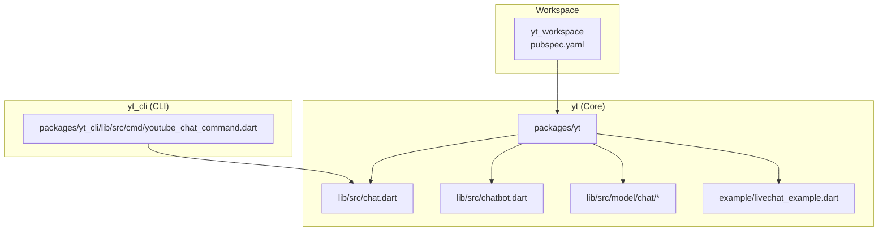
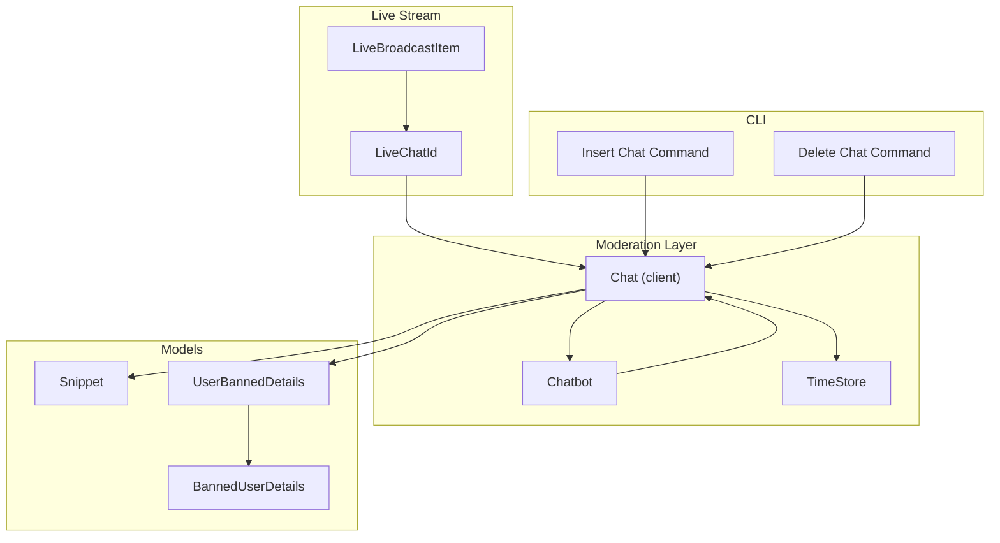
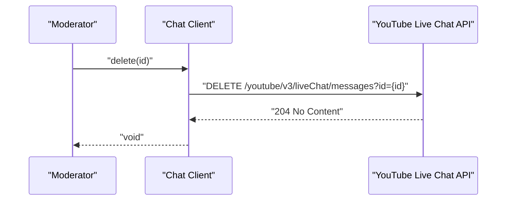
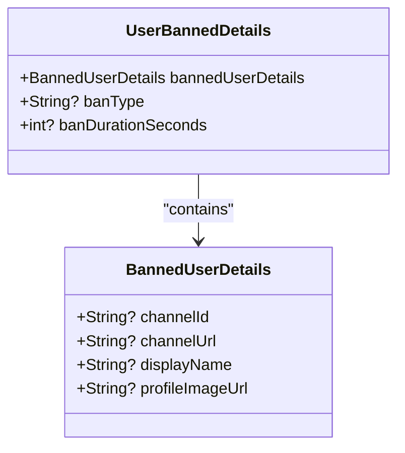
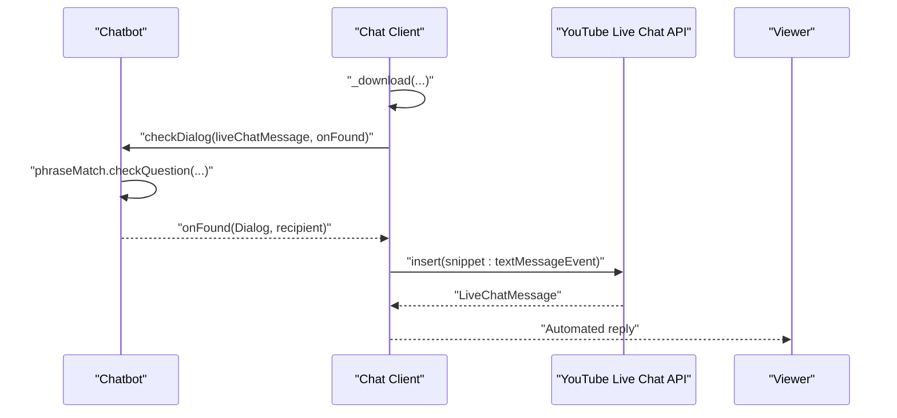
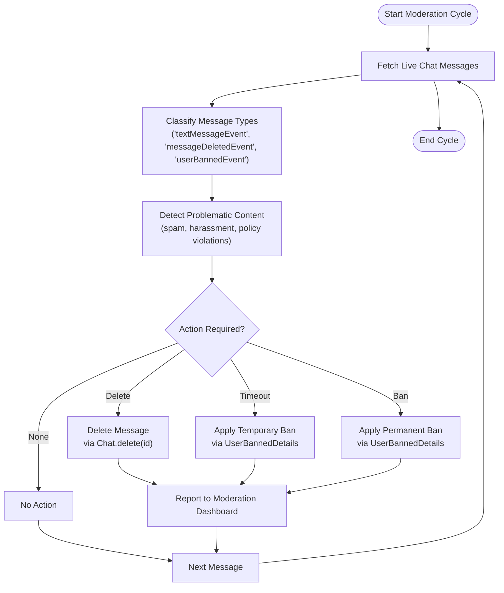
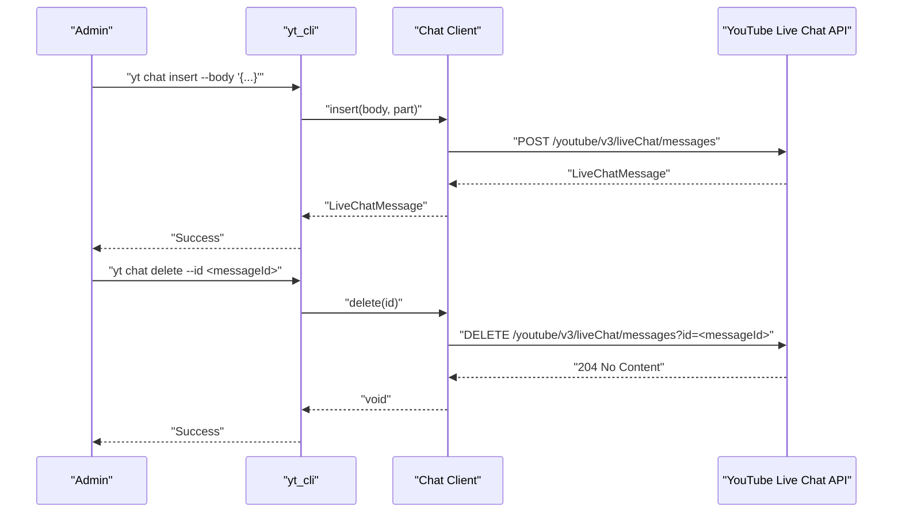
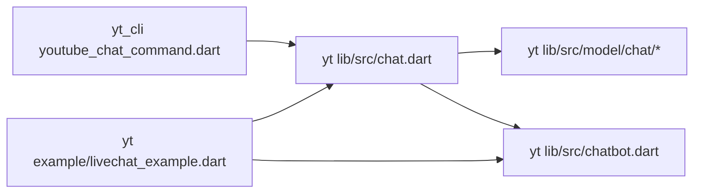

# Chat Moderation

<cite>
**Referenced Files in This Document**
- [README.md](file://README.md)
- [pubspec.yaml](file://pubspec.yaml)
- [chat.dart](file://packages/yt/lib/src/chat.dart)
- [chatbot.dart](file://packages/yt/lib/src/chatbot.dart)
- [livechat_example.dart](file://packages/yt/example/livechat_example.dart)
- [snippet.dart](file://packages/yt/lib/src/model/chat/snippet.dart)
- [user_banned_details.dart](file://packages/yt/lib/src/model/chat/user_banned_details.dart)
- [banned_user_details.dart](file://packages/yt/lib/src/model/chat/banned_user_details.dart)
- [youtube_chat_command.dart](file://packages/yt_cli/lib/src/cmd/youtube_chat_command.dart)
</cite>

## Table of Contents
1. [Introduction](#introduction)
2. [Project Structure](#project-structure)
3. [Core Components](#core-components)
4. [Architecture Overview](#architecture-overview)
5. [Detailed Component Analysis](#detailed-component-analysis)
6. [Dependency Analysis](#dependency-analysis)
7. [Performance Considerations](#performance-considerations)
8. [Troubleshooting Guide](#troubleshooting-guide)
9. [Conclusion](#conclusion)
10. [Appendices](#appendices)

## Introduction
This document provides comprehensive documentation for chat moderation tools and capabilities within the project. It focuses on:
- Message deletion operations
- User timeout and ban management
- Automated moderation via a Chatbot integrated with live chat
- Moderation workflows for identifying problematic content, applying penalties, and maintaining community standards
- Best practices, community management strategies, and enforcement policies
- Examples for implementing custom moderation rules, spam detection, and managing user interactions during live streams

The repository exposes a robust set of APIs for interacting with YouTube Live Chat, including message listing, insertion, deletion, and automated responses through a configurable Chatbot.

## Project Structure
The project is a multi-package workspace centered around YouTube API integrations. For chat moderation, the relevant packages and modules are:
- Core library: Provides the primary API clients and models for YouTube Data and Live Streaming APIs
- CLI tool: Offers command-line operations for chat message insertion and deletion
- Example application: Demonstrates automated moderation using a Chatbot

**Diagram sources**
- [pubspec.yaml:1-69](file://pubspec.yaml#L1-L69)
- [chat.dart:1-258](file://packages/yt/lib/src/chat.dart#L1-L258)
- [chatbot.dart:1-53](file://packages/yt/lib/src/chatbot.dart#L1-L53)
- [livechat_example.dart:1-29](file://packages/yt/example/livechat_example.dart#L1-L29)
- [youtube_chat_command.dart:108-154](file://packages/yt_cli/lib/src/cmd/youtube_chat_command.dart#L108-L154)

**Section sources**
- [README.md:1-119](file://README.md#L1-L119)
- [pubspec.yaml:1-69](file://pubspec.yaml#L1-L69)

## Core Components
This section outlines the core components involved in chat moderation and automation.

- Chat client
  - Provides methods to list, insert, delete, and send messages in a live chat
  - Supports downloading chat history and answering questions via a Chatbot
  - References: [chat.dart:12-216](file://packages/yt/lib/src/chat.dart#L12-L216)

- Chatbot
  - Loads dialog configurations from YAML and matches incoming chat messages against keywords/phrases
  - Triggers automated responses to user questions
  - References: [chatbot.dart:10-52](file://packages/yt/lib/src/chatbot.dart#L10-L52)

- Live chat message models
  - Snippet: Defines message types and metadata (e.g., text messages, deletions, bans)
  - UserBannedDetails: Encodes ban type and duration for user bans
  - BannedUserDetails: Encodes information about the banned user
  - References:
    - [snippet.dart:13-86](file://packages/yt/lib/src/model/chat/snippet.dart#L13-L86)
    - [user_banned_details.dart:9-36](file://packages/yt/lib/src/model/chat/user_banned_details.dart#L9-L36)
    - [banned_user_details.dart:7-35](file://packages/yt/lib/src/model/chat/banned_user_details.dart#L7-L35)

- CLI commands for chat operations
  - Insert chat message
  - Delete chat message
  - References: [youtube_chat_command.dart:108-154](file://packages/yt_cli/lib/src/cmd/youtube_chat_command.dart#L108-L154)

**Section sources**
- [chat.dart:12-216](file://packages/yt/lib/src/chat.dart#L12-L216)
- [chatbot.dart:10-52](file://packages/yt/lib/src/chatbot.dart#L10-L52)
- [snippet.dart:13-86](file://packages/yt/lib/src/model/chat/snippet.dart#L13-L86)
- [user_banned_details.dart:9-36](file://packages/yt/lib/src/model/chat/user_banned_details.dart#L9-L36)
- [banned_user_details.dart:7-35](file://packages/yt/lib/src/model/chat/banned_user_details.dart#L7-L35)
- [youtube_chat_command.dart:108-154](file://packages/yt_cli/lib/src/cmd/youtube_chat_command.dart#L108-L154)

## Architecture Overview
The moderation architecture integrates live chat ingestion, automated response, and moderation actions (deletion, bans). The following diagram maps the actual components and their interactions.

**Diagram sources**
- [chat.dart:12-216](file://packages/yt/lib/src/chat.dart#L12-L216)
- [chatbot.dart:10-52](file://packages/yt/lib/src/chatbot.dart#L10-L52)
- [snippet.dart:13-86](file://packages/yt/lib/src/model/chat/snippet.dart#L13-L86)
- [user_banned_details.dart:9-36](file://packages/yt/lib/src/model/chat/user_banned_details.dart#L9-L36)
- [banned_user_details.dart:7-35](file://packages/yt/lib/src/model/chat/banned_user_details.dart#L7-L35)
- [youtube_chat_command.dart:108-154](file://packages/yt_cli/lib/src/cmd/youtube_chat_command.dart#L108-L154)

## Detailed Component Analysis

### Message Deletion Operations
The Chat client supports deleting messages in a live chat. The operation requires appropriate authorization (channel owner or moderator). The deletion action is represented by a message type in the live chat stream.

Key capabilities:
- Delete a message by ID
- Retrieve and process chat messages for moderation decisions
- Use TimeStore to avoid reprocessing messages

**Diagram sources**
- [chat.dart:58-65](file://packages/yt/lib/src/chat.dart#L58-L65)
- [snippet.dart:19-27](file://packages/yt/lib/src/model/chat/snippet.dart#L19-L27)

**Section sources**
- [chat.dart:58-65](file://packages/yt/lib/src/chat.dart#L58-L65)
- [snippet.dart:19-27](file://packages/yt/lib/src/model/chat/snippet.dart#L19-L27)

### User Timeout and Ban Management
The system models user bans with details about the banned user, ban type (permanent/temporary), and optional duration. Ban events are represented as a specific message type in the live chat stream.

Key capabilities:
- Represent ban details via UserBannedDetails and BannedUserDetails
- Interpret ban events in the live chat stream
- Support temporary bans with duration in seconds

**Diagram sources**
- [user_banned_details.dart:9-36](file://packages/yt/lib/src/model/chat/user_banned_details.dart#L9-L36)
- [banned_user_details.dart:7-35](file://packages/yt/lib/src/model/chat/banned_user_details.dart#L7-L35)

**Section sources**
- [user_banned_details.dart:9-36](file://packages/yt/lib/src/model/chat/user_banned_details.dart#L9-L36)
- [banned_user_details.dart:7-35](file://packages/yt/lib/src/model/chat/banned_user_details.dart#L7-L35)
- [snippet.dart:56-57](file://packages/yt/lib/src/model/chat/snippet.dart#L56-L57)

### Automated Moderation with Chatbot
The Chatbot component loads dialog configurations from YAML and matches incoming chat messages against keywords/phrases. When a match is found, it triggers an automated response sent back to the live chat.

Integration highlights:
- Load dialogs from YAML
- Match phrases against incoming messages
- Send automated replies to users
- Example usage in the live chat example

**Diagram sources**
- [chatbot.dart:27-43](file://packages/yt/lib/src/chatbot.dart#L27-L43)
- [chat.dart:184-215](file://packages/yt/lib/src/chat.dart#L184-L215)
- [livechat_example.dart:21-26](file://packages/yt/example/livechat_example.dart#L21-L26)

**Section sources**
- [chatbot.dart:10-52](file://packages/yt/lib/src/chatbot.dart#L10-L52)
- [chat.dart:184-215](file://packages/yt/lib/src/chat.dart#L184-L215)
- [livechat_example.dart:21-26](file://packages/yt/example/livechat_example.dart#L21-L26)

### Moderation Workflows
The following flow illustrates a typical moderation workflow for identifying problematic content, applying penalties, and maintaining community standards.

**Diagram sources**
- [chat.dart:58-65](file://packages/yt/lib/src/chat.dart#L58-L65)
- [user_banned_details.dart:9-36](file://packages/yt/lib/src/model/chat/user_banned_details.dart#L9-L36)
- [snippet.dart:19-27](file://packages/yt/lib/src/model/chat/snippet.dart#L19-L27)

**Section sources**
- [chat.dart:58-65](file://packages/yt/lib/src/chat.dart#L58-L65)
- [user_banned_details.dart:9-36](file://packages/yt/lib/src/model/chat/user_banned_details.dart#L9-L36)
- [snippet.dart:19-27](file://packages/yt/lib/src/model/chat/snippet.dart#L19-L27)

### CLI Integration for Chat Operations
The CLI provides commands to insert and delete chat messages, enabling operational tasks for moderators.

- Insert chat message
- Delete chat message

**Diagram sources**
- [youtube_chat_command.dart:108-154](file://packages/yt_cli/lib/src/cmd/youtube_chat_command.dart#L108-L154)
- [chat.dart:37-65](file://packages/yt/lib/src/chat.dart#L37-L65)

**Section sources**
- [youtube_chat_command.dart:108-154](file://packages/yt_cli/lib/src/cmd/youtube_chat_command.dart#L108-L154)
- [chat.dart:37-65](file://packages/yt/lib/src/chat.dart#L37-L65)

## Dependency Analysis
The moderation features depend on the core Chat client, Chatbot, and live chat models. The CLI depends on the Chat client to perform operations.

**Diagram sources**
- [youtube_chat_command.dart:108-154](file://packages/yt_cli/lib/src/cmd/youtube_chat_command.dart#L108-L154)
- [chat.dart:12-216](file://packages/yt/lib/src/chat.dart#L12-L216)
- [chatbot.dart:10-52](file://packages/yt/lib/src/chatbot.dart#L10-L52)
- [livechat_example.dart:21-26](file://packages/yt/example/livechat_example.dart#L21-L26)

**Section sources**
- [youtube_chat_command.dart:108-154](file://packages/yt_cli/lib/src/cmd/youtube_chat_command.dart#L108-L154)
- [chat.dart:12-216](file://packages/yt/lib/src/chat.dart#L12-L216)
- [chatbot.dart:10-52](file://packages/yt/lib/src/chatbot.dart#L10-L52)
- [livechat_example.dart:21-26](file://packages/yt/example/livechat_example.dart#L21-L26)

## Performance Considerations
- Batch processing: Use pagination and incremental downloads to process large chat histories efficiently
- Rate limiting: Respect API rate limits when polling or sending automated responses
- Caching: Persist timestamps (TimeStore) to avoid reprocessing messages across runs
- Filtering: Apply filters to exclude bot messages and focus on viewer interactions

[No sources needed since this section provides general guidance]

## Troubleshooting Guide
Common issues and resolutions:
- Authorization errors when deleting or inserting messages
  - Ensure the caller has appropriate permissions (channel owner or moderator)
  - Verify OAuth credentials and scopes
- Empty or invalid message bodies
  - Validate message content before insertion
- Duplicate automated responses
  - Use TimeStore to track last processed timestamp
- YAML parsing errors for Chatbot
  - Confirm YAML syntax and required fields

**Section sources**
- [chat.dart:45-47](file://packages/yt/lib/src/chat.dart#L45-L47)
- [chat.dart:218-257](file://packages/yt/lib/src/chat.dart#L218-L257)
- [chatbot.dart:21-25](file://packages/yt/lib/src/chatbot.dart#L21-L25)

## Conclusion
The project provides a solid foundation for live chat moderation, including message deletion, ban management, and automated moderation via a configurable Chatbot. By combining the Chat client, Chatbot, and TimeStore, moderators can maintain community standards, respond to user queries, and enforce policies effectively. Integrating CLI commands further simplifies operational tasks for channel owners and moderators.

[No sources needed since this section summarizes without analyzing specific files]

## Appendices

### Best Practices and Community Management Strategies
- Establish clear community guidelines and moderation policies
- Use automated moderation for common scenarios (spam, off-topic content)
- Apply escalating penalties: warnings, timeouts, bans
- Monitor live streams continuously and respond promptly
- Train moderators on policy interpretation and enforcement consistency

[No sources needed since this section provides general guidance]

### Enforcement Policies
- Define prohibited content categories (spam, harassment, impersonation)
- Specify thresholds for repeated violations
- Document appeals process and evidence requirements
- Maintain logs for transparency and accountability

[No sources needed since this section provides general guidance]

### Implementing Custom Moderation Rules
- Extend Chatbot dialogs with domain-specific keywords and phrases
- Integrate external filtering services for sensitive content detection
- Combine keyword matching with contextual analysis for nuanced decisions
- Regularly update rules based on observed patterns and feedback

[No sources needed since this section provides general guidance]

### Managing User Interactions During Live Streams
- Use automated responses to acknowledge questions and provide links to resources
- Temporarily mute disruptive users when necessary
- Engage positively with supportive community members
- Coordinate with co-hosts and producers for consistent moderation

[No sources needed since this section provides general guidance]