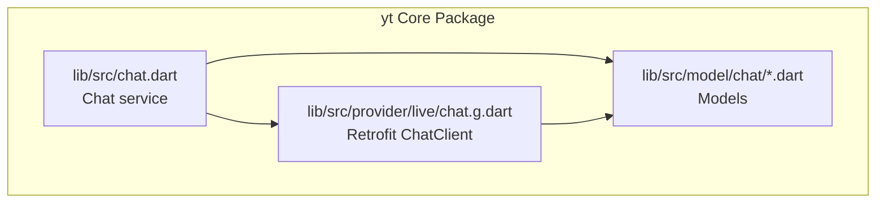
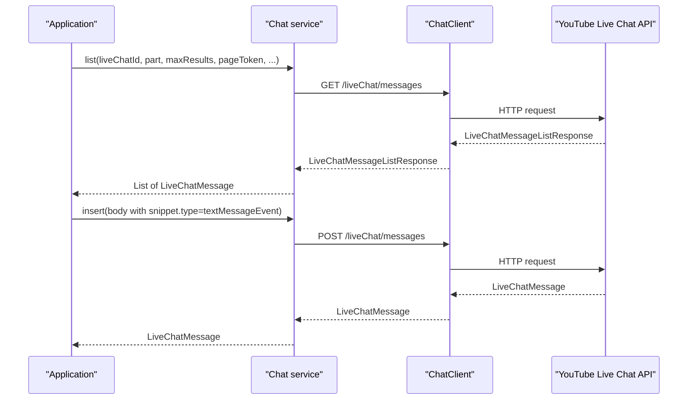
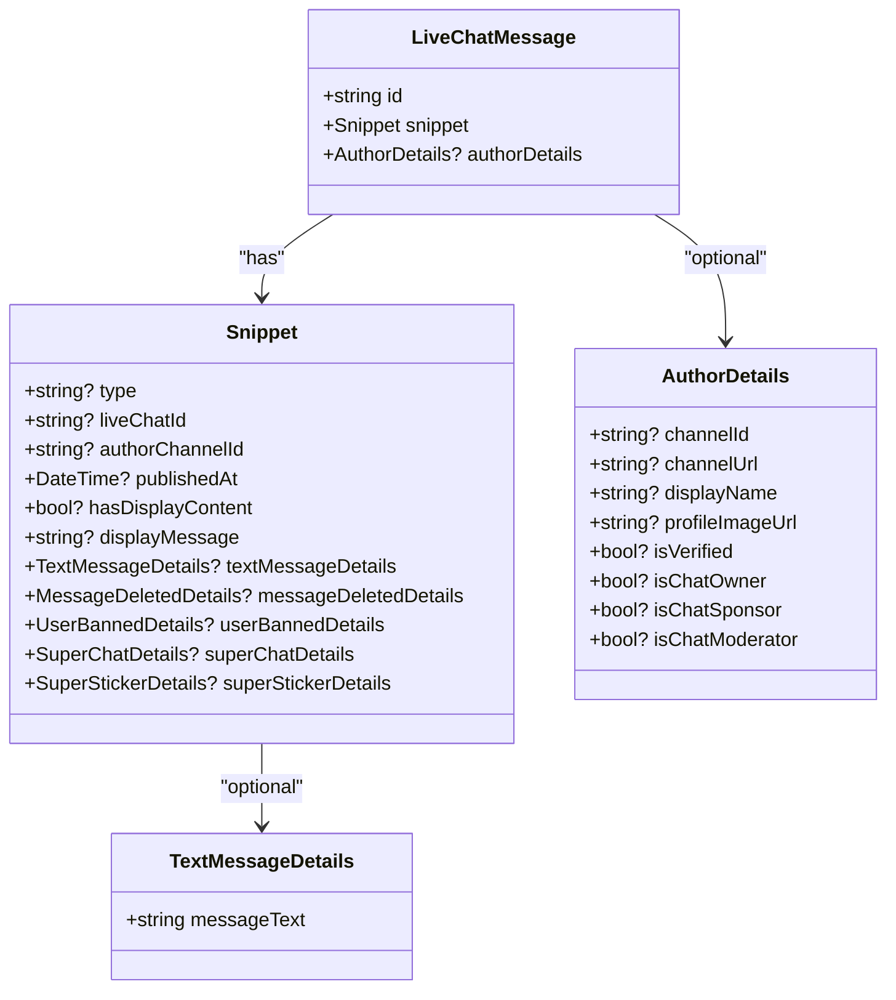
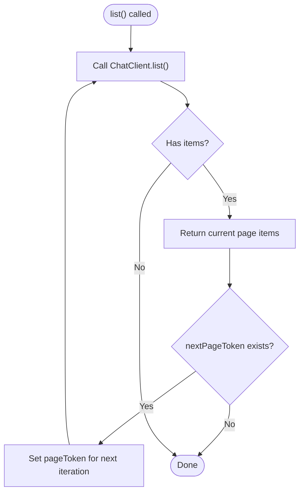
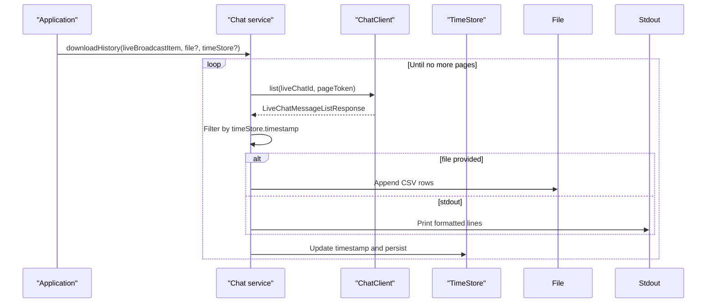
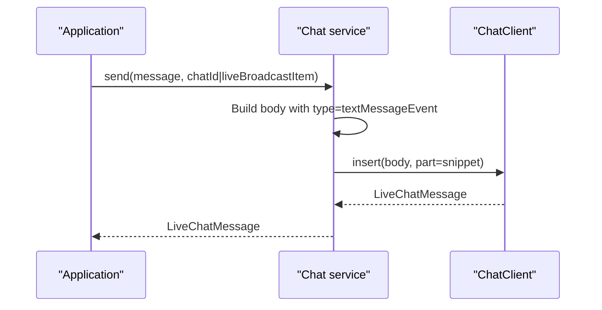
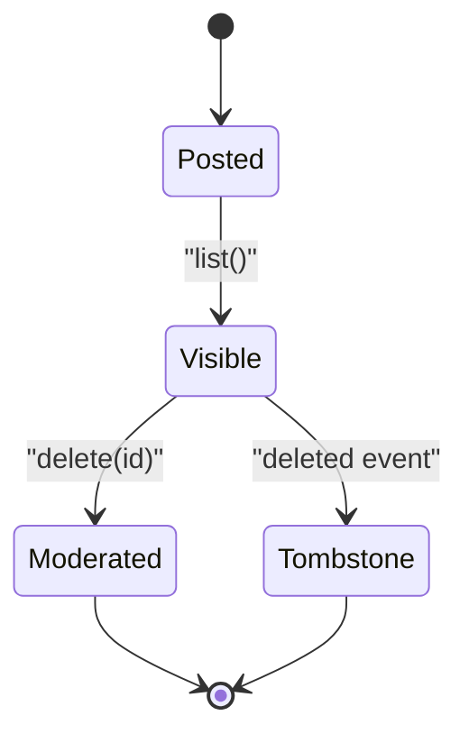
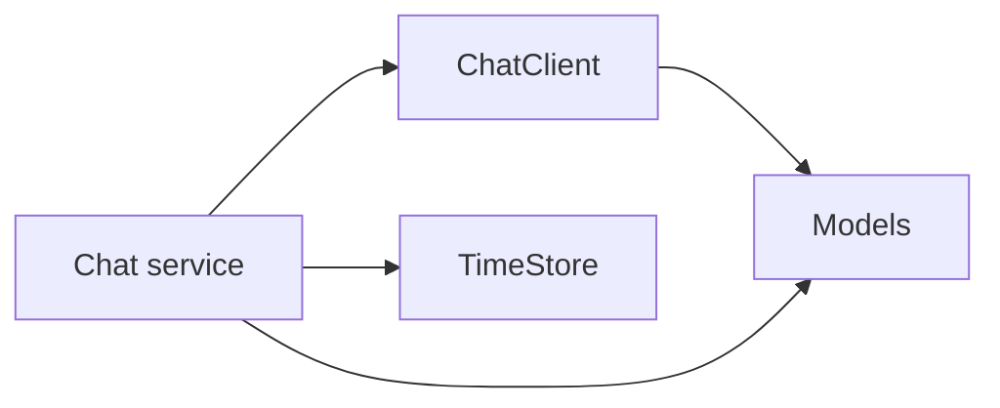

# Live Chat Messages

<cite>
**Referenced Files in This Document**
- [README.md](file://packages/yt/README.md)
- [chat.dart](file://packages/yt/lib/src/chat.dart)
- [chat.g.dart](file://packages/yt/lib/src/provider/live/chat.g.dart)
- [live_chat_message.dart](file://packages/yt/lib/src/model/chat/live_chat_message.dart)
- [snippet.dart](file://packages/yt/lib/src/model/chat/snippet.dart)
- [text_message_details.dart](file://packages/yt/lib/src/model/chat/text_message_details.dart)
- [author_details.dart](file://packages/yt/lib/src/model/chat/author_details.dart)
- [live_chat_message_list_response.dart](file://packages/yt/lib/src/model/chat/live_chat_message_list_response.dart)
- [livechat_example.dart](file://packages/yt/example/livechat_example.dart)
</cite>

## Table of Contents
1. [Introduction](#introduction)
2. [Project Structure](#project-structure)
3. [Core Components](#core-components)
4. [Architecture Overview](#architecture-overview)
5. [Detailed Component Analysis](#detailed-component-analysis)
6. [Dependency Analysis](#dependency-analysis)
7. [Performance Considerations](#performance-considerations)
8. [Troubleshooting Guide](#troubleshooting-guide)
9. [Conclusion](#conclusion)
10. [Appendices](#appendices)

## Introduction
This document explains the live chat message functionality provided by the YouTube Live Streaming API integration. It focuses on the LiveChatMessage model, message listing with pagination and filtering, real-time retrieval, message insertion, text formatting and emoji handling, message lifecycle (post to delete), validation and error handling, practical examples for retrieving chat history, implementing filters, handling different message types, and integrating with user permissions and content moderation.

## Project Structure
The live chat feature is implemented in the yt core package under the src directory. The Chat service orchestrates listing, inserting, deleting, and downloading chat history. The Retrofit client defines the REST endpoints. The model layer includes LiveChatMessage, Snippet, TextMessageDetails, AuthorDetails, and LiveChatMessageListResponse.

**Diagram sources**
- [chat.dart:12-216](file://packages/yt/lib/src/chat.dart#L12-L216)
- [chat.g.dart:11-44](file://packages/yt/lib/src/provider/live/chat.g.dart#L11-L44)
- [live_chat_message.dart:14-40](file://packages/yt/lib/src/model/chat/live_chat_message.dart#L14-L40)
- [snippet.dart:13-86](file://packages/yt/lib/src/model/chat/snippet.dart#L13-L86)
- [text_message_details.dart:8-22](file://packages/yt/lib/src/model/chat/text_message_details.dart#L8-L22)
- [author_details.dart:8-51](file://packages/yt/lib/src/model/chat/author_details.dart#L8-L51)
- [live_chat_message_list_response.dart:14-45](file://packages/yt/lib/src/model/chat/live_chat_message_list_response.dart#L14-L45)

**Section sources**
- [README.md:205-264](file://packages/yt/README.md#L205-L264)
- [chat.dart:12-216](file://packages/yt/lib/src/chat.dart#L12-L216)
- [chat.g.dart:11-44](file://packages/yt/lib/src/provider/live/chat.g.dart#L11-L44)

## Core Components
- LiveChatMessage: Top-level model representing a single chat message with id, snippet, and optional authorDetails.
- Snippet: Core message metadata including type, liveChatId, authorChannelId, publishedAt, display fields, and specialized event details.
- TextMessageDetails: Contains the actual text content for textMessageEvent.
- AuthorDetails: Additional author attributes such as channelId, displayName, verification, and roles (owner, sponsor, moderator).
- LiveChatMessageListResponse: Paginated response with items, nextPageToken, pollingIntervalMillis, and offlineAt.
- Chat service: Provides list, insert, delete, send, downloadHistory, and answerBot methods.

**Section sources**
- [live_chat_message.dart:14-40](file://packages/yt/lib/src/model/chat/live_chat_message.dart#L14-L40)
- [snippet.dart:13-86](file://packages/yt/lib/src/model/chat/snippet.dart#L13-L86)
- [text_message_details.dart:8-22](file://packages/yt/lib/src/model/chat/text_message_details.dart#L8-L22)
- [author_details.dart:8-51](file://packages/yt/lib/src/model/chat/author_details.dart#L8-L51)
- [live_chat_message_list_response.dart:14-45](file://packages/yt/lib/src/model/chat/live_chat_message_list_response.dart#L14-L45)
- [chat.dart:12-216](file://packages/yt/lib/src/chat.dart#L12-L216)

## Architecture Overview
The Chat service delegates to a Retrofit-generated ChatClient that calls the YouTube Live Chat Messages endpoint. Responses are deserialized into strongly-typed models.

**Diagram sources**
- [chat.dart:17-56](file://packages/yt/lib/src/chat.dart#L17-L56)
- [chat.g.dart:14-43](file://packages/yt/lib/src/provider/live/chat.g.dart#L14-L43)

## Detailed Component Analysis

### LiveChatMessage Model
- Fields: id, snippet (required), authorDetails (optional).
- Relationship: snippet holds type-specific details; authorDetails holds author metadata.

**Diagram sources**
- [live_chat_message.dart:14-40](file://packages/yt/lib/src/model/chat/live_chat_message.dart#L14-L40)
- [snippet.dart:13-86](file://packages/yt/lib/src/model/chat/snippet.dart#L13-L86)
- [text_message_details.dart:8-22](file://packages/yt/lib/src/model/chat/text_message_details.dart#L8-L22)
- [author_details.dart:8-51](file://packages/yt/lib/src/model/chat/author_details.dart#L8-L51)

**Section sources**
- [live_chat_message.dart:14-40](file://packages/yt/lib/src/model/chat/live_chat_message.dart#L14-L40)
- [snippet.dart:13-86](file://packages/yt/lib/src/model/chat/snippet.dart#L13-L86)
- [text_message_details.dart:8-22](file://packages/yt/lib/src/model/chat/text_message_details.dart#L8-L22)
- [author_details.dart:8-51](file://packages/yt/lib/src/model/chat/author_details.dart#L8-L51)

### Message Listing Operations
- Endpoint: GET /liveChat/messages
- Parameters: liveChatId (required), part (default includes snippet,authorDetails), hl, maxResults, pageToken, profileImageSize
- Pagination: Uses nextPageToken to iterate through pages until null
- Filtering: Implemented client-side by filtering by publishedAt timestamps when downloading history

**Diagram sources**
- [chat.dart:17-35](file://packages/yt/lib/src/chat.dart#L17-L35)
- [chat.g.dart:14-25](file://packages/yt/lib/src/provider/live/chat.g.dart#L14-L25)

**Section sources**
- [chat.dart:17-35](file://packages/yt/lib/src/chat.dart#L17-L35)
- [chat.g.dart:14-25](file://packages/yt/lib/src/provider/live/chat.g.dart#L14-L25)

### Real-Time Retrieval and History Download
- Real-time polling interval: pollingIntervalMillis from LiveChatMessageListResponse
- Offline detection: offlineAt indicates when the stream went offline
- History download: Iteratively lists messages, optionally filters by timestamp, and writes to stdout or CSV

**Diagram sources**
- [chat.dart:92-182](file://packages/yt/lib/src/chat.dart#L92-L182)
- [live_chat_message_list_response.dart:15-45](file://packages/yt/lib/src/model/chat/live_chat_message_list_response.dart#L15-L45)

**Section sources**
- [chat.dart:92-182](file://packages/yt/lib/src/chat.dart#L92-L182)
- [live_chat_message_list_response.dart:15-45](file://packages/yt/lib/src/model/chat/live_chat_message_list_response.dart#L15-L45)

### Message Insertion Methods
- Endpoint: POST /liveChat/messages
- Required body snippet.type must be textMessageEvent
- Validation: Rejects empty messageText
- Convenience method: send(message, chatId|liveBroadcastItem)

**Diagram sources**
- [chat.dart:37-90](file://packages/yt/lib/src/chat.dart#L37-L90)
- [chat.g.dart:27-35](file://packages/yt/lib/src/provider/live/chat.g.dart#L27-L35)

**Section sources**
- [chat.dart:37-90](file://packages/yt/lib/src/chat.dart#L37-L90)
- [chat.g.dart:27-35](file://packages/yt/lib/src/provider/live/chat.g.dart#L27-L35)

### Text Formatting and Emoji Handling
- The send method formats the message using EmojiFormatter.format before sending
- This ensures emoji sequences are preserved and valid for the platform

**Section sources**
- [chat.dart:67-90](file://packages/yt/lib/src/chat.dart#L67-L90)

### Message Lifecycle: Posting to Deletion
- Post: insert(body) with snippet.type=textMessageEvent
- Retrieve: list() with pagination
- Delete: delete(id) requires authorization by channel owner or moderator
- Tombstone behavior: Deleted messages appear as tombstone events with minimal fields

**Diagram sources**
- [chat.dart:37-65](file://packages/yt/lib/src/chat.dart#L37-L65)
- [snippet.dart:15-27](file://packages/yt/lib/src/model/chat/snippet.dart#L15-L27)

**Section sources**
- [chat.dart:37-65](file://packages/yt/lib/src/chat.dart#L37-L65)
- [snippet.dart:15-27](file://packages/yt/lib/src/model/chat/snippet.dart#L15-L27)

### Practical Examples

#### Retrieve Chat History
- Use downloadHistory with a LiveBroadcastItem to fetch all messages and either print to stdout or append to CSV.

**Section sources**
- [chat.dart:92-135](file://packages/yt/lib/src/chat.dart#L92-L135)
- [livechat_example.dart](file://packages/yt/example/livechat_example.dart)

#### Implement Message Filters
- Filter by author role: Use authorDetails.isChatModerator, isChatOwner, isChatSponsor
- Filter by message type: Use snippet.type (e.g., textMessageEvent, superChatEvent)
- Filter by time window: Use TimeStore to skip older messages during download

**Section sources**
- [author_details.dart:25-32](file://packages/yt/lib/src/model/chat/author_details.dart#L25-L32)
- [snippet.dart:15-27](file://packages/yt/lib/src/model/chat/snippet.dart#L15-L27)
- [chat.dart:137-182](file://packages/yt/lib/src/chat.dart#L137-L182)

#### Handling Different Message Types
- textMessageEvent: snippet.textMessageDetails.messageText contains the message
- superChatEvent/superStickerEvent: snippet.superChatDetails/superStickerDetails contain purchase details
- messageDeletedEvent: snippet.messageDeletedDetails contains deletion info
- userBannedEvent: snippet.userBannedDetails contains ban info
- tombstone: Minimal fields indicating prior existence

**Section sources**
- [snippet.dart:15-63](file://packages/yt/lib/src/model/chat/snippet.dart#L15-L63)

### User Permissions and Content Moderation
- Delete requires authorization by channel owner or a moderator of the live chat
- AuthorDetails exposes roles: isChatOwner, isChatSponsor, isChatModerator
- Moderation actions: message deletion and banning are represented by messageDeletedEvent and userBannedEvent respectively

**Section sources**
- [chat.dart:58-65](file://packages/yt/lib/src/chat.dart#L58-L65)
- [author_details.dart:25-32](file://packages/yt/lib/src/model/chat/author_details.dart#L25-L32)
- [snippet.dart:15-27](file://packages/yt/lib/src/model/chat/snippet.dart#L15-L27)

## Dependency Analysis
- Chat depends on ChatClient for HTTP operations
- Models are generated via json_serializable and used across Chat and ChatClient
- TimeStore persists timestamps for incremental history downloads

**Diagram sources**
- [chat.dart:12-216](file://packages/yt/lib/src/chat.dart#L12-L216)
- [chat.g.dart:11-44](file://packages/yt/lib/src/provider/live/chat.g.dart#L11-L44)
- [live_chat_message.dart:14-40](file://packages/yt/lib/src/model/chat/live_chat_message.dart#L14-L40)

**Section sources**
- [chat.dart:12-216](file://packages/yt/lib/src/chat.dart#L12-L216)
- [chat.g.dart:11-44](file://packages/yt/lib/src/provider/live/chat.g.dart#L11-L44)

## Performance Considerations
- Polling interval: Respect pollingIntervalMillis to avoid excessive requests
- Pagination: Use nextPageToken to process large histories incrementally
- Filtering: Apply timestamp filtering early to reduce processing overhead
- Batch output: Prefer CSV writing for large datasets to minimize I/O overhead

## Troubleshooting Guide
- Empty message text: insert throws an exception if messageText is empty
- Authentication: delete requires appropriate authorization (channel owner or moderator)
- Rate limits: Respect pollingIntervalMillis and implement exponential backoff if needed
- Offline streams: Check offlineAt to detect when a stream has ended

**Section sources**
- [chat.dart:45-47](file://packages/yt/lib/src/chat.dart#L45-L47)
- [chat.dart:58-65](file://packages/yt/lib/src/chat.dart#L58-L65)
- [live_chat_message_list_response.dart:16-20](file://packages/yt/lib/src/model/chat/live_chat_message_list_response.dart#L16-L20)

## Conclusion
The live chat messaging system provides a robust foundation for listing, inserting, deleting, and downloading chat messages. The model layer cleanly separates core message data (snippet) from author metadata (authorDetails), supports multiple message types, and integrates with pagination and time-based filtering. Developers can implement real-time polling, enforce moderation policies via author roles, and handle diverse message formats including text, Super Chat, and Super Sticker events.

## Appendices

### API Endpoints and Parameters
- GET /liveChat/messages
  - Parameters: part, liveChatId, hl, maxResults, pageToken, profileImageSize
- POST /liveChat/messages
  - Body: snippet with type=textMessageEvent and textMessageDetails.messageText
- DELETE /liveChat/messages
  - Query: id

**Section sources**
- [chat.g.dart:14-43](file://packages/yt/lib/src/provider/live/chat.g.dart#L14-L43)