# Channel Management

<cite>
**Referenced Files in This Document**
- [README.md](file://README.md)
- [pubspec.yaml](file://pubspec.yaml)
- [channels.dart](file://packages/yt/lib/src/channels.dart)
- [channels.dart (REST client)](file://packages/yt/lib/src/provider/data/channels.dart)
- [channel_item.dart](file://packages/yt/lib/src/model/channels/channel_item.dart)
- [channel.dart](file://packages/yt/lib/src/model/channels/channel.dart)
- [branding_settings.dart](file://packages/yt/lib/src/model/channels/branding_settings.dart)
- [snippet.dart](file://packages/yt/lib/src/model/channels/snippet.dart)
- [statistics.dart](file://packages/yt/lib/src/model/channels/statistics.dart)
- [content_details.dart](file://packages/yt/lib/src/model/channels/content_details.dart)
- [related_playlists.dart](file://packages/yt/lib/src/model/channels/related_playlists.dart)
</cite>

## Table of Contents
1. [Introduction](#introduction)
2. [Project Structure](#project-structure)
3. [Core Components](#core-components)
4. [Architecture Overview](#architecture-overview)
5. [Detailed Component Analysis](#detailed-component-analysis)
6. [Dependency Analysis](#dependency-analysis)
7. [Performance Considerations](#performance-considerations)
8. [Troubleshooting Guide](#troubleshooting-guide)
9. [Conclusion](#conclusion)
10. [Appendices](#appendices)

## Introduction
This document explains channel management operations enabled by the yt core package. It focuses on retrieving channel information, updating channel profiles, managing channel settings, branding assets (banner, avatar/thumbnail), statistics and analytics integration, subscriber visibility, and related channel metadata. Practical workflows and best practices for channel setup, brand asset management, performance monitoring, and policy compliance are included.

## Project Structure
The yt workspace provides a Dart/Flutter interface to YouTube’s Data and Live Streaming APIs. Channel management is implemented in the core yt package, with:
- Public API surface for listing and updating channels
- Strongly typed models for channel items, branding, snippet, statistics, and content details
- REST client integration to Google’s YouTube Data v3 API

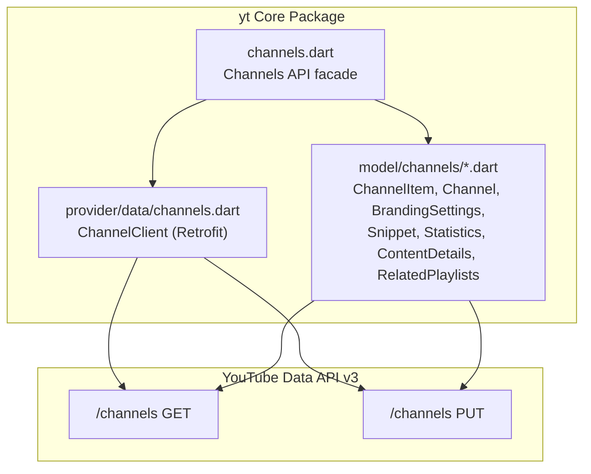

**Diagram sources**
- [channels.dart:1-58](file://packages/yt/lib/src/channels.dart#L1-L58)
- [channels.dart (REST client):1-38](file://packages/yt/lib/src/provider/data/channels.dart#L1-L38)
- [channel_item.dart:1-50](file://packages/yt/lib/src/model/channels/channel_item.dart#L1-L50)
- [branding_settings.dart:1-25](file://packages/yt/lib/src/model/channels/branding_settings.dart#L1-L25)
- [snippet.dart:1-63](file://packages/yt/lib/src/model/channels/snippet.dart#L1-L63)
- [statistics.dart:1-37](file://packages/yt/lib/src/model/channels/statistics.dart#L1-L37)
- [content_details.dart:1-25](file://packages/yt/lib/src/model/channels/content_details.dart#L1-L25)
- [related_playlists.dart:1-26](file://packages/yt/lib/src/model/channels/related_playlists.dart#L1-L26)

**Section sources**
- [README.md:1-119](file://README.md#L1-L119)
- [pubspec.yaml:1-69](file://pubspec.yaml#L1-L69)

## Core Components
- Channels API facade: Provides list and update operations for channels with flexible part selection and filters.
- ChannelClient: Retrofit-based REST client that maps to YouTube Data v3 /channels endpoints.
- ChannelItem model: Aggregates snippet, contentDetails, statistics, brandingSettings, and response metadata.
- Channel model: Encapsulates branding-related properties such as title, description, keywords, analytics account, comment moderation, trailer, language, and country.
- BrandingSettings model: Wraps the Channel object for branding updates.
- Snippet model: Holds channel title, description, custom URL, publishedAt, thumbnails, defaultLanguage, localized, and country.
- Statistics model: Exposes viewCount, subscriberCount, hiddenSubscriberCount, and videoCount.
- ContentDetails model: Contains relatedPlaylists (likes, uploads) for channel-associated playlists.
- RelatedPlaylists model: Identifies playlist IDs for likes and uploads.

These components collectively enable channel retrieval, profile customization, branding updates, and analytics integration.

**Section sources**
- [channels.dart:1-58](file://packages/yt/lib/src/channels.dart#L1-L58)
- [channels.dart (REST client):1-38](file://packages/yt/lib/src/provider/data/channels.dart#L1-L38)
- [channel_item.dart:1-50](file://packages/yt/lib/src/model/channels/channel_item.dart#L1-L50)
- [channel.dart:1-55](file://packages/yt/lib/src/model/channels/channel.dart#L1-L55)
- [branding_settings.dart:1-25](file://packages/yt/lib/src/model/channels/branding_settings.dart#L1-L25)
- [snippet.dart:1-63](file://packages/yt/lib/src/model/channels/snippet.dart#L1-L63)
- [statistics.dart:1-37](file://packages/yt/lib/src/model/channels/statistics.dart#L1-L37)
- [content_details.dart:1-25](file://packages/yt/lib/src/model/channels/content_details.dart#L1-L25)
- [related_playlists.dart:1-26](file://packages/yt/lib/src/model/channels/related_playlists.dart#L1-L26)

## Architecture Overview
Channel management follows a layered pattern:
- API Facade (Channels) orchestrates requests and delegates to the REST client.
- REST Client (ChannelClient) defines endpoint contracts for listing and updating channels.
- Models represent YouTube Data API responses and are used for serialization/deserialization.

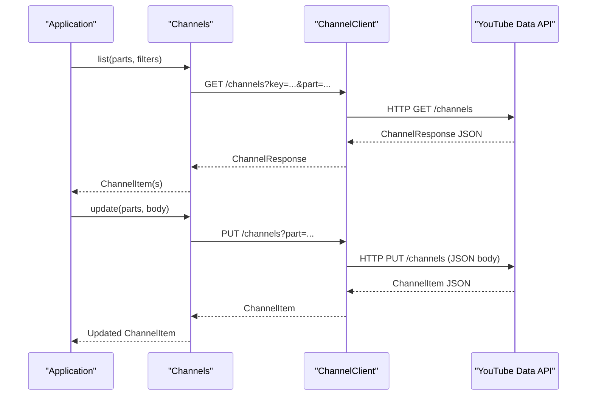

**Diagram sources**
- [channels.dart:12-56](file://packages/yt/lib/src/channels.dart#L12-L56)
- [channels.dart (REST client):12-36](file://packages/yt/lib/src/provider/data/channels.dart#L12-L36)

## Detailed Component Analysis

### Channels API Facade
- Purpose: Provide a high-level interface to list and update channels.
- Key capabilities:
  - list: Supports filtering by categoryId, forUsername, id, managedByMe, mine, hl, maxResults, pageToken, and onBehalfOfContentOwner. Parts include contentDetails, id, localizations, snippet, status, brandingSettings.
  - update: Allows modifying channel properties via a body payload with selected parts.

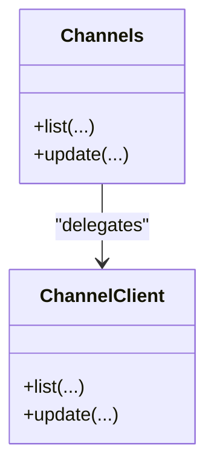

**Diagram sources**
- [channels.dart:6-57](file://packages/yt/lib/src/channels.dart#L6-L57)
- [channels.dart (REST client):9-37](file://packages/yt/lib/src/provider/data/channels.dart#L9-L37)

**Section sources**
- [channels.dart:12-56](file://packages/yt/lib/src/channels.dart#L12-L56)

### ChannelItem Model
- Aggregates channel resource fields:
  - id: Unique channel identifier
  - snippet: Basic info (title, description, thumbnails, publishedAt, customUrl, localized, defaultLanguage, country)
  - contentDetails: relatedPlaylists (likes, uploads)
  - statistics: viewCount, subscriberCount, hiddenSubscriberCount, videoCount
  - brandingSettings: Channel branding properties

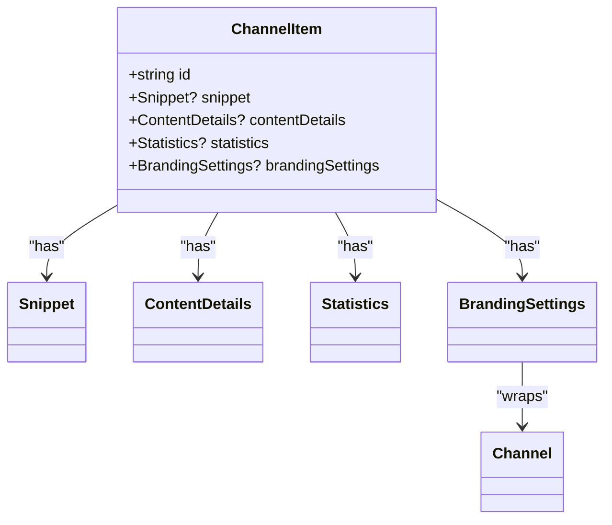

**Diagram sources**
- [channel_item.dart:14-40](file://packages/yt/lib/src/model/channels/channel_item.dart#L14-L40)
- [snippet.dart:10-53](file://packages/yt/lib/src/model/channels/snippet.dart#L10-L53)
- [content_details.dart:9-15](file://packages/yt/lib/src/model/channels/content_details.dart#L9-L15)
- [statistics.dart:7-27](file://packages/yt/lib/src/model/channels/statistics.dart#L7-L27)
- [branding_settings.dart:9-15](file://packages/yt/lib/src/model/channels/branding_settings.dart#L9-L15)
- [channel.dart:7-45](file://packages/yt/lib/src/model/channels/channel.dart#L7-L45)

**Section sources**
- [channel_item.dart:14-40](file://packages/yt/lib/src/model/channels/channel_item.dart#L14-L40)

### Channel and Branding Settings
- Channel model encapsulates branding and profile fields:
  - title, description, keywords, trackingAnalyticsAccountId, moderateComments, unsubscribedTrailer, defaultLanguage, country
- BrandingSettings wraps Channel for branding updates.

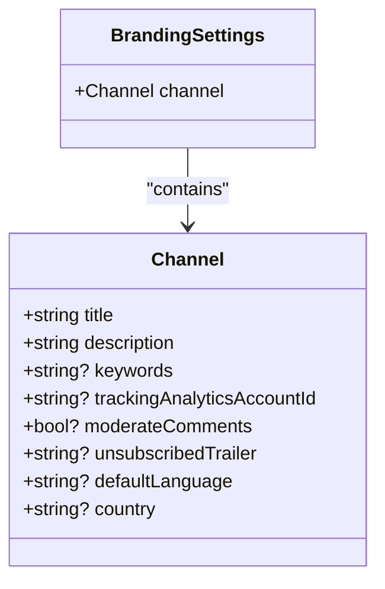

**Diagram sources**
- [channel.dart:8-45](file://packages/yt/lib/src/model/channels/channel.dart#L8-L45)
- [branding_settings.dart:9-15](file://packages/yt/lib/src/model/channels/branding_settings.dart#L9-L15)

**Section sources**
- [channel.dart:8-55](file://packages/yt/lib/src/model/channels/channel.dart#L8-L55)
- [branding_settings.dart:9-24](file://packages/yt/lib/src/model/channels/branding_settings.dart#L9-L24)

### Snippet and Thumbnails
- Snippet holds title, description, customUrl, publishedAt, thumbnails, defaultLanguage, localized, and country.
- Thumbnails are available in HTTPS and may be empty for new channels until populated.

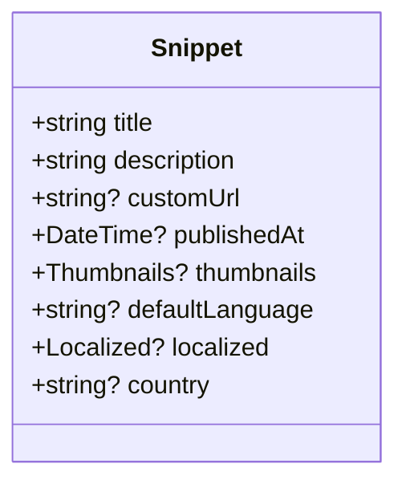

**Diagram sources**
- [snippet.dart:10-53](file://packages/yt/lib/src/model/channels/snippet.dart#L10-L53)

**Section sources**
- [snippet.dart:10-63](file://packages/yt/lib/src/model/channels/snippet.dart#L10-L63)

### Statistics and Subscriber Visibility
- Statistics exposes viewCount, subscriberCount, hiddenSubscriberCount, and videoCount.
- hiddenSubscriberCount indicates whether subscriber counts are publicly visible.

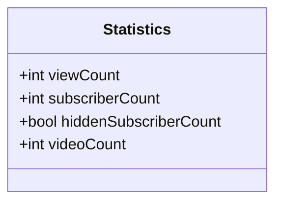

**Diagram sources**
- [statistics.dart:7-27](file://packages/yt/lib/src/model/channels/statistics.dart#L7-L27)

**Section sources**
- [statistics.dart:7-37](file://packages/yt/lib/src/model/channels/statistics.dart#L7-L37)

### Content Details and Related Playlists
- ContentDetails contains RelatedPlaylists with likes and uploads playlist IDs.
- These IDs can be used with playlists.list to fetch associated playlists.

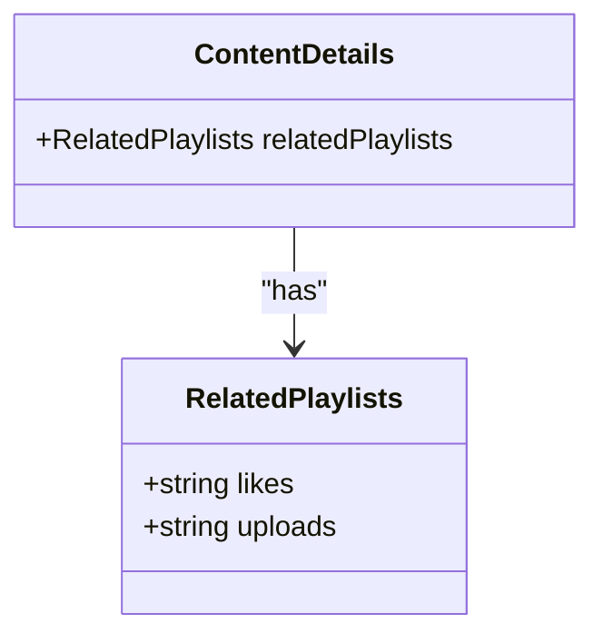

**Diagram sources**
- [content_details.dart:9-15](file://packages/yt/lib/src/model/channels/content_details.dart#L9-L15)
- [related_playlists.dart:7-16](file://packages/yt/lib/src/model/channels/related_playlists.dart#L7-L16)

**Section sources**
- [content_details.dart:9-25](file://packages/yt/lib/src/model/channels/content_details.dart#L9-L25)
- [related_playlists.dart:7-26](file://packages/yt/lib/src/model/channels/related_playlists.dart#L7-L26)

### Channel Branding Operations
- Banner updates: Use update with brandingSettings.part and a body containing brandingSettings.channel fields. The exact field names and schema are defined by the YouTube Data API and mapped by the Channel model.
- Avatar/thumbnail changes: Update snippet.thumbnails via update with snippet part. Thumbnails are HTTPS URLs and may require time to propagate after creation.
- Channel customization options: Modify snippet.title, snippet.description, snippet.customUrl, channel.keywords, channel.defaultLanguage, channel.country, and channel.trackingAnalyticsAccountId.

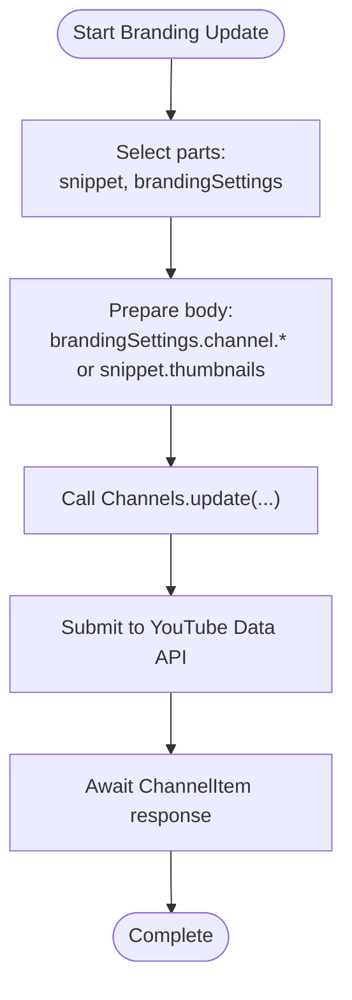

**Diagram sources**
- [channels.dart:43-56](file://packages/yt/lib/src/channels.dart#L43-L56)
- [branding_settings.dart:9-15](file://packages/yt/lib/src/model/channels/branding_settings.dart#L9-L15)
- [snippet.dart:25-30](file://packages/yt/lib/src/model/channels/snippet.dart#L25-L30)
- [channel.dart:10-34](file://packages/yt/lib/src/model/channels/channel.dart#L10-L34)

**Section sources**
- [channels.dart:43-56](file://packages/yt/lib/src/channels.dart#L43-L56)
- [branding_settings.dart:9-24](file://packages/yt/lib/src/model/channels/branding_settings.dart#L9-L24)
- [snippet.dart:25-30](file://packages/yt/lib/src/model/channels/snippet.dart#L25-L30)
- [channel.dart:10-34](file://packages/yt/lib/src/model/channels/channel.dart#L10-L34)

### Channel Statistics Tracking and Analytics Integration
- Retrieve statistics via list with statistics part.
- Use channel.trackingAnalyticsAccountId to integrate external analytics with the channel’s Google Analytics account.

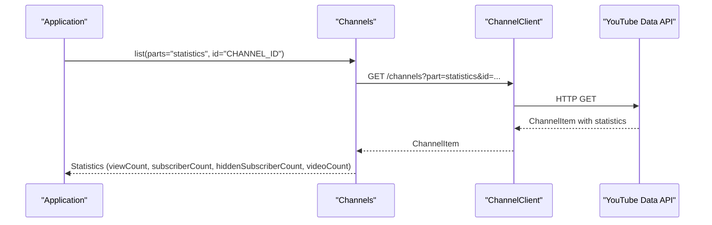

**Diagram sources**
- [channels.dart:12-41](file://packages/yt/lib/src/channels.dart#L12-L41)
- [statistics.dart:7-27](file://packages/yt/lib/src/model/channels/statistics.dart#L7-L27)

**Section sources**
- [channels.dart:12-41](file://packages/yt/lib/src/channels.dart#L12-L41)
- [statistics.dart:7-37](file://packages/yt/lib/src/model/channels/statistics.dart#L7-L37)

### Subscriber Management and Visibility Controls
- hiddenSubscriberCount indicates whether subscriber counts are publicly visible.
- subscriberCount provides the rounded subscriber count.

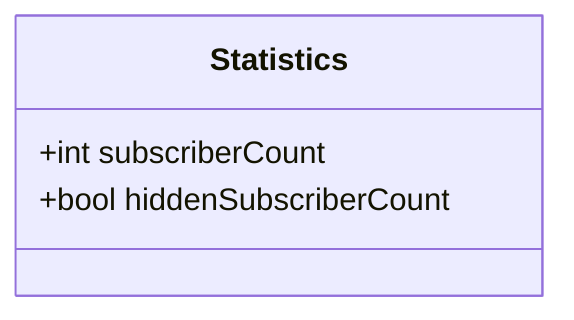

**Diagram sources**
- [statistics.dart:13-17](file://packages/yt/lib/src/model/channels/statistics.dart#L13-L17)

**Section sources**
- [statistics.dart:13-17](file://packages/yt/lib/src/model/channels/statistics.dart#L13-L17)

### Community Guidelines and Policy Compliance
- moderateComments controls whether user-submitted comments on the channel page require approval.
- Use update with brandingSettings.part to set channel.moderateComments.

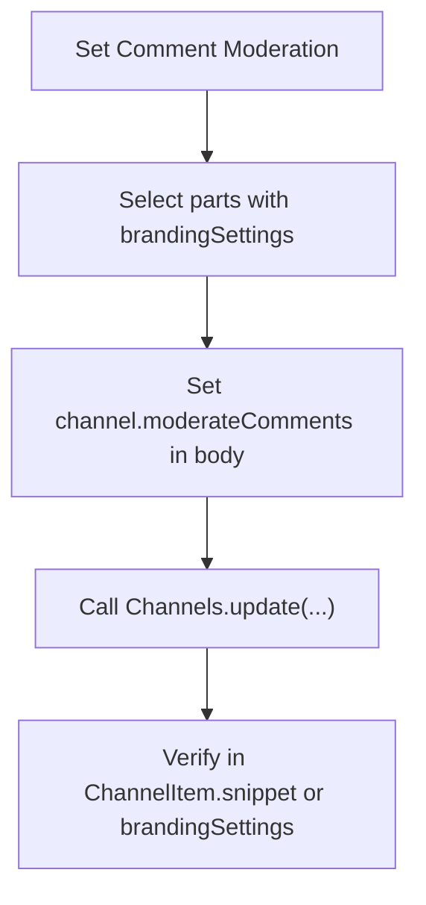

**Diagram sources**
- [channels.dart:43-56](file://packages/yt/lib/src/channels.dart#L43-L56)
- [channel.dart:22-23](file://packages/yt/lib/src/model/channels/channel.dart#L22-L23)

**Section sources**
- [channel.dart:22-23](file://packages/yt/lib/src/model/channels/channel.dart#L22-L23)
- [channels.dart:43-56](file://packages/yt/lib/src/channels.dart#L43-L56)

### Channel Visibility Controls
- Privacy status is part of the channel resource and can be updated via update with appropriate parts.
- Use list with status part to inspect current status and update accordingly.

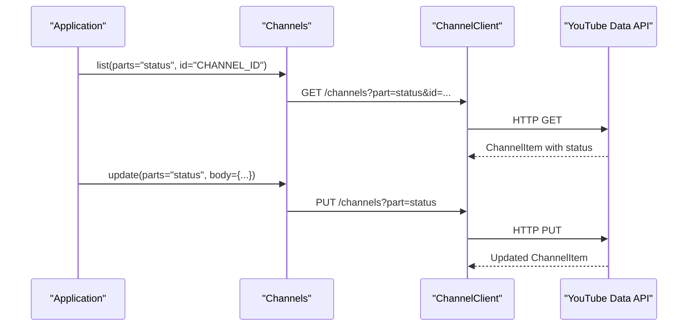

**Diagram sources**
- [channels.dart:12-56](file://packages/yt/lib/src/channels.dart#L12-L56)

**Section sources**
- [channels.dart:12-56](file://packages/yt/lib/src/channels.dart#L12-L56)

### Practical Examples

#### Channel Setup Workflow
- Retrieve channel details: list with parts including snippet, contentDetails, statistics, brandingSettings.
- Customize profile: update with snippet part to set title, description, customUrl, thumbnails.
- Set branding: update with brandingSettings.part to configure keywords, defaultLanguage, country, analytics account, and moderateComments.
- Verify analytics integration: confirm trackingAnalyticsAccountId and monitor statistics.

**Section sources**
- [channels.dart:12-56](file://packages/yt/lib/src/channels.dart#L12-L56)
- [snippet.dart:10-53](file://packages/yt/lib/src/model/channels/snippet.dart#L10-L53)
- [branding_settings.dart:9-24](file://packages/yt/lib/src/model/channels/branding_settings.dart#L9-L24)
- [channel.dart:10-34](file://packages/yt/lib/src/model/channels/channel.dart#L10-L34)
- [statistics.dart:7-27](file://packages/yt/lib/src/model/channels/statistics.dart#L7-L27)

#### Brand Asset Management
- Update avatar/thumbnail: set snippet.thumbnails in update payload.
- Update banner: include brandingSettings.channel fields in update body.
- Confirm propagation: re-list channel to verify updated assets.

**Section sources**
- [snippet.dart:25-30](file://packages/yt/lib/src/model/channels/snippet.dart#L25-L30)
- [branding_settings.dart:9-24](file://packages/yt/lib/src/model/channels/branding_settings.dart#L9-L24)
- [channels.dart:43-56](file://packages/yt/lib/src/channels.dart#L43-L56)

#### Channel Performance Monitoring
- Track metrics: list with statistics part to retrieve viewCount, subscriberCount, hiddenSubscriberCount, videoCount.
- Monitor trends: schedule periodic lists and compare values over time.

**Section sources**
- [channels.dart:12-41](file://packages/yt/lib/src/channels.dart#L12-L41)
- [statistics.dart:7-37](file://packages/yt/lib/src/model/channels/statistics.dart#L7-L37)

#### Channel Policy Compliance
- Enable comment moderation: set channel.moderateComments via update.
- Configure country/language: set channel.country and channel.defaultLanguage.
- Use related playlists: leverage uploads and likes playlist IDs for content management.

**Section sources**
- [channel.dart:30-34](file://packages/yt/lib/src/model/channels/channel.dart#L30-L34)
- [content_details.dart:9-15](file://packages/yt/lib/src/model/channels/content_details.dart#L9-L15)
- [related_playlists.dart:7-16](file://packages/yt/lib/src/model/channels/related_playlists.dart#L7-L16)

### Channel Growth Strategies and Engagement Tactics
- Optimize discoverability: set concise title and description in snippet; use keywords thoughtfully.
- Engage audiences: publish regularly and monitor statistics; consider unsubscribedTrailer to highlight featured content.
- Localization: set defaultLanguage and use localizations to reach broader audiences.
- Analytics: connect trackingAnalyticsAccountId to monitor traffic and engagement.

[No sources needed since this section provides general guidance]

## Dependency Analysis
- Channels depends on ChannelClient for HTTP operations.
- ChannelItem composes Snippet, ContentDetails, Statistics, and BrandingSettings.
- BrandingSettings wraps Channel, which contains branding and profile fields.
- REST endpoints: GET /channels for listing, PUT /channels for updates.

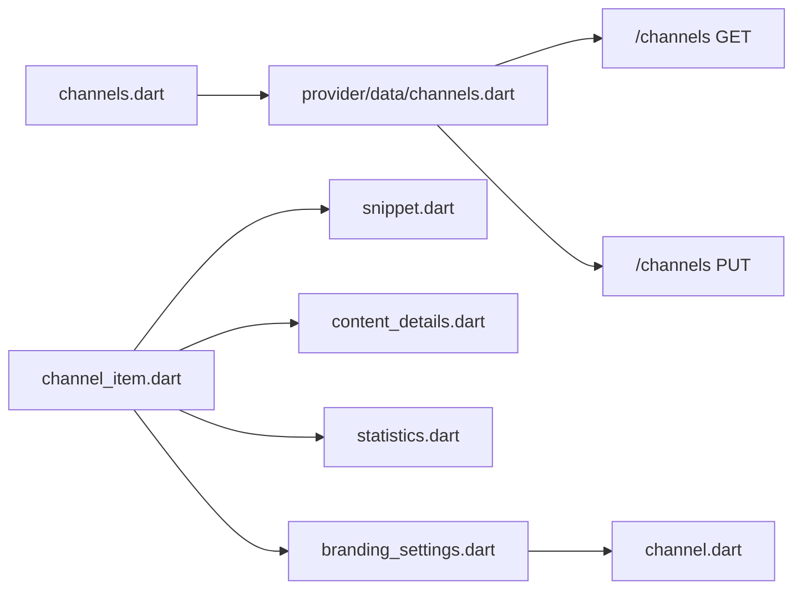

**Diagram sources**
- [channels.dart:6-10](file://packages/yt/lib/src/channels.dart#L6-L10)
- [channels.dart (REST client):8-37](file://packages/yt/lib/src/provider/data/channels.dart#L8-L37)
- [channel_item.dart:14-30](file://packages/yt/lib/src/model/channels/channel_item.dart#L14-L30)
- [branding_settings.dart:9-15](file://packages/yt/lib/src/model/channels/branding_settings.dart#L9-L15)
- [channel.dart:7-15](file://packages/yt/lib/src/model/channels/channel.dart#L7-L15)

**Section sources**
- [channels.dart:6-10](file://packages/yt/lib/src/channels.dart#L6-L10)
- [channels.dart (REST client):8-37](file://packages/yt/lib/src/provider/data/channels.dart#L8-L37)
- [channel_item.dart:14-30](file://packages/yt/lib/src/model/channels/channel_item.dart#L14-L30)

## Performance Considerations
- Minimize parts: Request only the parts needed (e.g., snippet for profile, statistics for metrics) to reduce payload size.
- Batch operations: Combine related reads/writes to reduce round-trips.
- Cache: Store ChannelItem locally and refresh periodically to avoid redundant API calls.
- Pagination: Use pageToken and maxResults for large result sets.

[No sources needed since this section provides general guidance]

## Troubleshooting Guide
- Authentication and API key: Ensure apiKey or OAuth token is configured; failures often stem from invalid credentials.
- Part selection: Mismatched parts can cause missing fields; verify parts include snippet, statistics, brandingSettings, or status as needed.
- Rate limits: Respect API quotas; implement retries with backoff.
- Field validation: Some fields (e.g., thumbnails) may be empty initially; retry after propagation.
- Error responses: Inspect ChannelItem response metadata and handle HTTP errors from the REST client.

[No sources needed since this section analyzes general operational concerns]

## Conclusion
The yt core package provides a robust foundation for channel management, enabling retrieval, customization, branding updates, and analytics integration. By leveraging the Channels facade and strongly typed models, developers can implement efficient workflows for channel setup, brand asset management, performance monitoring, and policy compliance while adhering to YouTube Data API constraints.

## Appendices
- Additional resources: YouTube Data API Reference and Live Streaming API Reference are linked in the workspace README.

**Section sources**
- [README.md:64-71](file://README.md#L64-L71)