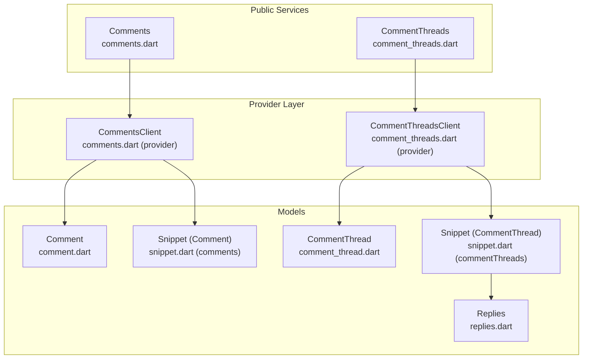
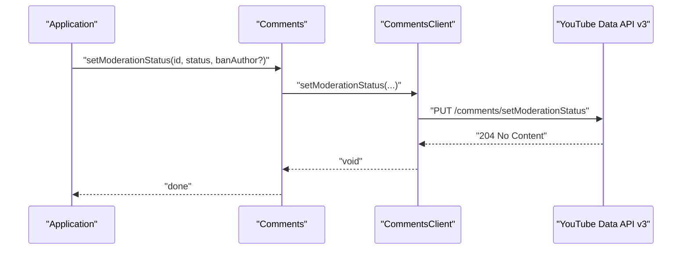
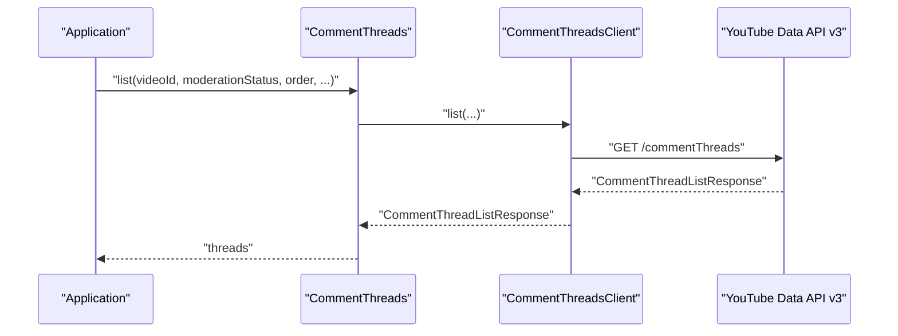
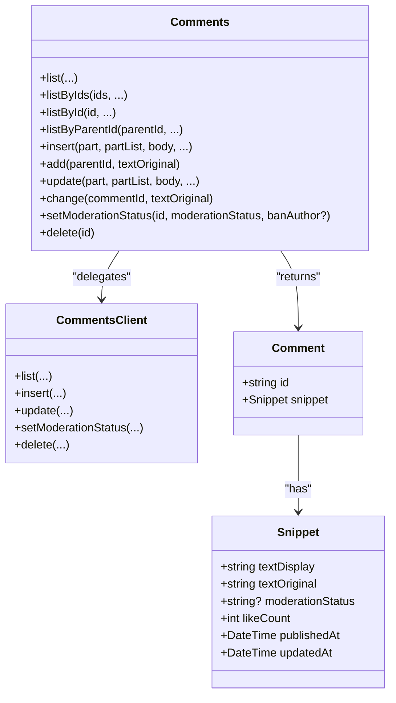
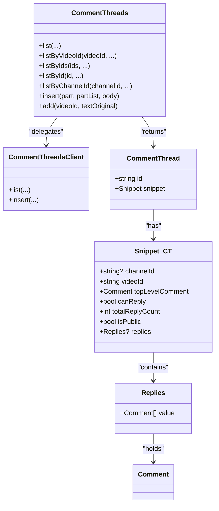
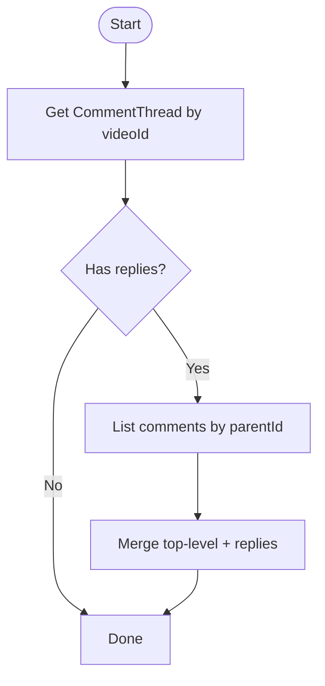
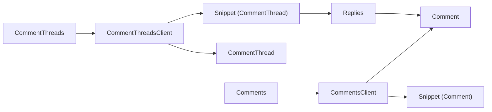

# Comment Management

<cite>
**Referenced Files in This Document**
- [comments.dart](file://packages/yt/lib/src/comments.dart)
- [comment_threads.dart](file://packages/yt/lib/src/comment_threads.dart)
- [comments.dart (provider)](file://packages/yt/lib/src/provider/data/comments.dart)
- [comment_threads.dart (provider)](file://packages/yt/lib/src/provider/data/comment_threads.dart)
- [comment.dart (model)](file://packages/yt/lib/src/model/comments/comment.dart)
- [snippet.dart (comments)](file://packages/yt/lib/src/model/comments/snippet.dart)
- [comment_thread.dart (model)](file://packages/yt/lib/src/model/commentThreads/comment_thread.dart)
- [snippet.dart (commentThreads)](file://packages/yt/lib/src/model/commentThreads/snippet.dart)
- [replies.dart (commentThreads)](file://packages/yt/lib/src/model/commentThreads/replies.dart)
- [enum.dart](file://packages/yt/lib/src/util/enum.dart)
</cite>

## Table of Contents
1. [Introduction](#introduction)
2. [Project Structure](#project-structure)
3. [Core Components](#core-components)
4. [Architecture Overview](#architecture-overview)
5. [Detailed Component Analysis](#detailed-component-analysis)
6. [Dependency Analysis](#dependency-analysis)
7. [Performance Considerations](#performance-considerations)
8. [Troubleshooting Guide](#troubleshooting-guide)
9. [Conclusion](#conclusion)
10. [Appendices](#appendices)

## Introduction
This document describes comment management operations implemented in the project, focusing on:
- Comment moderation workflows (approval, rejection, deletion)
- Comment thread operations (hierarchical conversations, replies)
- Analytics and engagement signals exposed via models
- Filtering and ordering strategies
- Practical workflows for moderation, bulk operations, and community guideline enforcement
- Optimization tips and user reputation considerations

The implementation leverages strongly typed models and Retrofit-based clients to interact with the YouTube Data API v3 for comments and comment threads.

## Project Structure
The comment management functionality is organized around:
- Public service classes that expose high-level operations
- Provider clients that define Retrofit endpoints
- Strongly typed models for comments and comment threads

**Diagram sources**
- [comments.dart:6-256](file://packages/yt/lib/src/comments.dart#L6-L256)
- [comment_threads.dart:6-151](file://packages/yt/lib/src/comment_threads.dart#L6-L151)
- [comments.dart (provider):9-61](file://packages/yt/lib/src/provider/data/comments.dart#L9-L61)
- [comment_threads.dart (provider):9-39](file://packages/yt/lib/src/provider/data/comment_threads.dart#L9-L39)
- [comment.dart (model):11-30](file://packages/yt/lib/src/model/comments/comment.dart#L11-L30)
- [snippet.dart (comments):11-97](file://packages/yt/lib/src/model/comments/snippet.dart#L11-L97)
- [comment_thread.dart (model):11-30](file://packages/yt/lib/src/model/commentThreads/comment_thread.dart#L11-L30)
- [snippet.dart (commentThreads):12-54](file://packages/yt/lib/src/model/commentThreads/snippet.dart#L12-L54)
- [replies.dart (commentThreads):10-26](file://packages/yt/lib/src/model/commentThreads/replies.dart#L10-L26)

**Section sources**
- [comments.dart:6-256](file://packages/yt/lib/src/comments.dart#L6-L256)
- [comment_threads.dart:6-151](file://packages/yt/lib/src/comment_threads.dart#L6-L151)
- [comments.dart (provider):9-61](file://packages/yt/lib/src/provider/data/comments.dart#L9-L61)
- [comment_threads.dart (provider):9-39](file://packages/yt/lib/src/provider/data/comment_threads.dart#L9-L39)

## Core Components
- Comments service
  - Listing comments by filters (IDs, parent ID)
  - Inserting replies and top-level comments
  - Updating comments
  - Setting moderation status (heldForReview, published, rejected)
  - Deleting comments
- CommentThreads service
  - Listing threads by video/channel
  - Inserting new top-level comment threads
- Models
  - Comment and Snippet (comment-level metadata, moderation status, likes, timestamps)
  - CommentThread and Snippet (thread-level metadata, top-level comment, replies container)
  - Replies container for nested replies

Key capabilities:
- Thread visibility and reply counts
- Moderation status enumeration
- Text format selection (HTML/plain)
- Pagination via pageToken and maxResults
- Ordering and searchTerms for thread listing

**Section sources**
- [comments.dart:12-256](file://packages/yt/lib/src/comments.dart#L12-L256)
- [comment_threads.dart:12-151](file://packages/yt/lib/src/comment_threads.dart#L12-L151)
- [comment.dart (model):11-30](file://packages/yt/lib/src/model/comments/comment.dart#L11-L30)
- [snippet.dart (comments):11-97](file://packages/yt/lib/src/model/comments/snippet.dart#L11-L97)
- [comment_thread.dart (model):11-30](file://packages/yt/lib/src/model/commentThreads/comment_thread.dart#L11-L30)
- [snippet.dart (commentThreads):12-54](file://packages/yt/lib/src/model/commentThreads/snippet.dart#L12-L54)
- [replies.dart (commentThreads):10-26](file://packages/yt/lib/src/model/commentThreads/replies.dart#L10-L26)
- [enum.dart:1-12](file://packages/yt/lib/src/util/enum.dart#L1-L12)

## Architecture Overview
The architecture separates concerns into service classes, provider clients, and models:
- Service classes wrap provider clients and expose convenient methods
- Provider clients define Retrofit endpoints mapped to YouTube Data API v3
- Models serialize/deserialize API responses and expose fields for moderation, engagement, and threading

**Diagram sources**
- [comments.dart:223-247](file://packages/yt/lib/src/comments.dart#L223-L247)
- [comments.dart (provider):44-51](file://packages/yt/lib/src/provider/data/comments.dart#L44-L51)

**Diagram sources**
- [comment_threads.dart:12-40](file://packages/yt/lib/src/comment_threads.dart#L12-L40)
- [comment_threads.dart (provider):14-29](file://packages/yt/lib/src/provider/data/comment_threads.dart#L14-L29)

## Detailed Component Analysis

### Comments Service
Responsibilities:
- Retrieve comments by ID or parent ID
- Insert replies and top-level comments
- Update comment text
- Set moderation status and optionally ban the author
- Delete comments

Operational highlights:
- Supports textFormat selection for display/original text
- Enforces maxResults bounds and pagination
- Uses part parameters to control response payload

**Diagram sources**
- [comments.dart:6-256](file://packages/yt/lib/src/comments.dart#L6-L256)
- [comments.dart (provider):9-61](file://packages/yt/lib/src/provider/data/comments.dart#L9-L61)
- [comment.dart (model):11-30](file://packages/yt/lib/src/model/comments/comment.dart#L11-L30)
- [snippet.dart (comments):11-97](file://packages/yt/lib/src/model/comments/snippet.dart#L11-L97)

**Section sources**
- [comments.dart:12-256](file://packages/yt/lib/src/comments.dart#L12-L256)
- [comments.dart (provider):12-59](file://packages/yt/lib/src/provider/data/comments.dart#L12-L59)
- [comment.dart (model):11-30](file://packages/yt/lib/src/model/comments/comment.dart#L11-L30)
- [snippet.dart (comments):11-97](file://packages/yt/lib/src/model/comments/snippet.dart#L11-L97)

### CommentThreads Service
Responsibilities:
- List threads by video, channel, or IDs
- Insert new top-level comment threads
- Order, filter, and paginate thread listings

Thread model relationships:
- Snippet contains top-level comment and replies container
- Replies holds a list of comment resources

**Diagram sources**
- [comment_threads.dart:6-151](file://packages/yt/lib/src/comment_threads.dart#L6-L151)
- [comment_threads.dart (provider):9-39](file://packages/yt/lib/src/provider/data/comment_threads.dart#L9-L39)
- [comment_thread.dart (model):11-30](file://packages/yt/lib/src/model/commentThreads/comment_thread.dart#L11-L30)
- [snippet.dart (commentThreads):12-54](file://packages/yt/lib/src/model/commentThreads/snippet.dart#L12-L54)
- [replies.dart (commentThreads):10-26](file://packages/yt/lib/src/model/commentThreads/replies.dart#L10-L26)
- [comment.dart (model):11-30](file://packages/yt/lib/src/model/comments/comment.dart#L11-L30)

**Section sources**
- [comment_threads.dart:12-151](file://packages/yt/lib/src/comment_threads.dart#L12-L151)
- [comment_threads.dart (provider):14-37](file://packages/yt/lib/src/provider/data/comment_threads.dart#L14-L37)
- [comment_thread.dart (model):11-30](file://packages/yt/lib/src/model/commentThreads/comment_thread.dart#L11-L30)
- [snippet.dart (commentThreads):12-54](file://packages/yt/lib/src/model/commentThreads/snippet.dart#L12-L54)
- [replies.dart (commentThreads):10-26](file://packages/yt/lib/src/model/commentThreads/replies.dart#L10-L26)

### Moderation Status and Spam Handling
- Enumerated moderation states: heldForReview, published, rejected
- Rejected comments hide replies and can trigger optional author banning when setting moderation status
- Moderation status is part of the comment snippet and is only returned when authorized

Practical guidance:
- Use heldForReview for flagged content pending manual review
- Use published to approve content
- Use rejected to remove content; optionally ban the author to prevent further submissions

**Section sources**
- [enum.dart:1-12](file://packages/yt/lib/src/util/enum.dart#L1-L12)
- [comments.dart:223-247](file://packages/yt/lib/src/comments.dart#L223-L247)
- [snippet.dart (comments):56-63](file://packages/yt/lib/src/model/comments/snippet.dart#L56-L63)

### Reply Management and Threading
- Top-level comments can be listed by parent ID
- Replies are contained within the thread’s snippet under replies.comments
- To fetch all replies for a top-level comment, list comments with the parent ID

**Diagram sources**
- [comment_threads.dart:42-62](file://packages/yt/lib/src/comment_threads.dart#L42-L62)
- [comments.dart:127-167](file://packages/yt/lib/src/comments.dart#L127-L167)
- [snippet.dart (commentThreads):33-34](file://packages/yt/lib/src/model/commentThreads/snippet.dart#L33-L34)
- [replies.dart (commentThreads):10-26](file://packages/yt/lib/src/model/commentThreads/replies.dart#L10-L26)

**Section sources**
- [comment_threads.dart:42-62](file://packages/yt/lib/src/comment_threads.dart#L42-L62)
- [comments.dart:127-167](file://packages/yt/lib/src/comments.dart#L127-L167)
- [snippet.dart (commentThreads):33-34](file://packages/yt/lib/src/model/commentThreads/snippet.dart#L33-L34)
- [replies.dart (commentThreads):10-26](file://packages/yt/lib/src/model/commentThreads/replies.dart#L10-L26)

### Analytics and Engagement Signals
Engagement metrics exposed in models:
- Like count per comment
- Published and updated timestamps
- Viewer rating state for the current viewer
- Total reply count per thread
- Visibility flags (public/private)

These fields enable building analytics dashboards and engagement reports.

**Section sources**
- [snippet.dart (comments):53-51](file://packages/yt/lib/src/model/comments/snippet.dart#L53-L51)
- [snippet.dart (commentThreads):27-31](file://packages/yt/lib/src/model/commentThreads/snippet.dart#L27-L31)

### Filtering Strategies and Ordering
- Threads: filter by videoId, channelId, moderationStatus, order, searchTerms, textFormat
- Comments: filter by id, parentId, textFormat
- Pagination: maxResults and pageToken supported for both lists

Common strategies:
- Order threads by relevance or creation date
- Filter by moderationStatus to manage queues
- Search terms for content discovery
- Limit maxResults for performance

**Section sources**
- [comment_threads.dart:12-40](file://packages/yt/lib/src/comment_threads.dart#L12-L40)
- [comments.dart:12-67](file://packages/yt/lib/src/comments.dart#L12-L67)

### Bulk Operations and Workflows
- Bulk moderation: pass a comma-separated list of comment IDs to setModerationStatus
- Bulk retrieval: listByIds for comments and listByIds for threads
- Bulk deletion: iterate IDs and call delete

Recommended workflow:
- Periodic queue review using list with moderationStatus=heldForReview
- Batch approve/reject using setModerationStatus with banAuthor when appropriate
- Fetch full replies via comments.list with parentId for resolved threads

**Section sources**
- [comments.dart:223-254](file://packages/yt/lib/src/comments.dart#L223-L254)
- [comments.dart:69-105](file://packages/yt/lib/src/comments.dart#L69-L105)
- [comment_threads.dart:66-85](file://packages/yt/lib/src/comment_threads.dart#L66-L85)

### Community Guidelines Enforcement
- Use moderationStatus=rejected to suppress problematic content
- Optionally ban the author to prevent further submissions
- Combine searchTerms and moderationStatus to locate violations quickly
- Use textFormat=plain to simplify content scanning

**Section sources**
- [comments.dart:223-247](file://packages/yt/lib/src/comments.dart#L223-L247)
- [comment_threads.dart:12-40](file://packages/yt/lib/src/comment_threads.dart#L12-L40)

## Dependency Analysis
- Service classes depend on provider clients
- Provider clients depend on Retrofit annotations and YouTube API endpoints
- Models depend on JSON serialization and share common base metadata

**Diagram sources**
- [comments.dart:6-10](file://packages/yt/lib/src/comments.dart#L6-L10)
- [comment_threads.dart:6-10](file://packages/yt/lib/src/comment_threads.dart#L6-L10)
- [comments.dart (provider):9-10](file://packages/yt/lib/src/provider/data/comments.dart#L9-L10)
- [comment_threads.dart (provider):9-10](file://packages/yt/lib/src/provider/data/comment_threads.dart#L9-L10)
- [comment.dart (model):11-20](file://packages/yt/lib/src/model/comments/comment.dart#L11-L20)
- [snippet.dart (comments):11-20](file://packages/yt/lib/src/model/comments/snippet.dart#L11-L20)
- [comment_thread.dart (model):11-20](file://packages/yt/lib/src/model/commentThreads/comment_thread.dart#L11-L20)
- [snippet.dart (commentThreads):12-22](file://packages/yt/lib/src/model/commentThreads/snippet.dart#L12-L22)
- [replies.dart (commentThreads):10-16](file://packages/yt/lib/src/model/commentThreads/replies.dart#L10-L16)

**Section sources**
- [comments.dart:6-10](file://packages/yt/lib/src/comments.dart#L6-L10)
- [comment_threads.dart:6-10](file://packages/yt/lib/src/comment_threads.dart#L6-L10)
- [comments.dart (provider):9-10](file://packages/yt/lib/src/provider/data/comments.dart#L9-L10)
- [comment_threads.dart (provider):9-10](file://packages/yt/lib/src/provider/data/comment_threads.dart#L9-L10)

## Performance Considerations
- Prefer filtering with moderationStatus and searchTerms to reduce payload
- Use maxResults judiciously; paginate with pageToken for large datasets
- Request minimal parts (e.g., id, snippet) to minimize bandwidth
- Batch operations where possible (bulk IDs) to reduce API calls
- Cache frequently accessed thread metadata and reply summaries

## Troubleshooting Guide
- Authorization errors
  - Ensure API key or OAuth token is configured; provider clients attach Accept and Content-Type headers
- Rate limits and quotas
  - Monitor quota usage; moderation operations have explicit quota costs
- Pagination issues
  - Verify pageToken and maxResults combinations; avoid id+pagination parameter conflicts
- Unexpected moderationStatus absence
  - Only returned for authorized requests and when not filtered by id
- Reply retrieval gaps
  - Use comments.list with parentId to fetch all replies when snippet.totalReplyCount exceeds returned replies

**Section sources**
- [comments.dart (provider):12-23](file://packages/yt/lib/src/provider/data/comments.dart#L12-L23)
- [comment_threads.dart (provider):14-29](file://packages/yt/lib/src/provider/data/comment_threads.dart#L14-L29)
- [snippet.dart (comments):56-63](file://packages/yt/lib/src/model/comments/snippet.dart#L56-L63)
- [replies.dart (commentThreads):10-16](file://packages/yt/lib/src/model/commentThreads/replies.dart#L10-L16)

## Conclusion
The comment management implementation provides a robust foundation for moderation, threading, and analytics. By leveraging the provided services, providers, and models, applications can enforce community guidelines, manage bulk operations efficiently, and build insights from engagement signals.

## Appendices

### API Endpoint Reference (as implemented)
- Comments
  - GET /comments
  - POST /comments
  - PUT /comments
  - PUT /comments/setModerationStatus
- CommentThreads
  - GET /commentThreads
  - POST /commentThreads

**Section sources**
- [comments.dart (provider):13-59](file://packages/yt/lib/src/provider/data/comments.dart#L13-L59)
- [comment_threads.dart (provider):14-37](file://packages/yt/lib/src/provider/data/comment_threads.dart#L14-L37)