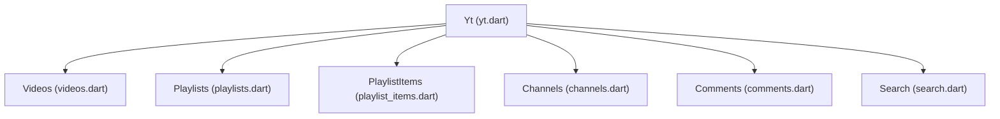
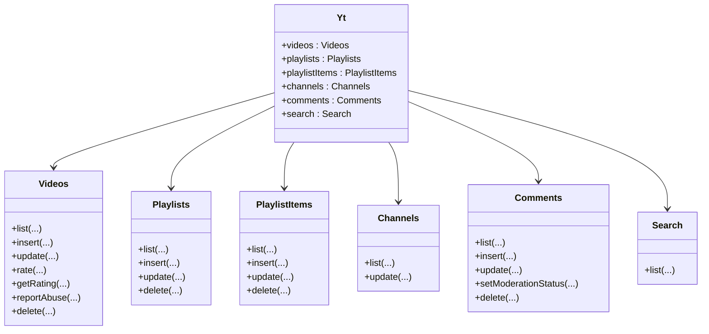
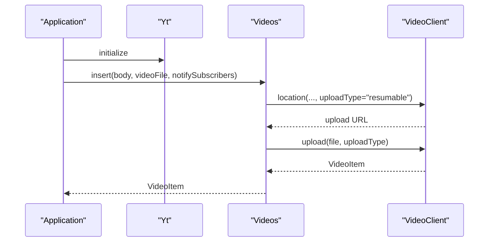
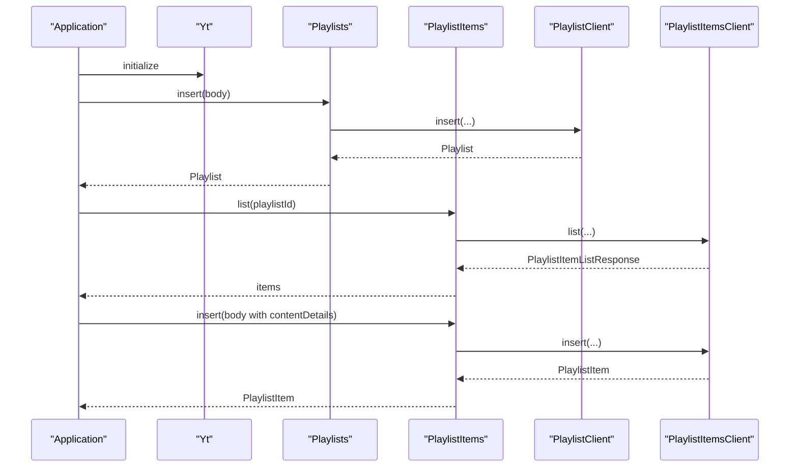
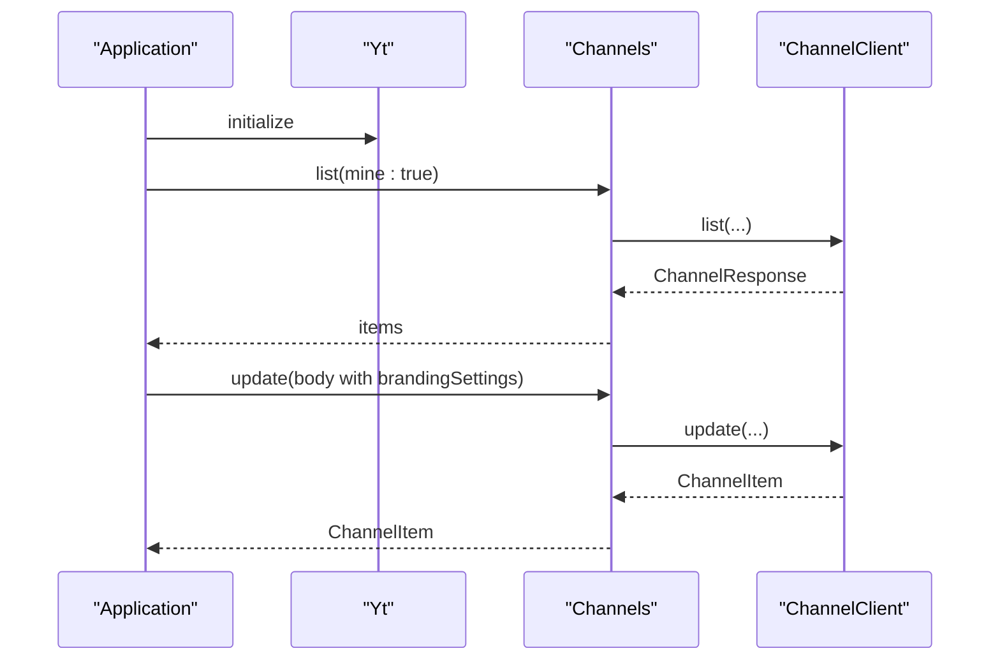
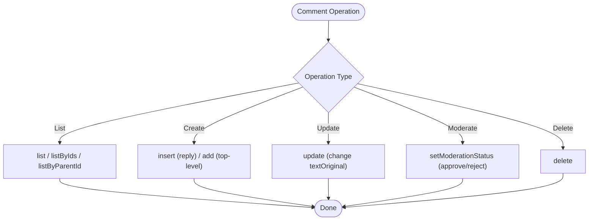
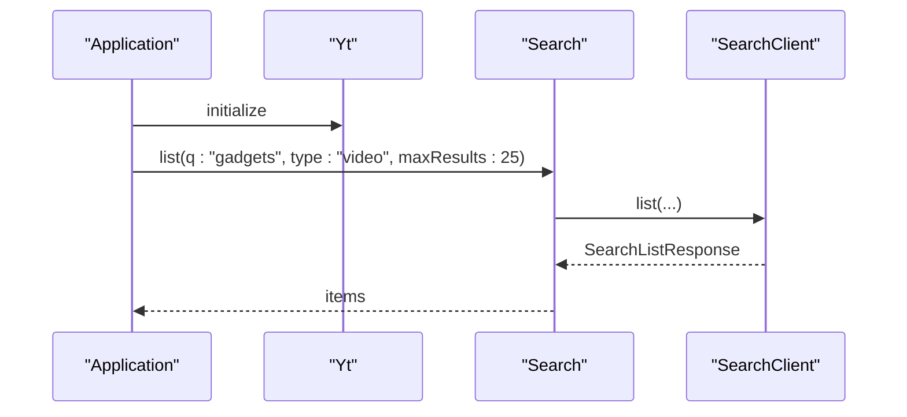
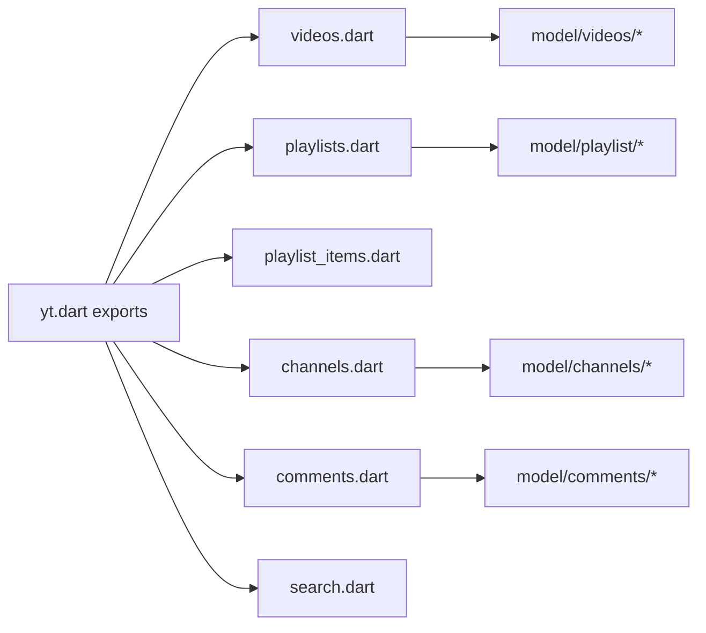

# Content Management

<cite>
**Referenced Files in This Document**
- [README.md](file://README.md)
- [packages/yt/README.md](file://packages/yt/README.md)
- [packages/yt/lib/yt.dart](file://packages/yt/lib/yt.dart)
- [packages/yt/lib/src/videos.dart](file://packages/yt/lib/src/videos.dart)
- [packages/yt/lib/src/playlists.dart](file://packages/yt/lib/src/playlists.dart)
- [packages/yt/lib/src/playlist_items.dart](file://packages/yt/lib/src/playlist_items.dart)
- [packages/yt/lib/src/channels.dart](file://packages/yt/lib/src/channels.dart)
- [packages/yt/lib/src/comments.dart](file://packages/yt/lib/src/comments.dart)
- [packages/yt/lib/src/search.dart](file://packages/yt/lib/src/search.dart)
- [packages/yt/lib/src/model/videos/video_item.dart](file://packages/yt/lib/src/model/videos/video_item.dart)
- [packages/yt/lib/src/model/playlist/playlist.dart](file://packages/yt/lib/src/model/playlist/playlist.dart)
- [packages/yt/lib/src/model/channels/channel_item.dart](file://packages/yt/lib/src/model/channels/channel_item.dart)
- [packages/yt/lib/src/model/comments/comment.dart](file://packages/yt/lib/src/model/comments/comment.dart)
</cite>

## Table of Contents
1. [Introduction](#introduction)
2. [Project Structure](#project-structure)
3. [Core Components](#core-components)
4. [Architecture Overview](#architecture-overview)
5. [Detailed Component Analysis](#detailed-component-analysis)
6. [Dependency Analysis](#dependency-analysis)
7. [Performance Considerations](#performance-considerations)
8. [Troubleshooting Guide](#troubleshooting-guide)
9. [Conclusion](#conclusion)
10. [Appendices](#appendices)

## Introduction
This document provides comprehensive content management guidance for YouTube Data API operations using the yt Dart package. It focuses on the four main content categories: videos, playlists, channels, and comments. For each category, we explain CRUD operations (create, read, update, delete), metadata management, privacy controls, categorization, and organization strategies. Practical examples are provided for video uploads, playlist management, channel customization, and comment moderation. We also cover content discovery via search, lifecycle management, best practices for organization, bulk operations, and migration strategies.

## Project Structure
The yt workspace is organized as a multi-package repository. The core library (yt) exposes clients for YouTube Data API resources and models. The primary modules covered here are:
- Videos: upload, list, update, rate, report abuse, delete
- Playlists: list, create, update, delete
- Playlist Items: list, add/remove videos from playlists
- Channels: list, update
- Comments: list, add, update, moderate, delete
- Search: query and discover content

**Diagram sources**
- [packages/yt/lib/yt.dart:11-66](file://packages/yt/lib/yt.dart#L11-L66)
- [packages/yt/lib/src/videos.dart:8-135](file://packages/yt/lib/src/videos.dart#L8-L135)
- [packages/yt/lib/src/playlists.dart:15-89](file://packages/yt/lib/src/playlists.dart#L15-L89)
- [packages/yt/lib/src/playlist_items.dart:6-71](file://packages/yt/lib/src/playlist_items.dart#L6-L71)
- [packages/yt/lib/src/channels.dart:6-58](file://packages/yt/lib/src/channels.dart#L6-L58)
- [packages/yt/lib/src/comments.dart:6-256](file://packages/yt/lib/src/comments.dart#L6-L256)
- [packages/yt/lib/src/search.dart:7-81](file://packages/yt/lib/src/search.dart#L7-L81)

**Section sources**
- [README.md:1-119](file://README.md#L1-L119)
- [packages/yt/README.md:17-523](file://packages/yt/README.md#L17-L523)
- [packages/yt/lib/yt.dart:11-66](file://packages/yt/lib/yt.dart#L11-L66)

## Core Components
This section summarizes the core capabilities exposed by the yt library for content management.

- Videos
  - List videos with filtering and pagination
  - Insert/upload videos with metadata and optional subscriber notifications
  - Update video metadata and status
  - Rate videos and fetch user ratings
  - Report abuse and delete videos

- Playlists
  - List playlists by channel or IDs
  - Create new playlists
  - Update playlist metadata and status
  - Delete playlists

- Playlist Items
  - List items in a playlist
  - Add or remove items
  - Filter by item or video ID

- Channels
  - List channels by criteria
  - Update channel branding and profile metadata

- Comments
  - List comments and replies
  - Add top-level comments and replies
  - Update comments
  - Moderate comments (set moderation status, optional author ban)
  - Delete comments

- Search
  - Query videos, channels, and playlists with filters and ordering
  - Discover content by keywords, categories, and other parameters

**Section sources**
- [packages/yt/lib/src/videos.dart:8-135](file://packages/yt/lib/src/videos.dart#L8-L135)
- [packages/yt/lib/src/playlists.dart:15-89](file://packages/yt/lib/src/playlists.dart#L15-L89)
- [packages/yt/lib/src/playlist_items.dart:6-71](file://packages/yt/lib/src/playlist_items.dart#L6-L71)
- [packages/yt/lib/src/channels.dart:6-58](file://packages/yt/lib/src/channels.dart#L6-L58)
- [packages/yt/lib/src/comments.dart:6-256](file://packages/yt/lib/src/comments.dart#L6-L256)
- [packages/yt/lib/src/search.dart:7-81](file://packages/yt/lib/src/search.dart#L7-L81)

## Architecture Overview
The yt library organizes YouTube Data API operations into cohesive modules. Each module exposes a typed client that wraps HTTP interactions and returns strongly-typed models. The Yt facade exports these modules for convenient access.

**Diagram sources**
- [packages/yt/lib/yt.dart:11-66](file://packages/yt/lib/yt.dart#L11-L66)
- [packages/yt/lib/src/videos.dart:8-135](file://packages/yt/lib/src/videos.dart#L8-L135)
- [packages/yt/lib/src/playlists.dart:15-89](file://packages/yt/lib/src/playlists.dart#L15-L89)
- [packages/yt/lib/src/playlist_items.dart:6-71](file://packages/yt/lib/src/playlist_items.dart#L6-L71)
- [packages/yt/lib/src/channels.dart:6-58](file://packages/yt/lib/src/channels.dart#L6-L58)
- [packages/yt/lib/src/comments.dart:6-256](file://packages/yt/lib/src/comments.dart#L6-L256)
- [packages/yt/lib/src/search.dart:7-81](file://packages/yt/lib/src/search.dart#L7-L81)

## Detailed Component Analysis

### Videos: CRUD and Lifecycle Management
- Create (Upload)
  - Use insert with a body containing snippet and status, and a File for the video media.
  - Optional notifySubscribers flag controls subscriber notifications.
- Read (List)
  - Use list with part selection and filters (chart, id, myRating, videoCategoryId, etc.).
- Update
  - Use update to modify snippet, status, and contentDetails.
- Delete
  - Use delete by video ID.
- Ratings and Abuse
  - Use rate and getRating for likes/dislikes.
  - Use reportAbuse to flag content.

**Diagram sources**
- [packages/yt/lib/src/videos.dart:44-83](file://packages/yt/lib/src/videos.dart#L44-L83)

**Section sources**
- [packages/yt/lib/src/videos.dart:8-135](file://packages/yt/lib/src/videos.dart#L8-L135)
- [packages/yt/lib/src/model/videos/video_item.dart:15-62](file://packages/yt/lib/src/model/videos/video_item.dart#L15-L62)

Practical example references:
- [packages/yt/README.md:177-204](file://packages/yt/README.md#L177-L204)

### Playlists: Organization and Bulk Operations
- Create
  - Use insert with snippet and status in the body.
- Read
  - Use list with channelId or id filters and pagination.
- Update
  - Use update to change title, description, or privacy status.
- Delete
  - Use delete by playlist ID.
- Bulk operations
  - Use PlaylistItems to add or remove multiple videos efficiently.

**Diagram sources**
- [packages/yt/lib/src/playlists.dart:48-78](file://packages/yt/lib/src/playlists.dart#L48-L78)
- [packages/yt/lib/src/playlist_items.dart:36-60](file://packages/yt/lib/src/playlist_items.dart#L36-L60)

**Section sources**
- [packages/yt/lib/src/playlists.dart:15-89](file://packages/yt/lib/src/playlists.dart#L15-L89)
- [packages/yt/lib/src/playlist_items.dart:6-71](file://packages/yt/lib/src/playlist_items.dart#L6-L71)
- [packages/yt/lib/src/model/playlist/playlist.dart:13-61](file://packages/yt/lib/src/model/playlist/playlist.dart#L13-L61)

Practical example references:
- [packages/yt/README.md:153-176](file://packages/yt/README.md#L153-L176)

### Channels: Customization and Metadata
- Read
  - Use list with filters like forUsername, categoryId, mine, managedByMe.
- Update
  - Use update to modify brandingSettings, snippet, status, and contentDetails.

**Diagram sources**
- [packages/yt/lib/src/channels.dart:12-56](file://packages/yt/lib/src/channels.dart#L12-L56)

**Section sources**
- [packages/yt/lib/src/channels.dart:6-58](file://packages/yt/lib/src/channels.dart#L6-L58)
- [packages/yt/lib/src/model/channels/channel_item.dart:14-50](file://packages/yt/lib/src/model/channels/channel_item.dart#L14-L50)

Practical example references:
- [packages/yt/README.md:153-176](file://packages/yt/README.md#L153-L176)

### Comments: Moderation and Engagement
- Read
  - Use list, listByIds, listById, listByParentId with pagination and textFormat.
- Create
  - Use insert for replies; use add helper for top-level comments.
- Update
  - Use update to edit comment textOriginal.
- Moderate
  - Use setModerationStatus with moderationStatus and optional banAuthor.
- Delete
  - Use delete by comment ID.

**Diagram sources**
- [packages/yt/lib/src/comments.dart:12-256](file://packages/yt/lib/src/comments.dart#L12-L256)

**Section sources**
- [packages/yt/lib/src/comments.dart:6-256](file://packages/yt/lib/src/comments.dart#L6-L256)
- [packages/yt/lib/src/model/comments/comment.dart:10-30](file://packages/yt/lib/src/model/comments/comment.dart#L10-L30)

Practical example references:
- [packages/yt/README.md:177-204](file://packages/yt/README.md#L177-L204)

### Search: Discovery and Integration
- Discover content by combining filters such as q, channelId, type, order, videoCategoryId, and date ranges.
- Use list to retrieve SearchListResponse items representing videos, channels, or playlists.

**Diagram sources**
- [packages/yt/lib/src/search.dart:13-79](file://packages/yt/lib/src/search.dart#L13-L79)

**Section sources**
- [packages/yt/lib/src/search.dart:7-81](file://packages/yt/lib/src/search.dart#L7-L81)

## Dependency Analysis
The yt library composes multiple modules that depend on a shared helper base and provider clients. Each module encapsulates its own client and response models.

**Diagram sources**
- [packages/yt/lib/yt.dart:11-66](file://packages/yt/lib/yt.dart#L11-L66)
- [packages/yt/lib/src/videos.dart:1-135](file://packages/yt/lib/src/videos.dart#L1-L135)
- [packages/yt/lib/src/playlists.dart:1-89](file://packages/yt/lib/src/playlists.dart#L1-L89)
- [packages/yt/lib/src/playlist_items.dart:1-71](file://packages/yt/lib/src/playlist_items.dart#L1-L71)
- [packages/yt/lib/src/channels.dart:1-58](file://packages/yt/lib/src/channels.dart#L1-L58)
- [packages/yt/lib/src/comments.dart:1-256](file://packages/yt/lib/src/comments.dart#L1-L256)
- [packages/yt/lib/src/search.dart:1-81](file://packages/yt/lib/src/search.dart#L1-L81)

**Section sources**
- [packages/yt/lib/yt.dart:11-66](file://packages/yt/lib/yt.dart#L11-L66)

## Performance Considerations
- Use appropriate part selections to minimize payload size and quota consumption.
- Paginate results with pageToken and limit maxResults per request.
- Batch operations where possible (e.g., PlaylistItems for adding/removing multiple videos).
- Respect rate limits and implement retry/backoff strategies for robust integrations.
- Prefer streaming uploads for large files and monitor upload progress.

## Troubleshooting Guide
- Authentication failures
  - Ensure OAuth credentials are configured and refreshed tokens are persisted.
  - Verify scopes and client configuration for the target platform (web, mobile).
- Upload issues
  - Confirm resumable upload initialization returns a location header.
  - Validate video metadata (snippet, status) conforms to API expectations.
- Quota and permissions
  - Some operations require specific scopes and content owner permissions.
  - Review moderation and content owner parameters when encountering permission errors.
- Pagination and filters
  - Use pageToken for continuation and validate maxResults range.
  - Combine filters carefully to avoid unsupported combinations.

**Section sources**
- [packages/yt/README.md:111-152](file://packages/yt/README.md#L111-L152)
- [packages/yt/lib/src/videos.dart:53-83](file://packages/yt/lib/src/videos.dart#L53-L83)

## Conclusion
The yt Dart package provides a structured, modular interface to manage YouTube content across videos, playlists, channels, and comments. By leveraging typed models and dedicated clients, developers can implement robust content workflows including uploads, updates, moderation, and discovery. Following best practices for metadata, privacy, and organization ensures scalable and maintainable content management systems.

## Appendices

### Practical Examples Index
- Video uploads and metadata
  - [packages/yt/README.md:177-204](file://packages/yt/README.md#L177-L204)
- Playlist management
  - [packages/yt/README.md:153-176](file://packages/yt/README.md#L153-L176)
- Channel customization
  - [packages/yt/README.md:153-176](file://packages/yt/README.md#L153-L176)
- Comment moderation
  - [packages/yt/README.md:177-204](file://packages/yt/README.md#L177-L204)

### Content Metadata and Privacy Controls
- Videos
  - snippet: title, description, tags, categoryId
  - status: privacyStatus, embeddable, license
- Playlists
  - snippet: title, description, defaultLanguage
  - status: privacyStatus
- Channels
  - brandingSettings: channel customization assets
  - snippet: title, description, publishedAt
- Comments
  - snippet: textOriginal, authorDisplayName, publishedAt
  - moderationStatus: likelySpam, heldForReview, probableSpam

**Section sources**
- [packages/yt/lib/src/videos.dart:44-97](file://packages/yt/lib/src/videos.dart#L44-L97)
- [packages/yt/lib/src/playlists.dart:48-78](file://packages/yt/lib/src/playlists.dart#L48-L78)
- [packages/yt/lib/src/channels.dart:43-56](file://packages/yt/lib/src/channels.dart#L43-L56)
- [packages/yt/lib/src/comments.dart:169-247](file://packages/yt/lib/src/comments.dart#L169-L247)