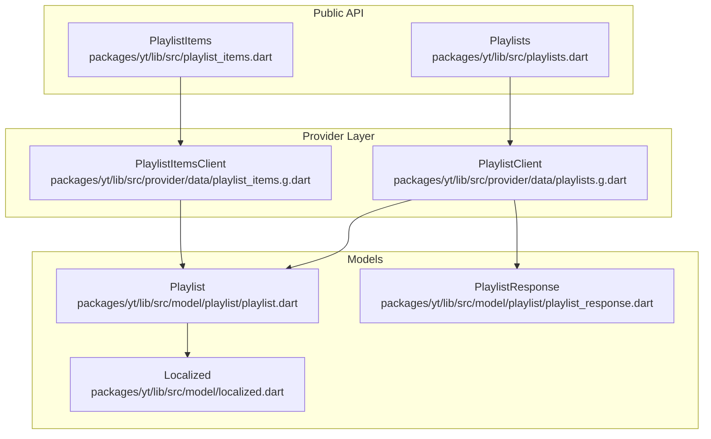
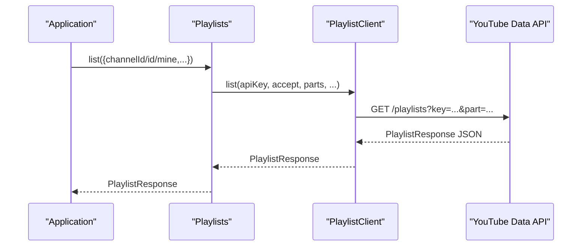
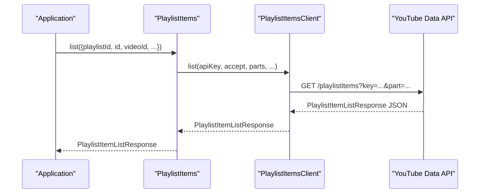
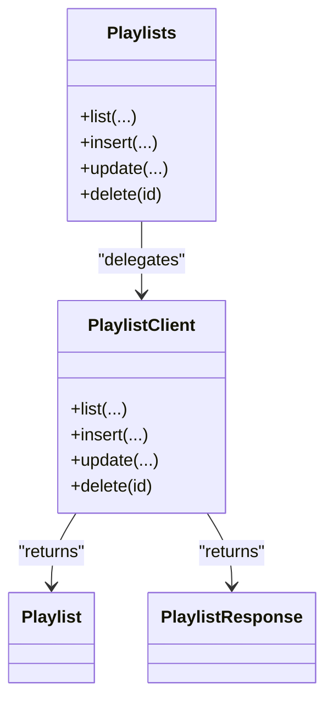
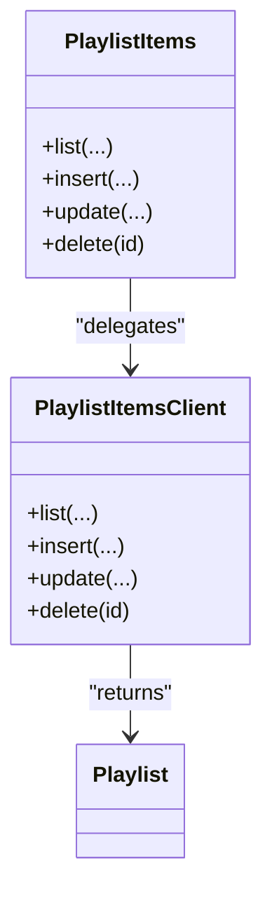
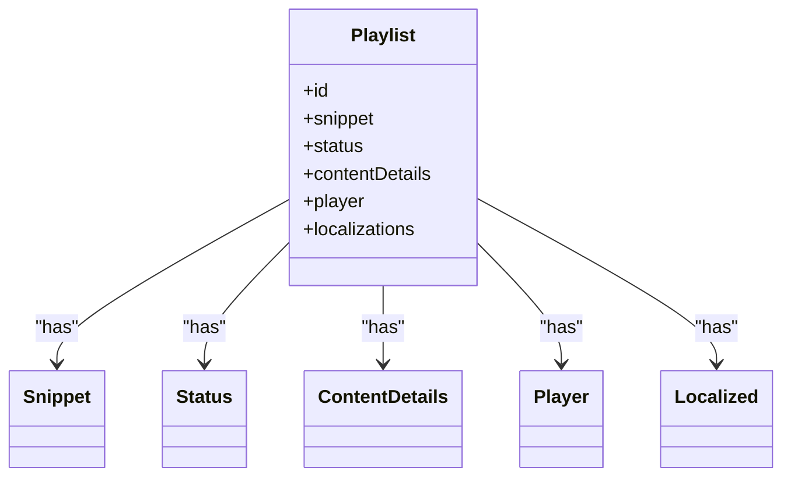
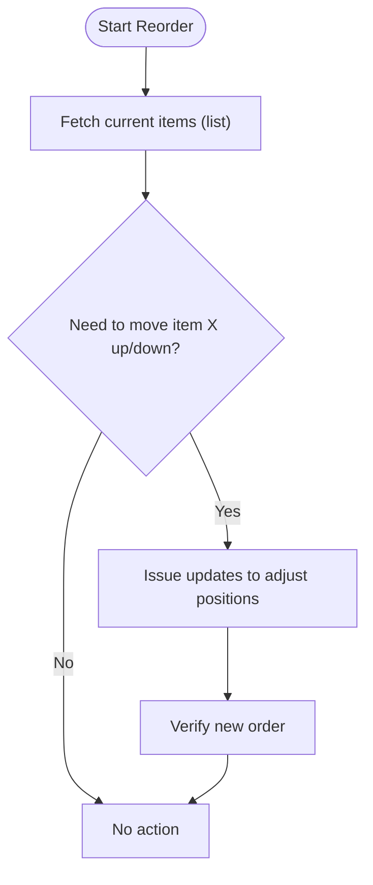
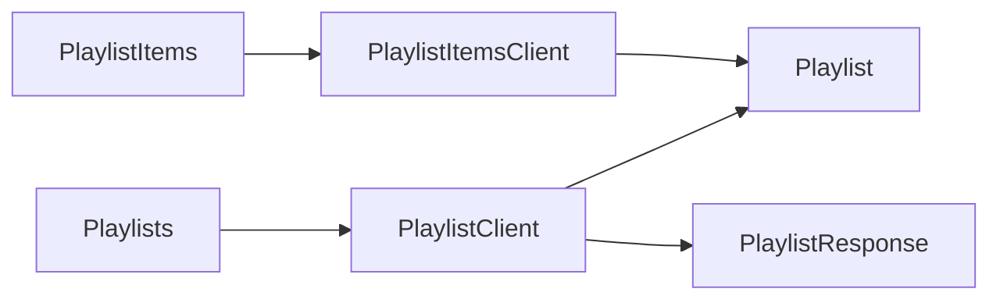

# Playlist Operations

<cite>
**Referenced Files in This Document**
- [README.md](file://README.md)
- [pubspec.yaml](file://pubspec.yaml)
- [playlists.dart](file://packages/yt/lib/src/playlists.dart)
- [playlist_items.dart](file://packages/yt/lib/src/playlist_items.dart)
- [playlists.g.dart](file://packages/yt/lib/src/provider/data/playlists.g.dart)
- [playlist_items.g.dart](file://packages/yt/lib/src/provider/data/playlist_items.g.dart)
- [playlist.dart](file://packages/yt/lib/src/model/playlist/playlist.dart)
- [playlist_response.dart](file://packages/yt/lib/src/model/playlist/playlist_response.dart)
- [localized.dart](file://packages/yt/lib/src/model/localized.dart)
</cite>

## Table of Contents
1. [Introduction](#introduction)
2. [Project Structure](#project-structure)
3. [Core Components](#core-components)
4. [Architecture Overview](#architecture-overview)
5. [Detailed Component Analysis](#detailed-component-analysis)
6. [Dependency Analysis](#dependency-analysis)
7. [Performance Considerations](#performance-considerations)
8. [Troubleshooting Guide](#troubleshooting-guide)
9. [Conclusion](#conclusion)
10. [Appendices](#appendices)

## Introduction
This document describes playlist management operations exposed by the yt package. It covers playlist CRUD operations (create, read, update, delete), playlist item management (listing, inserting, updating, deleting), and how metadata such as title, description, privacy, and scheduling are handled via the underlying YouTube Data API resources. It also outlines item positioning strategies, bulk operations, deduplication considerations, performance optimization, and migration strategies grounded in the repository’s implementation.

## Project Structure
The playlist functionality is implemented in the yt package and organized into:
- Public API surface: high-level classes that expose playlist and playlist item operations
- Provider layer: generated Retrofit clients that compose HTTP requests to the YouTube Data API
- Model layer: strongly typed models representing playlist resources and responses

**Diagram sources**
- [playlists.dart:15-89](file://packages/yt/lib/src/playlists.dart#L15-L89)
- [playlist_items.dart:6-71](file://packages/yt/lib/src/playlist_items.dart#L6-L71)
- [playlists.g.dart:13-229](file://packages/yt/lib/src/provider/data/playlists.g.dart#L13-L229)
- [playlist_items.g.dart:13-223](file://packages/yt/lib/src/provider/data/playlist_items.g.dart#L13-L223)
- [playlist.dart:27-60](file://packages/yt/lib/src/model/playlist/playlist.dart#L27-L60)
- [playlist_response.dart:11-35](file://packages/yt/lib/src/model/playlist/playlist_response.dart#L11-L35)
- [localized.dart:7-25](file://packages/yt/lib/src/model/localized.dart#L7-L25)

**Section sources**
- [README.md:1-119](file://README.md#L1-L119)
- [pubspec.yaml:1-69](file://pubspec.yaml#L1-L69)

## Core Components
- Playlists: high-level API for listing, creating, updating, and deleting playlists
- PlaylistItems: high-level API for listing, inserting, updating, and deleting playlist items
- PlaylistClient and PlaylistItemsClient: generated provider clients that perform HTTP requests against the YouTube Data API
- Playlist and PlaylistResponse: models for playlist resources and paginated responses
- Localized: model for localized metadata

Key capabilities:
- Playlist CRUD: list, insert, update, delete
- Playlist item CRUD: list, insert, update, delete
- Metadata operations: title/description via snippet, privacy via status, localization via localizations
- Positioning and ordering: playlist item ordering is controlled by the order of items returned by list and insertion semantics per API

**Section sources**
- [playlists.dart:15-89](file://packages/yt/lib/src/playlists.dart#L15-L89)
- [playlist_items.dart:6-71](file://packages/yt/lib/src/playlist_items.dart#L6-L71)
- [playlists.g.dart:24-198](file://packages/yt/lib/src/provider/data/playlists.g.dart#L24-L198)
- [playlist_items.g.dart:24-192](file://packages/yt/lib/src/provider/data/playlist_items.g.dart#L24-L192)
- [playlist.dart:27-60](file://packages/yt/lib/src/model/playlist/playlist.dart#L27-L60)
- [playlist_response.dart:11-35](file://packages/yt/lib/src/model/playlist/playlist_response.dart#L11-L35)
- [localized.dart:7-25](file://packages/yt/lib/src/model/localized.dart#L7-L25)

## Architecture Overview
The architecture follows a layered pattern:
- Public API classes delegate to provider clients
- Provider clients construct HTTP requests and parse JSON responses into models
- Models encapsulate playlist resource shapes and response containers

**Diagram sources**
- [playlists.dart:23-46](file://packages/yt/lib/src/playlists.dart#L23-L46)
- [playlists.g.dart:25-74](file://packages/yt/lib/src/provider/data/playlists.g.dart#L25-L74)

**Diagram sources**
- [playlist_items.dart:12-34](file://packages/yt/lib/src/playlist_items.dart#L12-L34)
- [playlist_items.g.dart:24-70](file://packages/yt/lib/src/provider/data/playlist_items.g.dart#L24-L70)

## Detailed Component Analysis

### Playlist CRUD Operations
- List playlists: supports filtering by channelId, id, mine, pagination, and localization preferences
- Insert playlist: creates a new playlist with provided metadata and status
- Update playlist: modifies existing playlist metadata and status
- Delete playlist: removes a playlist by ID

**Diagram sources**
- [playlists.dart:15-89](file://packages/yt/lib/src/playlists.dart#L15-L89)
- [playlists.g.dart:13-198](file://packages/yt/lib/src/provider/data/playlists.g.dart#L13-L198)
- [playlist.dart:27-60](file://packages/yt/lib/src/model/playlist/playlist.dart#L27-L60)
- [playlist_response.dart:11-35](file://packages/yt/lib/src/model/playlist/playlist_response.dart#L11-L35)

**Section sources**
- [playlists.dart:23-87](file://packages/yt/lib/src/playlists.dart#L23-L87)
- [playlists.g.dart:25-198](file://packages/yt/lib/src/provider/data/playlists.g.dart#L25-L198)
- [playlist.dart:27-60](file://packages/yt/lib/src/model/playlist/playlist.dart#L27-L60)
- [playlist_response.dart:11-35](file://packages/yt/lib/src/model/playlist/playlist_response.dart#L11-L35)

### Playlist Item Management
- List items: filter by playlistId, item id, or videoId; supports pagination
- Insert item: adds a video to a playlist; ordering depends on API behavior
- Update item: can adjust position/order within a playlist
- Delete item: removes a specific playlist item

**Diagram sources**
- [playlist_items.dart:6-71](file://packages/yt/lib/src/playlist_items.dart#L6-L71)
- [playlist_items.g.dart:13-192](file://packages/yt/lib/src/provider/data/playlist_items.g.dart#L13-L192)
- [playlist.dart:27-60](file://packages/yt/lib/src/model/playlist/playlist.dart#L27-L60)

**Section sources**
- [playlist_items.dart:12-70](file://packages/yt/lib/src/playlist_items.dart#L12-L70)
- [playlist_items.g.dart:24-192](file://packages/yt/lib/src/provider/data/playlist_items.g.dart#L24-L192)
- [playlist.dart:27-60](file://packages/yt/lib/src/model/playlist/playlist.dart#L27-L60)

### Metadata Operations
- Title and description: managed via the snippet object
- Privacy settings: managed via the status object
- Localization: managed via the localizations object
- Player embed info: managed via the player object
- Content details: managed via the contentDetails object

**Diagram sources**
- [playlist.dart:27-60](file://packages/yt/lib/src/model/playlist/playlist.dart#L27-L60)
- [localized.dart:7-25](file://packages/yt/lib/src/model/localized.dart#L7-L25)

**Section sources**
- [playlist.dart:27-60](file://packages/yt/lib/src/model/playlist/playlist.dart#L27-L60)
- [localized.dart:7-25](file://packages/yt/lib/src/model/localized.dart#L7-L25)

### Positioning Strategies and Ordering
- Playlist item ordering is determined by the order of items returned by list and the insertion behavior of the API
- To reorder items, update items to adjust positions; the provider exposes update for playlist items
- Bulk reordering requires multiple update calls; batching is not provided by the client

**Diagram sources**
- [playlist_items.g.dart:24-70](file://packages/yt/lib/src/provider/data/playlist_items.g.dart#L24-L70)
- [playlist_items.g.dart:119-164](file://packages/yt/lib/src/provider/data/playlist_items.g.dart#L119-L164)

**Section sources**
- [playlist_items.g.dart:24-70](file://packages/yt/lib/src/provider/data/playlist_items.g.dart#L24-L70)
- [playlist_items.g.dart:119-164](file://packages/yt/lib/src/provider/data/playlist_items.g.dart#L119-L164)

### Automatic Playlist Generation
- The repository does not implement automatic playlist generation logic
- Users can programmatically create playlists and add items via list/insert/update/delete operations

**Section sources**
- [playlists.dart:48-87](file://packages/yt/lib/src/playlists.dart#L48-L87)
- [playlist_items.dart:12-70](file://packages/yt/lib/src/playlist_items.dart#L12-L70)

### Analytics
- The repository does not expose analytics-specific endpoints
- Analytics are typically accessed via separate reporting APIs or dashboards outside this client

**Section sources**
- [README.md:55-71](file://README.md#L55-L71)

### Practical Examples

- Create a playlist
  - Use Playlists.insert with a body containing snippet and status fields
  - Reference: [playlists.dart:48-62](file://packages/yt/lib/src/playlists.dart#L48-L62), [playlists.g.dart:77-123](file://packages/yt/lib/src/provider/data/playlists.g.dart#L77-L123)

- Update playlist metadata (title/description/privacy)
  - Use Playlists.update with snippet/status parts
  - Reference: [playlists.dart:64-78](file://packages/yt/lib/src/playlists.dart#L64-L78), [playlists.g.dart:125-170](file://packages/yt/lib/src/provider/data/playlists.g.dart#L125-L170)

- Add a single item to a playlist
  - Use PlaylistItems.insert with a body referencing the target playlist and video
  - Reference: [playlist_items.dart:36-44](file://packages/yt/lib/src/playlist_items.dart#L36-L44), [playlist_items.g.dart:72-117](file://packages/yt/lib/src/provider/data/playlist_items.g.dart#L72-L117)

- Remove an item from a playlist
  - Use PlaylistItems.delete with the item id
  - Reference: [playlist_items.dart:62-70](file://packages/yt/lib/src/playlist_items.dart#L62-L70), [playlist_items.g.dart:166-192](file://packages/yt/lib/src/provider/data/playlist_items.g.dart#L166-L192)

- Bulk item additions
  - Issue multiple PlaylistItems.insert calls; batching is not provided
  - Reference: [playlist_items.g.dart:72-117](file://packages/yt/lib/src/provider/data/playlist_items.g.dart#L72-L117)

- Organize items by reordering
  - Use PlaylistItems.update to adjust positions; rely on list ordering
  - Reference: [playlist_items.g.dart:119-164](file://packages/yt/lib/src/provider/data/playlist_items.g.dart#L119-L164)

- Sharing configuration
  - Configure privacy via status; the snippet determines visibility
  - Reference: [playlist.dart:27-60](file://packages/yt/lib/src/model/playlist/playlist.dart#L27-L60)

- Scheduling
  - The repository does not expose scheduling-specific fields for playlists
  - Use external scheduling tools or manage playlist visibility via status

**Section sources**
- [playlists.dart:48-87](file://packages/yt/lib/src/playlists.dart#L48-L87)
- [playlist_items.dart:36-70](file://packages/yt/lib/src/playlist_items.dart#L36-L70)
- [playlists.g.dart:77-170](file://packages/yt/lib/src/provider/data/playlists.g.dart#L77-L170)
- [playlist_items.g.dart:72-192](file://packages/yt/lib/src/provider/data/playlist_items.g.dart#L72-L192)
- [playlist.dart:27-60](file://packages/yt/lib/src/model/playlist/playlist.dart#L27-L60)

## Dependency Analysis
- Playlists depends on PlaylistClient
- PlaylistItems depends on PlaylistItemsClient
- Provider clients depend on the YouTube Data API base URL and compose request options
- Models are generated and parsed from JSON responses

**Diagram sources**
- [playlists.dart:15-89](file://packages/yt/lib/src/playlists.dart#L15-L89)
- [playlist_items.dart:6-71](file://packages/yt/lib/src/playlist_items.dart#L6-L71)
- [playlists.g.dart:13-198](file://packages/yt/lib/src/provider/data/playlists.g.dart#L13-L198)
- [playlist_items.g.dart:13-192](file://packages/yt/lib/src/provider/data/playlist_items.g.dart#L13-L192)
- [playlist.dart:27-60](file://packages/yt/lib/src/model/playlist/playlist.dart#L27-L60)
- [playlist_response.dart:11-35](file://packages/yt/lib/src/model/playlist/playlist_response.dart#L11-L35)

**Section sources**
- [playlists.dart:15-89](file://packages/yt/lib/src/playlists.dart#L15-L89)
- [playlist_items.dart:6-71](file://packages/yt/lib/src/playlist_items.dart#L6-L71)
- [playlists.g.dart:13-198](file://packages/yt/lib/src/provider/data/playlists.g.dart#L13-L198)
- [playlist_items.g.dart:13-192](file://packages/yt/lib/src/provider/data/playlist_items.g.dart#L13-L192)

## Performance Considerations
- Pagination: Use maxResults and pageToken to limit response sizes when listing playlists or items
- Parts selection: Request only the parts you need to reduce payload size
- Batch operations: There is no built-in batching; batch via multiple requests in parallel where appropriate
- Deduplication: The client does not enforce deduplication; implement de-dup logic at the application level before insert
- Network efficiency: Reuse tokens and minimize redundant list calls

[No sources needed since this section provides general guidance]

## Troubleshooting Guide
- Authentication and API key: Ensure apiKey and credentials are configured; provider composes requests with key and accept headers
- Error logging: Provider clients support optional error logging for failed requests
- Response parsing: Generated models handle JSON serialization/deserialization; failures are surfaced via exceptions

**Section sources**
- [playlists.g.dart:38-74](file://packages/yt/lib/src/provider/data/playlists.g.dart#L38-L74)
- [playlist_items.g.dart:36-70](file://packages/yt/lib/src/provider/data/playlist_items.g.dart#L36-L70)
- [playlists.g.dart:115-122](file://packages/yt/lib/src/provider/data/playlists.g.dart#L115-L122)
- [playlist_items.g.dart:111-117](file://packages/yt/lib/src/provider/data/playlist_items.g.dart#L111-L117)

## Conclusion
The yt package provides a clear, layered API for playlist and playlist item management aligned with the YouTube Data API. While advanced features like automatic playlist generation, analytics, and scheduling are not included here, the core CRUD and metadata operations are well-defined. Application-level logic can implement bulk operations, deduplication, and reordering strategies using the exposed primitives.

[No sources needed since this section summarizes without analyzing specific files]

## Appendices

### API Surface Summary
- Playlists.list: filter by channelId, id, mine; paginate with pageToken
- Playlists.insert: create playlist with snippet and status
- Playlists.update: modify snippet/status
- Playlists.delete: remove by id
- PlaylistItems.list: filter by playlistId, id, videoId; paginate
- PlaylistItems.insert: add video to playlist
- PlaylistItems.update: adjust item position/order
- PlaylistItems.delete: remove item by id

**Section sources**
- [playlists.dart:23-87](file://packages/yt/lib/src/playlists.dart#L23-L87)
- [playlist_items.dart:12-70](file://packages/yt/lib/src/playlist_items.dart#L12-L70)
- [playlists.g.dart:25-198](file://packages/yt/lib/src/provider/data/playlists.g.dart#L25-L198)
- [playlist_items.g.dart:24-192](file://packages/yt/lib/src/provider/data/playlist_items.g.dart#L24-L192)