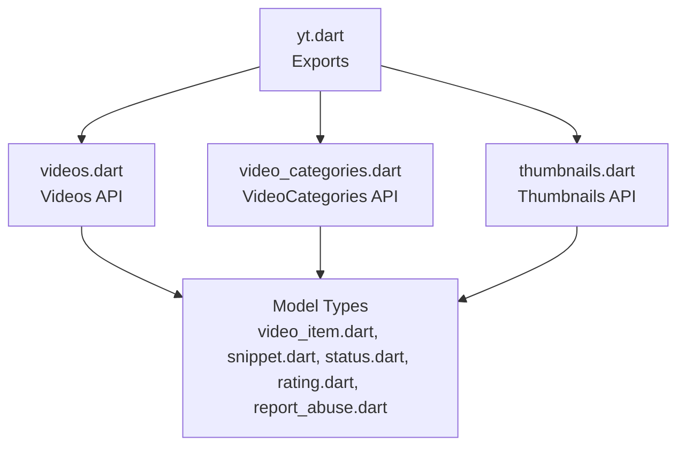
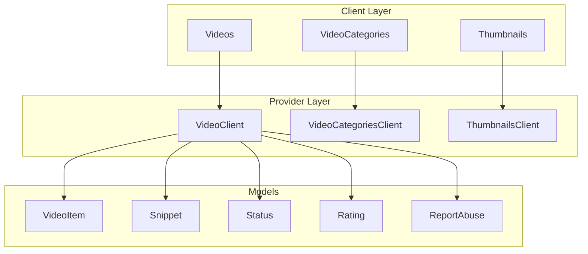
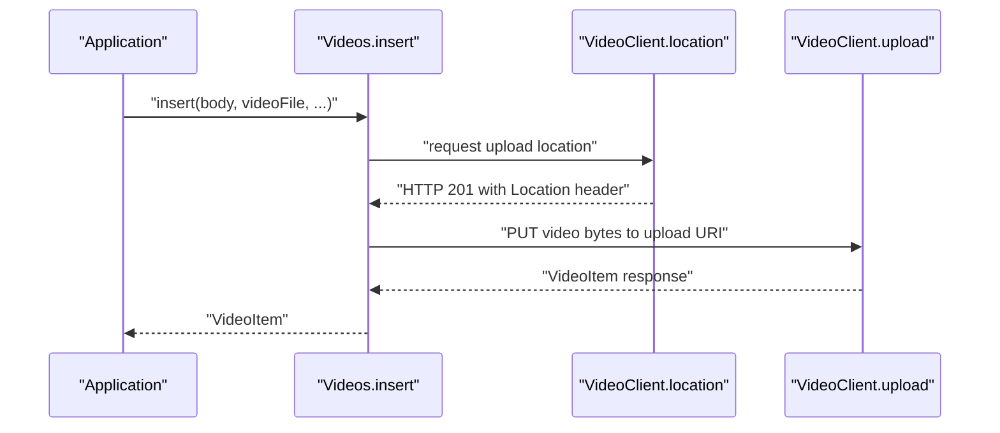
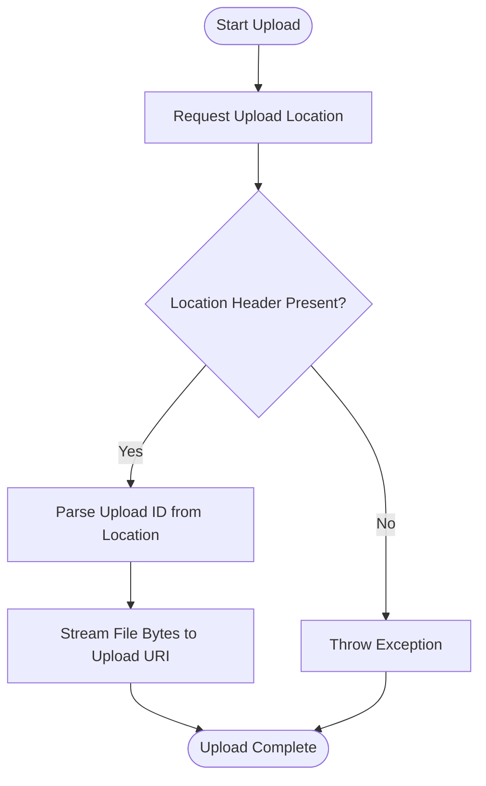
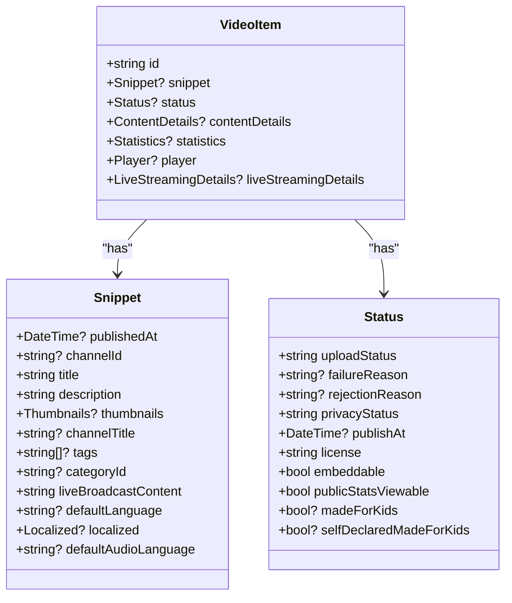
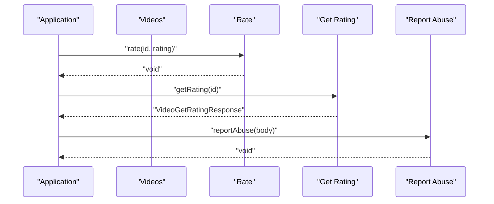
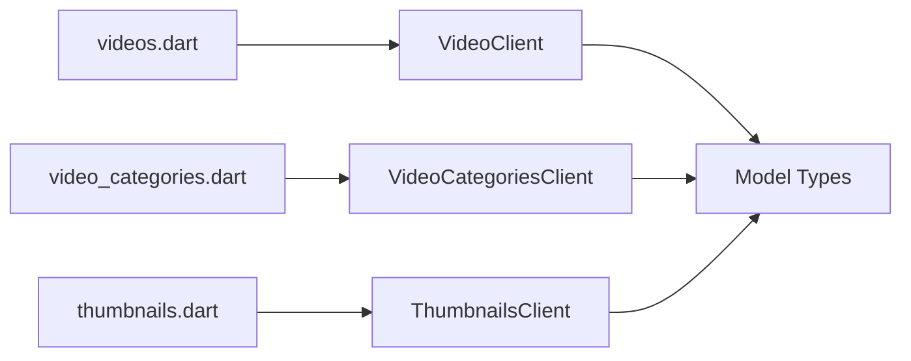

# Video Operations

<cite>
**Referenced Files in This Document**
- [README.md](file://packages/yt/README.md)
- [yt.dart](file://packages/yt/lib/yt.dart)
- [videos.dart](file://packages/yt/lib/src/videos.dart)
- [video_categories.dart](file://packages/yt/lib/src/video_categories.dart)
- [thumbnails.dart](file://packages/yt/lib/src/thumbnails.dart)
- [video_item.dart](file://packages/yt/lib/src/model/videos/video_item.dart)
- [snippet.dart](file://packages/yt/lib/src/model/videos/snippet.dart)
- [status.dart](file://packages/yt/lib/src/model/videos/status.dart)
- [rating.dart](file://packages/yt/lib/src/model/videos/rating.dart)
- [report_abuse.dart](file://packages/yt/lib/src/model/videos/report_abuse.dart)
</cite>

## Table of Contents
1. [Introduction](#introduction)
2. [Project Structure](#project-structure)
3. [Core Components](#core-components)
4. [Architecture Overview](#architecture-overview)
5. [Detailed Component Analysis](#detailed-component-analysis)
6. [Dependency Analysis](#dependency-analysis)
7. [Performance Considerations](#performance-considerations)
8. [Troubleshooting Guide](#troubleshooting-guide)
9. [Conclusion](#conclusion)

## Introduction
This document explains comprehensive video operations management using the yt core library. It covers:
- Video CRUD operations: upload, metadata management, privacy controls, deletion
- Resumable uploads with progress tracking, multipart handling, and file validation
- Metadata operations: snippet updates, status changes, content details, category assignments
- Ratings and abuse reporting
- Bulk operations and lifecycle management
- Optimization techniques, thumbnail management, and content ownership considerations

The content is grounded in the repository’s source files and provides practical guidance for building robust video workflows.

## Project Structure
The yt package exposes a cohesive API surface for YouTube Data and Live Streaming operations. For video operations, the relevant modules are:
- Videos API client for listing, inserting, updating, rating, getting ratings, reporting abuse, and deleting videos
- Video Categories API client for retrieving available categories
- Thumbnails API client for setting thumbnails via resumable uploads
- Strongly typed models for VideoItem, Snippet, Status, Rating, and Abuse reports

**Diagram sources**
- [yt.dart:11-66](file://packages/yt/lib/yt.dart#L11-L66)
- [videos.dart:8-135](file://packages/yt/lib/src/videos.dart#L8-L135)
- [video_categories.dart:7-31](file://packages/yt/lib/src/video_categories.dart#L7-L31)
- [thumbnails.dart:16-53](file://packages/yt/lib/src/thumbnails.dart#L16-L53)
- [video_item.dart:15-62](file://packages/yt/lib/src/model/videos/video_item.dart#L15-L62)
- [snippet.dart:10-87](file://packages/yt/lib/src/model/videos/snippet.dart#L10-L87)
- [status.dart:7-40](file://packages/yt/lib/src/model/videos/status.dart#L7-L40)
- [rating.dart:7-21](file://packages/yt/lib/src/model/videos/rating.dart#L7-L21)
- [report_abuse.dart:7-41](file://packages/yt/lib/src/model/videos/report_abuse.dart#L7-L41)

**Section sources**
- [yt.dart:11-66](file://packages/yt/lib/yt.dart#L11-L66)

## Core Components
- Videos: Provides list, insert (resumable), update, rate, getRating, reportAbuse, and delete operations
- VideoCategories: Lists available categories for a region
- Thumbnails: Sets thumbnails via resumable upload
- Models: VideoItem, Snippet, Status, Rating, ReportAbuse

These components collectively enable end-to-end video lifecycle management with strong typing and clear separation of concerns.

**Section sources**
- [videos.dart:8-135](file://packages/yt/lib/src/videos.dart#L8-L135)
- [video_categories.dart:7-31](file://packages/yt/lib/src/video_categories.dart#L7-L31)
- [thumbnails.dart:16-53](file://packages/yt/lib/src/thumbnails.dart#L16-L53)
- [video_item.dart:15-62](file://packages/yt/lib/src/model/videos/video_item.dart#L15-L62)
- [snippet.dart:10-87](file://packages/yt/lib/src/model/videos/snippet.dart#L10-L87)
- [status.dart:7-40](file://packages/yt/lib/src/model/videos/status.dart#L7-L40)
- [rating.dart:7-21](file://packages/yt/lib/src/model/videos/rating.dart#L7-L21)
- [report_abuse.dart:7-41](file://packages/yt/lib/src/model/videos/report_abuse.dart#L7-L41)

## Architecture Overview
The video operation stack follows a layered pattern:
- Client modules (Videos, VideoCategories, Thumbnails) delegate to underlying REST clients
- Request builders handle parts, upload types, and headers
- Strongly typed models encapsulate response structures
- Authentication and interceptors are configured at the top-level Yt client

**Diagram sources**
- [videos.dart:8-135](file://packages/yt/lib/src/videos.dart#L8-L135)
- [video_categories.dart:7-31](file://packages/yt/lib/src/video_categories.dart#L7-L31)
- [thumbnails.dart:16-53](file://packages/yt/lib/src/thumbnails.dart#L16-L53)
- [video_item.dart:15-62](file://packages/yt/lib/src/model/videos/video_item.dart#L15-L62)
- [snippet.dart:10-87](file://packages/yt/lib/src/model/videos/snippet.dart#L10-L87)
- [status.dart:7-40](file://packages/yt/lib/src/model/videos/status.dart#L7-L40)
- [rating.dart:7-21](file://packages/yt/lib/src/model/videos/rating.dart#L7-L21)
- [report_abuse.dart:7-41](file://packages/yt/lib/src/model/videos/report_abuse.dart#L7-L41)

## Detailed Component Analysis

### Video CRUD Operations
- Insert (Upload): Initiates a resumable upload, obtains an upload location, and completes the upload with the video file and metadata body
- Update: Patches video metadata (snippet, status, contentDetails) using the provided body
- Delete: Removes a video by ID
- List: Retrieves videos with configurable parts and filters
- Rate and Get Rating: Applies or retrieves user ratings
- Report Abuse: Submits abuse reports with structured reasons

**Diagram sources**
- [videos.dart:44-83](file://packages/yt/lib/src/videos.dart#L44-L83)

Practical examples (paths only):
- [Upload a Video:177-204](file://packages/yt/README.md#L177-L204)

Privacy controls:
- Privacy status is part of the Status model and can be set during insert/update
- Embeddable flag and license are also part of Status

**Section sources**
- [videos.dart:44-135](file://packages/yt/lib/src/videos.dart#L44-L135)
- [status.dart:7-40](file://packages/yt/lib/src/model/videos/status.dart#L7-L40)
- [README.md:177-204](file://packages/yt/README.md#L177-L204)

### Resumable Uploads and Progress Tracking
- Resumable upload flow is implemented for both videos and thumbnails
- The client requests an upload location, extracts the upload ID from the Location header, and streams the file to the returned URI
- Progress tracking is not exposed in the current API; implement at the application layer by monitoring upload bytes sent

**Diagram sources**
- [videos.dart:54-83](file://packages/yt/lib/src/videos.dart#L54-L83)
- [thumbnails.dart:26-51](file://packages/yt/lib/src/thumbnails.dart#L26-L51)

### Multipart Upload Handling and File Validation
- Multipart boundary and content-type are managed by the underlying provider layer
- File validation is not performed in the client; ensure file types and sizes align with YouTube requirements before invoking upload
- For thumbnails, resumable upload is used; for videos, the resumable flow is used

**Section sources**
- [videos.dart:54-83](file://packages/yt/lib/src/videos.dart#L54-L83)
- [thumbnails.dart:26-51](file://packages/yt/lib/src/thumbnails.dart#L26-L51)

### Video Metadata Operations
- Snippet updates: Title, description, tags, categoryId, liveBroadcastContent, defaultLanguage, defaultAudioLanguage
- Status updates: privacyStatus, embeddable, license, publishAt, madeForKids flags
- Content details and statistics are available via list operations
- Category assignment: Use VideoCategories.list to fetch valid categories and set categoryId in Snippet

**Diagram sources**
- [video_item.dart:15-62](file://packages/yt/lib/src/model/videos/video_item.dart#L15-L62)
- [snippet.dart:10-87](file://packages/yt/lib/src/model/videos/snippet.dart#L10-L87)
- [status.dart:7-40](file://packages/yt/lib/src/model/videos/status.dart#L7-L40)

Practical examples (paths only):
- [Upload a Video:177-204](file://packages/yt/README.md#L177-L204)

### Video Categories and Assignments
- Retrieve categories with VideoCategories.list specifying region and language
- Assign a categoryId to Snippet when inserting or updating a video

**Section sources**
- [video_categories.dart:14-29](file://packages/yt/lib/src/video_categories.dart#L14-L29)
- [snippet.dart:41-42](file://packages/yt/lib/src/model/videos/snippet.dart#L41-L42)

### Ratings and Abuse Reporting
- Ratings: Use rate(id, rating) to like/dislike/remove rating; getRating(id) to retrieve user ratings
- Abuse reporting: Construct ReportAbuse and call reportAbuse with reasonId and optional secondary reason and comments

**Diagram sources**
- [videos.dart:94-121](file://packages/yt/lib/src/videos.dart#L94-L121)
- [rating.dart:7-21](file://packages/yt/lib/src/model/videos/rating.dart#L7-L21)
- [report_abuse.dart:7-41](file://packages/yt/lib/src/model/videos/report_abuse.dart#L7-L41)

### Thumbnail Management
- Use Thumbnails.set(videoId, thumbnailFile) to initiate a resumable thumbnail upload
- The client obtains an upload location, parses the upload_id, and uploads the thumbnail image

**Section sources**
- [thumbnails.dart:21-51](file://packages/yt/lib/src/thumbnails.dart#L21-L51)

### Bulk Video Operations
- The library exposes individual operations per video (insert, update, delete, rate, reportAbuse)
- For bulk operations, orchestrate multiple calls in your application layer (e.g., loop over a list of video IDs)
- Use list operations to discover target videos and apply updates or deletions accordingly

**Section sources**
- [videos.dart:14-42](file://packages/yt/lib/src/videos.dart#L14-L42)
- [videos.dart:85-133](file://packages/yt/lib/src/videos.dart#L85-L133)

### Video Lifecycle Management
- Creation: insert with snippet and status
- Metadata updates: update with snippet/status/contentDetails
- Visibility changes: update status.privacyStatus
- Deletion: delete by id
- Monitoring: list with parts to check processing and status

**Section sources**
- [videos.dart:44-135](file://packages/yt/lib/src/videos.dart#L44-L135)

## Dependency Analysis
- Videos depends on VideoClient for REST operations and uses strongly typed models
- VideoCategories depends on VideoCategoriesClient
- Thumbnails depends on ThumbnailsClient
- All clients operate on the shared HTTP client and interceptor stack configured at the Yt level

**Diagram sources**
- [videos.dart:8-135](file://packages/yt/lib/src/videos.dart#L8-L135)
- [video_categories.dart:7-31](file://packages/yt/lib/src/video_categories.dart#L7-L31)
- [thumbnails.dart:16-53](file://packages/yt/lib/src/thumbnails.dart#L16-L53)

**Section sources**
- [yt.dart:11-66](file://packages/yt/lib/yt.dart#L11-L66)

## Performance Considerations
- Resumable uploads improve reliability for large files; implement retry logic and backoff at the application layer
- Prefer streaming uploads to avoid loading entire files into memory
- Use list with minimal required parts to reduce payload sizes
- Cache category lists locally to minimize repeated network calls
- Monitor network conditions and adjust chunk sizes for uploads

## Troubleshooting Guide
Common issues and resolutions:
- Missing upload location: Ensure the initial upload location request succeeds and contains a Location header
- Invalid upload ID: Verify the upload URI contains the expected upload_id parameter
- Authentication failures: Confirm the Yt client is initialized with proper credentials and scopes
- File validation errors: Align file types and sizes with YouTube requirements before upload
- Permission errors: Verify the onBehalfOfContentOwner parameter if managing content on behalf of a channel

**Section sources**
- [videos.dart:72-74](file://packages/yt/lib/src/videos.dart#L72-L74)
- [thumbnails.dart:30-42](file://packages/yt/lib/src/thumbnails.dart#L30-L42)

## Conclusion
The yt library provides a comprehensive, strongly typed foundation for video operations on YouTube. With resumable uploads, robust metadata management, privacy controls, ratings, abuse reporting, and thumbnail handling, it supports end-to-end video lifecycle management. Extend the provided clients with application-layer features such as progress tracking, bulk orchestration, and caching to meet production needs.