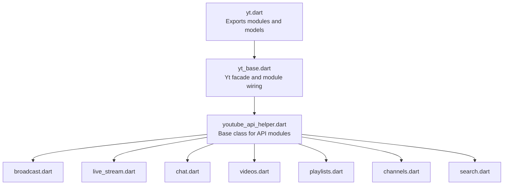
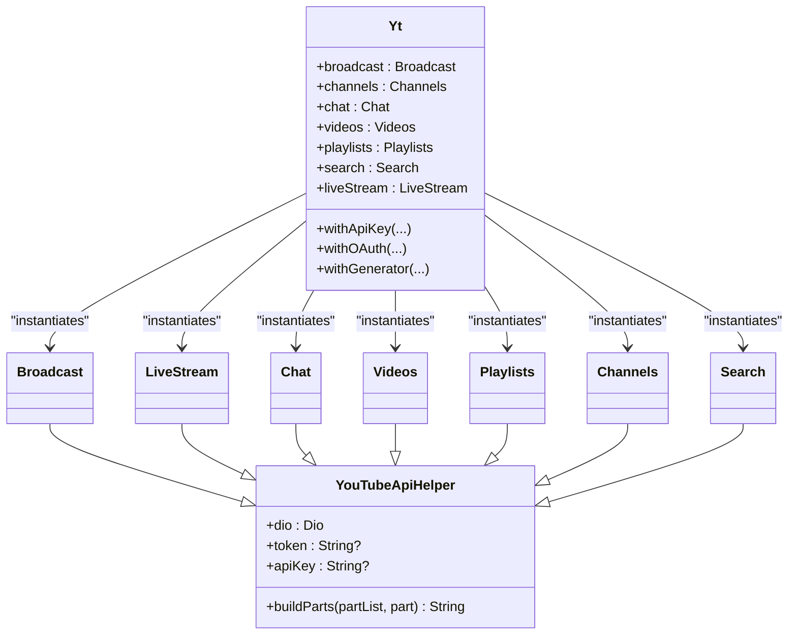
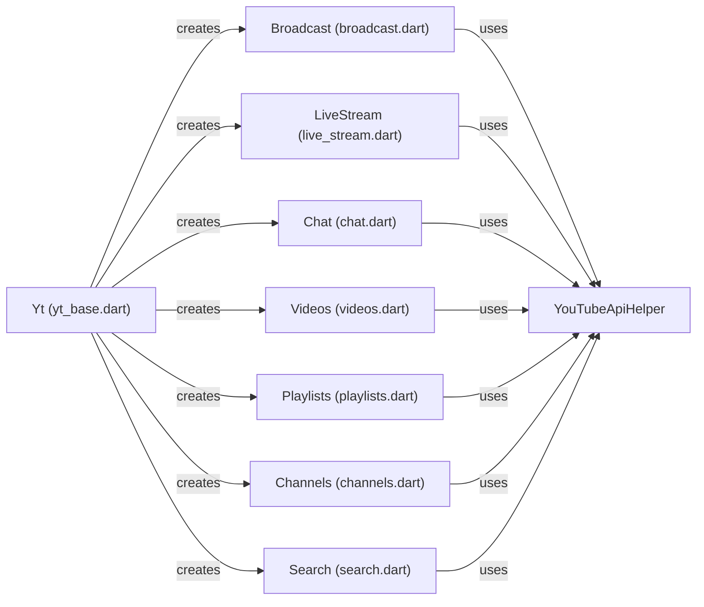

# API Modules Organization

<cite>
**Referenced Files in This Document**
- [README.md](file://README.md)
- [pubspec.yaml](file://pubspec.yaml)
- [yt.dart](file://packages/yt/lib/yt.dart)
- [yt_base.dart](file://packages/yt/lib/src/yt_base.dart)
- [youtube_api_helper.dart](file://packages/yt/lib/src/youtube_api_helper.dart)
- [broadcast.dart](file://packages/yt/lib/src/broadcast.dart)
- [channels.dart](file://packages/yt/lib/src/channels.dart)
- [chat.dart](file://packages/yt/lib/src/chat.dart)
- [videos.dart](file://packages/yt/lib/src/videos.dart)
- [playlists.dart](file://packages/yt/lib/src/playlists.dart)
- [search.dart](file://packages/yt/lib/src/search.dart)
- [live_stream.dart](file://packages/yt/lib/src/live_stream.dart)
</cite>

## Table of Contents
1. [Introduction](#introduction)
2. [Project Structure](#project-structure)
3. [Core Components](#core-components)
4. [Architecture Overview](#architecture-overview)
5. [Detailed Component Analysis](#detailed-component-analysis)
6. [Dependency Analysis](#dependency-analysis)
7. [Performance Considerations](#performance-considerations)
8. [Troubleshooting Guide](#troubleshooting-guide)
9. [Conclusion](#conclusion)

## Introduction
This document explains the modular API structure of the YouTube API Dart SDK. It focuses on how each API module (broadcast, live_stream, chat, videos, playlists, channels, search, and others) is organized as a separate class that extends a shared base class. It documents module responsibilities, public interfaces, and how they interact with the shared HTTP client. It also covers consistency patterns across modules, common error handling approaches, and how to add new modules following the established structure.

## Project Structure
The yt package exposes a cohesive surface area through a central library entry and a set of API modules. The modules are grouped under a single library export and rely on a shared base class and HTTP client.

**Diagram sources**
- [yt.dart:11-66](file://packages/yt/lib/yt.dart#L11-L66)
- [yt_base.dart:19-255](file://packages/yt/lib/src/yt_base.dart#L19-L255)
- [youtube_api_helper.dart:3-29](file://packages/yt/lib/src/youtube_api_helper.dart#L3-L29)
- [broadcast.dart:7](file://packages/yt/lib/src/broadcast.dart#L7)
- [live_stream.dart:7](file://packages/yt/lib/src/live_stream.dart#L7)
- [chat.dart:12](file://packages/yt/lib/src/chat.dart#L12)
- [videos.dart:8](file://packages/yt/lib/src/videos.dart#L8)
- [playlists.dart:15](file://packages/yt/lib/src/playlists.dart#L15)
- [channels.dart:6](file://packages/yt/lib/src/channels.dart#L6)
- [search.dart:7](file://packages/yt/lib/src/search.dart#L7)

**Section sources**
- [yt.dart:11-66](file://packages/yt/lib/yt.dart#L11-L66)
- [pubspec.yaml:1-69](file://pubspec.yaml#L1-L69)
- [README.md:55-71](file://README.md#L55-L71)

## Core Components
- Yt facade: Provides centralized access to API modules and manages authentication and HTTP interceptors. It lazily instantiates modules depending on the chosen authentication method.
- YouTubeApiHelper: Shared base class that encapsulates common HTTP headers, part parameter building, and Dio client injection.
- Module classes: Each module (e.g., Broadcast, LiveStream, Chat, Videos, Playlists, Channels, Search) extends YouTubeApiHelper and delegates HTTP operations to generated provider clients.

Responsibilities and relationships:
- Yt wires up modules and injects a shared Dio instance. It supports API key and OAuth flows and exposes getters for each module.
- YouTubeApiHelper standardizes how modules construct the parts query parameter and pass headers.
- Each module composes a provider client (e.g., BroadcastClient) and forwards requests with consistent parameter handling.

**Section sources**
- [yt_base.dart:9-259](file://packages/yt/lib/src/yt_base.dart#L9-L259)
- [youtube_api_helper.dart:3-29](file://packages/yt/lib/src/youtube_api_helper.dart#L3-L29)

## Architecture Overview
The SDK follows a layered pattern:
- Public API surface: Yt facade and module getters.
- Base abstraction: YouTubeApiHelper for shared behavior.
- Provider clients: Generated clients per module handle HTTP specifics.
- Authentication: OAuth or API key via Yt constructors and interceptors.

**Diagram sources**
- [yt_base.dart:19-255](file://packages/yt/lib/src/yt_base.dart#L19-L255)
- [youtube_api_helper.dart:3-29](file://packages/yt/lib/src/youtube_api_helper.dart#L3-L29)
- [broadcast.dart:7](file://packages/yt/lib/src/broadcast.dart#L7)
- [live_stream.dart:7](file://packages/yt/lib/src/live_stream.dart#L7)
- [chat.dart:12](file://packages/yt/lib/src/chat.dart#L12)
- [videos.dart:8](file://packages/yt/lib/src/videos.dart#L8)
- [playlists.dart:15](file://packages/yt/lib/src/playlists.dart#L15)
- [channels.dart:6](file://packages/yt/lib/src/channels.dart#L6)
- [search.dart:7](file://packages/yt/lib/src/search.dart#L7)

## Detailed Component Analysis

### YouTubeApiHelper
- Purpose: Encapsulates shared HTTP configuration and utilities.
- Key utilities:
  - Headers: accept and contentType constants.
  - buildParts: Merges explicit partList and a part string into a deduplicated, comma-separated list.
- Constructor: Accepts Dio, optional token, and optional apiKey.

Usage pattern:
- All modules pass Dio to the base class and use buildParts to normalize the part parameter for provider clients.

**Section sources**
- [youtube_api_helper.dart:3-29](file://packages/yt/lib/src/youtube_api_helper.dart#L3-L29)

### Yt Facade
- Responsibilities:
  - Initialize logging and interceptors.
  - Provide withApiKey, withOAuth, and withGenerator factories.
  - Wire modules into the Yt instance depending on authentication mode.
- Module availability:
  - Some modules require OAuth and will throw if accessed when using API key authentication.
  - Data modules (e.g., Channels, Playlists, Search) are available with API key.
  - Live modules (e.g., Broadcast, LiveStream, Chat) require OAuth.

Module wiring:
- setModules creates instances of each module with the shared Dio client and appropriate credentials.

**Section sources**
- [yt_base.dart:76-103](file://packages/yt/lib/src/yt_base.dart#L76-L103)
- [yt_base.dart:109-141](file://packages/yt/lib/src/yt_base.dart#L109-L141)
- [yt_base.dart:143-169](file://packages/yt/lib/src/yt_base.dart#L143-L169)
- [yt_base.dart:187-255](file://packages/yt/lib/src/yt_base.dart#L187-L255)

### Broadcast Module
- Responsibilities: Manage YouTube live broadcasts (list, insert, update, transition, bind, delete).
- Public interface highlights:
  - list: Supports filtering by status, type, id, pagination, and ownership.
  - insert/update/transition/bind/delete: CRUD-like operations with consistent part handling.
  - Helper methods: getActiveBroadcast, getUpcomingAndActiveBroadcast.
- Interaction: Delegates to BroadcastClient with built parts and headers.

Consistency patterns:
- Uses buildParts for part parameter normalization.
- Passes accept/content-type headers consistently.
- Methods accept optional onBehalfOfContentOwner and channel parameters where applicable.

**Section sources**
- [broadcast.dart:7](file://packages/yt/lib/src/broadcast.dart#L7)
- [broadcast.dart:12-37](file://packages/yt/lib/src/broadcast.dart#L12-L37)
- [broadcast.dart:39-75](file://packages/yt/lib/src/broadcast.dart#L39-L75)
- [broadcast.dart:77-93](file://packages/yt/lib/src/broadcast.dart#L77-L93)
- [broadcast.dart:95-126](file://packages/yt/lib/src/broadcast.dart#L95-L126)
- [broadcast.dart:128-166](file://packages/yt/lib/src/broadcast.dart#L128-L166)

### LiveStream Module
- Responsibilities: Manage YouTube live video streams (list, insert, update, delete).
- Public interface highlights:
  - list: Filter by id, mine, pagination, and ownership.
  - insert/update/delete: Standardized CRUD operations with part handling.
- Interaction: Delegates to StreamClient with shared headers and parts.

Consistency patterns:
- Same header and part-building patterns as other modules.
- Optional ownership parameters for enterprise scenarios.

**Section sources**
- [live_stream.dart:7](file://packages/yt/lib/src/live_stream.dart#L7)
- [live_stream.dart:12-34](file://packages/yt/lib/src/live_stream.dart#L12-L34)
- [live_stream.dart:36-49](file://packages/yt/lib/src/live_stream.dart#L36-L49)
- [live_stream.dart:51-66](file://packages/yt/lib/src/live_stream.dart#L51-L66)
- [live_stream.dart:68-79](file://packages/yt/lib/src/live_stream.dart#L68-L79)

### Chat Module
- Responsibilities: Retrieve, post, and delete live chat messages; download chat history; integrate with a Chatbot.
- Public interface highlights:
  - list: Fetch messages for a live chat with localization and pagination.
  - insert: Post a message with validation for empty content.
  - delete: Remove a message by id.
  - send: Convenience method to format and send a text message.
  - downloadHistory: Paginates and writes or prints chat history; supports CSV output.
  - answerBot: Integrates with a Chatbot to respond to messages.
- Internal helpers:
  - TimeStore: Persistent timestamp storage for incremental downloads.

Consistency patterns:
- Uses buildParts and standardized headers.
- Validates inputs (e.g., non-empty message text) and throws on invalid conditions.
- Implements robust pagination via nextPageToken.

**Section sources**
- [chat.dart:12](file://packages/yt/lib/src/chat.dart#L12)
- [chat.dart:17-35](file://packages/yt/lib/src/chat.dart#L17-L35)
- [chat.dart:37-65](file://packages/yt/lib/src/chat.dart#L37-L65)
- [chat.dart:67-90](file://packages/yt/lib/src/chat.dart#L67-L90)
- [chat.dart:95-135](file://packages/yt/lib/src/chat.dart#L95-L135)
- [chat.dart:137-182](file://packages/yt/lib/src/chat.dart#L137-L182)
- [chat.dart:184-215](file://packages/yt/lib/src/chat.dart#L184-L215)
- [chat.dart:218-257](file://packages/yt/lib/src/chat.dart#L218-L257)

### Videos Module
- Responsibilities: List videos, upload videos (resumable), update metadata, rate videos, fetch user ratings, report abuse, and delete videos.
- Public interface highlights:
  - list: Filter by chart, id, rating, localization, dimensions, pagination, and category.
  - insert: Resumable upload flow with location retrieval and upload execution.
  - update/rate/getRating/reportAbuse/delete: Standardized operations with consistent headers and parts.
- Interaction: Delegates to VideoClient with shared headers and parts.

Consistency patterns:
- buildParts for part parameter normalization.
- Resumable upload pattern with explicit location retrieval and upload steps.
- Optional ownership parameters for enterprise scenarios.

**Section sources**
- [videos.dart:8](file://packages/yt/lib/src/videos.dart#L8)
- [videos.dart:13-42](file://packages/yt/lib/src/videos.dart#L13-L42)
- [videos.dart:44-83](file://packages/yt/lib/src/videos.dart#L44-L83)
- [videos.dart:85-92](file://packages/yt/lib/src/videos.dart#L85-L92)
- [videos.dart:94-109](file://packages/yt/lib/src/videos.dart#L94-L109)
- [videos.dart:111-121](file://packages/yt/lib/src/videos.dart#L111-L121)
- [videos.dart:123-133](file://packages/yt/lib/src/videos.dart#L123-L133)

### Playlists Module
- Responsibilities: List playlists, create, update, and delete playlists.
- Public interface highlights:
  - list: Filter by channelId, id, mine, pagination, and ownership.
  - insert/update/delete: Standardized CRUD operations with part handling.
- Interaction: Delegates to PlaylistClient with apiKey and shared headers.

Consistency patterns:
- buildParts for part parameter normalization.
- API key usage for data operations.
- Optional ownership parameters for enterprise scenarios.

**Section sources**
- [playlists.dart:15](file://packages/yt/lib/src/playlists.dart#L15)
- [playlists.dart:20-46](file://packages/yt/lib/src/playlists.dart#L20-L46)
- [playlists.dart:48-62](file://packages/yt/lib/src/playlists.dart#L48-L62)
- [playlists.dart:64-78](file://packages/yt/lib/src/playlists.dart#L64-L78)
- [playlists.dart:80-87](file://packages/yt/lib/src/playlists.dart#L80-L87)

### Channels Module
- Responsibilities: List channels and update channel metadata.
- Public interface highlights:
  - list: Filter by categoryId, username, id, ownership flags, localization, pagination.
  - update: Modify channel properties with part handling.
- Interaction: Delegates to ChannelClient with apiKey and shared headers.

Consistency patterns:
- buildParts for part parameter normalization.
- API key usage for data operations.

**Section sources**
- [channels.dart:6](file://packages/yt/lib/src/channels.dart#L6)
- [channels.dart:12-41](file://packages/yt/lib/src/channels.dart#L12-L41)
- [channels.dart:43-56](file://packages/yt/lib/src/channels.dart#L43-L56)

### Search Module
- Responsibilities: Search videos, channels, and playlists with extensive filters.
- Public interface highlights:
  - list: Comprehensive query parameters for type, location, date range, language, safety, and more.
- Interaction: Delegates to SearchClient with apiKey and shared headers.

Consistency patterns:
- buildParts for part parameter normalization.
- API key usage for data operations.

**Section sources**
- [search.dart:7](file://packages/yt/lib/src/search.dart#L7)
- [search.dart:13-79](file://packages/yt/lib/src/search.dart#L13-L79)

## Dependency Analysis
- Module-to-base coupling:
  - All modules depend on YouTubeApiHelper for shared behavior (headers, part building, Dio).
- Yt-to-module coupling:
  - Yt holds optional module instances and constructs them based on authentication mode.
- Provider client coupling:
  - Each module composes a generated provider client (e.g., BroadcastClient, StreamClient, ChatClient) to perform HTTP operations.
- Authentication coupling:
  - OAuth-enabled modules are wired only when OAuth is configured; attempting to access them with API key raises an error.

**Diagram sources**
- [yt_base.dart:187-255](file://packages/yt/lib/src/yt_base.dart#L187-L255)
- [youtube_api_helper.dart:3-29](file://packages/yt/lib/src/youtube_api_helper.dart#L3-L29)
- [broadcast.dart:7](file://packages/yt/lib/src/broadcast.dart#L7)
- [live_stream.dart:7](file://packages/yt/lib/src/live_stream.dart#L7)
- [chat.dart:12](file://packages/yt/lib/src/chat.dart#L12)
- [videos.dart:8](file://packages/yt/lib/src/videos.dart#L8)
- [playlists.dart:15](file://packages/yt/lib/src/playlists.dart#L15)
- [channels.dart:6](file://packages/yt/lib/src/channels.dart#L6)
- [search.dart:7](file://packages/yt/lib/src/search.dart#L7)

**Section sources**
- [yt_base.dart:187-255](file://packages/yt/lib/src/yt_base.dart#L187-L255)

## Performance Considerations
- Pagination: Several modules (Chat, Search, Playlists, LiveStream, Broadcast) support pagination via nextPageToken. Implement efficient loops and early termination when no items are returned.
- Resumable uploads: Videos insert uses a resumable upload flow. Ensure network stability and handle transient failures gracefully.
- Part parameter normalization: Using buildParts avoids redundant parts and reduces query overhead.
- Logging and interceptors: Yt initializes logging and allows adding interceptors for observability and retries.

[No sources needed since this section provides general guidance]

## Troubleshooting Guide
Common issues and resolutions:
- Accessing OAuth-only modules with API key:
  - Symptom: Exception indicating the feature is unavailable when using API key authentication.
  - Resolution: Initialize Yt with OAuth or a token generator instead of API key.
- Empty message validation in Chat:
  - Symptom: Exception thrown when attempting to insert a message with empty content.
  - Resolution: Ensure message text is non-empty before calling insert.
- Upload location retrieval failure:
  - Symptom: Exception when the upload location cannot be determined.
  - Resolution: Verify file size and body parameters; retry the location request.
- No active broadcast found:
  - Symptom: Exception when helper methods cannot locate an active or upcoming broadcast.
  - Resolution: Confirm broadcast status and permissions; adjust filters accordingly.

**Section sources**
- [yt_base.dart:34-74](file://packages/yt/lib/src/yt_base.dart#L34-L74)
- [chat.dart:45-47](file://packages/yt/lib/src/chat.dart#L45-L47)
- [videos.dart:72-74](file://packages/yt/lib/src/videos.dart#L72-L74)
- [broadcast.dart:131-133](file://packages/yt/lib/src/broadcast.dart#L131-L133)

## Conclusion
The YouTube API Dart SDK organizes its functionality into clearly separated modules, each extending a shared base class and delegating HTTP operations to generated provider clients. The Yt facade manages authentication and module instantiation, ensuring consistent behavior across modules. Following the established patterns—shared headers, normalized part parameters, and consistent CRUD-style methods—enables reliable extension and maintenance of the SDK.