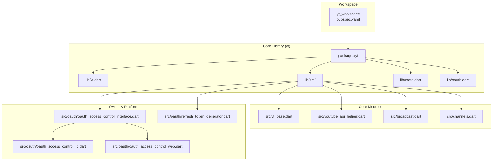
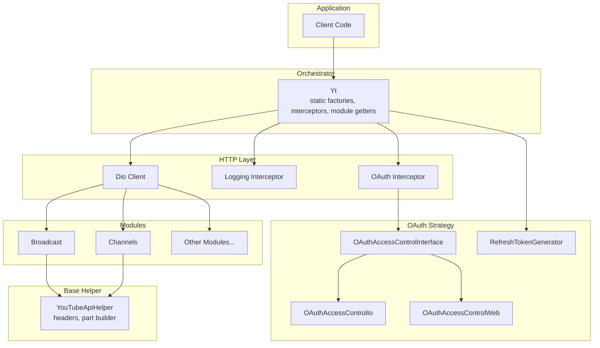
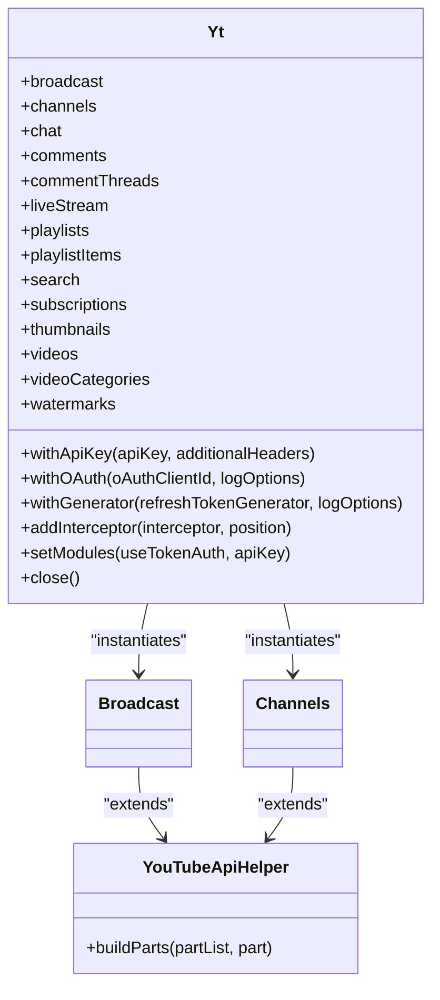
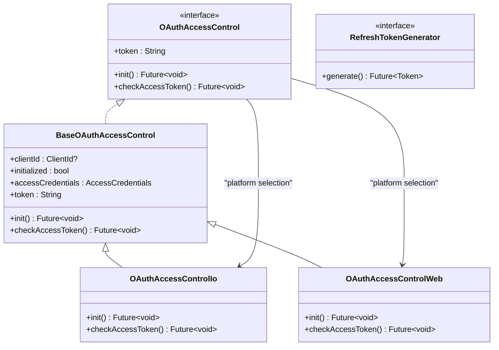
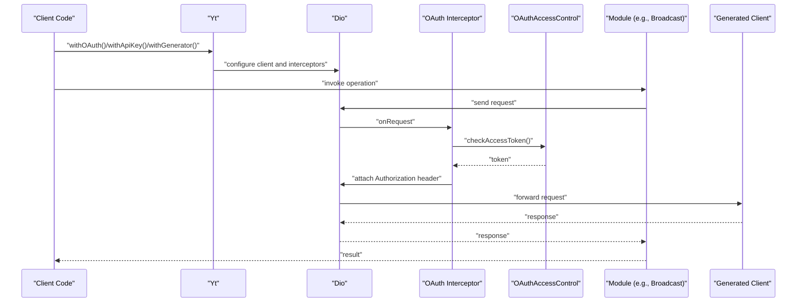
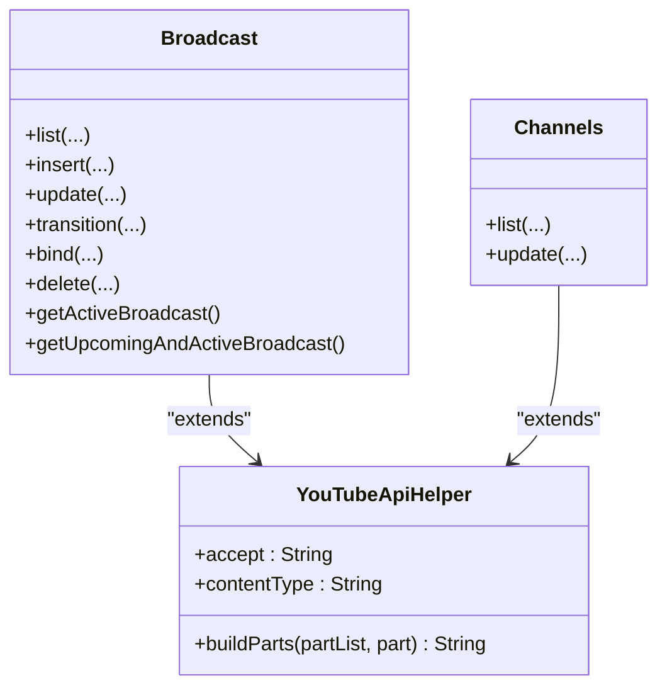
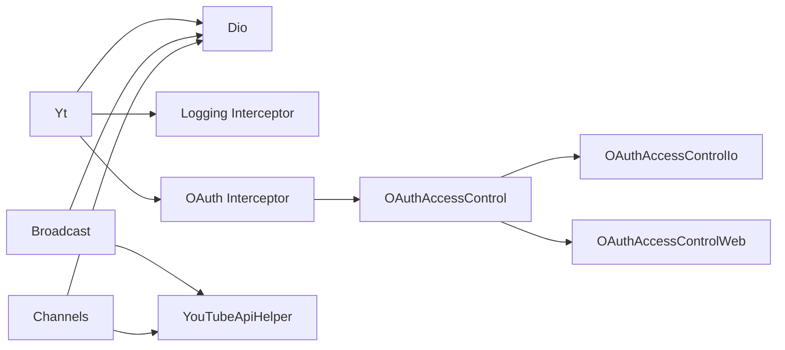

# Core Library Architecture

<cite>
**Referenced Files in This Document**
- [README.md](file://README.md)
- [pubspec.yaml](file://pubspec.yaml)
- [yt.dart](file://packages/yt/lib/yt.dart)
- [meta.dart](file://packages/yt/lib/meta.dart)
- [oauth.dart](file://packages/yt/lib/oauth.dart)
- [yt_base.dart](file://packages/yt/lib/src/yt_base.dart)
- [youtube_api_helper.dart](file://packages/yt/lib/src/youtube_api_helper.dart)
- [broadcast.dart](file://packages/yt/lib/src/broadcast.dart)
- [channels.dart](file://packages/yt/lib/src/channels.dart)
- [oauth_access_control_interface.dart](file://packages/yt/lib/src/oauth/oauth_access_control_interface.dart)
- [oauth_access_control_io.dart](file://packages/yt/lib/src/oauth/oauth_access_control_io.dart)
- [oauth_access_control_web.dart](file://packages/yt/lib/src/oauth/oauth_access_control_web.dart)
- [refresh_token_generator.dart](file://packages/yt/lib/src/oauth/refresh_token_generator.dart)
- [logging_interceptors.dart](file://packages/yt/lib/src/util/logging_interceptors.dart)
</cite>

## Table of Contents
1. [Introduction](#introduction)
2. [Project Structure](#project-structure)
3. [Core Components](#core-components)
4. [Architecture Overview](#architecture-overview)
5. [Detailed Component Analysis](#detailed-component-analysis)
6. [Dependency Analysis](#dependency-analysis)
7. [Performance Considerations](#performance-considerations)
8. [Troubleshooting Guide](#troubleshooting-guide)
9. [Conclusion](#conclusion)

## Introduction
This document describes the architecture of the core YouTube API Dart SDK library. The system centers on the Yt orchestrator class as the main entry point, providing a unified interface to multiple YouTube API modules (Data and Live Streaming). Authentication is handled via interceptors and platform-aware OAuth access control, while HTTP operations are delegated to a shared Dio client. The design leverages a base helper class for common API operations and follows a modular structure for maintainability and extensibility.

## Project Structure
The yt workspace is organized as a multi-package monorepo. The core library resides under packages/yt and exposes a cohesive API surface for YouTube Data and Live Streaming. Supporting packages include CLI, JavaScript bindings, and MCP servers. The core library exports module classes and models, while internal implementation details are organized under src/.

**Diagram sources**
- [pubspec.yaml:17-21](file://pubspec.yaml#L17-L21)
- [yt.dart:11-66](file://packages/yt/lib/yt.dart#L11-L66)
- [yt_base.dart:9-259](file://packages/yt/lib/src/yt_base.dart#L9-L259)
- [youtube_api_helper.dart:1-30](file://packages/yt/lib/src/youtube_api_helper.dart#L1-L30)
- [broadcast.dart:1-168](file://packages/yt/lib/src/broadcast.dart#L1-L168)
- [channels.dart:1-58](file://packages/yt/lib/src/channels.dart#L1-L58)
- [oauth_access_control_interface.dart:1-33](file://packages/yt/lib/src/oauth/oauth_access_control_interface.dart#L1-L33)
- [oauth_access_control_io.dart:1-80](file://packages/yt/lib/src/oauth/oauth_access_control_io.dart#L1-L80)
- [oauth_access_control_web.dart:1-41](file://packages/yt/lib/src/oauth/oauth_access_control_web.dart#L1-L41)
- [refresh_token_generator.dart:1-6](file://packages/yt/lib/src/oauth/refresh_token_generator.dart#L1-L6)

**Section sources**
- [README.md:8-18](file://README.md#L8-L18)
- [pubspec.yaml:17-21](file://pubspec.yaml#L17-L21)
- [yt.dart:11-66](file://packages/yt/lib/yt.dart#L11-L66)

## Core Components
- Yt orchestrator: Provides static factories for initialization (with API key, OAuth, or token generator), manages a shared Dio client, registers interceptors, and lazily instantiates API modules. It enforces capability checks for token-authenticated features and exposes getters for each module.
- YouTubeApiHelper base: Encapsulates common HTTP headers and part parameter building logic used by all API modules.
- Module classes: Specialized clients per YouTube endpoint (e.g., Broadcast, Channels) that delegate to generated provider clients and use the base helper for request construction.
- OAuth access control: Platform-aware strategy for managing tokens across native (IO) and web environments, with a refresh mechanism and credential persistence.
- Interceptors: Centralized logging and authentication interceptors applied to the shared Dio client.

Key implementation patterns:
- Strategy pattern for platform-specific OAuth implementations.
- Factory methods for flexible initialization and authentication modes.
- Shared HTTP client with layered interceptors for cross-cutting concerns.

**Section sources**
- [yt_base.dart:9-259](file://packages/yt/lib/src/yt_base.dart#L9-L259)
- [youtube_api_helper.dart:1-30](file://packages/yt/lib/src/youtube_api_helper.dart#L1-L30)
- [broadcast.dart:1-168](file://packages/yt/lib/src/broadcast.dart#L1-L168)
- [channels.dart:1-58](file://packages/yt/lib/src/channels.dart#L1-L58)
- [oauth_access_control_interface.dart:1-33](file://packages/yt/lib/src/oauth/oauth_access_control_interface.dart#L1-L33)
- [oauth_access_control_io.dart:1-80](file://packages/yt/lib/src/oauth/oauth_access_control_io.dart#L1-L80)
- [oauth_access_control_web.dart:1-41](file://packages/yt/lib/src/oauth/oauth_access_control_web.dart#L1-L41)
- [refresh_token_generator.dart:1-6](file://packages/yt/lib/src/oauth/refresh_token_generator.dart#L1-L6)

## Architecture Overview
The system architecture centers on the Yt orchestrator, which configures a shared Dio client and injects it into module classes. Authentication is enforced via interceptors that obtain and attach tokens using platform-aware OAuth access control. Module classes inherit common HTTP helpers and delegate to generated provider clients.

**Diagram sources**
- [yt_base.dart:9-259](file://packages/yt/lib/src/yt_base.dart#L9-L259)
- [youtube_api_helper.dart:1-30](file://packages/yt/lib/src/youtube_api_helper.dart#L1-L30)
- [broadcast.dart:1-168](file://packages/yt/lib/src/broadcast.dart#L1-L168)
- [channels.dart:1-58](file://packages/yt/lib/src/channels.dart#L1-L58)
- [oauth_access_control_interface.dart:1-33](file://packages/yt/lib/src/oauth/oauth_access_control_interface.dart#L1-L33)
- [oauth_access_control_io.dart:1-80](file://packages/yt/lib/src/oauth/oauth_access_control_io.dart#L1-L80)
- [oauth_access_control_web.dart:1-41](file://packages/yt/lib/src/oauth/oauth_access_control_web.dart#L1-L41)
- [refresh_token_generator.dart:1-6](file://packages/yt/lib/src/oauth/refresh_token_generator.dart#L1-L6)

## Detailed Component Analysis

### Yt Orchestrator
Responsibilities:
- Initialize logging and interceptors.
- Provide factories for API key, OAuth, and token generator modes.
- Manage a shared Dio client and register interceptors.
- Lazily instantiate modules and expose getters with capability checks.
- Close the HTTP client when done.

Design decisions:
- Static Dio instance ensures a single HTTP pipeline across all modules.
- Interceptor registration supports both start and end positions for ordering control.
- Capability checks prevent invoking token-required features with API key mode.

**Diagram sources**
- [yt_base.dart:9-259](file://packages/yt/lib/src/yt_base.dart#L9-L259)
- [youtube_api_helper.dart:1-30](file://packages/yt/lib/src/youtube_api_helper.dart#L1-L30)
- [broadcast.dart:1-168](file://packages/yt/lib/src/broadcast.dart#L1-L168)
- [channels.dart:1-58](file://packages/yt/lib/src/channels.dart#L1-L58)

**Section sources**
- [yt_base.dart:76-259](file://packages/yt/lib/src/yt_base.dart#L76-L259)

### OAuth Access Control Strategy
The OAuth subsystem uses a strategy pattern to select platform-specific implementations:
- Interface defines token access and lifecycle methods.
- IO implementation handles local credential storage and refresh.
- Web implementation obtains credentials via browser APIs.
- RefreshTokenGenerator enables external token provisioning.

**Diagram sources**
- [oauth_access_control_interface.dart:1-33](file://packages/yt/lib/src/oauth/oauth_access_control_interface.dart#L1-L33)
- [oauth_access_control_io.dart:1-80](file://packages/yt/lib/src/oauth/oauth_access_control_io.dart#L1-L80)
- [oauth_access_control_web.dart:1-41](file://packages/yt/lib/src/oauth/oauth_access_control_web.dart#L1-L41)
- [refresh_token_generator.dart:1-6](file://packages/yt/lib/src/oauth/refresh_token_generator.dart#L1-L6)

**Section sources**
- [oauth_access_control_interface.dart:7-33](file://packages/yt/lib/src/oauth/oauth_access_control_interface.dart#L7-L33)
- [oauth_access_control_io.dart:10-80](file://packages/yt/lib/src/oauth/oauth_access_control_io.dart#L10-L80)
- [oauth_access_control_web.dart:6-41](file://packages/yt/lib/src/oauth/oauth_access_control_web.dart#L6-L41)
- [refresh_token_generator.dart:1-6](file://packages/yt/lib/src/oauth/refresh_token_generator.dart#L1-L6)

### HTTP Client and Interceptors
- Logging interceptor is registered by the orchestrator for observability.
- Authentication interceptor attaches Bearer tokens using OAuth access control or a provided token generator.
- All modules share the same Dio client, ensuring consistent headers, timeouts, and retry policies.

**Diagram sources**
- [yt_base.dart:109-141](file://packages/yt/lib/src/yt_base.dart#L109-L141)
- [oauth_access_control_interface.dart:10-16](file://packages/yt/lib/src/oauth/oauth_access_control_interface.dart#L10-L16)
- [oauth_access_control_io.dart:33-78](file://packages/yt/lib/src/oauth/oauth_access_control_io.dart#L33-L78)
- [oauth_access_control_web.dart:14-39](file://packages/yt/lib/src/oauth/oauth_access_control_web.dart#L14-L39)
- [broadcast.dart:12-37](file://packages/yt/lib/src/broadcast.dart#L12-L37)

**Section sources**
- [yt_base.dart:171-185](file://packages/yt/lib/src/yt_base.dart#L171-L185)
- [logging_interceptors.dart](file://packages/yt/lib/src/util/logging_interceptors.dart)

### Module Classes and Generated Providers
Each module extends the base helper and delegates to a generated provider client. The base helper centralizes:
- Accept and content-type headers.
- Part parameter normalization and deduplication.

**Diagram sources**
- [youtube_api_helper.dart:1-30](file://packages/yt/lib/src/youtube_api_helper.dart#L1-L30)
- [broadcast.dart:1-168](file://packages/yt/lib/src/broadcast.dart#L1-L168)
- [channels.dart:1-58](file://packages/yt/lib/src/channels.dart#L1-L58)

**Section sources**
- [youtube_api_helper.dart:14-28](file://packages/yt/lib/src/youtube_api_helper.dart#L14-L28)
- [broadcast.dart:12-166](file://packages/yt/lib/src/broadcast.dart#L12-L166)
- [channels.dart:12-56](file://packages/yt/lib/src/channels.dart#L12-L56)

## Dependency Analysis
High-level dependencies:
- Yt depends on Dio, OAuth access control, and logging utilities.
- Module classes depend on the base helper and generated provider clients.
- OAuth access control selects platform-specific implementations at runtime.
- Interceptors depend on OAuth access control and the shared Dio client.

**Diagram sources**
- [yt_base.dart:9-259](file://packages/yt/lib/src/yt_base.dart#L9-L259)
- [oauth_access_control_interface.dart:1-33](file://packages/yt/lib/src/oauth/oauth_access_control_interface.dart#L1-L33)
- [oauth_access_control_io.dart:1-80](file://packages/yt/lib/src/oauth/oauth_access_control_io.dart#L1-L80)
- [oauth_access_control_web.dart:1-41](file://packages/yt/lib/src/oauth/oauth_access_control_web.dart#L1-L41)
- [broadcast.dart:1-168](file://packages/yt/lib/src/broadcast.dart#L1-L168)
- [channels.dart:1-58](file://packages/yt/lib/src/channels.dart#L1-L58)
- [youtube_api_helper.dart:1-30](file://packages/yt/lib/src/youtube_api_helper.dart#L1-L30)

**Section sources**
- [yt_base.dart:109-141](file://packages/yt/lib/src/yt_base.dart#L109-L141)
- [oauth_access_control_interface.dart:10-16](file://packages/yt/lib/src/oauth/oauth_access_control_interface.dart#L10-L16)

## Performance Considerations
- Single Dio client reduces overhead and enables consistent caching and retry policies.
- Interceptor ordering matters; place logging at the end to avoid redundant logs and ensure accurate timings.
- Token refresh occurs on demand; cache results appropriately to minimize repeated network calls.
- Use part parameters efficiently to limit payload sizes and reduce bandwidth usage.
- Avoid unnecessary module instantiation; rely on lazy getters to defer creation until needed.

## Troubleshooting Guide
Common issues and resolutions:
- Missing token in token-authenticated operations: Ensure OAuth initialization or token generator is configured before invoking token-required modules.
- Expired or invalid credentials: The OAuth access control automatically refreshes tokens; verify platform-specific credential storage and scopes.
- API key limitations: Some features require OAuth; capability checks will throw exceptions when using API key mode.
- Logging and diagnostics: Enable logging interceptor to inspect requests and responses; adjust log levels as needed.

**Section sources**
- [yt_base.dart:16-17](file://packages/yt/lib/src/yt_base.dart#L16-L17)
- [yt_base.dart:34-74](file://packages/yt/lib/src/yt_base.dart#L34-L74)
- [oauth_access_control_io.dart:33-78](file://packages/yt/lib/src/oauth/oauth_access_control_io.dart#L33-L78)
- [oauth_access_control_web.dart:14-39](file://packages/yt/lib/src/oauth/oauth_access_control_web.dart#L14-L39)

## Conclusion
The core library architecture centers on a clean separation of concerns: Yt orchestrates initialization and HTTP configuration, modules encapsulate endpoint-specific logic, and OAuth access control provides platform-aware authentication. This design yields a maintainable, extensible, and efficient SDK for interacting with YouTube APIs across Dart platforms.