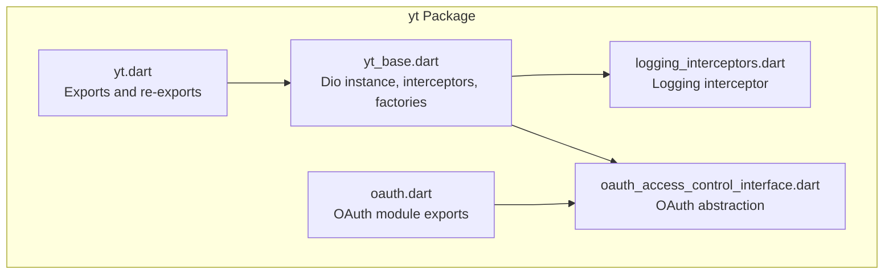
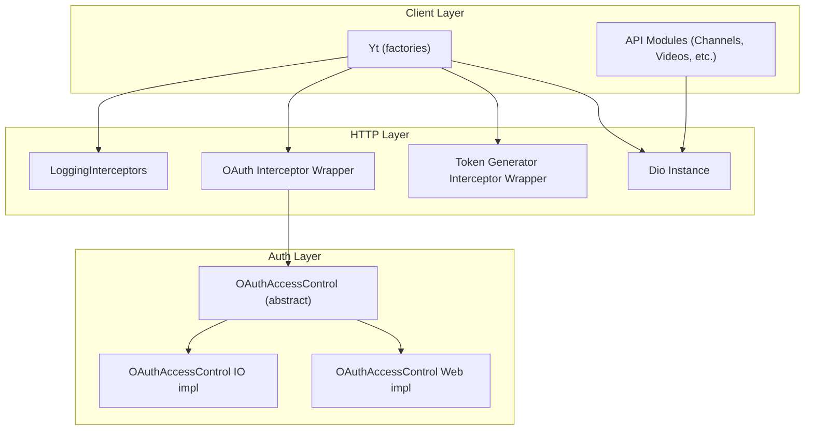
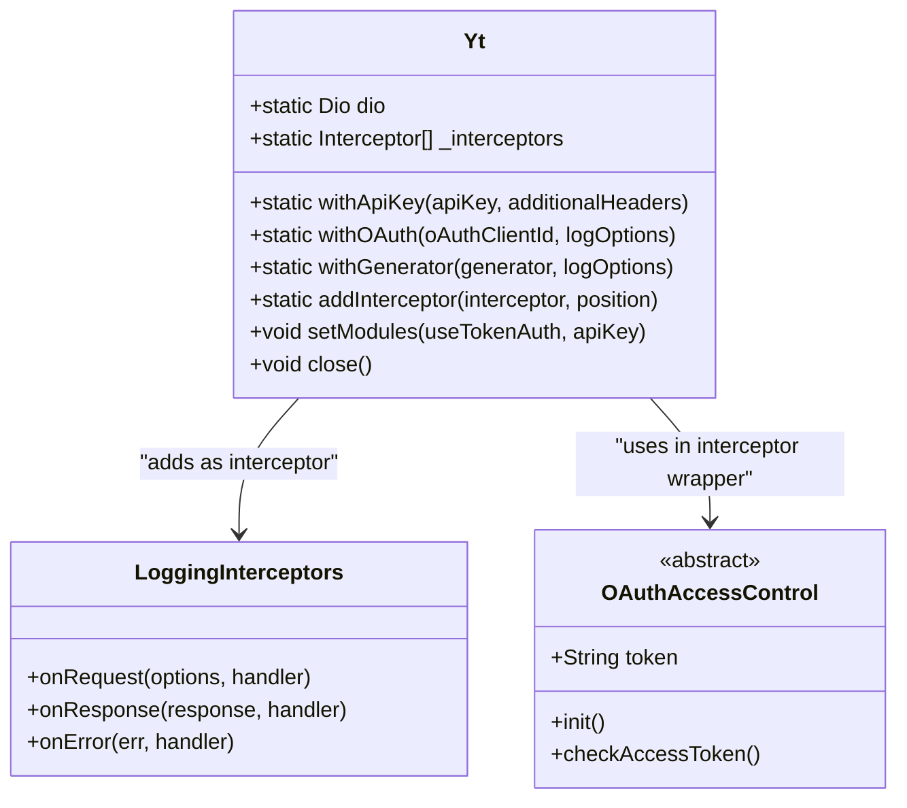
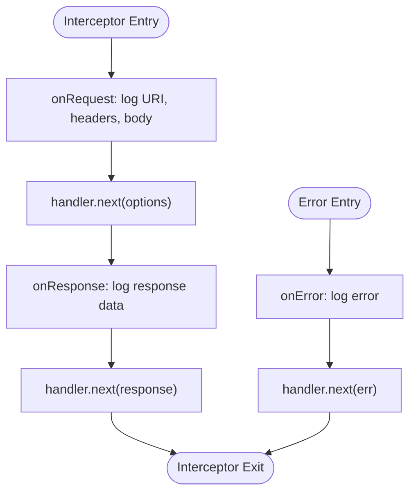
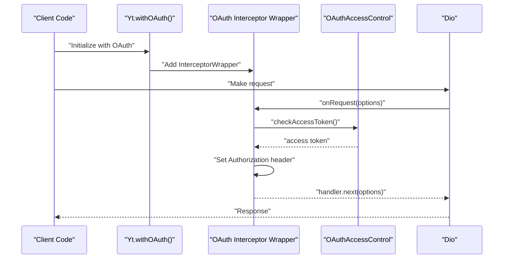
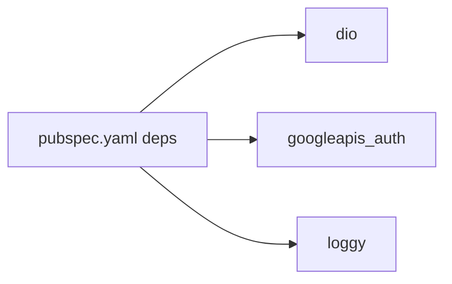

# HTTP Client Configuration

<cite>
**Referenced Files in This Document**
- [pubspec.yaml](file://packages/yt/pubspec.yaml)
- [yt.dart](file://packages/yt/lib/yt.dart)
- [logging_interceptors.dart](file://packages/yt/lib/src/util/logging_interceptors.dart)
- [yt_base.dart](file://packages/yt/lib/src/yt_base.dart)
- [oauth_access_control_interface.dart](file://packages/yt/lib/src/oauth/oauth_access_control_interface.dart)
- [oauth.dart](file://packages/yt/lib/oauth.dart)
</cite>

## Table of Contents
1. [Introduction](#introduction)
2. [Project Structure](#project-structure)
3. [Core Components](#core-components)
4. [Architecture Overview](#architecture-overview)
5. [Detailed Component Analysis](#detailed-component-analysis)
6. [Dependency Analysis](#dependency-analysis)
7. [Performance Considerations](#performance-considerations)
8. [Troubleshooting Guide](#troubleshooting-guide)
9. [Conclusion](#conclusion)

## Introduction
This document explains the HTTP client configuration and request handling system used by the YouTube Data and Live Streaming API client. It focuses on the Dio HTTP client setup, interceptor chain configuration, authentication middleware, logging, and how these pieces integrate with OAuth flows. It also covers timeout and retry considerations, connection management, and platform-specific networking behavior.

## Project Structure
The HTTP client configuration centers around the yt package’s core entry and base classes, with Dio as the underlying HTTP engine. The project declares Dio and related HTTP libraries as dependencies.

**Diagram sources**
- [yt.dart:1-75](file://packages/yt/lib/yt.dart#L1-L75)
- [yt_base.dart:1-259](file://packages/yt/lib/src/yt_base.dart#L1-L259)
- [logging_interceptors.dart:1-43](file://packages/yt/lib/src/util/logging_interceptors.dart#L1-L43)
- [oauth_access_control_interface.dart:1-33](file://packages/yt/lib/src/oauth/oauth_access_control_interface.dart#L1-L33)
- [oauth.dart:1-6](file://packages/yt/lib/oauth.dart#L1-L6)

**Section sources**
- [pubspec.yaml:17-29](file://packages/yt/pubspec.yaml#L17-L29)
- [yt.dart:1-75](file://packages/yt/lib/yt.dart#L1-L75)

## Core Components
- Dio instance and interceptor registry: The library defines a static Dio instance and maintains a local interceptor list to be applied consistently across all clients.
- Authentication middleware: Three factory methods configure Authorization headers for requests:
  - API key mode: Adds headers and applies stored interceptors.
  - OAuth mode: Injects a Bearer token from OAuth access control.
  - Token generator mode: Injects a Bearer token from a provided refresh token generator.
- Logging interceptor: Provides request/response/error logging with structured output.
- Platform-specific OAuth: An abstraction with platform-specific implementations for IO and Web environments.

**Section sources**
- [yt_base.dart:9-103](file://packages/yt/lib/src/yt_base.dart#L9-L103)
- [yt_base.dart:109-169](file://packages/yt/lib/src/yt_base.dart#L109-L169)
- [logging_interceptors.dart:8-42](file://packages/yt/lib/src/util/logging_interceptors.dart#L8-L42)
- [oauth_access_control_interface.dart:7-32](file://packages/yt/lib/src/oauth/oauth_access_control_interface.dart#L7-L32)

## Architecture Overview
The HTTP client architecture composes a static Dio instance with an ordered interceptor chain. Factories initialize interceptors and headers, then attach them to the shared Dio instance. Modules consume the configured Dio instance for API calls.

**Diagram sources**
- [yt_base.dart:9-169](file://packages/yt/lib/src/yt_base.dart#L9-L169)
- [logging_interceptors.dart:8-42](file://packages/yt/lib/src/util/logging_interceptors.dart#L8-L42)
- [oauth_access_control_interface.dart:7-32](file://packages/yt/lib/src/oauth/oauth_access_control_interface.dart#L7-L32)

## Detailed Component Analysis

### Dio Instance and Interceptor Registry
- Static Dio instance: A single Dio instance is maintained for reuse across modules.
- Interceptor registry: A local list stores interceptors to be attached later, enabling consistent ordering and lifecycle management.
- Factory methods:
  - withApiKey: Applies additional headers and attaches the registry to the Dio instance.
  - withOAuth: Adds an interceptor wrapper that checks and injects an OAuth access token.
  - withGenerator: Adds an interceptor wrapper that injects a token from a provided generator.
- Module initialization: setModules wires API modules to the configured Dio instance, optionally enabling token-authenticated modules.

**Diagram sources**
- [yt_base.dart:9-169](file://packages/yt/lib/src/yt_base.dart#L9-L169)
- [logging_interceptors.dart:8-42](file://packages/yt/lib/src/util/logging_interceptors.dart#L8-L42)
- [oauth_access_control_interface.dart:7-32](file://packages/yt/lib/src/oauth/oauth_access_control_interface.dart#L7-L32)

**Section sources**
- [yt_base.dart:9-103](file://packages/yt/lib/src/yt_base.dart#L9-L103)
- [yt_base.dart:109-169](file://packages/yt/lib/src/yt_base.dart#L109-L169)

### Logging Interceptor
- Purpose: Logs request URI, headers, body, and response data; logs errors with error details.
- Behavior: Executes before request, after response, and on error. Continues the chain via handler.next.

**Diagram sources**
- [logging_interceptors.dart:8-42](file://packages/yt/lib/src/util/logging_interceptors.dart#L8-L42)

**Section sources**
- [logging_interceptors.dart:8-42](file://packages/yt/lib/src/util/logging_interceptors.dart#L8-L42)

### Authentication Middleware
- OAuth flow:
  - Factory withOAuth creates an InterceptorWrapper that checks the access token and sets the Authorization header.
  - The token originates from OAuthAccessControl, which resolves to platform-specific implementations.
- Token generator flow:
  - Factory withGenerator creates an InterceptorWrapper that injects a token from a RefreshTokenGenerator.
- API key flow:
  - withApiKey adds headers and attaches interceptors without modifying Authorization.

**Diagram sources**
- [yt_base.dart:109-141](file://packages/yt/lib/src/yt_base.dart#L109-L141)
- [oauth_access_control_interface.dart:7-32](file://packages/yt/lib/src/oauth/oauth_access_control_interface.dart#L7-L32)

**Section sources**
- [yt_base.dart:109-141](file://packages/yt/lib/src/yt_base.dart#L109-L141)
- [oauth_access_control_interface.dart:7-32](file://packages/yt/lib/src/oauth/oauth_access_control_interface.dart#L7-L32)

### Request/Response Transformation and Debugging
- Request transformation: Interceptors can modify RequestOptions (headers, data) before dispatch.
- Response transformation: Interceptors can inspect Response objects and pass transformed data forward.
- Debugging techniques:
  - Enable the LoggingInterceptors to capture URIs, headers, request bodies, and response payloads.
  - Use Dio’s built-in logging capabilities alongside the LoggingInterceptors for deeper visibility.

Note: The LoggingInterceptors class demonstrates the pattern for onRequest/onResponse/onError hooks suitable for adding custom transformations.

**Section sources**
- [logging_interceptors.dart:8-42](file://packages/yt/lib/src/util/logging_interceptors.dart#L8-L42)

### Timeout Configurations, Retry Policies, and Connection Management
- Timeouts: Configure Dio options such as connectTimeout, receiveTimeout, and sendTimeout on the static Dio instance to enforce network timeouts.
- Retry policies: Add a retry interceptor to the registry to handle transient failures with backoff strategies.
- Connection management: Use Dio.close() to release connections when the client is no longer needed.

Recommendations:
- Centralize timeout and retry configuration on the static Dio instance.
- Keep retry logic in a dedicated interceptor to avoid duplication across modules.

**Section sources**
- [yt_base.dart:257](file://packages/yt/lib/src/yt_base.dart#L257)

### Caching Strategies
- The library exports are commented out for cache-related components, indicating optional caching is not enabled by default.
- To enable caching, integrate a cache interceptor compatible with Dio and add it to the interceptor registry before attaching to the Dio instance.

**Section sources**
- [yt.dart:8-9](file://packages/yt/lib/yt.dart#L8-L9)

### Proxy Support and Platform-Specific Networking
- Platform-specific OAuth:
  - The OAuthAccessControl abstraction resolves to platform-specific implementations for IO and Web, ensuring correct token handling per environment.
- Proxy support:
  - Dio supports proxies via HttpClientAdapter and BaseOptions. Configure the adapter and base options on the static Dio instance to route traffic through a proxy.

**Section sources**
- [oauth_access_control_interface.dart:3-5](file://packages/yt/lib/src/oauth/oauth_access_control_interface.dart#L3-L5)
- [yt_base.dart:9-10](file://packages/yt/lib/src/yt_base.dart#L9-L10)

## Dependency Analysis
The yt package depends on Dio for HTTP transport and integrates with googleapis_auth for OAuth flows. Logging is handled via loggy.

**Diagram sources**
- [pubspec.yaml:17-29](file://packages/yt/pubspec.yaml#L17-L29)

**Section sources**
- [pubspec.yaml:17-29](file://packages/yt/pubspec.yaml#L17-L29)

## Performance Considerations
- Prefer a single Dio instance to benefit from connection pooling and reduced overhead.
- Place lightweight interceptors early in the chain to minimize processing cost.
- Use targeted logging in production to reduce overhead; adjust log levels accordingly.
- Tune timeouts and retries to balance reliability and responsiveness.

## Troubleshooting Guide
- Authentication failures:
  - Verify that the OAuth interceptor is registered and that OAuthAccessControl resolves to the correct platform implementation.
  - Confirm Authorization headers are being set in onRequest.
- Excessive logging:
  - Adjust log levels or disable the LoggingInterceptors in production builds.
- Network timeouts:
  - Set appropriate Dio timeouts on the static instance.
- Unexpected responses:
  - Inspect the LoggingInterceptors output to confirm request shape and response payload.

**Section sources**
- [yt_base.dart:109-141](file://packages/yt/lib/src/yt_base.dart#L109-L141)
- [logging_interceptors.dart:8-42](file://packages/yt/lib/src/util/logging_interceptors.dart#L8-L42)

## Conclusion
The HTTP client configuration leverages a centralized Dio instance with a flexible interceptor chain. Authentication is injected via interceptors, while logging and optional caching can be layered on top. Platform-specific OAuth handling ensures compatibility across environments. Properly tuning timeouts, retries, and logging enables robust and maintainable HTTP interactions.