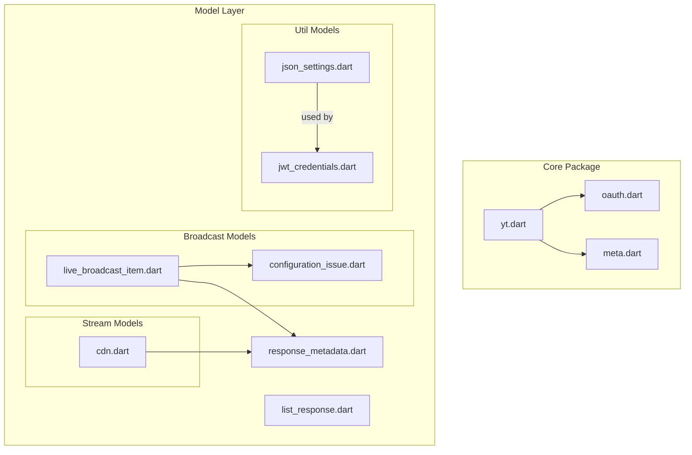
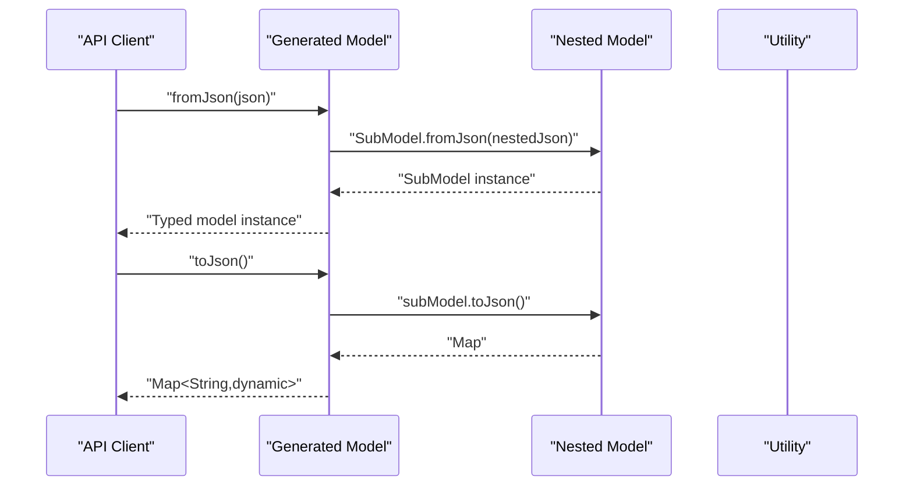
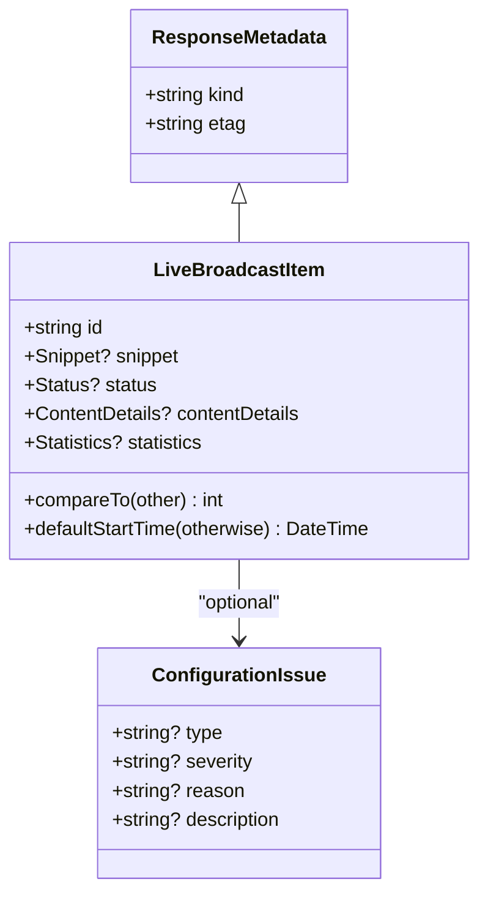
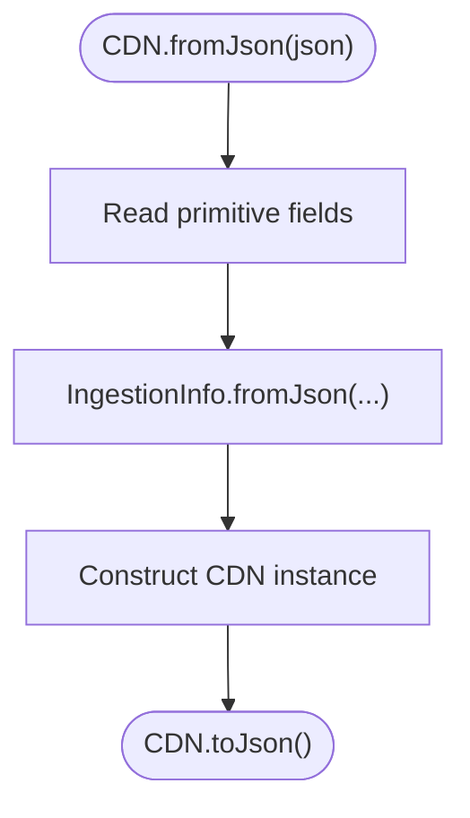
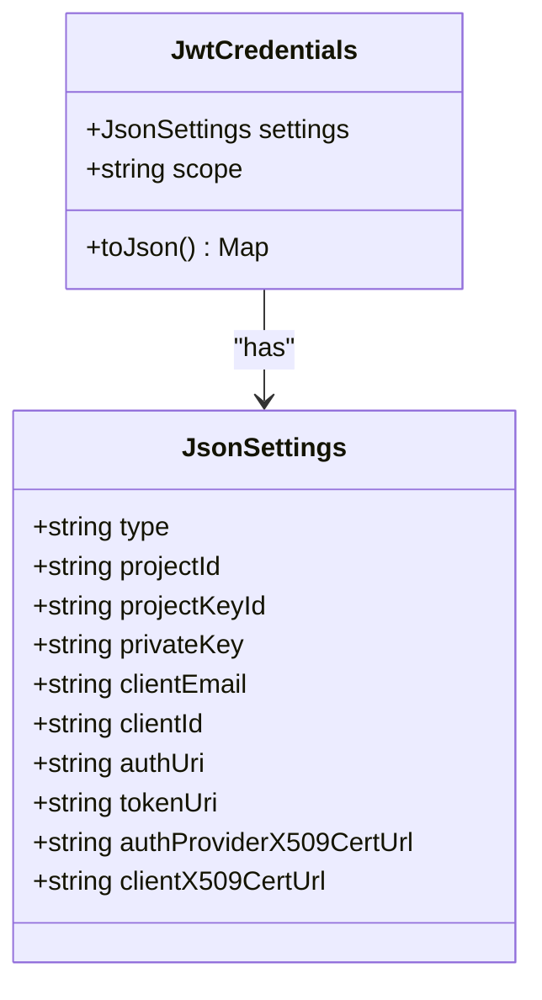
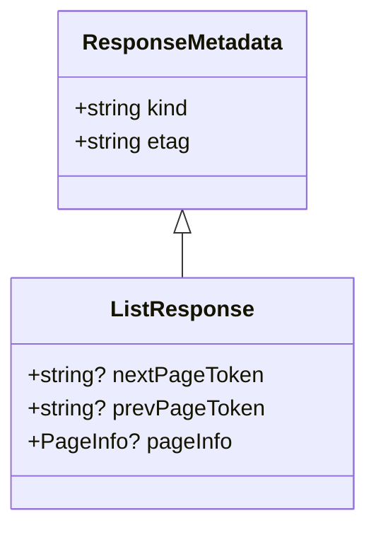
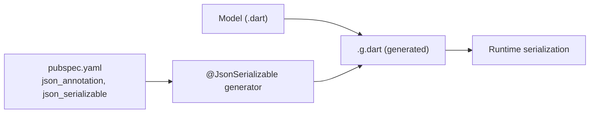

# Model Layer and Serialization

<cite>
**Referenced Files in This Document**
- [pubspec.yaml](file://packages/yt/pubspec.yaml)
- [README.md](file://README.md)
- [yt.dart](file://packages/yt/lib/yt.dart)
- [oauth.dart](file://packages/yt/lib/oauth.dart)
- [meta.dart](file://packages/yt/lib/meta.dart)
- [response_metadata.dart](file://packages/yt/lib/src/model/response_metadata.dart)
- [list_response.dart](file://packages/yt/lib/src/model/list_response.dart)
- [live_broadcast_item.dart](file://packages/yt/lib/src/model/broadcast/live_broadcast_item.dart)
- [live_broadcast_item.g.dart](file://packages/yt/lib/src/model/broadcast/live_broadcast_item.g.dart)
- [configuration_issue.dart](file://packages/yt/lib/src/model/broadcast/configuration_issue.dart)
- [configuration_issue.g.dart](file://packages/yt/lib/src/model/broadcast/configuration_issue.g.dart)
- [cdn.dart](file://packages/yt/lib/src/model/stream/cdn.dart)
- [cdn.g.dart](file://packages/yt/lib/src/model/stream/cdn.g.dart)
- [json_settings.dart](file://packages/yt/lib/src/model/util/json_settings.dart)
- [json_settings.g.dart](file://packages/yt/lib/src/model/util/json_settings.g.dart)
- [jwt_credentials.dart](file://packages/yt/lib/src/model/util/jwt_credentials.dart)
- [jwt_credentials.g.dart](file://packages/yt/lib/src/model/util/jwt_credentials.g.dart)
</cite>

## Table of Contents
1. [Introduction](#introduction)
2. [Project Structure](#project-structure)
3. [Core Components](#core-components)
4. [Architecture Overview](#architecture-overview)
5. [Detailed Component Analysis](#detailed-component-analysis)
6. [Dependency Analysis](#dependency-analysis)
7. [Performance Considerations](#performance-considerations)
8. [Troubleshooting Guide](#troubleshooting-guide)
9. [Conclusion](#conclusion)

## Introduction
This document explains the data model layer and automatic serialization system used by the YouTube Data and Live Streaming APIs client. It focuses on how raw JSON responses are transformed into strongly-typed Dart models, how serialization/deserialization is generated, and how the SDK handles optional fields, nested objects, and metadata. It also covers error handling strategies for malformed data, version compatibility considerations, and common model manipulation patterns.

## Project Structure
The model layer resides under the core package and is organized by domain (broadcast, channels, chat, comments, playlist, search, stream, subscriptions, videos, watermark). Each model file declares a class annotated for code generation and produces a companion .g.dart file containing the generated serialization logic. Shared base classes define common metadata and list response structures.

**Diagram sources**
- [yt.dart](file://packages/yt/lib/yt.dart)
- [oauth.dart](file://packages/yt/lib/oauth.dart)
- [meta.dart](file://packages/yt/lib/meta.dart)
- [response_metadata.dart](file://packages/yt/lib/src/model/response_metadata.dart)
- [list_response.dart](file://packages/yt/lib/src/model/list_response.dart)
- [live_broadcast_item.dart](file://packages/yt/lib/src/model/broadcast/live_broadcast_item.dart)
- [configuration_issue.dart](file://packages/yt/lib/src/model/broadcast/configuration_issue.dart)
- [cdn.dart](file://packages/yt/lib/src/model/stream/cdn.dart)
- [json_settings.dart](file://packages/yt/lib/src/model/util/json_settings.dart)
- [jwt_credentials.dart](file://packages/yt/lib/src/model/util/jwt_credentials.dart)

**Section sources**
- [README.md:1-119](file://README.md#L1-L119)
- [pubspec.yaml:1-36](file://packages/yt/pubspec.yaml#L1-L36)

## Core Components
- Base metadata: ResponseMetadata defines shared fields kind and etag used across all resources.
- List responses: ListResponse extends ResponseMetadata and adds pagination tokens and pageInfo.
- Domain models: Classes like LiveBroadcastItem represent API resources and embed related sub-models (Snippet, Status, ContentDetails, Statistics).
- Serialization: @JsonSerializable generates fromJson/toJson methods and handles explicitToJson and field renaming via @JsonKey.
- Generated code: Each model’s .g.dart file contains the generated conversion functions and maintains backward compatibility.

Key patterns:
- Optional fields are nullable and handled with null-aware operators in generated code.
- Nested objects are deserialized by invoking fromJson on sub-models and serialized via toJson().
- toString() delegates to jsonEncode(toJson()) for convenient logging.

**Section sources**
- [response_metadata.dart:1-11](file://packages/yt/lib/src/model/response_metadata.dart#L1-L11)
- [list_response.dart:1-23](file://packages/yt/lib/src/model/list_response.dart#L1-L23)
- [live_broadcast_item.dart:1-63](file://packages/yt/lib/src/model/broadcast/live_broadcast_item.dart#L1-L63)
- [live_broadcast_item.g.dart:1-40](file://packages/yt/lib/src/model/broadcast/live_broadcast_item.g.dart#L1-L40)
- [configuration_issue.dart:1-23](file://packages/yt/lib/src/model/broadcast/configuration_issue.dart#L1-L23)
- [configuration_issue.g.dart:1-23](file://packages/yt/lib/src/model/broadcast/configuration_issue.g.dart#L1-L23)
- [cdn.dart:1-23](file://packages/yt/lib/src/model/stream/cdn.dart#L1-L23)
- [cdn.g.dart:1-23](file://packages/yt/lib/src/model/stream/cdn.g.dart#L1-L23)
- [json_settings.dart:1-58](file://packages/yt/lib/src/model/util/json_settings.dart#L1-L58)
- [json_settings.g.dart:1-58](file://packages/yt/lib/src/model/util/json_settings.g.dart#L1-L58)
- [jwt_credentials.dart:1-23](file://packages/yt/lib/src/model/util/jwt_credentials.dart#L1-L23)
- [jwt_credentials.g.dart:1-19](file://packages/yt/lib/src/model/util/jwt_credentials.g.dart#L1-L19)

## Architecture Overview
The model layer follows a layered architecture:
- API clients return raw JSON maps.
- Models annotated with @JsonSerializable are paired with generated converters.
- Generated code maps JSON keys to model fields, including nested objects and optional values.
- Utilities encapsulate credential settings and token handling.

**Diagram sources**
- [live_broadcast_item.g.dart:9-28](file://packages/yt/lib/src/model/broadcast/live_broadcast_item.g.dart#L9-L28)
- [configuration_issue.g.dart:9-15](file://packages/yt/lib/src/model/broadcast/configuration_issue.g.dart#L9-L15)
- [cdn.g.dart:9-16](file://packages/yt/lib/src/model/stream/cdn.g.dart#L9-L16)
- [jwt_credentials.g.dart:9-13](file://packages/yt/lib/src/model/util/jwt_credentials.g.dart#L9-L13)

## Detailed Component Analysis

### LiveBroadcastItem: Typed Resource with Nested Sub-Models
LiveBroadcastItem demonstrates the canonical pattern:
- Extends ResponseMetadata to inherit kind and etag.
- Embeds Snippet, Status, ContentDetails, and Statistics as optional fields.
- Uses explicitToJson to ensure nested objects serialize even when null.
- Provides a defaultStartTime helper leveraging optional snippet scheduling.

**Diagram sources**
- [response_metadata.dart:1-11](file://packages/yt/lib/src/model/response_metadata.dart#L1-L11)
- [live_broadcast_item.dart:14-62](file://packages/yt/lib/src/model/broadcast/live_broadcast_item.dart#L14-L62)
- [configuration_issue.dart:1-23](file://packages/yt/lib/src/model/broadcast/configuration_issue.dart#L1-L23)

**Section sources**
- [live_broadcast_item.dart:1-63](file://packages/yt/lib/src/model/broadcast/live_broadcast_item.dart#L1-L63)
- [live_broadcast_item.g.dart:1-40](file://packages/yt/lib/src/model/broadcast/live_broadcast_item.g.dart#L1-L40)
- [configuration_issue.dart:1-23](file://packages/yt/lib/src/model/broadcast/configuration_issue.dart#L1-L23)
- [configuration_issue.g.dart:1-23](file://packages/yt/lib/src/model/broadcast/configuration_issue.g.dart#L1-L23)

### Stream CDN Model: Nested Object Serialization
CDN illustrates nested serialization with primitive fields and a nested object:
- Deserializes ingestionType, ingestionInfo, resolution, and frameRate.
- Serializes back to JSON using nested toJson().

**Diagram sources**
- [cdn.dart:1-23](file://packages/yt/lib/src/model/stream/cdn.dart#L1-L23)
- [cdn.g.dart:1-23](file://packages/yt/lib/src/model/stream/cdn.g.dart#L1-L23)

**Section sources**
- [cdn.dart:1-23](file://packages/yt/lib/src/model/stream/cdn.dart#L1-L23)
- [cdn.g.dart:1-23](file://packages/yt/lib/src/model/stream/cdn.g.dart#L1-L23)

### Utility Credentials: Settings and Token Handling
JsonSettings and JwtCredentials demonstrate:
- JsonSettings with @JsonKey to map snake_case JSON keys to camelCase Dart fields.
- JwtCredentials embedding JsonSettings and delegating serialization to settings.toJson().

**Diagram sources**
- [json_settings.dart:1-58](file://packages/yt/lib/src/model/util/json_settings.dart#L1-L58)
- [jwt_credentials.dart:1-23](file://packages/yt/lib/src/model/util/jwt_credentials.dart#L1-L23)

**Section sources**
- [json_settings.dart:1-58](file://packages/yt/lib/src/model/util/json_settings.dart#L1-L58)
- [json_settings.g.dart:1-58](file://packages/yt/lib/src/model/util/json_settings.g.dart#L1-L58)
- [jwt_credentials.dart:1-23](file://packages/yt/lib/src/model/util/jwt_credentials.dart#L1-L23)
- [jwt_credentials.g.dart:1-19](file://packages/yt/lib/src/model/util/jwt_credentials.g.dart#L1-L19)

### ListResponse and ResponseMetadata: Pagination and Base Fields
ListResponse extends ResponseMetadata and adds pagination tokens and pageInfo. This pattern ensures consistent metadata across list endpoints.

**Diagram sources**
- [response_metadata.dart:1-11](file://packages/yt/lib/src/model/response_metadata.dart#L1-L11)
- [list_response.dart:1-23](file://packages/yt/lib/src/model/list_response.dart#L1-L23)

**Section sources**
- [list_response.dart:1-23](file://packages/yt/lib/src/model/list_response.dart#L1-L23)
- [response_metadata.dart:1-11](file://packages/yt/lib/src/model/response_metadata.dart#L1-L11)

## Dependency Analysis
Serialization relies on json_annotation and json_serializable. The build process generates conversion code per model. Retrofit is used for API contracts elsewhere in the SDK, complementing the model layer.

**Diagram sources**
- [pubspec.yaml:17-36](file://packages/yt/pubspec.yaml#L17-L36)
- [live_broadcast_item.dart:3-11](file://packages/yt/lib/src/model/broadcast/live_broadcast_item.dart#L3-L11)
- [live_broadcast_item.g.dart:1-40](file://packages/yt/lib/src/model/broadcast/live_broadcast_item.g.dart#L1-L40)

**Section sources**
- [pubspec.yaml:17-36](file://packages/yt/pubspec.yaml#L17-L36)
- [live_broadcast_item.dart:3-11](file://packages/yt/lib/src/model/broadcast/live_broadcast_item.dart#L3-L11)

## Performance Considerations
- Prefer explicitToJson for nested models to avoid missing fields in serialized output.
- Keep nested object graphs shallow to reduce recursion overhead during serialization.
- Use toString() for logging by delegating to jsonEncode(toJson()) to minimize manual formatting.
- Avoid unnecessary conversions by caching parsed models when repeatedly accessed.

## Troubleshooting Guide
Common issues and resolutions:
- Missing or unexpected fields: Generated code treats absent keys as null for declared fields. Add guards around optional fields before use.
- Type mismatches: Ensure JSON keys match the expected types. Use @JsonKey to map differently named fields.
- Nested object errors: Verify that nested models also have @JsonSerializable and are imported so their .g.dart is generated.
- Version compatibility: When adding new fields, keep them optional and nullable to maintain backward compatibility with older JSON responses.

## Conclusion
The model layer leverages code-generated serialization to transform raw JSON responses into strongly-typed Dart models. By using @JsonSerializable with explicitToJson, @JsonKey for field mapping, and composition of nested models, the SDK achieves robust, maintainable, and extensible data handling. The base ResponseMetadata and ListResponse classes standardize metadata and pagination across endpoints, while utilities encapsulate credential and token concerns. Following the patterns documented here ensures consistent behavior, reliable error handling, and smooth evolution of the model layer over time.