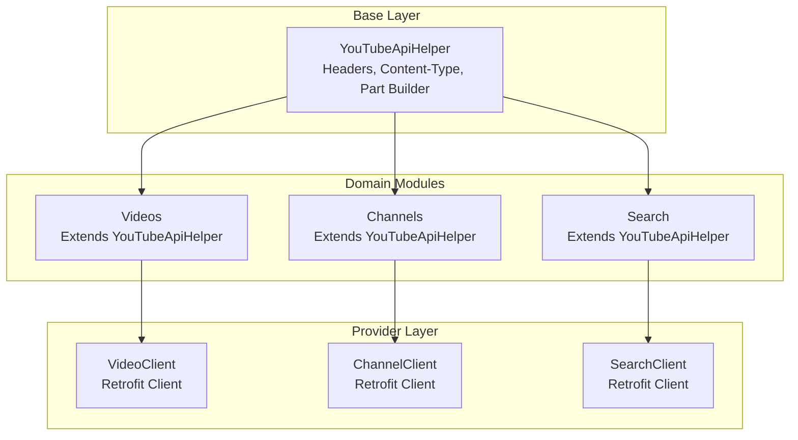
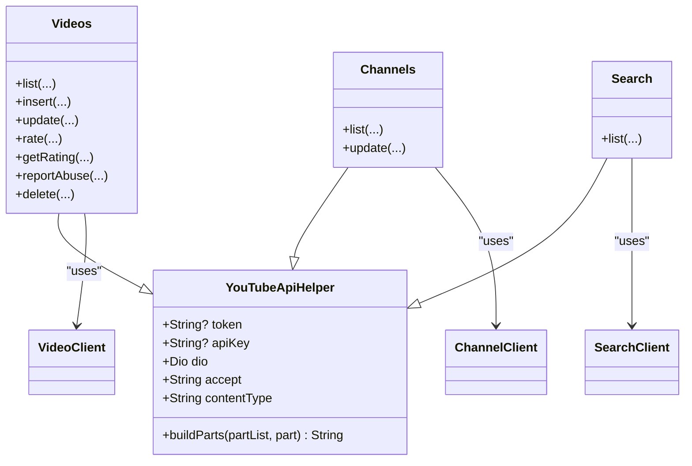
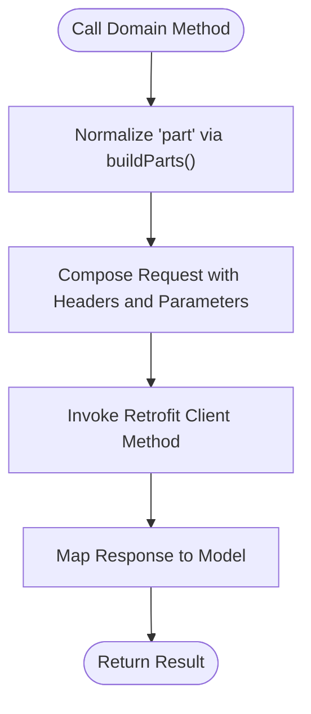
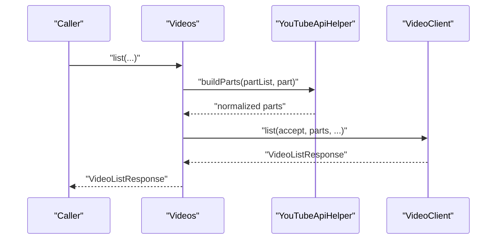
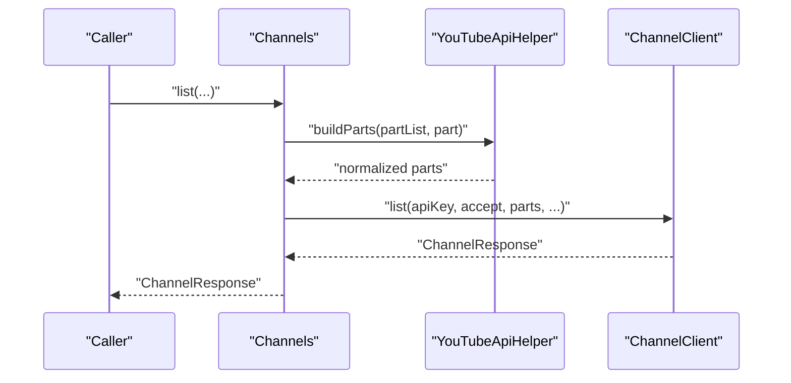
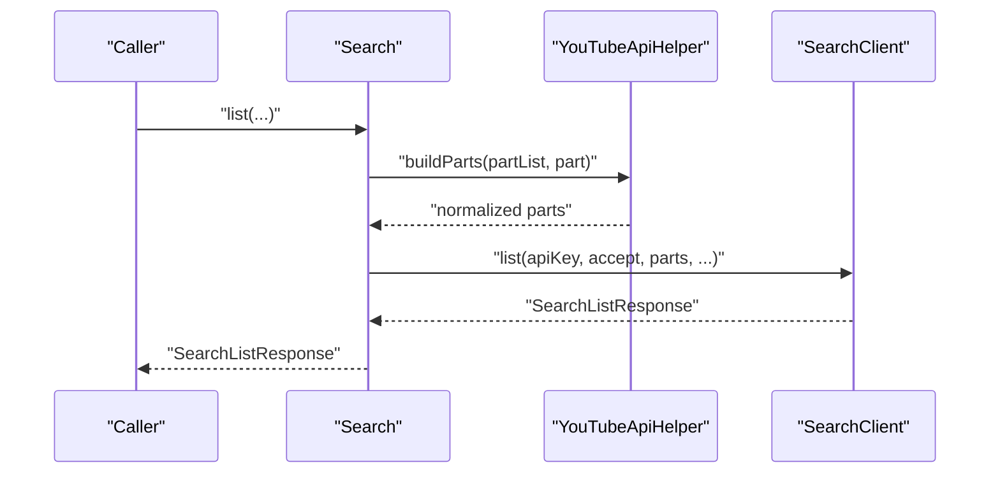
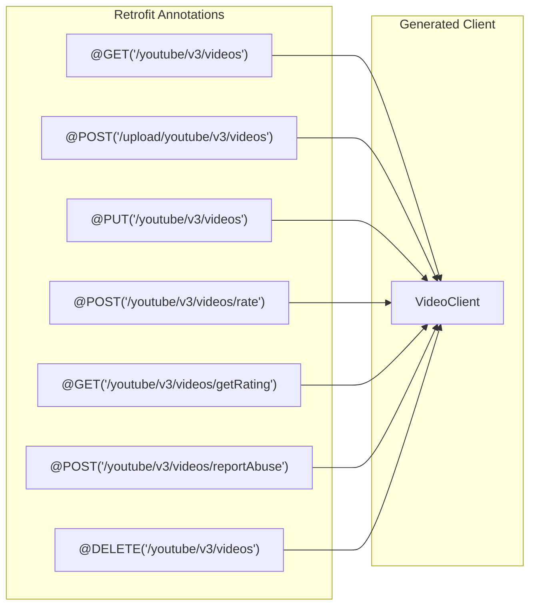
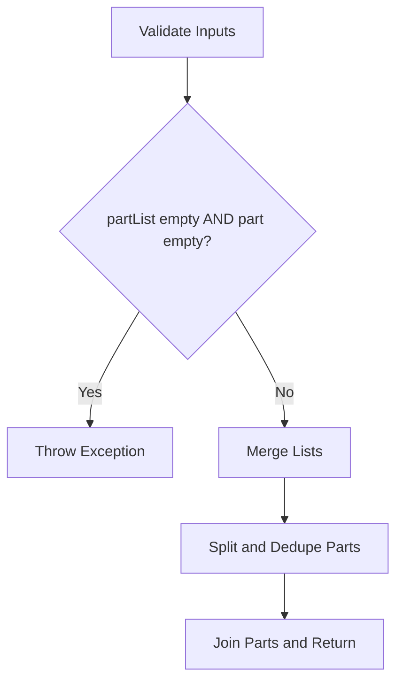
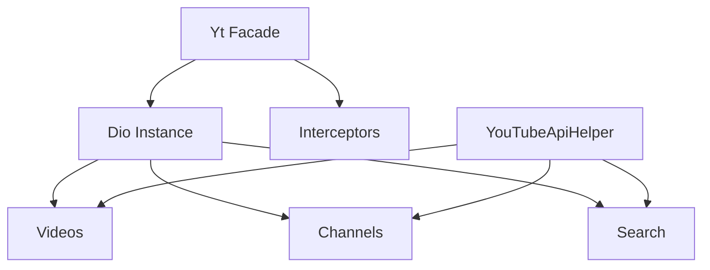

# YouTubeApiHelper Base Class

<cite>
**Referenced Files in This Document**
- [youtube_api_helper.dart](file://packages/yt/lib/src/youtube_api_helper.dart)
- [videos.dart](file://packages/yt/lib/src/videos.dart)
- [channels.dart](file://packages/yt/lib/src/channels.dart)
- [search.dart](file://packages/yt/lib/src/search.dart)
- [videos.dart](file://packages/yt/lib/src/provider/data/videos.dart)
- [channels.dart](file://packages/yt/lib/src/provider/data/channels.dart)
- [search.dart](file://packages/yt/lib/src/provider/data/search.dart)
- [yt_base.dart](file://packages/yt/lib/src/yt_base.dart)
- [util.dart](file://packages/yt/lib/src/util/util.dart)
</cite>

## Table of Contents
1. [Introduction](#introduction)
2. [Project Structure](#project-structure)
3. [Core Components](#core-components)
4. [Architecture Overview](#architecture-overview)
5. [Detailed Component Analysis](#detailed-component-analysis)
6. [Dependency Analysis](#dependency-analysis)
7. [Performance Considerations](#performance-considerations)
8. [Troubleshooting Guide](#troubleshooting-guide)
9. [Conclusion](#conclusion)

## Introduction
This document explains the YouTubeApiHelper base class that provides common functionality across all API modules in the SDK. It focuses on the template method pattern implementation, shared HTTP operations, and common response processing logic. It documents helper methods for request building, parameter validation, response mapping, and error standardization. It also covers how individual modules extend the base class, the provider pattern used for API endpoint definitions, code generation integration, and how the base class ensures consistent API interaction patterns throughout the SDK.

## Project Structure
The SDK organizes API functionality by domain (videos, channels, search, etc.), with each domain module extending the YouTubeApiHelper base class. Each module composes a Retrofit-generated client (e.g., VideoClient, ChannelClient, SearchClient) to handle HTTP requests and responses. The base class centralizes cross-cutting concerns such as header management, content-type handling, and parameter normalization.

**Diagram sources**
- [youtube_api_helper.dart:3-28](file://packages/yt/lib/src/youtube_api_helper.dart#L3-L28)
- [videos.dart:8-135](file://packages/yt/lib/src/videos.dart#L8-L135)
- [channels.dart:6-58](file://packages/yt/lib/src/channels.dart#L6-L58)
- [search.dart:7-81](file://packages/yt/lib/src/search.dart#L7-L81)
- [videos.dart:10-99](file://packages/yt/lib/src/provider/data/videos.dart#L10-L99)
- [channels.dart:9-37](file://packages/yt/lib/src/provider/data/channels.dart#L9-L37)
- [search.dart:9-48](file://packages/yt/lib/src/provider/data/search.dart#L9-L48)

**Section sources**
- [youtube_api_helper.dart:3-28](file://packages/yt/lib/src/youtube_api_helper.dart#L3-L28)
- [videos.dart:8-135](file://packages/yt/lib/src/videos.dart#L8-L135)
- [channels.dart:6-58](file://packages/yt/lib/src/channels.dart#L6-L58)
- [search.dart:7-81](file://packages/yt/lib/src/search.dart#L7-L81)

## Core Components
- YouTubeApiHelper: An abstract base class that encapsulates shared HTTP configuration and utilities used by all API modules. It defines standardized headers (Accept, Content-Type), constructor parameters for authentication tokens and API keys, and a helper method to normalize the part parameter for API requests.
- Domain Modules (Videos, Channels, Search): Concrete classes that extend YouTubeApiHelper. They compose Retrofit clients to perform HTTP operations and delegate common concerns (headers, part normalization) to the base class.
- Provider Pattern (Retrofit Clients): Each domain module uses a Retrofit-generated client (e.g., VideoClient, ChannelClient, SearchClient) to define endpoints and map responses to strongly-typed models.

Key responsibilities:
- Header management: The base class defines Accept and Content-Type constants used consistently across requests.
- Parameter normalization: The buildParts method merges and deduplicates part parameters, ensuring consistent API usage.
- Authentication integration: The base class accepts optional token and apiKey parameters, enabling downstream modules to use either token-based or API-key-based authentication flows.

**Section sources**
- [youtube_api_helper.dart:3-28](file://packages/yt/lib/src/youtube_api_helper.dart#L3-L28)
- [videos.dart:8-135](file://packages/yt/lib/src/videos.dart#L8-L135)
- [channels.dart:6-58](file://packages/yt/lib/src/channels.dart#L6-L58)
- [search.dart:7-81](file://packages/yt/lib/src/search.dart#L7-L81)

## Architecture Overview
The architecture follows a layered design:
- Base Layer: YouTubeApiHelper provides shared HTTP configuration and utilities.
- Domain Modules: Each domain module extends the base class and orchestrates operations using Retrofit clients.
- Provider Layer: Retrofit clients define endpoints and handle serialization/deserialization.

**Diagram sources**
- [youtube_api_helper.dart:3-28](file://packages/yt/lib/src/youtube_api_helper.dart#L3-L28)
- [videos.dart:8-135](file://packages/yt/lib/src/videos.dart#L8-L135)
- [channels.dart:6-58](file://packages/yt/lib/src/channels.dart#L6-L58)
- [search.dart:7-81](file://packages/yt/lib/src/search.dart#L7-L81)
- [videos.dart:10-99](file://packages/yt/lib/src/provider/data/videos.dart#L10-L99)
- [channels.dart:9-37](file://packages/yt/lib/src/provider/data/channels.dart#L9-L37)
- [search.dart:9-48](file://packages/yt/lib/src/provider/data/search.dart#L9-L48)

## Detailed Component Analysis

### YouTubeApiHelper Template Method Pattern
The base class implements a template method pattern by providing shared infrastructure (headers, content-type, part normalization) while delegating domain-specific operations to subclasses. Subclasses override method signatures to call Retrofit clients with normalized parameters, ensuring consistent behavior across modules.

- Shared HTTP configuration: The base class defines Accept and Content-Type headers used by all requests.
- Part parameter normalization: The buildParts method consolidates and deduplicates part parameters, preventing duplicates and ensuring valid API requests.
- Authentication parameters: The constructor accepts optional token and apiKey, enabling downstream modules to integrate with token-based or API-key-based authentication.

**Diagram sources**
- [youtube_api_helper.dart:14-28](file://packages/yt/lib/src/youtube_api_helper.dart#L14-L28)
- [videos.dart:28-42](file://packages/yt/lib/src/videos.dart#L28-L42)
- [channels.dart:26-41](file://packages/yt/lib/src/channels.dart#L26-L41)
- [search.dart:46-79](file://packages/yt/lib/src/search.dart#L46-L79)

**Section sources**
- [youtube_api_helper.dart:3-28](file://packages/yt/lib/src/youtube_api_helper.dart#L3-L28)
- [videos.dart:28-42](file://packages/yt/lib/src/videos.dart#L28-L42)
- [channels.dart:26-41](file://packages/yt/lib/src/channels.dart#L26-L41)
- [search.dart:46-79](file://packages/yt/lib/src/search.dart#L46-L79)

### Videos Module Extension
The Videos module demonstrates the template method pattern by:
- Normalizing the part parameter using buildParts.
- Delegating HTTP operations to VideoClient methods (list, upload, update, rate, getRating, reportAbuse, delete).
- Handling specialized flows such as resumable uploads, including retrieving upload locations and validating response headers.

**Diagram sources**
- [videos.dart:8-135](file://packages/yt/lib/src/videos.dart#L8-L135)
- [youtube_api_helper.dart:14-28](file://packages/yt/lib/src/youtube_api_helper.dart#L14-L28)
- [videos.dart:10-99](file://packages/yt/lib/src/provider/data/videos.dart#L10-L99)

**Section sources**
- [videos.dart:8-135](file://packages/yt/lib/src/videos.dart#L8-L135)
- [youtube_api_helper.dart:14-28](file://packages/yt/lib/src/youtube_api_helper.dart#L14-L28)
- [videos.dart:10-99](file://packages/yt/lib/src/provider/data/videos.dart#L10-L99)

### Channels Module Extension
The Channels module illustrates consistent behavior:
- Normalizes the part parameter using buildParts.
- Uses apiKey for requests where applicable.
- Delegates to ChannelClient methods for listing and updating channel resources.

**Diagram sources**
- [channels.dart:6-58](file://packages/yt/lib/src/channels.dart#L6-L58)
- [youtube_api_helper.dart:14-28](file://packages/yt/lib/src/youtube_api_helper.dart#L14-L28)
- [channels.dart:9-37](file://packages/yt/lib/src/provider/data/channels.dart#L9-L37)

**Section sources**
- [channels.dart:6-58](file://packages/yt/lib/src/channels.dart#L6-L58)
- [youtube_api_helper.dart:14-28](file://packages/yt/lib/src/youtube_api_helper.dart#L14-L28)
- [channels.dart:9-37](file://packages/yt/lib/src/provider/data/channels.dart#L9-L37)

### Search Module Extension
The Search module demonstrates consistent patterns:
- Normalizes the part parameter using buildParts.
- Uses apiKey for requests where applicable.
- Delegates to SearchClient methods for performing search operations with numerous query parameters.

**Diagram sources**
- [search.dart:7-81](file://packages/yt/lib/src/search.dart#L7-L81)
- [youtube_api_helper.dart:14-28](file://packages/yt/lib/src/youtube_api_helper.dart#L14-L28)
- [search.dart:9-48](file://packages/yt/lib/src/provider/data/search.dart#L9-L48)

**Section sources**
- [search.dart:7-81](file://packages/yt/lib/src/search.dart#L7-L81)
- [youtube_api_helper.dart:14-28](file://packages/yt/lib/src/youtube_api_helper.dart#L14-L28)
- [search.dart:9-48](file://packages/yt/lib/src/provider/data/search.dart#L9-L48)

### Provider Pattern and Code Generation Integration
Each domain module composes a Retrofit-generated client:
- VideoClient: Defines endpoints for listing, uploading, updating, rating, retrieving ratings, reporting abuse, and deleting videos.
- ChannelClient: Defines endpoints for listing and updating channels.
- SearchClient: Defines endpoints for performing searches with extensive query parameters.

These clients are annotated with @RestApi and @GET/@POST/@PUT/@DELETE, and code generation produces strongly-typed clients used by domain modules.

**Diagram sources**
- [videos.dart:10-99](file://packages/yt/lib/src/provider/data/videos.dart#L10-L99)

**Section sources**
- [videos.dart:10-99](file://packages/yt/lib/src/provider/data/videos.dart#L10-L99)
- [channels.dart:9-37](file://packages/yt/lib/src/provider/data/channels.dart#L9-L37)
- [search.dart:9-48](file://packages/yt/lib/src/provider/data/search.dart#L9-L48)

### Helper Methods: Request Building, Parameter Validation, Response Mapping, and Error Standardization
- Request building: The base class defines Accept and Content-Type headers and uses buildParts to normalize the part parameter. Subclasses pass these values to Retrofit clients.
- Parameter validation: The buildParts method validates that at least one of partList or part is provided, throwing an exception otherwise.
- Response mapping: Retrofit clients map HTTP responses to strongly-typed models (e.g., VideoListResponse, ChannelResponse, SearchListResponse).
- Error standardization: The base class centralizes header and parameter handling, reducing duplication and standardizing error propagation from Retrofit clients.

**Diagram sources**
- [youtube_api_helper.dart:14-28](file://packages/yt/lib/src/youtube_api_helper.dart#L14-L28)

**Section sources**
- [youtube_api_helper.dart:14-28](file://packages/yt/lib/src/youtube_api_helper.dart#L14-L28)
- [videos.dart:72-74](file://packages/yt/lib/src/videos.dart#L72-L74)
- [util.dart:53-61](file://packages/yt/lib/src/util/util.dart#L53-L61)

## Dependency Analysis
The SDK exhibits low coupling and high cohesion:
- YouTubeApiHelper provides shared behavior with minimal state, enabling domain modules to focus on domain-specific logic.
- Retrofit clients encapsulate HTTP concerns, allowing domain modules to remain thin wrappers around generated clients.
- The Yt facade constructs Dio instances and injects interceptors, enabling consistent authentication and logging across modules.

**Diagram sources**
- [yt_base.dart:9-259](file://packages/yt/lib/src/yt_base.dart#L9-L259)
- [youtube_api_helper.dart:3-28](file://packages/yt/lib/src/youtube_api_helper.dart#L3-L28)
- [videos.dart:8-135](file://packages/yt/lib/src/videos.dart#L8-L135)
- [channels.dart:6-58](file://packages/yt/lib/src/channels.dart#L6-L58)
- [search.dart:7-81](file://packages/yt/lib/src/search.dart#L7-L81)

**Section sources**
- [yt_base.dart:9-259](file://packages/yt/lib/src/yt_base.dart#L9-L259)
- [youtube_api_helper.dart:3-28](file://packages/yt/lib/src/youtube_api_helper.dart#L3-L28)
- [videos.dart:8-135](file://packages/yt/lib/src/videos.dart#L8-L135)
- [channels.dart:6-58](file://packages/yt/lib/src/channels.dart#L6-L58)
- [search.dart:7-81](file://packages/yt/lib/src/search.dart#L7-L81)

## Performance Considerations
- Header reuse: Centralized header definitions reduce overhead and ensure consistency.
- Part normalization: Deduplication prevents redundant parameters and reduces request payload size.
- Retrofit efficiency: Generated clients minimize reflection overhead and improve serialization performance.
- Interceptor pipeline: Logging and authentication interceptors are configured once via the Yt facade, avoiding per-module duplication.

[No sources needed since this section provides general guidance]

## Troubleshooting Guide
Common issues and resolutions:
- Missing part parameter: The buildParts method requires either partList or part to be non-empty. Ensure callers supply at least one of these parameters.
- Upload location errors: When uploading videos, verify that the upload location response contains the expected header and that the upload ID is extracted correctly.
- Authentication mismatches: Confirm that the chosen authentication mode (API key vs. token) aligns with the module’s capabilities and that interceptors are properly attached.

**Section sources**
- [youtube_api_helper.dart:14-28](file://packages/yt/lib/src/youtube_api_helper.dart#L14-L28)
- [videos.dart:72-74](file://packages/yt/lib/src/videos.dart#L72-L74)
- [util.dart:53-61](file://packages/yt/lib/src/util/util.dart#L53-L61)
- [yt_base.dart:109-141](file://packages/yt/lib/src/yt_base.dart#L109-L141)

## Conclusion
YouTubeApiHelper serves as the foundation for consistent API interactions across the SDK. Through the template method pattern, it centralizes HTTP configuration, parameter normalization, and authentication integration while delegating domain-specific operations to Retrofit clients. The provider pattern and code generation streamline endpoint definitions and response mapping, resulting in a cohesive, maintainable, and extensible architecture.