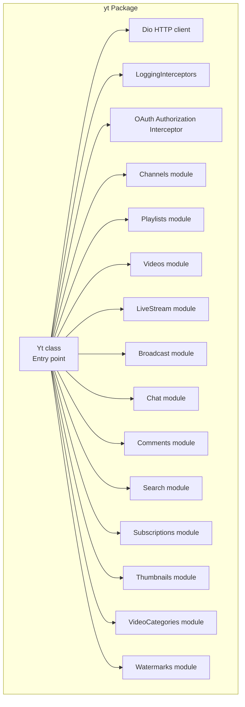
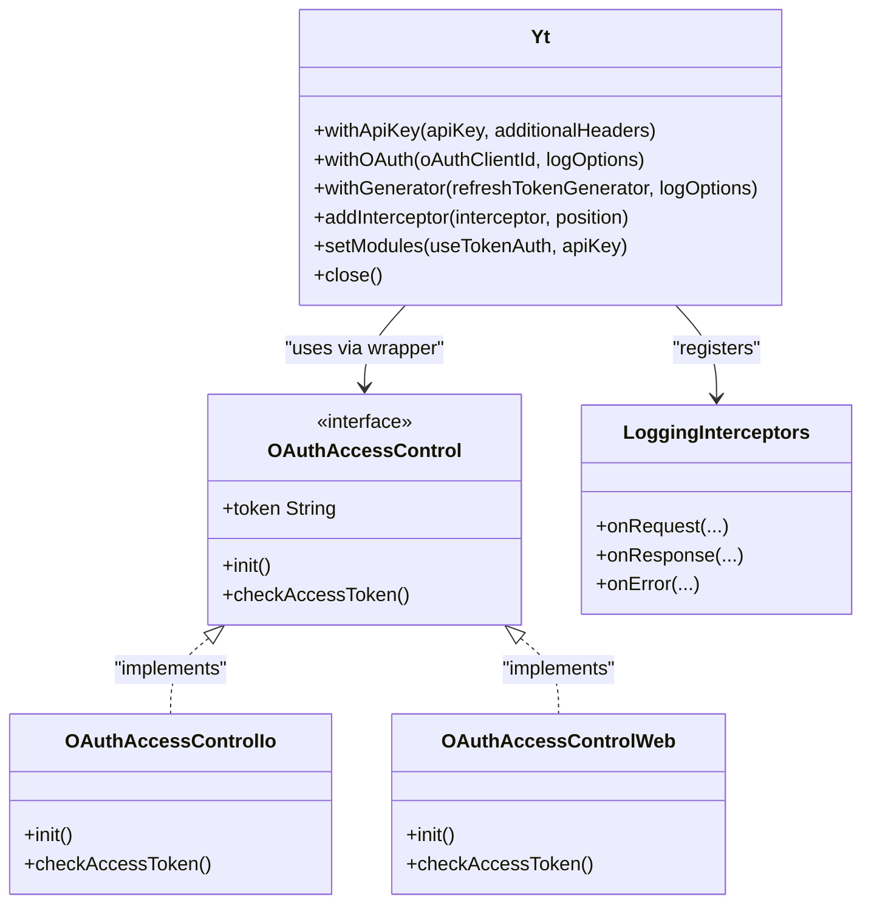
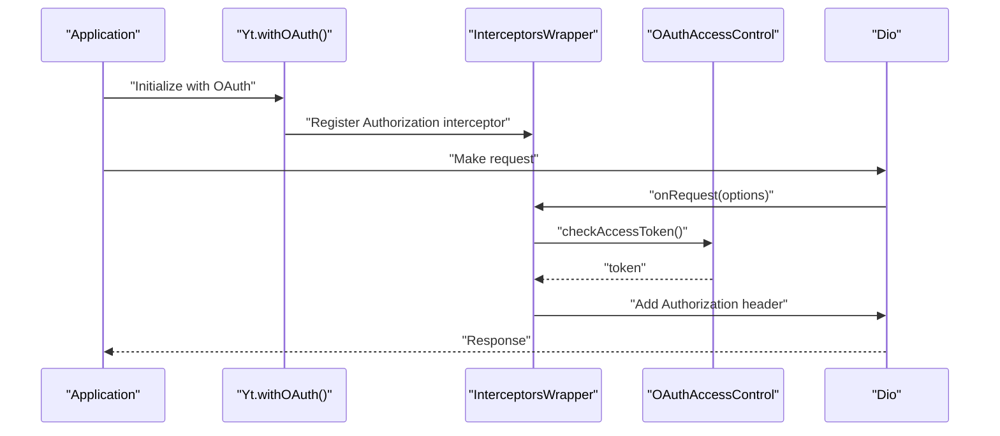
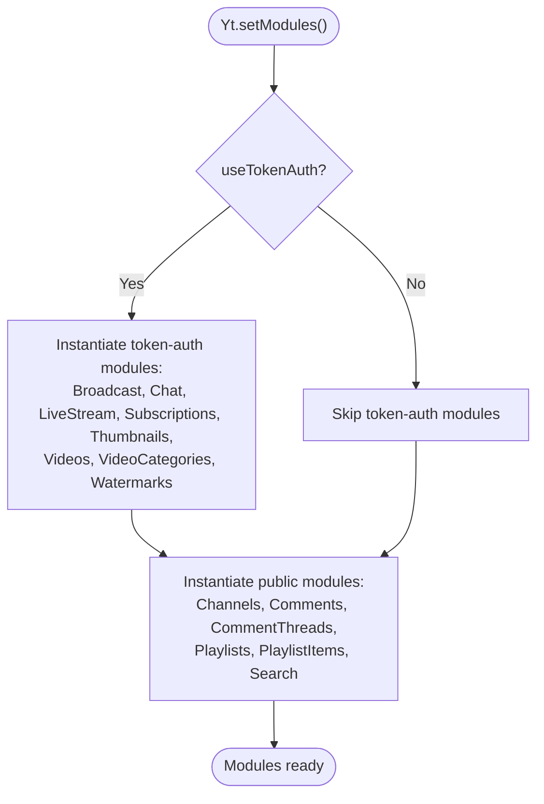
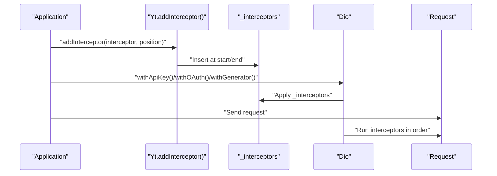
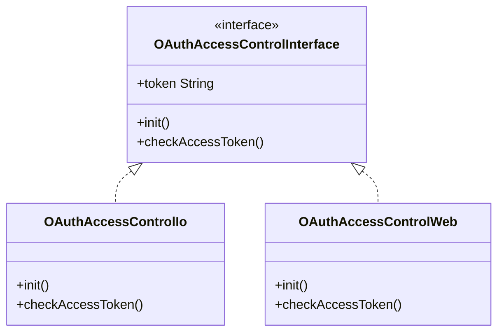
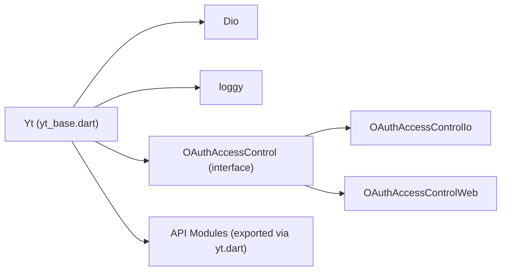

# Yt Class Entry Point

<cite>
**Referenced Files in This Document**
- [yt.dart](file://packages/yt/lib/yt.dart)
- [yt_base.dart](file://packages/yt/lib/src/yt_base.dart)
- [oauth_access_control_interface.dart](file://packages/yt/lib/src/oauth/oauth_access_control_interface.dart)
- [oauth_access_control_io.dart](file://packages/yt/lib/src/oauth/oauth_access_control_io.dart)
- [oauth_access_control_web.dart](file://packages/yt/lib/src/oauth/oauth_access_control_web.dart)
- [oauth.dart](file://packages/yt/lib/oauth.dart)
- [logging_interceptors.dart](file://packages/yt/lib/src/util/logging_interceptors.dart)
- [authorization_exception.dart](file://packages/yt/lib/src/util/authorization_exception.dart)
- [README.md](file://README.md)
</cite>

## Table of Contents
1. [Introduction](#introduction)
2. [Project Structure](#project-structure)
3. [Core Components](#core-components)
4. [Architecture Overview](#architecture-overview)
5. [Detailed Component Analysis](#detailed-component-analysis)
6. [Dependency Analysis](#dependency-analysis)
7. [Performance Considerations](#performance-considerations)
8. [Troubleshooting Guide](#troubleshooting-guide)
9. [Conclusion](#conclusion)

## Introduction
This document provides comprehensive technical documentation for the Yt class, the primary entry point of the YouTube API Dart SDK. It explains the factory constructors pattern used for authentication, including Yt.withApiKey(), Yt.withOAuth(), and Yt.withGenerator(). It covers initialization processes, parameter requirements, authentication flows, module relationships, shared configuration management, and the role of interceptors. Practical examples illustrate different authentication scenarios and best practices for various deployment environments.

## Project Structure
The yt package exposes a cohesive API surface through a central entry point and modularized domain modules. The Yt class orchestrates HTTP client configuration, authentication interceptors, and lazy instantiation of API modules. Authentication support is platform-aware and integrates with Google APIs authentication libraries.

**Diagram sources**
- [yt_base.dart:9-259](file://packages/yt/lib/src/yt_base.dart#L9-L259)
- [yt.dart:11-75](file://packages/yt/lib/yt.dart#L11-L75)

**Section sources**
- [yt.dart:11-75](file://packages/yt/lib/yt.dart#L11-L75)
- [yt_base.dart:9-259](file://packages/yt/lib/src/yt_base.dart#L9-L259)

## Core Components
- Yt class: Central entry point managing HTTP client, interceptors, logging, and module instantiation.
- Authentication factories:
  - Yt.withApiKey(): Initializes with an API key for read-only operations.
  - Yt.withOAuth(): Sets up OAuth-based bearer tokens with platform-specific access control.
  - Yt.withGenerator(): Uses a custom RefreshTokenGenerator to supply tokens.
- Module system: Lazy-initialized API modules (Channels, Playlists, Videos, etc.) share a single Dio instance.
- Interceptors: Logging and authorization interceptors are registered centrally and applied to all requests.

Key responsibilities:
- Initialize logging and register logging interceptors.
- Manage shared Dio instance and interceptor registry.
- Provide factory constructors for different authentication modes.
- Instantiate API modules with appropriate configuration (API key vs token auth).
- Expose convenience getters for each module, throwing meaningful errors for unsupported features under API key mode.

**Section sources**
- [yt_base.dart:76-259](file://packages/yt/lib/src/yt_base.dart#L76-L259)

## Architecture Overview
The Yt class acts as a singleton-like facade that configures a shared HTTP client and exposes typed API modules. Authentication is handled via interceptors that inject Authorization headers. Platform-specific OAuth access control is encapsulated behind an abstraction to support both native (IO) and web environments.

**Diagram sources**
- [yt_base.dart:88-169](file://packages/yt/lib/src/yt_base.dart#L88-L169)
- [oauth_access_control_interface.dart:7-32](file://packages/yt/lib/src/oauth/oauth_access_control_interface.dart#L7-L32)
- [oauth_access_control_io.dart:13-79](file://packages/yt/lib/src/oauth/oauth_access_control_io.dart#L13-L79)
- [oauth_access_control_web.dart:9-40](file://packages/yt/lib/src/oauth/oauth_access_control_web.dart#L9-L40)
- [logging_interceptors.dart](file://packages/yt/lib/src/util/logging_interceptors.dart)

## Detailed Component Analysis

### Factory Constructors Pattern and Authentication Flows
The Yt class provides three factory constructors to initialize the SDK with different authentication strategies:

- Yt.withApiKey(apiKey, {additionalHeaders})
  - Purpose: Configure the SDK for read-only operations using an API key.
  - Behavior:
    - Creates a Yt instance.
    - Calls setModules with apiKey to instantiate public-read modules.
    - Optionally merges additionalHeaders into the shared Dio options.
    - Applies previously registered interceptors to the shared Dio instance.
  - Use cases:
    - Public data retrieval (e.g., listing videos, playlists, search).
    - Environments where OAuth setup is unnecessary or restricted.
  - Limitations:
    - Certain modules (e.g., live streaming, chat, subscriptions) are unavailable and will throw an exception when accessed.

- Yt.withOAuth({clientId, logOptions})
  - Purpose: Configure OAuth-based authentication with automatic token management.
  - Behavior:
    - Creates a Yt instance with optional logging configuration.
    - Registers an Authorization interceptor that:
      - Instantiates OAuthAccessControl with the provided ClientId.
      - Ensures access token validity via checkAccessToken().
      - Injects Authorization: Bearer <token> into request headers.
    - Calls setModules with useTokenAuth=true to enable write-capable modules.
    - Applies previously registered interceptors to the shared Dio instance.
  - Platform differences:
    - OAuthAccessControlIo (native): Reads/writes credentials to a local file, obtains consent via user URL, refreshes tokens automatically.
    - OAuthAccessControlWeb (browser): Requests credentials via browser-based OAuth flow.
  - Use cases:
    - Full-data operations requiring user consent.
    - Server-side CLI tools and desktop applications.
    - Web applications with browser-based OAuth.

- Yt.withGenerator(refreshTokenGenerator, {logOptions})
  - Purpose: Supply tokens via a custom RefreshTokenGenerator for advanced scenarios.
  - Behavior:
    - Creates a Yt instance with optional logging configuration.
    - Generates an initial token from the generator.
    - Registers an Authorization interceptor that injects the current access token.
    - Calls setModules with useTokenAuth=true.
    - Applies previously registered interceptors to the shared Dio instance.
  - Use cases:
    - Third-party auth systems.
    - Multi-user or service-to-service deployments with centralized token management.

**Diagram sources**
- [yt_base.dart:109-141](file://packages/yt/lib/src/yt_base.dart#L109-L141)
- [oauth_access_control_interface.dart:10-16](file://packages/yt/lib/src/oauth/oauth_access_control_interface.dart#L10-L16)
- [oauth_access_control_io.dart:66-78](file://packages/yt/lib/src/oauth/oauth_access_control_io.dart#L66-L78)
- [oauth_access_control_web.dart:27-39](file://packages/yt/lib/src/oauth/oauth_access_control_web.dart#L27-L39)

**Section sources**
- [yt_base.dart:88-169](file://packages/yt/lib/src/yt_base.dart#L88-L169)
- [oauth_access_control_interface.dart:7-32](file://packages/yt/lib/src/oauth/oauth_access_control_interface.dart#L7-L32)
- [oauth_access_control_io.dart:13-79](file://packages/yt/lib/src/oauth/oauth_access_control_io.dart#L13-L79)
- [oauth_access_control_web.dart:9-40](file://packages/yt/lib/src/oauth/oauth_access_control_web.dart#L9-L40)

### Initialization Process and Parameter Requirements
- Yt constructor:
  - Accepts logOptions and a printer for logging configuration.
  - Initializes logging globally.
  - Registers a logging interceptor at the end of the interceptor chain.
- withApiKey():
  - Requires apiKey as a String.
  - Optional additionalHeaders as Map<String, String>.
  - Sets up modules for API key usage.
- withOAuth():
  - Optional oAuthClientId as ClientId.
  - Optional logOptions for logging configuration.
  - Registers an Authorization interceptor that depends on OAuthAccessControl.
- withGenerator():
  - Requires refreshTokenGenerator implementing RefreshTokenGenerator.
  - Optional logOptions for logging configuration.
  - Generates an initial token and registers an Authorization interceptor.

Common initialization patterns:
- Minimal OAuth setup: Yt.withOAuth() with default logging.
- Custom logging: Yt.withOAuth(logOptions: customOptions).
- API key with extra headers: Yt.withApiKey(key, additionalHeaders: {'X-Custom': 'value'}).
- Generator-based: Yt.withGenerator(generator) for centralized token management.

**Section sources**
- [yt_base.dart:76-86](file://packages/yt/lib/src/yt_base.dart#L76-L86)
- [yt_base.dart:88-103](file://packages/yt/lib/src/yt_base.dart#L88-L103)
- [yt_base.dart:109-141](file://packages/yt/lib/src/yt_base.dart#L109-L141)
- [yt_base.dart:143-169](file://packages/yt/lib/src/yt_base.dart#L143-L169)

### Module Management and Shared Configuration
- Shared HTTP client: A single Dio instance is maintained statically and reused across all modules.
- Interceptor registry: Static list of interceptors can be prepended or appended; applied to the shared Dio during construction.
- Lazy module instantiation: Modules are created on-demand and configured with the shared Dio and either apiKey or token auth.
- Availability constraints:
  - API key mode: Public-read modules are available; write-capable modules throw exceptions when accessed.
  - Token mode: All modules are available.

**Diagram sources**
- [yt_base.dart:187-255](file://packages/yt/lib/src/yt_base.dart#L187-L255)

**Section sources**
- [yt_base.dart:187-255](file://packages/yt/lib/src/yt_base.dart#L187-L255)

### Interceptors and Authentication Flow
- Logging interceptor: Registered during Yt construction to provide request/response logging.
- Authorization interceptor:
  - For OAuth: Wraps onRequest to ensure access token validity and injects Authorization header.
  - For Generator: Injects the current access token generated by the provider.
- Interceptor registry:
  - addInterceptor allows inserting at the start or end of the static list.
  - Applied to the shared Dio instance during factory construction.

**Diagram sources**
- [yt_base.dart:171-185](file://packages/yt/lib/src/yt_base.dart#L171-L185)
- [yt_base.dart:100-103](file://packages/yt/lib/src/yt_base.dart#L100-L103)
- [yt_base.dart:138-141](file://packages/yt/lib/src/yt_base.dart#L138-L141)
- [yt_base.dart:166-169](file://packages/yt/lib/src/yt_base.dart#L166-L169)

**Section sources**
- [yt_base.dart:171-185](file://packages/yt/lib/src/yt_base.dart#L171-L185)
- [yt_base.dart:100-103](file://packages/yt/lib/src/yt_base.dart#L100-L103)
- [yt_base.dart:138-141](file://packages/yt/lib/src/yt_base.dart#L138-L141)
- [yt_base.dart:166-169](file://packages/yt/lib/src/yt_base.dart#L166-L169)

### Platform-Specific OAuth Access Control
- OAuthAccessControl interface abstracts platform differences:
  - OAuthAccessControlIo (native): Manages credentials file, obtains consent, and refreshes tokens.
  - OAuthAccessControlWeb (browser): Requests credentials via browser OAuth flow.
- Both implementations expose token getter and lifecycle methods for initialization and token validation.

**Diagram sources**
- [oauth_access_control_interface.dart:7-32](file://packages/yt/lib/src/oauth/oauth_access_control_interface.dart#L7-L32)
- [oauth_access_control_io.dart:13-79](file://packages/yt/lib/src/oauth/oauth_access_control_io.dart#L13-L79)
- [oauth_access_control_web.dart:9-40](file://packages/yt/lib/src/oauth/oauth_access_control_web.dart#L9-L40)

**Section sources**
- [oauth_access_control_interface.dart:7-32](file://packages/yt/lib/src/oauth/oauth_access_control_interface.dart#L7-L32)
- [oauth_access_control_io.dart:13-79](file://packages/yt/lib/src/oauth/oauth_access_control_io.dart#L13-L79)
- [oauth_access_control_web.dart:9-40](file://packages/yt/lib/src/oauth/oauth_access_control_web.dart#L9-L40)

### Concrete Authentication Scenarios and Use Cases
- API Key Mode
  - Use case: Public read operations (e.g., listing videos, playlists).
  - Example pattern: Yt.withApiKey('YOUR_API_KEY') followed by accessing public modules.
  - Notes: Additional headers can be merged; write-capable modules are unavailable.

- OAuth Mode (Native)
  - Use case: Desktop CLI tools, server-side scripts requiring user consent.
  - Example pattern: Yt.withOAuth(oAuthClientId: yourClientId) to enable live streaming and chat operations.
  - Notes: Credentials are stored locally; tokens are refreshed automatically.

- OAuth Mode (Web)
  - Use case: Browser-based applications.
  - Example pattern: Yt.withOAuth() with browser environment providing OAuth flow.
  - Notes: No local credential storage; tokens managed by browser.

- Generator Mode
  - Use case: Service-to-service or centralized token management.
  - Example pattern: Yt.withGenerator(yourRefreshTokenGenerator) to supply tokens programmatically.
  - Notes: Ideal for multi-tenant or microservice architectures.

**Section sources**
- [yt_base.dart:88-103](file://packages/yt/lib/src/yt_base.dart#L88-L103)
- [yt_base.dart:109-141](file://packages/yt/lib/src/yt_base.dart#L109-L141)
- [yt_base.dart:143-169](file://packages/yt/lib/src/yt_base.dart#L143-L169)
- [oauth_access_control_io.dart:34-63](file://packages/yt/lib/src/oauth/oauth_access_control_io.dart#L34-L63)
- [oauth_access_control_web.dart:14-24](file://packages/yt/lib/src/oauth/oauth_access_control_web.dart#L14-L24)

## Dependency Analysis
- Internal dependencies:
  - Yt depends on Dio for HTTP transport and on OAuthAccessControl implementations for token management.
  - Interceptors are registered centrally and applied to the shared Dio instance.
- External dependencies:
  - googleapis_auth for OAuth flows and credential management.
  - loggy for structured logging.
- Exported modules:
  - The yt.dart exports all API modules and supporting utilities, enabling clean imports from the package root.

**Diagram sources**
- [yt_base.dart:1-5](file://packages/yt/lib/src/yt_base.dart#L1-L5)
- [oauth_access_control_interface.dart:1-6](file://packages/yt/lib/src/oauth/oauth_access_control_interface.dart#L1-L6)
- [oauth_access_control_io.dart:1-8](file://packages/yt/lib/src/oauth/oauth_access_control_io.dart#L1-L8)
- [oauth_access_control_web.dart:1-5](file://packages/yt/lib/src/oauth/oauth_access_control_web.dart#L1-L5)
- [yt.dart:11-75](file://packages/yt/lib/yt.dart#L11-L75)

**Section sources**
- [yt_base.dart:1-5](file://packages/yt/lib/src/yt_base.dart#L1-L5)
- [oauth_access_control_interface.dart:1-6](file://packages/yt/lib/src/oauth/oauth_access_control_interface.dart#L1-L6)
- [oauth_access_control_io.dart:1-8](file://packages/yt/lib/src/oauth/oauth_access_control_io.dart#L1-L8)
- [oauth_access_control_web.dart:1-5](file://packages/yt/lib/src/oauth/oauth_access_control_web.dart#L1-L5)
- [yt.dart:11-75](file://packages/yt/lib/yt.dart#L11-L75)

## Performance Considerations
- Single HTTP client: Reusing a single Dio instance reduces overhead and enables efficient connection pooling.
- Interceptor ordering: Place logging at the end to minimize processing cost for production deployments.
- Token caching: OAuth implementations cache credentials and refresh tokens automatically, reducing network calls.
- Lazy module loading: Modules are instantiated only when needed, minimizing startup costs.

## Troubleshooting Guide
- Module availability under API key mode:
  - Symptom: Accessing certain modules throws an exception indicating unavailability.
  - Cause: API key mode restricts operations to public reads.
  - Resolution: Switch to OAuth or Generator mode to enable write-capable modules.
- OAuth initialization failures:
  - Symptom: OAuth setup fails or prompts for consent repeatedly.
  - Causes: Missing ClientId, missing or corrupted credentials file (native), or browser OAuth restrictions.
  - Resolutions:
    - Provide a valid ClientId to the OAuth factory.
    - Ensure credentials file exists and is readable/writable (native).
    - Verify browser OAuth scopes and permissions.
- Token expiration:
  - Symptom: Unauthorized responses after extended periods.
  - Cause: Access token expired.
  - Resolution: OAuth implementations refresh tokens automatically; ensure network connectivity and proper initialization.
- Logging and diagnostics:
  - Enable detailed logging via logOptions to capture request/response details.
  - Add custom interceptors for tracing or metrics collection.

**Section sources**
- [yt_base.dart:16-17](file://packages/yt/lib/src/yt_base.dart#L16-L17)
- [yt_base.dart:34-36](file://packages/yt/lib/src/yt_base.dart#L34-L36)
- [yt_base.dart:40-41](file://packages/yt/lib/src/yt_base.dart#L40-L41)
- [yt_base.dart:47-49](file://packages/yt/lib/src/yt_base.dart#L47-L49)
- [yt_base.dart:57-59](file://packages/yt/lib/src/yt_base.dart#L57-L59)
- [yt_base.dart:61-63](file://packages/yt/lib/src/yt_base.dart#L61-L63)
- [yt_base.dart:65-67](file://packages/yt/lib/src/yt_base.dart#L65-L67)
- [yt_base.dart:68-70](file://packages/yt/lib/src/yt_base.dart#L68-L70)
- [yt_base.dart:71-74](file://packages/yt/lib/src/yt_base.dart#L71-L74)
- [oauth_access_control_io.dart:34-63](file://packages/yt/lib/src/oauth/oauth_access_control_io.dart#L34-L63)
- [oauth_access_control_web.dart:14-24](file://packages/yt/lib/src/oauth/oauth_access_control_web.dart#L14-L24)
- [logging_interceptors.dart](file://packages/yt/lib/src/util/logging_interceptors.dart)

## Conclusion
The Yt class serves as a robust, extensible entry point for the YouTube API Dart SDK. Its factory constructors accommodate diverse authentication needs, while its interceptor-driven architecture ensures consistent authorization and observability. The platform-aware OAuth access control simplifies deployment across native and web environments. By leveraging shared configuration and lazy module instantiation, the SDK balances performance and usability for a wide range of applications.