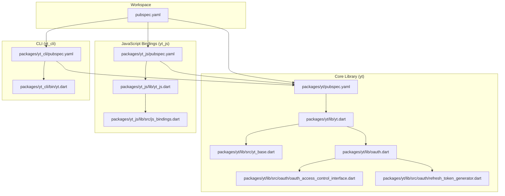
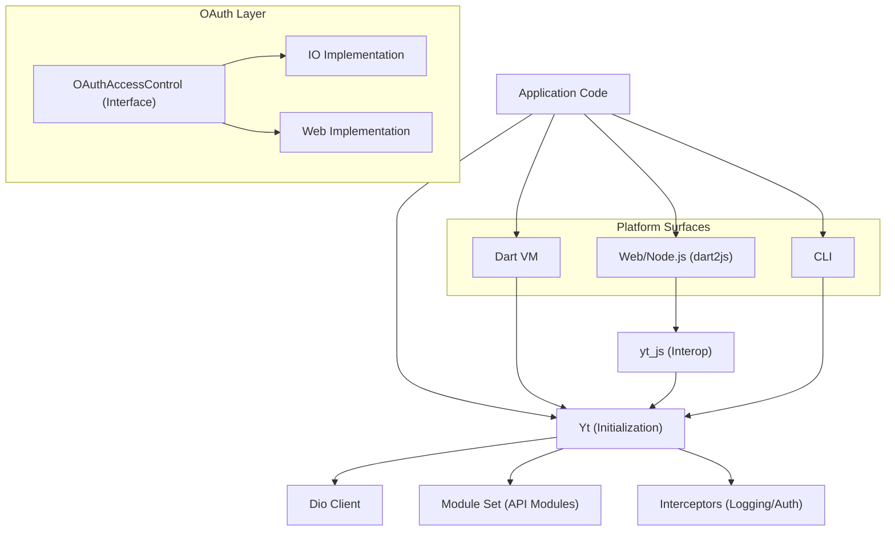
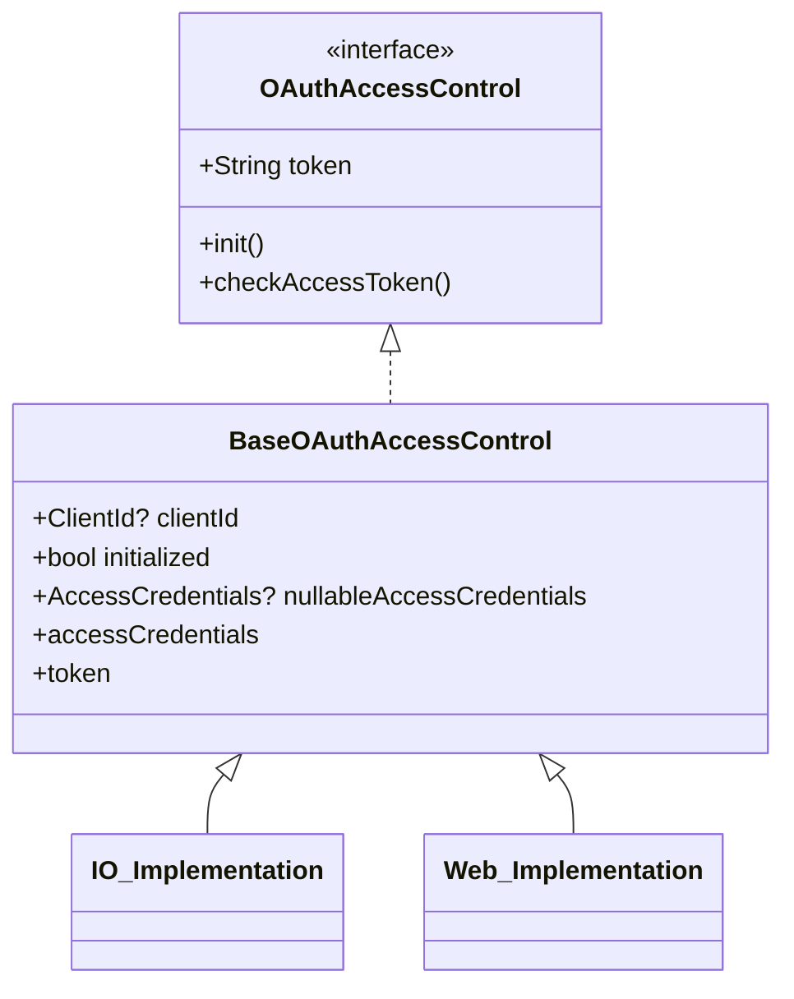
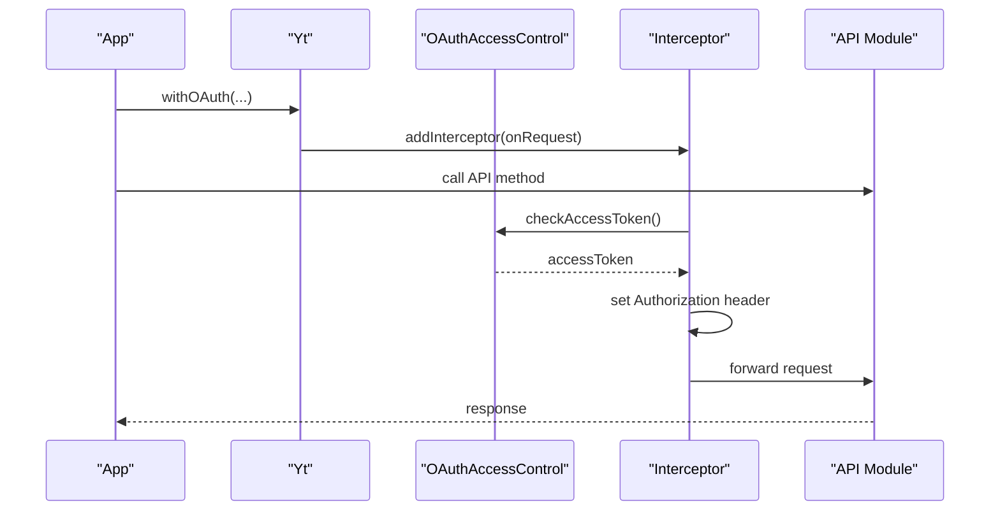
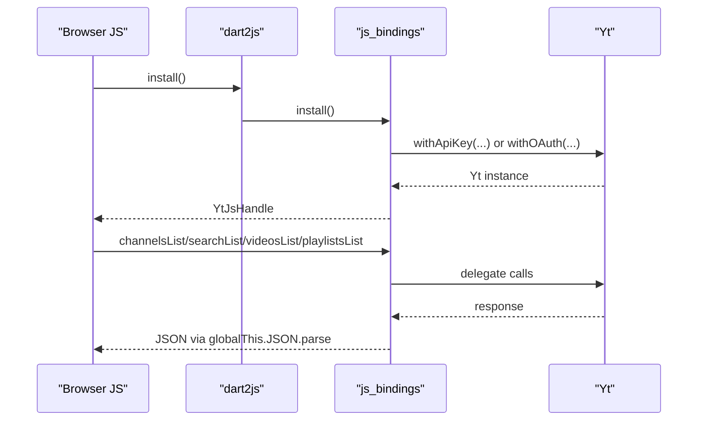
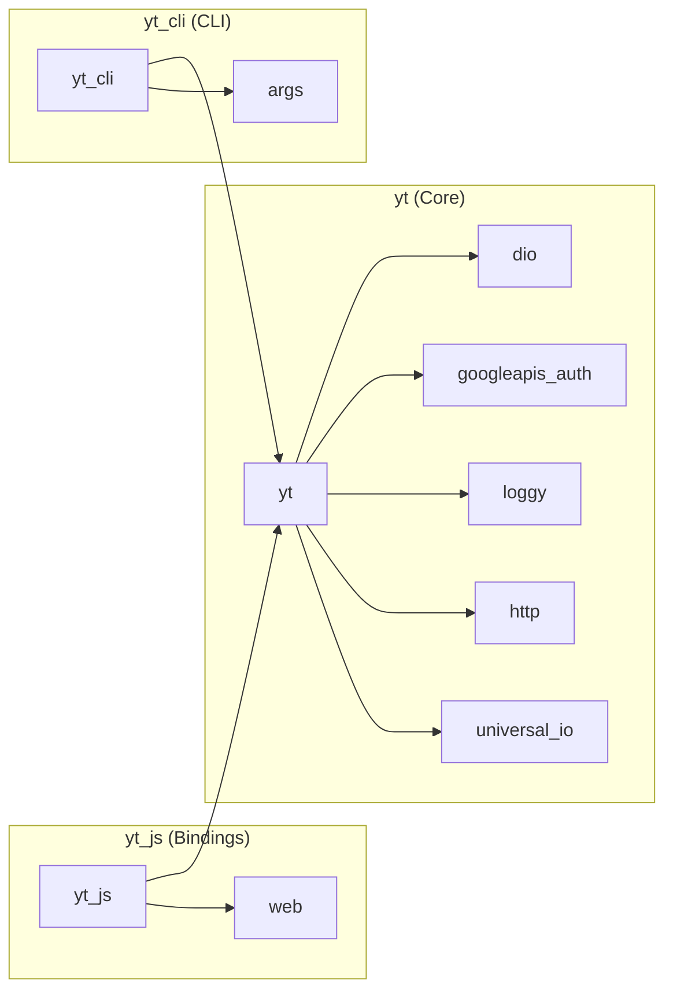

# Cross-Platform Support

<cite>
**Referenced Files in This Document**
- [README.md](file://README.md)
- [pubspec.yaml](file://pubspec.yaml)
- [packages/yt/pubspec.yaml](file://packages/yt/pubspec.yaml)
- [packages/yt_js/pubspec.yaml](file://packages/yt_js/pubspec.yaml)
- [packages/yt_cli/pubspec.yaml](file://packages/yt_cli/pubspec.yaml)
- [packages/yt/lib/yt.dart](file://packages/yt/lib/yt.dart)
- [packages/yt/lib/src/yt_base.dart](file://packages/yt/lib/src/yt_base.dart)
- [packages/yt/lib/oauth.dart](file://packages/yt/lib/oauth.dart)
- [packages/yt/lib/src/oauth/oauth_access_control_interface.dart](file://packages/yt/lib/src/oauth/oauth_access_control_interface.dart)
- [packages/yt/lib/src/oauth/refresh_token_generator.dart](file://packages/yt/lib/src/oauth/refresh_token_generator.dart)
- [packages/yt_js/lib/yt_js.dart](file://packages/yt_js/lib/yt_js.dart)
- [packages/yt_js/lib/src/js_bindings.dart](file://packages/yt_js/lib/src/js_bindings.dart)
- [packages/yt_cli/bin/yt.dart](file://packages/yt_cli/bin/yt.dart)
</cite>

## Table of Contents
1. [Introduction](#introduction)
2. [Project Structure](#project-structure)
3. [Core Components](#core-components)
4. [Architecture Overview](#architecture-overview)
5. [Detailed Component Analysis](#detailed-component-analysis)
6. [Dependency Analysis](#dependency-analysis)
7. [Performance Considerations](#performance-considerations)
8. [Troubleshooting Guide](#troubleshooting-guide)
9. [Conclusion](#conclusion)
10. [Appendices](#appendices)

## Introduction
This document explains cross-platform support for the YouTube API Dart SDK across three environments:
- Native Dart applications (Dart VM)
- Web browsers (via dart2js and JavaScript interop)
- Node.js environments (via the JavaScript bindings)

It covers platform-specific implementations, OAuth handling differences, authentication flows, practical examples, limitations, performance characteristics, and guidance for selecting the right platform for specific use cases.

## Project Structure
The workspace is organized as a Melos-managed monorepo containing:
- Core Dart library (yt): Provides the primary API surface and OAuth integration
- JavaScript bindings (yt_js): Exposes a minimal interop surface for web and Node.js
- CLI tool (yt_cli): A command-line interface built on the core library
- Additional packages (yt_mcp, yt_mcp_js) outside the scope of this document

**Diagram sources**
- [pubspec.yaml:1-69](file://pubspec.yaml#L1-L69)
- [packages/yt/pubspec.yaml:1-36](file://packages/yt/pubspec.yaml#L1-L36)
- [packages/yt_js/pubspec.yaml:1-19](file://packages/yt_js/pubspec.yaml#L1-L19)
- [packages/yt_cli/pubspec.yaml:1-31](file://packages/yt_cli/pubspec.yaml#L1-L31)
- [packages/yt/lib/yt.dart:1-75](file://packages/yt/lib/yt.dart#L1-L75)
- [packages/yt/lib/src/yt_base.dart:1-259](file://packages/yt/lib/src/yt_base.dart#L1-L259)
- [packages/yt/lib/oauth.dart:1-6](file://packages/yt/lib/oauth.dart#L1-L6)
- [packages/yt/lib/src/oauth/oauth_access_control_interface.dart:1-33](file://packages/yt/lib/src/oauth/oauth_access_control_interface.dart#L1-L33)
- [packages/yt/lib/src/oauth/refresh_token_generator.dart:1-6](file://packages/yt/lib/src/oauth/refresh_token_generator.dart#L1-L6)
- [packages/yt_js/lib/yt_js.dart:1-14](file://packages/yt_js/lib/yt_js.dart#L1-L14)
- [packages/yt_js/lib/src/js_bindings.dart:1-187](file://packages/yt_js/lib/src/js_bindings.dart#L1-L187)
- [packages/yt_cli/bin/yt.dart:1-38](file://packages/yt_cli/bin/yt.dart#L1-L38)

**Section sources**
- [README.md:1-119](file://README.md#L1-L119)
- [pubspec.yaml:1-69](file://pubspec.yaml#L1-L69)

## Core Components
- Core library (yt): Exports API modules (channels, playlists, videos, search, live streaming, chat, etc.) and provides initialization via API key or OAuth. It centralizes HTTP client configuration, interceptors, and module instantiation.
- OAuth abstraction: A platform-detecting interface that selects IO or Web implementations at compile-time.
- JavaScript bindings (yt_js): A minimal interop surface installed on a global namespace, enabling web and Node.js usage through dart2js.
- CLI tool (yt_cli): A command-line interface that leverages the core library for terminal-based workflows.

Key capabilities:
- API key mode: Suitable for read-only operations and public data.
- OAuth mode: Adds bearer token authorization and enables write/live features.
- Interceptors: Centralized logging and header injection for authenticated requests.
- Platform detection: OAuth access control adapts to IO or Web environments.

**Section sources**
- [packages/yt/lib/yt.dart:1-75](file://packages/yt/lib/yt.dart#L1-L75)
- [packages/yt/lib/src/yt_base.dart:1-259](file://packages/yt/lib/src/yt_base.dart#L1-L259)
- [packages/yt/lib/oauth.dart:1-6](file://packages/yt/lib/oauth.dart#L1-L6)
- [packages/yt/lib/src/oauth/oauth_access_control_interface.dart:1-33](file://packages/yt/lib/src/oauth/oauth_access_control_interface.dart#L1-L33)
- [packages/yt_js/lib/yt_js.dart:1-14](file://packages/yt_js/lib/yt_js.dart#L1-L14)
- [packages/yt_js/lib/src/js_bindings.dart:1-187](file://packages/yt_js/lib/src/js_bindings.dart#L1-L187)
- [packages/yt_cli/bin/yt.dart:1-38](file://packages/yt_cli/bin/yt.dart#L1-L38)

## Architecture Overview
The SDK separates concerns across layers:
- Initialization and interception: Yt manages Dio client, interceptors, and module wiring.
- Authentication: OAuthAccessControl provides a unified interface with platform-specific implementations.
- Platform surfaces:
  - Dart VM: Direct usage of the core library.
  - Web/Node.js: Minimal interop surface exposed via a global namespace for JavaScript consumption.
- CLI: Uses the core library to provide command-line operations.

**Diagram sources**
- [packages/yt/lib/src/yt_base.dart:1-259](file://packages/yt/lib/src/yt_base.dart#L1-L259)
- [packages/yt/lib/src/oauth/oauth_access_control_interface.dart:1-33](file://packages/yt/lib/src/oauth/oauth_access_control_interface.dart#L1-L33)
- [packages/yt_js/lib/src/js_bindings.dart:1-187](file://packages/yt_js/lib/src/js_bindings.dart#L1-L187)

## Detailed Component Analysis

### OAuth Access Control and Platform Selection
The OAuth layer uses conditional imports to select the appropriate implementation per platform:
- IO (Dart VM): Uses an IO-specific implementation for local environments.
- Web (browser): Uses a Web-specific implementation for browser contexts.

**Diagram sources**
- [packages/yt/lib/src/oauth/oauth_access_control_interface.dart:1-33](file://packages/yt/lib/src/oauth/oauth_access_control_interface.dart#L1-L33)

**Section sources**
- [packages/yt/lib/src/oauth/oauth_access_control_interface.dart:1-33](file://packages/yt/lib/src/oauth/oauth_access_control_interface.dart#L1-L33)

### Authentication Flows Across Platforms
- API Key Mode:
  - Initialize with an API key and use read-only modules.
  - No bearer token is attached; requests rely on the API key.
- OAuth Mode:
  - Intercept requests to inject Authorization headers with a bearer token.
  - The token originates from the OAuth access control, which selects the platform-appropriate implementation.
- Refresh Token Generator:
  - An external generator can supply tokens programmatically for environments where interactive flows are not suitable.

**Diagram sources**
- [packages/yt/lib/src/yt_base.dart:109-141](file://packages/yt/lib/src/yt_base.dart#L109-L141)
- [packages/yt/lib/src/oauth/oauth_access_control_interface.dart:13-15](file://packages/yt/lib/src/oauth/oauth_access_control_interface.dart#L13-L15)

**Section sources**
- [packages/yt/lib/src/yt_base.dart:109-141](file://packages/yt/lib/src/yt_base.dart#L109-L141)
- [packages/yt/lib/src/oauth/refresh_token_generator.dart:1-6](file://packages/yt/lib/src/oauth/refresh_token_generator.dart#L1-L6)

### Platform-Specific Implementations

#### Native Dart Applications (Dart VM)
- Use the core library directly.
- Initialize with API key for read-only operations or with OAuth for authenticated operations.
- Interceptors manage logging and token injection automatically.

Practical usage pattern:
- Initialize with API key for public reads.
- Initialize with OAuth to enable write/live features.

**Section sources**
- [packages/yt/lib/src/yt_base.dart:88-103](file://packages/yt/lib/src/yt_base.dart#L88-L103)
- [packages/yt/lib/src/yt_base.dart:109-141](file://packages/yt/lib/src/yt_base.dart#L109-L141)

#### Web Browsers (dart2js + JavaScript Interop)
- The JavaScript bindings install a global namespace with minimal interop-friendly methods.
- The TypeScript wrapper layer consumes these to provide a typed, Promise-based API.
- Initialization supports API key and OAuth modes.

Initialization and usage flow:
- Install the interop namespace.
- Call initialization methods to obtain a handle.
- Invoke operations and convert results to JavaScript values.

**Diagram sources**
- [packages/yt_js/lib/yt_js.dart:1-14](file://packages/yt_js/lib/yt_js.dart#L1-L14)
- [packages/yt_js/lib/src/js_bindings.dart:19-82](file://packages/yt_js/lib/src/js_bindings.dart#L19-L82)
- [packages/yt_js/lib/src/js_bindings.dart:84-173](file://packages/yt_js/lib/src/js_bindings.dart#L84-L173)
- [packages/yt_js/lib/src/js_bindings.dart:179-187](file://packages/yt_js/lib/src/js_bindings.dart#L179-L187)

**Section sources**
- [packages/yt_js/lib/yt_js.dart:1-14](file://packages/yt_js/lib/yt_js.dart#L1-L14)
- [packages/yt_js/lib/src/js_bindings.dart:1-187](file://packages/yt_js/lib/src/js_bindings.dart#L1-L187)

#### Node.js Environments
- Use the same JavaScript bindings as the web browser.
- The global namespace is available in Node.js runtime via the compiled module.
- Initialization and method invocation follow the same interop pattern as the browser.

Deployment considerations:
- Ensure the compiled JavaScript module is bundled or installed as an npm package.
- Manage logging levels and error handling consistently across environments.

**Section sources**
- [packages/yt_js/lib/src/js_bindings.dart:19-82](file://packages/yt_js/lib/src/js_bindings.dart#L19-L82)

### CLI Tool (Dart VM)
- Built on the core library, providing commands for all major API modules.
- Supports log-level configuration and integrates with the same OAuth and API key mechanisms.

**Section sources**
- [packages/yt_cli/bin/yt.dart:1-38](file://packages/yt_cli/bin/yt.dart#L1-L38)
- [packages/yt_cli/pubspec.yaml:1-31](file://packages/yt_cli/pubspec.yaml#L1-L31)

## Dependency Analysis
The core library depends on HTTP, authentication, and serialization packages. The JavaScript bindings depend on the core library plus web interop. The CLI depends on the core library plus argument parsing and IO.

**Diagram sources**
- [packages/yt/pubspec.yaml:17-29](file://packages/yt/pubspec.yaml#L17-L29)
- [packages/yt_js/pubspec.yaml:12-16](file://packages/yt_js/pubspec.yaml#L12-L16)
- [packages/yt_cli/pubspec.yaml:21-27](file://packages/yt_cli/pubspec.yaml#L21-L27)

**Section sources**
- [packages/yt/pubspec.yaml:17-29](file://packages/yt/pubspec.yaml#L17-L29)
- [packages/yt_js/pubspec.yaml:12-16](file://packages/yt_js/pubspec.yaml#L12-L16)
- [packages/yt_cli/pubspec.yaml:21-27](file://packages/yt_cli/pubspec.yaml#L21-L27)

## Performance Considerations
- Interceptors: Logging and token injection occur per request; keep logging levels appropriate for production to avoid overhead.
- HTTP client reuse: The SDK maintains a shared Dio client; avoid creating multiple clients to reduce connection overhead.
- Platform-specific behavior:
  - Web: JSON round-trip conversion through a global parser ensures compatibility but adds serialization cost; minimize unnecessary conversions.
  - CLI/Dart VM: Direct Dart-to-Dart calls are efficient; ensure network timeouts and retries are configured appropriately.
- Token lifecycle: Reuse tokens when possible and refresh only when required to reduce latency.

[No sources needed since this section provides general guidance]

## Troubleshooting Guide
Common issues and resolutions:
- Missing bearer token errors: Ensure OAuth initialization is used for authenticated operations; verify interceptors are registered.
- API key-only modules: Some modules are unavailable without OAuth; initialize with OAuth to unlock write/live features.
- Web interop failures: Confirm the interop namespace is installed and the global JSON object is available; check log levels and error messages.
- CLI usage errors: Verify command syntax and log-level options; ensure proper credentials are configured before running commands.

**Section sources**
- [packages/yt/lib/src/yt_base.dart:34-74](file://packages/yt/lib/src/yt_base.dart#L34-L74)
- [packages/yt_js/lib/src/js_bindings.dart:19-82](file://packages/yt_js/lib/src/js_bindings.dart#L19-L82)
- [packages/yt_cli/bin/yt.dart:30-36](file://packages/yt_cli/bin/yt.dart#L30-L36)

## Conclusion
The SDK provides a unified API surface across Dart VM, web browsers, and Node.js via a consistent OAuth abstraction and platform-specific interop. Choose the platform based on your deployment needs:
- Dart VM for native applications and CLI automation
- Web/Node.js via JavaScript bindings for browser-based integrations
- OAuth for authenticated operations; API key for read-only scenarios

Maintain consistent functionality by leveraging the same initialization patterns and interceptors across platforms.

[No sources needed since this section summarizes without analyzing specific files]

## Appendices

### Practical Examples by Platform

- Native Dart (Dart VM)
  - Initialize with API key for read-only operations.
  - Initialize with OAuth to enable write/live features.
  - Use exported modules to call APIs.

- Web (dart2js)
  - Install the interop namespace.
  - Initialize with API key or OAuth.
  - Call methods returning promises and handle JSON results.

- Node.js
  - Same as web; ensure the compiled module is available in the runtime.

**Section sources**
- [packages/yt/lib/src/yt_base.dart:88-103](file://packages/yt/lib/src/yt_base.dart#L88-L103)
- [packages/yt/lib/src/yt_base.dart:109-141](file://packages/yt/lib/src/yt_base.dart#L109-L141)
- [packages/yt_js/lib/yt_js.dart:1-14](file://packages/yt_js/lib/yt_js.dart#L1-L14)
- [packages/yt_js/lib/src/js_bindings.dart:19-82](file://packages/yt_js/lib/src/js_bindings.dart#L19-L82)

### Choosing the Right Platform
- Dart VM: Best for desktop/mobile apps and CLI tools.
- Web/Node.js: Best for browser-based dashboards and serverless frontends.
- OAuth vs API key: Use OAuth for write operations and live features; use API key for read-only public data.

[No sources needed since this section provides general guidance]