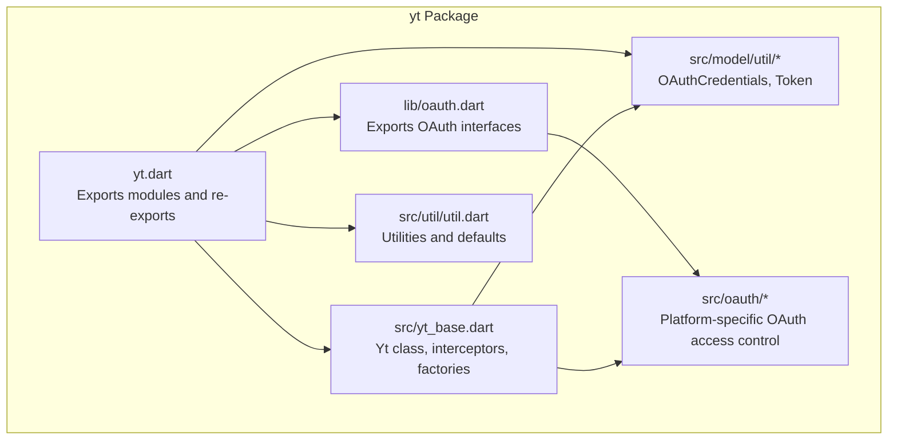
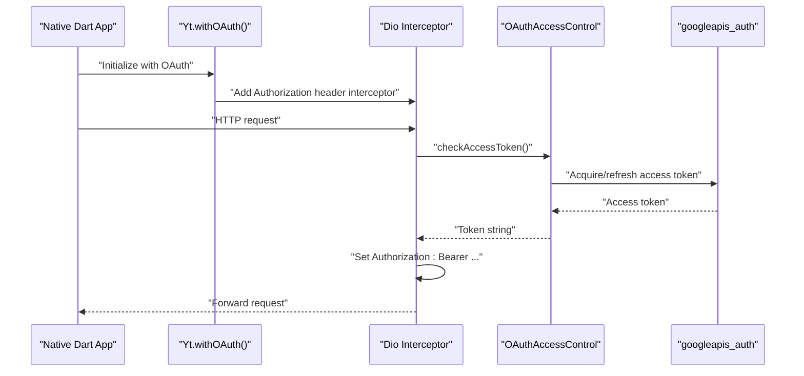
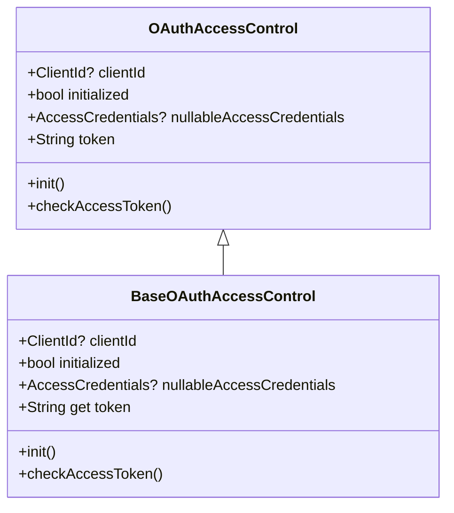
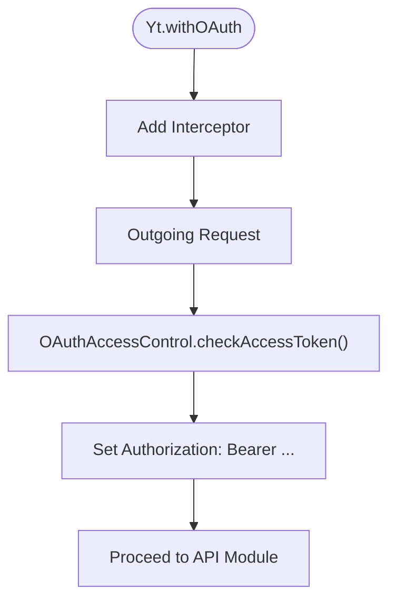
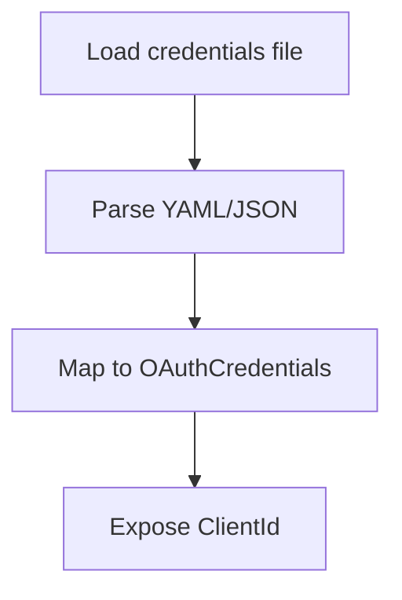
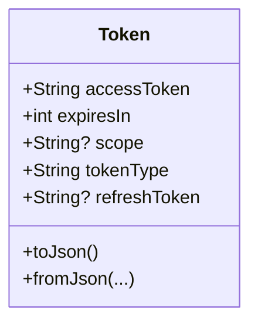
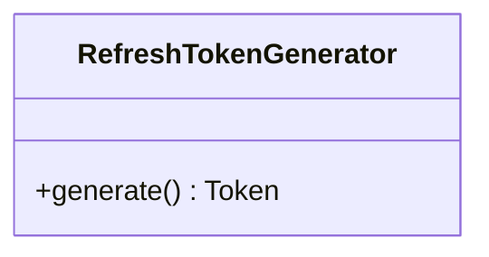
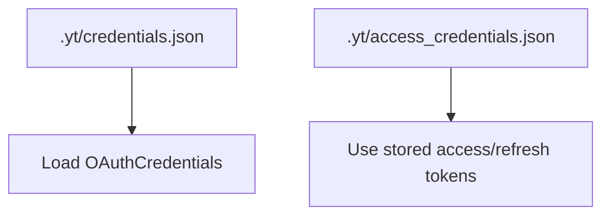
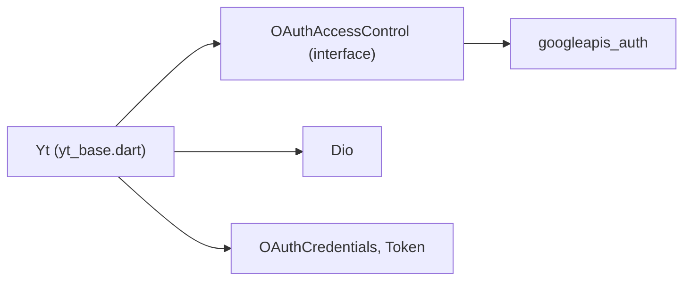

# Native Dart Applications

<cite>
**Referenced Files in This Document**
- [README.md](file://README.md)
- [packages/yt/README.md](file://packages/yt/README.md)
- [packages/yt/pubspec.yaml](file://packages/yt/pubspec.yaml)
- [packages/yt/lib/oauth.dart](file://packages/yt/lib/oauth.dart)
- [packages/yt/lib/yt.dart](file://packages/yt/lib/yt.dart)
- [packages/yt/lib/src/oauth/oauth_access_control_interface.dart](file://packages/yt/lib/src/oauth/oauth_access_control_interface.dart)
- [packages/yt/lib/src/oauth/refresh_token_generator.dart](file://packages/yt/lib/src/oauth/refresh_token_generator.dart)
- [packages/yt/lib/src/model/util/oauth_credentials.dart](file://packages/yt/lib/src/model/util/oauth_credentials.dart)
- [packages/yt/lib/src/model/util/token.dart](file://packages/yt/lib/src/model/util/token.dart)
- [packages/yt/lib/src/yt_base.dart](file://packages/yt/lib/src/yt_base.dart)
- [packages/yt/lib/src/util/util.dart](file://packages/yt/lib/src/util/util.dart)
</cite>

## Table of Contents
1. [Introduction](#introduction)
2. [Project Structure](#project-structure)
3. [Core Components](#core-components)
4. [Architecture Overview](#architecture-overview)
5. [Detailed Component Analysis](#detailed-component-analysis)
6. [Dependency Analysis](#dependency-analysis)
7. [Performance Considerations](#performance-considerations)
8. [Troubleshooting Guide](#troubleshooting-guide)
9. [Conclusion](#conclusion)
10. [Appendices](#appendices)

## Introduction
This document explains how native Dart applications integrate with the YouTube Data and Live Streaming APIs through the yt package. It focuses on OAuth 2.0 for Dart VM environments, covering authentication flows for desktop and server applications, credential storage, refresh token handling, and offline access. It also outlines platform-specific considerations such as file system access, network connectivity, and background processing, along with security best practices and production deployment guidance for native Dart applications.

## Project Structure
The yt workspace contains multiple packages. The core library for YouTube APIs resides under packages/yt. Authentication and OAuth-related code is organized under yt/lib and yt/lib/src, with platform-specific OAuth access control implemented via conditional imports.

**Diagram sources**
- [packages/yt/lib/yt.dart:1-75](file://packages/yt/lib/yt.dart#L1-L75)
- [packages/yt/lib/oauth.dart:1-6](file://packages/yt/lib/oauth.dart#L1-L6)
- [packages/yt/lib/src/oauth/oauth_access_control_interface.dart:1-33](file://packages/yt/lib/src/oauth/oauth_access_control_interface.dart#L1-L33)
- [packages/yt/lib/src/model/util/oauth_credentials.dart:1-55](file://packages/yt/lib/src/model/util/oauth_credentials.dart#L1-L55)
- [packages/yt/lib/src/model/util/token.dart:1-29](file://packages/yt/lib/src/model/util/token.dart#L1-L29)
- [packages/yt/lib/src/yt_base.dart:1-259](file://packages/yt/lib/src/yt_base.dart#L1-L259)
- [packages/yt/lib/src/util/util.dart:1-104](file://packages/yt/lib/src/util/util.dart#L1-L104)

**Section sources**
- [README.md:1-119](file://README.md#L1-L119)
- [packages/yt/README.md:1-523](file://packages/yt/README.md#L1-L523)
- [packages/yt/lib/yt.dart:1-75](file://packages/yt/lib/yt.dart#L1-L75)
- [packages/yt/lib/oauth.dart:1-6](file://packages/yt/lib/oauth.dart#L1-L6)
- [packages/yt/lib/src/yt_base.dart:1-259](file://packages/yt/lib/src/yt_base.dart#L1-L259)

## Core Components
- Yt class: Provides factories for authentication modes (OAuth, API key, custom generator), sets up Dio interceptors, and exposes API modules.
- OAuthAccessControl: Platform abstraction for OAuth token acquisition and refresh, selected via conditional imports for io vs web.
- OAuthCredentials: Loads OAuth client credentials from YAML or JSON files.
- Token: Represents OAuth token data, including optional refresh token.
- RefreshTokenGenerator: Pluggable generator for tokens in custom flows.
- Utilities: Defaults for credential file paths and helpers.

Key responsibilities:
- OAuth factory configures an Authorization header interceptor that ensures each request carries a valid access token.
- Credential loading supports YAML and JSON formats for client identifiers and secrets.
- Token model supports refresh token persistence and reuse.

**Section sources**
- [packages/yt/lib/src/yt_base.dart:88-169](file://packages/yt/lib/src/yt_base.dart#L88-L169)
- [packages/yt/lib/src/oauth/oauth_access_control_interface.dart:1-33](file://packages/yt/lib/src/oauth/oauth_access_control_interface.dart#L1-L33)
- [packages/yt/lib/src/model/util/oauth_credentials.dart:1-55](file://packages/yt/lib/src/model/util/oauth_credentials.dart#L1-L55)
- [packages/yt/lib/src/model/util/token.dart:1-29](file://packages/yt/lib/src/model/util/token.dart#L1-L29)
- [packages/yt/lib/src/oauth/refresh_token_generator.dart:1-6](file://packages/yt/lib/src/oauth/refresh_token_generator.dart#L1-L6)
- [packages/yt/lib/src/util/util.dart:63-65](file://packages/yt/lib/src/util/util.dart#L63-L65)

## Architecture Overview
The OAuth flow for native Dart relies on googleapis_auth and Dio interceptors. The Yt.withOAuth factory installs an interceptor that obtains or refreshes an access token before each request. Platform-specific OAuth access control is selected automatically via conditional imports.

**Diagram sources**
- [packages/yt/lib/src/yt_base.dart:109-141](file://packages/yt/lib/src/yt_base.dart#L109-L141)
- [packages/yt/lib/src/oauth/oauth_access_control_interface.dart:10-16](file://packages/yt/lib/src/oauth/oauth_access_control_interface.dart#L10-L16)

**Section sources**
- [packages/yt/lib/src/yt_base.dart:109-141](file://packages/yt/lib/src/yt_base.dart#L109-L141)
- [packages/yt/lib/src/oauth/oauth_access_control_interface.dart:1-33](file://packages/yt/lib/src/oauth/oauth_access_control_interface.dart#L1-L33)

## Detailed Component Analysis

### OAuth Access Control Abstraction
The OAuthAccessControl class defines the contract for acquiring and refreshing tokens. It selects platform-specific implementations using conditional imports, enabling the same API surface across io and web targets.

**Diagram sources**
- [packages/yt/lib/src/oauth/oauth_access_control_interface.dart:7-32](file://packages/yt/lib/src/oauth/oauth_access_control_interface.dart#L7-L32)

**Section sources**
- [packages/yt/lib/src/oauth/oauth_access_control_interface.dart:1-33](file://packages/yt/lib/src/oauth/oauth_access_control_interface.dart#L1-L33)

### Yt OAuth Factory and Interceptors
The Yt.withOAuth factory configures Dio interceptors to inject Authorization headers. It delegates token retrieval to OAuthAccessControl and ensures modules requiring token authentication are available.

**Diagram sources**
- [packages/yt/lib/src/yt_base.dart:109-141](file://packages/yt/lib/src/yt_base.dart#L109-L141)

**Section sources**
- [packages/yt/lib/src/yt_base.dart:109-141](file://packages/yt/lib/src/yt_base.dart#L109-L141)

### OAuth Credentials Loading
OAuthCredentials supports loading client identifiers and secrets from YAML and JSON sources. It exposes a ClientId getter suitable for initializing OAuth flows.

**Diagram sources**
- [packages/yt/lib/src/model/util/oauth_credentials.dart:19-48](file://packages/yt/lib/src/model/util/oauth_credentials.dart#L19-L48)

**Section sources**
- [packages/yt/lib/src/model/util/oauth_credentials.dart:1-55](file://packages/yt/lib/src/model/util/oauth_credentials.dart#L1-L55)

### Token Model and Refresh Tokens
Token encapsulates access token, expiry, token type, and optional refresh token. This enables storing and reusing refresh tokens for offline access scenarios.

**Diagram sources**
- [packages/yt/lib/src/model/util/token.dart:5-28](file://packages/yt/lib/src/model/util/token.dart#L5-L28)

**Section sources**
- [packages/yt/lib/src/model/util/token.dart:1-29](file://packages/yt/lib/src/model/util/token.dart#L1-L29)

### Refresh Token Generator
RefreshTokenGenerator is an interface for pluggable token generation, enabling custom flows such as service accounts or pre-provisioned tokens.

**Diagram sources**
- [packages/yt/lib/src/oauth/refresh_token_generator.dart:3-5](file://packages/yt/lib/src/oauth/refresh_token_generator.dart#L3-L5)

**Section sources**
- [packages/yt/lib/src/oauth/refresh_token_generator.dart:1-6](file://packages/yt/lib/src/oauth/refresh_token_generator.dart#L1-L6)

### Credential Storage Defaults
The library defines default file paths for credentials and access credentials, facilitating automated storage and retrieval in native environments.

**Diagram sources**
- [packages/yt/lib/src/util/util.dart:63-65](file://packages/yt/lib/src/util/util.dart#L63-L65)

**Section sources**
- [packages/yt/lib/src/util/util.dart:63-65](file://packages/yt/lib/src/util/util.dart#L63-L65)

## Dependency Analysis
The yt package depends on googleapis_auth for OAuth operations and Dio for HTTP request interception. The OAuth factory integrates these dependencies to manage tokens transparently.

**Diagram sources**
- [packages/yt/lib/src/yt_base.dart:1-259](file://packages/yt/lib/src/yt_base.dart#L1-L259)
- [packages/yt/lib/src/oauth/oauth_access_control_interface.dart:1-33](file://packages/yt/lib/src/oauth/oauth_access_control_interface.dart#L1-L33)
- [packages/yt/lib/src/model/util/oauth_credentials.dart:1-55](file://packages/yt/lib/src/model/util/oauth_credentials.dart#L1-L55)
- [packages/yt/lib/src/model/util/token.dart:1-29](file://packages/yt/lib/src/model/util/token.dart#L1-L29)
- [packages/yt/pubspec.yaml:17-29](file://packages/yt/pubspec.yaml#L17-L29)

**Section sources**
- [packages/yt/pubspec.yaml:17-29](file://packages/yt/pubspec.yaml#L17-L29)
- [packages/yt/lib/src/yt_base.dart:1-259](file://packages/yt/lib/src/yt_base.dart#L1-L259)

## Performance Considerations
- Minimize token refresh frequency by batching requests and leveraging cached responses where appropriate.
- Use Dio interceptors to avoid redundant token checks per request.
- Prefer long-lived offline access with refresh tokens for server applications to reduce interactive login overhead.
- Tune logging levels to reduce overhead in production deployments.

## Troubleshooting Guide
Common issues and remedies:
- Missing or invalid credentials: Ensure YAML/JSON credentials are present and readable at the expected default path.
- Token expiration: Rely on the interceptor’s token check to refresh automatically; verify that refresh tokens are persisted when available.
- Network connectivity: Confirm outbound HTTPS access to Google APIs; configure proxies if required by the environment.
- File system permissions: Ensure the process has read/write access to the default credential directories.

Operational references:
- Default credential file paths are defined for credentials and access credentials.
- The OAuth factory installs an Authorization header interceptor for all requests.

**Section sources**
- [packages/yt/lib/src/util/util.dart:63-65](file://packages/yt/lib/src/util/util.dart#L63-L65)
- [packages/yt/lib/src/yt_base.dart:109-141](file://packages/yt/lib/src/yt_base.dart#L109-L141)

## Conclusion
The yt package provides a cohesive OAuth integration for native Dart applications using googleapis_auth and Dio interceptors. It supports desktop and server environments through platform-specific OAuth access control, offers flexible credential loading, and enables offline access via refresh tokens. By following the recommended patterns and security practices outlined here, developers can build robust, production-ready native Dart applications that interact with YouTube APIs.

## Appendices

### Practical Setup Examples (paths only)
- Initialize OAuth with default credentials file:
  - [packages/yt/README.md:157-175](file://packages/yt/README.md#L157-L175)
- Generate credentials using the CLI:
  - [packages/yt/README.md:139-151](file://packages/yt/README.md#L139-L151)
- Use OAuth credentials from YAML/JSON:
  - [packages/yt/lib/src/model/util/oauth_credentials.dart:19-48](file://packages/yt/lib/src/model/util/oauth_credentials.dart#L19-L48)
- Configure Dio interceptors and Authorization headers:
  - [packages/yt/lib/src/yt_base.dart:109-141](file://packages/yt/lib/src/yt_base.dart#L109-L141)

### Security Best Practices
- Store refresh tokens securely and restrict file system permissions.
- Rotate client credentials periodically and revoke compromised tokens.
- Limit token scopes to the minimum required for the application’s tasks.
- Monitor token lifecycles and handle token revocation gracefully.

### Production Deployment Considerations
- Ensure outbound HTTPS access to Google APIs is permitted.
- Persist credentials and tokens in secure, non-temporary locations.
- Use refresh tokens for long-running processes to avoid interactive login interruptions.
- Instrument logging appropriately for diagnostics without exposing sensitive data.