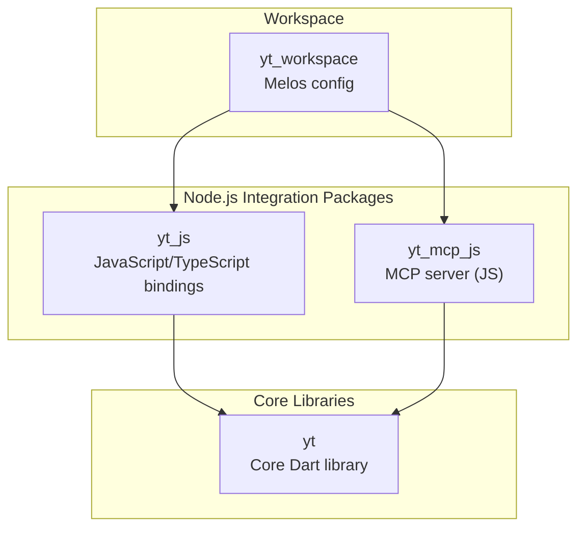
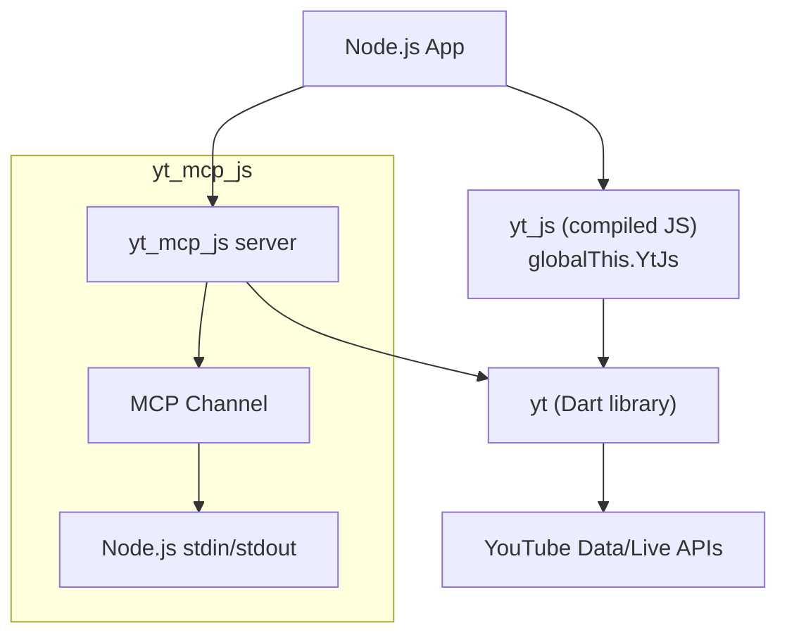
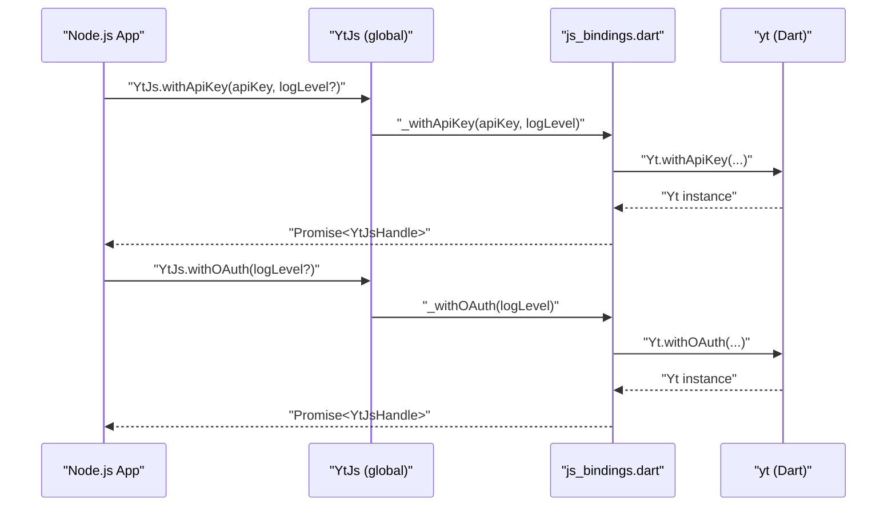
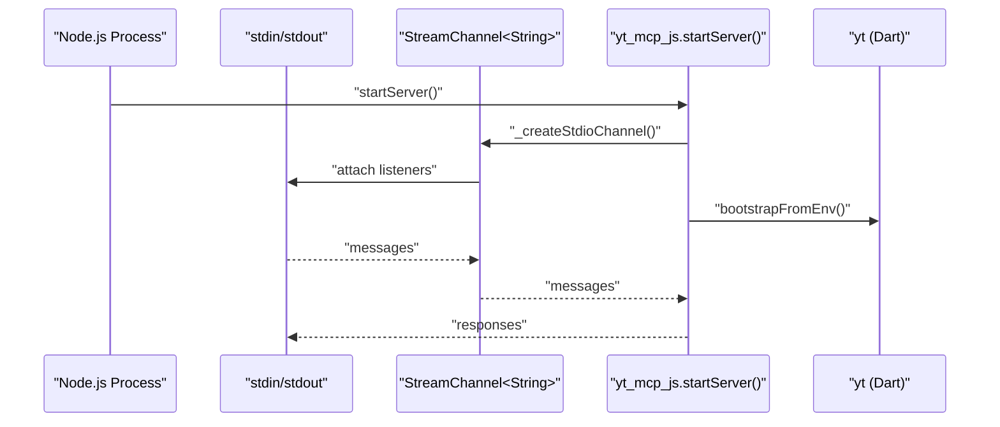
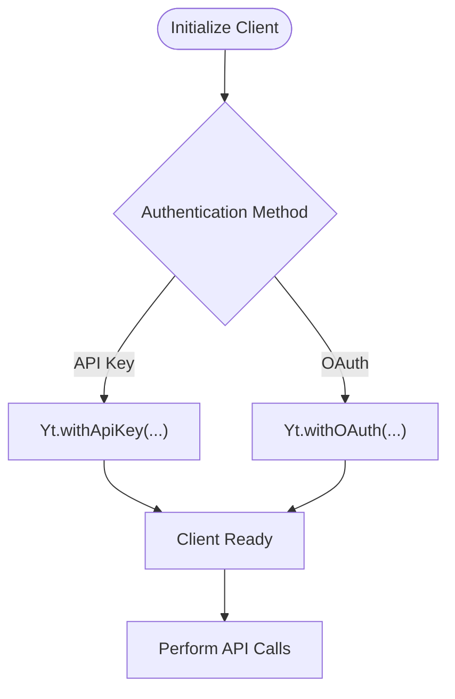
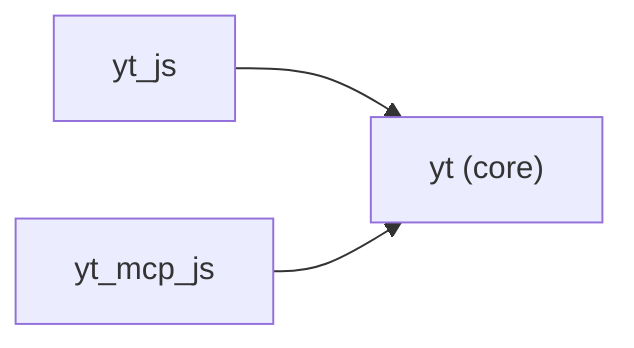

# Node.js Integration

<cite>
**Referenced Files in This Document**
- [README.md](file://README.md)
- [pubspec.yaml](file://pubspec.yaml)
- [packages/yt_js/pubspec.yaml](file://packages/yt_js/pubspec.yaml)
- [packages/yt_js/README.md](file://packages/yt_js/README.md)
- [packages/yt_js/lib/yt_js.dart](file://packages/yt_js/lib/yt_js.dart)
- [packages/yt_js/lib/src/js_bindings.dart](file://packages/yt_js/lib/src/js_bindings.dart)
- [packages/yt_mcp_js/pubspec.yaml](file://packages/yt_mcp_js/pubspec.yaml)
- [packages/yt_mcp_js/README.md](file://packages/yt_mcp_js/README.md)
- [packages/yt_mcp_js/lib/yt_mcp_js.dart](file://packages/yt_mcp_js/lib/yt_mcp_js.dart)
- [packages/yt_mcp_js/lib/src/js_bindings.dart](file://packages/yt_mcp_js/lib/src/js_bindings.dart)
- [packages/yt/pubspec.yaml](file://packages/yt/pubspec.yaml)
- [packages/yt/README.md](file://packages/yt/README.md)
- [packages/yt/lib/oauth.dart](file://packages/yt/lib/oauth.dart)
</cite>

## Table of Contents
1. [Introduction](#introduction)
2. [Project Structure](#project-structure)
3. [Core Components](#core-components)
4. [Architecture Overview](#architecture-overview)
5. [Detailed Component Analysis](#detailed-component-analysis)
6. [Dependency Analysis](#dependency-analysis)
7. [Performance Considerations](#performance-considerations)
8. [Troubleshooting Guide](#troubleshooting-guide)
9. [Conclusion](#conclusion)
10. [Appendices](#appendices)

## Introduction
This document explains how to integrate the YouTube API Dart SDK into Node.js environments. It focuses on:
- JavaScript/TypeScript bindings for Node.js via the yt_js package
- The MCP server implementation compiled to JavaScript for Node.js via yt_mcp_js
- Authentication flows in server-side contexts, including OAuth and credential management
- Environment variable configuration, installation, and integration with existing Node.js applications
- Practical examples for building chatbots with the MCP protocol and integrating with Node.js frameworks
- Performance optimization, memory management, and production deployment strategies

## Project Structure
The repository is a Melos-managed workspace containing multiple Dart packages. For Node.js integration, the most relevant packages are:
- yt_js: JavaScript/TypeScript bindings compiled for browser and Node.js
- yt_mcp_js: MCP server compiled to JavaScript for Node.js execution
- yt: Core Dart library providing YouTube Data and Live Streaming APIs
- yt_cli and yt_mcp: Related packages for CLI and MCP server in Dart

**Diagram sources**
- [pubspec.yaml:17-21](file://pubspec.yaml#L17-L21)
- [packages/yt_js/pubspec.yaml:12-15](file://packages/yt_js/pubspec.yaml#L12-L15)
- [packages/yt_mcp_js/pubspec.yaml:10-16](file://packages/yt_mcp_js/pubspec.yaml#L10-L16)

**Section sources**
- [README.md:8-18](file://README.md#L8-L18)
- [pubspec.yaml:17-21](file://pubspec.yaml#L17-L21)

## Core Components
- yt_js: Provides a minimal interop surface installed on a global namespace, enabling Node.js applications to initialize clients with API keys or OAuth and perform basic YouTube API operations. It wraps the core yt library and exposes a Promise-based surface to JavaScript/TypeScript.
- yt_mcp_js: Bridges Node.js stdin/stdout to an MCP transport and launches an MCP server that surfaces YouTube Data and Live Streaming capabilities. It reads credentials from environment variables and logs debug information via an environment flag.

Key capabilities:
- yt_js: API key and OAuth initialization, channel/search/video/playlist listing, close handle
- yt_mcp_js: Stdio-based MCP transport, environment-driven bootstrap, debug logging

**Section sources**
- [packages/yt_js/README.md:17-25](file://packages/yt_js/README.md#L17-L25)
- [packages/yt_js/lib/src/js_bindings.dart:19-65](file://packages/yt_js/lib/src/js_bindings.dart#L19-L65)
- [packages/yt_mcp_js/README.md:23-33](file://packages/yt_mcp_js/README.md#L23-L33)
- [packages/yt_mcp_js/lib/src/js_bindings.dart:32-48](file://packages/yt_mcp_js/lib/src/js_bindings.dart#L32-L48)

## Architecture Overview
The Node.js integration relies on dart2js compilation to produce JavaScript bundles consumable by Node.js. The flow for both libraries is:
- Application code initializes the library via the global namespace exposed by the compiled bundle
- The binding layer translates JS calls into Dart invocations
- The core yt library performs HTTP requests to YouTube APIs using platform-appropriate transports
- For yt_mcp_js, stdin/stdout are bridged to an MCP channel for protocol communication

**Diagram sources**
- [packages/yt_js/lib/yt_js.dart:11-13](file://packages/yt_js/lib/yt_js.dart#L11-L13)
- [packages/yt_js/lib/src/js_bindings.dart:19-25](file://packages/yt_js/lib/src/js_bindings.dart#L19-L25)
- [packages/yt_mcp_js/lib/yt_mcp_js.dart:3-5](file://packages/yt_mcp_js/lib/yt_mcp_js.dart#L3-L5)
- [packages/yt_mcp_js/lib/src/js_bindings.dart:52-64](file://packages/yt_mcp_js/lib/src/js_bindings.dart#L52-L64)

## Detailed Component Analysis

### JavaScript/TypeScript Bindings (yt_js)
The yt_js package compiles the core yt library to JavaScript and exposes a minimal global namespace for initialization and basic operations. It supports:
- Initialization with API key
- Initialization with OAuth
- Logging level configuration
- Channel/Search/Video/Playlist listing
- Handle lifecycle management

**Diagram sources**
- [packages/yt_js/lib/src/js_bindings.dart:32-65](file://packages/yt_js/lib/src/js_bindings.dart#L32-L65)

Implementation highlights:
- Global namespace installation and method exposure
- Promise-based wrappers for async operations
- JSON round-trip conversion for interoperability
- Optional logging configuration

**Section sources**
- [packages/yt_js/lib/yt_js.dart:11-13](file://packages/yt_js/lib/yt_js.dart#L11-L13)
- [packages/yt_js/lib/src/js_bindings.dart:19-82](file://packages/yt_js/lib/src/js_bindings.dart#L19-L82)
- [packages/yt_js/lib/src/js_bindings.dart:86-173](file://packages/yt_js/lib/src/js_bindings.dart#L86-L173)
- [packages/yt_js/lib/src/js_bindings.dart:182-186](file://packages/yt_js/lib/src/js_bindings.dart#L182-L186)

### MCP Server for Node.js (yt_mcp_js)
The yt_mcp_js package runs an MCP server in Node.js by bridging stdin/stdout to an MCP channel. It:
- Creates a StreamChannel over Node.js stdin/stdout
- Bootstraps the YouTube connection from environment variables
- Keeps the process alive while the channel remains open
- Supports debug logging via an environment variable

**Diagram sources**
- [packages/yt_mcp_js/lib/yt_mcp_js.dart:3-5](file://packages/yt_mcp_js/lib/yt_mcp_js.dart#L3-L5)
- [packages/yt_mcp_js/lib/src/js_bindings.dart:32-48](file://packages/yt_mcp_js/lib/src/js_bindings.dart#L32-L48)
- [packages/yt_mcp_js/lib/src/js_bindings.dart:52-64](file://packages/yt_mcp_js/lib/src/js_bindings.dart#L52-L64)
- [packages/yt_mcp_js/lib/src/js_bindings.dart:68-121](file://packages/yt_mcp_js/lib/src/js_bindings.dart#L68-L121)

Operational notes:
- Environment-driven bootstrap for credentials
- Debug logging controlled by an environment variable
- Process lifecycle tied to stdin closure

**Section sources**
- [packages/yt_mcp_js/lib/yt_mcp_js.dart:3-5](file://packages/yt_mcp_js/lib/yt_mcp_js.dart#L3-L5)
- [packages/yt_mcp_js/lib/src/js_bindings.dart:17-26](file://packages/yt_mcp_js/lib/src/js_bindings.dart#L17-L26)
- [packages/yt_mcp_js/lib/src/js_bindings.dart:32-48](file://packages/yt_mcp_js/lib/src/js_bindings.dart#L32-L48)
- [packages/yt_mcp_js/lib/src/js_bindings.dart:68-121](file://packages/yt_mcp_js/lib/src/js_bindings.dart#L68-L121)

### Authentication Flow Differences in Node.js
- API Key Authentication: Supported in both browser and Node.js via the API key initialization path. This enables read-only access to public data.
- OAuth2 Authentication: The core library supports OAuth2 and can be initialized with OAuth credentials. In Node.js, OAuth flows typically involve server-side handling of tokens and persistence of refresh tokens. The library’s OAuth layer is designed to avoid platform-specific I/O dependencies, enabling broader compatibility.

**Diagram sources**
- [packages/yt_js/lib/src/js_bindings.dart:32-65](file://packages/yt_js/lib/src/js_bindings.dart#L32-L65)
- [packages/yt/README.md:111-151](file://packages/yt/README.md#L111-L151)

**Section sources**
- [packages/yt_js/lib/src/js_bindings.dart:32-65](file://packages/yt_js/lib/src/js_bindings.dart#L32-L65)
- [packages/yt/README.md:111-151](file://packages/yt/README.md#L111-L151)
- [packages/yt/lib/oauth.dart:1-6](file://packages/yt/lib/oauth.dart#L1-L6)

### Environment Variable Configuration for Node.js
- yt_mcp_js supports debug logging via an environment variable and expects credentials to be provided through environment variables for bootstrap. This aligns with typical Node.js server-side credential management patterns.

Practical guidance:
- Set the debug flag to enable verbose logging during development
- Provide YouTube credentials via environment variables as expected by the bootstrap mechanism
- Ensure the process keeps stdin open to maintain the MCP server lifecycle

**Section sources**
- [packages/yt_mcp_js/lib/src/js_bindings.dart:17-26](file://packages/yt_mcp_js/lib/src/js_bindings.dart#L17-L26)
- [packages/yt_mcp_js/README.md:63-66](file://packages/yt_mcp_js/README.md#L63-L66)

### Installation and Setup for Node.js
- Install the JavaScript bindings package for Node.js usage
- Optionally install the MCP server globally or run via npx
- Configure credentials using the CLI tool or by preparing OAuth credentials and placing them in the expected location

**Section sources**
- [packages/yt_js/README.md:9-13](file://packages/yt_js/README.md#L9-L13)
- [packages/yt_mcp_js/README.md:9-19](file://packages/yt_mcp_js/README.md#L9-L19)
- [packages/yt/README.md:139-151](file://packages/yt/README.md#L139-L151)

### Integration with Existing Node.js Applications
- Use the global namespace exposed by the compiled yt_js bundle to initialize clients and perform operations
- For MCP-based integrations, run the yt_mcp_js server and configure your AI assistant or tool to communicate over stdin/stdout using the MCP protocol

**Section sources**
- [packages/yt_js/lib/yt_js.dart:11-13](file://packages/yt_js/lib/yt_js.dart#L11-L13)
- [packages/yt_mcp_js/README.md:36-47](file://packages/yt_mcp_js/README.md#L36-L47)

### Practical Examples
- Using the SDK in Node.js applications: Initialize with API key or OAuth and perform basic operations such as listing channels, search, videos, and playlists
- Implementing chatbots with the MCP protocol: Run the yt_mcp_js server and connect it to an AI assistant that supports MCP
- Integrating with Node.js frameworks: Expose the MCP server as a service or embed the yt_js client in serverless or framework-based applications

Note: Refer to the quick start sections in the respective package READMEs for concrete commands and usage patterns.

**Section sources**
- [packages/yt_js/README.md:17-25](file://packages/yt_js/README.md#L17-L25)
- [packages/yt_mcp_js/README.md:23-33](file://packages/yt_mcp_js/README.md#L23-L33)
- [packages/yt_mcp_js/README.md:36-47](file://packages/yt_mcp_js/README.md#L36-L47)

## Dependency Analysis
The Node.js integration packages depend on the core yt library and shared utilities. The dependency graph reflects the relationship between the packages and their runtime dependencies.

**Diagram sources**
- [packages/yt_js/pubspec.yaml:12-15](file://packages/yt_js/pubspec.yaml#L12-L15)
- [packages/yt_mcp_js/pubspec.yaml:10-16](file://packages/yt_mcp_js/pubspec.yaml#L10-L16)

**Section sources**
- [packages/yt_js/pubspec.yaml:12-15](file://packages/yt_js/pubspec.yaml#L12-L15)
- [packages/yt_mcp_js/pubspec.yaml:10-16](file://packages/yt_mcp_js/pubspec.yaml#L10-L16)

## Performance Considerations
- Minimize repeated client initialization; reuse handles where appropriate
- Use API keys for read-only public data to reduce authentication overhead
- For OAuth flows, manage token refresh efficiently and persist refresh tokens securely
- When using the MCP server, keep stdin open to avoid unnecessary restarts and leverage streaming for continuous operations
- Monitor memory usage in long-running Node.js processes and consider periodic garbage collection cycles

## Troubleshooting Guide
Common issues and remedies:
- Authentication failures: Verify credentials and ensure the correct initialization path (API key vs OAuth)
- MCP server not responding: Confirm stdin is kept open and debug logging is enabled to diagnose transport issues
- Environment configuration: Ensure environment variables for credentials and debug logging are set correctly

**Section sources**
- [packages/yt_mcp_js/lib/src/js_bindings.dart:17-26](file://packages/yt_mcp_js/lib/src/js_bindings.dart#L17-L26)
- [packages/yt_mcp_js/lib/src/js_bindings.dart:32-48](file://packages/yt_mcp_js/lib/src/js_bindings.dart#L32-L48)

## Conclusion
The yt and yt_js packages provide a robust foundation for accessing YouTube APIs from Node.js, while yt_mcp_js enables MCP-based integrations. By leveraging environment-driven configuration, proper authentication handling, and careful process management, developers can build scalable and maintainable server-side applications that interact with YouTube services.

## Appendices
- Quick links to package documentation and references are available in the repository README and individual package READMEs.

**Section sources**
- [README.md:64-71](file://README.md#L64-L71)
- [packages/yt_js/README.md:54-58](file://packages/yt_js/README.md#L54-L58)
- [packages/yt_mcp_js/README.md:67-72](file://packages/yt_mcp_js/README.md#L67-L72)