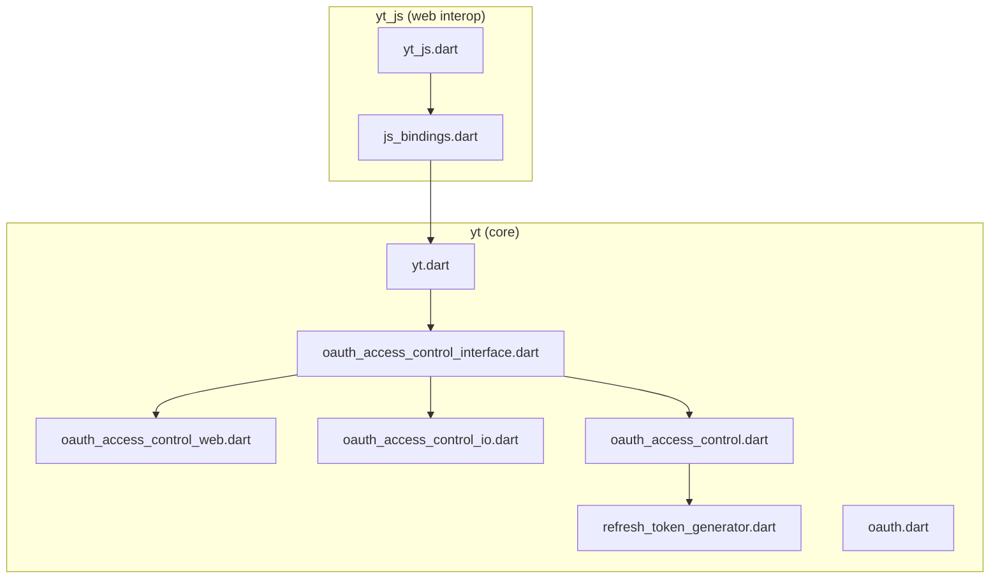
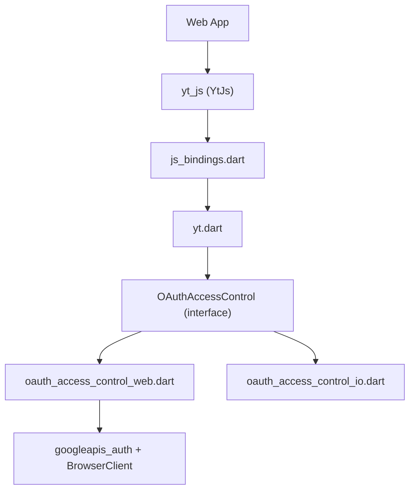
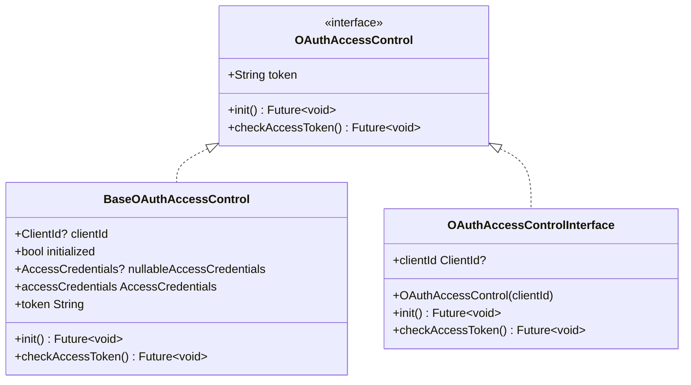
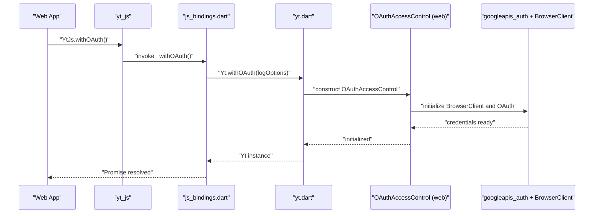
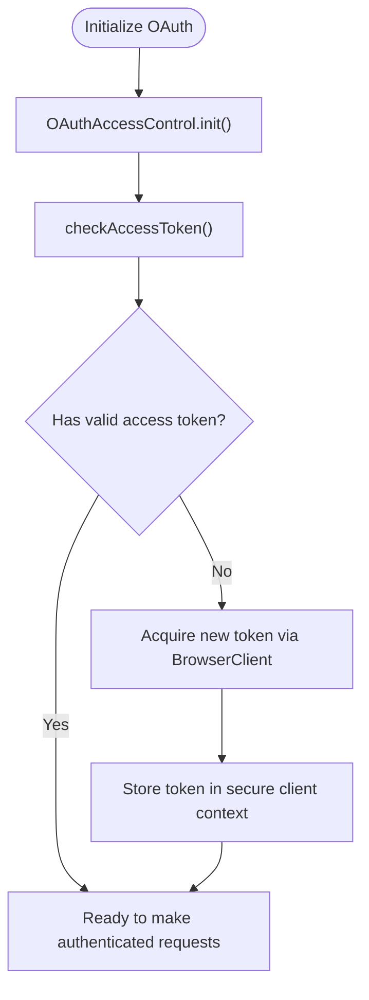
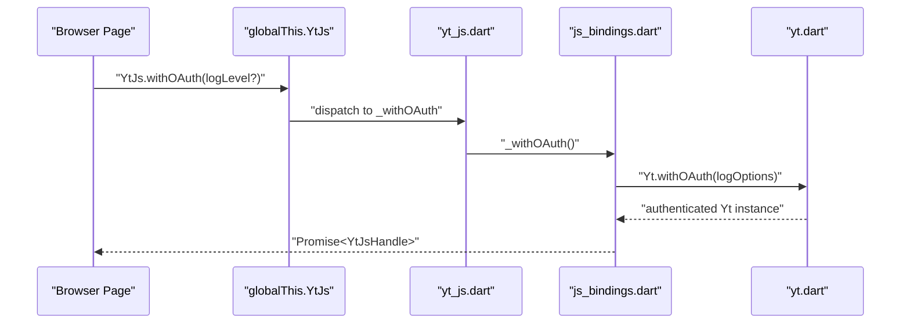
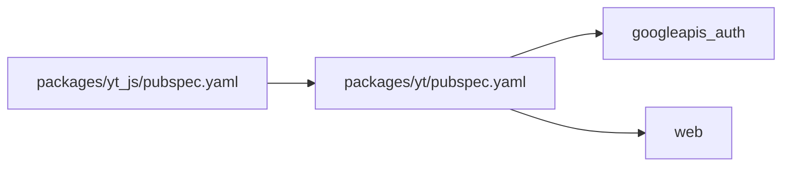

# Web Browser Support

<cite>
**Referenced Files in This Document**
- [README.md](file://README.md)
- [pubspec.yaml](file://pubspec.yaml)
- [packages/yt/pubspec.yaml](file://packages/yt/pubspec.yaml)
- [packages/yt_js/pubspec.yaml](file://packages/yt_js/pubspec.yaml)
- [packages/yt/lib/yt.dart](file://packages/yt/lib/yt.dart)
- [packages/yt/lib/oauth.dart](file://packages/yt/lib/oauth.dart)
- [packages/yt/lib/src/oauth/oauth_access_control_interface.dart](file://packages/yt/lib/src/oauth/oauth_access_control_interface.dart)
- [packages/yt/lib/src/oauth/oauth_access_control_web.dart](file://packages/yt/lib/src/oauth/oauth_access_control_web.dart)
- [packages/yt/lib/src/oauth/oauth_access_control_io.dart](file://packages/yt/lib/src/oauth/oauth_access_control_io.dart)
- [packages/yt/lib/src/oauth/oauth_access_control.dart](file://packages/yt/lib/src/oauth/oauth_access_control.dart)
- [packages/yt/lib/src/oauth/refresh_token_generator.dart](file://packages/yt/lib/src/oauth/refresh_token_generator.dart)
- [packages/yt_js/lib/yt_js.dart](file://packages/yt_js/lib/yt_js.dart)
- [packages/yt_js/lib/src/js_bindings.dart](file://packages/yt_js/lib/src/js_bindings.dart)
</cite>

## Table of Contents
1. [Introduction](#introduction)
2. [Project Structure](#project-structure)
3. [Core Components](#core-components)
4. [Architecture Overview](#architecture-overview)
5. [Detailed Component Analysis](#detailed-component-analysis)
6. [Dependency Analysis](#dependency-analysis)
7. [Performance Considerations](#performance-considerations)
8. [Troubleshooting Guide](#troubleshooting-guide)
9. [Conclusion](#conclusion)

## Introduction
This document explains how the YouTube API Dart SDK supports web browsers, focusing on OAuth authentication flows and token management tailored for browser environments. It covers the OAuth implementation using googleapis_auth, the BrowserClient abstraction, and platform-specific differences between native Dart (io) and web (html). It also outlines browser-specific considerations such as CORS, HTTPS, and compatibility, along with practical guidance for setting up OAuth in web apps, handling browser-based authentication callbacks, and managing access tokens securely in client-side applications.

## Project Structure
The workspace contains multiple packages:
- yt: The core Dart library for YouTube Data and Live Streaming APIs, including OAuth abstractions and platform-specific implementations.
- yt_js: JavaScript/TypeScript bindings for web and Node.js, exposing a minimal interop surface via dart:js_interop and enabling browser usage of the yt library.
- yt_cli and yt_mcp: Additional packages for CLI and MCP server integrations, not covered here.

Key files for web browser support:
- OAuth abstraction and platform selection: oauth_access_control_interface.dart
- Web-specific OAuth implementation: oauth_access_control_web.dart
- IO-specific OAuth implementation: oauth_access_control_io.dart
- Public OAuth exports: oauth.dart
- Main SDK entry point: yt.dart
- JavaScript interop bindings: js_bindings.dart and yt_js.dart

**Diagram sources**
- [packages/yt/lib/yt.dart](file://packages/yt/lib/yt.dart)
- [packages/yt/lib/src/oauth/oauth_access_control_interface.dart](file://packages/yt/lib/src/oauth/oauth_access_control_interface.dart)
- [packages/yt/lib/src/oauth/oauth_access_control_web.dart](file://packages/yt/lib/src/oauth/oauth_access_control_web.dart)
- [packages/yt/lib/src/oauth/oauth_access_control_io.dart](file://packages/yt/lib/src/oauth/oauth_access_control_io.dart)
- [packages/yt/lib/src/oauth/oauth_access_control.dart](file://packages/yt/lib/src/oauth/oauth_access_control.dart)
- [packages/yt/lib/src/oauth/refresh_token_generator.dart](file://packages/yt/lib/src/oauth/refresh_token_generator.dart)
- [packages/yt/lib/oauth.dart](file://packages/yt/lib/oauth.dart)
- [packages/yt_js/lib/yt_js.dart](file://packages/yt_js/lib/yt_js.dart)
- [packages/yt_js/lib/src/js_bindings.dart](file://packages/yt_js/lib/src/js_bindings.dart)

**Section sources**
- [README.md](file://README.md)
- [pubspec.yaml](file://pubspec.yaml)
- [packages/yt/pubspec.yaml](file://packages/yt/pubspec.yaml)
- [packages/yt_js/pubspec.yaml](file://packages/yt_js/pubspec.yaml)

## Core Components
- OAuth abstraction and platform selection:
  - The OAuthAccessControl interface selects platform-specific implementations using conditional imports. On the web (dart.library.html), it resolves to oauth_access_control_web.dart; on native Dart (dart.library.io), it resolves to oauth_access_control_io.dart.
  - BaseOAuthAccessControl provides shared state and helpers, including access to the current access token string and initialization routines.
- Web OAuth implementation:
  - The web implementation integrates with googleapis_auth and BrowserClient to perform OAuth flows suitable for browsers, including popup-based flows and token storage mechanisms appropriate for client-side contexts.
- JavaScript interop:
  - The yt_js package exposes a minimal JavaScript surface via globalThis.YtJs, delegating to the yt library’s withOAuth method to create authenticated instances for browser usage.

Practical implications:
- Applications targeting browsers should rely on the OAuthAccessControl abstraction so the correct platform implementation is selected automatically.
- The yt_js package simplifies embedding the SDK in web pages and Node.js environments by providing a Promise-based interop surface.

**Section sources**
- [packages/yt/lib/src/oauth/oauth_access_control_interface.dart](file://packages/yt/lib/src/oauth/oauth_access_control_interface.dart)
- [packages/yt/lib/src/oauth/oauth_access_control_web.dart](file://packages/yt/lib/src/oauth/oauth_access_control_web.dart)
- [packages/yt/lib/src/oauth/oauth_access_control_io.dart](file://packages/yt/lib/src/oauth/oauth_access_control_io.dart)
- [packages/yt/lib/src/oauth/oauth_access_control.dart](file://packages/yt/lib/src/oauth/oauth_access_control.dart)
- [packages/yt_js/lib/src/js_bindings.dart](file://packages/yt_js/lib/src/js_bindings.dart)
- [packages/yt_js/lib/yt_js.dart](file://packages/yt_js/lib/yt_js.dart)

## Architecture Overview
The OAuth architecture separates concerns between:
- Platform detection and selection via conditional imports.
- Shared base logic for credential handling and token access.
- Platform-specific implementations for authentication flows and token persistence.
- Interop layer for web usage through yt_js.

**Diagram sources**
- [packages/yt_js/lib/src/js_bindings.dart](file://packages/yt_js/lib/src/js_bindings.dart)
- [packages/yt_js/lib/yt_js.dart](file://packages/yt_js/lib/yt_js.dart)
- [packages/yt/lib/yt.dart](file://packages/yt/lib/yt.dart)
- [packages/yt/lib/src/oauth/oauth_access_control_interface.dart](file://packages/yt/lib/src/oauth/oauth_access_control_interface.dart)
- [packages/yt/lib/src/oauth/oauth_access_control_web.dart](file://packages/yt/lib/src/oauth/oauth_access_control_web.dart)
- [packages/yt/lib/src/oauth/oauth_access_control_io.dart](file://packages/yt/lib/src/oauth/oauth_access_control_io.dart)

## Detailed Component Analysis

### OAuth Abstraction and Platform Selection
The OAuthAccessControl interface defines the contract for obtaining and refreshing credentials, with platform-specific implementations chosen at compile-time via conditional imports. The base class maintains initialization state and exposes the current access token string.

**Diagram sources**
- [packages/yt/lib/src/oauth/oauth_access_control_interface.dart](file://packages/yt/lib/src/oauth/oauth_access_control_interface.dart)
- [packages/yt/lib/src/oauth/oauth_access_control.dart](file://packages/yt/lib/src/oauth/oauth_access_control.dart)

**Section sources**
- [packages/yt/lib/src/oauth/oauth_access_control_interface.dart](file://packages/yt/lib/src/oauth/oauth_access_control_interface.dart)
- [packages/yt/lib/src/oauth/oauth_access_control.dart](file://packages/yt/lib/src/oauth/oauth_access_control.dart)

### Web OAuth Implementation
The web implementation integrates with googleapis_auth and BrowserClient to support browser-based OAuth flows. It manages token acquisition and refresh in a way appropriate for client-side contexts, including popup-based flows and secure token storage.

**Diagram sources**
- [packages/yt_js/lib/src/js_bindings.dart](file://packages/yt_js/lib/src/js_bindings.dart)
- [packages/yt/lib/yt.dart](file://packages/yt/lib/yt.dart)
- [packages/yt/lib/src/oauth/oauth_access_control_interface.dart](file://packages/yt/lib/src/oauth/oauth_access_control_interface.dart)
- [packages/yt/lib/src/oauth/oauth_access_control_web.dart](file://packages/yt/lib/src/oauth/oauth_access_control_web.dart)

**Section sources**
- [packages/yt/lib/src/oauth/oauth_access_control_web.dart](file://packages/yt/lib/src/oauth/oauth_access_control_web.dart)
- [packages/yt_js/lib/src/js_bindings.dart](file://packages/yt_js/lib/src/js_bindings.dart)

### Token Management and Refresh
The base OAuth access control provides a unified token accessor and initialization lifecycle. While the refresh mechanism is abstracted, the web implementation coordinates with googleapis_auth to manage token acquisition and renewal in browser contexts.

**Diagram sources**
- [packages/yt/lib/src/oauth/oauth_access_control_interface.dart](file://packages/yt/lib/src/oauth/oauth_access_control_interface.dart)
- [packages/yt/lib/src/oauth/oauth_access_control_web.dart](file://packages/yt/lib/src/oauth/oauth_access_control_web.dart)

**Section sources**
- [packages/yt/lib/src/oauth/oauth_access_control_interface.dart](file://packages/yt/lib/src/oauth/oauth_access_control_interface.dart)
- [packages/yt/lib/src/oauth/oauth_access_control_web.dart](file://packages/yt/lib/src/oauth/oauth_access_control_web.dart)

### JavaScript Interop for Web Usage
The yt_js package exposes a minimal JavaScript surface under globalThis.YtJs, delegating to the yt library’s withOAuth method. This enables web applications to initialize authenticated instances and perform YouTube API operations.

**Diagram sources**
- [packages/yt_js/lib/yt_js.dart](file://packages/yt_js/lib/yt_js.dart)
- [packages/yt_js/lib/src/js_bindings.dart](file://packages/yt_js/lib/src/js_bindings.dart)
- [packages/yt/lib/yt.dart](file://packages/yt/lib/yt.dart)

**Section sources**
- [packages/yt_js/lib/yt_js.dart](file://packages/yt_js/lib/yt_js.dart)
- [packages/yt_js/lib/src/js_bindings.dart](file://packages/yt_js/lib/src/js_bindings.dart)

## Dependency Analysis
The yt package depends on googleapis_auth for OAuth capabilities and uses platform-specific OAuth implementations. The yt_js package depends on yt and exposes a JavaScript interop surface.

**Diagram sources**
- [packages/yt/pubspec.yaml](file://packages/yt/pubspec.yaml)
- [packages/yt_js/pubspec.yaml](file://packages/yt_js/pubspec.yaml)

**Section sources**
- [packages/yt/pubspec.yaml](file://packages/yt/pubspec.yaml)
- [packages/yt_js/pubspec.yaml](file://packages/yt_js/pubspec.yaml)

## Performance Considerations
- Minimize unnecessary re-initialization of OAuth instances; reuse authenticated clients where possible.
- Prefer batched API calls to reduce round trips and leverage YouTube API quotas efficiently.
- Avoid logging sensitive tokens; configure log levels appropriately in production builds.

## Troubleshooting Guide
Common issues and remedies for web deployments:
- CORS errors: Ensure the application origin is whitelisted in Google Cloud Console for the OAuth client and that API requests are made from a browser supporting CORS.
- HTTPS requirements: Serve the application over HTTPS; many browsers restrict OAuth flows and third-party cookies on insecure contexts.
- Popup blockers: Trigger OAuth flows from direct user gestures (e.g., button clicks) to avoid popup blockers interfering with the OAuth redirect.
- Token persistence: Verify that tokens are stored securely in the client context (e.g., memory-backed stores in single-page apps) and not persisted to insecure storage.
- Debugging: Enable appropriate log levels in the interop layer and inspect browser network requests and console logs for OAuth redirects and token exchanges.

## Conclusion
The YouTube API Dart SDK provides robust web browser support through a platform-aware OAuth abstraction and a dedicated web implementation powered by googleapis_auth and BrowserClient. The yt_js package simplifies integration by exposing a minimal JavaScript surface for browser and Node.js environments. By following the recommended setup, handling browser-specific constraints, and applying secure token management practices, developers can reliably authenticate and interact with YouTube APIs in web applications.