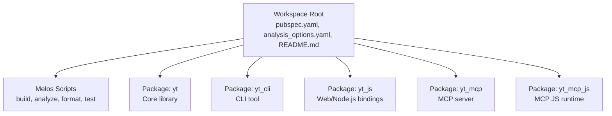
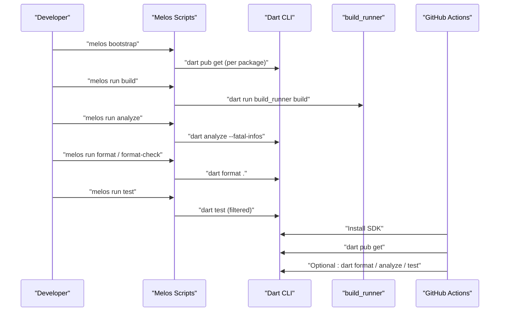
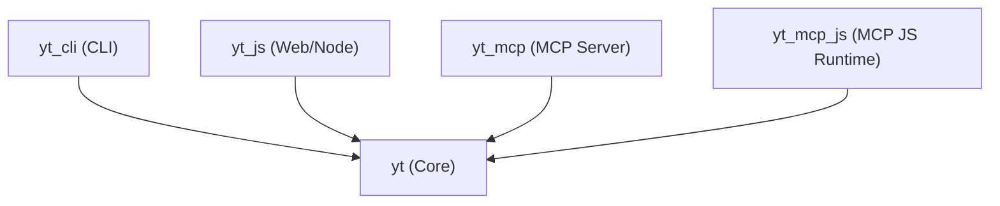

# Development & Testing

<cite>
**Referenced Files in This Document**
- [README.md](file://README.md)
- [pubspec.yaml](file://pubspec.yaml)
- [analysis_options.yaml](file://analysis_options.yaml)
- [.github/workflows/dart.yml](file://.github/workflows/dart.yml)
- [packages/yt/pubspec.yaml](file://packages/yt/pubspec.yaml)
- [packages/yt_cli/pubspec.yaml](file://packages/yt_cli/pubspec.yaml)
- [packages/yt_js/pubspec.yaml](file://packages/yt_js/pubspec.yaml)
- [packages/yt_mcp/pubspec.yaml](file://packages/yt_mcp/pubspec.yaml)
- [packages/yt_mcp/build.yaml](file://packages/yt_mcp/build.yaml)
- [packages/yt_mcp_js/pubspec.yaml](file://packages/yt_mcp_js/pubspec.yaml)
</cite>

## Table of Contents
1. [Introduction](#introduction)
2. [Project Structure](#project-structure)
3. [Core Components](#core-components)
4. [Architecture Overview](#architecture-overview)
5. [Detailed Component Analysis](#detailed-component-analysis)
6. [Dependency Analysis](#dependency-analysis)
7. [Performance Considerations](#performance-considerations)
8. [Troubleshooting Guide](#troubleshooting-guide)
9. [Conclusion](#conclusion)
10. [Appendices](#appendices)

## Introduction
This document provides comprehensive development and testing guidance for the YouTube API Dart SDK monorepo. It covers workspace setup with Melos, dependency management across multiple packages, development workflow, code generation with build_runner, strict analysis configuration, testing strategies, local development examples, CI practices, contribution guidelines, release procedures, debugging techniques, performance profiling, and code quality maintenance across the multi-package ecosystem.

## Project Structure
The repository is a Melos-managed monorepo containing five packages under the packages/ directory, each serving a distinct platform or integration target:
- yt: Core Dart library for YouTube Data and Live Streaming APIs
- yt_cli: CLI tool for YouTube APIs
- yt_js: JavaScript/TypeScript bindings for web and Node.js
- yt_mcp: MCP server for AI assistant integration
- yt_mcp_js: MCP server compiled to JavaScript for Node.js

The workspace root defines the Melos configuration, shared scripts, and analysis/formatting policies. CI is configured via a GitHub Actions workflow that installs dependencies and optionally runs formatting, analysis, and tests.

**Diagram sources**
- [pubspec.yaml:17-69](file://pubspec.yaml#L17-L69)
- [packages/yt/pubspec.yaml:1-36](file://packages/yt/pubspec.yaml#L1-L36)
- [packages/yt_cli/pubspec.yaml:1-31](file://packages/yt_cli/pubspec.yaml#L1-L31)
- [packages/yt_js/pubspec.yaml:1-19](file://packages/yt_js/pubspec.yaml#L1-L19)
- [packages/yt_mcp/pubspec.yaml:1-31](file://packages/yt_mcp/pubspec.yaml#L1-L31)
- [packages/yt_mcp_js/pubspec.yaml:1-17](file://packages/yt_mcp_js/pubspec.yaml#L1-L17)

**Section sources**
- [README.md:8-20](file://README.md#L8-L20)
- [pubspec.yaml:7-21](file://pubspec.yaml#L7-L21)

## Core Components
- Melos workspace configuration defines package discovery, bootstrapping behavior, and shared scripts for build, analyze, format, format-check, test, and dartdoc.
- Strict analysis is enforced via recommended lints with strict inference and raw types enabled.
- Code generation is driven by build_runner with package-specific build.yaml configurations (notably for yt_mcp).
- CI workflow installs the Dart SDK and runs dependency installation; optional steps for formatting, analysis, and tests are present but commented out.

Key capabilities:
- Bootstrap and dependency resolution across packages
- Centralized build and analysis commands
- Formatting enforcement with selective checks
- Test execution with concurrency controls
- Documentation generation for specific scopes

**Section sources**
- [pubspec.yaml:23-69](file://pubspec.yaml#L23-L69)
- [analysis_options.yaml:1-10](file://analysis_options.yaml#L1-L10)
- [.github/workflows/dart.yml:18-46](file://.github/workflows/dart.yml#L18-L46)

## Architecture Overview
The development lifecycle integrates Melos orchestration, per-package build configurations, and CI automation. The following diagram shows how scripts and commands flow through the workspace and packages.

**Diagram sources**
- [pubspec.yaml:28-69](file://pubspec.yaml#L28-L69)
- [.github/workflows/dart.yml:20-46](file://.github/workflows/dart.yml#L20-L46)

## Detailed Component Analysis

### Melos Workspace and Scripts
- Package discovery uses glob patterns excluding example directories.
- Bootstrapping behavior sets usePubspecOverrides and disables parallel pub get.
- Shared scripts:
  - build: runs build_runner with delete-conflicting-outputs and filters packages with build.yaml
  - analyze: runs analyzer with fatal-infos
  - format and format-check: applies formatting; format-check restricts to packages with test directories and ignores specific JS packages
  - test: executes internal test runner with concurrency control and filters packages with test directories while ignoring JS packages
  - dartdoc: generates docs scoped to the yt package
  - lint:all: convenience script combining analyze and format-check

Operational notes:
- Concurrency is set to 1 for analyze, format, format-check, and test to ensure deterministic results and avoid resource contention.
- Package filtering ensures only relevant packages participate in build, analyze, format, and test tasks.

**Section sources**
- [pubspec.yaml:17-69](file://pubspec.yaml#L17-L69)

### Code Generation with build_runner
- yt depends on json_serializable and retrofit_generator; build_runner is used for code generation.
- yt_mcp uses easy_api_generator with a targeted build.yaml that limits generation to a specific source file.
- Other packages either do not define build.yaml or rely on workspace-level scripts.

Practical guidance:
- Run the build script to regenerate code across packages that declare generators.
- For yt_mcp, ensure the generator targets the intended source file as configured.

**Section sources**
- [packages/yt/pubspec.yaml:31-36](file://packages/yt/pubspec.yaml#L31-L36)
- [packages/yt_mcp/build.yaml:1-7](file://packages/yt_mcp/build.yaml#L1-L7)
- [packages/yt_mcp/pubspec.yaml:27-30](file://packages/yt_mcp/pubspec.yaml#L27-L30)

### Analysis and Formatting
- Strict linting is inherited from recommended lints with strict inference and strict raw types enabled.
- Generated files are excluded from analysis to avoid false positives.
- Formatting is enforced across packages; format-check selectively targets packages with tests and excludes JS packages from the check.

Best practices:
- Keep generated files in generated directories to leverage exclusions.
- Run format-check locally before submitting changes to catch formatting issues early.

**Section sources**
- [analysis_options.yaml:1-10](file://analysis_options.yaml#L1-L10)
- [pubspec.yaml:47-53](file://pubspec.yaml#L47-L53)

### Testing Strategy
- Tests are executed via a filtered Melos script that runs dart test on packages containing a test directory and excludes JS packages.
- Concurrency is set to 1 to ensure reproducibility and reduce flakiness.
- CI workflow demonstrates optional steps for running tests; enable as needed in your environment.

Recommendations:
- Add unit and integration tests to packages with test directories.
- Use package-specific fixtures and mocks to isolate tests.
- Prefer deterministic test execution by avoiding concurrency where not necessary.

**Section sources**
- [pubspec.yaml:54-69](file://pubspec.yaml#L54-L69)
- [.github/workflows/dart.yml:44-46](file://.github/workflows/dart.yml#L44-L46)

### Continuous Integration
- The CI workflow installs the Dart SDK and runs dependency installation.
- Optional steps for formatting verification, analysis, and tests are present but disabled by default.
- Consider enabling these steps to enforce quality gates in PRs and main branch builds.

**Section sources**
- [.github/workflows/dart.yml:18-46](file://.github/workflows/dart.yml#L18-L46)

### Package Dependencies and Interdependencies
- yt is the core dependency for yt_cli, yt_mcp, yt_mcp_js, and yt_js.
- yt_mcp adds easy_api_annotations and dart_mcp for MCP server generation and runtime.
- yt_js and yt_mcp_js depend on web and related channels for web/Node.js environments.
- CLI and MCP packages expose executables for distribution.

**Section sources**
- [packages/yt/pubspec.yaml:17-29](file://packages/yt/pubspec.yaml#L17-L29)
- [packages/yt_cli/pubspec.yaml:21-27](file://packages/yt_cli/pubspec.yaml#L21-L27)
- [packages/yt_js/pubspec.yaml:12-15](file://packages/yt_js/pubspec.yaml#L12-L15)
- [packages/yt_mcp/pubspec.yaml:22-26](file://packages/yt_mcp/pubspec.yaml#L22-L26)
- [packages/yt_mcp_js/pubspec.yaml:10-16](file://packages/yt_mcp_js/pubspec.yaml#L10-L16)

## Dependency Analysis
The following diagram shows inter-package dependencies and their roles in the monorepo.

**Diagram sources**
- [packages/yt/pubspec.yaml:17-29](file://packages/yt/pubspec.yaml#L17-L29)
- [packages/yt_cli/pubspec.yaml:21-27](file://packages/yt_cli/pubspec.yaml#L21-L27)
- [packages/yt_js/pubspec.yaml:12-15](file://packages/yt_js/pubspec.yaml#L12-L15)
- [packages/yt_mcp/pubspec.yaml:22-26](file://packages/yt_mcp/pubspec.yaml#L22-L26)
- [packages/yt_mcp_js/pubspec.yaml:10-16](file://packages/yt_mcp_js/pubspec.yaml#L10-L16)

**Section sources**
- [packages/yt/pubspec.yaml:17-29](file://packages/yt/pubspec.yaml#L17-L29)
- [packages/yt_cli/pubspec.yaml:21-27](file://packages/yt_cli/pubspec.yaml#L21-L27)
- [packages/yt_js/pubspec.yaml:12-15](file://packages/yt_js/pubspec.yaml#L12-L15)
- [packages/yt_mcp/pubspec.yaml:22-26](file://packages/yt_mcp/pubspec.yaml#L22-L26)
- [packages/yt_mcp_js/pubspec.yaml:10-16](file://packages/yt_mcp_js/pubspec.yaml#L10-L16)

## Performance Considerations
- Prefer running analyze, format, and test with single-threaded concurrency to minimize resource contention during development.
- Limit build_runner scope to packages with build.yaml to reduce unnecessary regeneration.
- Use package filtering in scripts to avoid running expensive operations on packages that do not require them.
- In CI, consider enabling formatting and analysis checks to catch regressions early.

[No sources needed since this section provides general guidance]

## Troubleshooting Guide
Common issues and resolutions:
- Dependency resolution failures: Run bootstrap to ensure consistent dependency resolution across packages.
- Build errors after adding new generators: Ensure build.yaml exists and targets the correct source files; then run the build script.
- Formatting conflicts: Run format-check to detect differences; resolve discrepancies locally before committing.
- Test flakiness: Avoid increasing concurrency for test runs; keep it at 1 for deterministic outcomes.
- CI step failures: Enable optional steps (format, analyze, test) in CI as needed; align local scripts with CI expectations.

**Section sources**
- [pubspec.yaml:24-26](file://pubspec.yaml#L24-L26)
- [pubspec.yaml:35-42](file://pubspec.yaml#L35-L42)
- [pubspec.yaml:47-57](file://pubspec.yaml#L47-L57)
- [pubspec.yaml:62-69](file://pubspec.yaml#L62-L69)
- [.github/workflows/dart.yml:33-46](file://.github/workflows/dart.yml#L33-L46)

## Conclusion
This monorepo leverages Melos for streamlined development across multiple Dart packages. Strict analysis, centralized scripts, and optional CI checks form a robust foundation for building, testing, and releasing the YouTube API Dart SDK ecosystem. Following the practices outlined here will help maintain code quality, consistency, and reliability across all packages.

[No sources needed since this section summarizes without analyzing specific files]

## Appendices

### Local Development Setup
- Bootstrap dependencies for all packages using the workspace bootstrap command.
- Run build to generate code where applicable.
- Perform analysis and formatting across packages.
- Execute tests with the workspace test script.

References:
- [README.md:75-102](file://README.md#L75-L102)
- [pubspec.yaml:28-69](file://pubspec.yaml#L28-L69)

### Running Tests Locally
- Use the workspace test script to run tests in packages that contain a test directory and exclude JS packages from the test run.
- Keep concurrency at 1 for reliable results.

References:
- [pubspec.yaml:54-69](file://pubspec.yaml#L54-L69)

### Code Formatting
- Apply formatting across packages using the workspace format script.
- Use format-check to detect changes and prevent committing unformatted code.

References:
- [pubspec.yaml:43-53](file://pubspec.yaml#L43-L53)

### Continuous Integration
- The CI workflow installs the Dart SDK and runs dependency installation.
- Optional steps for formatting verification, analysis, and tests are available for gating quality.

References:
- [.github/workflows/dart.yml:18-46](file://.github/workflows/dart.yml#L18-L46)

### Contribution Guidelines
- Contributions are welcomed via issues, feature requests, pull requests, and community engagement.
- Follow the established scripts and quality gates for consistent contributions.

References:
- [README.md:104-111](file://README.md#L104-L111)

### Release Procedures
- Releases are managed by updating versions in package pubspecs and publishing via the standard Dart packaging process.
- Ensure all quality gates pass before publishing.

References:
- [README.md:14-18](file://README.md#L14-L18)
- [packages/yt/pubspec.yaml:2](file://packages/yt/pubspec.yaml#L2)
- [packages/yt_cli/pubspec.yaml:2](file://packages/yt_cli/pubspec.yaml#L2)
- [packages/yt_js/pubspec.yaml:3](file://packages/yt_js/pubspec.yaml#L3)
- [packages/yt_mcp/pubspec.yaml:2](file://packages/yt_mcp/pubspec.yaml#L2)
- [packages/yt_mcp_js/pubspec.yaml:3](file://packages/yt_mcp_js/pubspec.yaml#L3)

### Debugging Techniques
- Use the CLI and MCP executables to exercise functionality locally.
- Leverage logging libraries present in packages to trace execution paths.
- Validate API integrations with minimal reproduction cases and isolated tests.

References:
- [packages/yt_cli/pubspec.yaml:18-19](file://packages/yt_cli/pubspec.yaml#L18-L19)
- [packages/yt_mcp/pubspec.yaml:19-20](file://packages/yt_mcp/pubspec.yaml#L19-L20)

### Performance Profiling
- Profile network-bound operations using underlying HTTP clients.
- Measure build_runner generation time and optimize package scope.
- Monitor CI job durations and adjust concurrency or steps accordingly.

[No sources needed since this section provides general guidance]