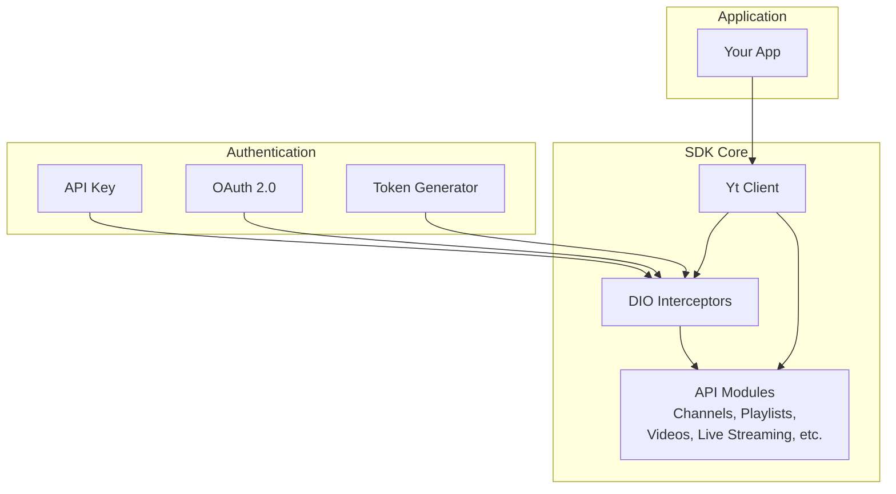

# Getting Started

<cite>
**Referenced Files in This Document**
- [README.md](file://README.md)
- [packages/yt/README.md](file://packages/yt/README.md)
- [packages/yt/pubspec.yaml](file://packages/yt/pubspec.yaml)
- [packages/yt/lib/yt.dart](file://packages/yt/lib/yt.dart)
- [packages/yt/lib/src/yt_base.dart](file://packages/yt/lib/src/yt_base.dart)
- [packages/yt/lib/src/util/util.dart](file://packages/yt/lib/src/util/util.dart)
</cite>

## Table of Contents
1. [Introduction](#introduction)
2. [Prerequisites](#prerequisites)
3. [Installation](#installation)
4. [Authentication Methods](#authentication-methods)
5. [Quick Start Examples](#quick-start-examples)
6. [Basic Usage Patterns](#basic-usage-patterns)
7. [Architecture Overview](#architecture-overview)
8. [Troubleshooting Guide](#troubleshooting-guide)
9. [Next Steps](#next-steps)
10. [Conclusion](#conclusion)

## Introduction
This guide helps you get productive quickly with the YouTube API Dart SDK across Dart/Flutter, CLI, and JavaScript/TypeScript environments. You will learn how to install the SDK, configure authentication (API key, OAuth 2.0, and token generator), create clients, and perform common tasks like listing playlists and uploading videos. The repository provides a cohesive workspace with multiple packages, including the core Dart library, a CLI tool, and JavaScript/TypeScript bindings.

## Prerequisites
Before diving in, ensure you have:
- Basic Dart programming knowledge (variables, imports, futures, classes)
- Understanding of RESTful APIs and HTTP requests/responses
- Familiarity with OAuth 2.0 concepts (authorization codes, access tokens, refresh tokens)
- A Google account and access to the Google API Console to create credentials

## Installation

### Dart/Flutter (Core Library)
Add the core library to your project dependencies:
- Use the dependency declaration from the core package documentation.

**Section sources**
- [packages/yt/README.md:91-109](file://packages/yt/README.md#L91-L109)

### CLI Tool
Install the CLI globally and verify:
- Activate the CLI package and run the help command.

**Section sources**
- [README.md:36-41](file://README.md#L36-L41)

### JavaScript/TypeScript
Install the JavaScript/TypeScript bindings using npm:
- Use the documented package installation command.

**Section sources**
- [README.md:43-47](file://README.md#L43-L47)

## Authentication Methods

The SDK supports three primary authentication approaches. Choose the one that fits your app’s needs and platform.

### API Key
- Use API keys for read-only public data from the YouTube Data API.
- Configure additional headers if required by your use case.

Implementation highlights:
- Static factory method to initialize a client with an API key.
- Modules are set up for Data API features only.

**Section sources**
- [packages/yt/lib/src/yt_base.dart:88-103](file://packages/yt/lib/src/yt_base.dart#L88-L103)
- [packages/yt/lib/src/yt_base.dart:187-255](file://packages/yt/lib/src/yt_base.dart#L187-L255)

### OAuth 2.0
- Use OAuth 2.0 for authenticated access to Data and Live Streaming APIs.
- The SDK manages access tokens and integrates with a refresh token generator.

Implementation highlights:
- Static factory method to initialize OAuth-enabled client.
- Request interceptor adds the Authorization header with a Bearer token.
- Modules include Live Streaming features when using OAuth.

**Section sources**
- [packages/yt/lib/src/yt_base.dart:109-141](file://packages/yt/lib/src/yt_base.dart#L109-L141)
- [packages/yt/lib/src/yt_base.dart:171-185](file://packages/yt/lib/src/yt_base.dart#L171-L185)
- [packages/yt/lib/src/yt_base.dart:187-226](file://packages/yt/lib/src/yt_base.dart#L187-L226)

### Token Generator (Custom OAuth)
- Use a token generator for advanced scenarios (e.g., integrating with platform-specific sign-in).
- The SDK accepts a generator that produces a token injected into requests.

Implementation highlights:
- Static factory method that accepts a refresh token generator.
- Adds an Authorization header with the generated token.

**Section sources**
- [packages/yt/lib/src/yt_base.dart:143-169](file://packages/yt/lib/src/yt_base.dart#L143-L169)

## Quick Start Examples

### Dart/Flutter: API Key
- Import the library and create a client with an API key.
- Call a Data API endpoint to list playlists.

**Section sources**
- [packages/yt/README.md:155-175](file://packages/yt/README.md#L155-L175)
- [packages/yt/lib/src/yt_base.dart:88-103](file://packages/yt/lib/src/yt_base.dart#L88-L103)

### Dart/Flutter: OAuth 2.0
- Initialize an OAuth-enabled client.
- List playlists for a channel.

**Section sources**
- [packages/yt/README.md:155-175](file://packages/yt/README.md#L155-L175)
- [packages/yt/lib/src/yt_base.dart:109-141](file://packages/yt/lib/src/yt_base.dart#L109-L141)

### Dart/Flutter: Token Generator
- Implement a token generator and pass it to the client initializer.
- Use the generator to supply tokens for authenticated requests.

**Section sources**
- [packages/yt/lib/src/yt_base.dart:143-169](file://packages/yt/lib/src/yt_base.dart#L143-L169)

### CLI Tool
- Install the CLI globally and run the help command to explore available commands.

**Section sources**
- [README.md:36-41](file://README.md#L36-L41)

### JavaScript/TypeScript
- Install the JavaScript/TypeScript bindings using npm.

**Section sources**
- [README.md:43-47](file://README.md#L43-L47)

## Basic Usage Patterns

### Creating a Client Instance
- API Key: Use the API key factory method.
- OAuth 2.0: Use the OAuth factory method.
- Token Generator: Use the generator factory method.

Client initialization patterns are exposed via static factory methods on the core client class.

**Section sources**
- [packages/yt/lib/src/yt_base.dart:88-103](file://packages/yt/lib/src/yt_base.dart#L88-L103)
- [packages/yt/lib/src/yt_base.dart:109-141](file://packages/yt/lib/src/yt_base.dart#L109-L141)
- [packages/yt/lib/src/yt_base.dart:143-169](file://packages/yt/lib/src/yt_base.dart#L143-L169)

### Making Simple API Calls
- After initializing a client, access API modules (e.g., playlists) and call methods with required parameters.
- The SDK exposes typed models for responses.

Common patterns:
- Listing playlists by channel ID.
- Uploading a video with metadata and media file.
- Managing live broadcasts and thumbnails.

**Section sources**
- [packages/yt/README.md:155-175](file://packages/yt/README.md#L155-L175)
- [packages/yt/README.md:177-203](file://packages/yt/README.md#L177-L203)
- [packages/yt/README.md:205-249](file://packages/yt/README.md#L205-L249)

### Handling Common Scenarios
- Logging: Configure logging options for diagnostics.
- Max results: Use helper utilities to enforce valid result limits.
- Upload IDs: Extract upload identifiers from response headers when needed.

**Section sources**
- [packages/yt/lib/src/util/util.dart:67-73](file://packages/yt/lib/src/util/util.dart#L67-L73)
- [packages/yt/lib/src/util/util.dart:53-61](file://packages/yt/lib/src/util/util.dart#L53-L61)

## Architecture Overview

The SDK organizes functionality into a core client with modular API clients. Authentication is applied via interceptors, and modules are conditionally instantiated based on the chosen authentication method.

**Diagram sources**
- [packages/yt/lib/src/yt_base.dart:88-169](file://packages/yt/lib/src/yt_base.dart#L88-L169)
- [packages/yt/lib/src/yt_base.dart:187-255](file://packages/yt/lib/src/yt_base.dart#L187-L255)

## Troubleshooting Guide

- API Key vs OAuth limitations: Some features (e.g., live broadcasts, chat, thumbnails) require OAuth and are unavailable with API key authentication.
- Logging: Adjust logging levels to aid debugging.
- Max results: Ensure your max results parameter is within accepted bounds; otherwise defaults apply.
- Upload ID extraction: When uploading media, parse the upload ID from the Location header if needed.

**Section sources**
- [packages/yt/lib/src/yt_base.dart:16-17](file://packages/yt/lib/src/yt_base.dart#L16-L17)
- [packages/yt/lib/src/util/util.dart:67-73](file://packages/yt/lib/src/util/util.dart#L67-L73)
- [packages/yt/lib/src/util/util.dart:53-61](file://packages/yt/lib/src/util/util.dart#L53-L61)

## Next Steps
- Explore the core package documentation for detailed API coverage and examples.
- Review the CLI documentation for command-line workflows.
- Check the JavaScript/TypeScript bindings for web and Node.js integrations.
- Dive into the MCP server packages for AI assistant integrations.

**Section sources**
- [README.md:64-71](file://README.md#L64-L71)

## Conclusion
You now have the essentials to install the SDK, choose an authentication method, create clients, and perform common tasks across Dart/Flutter, CLI, and JavaScript/TypeScript. Refer to the linked documentation for deeper dives into each package and advanced usage.