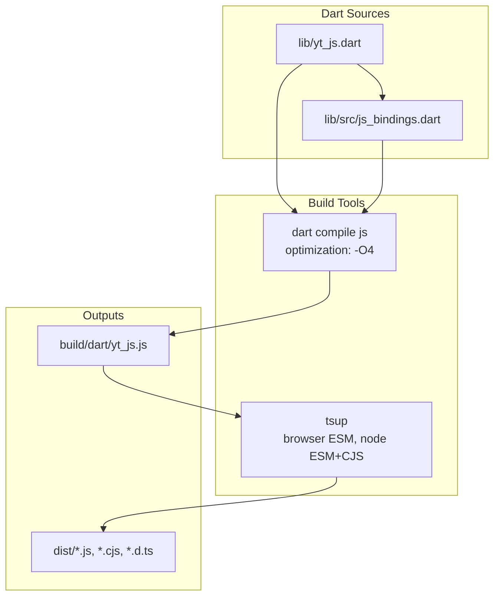
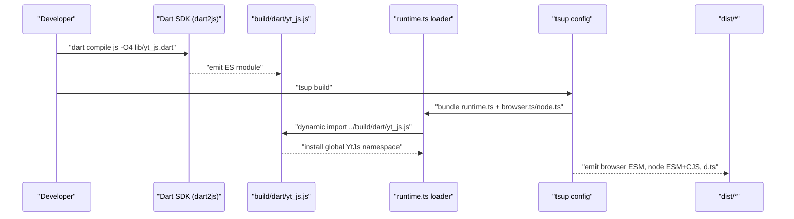
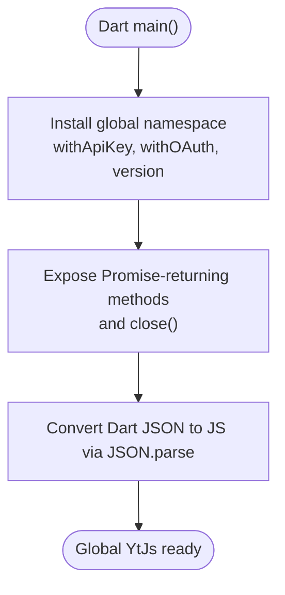
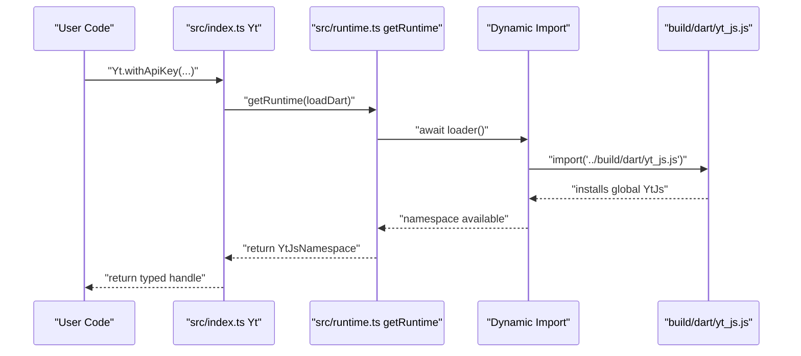
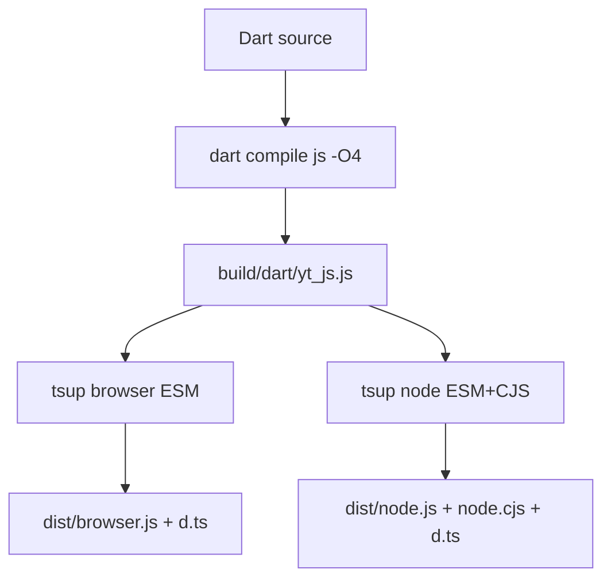
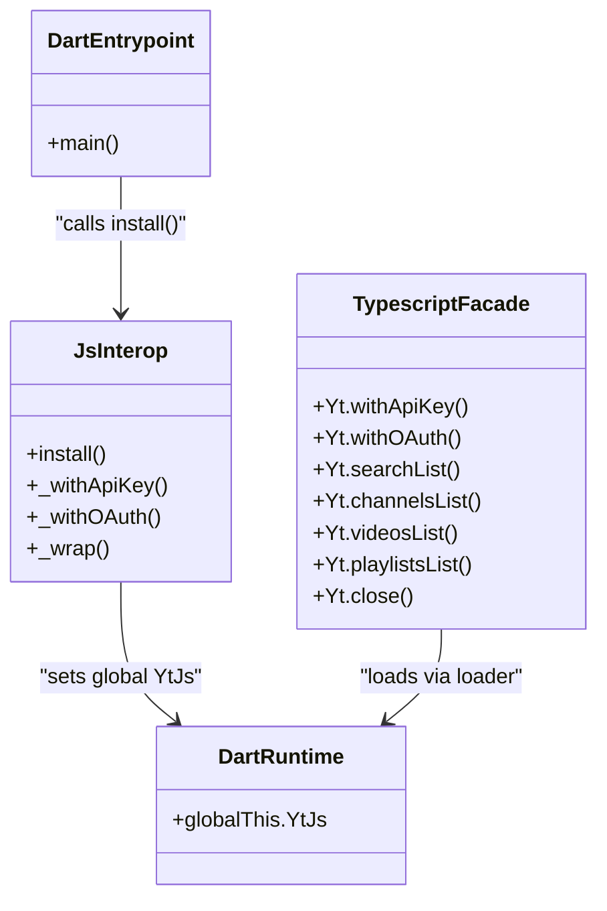
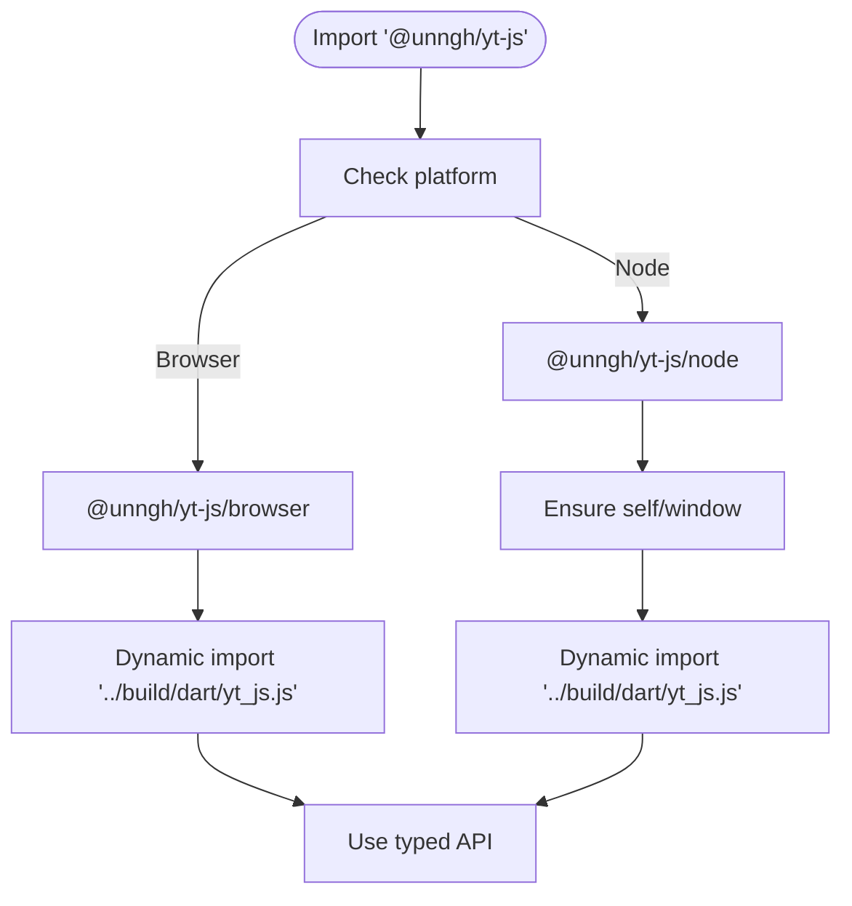
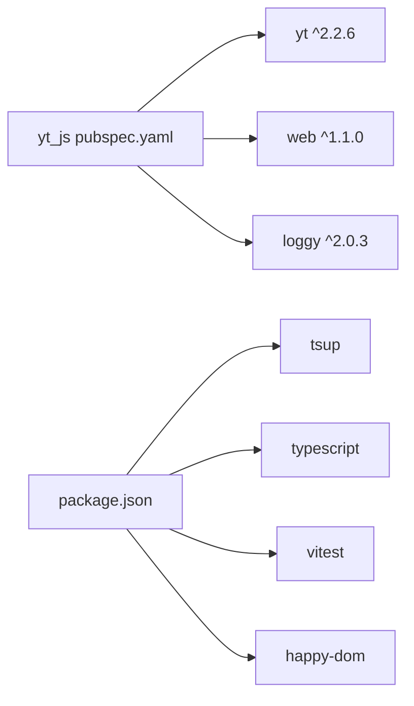

# Dart to JavaScript Compilation Process

<cite>
**Referenced Files in This Document**
- [README.md](file://README.md)
- [.github/workflows/dart.yml](file://.github/workflows/dart.yml)
- [pubspec.yaml](file://pubspec.yaml)
- [packages/yt_js/pubspec.yaml](file://packages/yt_js/pubspec.yaml)
- [packages/yt_js/package.json](file://packages/yt_js/package.json)
- [packages/yt_js/scripts/build.sh](file://packages/yt_js/scripts/build.sh)
- [packages/yt_js/tsup.config.ts](file://packages/yt_js/tsup.config.ts)
- [packages/yt_js/lib/yt_js.dart](file://packages/yt_js/lib/yt_js.dart)
- [packages/yt_js/lib/src/js_bindings.dart](file://packages/yt_js/lib/src/js_bindings.dart)
- [packages/yt_js/src/index.ts](file://packages/yt_js/src/index.ts)
- [packages/yt_js/src/browser.ts](file://packages/yt_js/src/browser.ts)
- [packages/yt_js/src/node.ts](file://packages/yt_js/src/node.ts)
- [packages/yt_js/src/runtime.ts](file://packages/yt_js/src/runtime.ts)
- [packages/yt_js/src/types.ts](file://packages/yt_js/src/types.ts)
</cite>

## Table of Contents
1. [Introduction](#introduction)
2. [Project Structure](#project-structure)
3. [Core Components](#core-components)
4. [Architecture Overview](#architecture-overview)
5. [Detailed Component Analysis](#detailed-component-analysis)
6. [Dependency Analysis](#dependency-analysis)
7. [Performance Considerations](#performance-considerations)
8. [Troubleshooting Guide](#troubleshooting-guide)
9. [Conclusion](#conclusion)
10. [Appendices](#appendices)

## Introduction
This document explains the Dart to JavaScript compilation process used by the yt_js package. It covers the dart2js compilation pipeline, optimization flags, and build configuration options. It also documents how Dart source maps to the generated JavaScript output, how code splitting and tree shaking considerations apply, and provides guidance for build optimization, bundle size reduction, and development versus production builds. Finally, it includes troubleshooting tips, debugging compiled JavaScript, maintaining compatibility across JavaScript environments, and integrating with build tools, CI/CD, and automated deployment.

## Project Structure
The yt_js package is a dual-target distribution (browser and Node.js) produced by compiling a small Dart entry point to JavaScript via dart2js and then wrapping it with TypeScript/TSup. The build pipeline consists of:
- A Dart entry point that installs a global interoperability namespace.
- A dart2js step that compiles the Dart module to a JavaScript ES module.
- A TypeScript/TSup step that bundles browser and Node.js variants, exposes type declarations, and wires runtime loading.

**Diagram sources**
- [packages/yt_js/lib/yt_js.dart:1-14](file://packages/yt_js/lib/yt_js.dart#L1-L14)
- [packages/yt_js/lib/src/js_bindings.dart:1-187](file://packages/yt_js/lib/src/js_bindings.dart#L1-L187)
- [packages/yt_js/scripts/build.sh:18-22](file://packages/yt_js/scripts/build.sh#L18-L22)
- [packages/yt_js/tsup.config.ts:3-34](file://packages/yt_js/tsup.config.ts#L3-L34)
- [packages/yt_js/package.json:23-44](file://packages/yt_js/package.json#L23-L44)

**Section sources**
- [README.md:43-47](file://README.md#L43-L47)
- [packages/yt_js/package.json:1-69](file://packages/yt_js/package.json#L1-L69)
- [packages/yt_js/pubspec.yaml:1-19](file://packages/yt_js/pubspec.yaml#L1-L19)

## Core Components
- Dart entry point: Initializes the Dart-to-JavaScript interoperability by invoking the installation routine that exposes a global namespace.
- Dart interop bindings: Exposes a minimal, Promise-returning surface to JavaScript, forwarding to the yt Dart library and converting JSON responses.
- TypeScript runtime loader: Provides a platform-specific loader that dynamically imports the dart2js output and caches the installed namespace.
- Browser and Node entrypoints: Wrap the base API and inject platform-specific loaders (Node polyfills self/window before loading).
- TSup configuration: Produces browser-only ESM and Node ESM/CJS bundles, plus shared type declarations.

**Section sources**
- [packages/yt_js/lib/yt_js.dart:1-14](file://packages/yt_js/lib/yt_js.dart#L1-L14)
- [packages/yt_js/lib/src/js_bindings.dart:1-187](file://packages/yt_js/lib/src/js_bindings.dart#L1-L187)
- [packages/yt_js/src/runtime.ts:1-28](file://packages/yt_js/src/runtime.ts#L1-L28)
- [packages/yt_js/src/browser.ts:1-36](file://packages/yt_js/src/browser.ts#L1-L36)
- [packages/yt_js/src/node.ts:1-51](file://packages/yt_js/src/node.ts#L1-L51)
- [packages/yt_js/tsup.config.ts:1-35](file://packages/yt_js/tsup.config.ts#L1-L35)

## Architecture Overview
The compilation and packaging architecture is a two-stage process: Dart to JavaScript followed by TypeScript/TSup bundling.

**Diagram sources**
- [packages/yt_js/scripts/build.sh:18-22](file://packages/yt_js/scripts/build.sh#L18-L22)
- [packages/yt_js/src/runtime.ts:13-27](file://packages/yt_js/src/runtime.ts#L13-L27)
- [packages/yt_js/tsup.config.ts:3-34](file://packages/yt_js/tsup.config.ts#L3-L34)
- [packages/yt_js/package.json:23-44](file://packages/yt_js/package.json#L23-L44)

## Detailed Component Analysis

### Dart Entry Point and Interop Namespace
- The Dart entry point delegates to an installation routine that creates a global namespace with Promise-returning methods and a version marker.
- The interop layer converts Dart values to JSON and back to JavaScript for safe interop.

**Diagram sources**
- [packages/yt_js/lib/yt_js.dart:11-13](file://packages/yt_js/lib/yt_js.dart#L11-L13)
- [packages/yt_js/lib/src/js_bindings.dart:19-25](file://packages/yt_js/lib/src/js_bindings.dart#L19-L25)
- [packages/yt_js/lib/src/js_bindings.dart:182-186](file://packages/yt_js/lib/src/js_bindings.dart#L182-L186)

**Section sources**
- [packages/yt_js/lib/yt_js.dart:1-14](file://packages/yt_js/lib/yt_js.dart#L1-L14)
- [packages/yt_js/lib/src/js_bindings.dart:1-187](file://packages/yt_js/lib/src/js_bindings.dart#L1-L187)

### TypeScript Runtime Loader and Platform Entrypoints
- The runtime loader accepts a platform-specific loader function, ensures the Dart runtime is loaded, and returns the installed namespace.
- Browser entrypoint dynamically imports the dart2js output and re-exports the public API.
- Node entrypoint polyfills self/window before importing the dart2js output.

**Diagram sources**
- [packages/yt_js/src/index.ts:19-57](file://packages/yt_js/src/index.ts#L19-L57)
- [packages/yt_js/src/runtime.ts:13-27](file://packages/yt_js/src/runtime.ts#L13-L27)
- [packages/yt_js/src/browser.ts:17-20](file://packages/yt_js/src/browser.ts#L17-L20)
- [packages/yt_js/src/node.ts:19-23](file://packages/yt_js/src/node.ts#L19-L23)

**Section sources**
- [packages/yt_js/src/runtime.ts:1-28](file://packages/yt_js/src/runtime.ts#L1-L28)
- [packages/yt_js/src/browser.ts:1-36](file://packages/yt_js/src/browser.ts#L1-L36)
- [packages/yt_js/src/node.ts:1-51](file://packages/yt_js/src/node.ts#L1-L51)

### Build Configuration and Optimization Flags
- dart2js optimization: The build script compiles with a high optimization level suitable for production distribution.
- TSup targets: Browser bundle targets modern ES modules; Node bundle targets Node 18 with both ESM and CJS outputs.
- Exports and types: The package exports separate entrypoints for browser and Node, and ships TypeScript declaration files.

**Diagram sources**
- [packages/yt_js/scripts/build.sh:18-22](file://packages/yt_js/scripts/build.sh#L18-L22)
- [packages/yt_js/tsup.config.ts:3-34](file://packages/yt_js/tsup.config.ts#L3-L34)
- [packages/yt_js/package.json:27-44](file://packages/yt_js/package.json#L27-L44)

**Section sources**
- [packages/yt_js/scripts/build.sh:1-32](file://packages/yt_js/scripts/build.sh#L1-L32)
- [packages/yt_js/tsup.config.ts:1-35](file://packages/yt_js/tsup.config.ts#L1-L35)
- [packages/yt_js/package.json:1-69](file://packages/yt_js/package.json#L1-L69)

### Relationship Between Dart Source and Generated JavaScript
- The Dart entry point triggers installation of a global namespace that mirrors the public API surface.
- The interop layer translates method calls and JSON payloads between Dart and JavaScript.
- The TypeScript layer provides a typed façade and defers to the runtime loader for the Dart-backed implementation.

**Diagram sources**
- [packages/yt_js/lib/yt_js.dart:11-13](file://packages/yt_js/lib/yt_js.dart#L11-L13)
- [packages/yt_js/lib/src/js_bindings.dart:19-25](file://packages/yt_js/lib/src/js_bindings.dart#L19-L25)
- [packages/yt_js/src/index.ts:19-123](file://packages/yt_js/src/index.ts#L19-L123)
- [packages/yt_js/src/runtime.ts:13-27](file://packages/yt_js/src/runtime.ts#L13-L27)

**Section sources**
- [packages/yt_js/lib/src/js_bindings.dart:1-187](file://packages/yt_js/lib/src/js_bindings.dart#L1-L187)
- [packages/yt_js/src/index.ts:1-124](file://packages/yt_js/src/index.ts#L1-L124)

### Code Splitting and Tree Shaking Considerations
- Dynamic import in the browser entrypoint allows bundlers to split the dart2js runtime into a separate chunk.
- The Node entrypoint polyfills environment globals before loading the runtime, ensuring compatibility.
- TSup produces separate bundles per platform; unused parts of the Dart runtime are not automatically removed but the dynamic import enables lazy loading.

**Diagram sources**
- [packages/yt_js/src/browser.ts:17-20](file://packages/yt_js/src/browser.ts#L17-L20)
- [packages/yt_js/src/node.ts:13-23](file://packages/yt_js/src/node.ts#L13-L23)
- [packages/yt_js/package.json:27-44](file://packages/yt_js/package.json#L27-L44)

**Section sources**
- [packages/yt_js/src/browser.ts:1-36](file://packages/yt_js/src/browser.ts#L1-L36)
- [packages/yt_js/src/node.ts:1-51](file://packages/yt_js/src/node.ts#L1-L51)
- [packages/yt_js/package.json:1-69](file://packages/yt_js/package.json#L1-L69)

## Dependency Analysis
- Dart dependencies: The Dart interop depends on the yt core library and logging utilities.
- NPM dependencies: The package depends on the yt Dart package and web support; dev dependencies include TSup, TypeScript, and testing utilities.
- Build orchestration: The build script runs dart pub get and dart compile js, then copies the runtime into dist for resolution by TSup.

**Diagram sources**
- [packages/yt_js/pubspec.yaml:12-16](file://packages/yt_js/pubspec.yaml#L12-L16)
- [packages/yt_js/package.json:53-59](file://packages/yt_js/package.json#L53-L59)

**Section sources**
- [packages/yt_js/pubspec.yaml:1-19](file://packages/yt_js/pubspec.yaml#L1-L19)
- [packages/yt_js/package.json:1-69](file://packages/yt_js/package.json#L1-L69)

## Performance Considerations
- Use the highest optimization level appropriate for production distributions. The build script uses a high optimization flag suitable for production.
- Keep the Dart interop surface minimal to reduce overhead and improve tree-shaking in downstream bundlers.
- Prefer dynamic imports for heavy runtime code to enable lazy loading and smaller initial payloads.
- Monitor bundle sizes and adjust TSup targets and externalization strategies as needed.

[No sources needed since this section provides general guidance]

## Troubleshooting Guide
Common issues and resolutions:
- Global namespace not installed: Ensure the runtime loader is invoked and the dynamic import resolves to the compiled Dart module. The loader throws a clear error if the namespace is missing.
- Node environment errors: The Node entrypoint polyfills self and window before loading the runtime; confirm these globals are available.
- Missing exports or wrong entrypoint: Verify the package exports and entrypoints match the intended consumption model (browser vs Node).
- CI/CD failures: The workflow installs dependencies and runs the Dart analyzer; ensure the environment matches the workflow’s expectations.

**Section sources**
- [packages/yt_js/src/runtime.ts:19-24](file://packages/yt_js/src/runtime.ts#L19-L24)
- [packages/yt_js/src/node.ts:13-17](file://packages/yt_js/src/node.ts#L13-L17)
- [packages/yt_js/package.json:27-44](file://packages/yt_js/package.json#L27-L44)
- [.github/workflows/dart.yml:30-39](file://.github/workflows/dart.yml#L30-L39)

## Conclusion
The yt_js package combines a compact Dart interop layer compiled to JavaScript with a TypeScript façade and platform-specific loaders. The build pipeline leverages dart2js for a production-ready runtime and TSup for multi-format distribution. By keeping the interop surface minimal, using dynamic imports for code splitting, and configuring TSup appropriately, the package achieves efficient distribution across browsers and Node.js while maintaining a typed, ergonomic API.

[No sources needed since this section summarizes without analyzing specific files]

## Appendices

### Build Commands and Scripts
- Build the Dart runtime: runs the build script that compiles the Dart entry point with dart2js.
- Build TypeScript bundles: runs TSup to produce browser and Node bundles with source maps and type declarations.
- Clean artifacts: removes build and dist directories.

**Section sources**
- [packages/yt_js/package.json:60-67](file://packages/yt_js/package.json#L60-L67)
- [packages/yt_js/scripts/build.sh:1-32](file://packages/yt_js/scripts/build.sh#L1-L32)

### CI/CD and Automation
- The workflow installs the Dart SDK, fetches dependencies, and optionally runs analysis and tests. Adapt steps as needed for your CI environment.

**Section sources**
- [.github/workflows/dart.yml:1-46](file://.github/workflows/dart.yml#L1-L46)