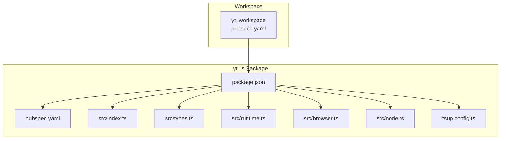
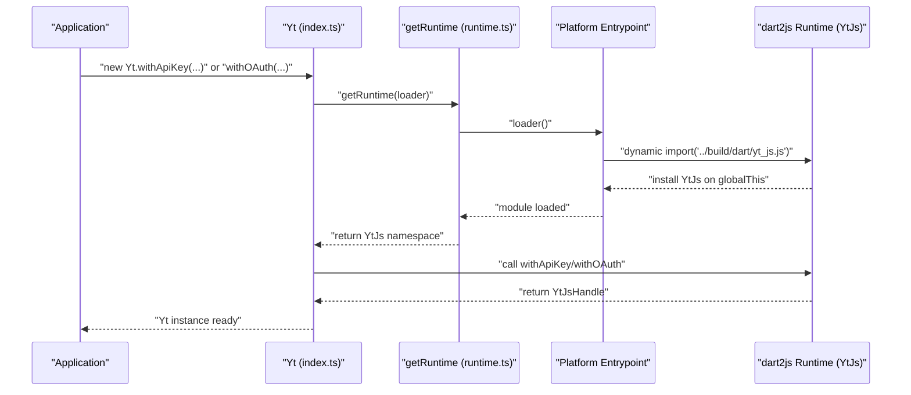
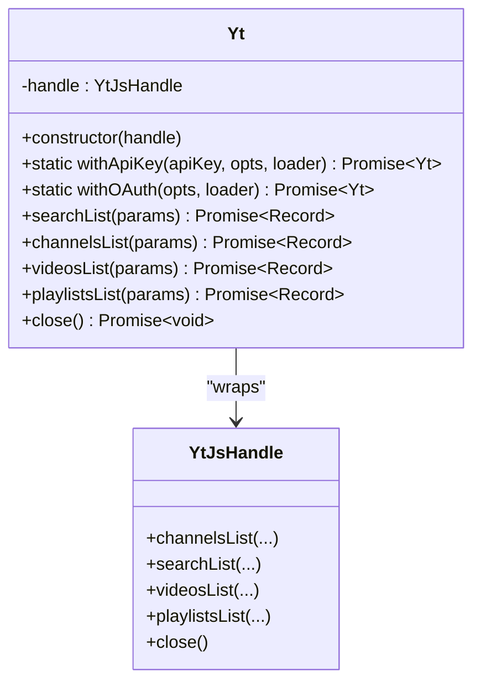
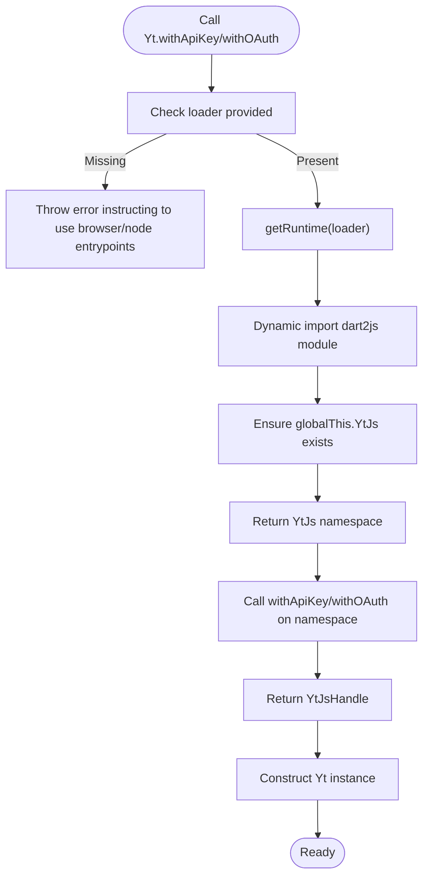
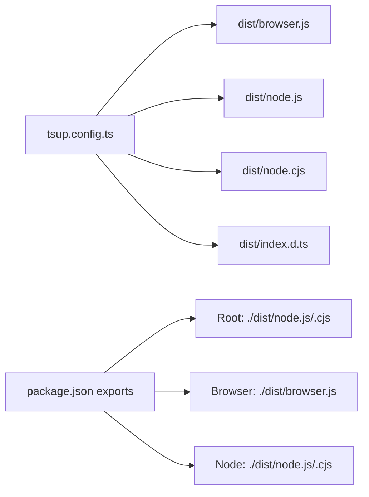
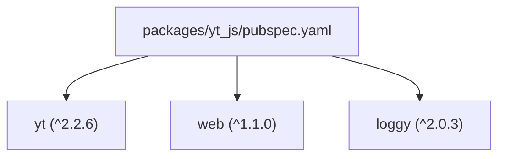

# JavaScript/TypeScript Bindings

<cite>
**Referenced Files in This Document**
- [README.md](file://README.md)
- [pubspec.yaml](file://pubspec.yaml)
- [packages/yt_js/README.md](file://packages/yt_js/README.md)
- [packages/yt_js/pubspec.yaml](file://packages/yt_js/pubspec.yaml)
- [packages/yt_js/src/index.ts](file://packages/yt_js/src/index.ts)
- [packages/yt_js/src/types.ts](file://packages/yt_js/src/types.ts)
- [packages/yt_js/src/runtime.ts](file://packages/yt_js/src/runtime.ts)
- [packages/yt_js/src/browser.ts](file://packages/yt_js/src/browser.ts)
- [packages/yt_js/src/node.ts](file://packages/yt_js/src/node.ts)
- [packages/yt_js/tsup.config.ts](file://packages/yt_js/tsup.config.ts)
- [packages/yt_js/package.json](file://packages/yt_js/package.json)
</cite>

## Table of Contents
1. [Introduction](#introduction)
2. [Project Structure](#project-structure)
3. [Core Components](#core-components)
4. [Architecture Overview](#architecture-overview)
5. [Detailed Component Analysis](#detailed-component-analysis)
6. [Dependency Analysis](#dependency-analysis)
7. [Performance Considerations](#performance-considerations)
8. [Troubleshooting Guide](#troubleshooting-guide)
9. [Conclusion](#conclusion)
10. [Appendices](#appendices)

## Introduction
This document explains the JavaScript/TypeScript bindings for web and Node.js integration. It covers how the Dart core is compiled to JavaScript via dart2js, how the TypeScript definitions expose a unified API surface, and how to integrate the library across browser, Node.js, and hybrid environments. It also provides guidance on authentication flows, dependency management, performance optimization, and secure credential handling in client-side applications.

## Project Structure
The yt workspace includes multiple packages. The JavaScript/TypeScript bindings are provided by the yt_js package, which compiles the Dart yt core into JavaScript and exposes a thin TypeScript facade for ergonomic usage in browsers and Node.js.

**Diagram sources**
- [pubspec.yaml:1-69](file://pubspec.yaml#L1-L69)
- [packages/yt_js/package.json:1-69](file://packages/yt_js/package.json#L1-L69)
- [packages/yt_js/src/index.ts:1-124](file://packages/yt_js/src/index.ts#L1-L124)
- [packages/yt_js/src/types.ts:1-137](file://packages/yt_js/src/types.ts#L1-L137)
- [packages/yt_js/src/runtime.ts:1-28](file://packages/yt_js/src/runtime.ts#L1-L28)
- [packages/yt_js/src/browser.ts:1-36](file://packages/yt_js/src/browser.ts#L1-L36)
- [packages/yt_js/src/node.ts:1-51](file://packages/yt_js/src/node.ts#L1-L51)
- [packages/yt_js/tsup.config.ts:1-35](file://packages/yt_js/tsup.config.ts#L1-L35)

**Section sources**
- [README.md:1-119](file://README.md#L1-L119)
- [pubspec.yaml:1-69](file://pubspec.yaml#L1-L69)
- [packages/yt_js/README.md:1-70](file://packages/yt_js/README.md#L1-L70)
- [packages/yt_js/package.json:1-69](file://packages/yt_js/package.json#L1-L69)

## Core Components
- Public facade class Yt: Provides Promise-based methods for YouTube Data API operations (search, channels, videos, playlists) and supports initialization with either an API key or OAuth credentials. It delegates to a low-level handle returned by the dart2js runtime.
- Runtime loader: A platform-aware loader that dynamically imports the dart2js-compiled module and exposes a namespace containing the actual API functions.
- Platform entrypoints: Separate browser and Node.js entrypoints that inject polyfills and load the compiled runtime.
- TypeScript types: Strongly-typed interfaces for connect options, resource identifiers, and response items mirroring the Dart core DTOs.

Key capabilities:
- Unified API surface across platforms
- Promise-based asynchronous operations
- Type-safe request/response shapes
- Optional logging level configuration
- Graceful handling of missing runtime loader

**Section sources**
- [packages/yt_js/src/index.ts:19-124](file://packages/yt_js/src/index.ts#L19-L124)
- [packages/yt_js/src/types.ts:7-137](file://packages/yt_js/src/types.ts#L7-L137)
- [packages/yt_js/src/runtime.ts:13-27](file://packages/yt_js/src/runtime.ts#L13-L27)
- [packages/yt_js/src/browser.ts:22-35](file://packages/yt_js/src/browser.ts#L22-L35)
- [packages/yt_js/src/node.ts:25-50](file://packages/yt_js/src/node.ts#L25-L50)

## Architecture Overview
The bindings compile the Dart yt core to JavaScript using dart2js, then wrap it behind a TypeScript facade. The runtime loader dynamically imports the compiled module and caches the namespace. Platform-specific entrypoints ensure compatibility with browser and Node.js environments.

**Diagram sources**
- [packages/yt_js/src/index.ts:25-57](file://packages/yt_js/src/index.ts#L25-L57)
- [packages/yt_js/src/runtime.ts:13-27](file://packages/yt_js/src/runtime.ts#L13-L27)
- [packages/yt_js/src/browser.ts:17-20](file://packages/yt_js/src/browser.ts#L17-L20)
- [packages/yt_js/src/node.ts:19-23](file://packages/yt_js/src/node.ts#L19-L23)

## Detailed Component Analysis

### Public Facade: Yt
The Yt class is the primary entry point. It:
- Exposes static constructors for API key and OAuth initialization
- Delegates to the dart2js runtime via a loader
- Provides convenience methods for search, channels, videos, and playlists
- Supports optional logging level configuration
- Allows closing the underlying HTTP client

**Diagram sources**
- [packages/yt_js/src/index.ts:19-124](file://packages/yt_js/src/index.ts#L19-L124)
- [packages/yt_js/src/types.ts:100-127](file://packages/yt_js/src/types.ts#L100-L127)

**Section sources**
- [packages/yt_js/src/index.ts:19-124](file://packages/yt_js/src/index.ts#L19-L124)

### Runtime Loader and Platform Entrypoints
- getRuntime: Ensures the dart2js module is loaded and exposes the YtJs namespace on globalThis. It caches the namespace after first load.
- Browser entrypoint: Dynamically imports the compiled JS bundle and re-exports the public API.
- Node entrypoint: Polyfills self/window globals before loading the compiled module and adds a convenience method to initialize from environment variables.

**Diagram sources**
- [packages/yt_js/src/index.ts:25-57](file://packages/yt_js/src/index.ts#L25-L57)
- [packages/yt_js/src/runtime.ts:13-27](file://packages/yt_js/src/runtime.ts#L13-L27)
- [packages/yt_js/src/browser.ts:17-20](file://packages/yt_js/src/browser.ts#L17-L20)
- [packages/yt_js/src/node.ts:19-23](file://packages/yt_js/src/node.ts#L19-L23)

**Section sources**
- [packages/yt_js/src/runtime.ts:13-27](file://packages/yt_js/src/runtime.ts#L13-L27)
- [packages/yt_js/src/browser.ts:12-35](file://packages/yt_js/src/browser.ts#L12-L35)
- [packages/yt_js/src/node.ts:13-50](file://packages/yt_js/src/node.ts#L13-L50)

### TypeScript Types
The types module defines:
- ConnectOptions: Logging level configuration
- Interfaces for thumbnails, resource IDs, search results, video items, channels, and playlists
- YtJsHandle: Low-level handle contract for the dart2js runtime
- YtJsNamespace: Namespace contract for the dart2js runtime

These types mirror the Dart core DTOs and provide strong typing for responses.

**Section sources**
- [packages/yt_js/src/types.ts:7-137](file://packages/yt_js/src/types.ts#L7-L137)

### Build and Distribution
- Bundling: tsup produces separate bundles for browser (ESM) and Node.js (ESM + CJS), plus shared type exports.
- Targets: ES2022 for browser and Node 18 for server-side builds.
- Exports: Dual package format with explicit exports for root, browser, and node entrypoints.
- Scripts: Combined build pipeline invokes both Dart and TypeScript build steps.

**Diagram sources**
- [packages/yt_js/tsup.config.ts:3-34](file://packages/yt_js/tsup.config.ts#L3-L34)
- [packages/yt_js/package.json:27-44](file://packages/yt_js/package.json#L27-L44)

**Section sources**
- [packages/yt_js/tsup.config.ts:1-35](file://packages/yt_js/tsup.config.ts#L1-L35)
- [packages/yt_js/package.json:23-44](file://packages/yt_js/package.json#L23-L44)

## Dependency Analysis
- Core dependency: The yt_js package depends on the Dart yt package and the web SDK for browser compatibility.
- Runtime dependency: The dart2js-compiled module is loaded dynamically at runtime.
- Dev/test dependencies: TypeScript, tsup, Vitest, happy-dom for testing, and @types/node for Node.js typings.

**Diagram sources**
- [packages/yt_js/pubspec.yaml:12-16](file://packages/yt_js/pubspec.yaml#L12-L16)

**Section sources**
- [packages/yt_js/pubspec.yaml:12-16](file://packages/yt_js/pubspec.yaml#L12-L16)

## Performance Considerations
- Lazy loading: The dart2js module is dynamically imported only when initializing a client, reducing initial bundle size.
- Caching: The runtime namespace is cached after first load, avoiding repeated initialization overhead.
- Targeting: Browser builds target modern ES2022 and Node builds target Node 18, enabling modern toolchains and runtime optimizations.
- Bundle splitting: Separate browser and Node bundles allow consumers to import only the platform-specific entrypoint.

[No sources needed since this section provides general guidance]

## Troubleshooting Guide
Common issues and resolutions:
- Missing runtime loader: Initialization fails if no loader is provided. Use the browser or Node entrypoints to ensure proper loader injection.
- Global namespace not found: The dart2js module must install the YtJs namespace on globalThis. Verify the dynamic import resolves to the compiled bundle.
- Node.js globals: Ensure self/window polyfills are applied before loading the runtime in Node.js environments.
- Environment variable usage: Use the convenience Node-only method to initialize from YT_API_KEY if available.

**Section sources**
- [packages/yt_js/src/index.ts:25-57](file://packages/yt_js/src/index.ts#L25-L57)
- [packages/yt_js/src/runtime.ts:13-27](file://packages/yt_js/src/runtime.ts#L13-L27)
- [packages/yt_js/src/node.ts:13-23](file://packages/yt_js/src/node.ts#L13-L23)

## Conclusion
The yt_js package delivers a unified, strongly-typed JavaScript/TypeScript interface to YouTube APIs across web and Node.js environments. By compiling the Dart core to JavaScript and exposing a thin facade, it maintains type safety and performance while supporting flexible authentication modes and platform-specific runtime requirements.

[No sources needed since this section summarizes without analyzing specific files]

## Appendices

### Usage Patterns and Integration Guidance
- Web integration:
  - Import from the browser entrypoint to enable automatic dynamic loading of the dart2js module.
  - Initialize with an API key for read-only access or OAuth for authenticated operations.
  - Use Promise-based methods for search, channels, videos, and playlists.
- Node.js integration:
  - Import from the Node entrypoint to ensure self/window polyfills are applied.
  - Use the convenience method to initialize from environment variables when available.
  - Leverage dual ESM/CJS exports for compatibility with various bundlers and runtimes.
- Hybrid application development:
  - Choose the appropriate entrypoint per environment.
  - Centralize initialization logic to select API key vs OAuth based on deployment context.
- Framework integration:
  - Use standard ESM imports compatible with Vite, Webpack, Rollup, and similar bundlers.
  - For SSR frameworks, ensure the browser entrypoint is used on the client and Node entrypoint on the server.
- Asynchronous operations:
  - All API methods return Promises. Use async/await or Promise chaining as preferred.
- Secure credential handling:
  - Prefer OAuth flows in the browser when possible, delegating token storage to secure contexts.
  - Avoid embedding API keys in client-side code; use backend-provided tokens or signed requests when feasible.
  - For Node.js, use environment variables and restrict access to sensitive configuration.

**Section sources**
- [packages/yt_js/README.md:15-26](file://packages/yt_js/README.md#L15-L26)
- [packages/yt_js/src/browser.ts:22-35](file://packages/yt_js/src/browser.ts#L22-L35)
- [packages/yt_js/src/node.ts:43-50](file://packages/yt_js/src/node.ts#L43-L50)
- [packages/yt_js/package.json:27-44](file://packages/yt_js/package.json#L27-L44)