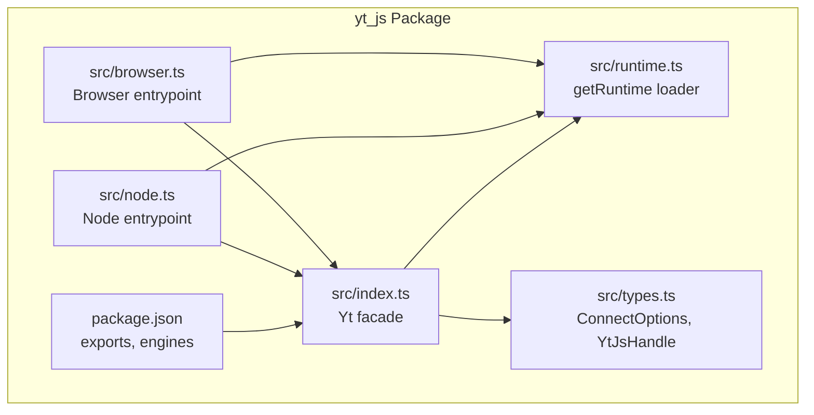
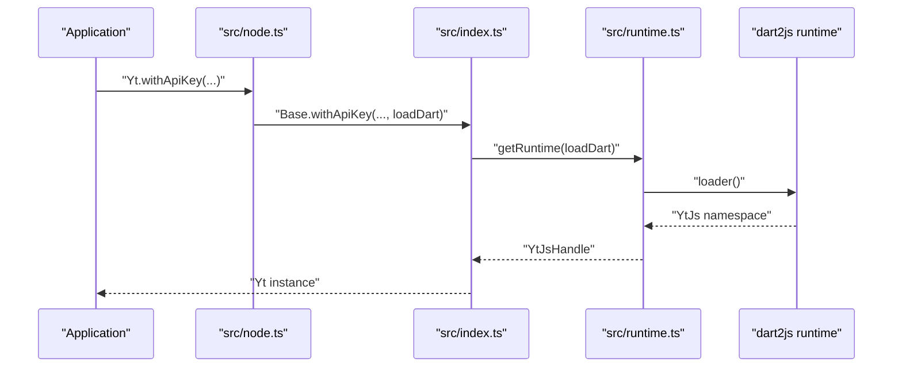
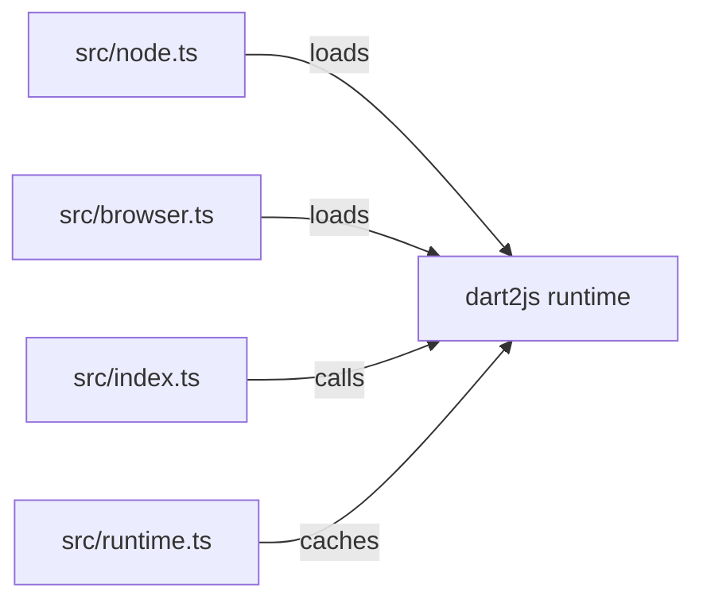

# Node.js Server Integration

<cite>
**Referenced Files in This Document**
- [README.md](file://README.md)
- [packages/yt_js/README.md](file://packages/yt_js/README.md)
- [packages/yt_js/package.json](file://packages/yt_js/package.json)
- [packages/yt_js/src/index.ts](file://packages/yt_js/src/index.ts)
- [packages/yt_js/src/node.ts](file://packages/yt_js/src/node.ts)
- [packages/yt_js/src/browser.ts](file://packages/yt_js/src/browser.ts)
- [packages/yt_js/src/runtime.ts](file://packages/yt_js/src/runtime.ts)
- [packages/yt_js/src/types.ts](file://packages/yt_js/src/types.ts)
</cite>

## Table of Contents
1. [Introduction](#introduction)
2. [Project Structure](#project-structure)
3. [Core Components](#core-components)
4. [Architecture Overview](#architecture-overview)
5. [Detailed Component Analysis](#detailed-component-analysis)
6. [Dependency Analysis](#dependency-analysis)
7. [Performance Considerations](#performance-considerations)
8. [Troubleshooting Guide](#troubleshooting-guide)
9. [Conclusion](#conclusion)
10. [Appendices](#appendices)

## Introduction
This document provides comprehensive guidance for integrating the yt JavaScript bindings into Node.js server environments. It covers installation via npm/yarn, ES Module and CommonJS usage, server-side authentication patterns, environment variable management, and credential security best practices. Practical examples are included for Express.js applications, serverless functions, and microservice architectures. Guidance is also provided for handling rate limits, implementing retry logic, managing long-running operations, memory management, error handling patterns, and performance optimization tailored for Node.js. Finally, deployment considerations for production environments are addressed.

## Project Structure
The yt JavaScript bindings are distributed as an npm package with dual entry points for Node.js and browser environments. The package exposes:
- A Node.js entry point that polyfills browser globals for dart2js compatibility
- A browser entry point for web usage
- A universal facade that delegates to the dart2js runtime

Key characteristics:
- Node.js entry point exports a class that wraps the dart2js runtime and provides Promise-based methods for YouTube Data and Live Streaming APIs
- The package supports both ES Modules and CommonJS via its exports field
- Authentication is supported via API key or OAuth, with convenience helpers for environment-based configuration

**Diagram sources**
- [packages/yt_js/package.json:1-69](file://packages/yt_js/package.json#L1-L69)
- [packages/yt_js/src/index.ts:1-124](file://packages/yt_js/src/index.ts#L1-L124)
- [packages/yt_js/src/node.ts:1-51](file://packages/yt_js/src/node.ts#L1-L51)
- [packages/yt_js/src/browser.ts:1-36](file://packages/yt_js/src/browser.ts#L1-L36)
- [packages/yt_js/src/runtime.ts:1-28](file://packages/yt_js/src/runtime.ts#L1-L28)
- [packages/yt_js/src/types.ts:1-137](file://packages/yt_js/src/types.ts#L1-L137)

**Section sources**
- [README.md:43-53](file://README.md#L43-L53)
- [packages/yt_js/README.md:9-25](file://packages/yt_js/README.md#L9-L25)
- [packages/yt_js/package.json:23-44](file://packages/yt_js/package.json#L23-L44)

## Core Components
- Yt facade: Provides Promise-based methods for YouTube Data API operations (search, channels, videos, playlists) and handles initialization with API key or OAuth
- Node entrypoint: Adds global polyfills for dart2js compatibility and loads the compiled runtime
- Browser entrypoint: Loads the runtime for browser usage
- Runtime loader: Ensures the dart2js runtime is initialized once and returns the namespace
- Types: Defines ConnectOptions, YtJsHandle, and response DTOs mirroring the Dart core

Key capabilities:
- Authentication: withApiKey, withOAuth, and convenience fromEnv for Node.js
- Operations: searchList, channelsList, videosList, playlistsList
- Lifecycle: close to release underlying resources

**Section sources**
- [packages/yt_js/src/index.ts:19-123](file://packages/yt_js/src/index.ts#L19-L123)
- [packages/yt_js/src/node.ts:25-50](file://packages/yt_js/src/node.ts#L25-L50)
- [packages/yt_js/src/browser.ts:22-35](file://packages/yt_js/src/browser.ts#L22-L35)
- [packages/yt_js/src/runtime.ts:13-27](file://packages/yt_js/src/runtime.ts#L13-L27)
- [packages/yt_js/src/types.ts:7-136](file://packages/yt_js/src/types.ts#L7-L136)

## Architecture Overview
The package initializes the dart2js runtime lazily and caches it. Node.js and browser entrypoints provide platform-specific loaders. The Yt facade delegates method calls to the dart2js handle.

**Diagram sources**
- [packages/yt_js/src/node.ts:25-37](file://packages/yt_js/src/node.ts#L25-L37)
- [packages/yt_js/src/index.ts:25-56](file://packages/yt_js/src/index.ts#L25-L56)
- [packages/yt_js/src/runtime.ts:13-27](file://packages/yt_js/src/runtime.ts#L13-L27)

## Detailed Component Analysis

### Installation and Usage
- Install via npm or yarn from the published package
- Choose the appropriate entry point:
  - Node.js: import from the package root or the explicit node subpath
  - Browser: import from the browser subpath
- Initialize with API key or OAuth; use environment-based convenience in Node.js

Practical guidance:
- Prefer the package root for Node.js; it resolves to the Node entrypoint
- For mixed environments, explicitly select the node or browser subpath
- Use fromEnv in Node.js to automatically configure from process.env.YT_API_KEY

**Section sources**
- [packages/yt_js/README.md:11-25](file://packages/yt_js/README.md#L11-L25)
- [packages/yt_js/package.json:27-44](file://packages/yt_js/package.json#L27-L44)
- [packages/yt_js/src/node.ts:43-49](file://packages/yt_js/src/node.ts#L43-L49)

### Authentication Patterns
- API Key: suitable for read-only access to public data
- OAuth: requires pre-configured credentials for authenticated operations
- Environment management: Node.js provides fromEnv to read YT_API_KEY

Security best practices:
- Store API keys and OAuth credentials in environment variables
- Never hardcode secrets in source files
- Restrict API key scopes and enable IP restrictions where applicable
- Rotate credentials regularly and monitor usage

**Section sources**
- [packages/yt_js/README.md:50-52](file://packages/yt_js/README.md#L50-L52)
- [packages/yt_js/src/node.ts:43-49](file://packages/yt_js/src/node.ts#L43-L49)

### ES Modules vs CommonJS
- The package declares "type": "module" and exports both ESM and CommonJS entry points
- Node.js resolves to CJS via require by default; ESM via import
- Explicitly import from the node subpath to ensure CJS behavior in ESM projects

**Section sources**
- [packages/yt_js/package.json:23-44](file://packages/yt_js/package.json#L23-L44)

### Express.js Integration
Recommended pattern:
- Initialize the client during application startup using fromEnv
- Expose methods as route handlers; wrap calls with try/catch
- Use res.status().json() to return structured responses
- Close the client gracefully on shutdown signals

Operational tips:
- Centralize client creation in a module and export a singleton
- Log errors with structured logging and include correlation IDs
- Apply request timeouts and abort signals for long-running operations

**Section sources**
- [packages/yt_js/src/node.ts:43-49](file://packages/yt_js/src/node.ts#L43-L49)
- [packages/yt_js/src/index.ts:59-122](file://packages/yt_js/src/index.ts#L59-L122)

### Serverless Functions
Recommended pattern:
- Initialize the client per invocation using withApiKey or withOAuth
- Reuse the client across invocations only if the runtime supports persistent connections
- Set short timeouts and enforce strict resource limits
- Log and monitor rate limit events; implement exponential backoff on retries

**Section sources**
- [packages/yt_js/src/index.ts:25-56](file://packages/yt_js/src/index.ts#L25-L56)

### Microservice Architectures
Recommended pattern:
- Encapsulate client instantiation and configuration in a dedicated service module
- Use circuit breakers to protect downstream YouTube API calls
- Implement idempotent retry logic with jitter for transient failures
- Monitor latency and error rates; scale horizontally based on demand

**Section sources**
- [packages/yt_js/src/types.ts:7-9](file://packages/yt_js/src/types.ts#L7-L9)

### Rate Limits and Retry Logic
- Observe HTTP 429 responses and implement exponential backoff with jitter
- Respect Retry-After headers when present
- Batch requests where possible and apply concurrency limits
- Use circuit breaker patterns to fail fast under sustained errors

[No sources needed since this section provides general guidance]

### Long-Running Operations
- Use AbortController to cancel long-running requests
- Stream responses when available; avoid buffering large payloads
- Implement progress reporting for operations like uploads or large downloads
- Employ worker queues for heavy tasks and offload to background jobs

[No sources needed since this section provides general guidance]

### Memory Management and Resource Cleanup
- Call close() on the Yt instance to release underlying resources
- Avoid retaining references to large response objects unnecessarily
- Use streaming APIs where available to reduce memory footprint
- Monitor heap usage and garbage collection metrics in production

**Section sources**
- [packages/yt_js/src/index.ts:119-122](file://packages/yt_js/src/index.ts#L119-L122)

### Error Handling Patterns
- Wrap external API calls in try/catch blocks
- Distinguish between transient and permanent errors
- Log structured errors with context (operation, parameters, status code)
- Return standardized error responses to clients

**Section sources**
- [packages/yt_js/src/runtime.ts:19-24](file://packages/yt_js/src/runtime.ts#L19-L24)

### Performance Optimization
- Reuse a single Yt instance per process when feasible
- Minimize payload sizes by selecting only required parts
- Enable compression and use efficient JSON parsing libraries
- Profile CPU and memory usage; optimize hot paths

[No sources needed since this section provides general guidance]

## Dependency Analysis
The package depends on a dart2js-compiled runtime that is dynamically loaded. The Node.js entrypoint ensures global polyfills are present before importing the compiled module.

**Diagram sources**
- [packages/yt_js/src/node.ts:19-23](file://packages/yt_js/src/node.ts#L19-L23)
- [packages/yt_js/src/browser.ts:17-20](file://packages/yt_js/src/browser.ts#L17-L20)
- [packages/yt_js/src/runtime.ts:13-27](file://packages/yt_js/src/runtime.ts#L13-L27)

**Section sources**
- [packages/yt_js/src/node.ts:13-23](file://packages/yt_js/src/node.ts#L13-L23)
- [packages/yt_js/src/browser.ts:17-20](file://packages/yt_js/src/browser.ts#L17-L20)
- [packages/yt_js/src/runtime.ts:9-27](file://packages/yt_js/src/runtime.ts#L9-L27)

## Performance Considerations
- Initialization cost: The dart2js runtime is loaded lazily and cached; subsequent initializations are fast
- Concurrency: Limit concurrent requests to respect YouTube API quotas and reduce GC pressure
- Payloads: Request only required parts to minimize bandwidth and memory usage
- Caching: Cache non-sensitive metadata where appropriate; invalidate on updates

[No sources needed since this section provides general guidance]

## Troubleshooting Guide
Common issues and resolutions:
- Runtime not initialized: Ensure the loader is provided and the dart2js module is built and available
- Missing globals in Node.js: The Node entrypoint polyfills self and window; confirm the runtime is loaded before use
- Environment variables: Verify YT_API_KEY is set and accessible to the process
- Timeouts: Configure request timeouts and handle AbortError appropriately

**Section sources**
- [packages/yt_js/src/runtime.ts:13-27](file://packages/yt_js/src/runtime.ts#L13-L27)
- [packages/yt_js/src/node.ts:13-17](file://packages/yt_js/src/node.ts#L13-L17)
- [packages/yt_js/src/node.ts:43-49](file://packages/yt_js/src/node.ts#L43-L49)

## Conclusion
The yt JavaScript bindings provide a robust, Node.js-friendly interface to YouTube APIs with clear authentication options, modular entry points, and a concise facade. By following the recommended patterns for environment management, error handling, rate limiting, and performance, you can integrate the library reliably in Express.js, serverless, and microservice contexts while maintaining security and scalability.

## Appendices

### API Surface Summary
- Initialization: withApiKey, withOAuth, fromEnv (Node.js)
- Operations: searchList, channelsList, videosList, playlistsList
- Lifecycle: close

**Section sources**
- [packages/yt_js/src/index.ts:25-122](file://packages/yt_js/src/index.ts#L25-L122)
- [packages/yt_js/src/node.ts:26-49](file://packages/yt_js/src/node.ts#L26-L49)