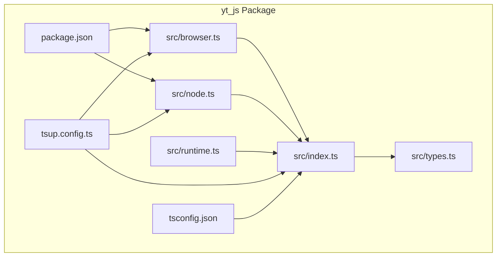
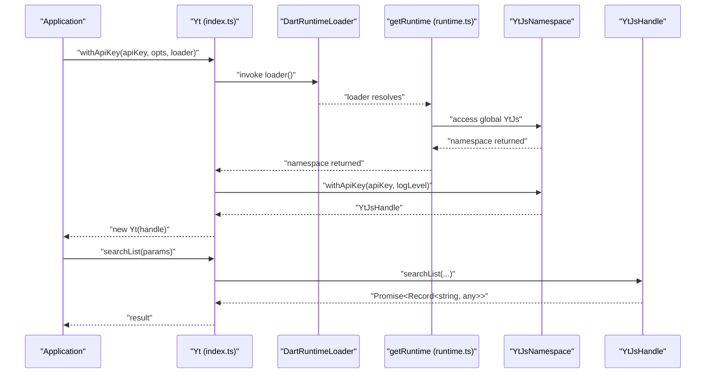
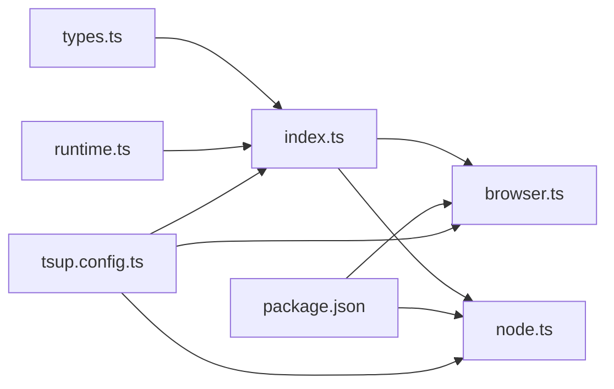

# TypeScript Definitions and Type Safety

<cite>
**Referenced Files in This Document**
- [README.md](file://README.md)
- [pubspec.yaml](file://pubspec.yaml)
- [packages/yt_js/README.md](file://packages/yt_js/README.md)
- [packages/yt_js/pubspec.yaml](file://packages/yt_js/pubspec.yaml)
- [packages/yt_js/src/types.ts](file://packages/yt_js/src/types.ts)
- [packages/yt_js/src/index.ts](file://packages/yt_js/src/index.ts)
- [packages/yt_js/src/browser.ts](file://packages/yt_js/src/browser.ts)
- [packages/yt_js/src/node.ts](file://packages/yt_js/src/node.ts)
- [packages/yt_js/src/runtime.ts](file://packages/yt_js/src/runtime.ts)
- [packages/yt_js/package.json](file://packages/yt_js/package.json)
- [packages/yt_js/tsconfig.json](file://packages/yt_js/tsconfig.json)
- [packages/yt_js/tsup.config.ts](file://packages/yt_js/tsup.config.ts)
</cite>

## Table of Contents
1. [Introduction](#introduction)
2. [Project Structure](#project-structure)
3. [Core Components](#core-components)
4. [Architecture Overview](#architecture-overview)
5. [Detailed Component Analysis](#detailed-component-analysis)
6. [Dependency Analysis](#dependency-analysis)
7. [Performance Considerations](#performance-considerations)
8. [Troubleshooting Guide](#troubleshooting-guide)
9. [Conclusion](#conclusion)
10. [Appendices](#appendices)

## Introduction
This document explains the TypeScript definitions and type safety model for the yt JavaScript/TypeScript bindings. It focuses on the available type definitions, interface structures, generic type parameters, and safe usage patterns for API methods, authentication flows, and runtime initialization. It also covers how Dart types map to JavaScript/TypeScript equivalents, null safety considerations, and practical guidance for integrating with TypeScript projects.

## Project Structure
The yt JavaScript/TypeScript bindings are implemented in the yt_js package. The TypeScript surface is defined in shared source files and re-exported for browser and Node.js entrypoints. The build pipeline emits declaration files (.d.ts) consumed by TypeScript projects.

**Diagram sources**
- [packages/yt_js/src/index.ts:1-124](file://packages/yt_js/src/index.ts#L1-L124)
- [packages/yt_js/src/types.ts:1-137](file://packages/yt_js/src/types.ts#L1-L137)
- [packages/yt_js/src/browser.ts:1-36](file://packages/yt_js/src/browser.ts#L1-L36)
- [packages/yt_js/src/node.ts:1-51](file://packages/yt_js/src/node.ts#L1-L51)
- [packages/yt_js/src/runtime.ts:1-28](file://packages/yt_js/src/runtime.ts#L1-L28)
- [packages/yt_js/package.json:1-69](file://packages/yt_js/package.json#L1-L69)
- [packages/yt_js/tsup.config.ts:1-35](file://packages/yt_js/tsup.config.ts#L1-L35)
- [packages/yt_js/tsconfig.json:1-26](file://packages/yt_js/tsconfig.json#L1-L26)

**Section sources**
- [packages/yt_js/README.md:1-70](file://packages/yt_js/README.md#L1-L70)
- [packages/yt_js/package.json:1-69](file://packages/yt_js/package.json#L1-L69)
- [packages/yt_js/tsup.config.ts:1-35](file://packages/yt_js/tsup.config.ts#L1-L35)
- [packages/yt_js/tsconfig.json:1-26](file://packages/yt_js/tsconfig.json#L1-L26)

## Core Components
This section documents the primary TypeScript types and classes used by the yt JavaScript bindings.

- Shared types and interfaces
  - ConnectOptions: Configuration for logging level during connection.
  - Thumbnail: Image metadata for thumbnails.
  - ResourceId: Identifier for YouTube resources (video, channel, playlist).
  - SearchResult: Search result item shape.
  - VideoItem: Video resource item shape.
  - ChannelItem: Channel resource item shape.
  - Playlist: Playlist resource item shape.
  - YtJsHandle: Low-level handle for invoking dart2js methods.
  - YtJsNamespace: Namespace containing factory methods and version.

- Public API class
  - Yt: Main client class exposing Promise-based methods for search, channels, videos, and playlists. It encapsulates a YtJsHandle and delegates to the dart2js runtime.

- Platform entrypoints
  - browser.ts: Browser-specific loader that dynamically imports the dart2js bundle and re-exports the public API.
  - node.ts: Node.js-specific loader that polyfills browser globals before importing the dart2js bundle and re-exports the public API. Includes convenience method for environment-based initialization.

- Runtime loader
  - runtime.ts: Provides a DartRuntimeLoader type and a getRuntime function that loads the dart2js module and returns the YtJs namespace installed on the global object.

**Section sources**
- [packages/yt_js/src/types.ts:1-137](file://packages/yt_js/src/types.ts#L1-L137)
- [packages/yt_js/src/index.ts:1-124](file://packages/yt_js/src/index.ts#L1-L124)
- [packages/yt_js/src/browser.ts:1-36](file://packages/yt_js/src/browser.ts#L1-L36)
- [packages/yt_js/src/node.ts:1-51](file://packages/yt_js/src/node.ts#L1-L51)
- [packages/yt_js/src/runtime.ts:1-28](file://packages/yt_js/src/runtime.ts#L1-L28)

## Architecture Overview
The TypeScript surface is a thin wrapper around a dart2js-compiled runtime. The Yt class exposes typed methods that forward to a YtJsHandle, which in turn invokes dart2js functions. Platform-specific loaders ensure the dart2js module is available in browser and Node.js contexts.

**Diagram sources**
- [packages/yt_js/src/index.ts:19-123](file://packages/yt_js/src/index.ts#L19-L123)
- [packages/yt_js/src/runtime.ts:13-27](file://packages/yt_js/src/runtime.ts#L13-L27)
- [packages/yt_js/src/browser.ts:17-20](file://packages/yt_js/src/browser.ts#L17-L20)
- [packages/yt_js/src/node.ts:19-23](file://packages/yt_js/src/node.ts#L19-L23)
- [packages/yt_js/src/types.ts:100-136](file://packages/yt_js/src/types.ts#L100-L136)

## Detailed Component Analysis

### Shared Types and Interfaces
The shared types mirror YouTube API response shapes and low-level handles. They are exported from types.ts and imported by the public API and platform entrypoints.

- ConnectOptions
  - Purpose: Configure logging verbosity for connection operations.
  - Optional property: logLevel accepts a union of literal string types.

- Thumbnail
  - Purpose: Describe thumbnail image metadata.
  - Required properties: url, width, height.

- ResourceId
  - Purpose: Identify YouTube resources.
  - Required property: kind.
  - Optional properties: videoId, channelId, playlistId.

- SearchResult
  - Purpose: Represent a single search result.
  - Required properties: kind, etag, id.
  - Optional nested snippet with publishedAt, channelId, title, description, thumbnails, channelTitle, and optional liveBroadcastContent.

- VideoItem
  - Purpose: Represent a video resource.
  - Required properties: kind, etag, id.
  - Optional nested snippet with publishedAt, channelId, title, description, thumbnails, channelTitle, optional tags, categoryId, and optional liveBroadcastContent.
  - Optional contentDetails as a loose record.
  - Optional statistics with viewCount, likeCount, dislikeCount, favoriteCount, commentCount.

- ChannelItem
  - Purpose: Represent a channel resource.
  - Required properties: kind, etag, id.
  - Optional snippet with title, description, optional customUrl, publishedAt, thumbnails.
  - Optional statistics with viewCount, subscriberCount, hiddenSubscriberCount, videoCount.

- Playlist
  - Purpose: Represent a playlist resource.
  - Required properties: kind, etag, id.
  - Optional snippet with publishedAt, channelId, title, description, thumbnails, channelTitle.
  - Optional contentDetails with itemCount.

- YtJsHandle
  - Purpose: Low-level handle for invoking dart2js methods.
  - Methods: channelsList, searchList, videosList, playlistsList returning Promise<Record<string, any>>; close().
  - Parameters: Many methods accept optional parameters such as part, id, forUsername, type, chart, maxResults.

- YtJsNamespace
  - Purpose: Namespace containing factory methods and version.
  - Methods: withApiKey(apiKey, logLevel?), withOAuth(logLevel?), property: version.

Usage patterns
- Type-safe method parameters: Pass objects with required and optional keys as documented above.
- Optional properties: Use optional chaining or guard checks when accessing nested optional fields.
- Loose records: contentDetails in VideoItem is typed as Record<string, any>; treat it as untyped JSON until validated.

**Section sources**
- [packages/yt_js/src/types.ts:7-136](file://packages/yt_js/src/types.ts#L7-L136)

### Public API: Yt Class
The Yt class is the primary entrypoint for consumers. It encapsulates a YtJsHandle and provides Promise-returning methods for search, channels, videos, and playlists.

- Static constructors
  - withApiKey(apiKey, opts?, loader?): Creates a client using an API key. Requires a DartRuntimeLoader; otherwise throws an error indicating the correct import path.
  - withOAuth(opts?, loader?): Creates a client using OAuth. Requires a DartRuntimeLoader; otherwise throws an error indicating the correct import path.

- Instance methods
  - searchList({q, part?, type?, maxResults?}): Returns Promise<Record<string, any>>.
  - channelsList({part?, id?, forUsername?, maxResults?}): Returns Promise<Record<string, any>>.
  - videosList({id?, chart?, part?, maxResults?}): Returns Promise<Record<string, any>>.
  - playlistsList({channelId?, id?, part?, maxResults?}): Returns Promise<Record<string, any>>.
  - close(): Closes the underlying handle.

Type-safe usage patterns
- Always pass a loader to withApiKey or withOAuth; otherwise initialization fails.
- Use destructuring to supply only the required parameters for each method.
- Treat returned results as Record<string, any> until validated; consider adding runtime guards or custom types for stricter typing.

**Section sources**
- [packages/yt_js/src/index.ts:19-123](file://packages/yt_js/src/index.ts#L19-L123)

### Platform Entrypoints: Browser and Node
Platform-specific entrypoints wrap the base Yt class and inject the appropriate loader.

- Browser entrypoint
  - Dynamically imports the dart2js bundle from ../build/dart/yt_js.js.
  - Overrides withApiKey and withOAuth to pass the browser loader.

- Node entrypoint
  - Ensures browser globals (self, window) are polyfilled before loading the dart2js bundle.
  - Overrides withApiKey and withOAuth to pass the Node loader.
  - Adds fromEnv convenience method to initialize from YT_API_KEY environment variable.

Type-safe usage patterns
- Import from '@unngh/yt-js/browser' or '@unngh/yt-js/node' depending on the target environment.
- Use fromEnv in Node to conditionally create a client when the environment variable is present.

**Section sources**
- [packages/yt_js/src/browser.ts:1-36](file://packages/yt_js/src/browser.ts#L1-L36)
- [packages/yt_js/src/node.ts:1-51](file://packages/yt_js/src/node.ts#L1-L51)

### Runtime Loader
The runtime loader ensures the dart2js module is loaded and exposes the YtJs namespace on the global object.

- DartRuntimeLoader: A function returning Promise<void>.
- getRuntime(loader): Loads the module via the provided loader, accesses globalThis.YtJs, caches the namespace, and returns it. Throws if the namespace is not installed.

Type-safe usage patterns
- Do not call getRuntime directly; use the platform entrypoints which handle loader injection.
- Ensure the dart2js bundle is built and available at the expected path.

**Section sources**
- [packages/yt_js/src/runtime.ts:1-28](file://packages/yt_js/src/runtime.ts#L1-L28)

### Authentication Flows
The bindings support two authentication modes:

- API Key (read-only access)
  - Use withApiKey with a valid API key and optional ConnectOptions.
  - Recommended for public data queries.

- OAuth (authenticated operations)
  - Use withOAuth with optional ConnectOptions.
  - Requires pre-configured OAuth credentials in the dart2js runtime.

Type-safe usage patterns
- Always provide a loader; otherwise initialization will fail.
- Prefer explicit error handling around initialization failures.
- For OAuth, ensure credentials are configured in the underlying runtime before calling withOAuth.

**Section sources**
- [packages/yt_js/src/index.ts:25-57](file://packages/yt_js/src/index.ts#L25-L57)
- [packages/yt_js/src/browser.ts:23-34](file://packages/yt_js/src/browser.ts#L23-L34)
- [packages/yt_js/src/node.ts:26-37](file://packages/yt_js/src/node.ts#L26-L37)

### Callback Handlers and Event Patterns
The current TypeScript surface does not expose explicit callback handlers. Instead, it provides Promise-based methods. If you need event-like behavior, wrap the returned promises and manage state externally.

Type-safe usage patterns
- Treat all API calls as Promise-returning functions.
- Use try/catch blocks around API calls.
- For streaming or long-running operations, implement retry and timeout logic at the application layer.

**Section sources**
- [packages/yt_js/src/index.ts:59-122](file://packages/yt_js/src/index.ts#L59-L122)

### Extending Existing Types and Creating Custom Type Definitions
To add stricter typing for responses:

- Define narrower interfaces that extend the shared types.
- Add runtime guards to validate response shapes before casting.
- Export custom types from your application and re-export them via a local barrel file.

Guidance
- For contentDetails in VideoItem, keep Record<string, any> until validated; introduce a dedicated interface after runtime checks.
- For statistics fields that appear numeric in JSON, treat them as strings initially and convert to numbers after validation.

**Section sources**
- [packages/yt_js/src/types.ts:39-62](file://packages/yt_js/src/types.ts#L39-L62)

### Handling Optional Properties
Many YouTube API responses include optional fields. The TypeScript definitions reflect this with optional properties and nested optionals.

Best practices
- Use optional chaining when accessing nested optional fields.
- Implement runtime guards to check for presence of optional fields before use.
- Normalize optional values to defaults in your application layer.

**Section sources**
- [packages/yt_js/src/types.ts:24-37](file://packages/yt_js/src/types.ts#L24-L37)
- [packages/yt_js/src/types.ts:64-81](file://packages/yt_js/src/types.ts#L64-L81)
- [packages/yt_js/src/types.ts:83-98](file://packages/yt_js/src/types.ts#L83-L98)

### Relationship Between Dart Types and JavaScript/TypeScript Equivalents
- Dart primitives map to JavaScript/TypeScript primitives:
  - int -> number
  - String -> string
  - bool -> boolean
  - double -> number
- Lists and maps in Dart become arrays and objects in JS/TS.
- Null safety:
  - Dart nullability is not enforced at runtime in JS/TS; optional properties in TypeScript reflect optional fields from Dart.
  - Use runtime guards to enforce presence checks in applications.
- Loose records:
  - Some Dart maps compile to Record<string, any> in TS; treat as untyped JSON until validated.

**Section sources**
- [packages/yt_js/src/types.ts:39-62](file://packages/yt_js/src/types.ts#L39-L62)
- [packages/yt_js/src/types.ts:100-136](file://packages/yt_js/src/types.ts#L100-L136)

## Dependency Analysis
The TypeScript surface depends on shared types and platform-specific loaders. The build system emits declarations for both browser and Node.js entrypoints.

**Diagram sources**
- [packages/yt_js/src/types.ts:1-137](file://packages/yt_js/src/types.ts#L1-L137)
- [packages/yt_js/src/index.ts:1-124](file://packages/yt_js/src/index.ts#L1-L124)
- [packages/yt_js/src/browser.ts:1-36](file://packages/yt_js/src/browser.ts#L1-L36)
- [packages/yt_js/src/node.ts:1-51](file://packages/yt_js/src/node.ts#L1-L51)
- [packages/yt_js/src/runtime.ts:1-28](file://packages/yt_js/src/runtime.ts#L1-L28)
- [packages/yt_js/package.json:1-69](file://packages/yt_js/package.json#L1-L69)
- [packages/yt_js/tsup.config.ts:1-35](file://packages/yt_js/tsup.config.ts#L1-L35)

**Section sources**
- [packages/yt_js/package.json:27-44](file://packages/yt_js/package.json#L27-L44)
- [packages/yt_js/tsup.config.ts:3-34](file://packages/yt_js/tsup.config.ts#L3-L34)

## Performance Considerations
- Keep API calls minimal and batch requests where possible.
- Avoid unnecessary conversions; treat raw responses as Record<string, any> until validated.
- Use environment-based initialization in Node to avoid redundant checks.

## Troubleshooting Guide
Common TypeScript compilation and runtime issues:

- Missing loader argument
  - Symptom: Initialization fails with an error indicating no Dart runtime loader was provided.
  - Fix: Import from '@unngh/yt-js/browser' or '@unngh/yt-js/node' and pass the loader to withApiKey or withOAuth.

- Runtime not initialized
  - Symptom: getRuntime throws because globalThis.YtJs was not installed.
  - Fix: Ensure the dart2js bundle is built and available at the expected path; verify platform-specific loader is invoked.

- Strict mode and unused locals
  - Symptom: Linter errors about unused locals or parameters.
  - Fix: Enable skipLibCheck and configure tsconfig as provided; review unused identifiers in application code.

- Node engine compatibility
  - Symptom: Engine mismatch warnings.
  - Fix: Ensure Node.js version satisfies the engines field.

**Section sources**
- [packages/yt_js/src/index.ts:30-35](file://packages/yt_js/src/index.ts#L30-L35)
- [packages/yt_js/src/runtime.ts:19-24](file://packages/yt_js/src/runtime.ts#L19-L24)
- [packages/yt_js/package.json:50-52](file://packages/yt_js/package.json#L50-L52)
- [packages/yt_js/tsconfig.json:15-17](file://packages/yt_js/tsconfig.json#L15-L17)

## Conclusion
The yt JavaScript/TypeScript bindings provide a strongly-typed surface over a dart2js-compiled runtime. The shared types define resource shapes and low-level handles, while the Yt class offers Promise-based methods for YouTube Data API operations. Platform entrypoints ensure the runtime is loaded correctly in browser and Node.js environments. For strict typing, augment the provided interfaces with runtime guards and narrow types as needed.

## Appendices

### A. Type Definitions Reference
- ConnectOptions: logLevel?
- Thumbnail: url, width, height
- ResourceId: kind, videoId?, channelId?, playlistId?
- SearchResult: kind, etag, id, snippet?
- VideoItem: kind, etag, id, snippet?, contentDetails?, statistics?
- ChannelItem: kind, etag, id, snippet?, statistics?
- Playlist: kind, etag, id, snippet?, contentDetails?
- YtJsHandle: channelsList, searchList, videosList, playlistsList, close
- YtJsNamespace: withApiKey, withOAuth, version

**Section sources**
- [packages/yt_js/src/types.ts:7-136](file://packages/yt_js/src/types.ts#L7-L136)

### B. Build and Distribution
- Declaration files are emitted per entrypoint (browser, node, index).
- Exports map:
  - Root export: types, import, require variants.
  - Subpath exports for browser and node entrypoints.
- Engines require Node >= 18.

**Section sources**
- [packages/yt_js/package.json:27-44](file://packages/yt_js/package.json#L27-L44)
- [packages/yt_js/package.json:50-52](file://packages/yt_js/package.json#L50-L52)
- [packages/yt_js/tsup.config.ts:5-34](file://packages/yt_js/tsup.config.ts#L5-L34)