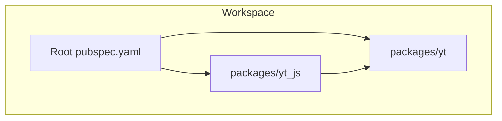
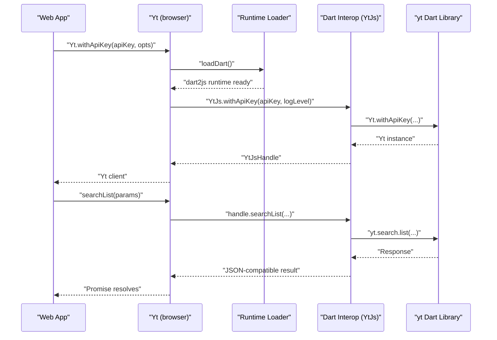
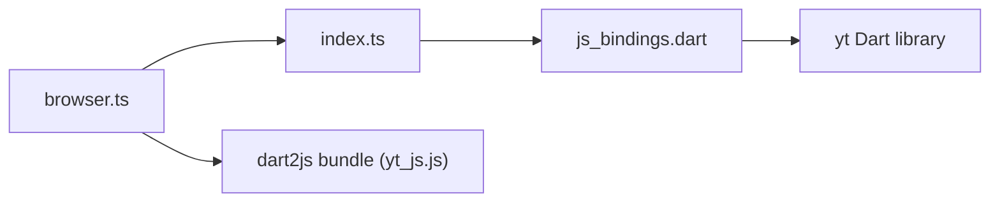

# Web Browser Integration

<cite>
**Referenced Files in This Document**
- [README.md](file://README.md)
- [pubspec.yaml](file://pubspec.yaml)
- [packages/yt_js/README.md](file://packages/yt_js/README.md)
- [packages/yt_js/pubspec.yaml](file://packages/yt_js/pubspec.yaml)
- [packages/yt_js/package.json](file://packages/yt_js/package.json)
- [packages/yt_js/lib/yt_js.dart](file://packages/yt_js/lib/yt_js.dart)
- [packages/yt_js/lib/src/js_bindings.dart](file://packages/yt_js/lib/src/js_bindings.dart)
- [packages/yt_js/src/index.ts](file://packages/yt_js/src/index.ts)
- [packages/yt_js/src/browser.ts](file://packages/yt_js/src/browser.ts)
</cite>

## Table of Contents
1. [Introduction](#introduction)
2. [Project Structure](#project-structure)
3. [Core Components](#core-components)
4. [Architecture Overview](#architecture-overview)
5. [Detailed Component Analysis](#detailed-component-analysis)
6. [Dependency Analysis](#dependency-analysis)
7. [Performance Considerations](#performance-considerations)
8. [Troubleshooting Guide](#troubleshooting-guide)
9. [Conclusion](#conclusion)
10. [Appendices](#appendices)

## Introduction
This document explains how to integrate the yt JavaScript/TypeScript bindings into web applications for browser environments. It covers initialization via script tags or modern bundlers, authentication flows (API key and OAuth), embedding YouTube functionality, CORS considerations, secure API key handling, webpack/CDN guidance, and performance optimization. It also addresses browser compatibility and debugging techniques for YouTube API integration in the browser.

## Project Structure
The yt workspace includes multiple packages. For browser integration, focus on the yt_js package, which compiles the yt Dart library to JavaScript/TypeScript and exposes a unified API for both browser and Node.js.

**Diagram sources**
- [pubspec.yaml:1-69](file://pubspec.yaml#L1-L69)
- [packages/yt_js/pubspec.yaml:1-19](file://packages/yt_js/pubspec.yaml#L1-L19)

**Section sources**
- [README.md:1-119](file://README.md#L1-L119)
- [pubspec.yaml:1-69](file://pubspec.yaml#L1-L69)
- [packages/yt_js/README.md:1-70](file://packages/yt_js/README.md#L1-L70)

## Core Components
- Public TypeScript API: The primary entry point for browser usage is the Yt class exported by the browser module. It provides Promise-based methods for search, channels, videos, playlists, and lifecycle management.
- Dart interop layer: The Dart side exposes a minimal global namespace with factory methods and operation wrappers, returning opaque handles to JavaScript.
- Runtime loader: The browser module dynamically loads the dart2js runtime bundle and wires it into the public API.

Key responsibilities:
- Initialization: Create clients with an API key or OAuth.
- Operations: Perform YouTube Data API queries (search, channels, videos, playlists).
- Lifecycle: Close underlying HTTP resources when finished.

**Section sources**
- [packages/yt_js/src/index.ts:19-124](file://packages/yt_js/src/index.ts#L19-L124)
- [packages/yt_js/lib/src/js_bindings.dart:17-187](file://packages/yt_js/lib/src/js_bindings.dart#L17-L187)
- [packages/yt_js/src/browser.ts:12-36](file://packages/yt_js/src/browser.ts#L12-L36)

## Architecture Overview
The browser integration follows a layered approach:
- TypeScript facade (public API) wraps a runtime loader.
- The runtime loader dynamically imports the dart2js bundle.
- The Dart interop layer installs a global namespace and exposes method wrappers.
- The public API translates between JS and Dart types and returns JSON-compatible structures.

**Diagram sources**
- [packages/yt_js/src/browser.ts:17-20](file://packages/yt_js/src/browser.ts#L17-L20)
- [packages/yt_js/src/index.ts:25-39](file://packages/yt_js/src/index.ts#L25-L39)
- [packages/yt_js/lib/src/js_bindings.dart:27-65](file://packages/yt_js/lib/src/js_bindings.dart#L27-L65)

## Detailed Component Analysis

### Public API (Yt class)
- Purpose: Provide a typed, Promise-based interface for YouTube Data API operations.
- Methods:
  - withApiKey(apiKey, opts?, loader?): Initialize with an API key.
  - withOAuth(opts?, loader?): Initialize with OAuth.
  - searchList(params): Search videos, channels, and playlists.
  - channelsList(params): List channels.
  - videosList(params): List videos.
  - playlistsList(params): List playlists.
  - close(): Close the underlying HTTP client.

Initialization and usage patterns are documented in the package’s quick start and README.

**Section sources**
- [packages/yt_js/src/index.ts:19-124](file://packages/yt_js/src/index.ts#L19-L124)
- [packages/yt_js/README.md:15-26](file://packages/yt_js/README.md#L15-L26)

### Dart Interop Layer (YtJs namespace)
- Purpose: Expose a minimal, interop-friendly surface to JavaScript.
- Responsibilities:
  - Install a global namespace (YtJs) with factory methods and operation wrappers.
  - Convert Dart values to JS via JSON round-trip for cross-language fidelity.
  - Manage logging options and wrap the underlying Yt instance in an opaque handle.

Key functions:
- install(): Sets up the global namespace.
- withApiKey(apiKey, logLevel?): Returns a JS Promise for a handle.
- withOAuth(logLevel?): Returns a JS Promise for a handle.
- _wrap(yt): Exposes channelsList, searchList, videosList, playlistsList, and close.

**Section sources**
- [packages/yt_js/lib/src/js_bindings.dart:17-187](file://packages/yt_js/lib/src/js_bindings.dart#L17-L187)

### Browser Runtime Loader
- Purpose: Dynamically load the dart2js runtime bundle and wire it into the public API.
- Behavior:
  - Provides a loadDart function that performs a dynamic import of the built dart bundle.
  - Overrides withApiKey and withOAuth to pass the loader to the base API.

Build-time note:
- The dart bundle path is embedded in the browser module and expected to be present in the distribution.

**Section sources**
- [packages/yt_js/src/browser.ts:12-36](file://packages/yt_js/src/browser.ts#L12-L36)

### Authentication Flow (Browser)
- API Key mode:
  - Initialize with an API key to access public data read-only operations.
  - Suitable for client-side apps where user context is not required.
- OAuth mode:
  - Requires pre-configured credentials and a compatible OAuth flow.
  - The underlying Dart library supports OAuth initialization; the browser module delegates to the runtime loader.

Important considerations:
- OAuth redirect handling must be implemented in your app to obtain tokens and initialize the client.
- Credential storage in the browser should avoid unsafe locations (e.g., localStorage for sensitive tokens). Prefer HttpOnly cookies or secure backend proxies when possible.

**Section sources**
- [packages/yt_js/src/index.ts:25-57](file://packages/yt_js/src/index.ts#L25-L57)
- [packages/yt_js/lib/src/js_bindings.dart:47-65](file://packages/yt_js/lib/src/js_bindings.dart#L47-L65)
- [packages/yt_js/README.md:48-58](file://packages/yt_js/README.md#L48-L58)

### Embedding YouTube Functionality in Web Pages
- Script tag usage:
  - Use the browser export to load the module in a script tag environment.
  - Ensure the dart2js bundle is served alongside your app assets.
- Modern bundlers (Vite/Webpack/Rollup):
  - Import from the browser entrypoint to leverage dynamic loading of the dart runtime.
  - Keep the dart bundle in the expected location relative to the built output.

Operational steps:
- Initialize the client with an API key or OAuth.
- Call searchList, channelsList, videosList, or playlistsList with desired parameters.
- Close the client when done to release resources.

**Section sources**
- [packages/yt_js/src/browser.ts:17-20](file://packages/yt_js/src/browser.ts#L17-L20)
- [packages/yt_js/src/index.ts:59-123](file://packages/yt_js/src/index.ts#L59-L123)

### CORS Restrictions and Secure API Keys
- CORS:
  - YouTube Data API requests originate from the browser; ensure your API key is configured to allow requests from your domain(s).
  - If you encounter CORS errors, verify your API key restrictions and referrers.
- API key security:
  - Never hardcode long-lived API keys in client-side code.
  - Use short-lived tokens or backend-proxied endpoints for sensitive operations.
  - Restrict API key scopes and enable HTTP referrer restrictions.

[No sources needed since this section provides general guidance]

### Webpack Configuration and CDN Usage
- Webpack:
  - Configure asset handling so the dart2js bundle is included in the output and served correctly.
  - Use dynamic imports to keep the Dart runtime in a separate chunk for lazy loading.
- CDN:
  - Host the dart2js bundle on a CDN and ensure correct MIME types and caching headers.
  - Verify that the browser module can resolve the bundle path at runtime.

[No sources needed since this section provides general guidance]

## Dependency Analysis
The browser integration depends on:
- The public API (index.ts) depending on the runtime loader (browser.ts).
- The runtime loader depending on the dart2js bundle being present at runtime.
- The Dart interop layer depending on the yt Dart library and loggy for logging.

**Diagram sources**
- [packages/yt_js/src/browser.ts:17-20](file://packages/yt_js/src/browser.ts#L17-L20)
- [packages/yt_js/src/index.ts:9-17](file://packages/yt_js/src/index.ts#L9-L17)
- [packages/yt_js/lib/src/js_bindings.dart:11-12](file://packages/yt_js/lib/src/js_bindings.dart#L11-L12)

**Section sources**
- [packages/yt_js/package.json:27-44](file://packages/yt_js/package.json#L27-L44)
- [packages/yt_js/lib/src/js_bindings.dart:11-12](file://packages/yt_js/lib/src/js_bindings.dart#L11-L12)

## Performance Considerations
- Lazy load the Dart runtime: Use dynamic imports to defer loading until initialization is needed.
- Minimize payload: Keep the dart bundle minified and compressed; serve via CDN.
- Resource cleanup: Call close() after finishing operations to release underlying HTTP resources.
- Request batching: Combine multiple small queries when possible to reduce overhead.

[No sources needed since this section provides general guidance]

## Troubleshooting Guide
Common issues and remedies:
- Missing runtime loader:
  - Symptom: Error indicating no Dart runtime loader was provided.
  - Fix: Import from the browser entrypoint to ensure the loader is supplied.
- Dart bundle not found:
  - Symptom: Dynamic import fails or 404 for the dart bundle.
  - Fix: Ensure the dart bundle is built and placed in the expected path relative to the browser output.
- CORS failures:
  - Symptom: Network errors when calling YouTube endpoints.
  - Fix: Verify API key restrictions and referrers; confirm the key allows your origin.
- OAuth redirect handling:
  - Symptom: Redirect loops or missing tokens.
  - Fix: Implement a proper OAuth flow in your app and initialize the client after obtaining tokens.

**Section sources**
- [packages/yt_js/src/index.ts:30-35](file://packages/yt_js/src/index.ts#L30-L35)
- [packages/yt_js/src/browser.ts:17-20](file://packages/yt_js/src/browser.ts#L17-L20)
- [packages/yt_js/README.md:48-58](file://packages/yt_js/README.md#L48-L58)

## Conclusion
The yt JavaScript/TypeScript bindings provide a robust, typed interface for browser-based YouTube API integration. By leveraging the browser module’s dynamic runtime loader, you can initialize clients with API keys or OAuth, perform common operations, and manage resources efficiently. Follow the guidance here to configure bundlers, handle CORS, protect API keys, and optimize performance.

[No sources needed since this section summarizes without analyzing specific files]

## Appendices

### Quick Start References
- Installation and basic usage are documented in the package README and quick start sections.

**Section sources**
- [packages/yt_js/README.md:9-26](file://packages/yt_js/README.md#L9-L26)

### Build and Distribution
- The package exports separate entrypoints for browser and Node.js, and the dart2js bundle is expected in the distribution.

**Section sources**
- [packages/yt_js/package.json:27-44](file://packages/yt_js/package.json#L27-L44)
- [packages/yt_js/package.json:60-67](file://packages/yt_js/package.json#L60-L67)