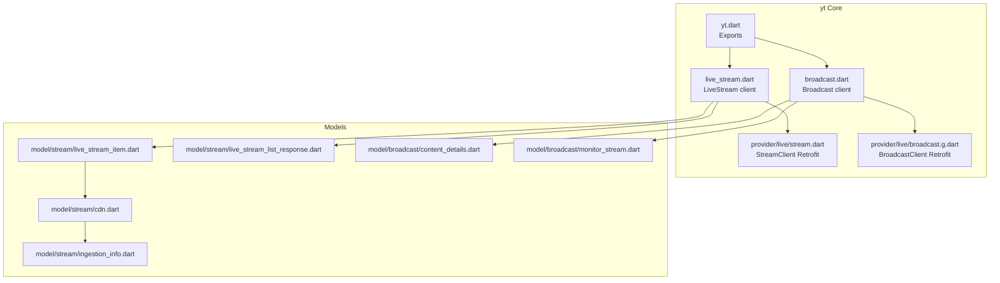
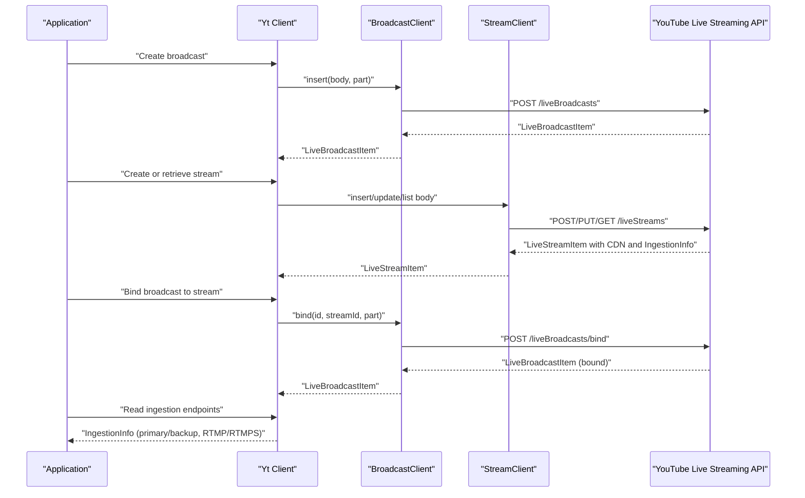
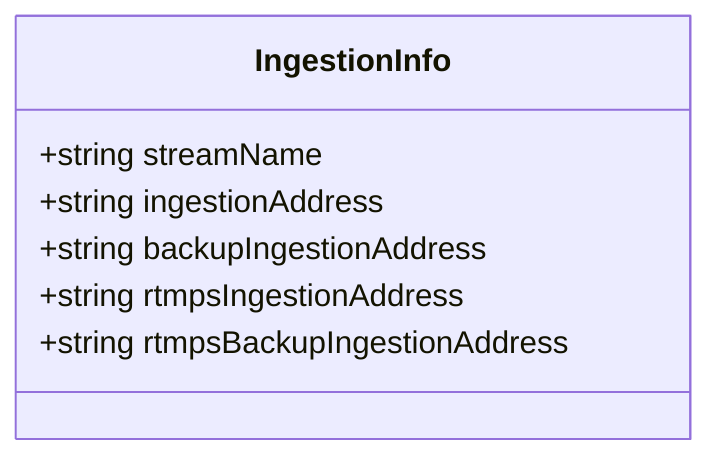
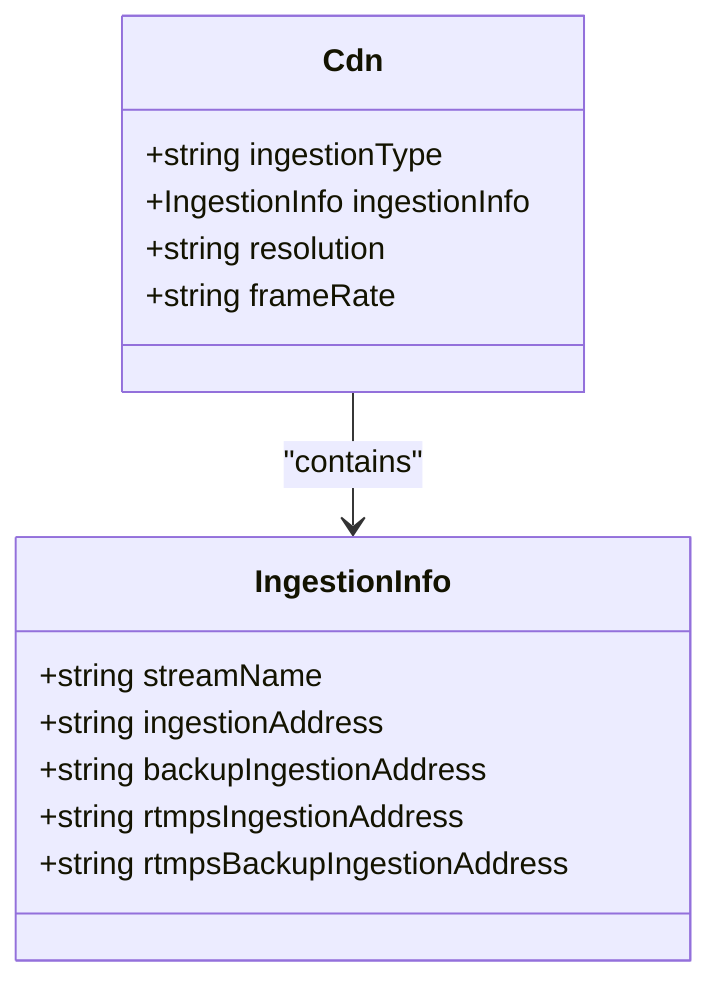
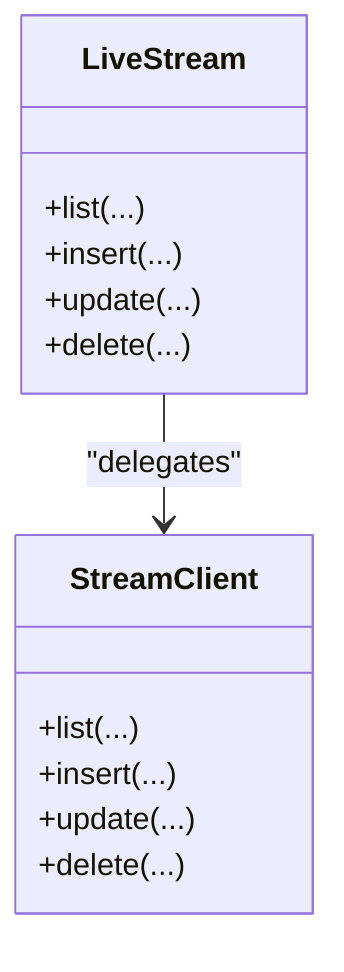
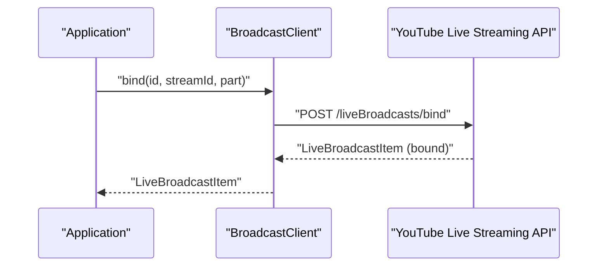
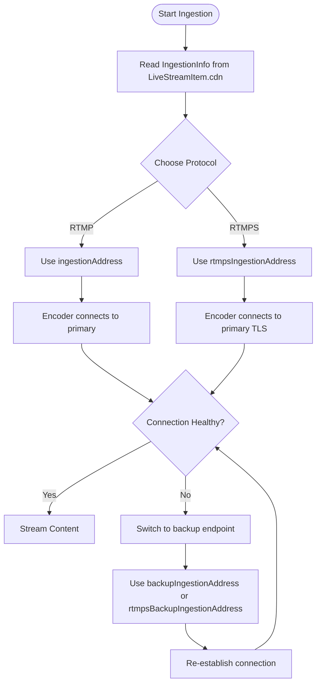
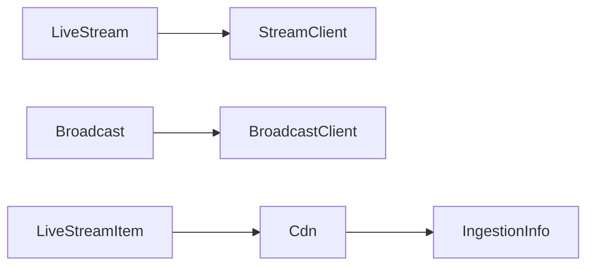

# Ingestion URL Management

<cite>
**Referenced Files in This Document**
- [README.md](file://README.md)
- [packages/yt/README.md](file://packages/yt/README.md)
- [packages/yt/lib/yt.dart](file://packages/yt/lib/yt.dart)
- [packages/yt/lib/src/live_stream.dart](file://packages/yt/lib/src/live_stream.dart)
- [packages/yt/lib/src/broadcast.dart](file://packages/yt/lib/src/broadcast.dart)
- [packages/yt/lib/src/provider/live/stream.dart](file://packages/yt/lib/src/provider/live/stream.dart)
- [packages/yt/lib/src/provider/live/broadcast.g.dart](file://packages/yt/lib/src/provider/live/broadcast.g.dart)
- [packages/yt/lib/src/model/stream/live_stream_item.dart](file://packages/yt/lib/src/model/stream/live_stream_item.dart)
- [packages/yt/lib/src/model/stream/live_stream_list_response.dart](file://packages/yt/lib/src/model/stream/live_stream_list_response.dart)
- [packages/yt/lib/src/model/stream/cdn.dart](file://packages/yt/lib/src/model/stream/cdn.dart)
- [packages/yt/lib/src/model/stream/ingestion_info.dart](file://packages/yt/lib/src/model/stream/ingestion_info.dart)
- [packages/yt/lib/src/model/broadcast/content_details.dart](file://packages/yt/lib/src/model/broadcast/content_details.dart)
- [packages/yt/lib/src/model/broadcast/monitor_stream.dart](file://packages/yt/lib/src/model/broadcast/monitor_stream.dart)
- [packages/yt/example/example.dart](file://packages/yt/example/example.dart)
</cite>

## Table of Contents
1. [Introduction](#introduction)
2. [Project Structure](#project-structure)
3. [Core Components](#core-components)
4. [Architecture Overview](#architecture-overview)
5. [Detailed Component Analysis](#detailed-component-analysis)
6. [Dependency Analysis](#dependency-analysis)
7. [Performance Considerations](#performance-considerations)
8. [Troubleshooting Guide](#troubleshooting-guide)
9. [Conclusion](#conclusion)
10. [Appendices](#appendices)

## Introduction
This document explains how to manage YouTube Live Stream ingestion URLs using the yt Dart package. It focuses on retrieving and configuring ingestion endpoints, understanding ingestion URL types and formats, applying security and access control, and operating ingestion URL lifecycles including rotation and failover. It also provides practical guidance for troubleshooting and optimizing ingestion performance.

The yt package exposes the YouTube Live Streaming API, enabling creation and management of live streams and broadcasts, and retrieval of ingestion endpoints exposed via the CDN model and ingestion info.

## Project Structure
The yt workspace includes multiple packages. The core library for YouTube Data and Live Streaming APIs resides under packages/yt. The Live Streaming API is primarily accessed through the LiveStream and Broadcast clients, with models representing streams, broadcasts, CDN settings, and ingestion endpoints.

**Diagram sources**
- [packages/yt/lib/yt.dart:11-66](file://packages/yt/lib/yt.dart#L11-L66)
- [packages/yt/lib/src/live_stream.dart:1-81](file://packages/yt/lib/src/live_stream.dart#L1-L81)
- [packages/yt/lib/src/broadcast.dart:1-168](file://packages/yt/lib/src/broadcast.dart#L1-L168)
- [packages/yt/lib/src/provider/live/stream.dart:1-68](file://packages/yt/lib/src/provider/live/stream.dart#L1-L68)
- [packages/yt/lib/src/provider/live/broadcast.g.dart:172-212](file://packages/yt/lib/src/provider/live/broadcast.g.dart#L172-L212)
- [packages/yt/lib/src/model/stream/live_stream_item.dart:1-44](file://packages/yt/lib/src/model/stream/live_stream_item.dart#L1-L44)
- [packages/yt/lib/src/model/stream/live_stream_list_response.dart:1-36](file://packages/yt/lib/src/model/stream/live_stream_list_response.dart#L1-L36)
- [packages/yt/lib/src/model/stream/cdn.dart:1-30](file://packages/yt/lib/src/model/stream/cdn.dart#L1-L30)
- [packages/yt/lib/src/model/stream/ingestion_info.dart:1-30](file://packages/yt/lib/src/model/stream/ingestion_info.dart#L1-L30)
- [packages/yt/lib/src/model/broadcast/content_details.dart:56-76](file://packages/yt/lib/src/model/broadcast/content_details.dart#L56-L76)
- [packages/yt/lib/src/model/broadcast/monitor_stream.dart:19-40](file://packages/yt/lib/src/model/broadcast/monitor_stream.dart#L19-L40)

**Section sources**
- [README.md:1-119](file://README.md#L1-L119)
- [packages/yt/README.md:1-523](file://packages/yt/README.md#L1-L523)

## Core Components
- LiveStream client: Lists, creates, updates, and deletes live streams. It uses Retrofit-generated StreamClient to call the YouTube Live Streaming API endpoints.
- Broadcast client: Manages broadcasts, including listing, inserting, updating, transitioning, binding to streams, and deletion.
- CDN and IngestionInfo models: Represent CDN settings and ingestion endpoints returned by the API. IngestionInfo includes primary and backup ingestion addresses for RTMP and RTMPS protocols.
- Example usage: Demonstrates listing broadcasts and related operations.

Key ingestion-related models:
- LiveStreamItem: Contains snippet, cdn, and status.
- Cdn: Exposes ingestionType and ingestionInfo.
- IngestionInfo: Provides streamName and ingestion addresses for primary and backup endpoints, including RTMP and RTMPS variants.

**Section sources**
- [packages/yt/lib/src/live_stream.dart:1-81](file://packages/yt/lib/src/live_stream.dart#L1-L81)
- [packages/yt/lib/src/broadcast.dart:1-168](file://packages/yt/lib/src/broadcast.dart#L1-L168)
- [packages/yt/lib/src/provider/live/stream.dart:1-68](file://packages/yt/lib/src/provider/live/stream.dart#L1-L68)
- [packages/yt/lib/src/model/stream/live_stream_item.dart:12-44](file://packages/yt/lib/src/model/stream/live_stream_item.dart#L12-L44)
- [packages/yt/lib/src/model/stream/cdn.dart:9-30](file://packages/yt/lib/src/model/stream/cdn.dart#L9-L30)
- [packages/yt/lib/src/model/stream/ingestion_info.dart:7-30](file://packages/yt/lib/src/model/stream/ingestion_info.dart#L7-L30)
- [packages/yt/example/example.dart:37-45](file://packages/yt/example/example.dart#L37-L45)

## Architecture Overview
The ingestion URL lifecycle integrates stream creation, broadcast binding, and endpoint retrieval. The following sequence illustrates the typical flow from API calls to ingestion endpoint consumption.

**Diagram sources**
- [packages/yt/lib/src/broadcast.dart:39-56](file://packages/yt/lib/src/broadcast.dart#L39-L56)
- [packages/yt/lib/src/broadcast.dart:95-111](file://packages/yt/lib/src/broadcast.dart#L95-L111)
- [packages/yt/lib/src/live_stream.dart:36-49](file://packages/yt/lib/src/live_stream.dart#L36-L49)
- [packages/yt/lib/src/provider/live/stream.dart:28-40](file://packages/yt/lib/src/provider/live/stream.dart#L28-L40)
- [packages/yt/lib/src/provider/live/broadcast.g.dart:172-212](file://packages/yt/lib/src/provider/live/broadcast.g.dart#L172-L212)

## Detailed Component Analysis

### IngestionInfo Model
IngestionInfo encapsulates the ingestion endpoints returned by the API. It includes:
- streamName: Identifier for the ingest stream.
- ingestionAddress: Primary ingestion address for RTMP.
- backupIngestionAddress: Backup ingestion address for RTMP.
- rtmpsIngestionAddress: Primary ingestion address for RTMPS.
- rtmpsBackupIngestionAddress: Backup ingestion address for RTMPS.

These fields enable configuring encoders and streaming software with either RTMP or RTMPS endpoints, and support primary/backup rotation.

**Diagram sources**
- [packages/yt/lib/src/model/stream/ingestion_info.dart:8-30](file://packages/yt/lib/src/model/stream/ingestion_info.dart#L8-L30)

**Section sources**
- [packages/yt/lib/src/model/stream/ingestion_info.dart:7-30](file://packages/yt/lib/src/model/stream/ingestion_info.dart#L7-L30)

### CDN Model and Ingestion Endpoints
The CDN model exposes ingestionType and ingestionInfo, allowing retrieval of protocol-specific endpoints. The ingestionInfo fields provide the actual URLs used by encoders.

**Diagram sources**
- [packages/yt/lib/src/model/stream/cdn.dart:9-30](file://packages/yt/lib/src/model/stream/cdn.dart#L9-L30)
- [packages/yt/lib/src/model/stream/ingestion_info.dart:8-30](file://packages/yt/lib/src/model/stream/ingestion_info.dart#L8-L30)

**Section sources**
- [packages/yt/lib/src/model/stream/cdn.dart:9-30](file://packages/yt/lib/src/model/stream/cdn.dart#L9-L30)

### LiveStream and StreamClient
The LiveStream client wraps StreamClient to list, insert, update, and delete live streams. The StreamClient Retrofit interface defines the HTTP endpoints for live streams.

**Diagram sources**
- [packages/yt/lib/src/live_stream.dart:7-81](file://packages/yt/lib/src/live_stream.dart#L7-L81)
- [packages/yt/lib/src/provider/live/stream.dart:9-68](file://packages/yt/lib/src/provider/live/stream.dart#L9-L68)

**Section sources**
- [packages/yt/lib/src/live_stream.dart:12-81](file://packages/yt/lib/src/live_stream.dart#L12-L81)
- [packages/yt/lib/src/provider/live/stream.dart:12-66](file://packages/yt/lib/src/provider/live/stream.dart#L12-L66)

### Broadcast and Binding Workflow
Broadcast client manages broadcasts and supports binding to streams. The bind operation attaches a broadcast to a stream, after which ingestion endpoints become available.

**Diagram sources**
- [packages/yt/lib/src/broadcast.dart:95-111](file://packages/yt/lib/src/broadcast.dart#L95-L111)
- [packages/yt/lib/src/provider/live/broadcast.g.dart:172-212](file://packages/yt/lib/src/provider/live/broadcast.g.dart#L172-L212)

**Section sources**
- [packages/yt/lib/src/broadcast.dart:77-111](file://packages/yt/lib/src/broadcast.dart#L77-L111)

### Retrieving Ingestion URLs
To obtain ingestion URLs:
- Create or retrieve a LiveStreamItem via LiveStream.list/insert/update.
- Ensure a LiveBroadcastItem exists and is bound to the target LiveStream via Broadcast.bind.
- Access the LiveStreamItem.cdn.ingestionInfo to read ingestion endpoints.

The ingestionInfo fields provide:
- Primary and backup endpoints for RTMP and RTMPS.
- streamName for encoder configuration.

**Section sources**
- [packages/yt/lib/src/live_stream.dart:12-49](file://packages/yt/lib/src/live_stream.dart#L12-L49)
- [packages/yt/lib/src/broadcast.dart:95-111](file://packages/yt/lib/src/broadcast.dart#L95-L111)
- [packages/yt/lib/src/model/stream/live_stream_item.dart:12-44](file://packages/yt/lib/src/model/stream/live_stream_item.dart#L12-L44)
- [packages/yt/lib/src/model/stream/cdn.dart:9-30](file://packages/yt/lib/src/model/stream/cdn.dart#L9-L30)
- [packages/yt/lib/src/model/stream/ingestion_info.dart:7-30](file://packages/yt/lib/src/model/stream/ingestion_info.dart#L7-L30)

### Managing URL Lifecycles and Rotation
- Primary/backup rotation: Use backupIngestionAddress and rtmpsBackupIngestionAddress when primary endpoints fail.
- Encoder configuration: Configure encoders with streamName and the chosen ingestionAddress or rtmpsIngestionAddress.
- Failover scenarios: Switch to backup endpoints during connectivity issues; re-configure to primary endpoints when restored.

**Diagram sources**
- [packages/yt/lib/src/model/stream/ingestion_info.dart:8-30](file://packages/yt/lib/src/model/stream/ingestion_info.dart#L8-L30)

**Section sources**
- [packages/yt/lib/src/model/stream/ingestion_info.dart:7-30](file://packages/yt/lib/src/model/stream/ingestion_info.dart#L7-L30)

### Security and Access Control
- Authentication: Use OAuth 2.0 or API key as appropriate for the API surface. The yt package supports OAuth-based access for Live Streaming API operations.
- Token persistence: The library manages OAuth refresh tokens and persists them for long-lived sessions.
- Distribution: Treat ingestion URLs as sensitive. Distribute only to trusted encoders and avoid exposing them publicly.
- Transport: Prefer RTMPS endpoints for encrypted ingestion when supported by your encoder.

**Section sources**
- [packages/yt/README.md:111-152](file://packages/yt/README.md#L111-L152)
- [packages/yt/README.md:205-249](file://packages/yt/README.md#L205-L249)

### Configuring Different Protocols
- RTMP: ingestionAddress and backupIngestionAddress.
- RTMPS: rtmpsIngestionAddress and rtmpsBackupIngestionAddress.
- Encoder setup: Provide streamName and the selected ingestion address. Ensure encoder settings match the chosen protocol and backup endpoints.

**Section sources**
- [packages/yt/lib/src/model/stream/ingestion_info.dart:8-30](file://packages/yt/lib/src/model/stream/ingestion_info.dart#L8-L30)

### Managing Multiple Ingestion Endpoints
- Use backup endpoints for redundancy.
- Rotate endpoints proactively during maintenance windows.
- Monitor connection health and switch automatically when failures occur.

**Section sources**
- [packages/yt/lib/src/model/stream/ingestion_info.dart:8-30](file://packages/yt/lib/src/model/stream/ingestion_info.dart#L8-L30)

### Best Practices for URL Distribution
- Limit distribution to authorized encoders only.
- Avoid embedding ingestion URLs in public code or logs.
- Rotate URLs periodically and update encoders accordingly.
- Use RTMPS when available for secure ingestion.

**Section sources**
- [packages/yt/lib/src/model/stream/ingestion_info.dart:8-30](file://packages/yt/lib/src/model/stream/ingestion_info.dart#L8-L30)

## Dependency Analysis
The Live Streaming API layer depends on Retrofit-generated clients and JSON-serializable models. The LiveStream and Broadcast clients delegate HTTP operations to StreamClient and BroadcastClient respectively. Models like LiveStreamItem, Cdn, and IngestionInfo represent the API response structures.

**Diagram sources**
- [packages/yt/lib/src/live_stream.dart:7-11](file://packages/yt/lib/src/live_stream.dart#L7-L11)
- [packages/yt/lib/src/broadcast.dart:7-11](file://packages/yt/lib/src/broadcast.dart#L7-L11)
- [packages/yt/lib/src/model/stream/live_stream_item.dart:14-34](file://packages/yt/lib/src/model/stream/live_stream_item.dart#L14-L34)
- [packages/yt/lib/src/model/stream/cdn.dart:10-21](file://packages/yt/lib/src/model/stream/cdn.dart#L10-L21)
- [packages/yt/lib/src/model/stream/ingestion_info.dart:8-21](file://packages/yt/lib/src/model/stream/ingestion_info.dart#L8-L21)

**Section sources**
- [packages/yt/lib/src/live_stream.dart:7-11](file://packages/yt/lib/src/live_stream.dart#L7-L11)
- [packages/yt/lib/src/broadcast.dart:7-11](file://packages/yt/lib/src/broadcast.dart#L7-L11)
- [packages/yt/lib/src/model/stream/live_stream_item.dart:14-34](file://packages/yt/lib/src/model/stream/live_stream_item.dart#L14-L34)
- [packages/yt/lib/src/model/stream/cdn.dart:10-21](file://packages/yt/lib/src/model/stream/cdn.dart#L10-L21)
- [packages/yt/lib/src/model/stream/ingestion_info.dart:8-21](file://packages/yt/lib/src/model/stream/ingestion_info.dart#L8-L21)

## Performance Considerations
- Choose appropriate resolution and frame rate via CDN settings to match encoder capabilities and network conditions.
- Use RTMPS when available to reduce potential interception risks and leverage optimized transport stacks.
- Monitor encoder-side statistics and adjust bitrate or resolution dynamically to maintain stable ingestion.
- Minimize encoder reconnections by preferring backup endpoints during brief outages.

[No sources needed since this section provides general guidance]

## Troubleshooting Guide
Common ingestion issues and remedies:
- No active broadcast bound to stream: Ensure Broadcast.bind has been called and the broadcast status is active.
- Encoder fails to connect: Verify the correct protocol (RTMP vs RTMPS) and the selected primary or backup endpoint.
- Frequent disconnections: Switch to backup endpoints and investigate network stability; rotate endpoints to a different region if supported.
- Incorrect streamName: Confirm the streamName from IngestionInfo is used by the encoder.

Operational checks:
- Retrieve LiveStreamItem and inspect LiveStreamItem.cdn.ingestionInfo for endpoints.
- Confirm Broadcast status is active and bound to the intended stream.
- Validate OAuth credentials and permissions for the Live Streaming API.

**Section sources**
- [packages/yt/lib/src/broadcast.dart:95-111](file://packages/yt/lib/src/broadcast.dart#L95-L111)
- [packages/yt/lib/src/model/stream/ingestion_info.dart:7-30](file://packages/yt/lib/src/model/stream/ingestion_info.dart#L7-L30)
- [packages/yt/README.md:205-249](file://packages/yt/README.md#L205-L249)

## Conclusion
The yt package provides a structured approach to YouTube Live Stream ingestion URL management. By leveraging LiveStream and Broadcast clients, and interpreting CDN and IngestionInfo models, you can reliably configure, rotate, and secure ingestion endpoints. Applying RTMPS, maintaining primary/backup endpoints, and enforcing strict access controls are essential for robust and secure live streaming operations.

[No sources needed since this section summarizes without analyzing specific files]

## Appendices

### Example: Listing Broadcasts
The example demonstrates listing broadcasts, which is often the first step before binding and retrieving ingestion endpoints.

**Section sources**
- [packages/yt/example/example.dart:37-45](file://packages/yt/example/example.dart#L37-L45)