# Live Streaming

<cite>
**Referenced Files in This Document**
- [README.md](file://README.md)
- [pubspec.yaml](file://pubspec.yaml)
- [live_stream.dart](file://packages/yt/lib/src/live_stream.dart)
- [broadcast.dart](file://packages/yt/lib/src/broadcast.dart)
- [stream.dart](file://packages/yt/lib/src/provider/live/stream.dart)
- [live_broadcast_item.dart](file://packages/yt/lib/src/model/broadcast/live_broadcast_item.dart)
- [content_details.dart](file://packages/yt/lib/src/model/broadcast/content_details.dart)
- [snippet.dart](file://packages/yt/lib/src/model/broadcast/snippet.dart)
- [status.dart](file://packages/yt/lib/src/model/broadcast/status.dart)
- [statistics.dart](file://packages/yt/lib/src/model/broadcast/statistics.dart)
- [monitor_stream.dart](file://packages/yt/lib/src/model/broadcast/monitor_stream.dart)
- [health_status.dart](file://packages/yt/lib/src/model/broadcast/health_status.dart)
- [configuration_issue.dart](file://packages/yt/lib/src/model/broadcast/configuration_issue.dart)
- [youtube_stream_command.dart](file://packages/yt_cli/lib/src/cmd/youtube_stream_command.dart)
</cite>

## Table of Contents
1. [Introduction](#introduction)
2. [Project Structure](#project-structure)
3. [Core Components](#core-components)
4. [Architecture Overview](#architecture-overview)
5. [Detailed Component Analysis](#detailed-component-analysis)
6. [Dependency Analysis](#dependency-analysis)
7. [Performance Considerations](#performance-considerations)
8. [Troubleshooting Guide](#troubleshooting-guide)
9. [Conclusion](#conclusion)
10. [Appendices](#appendices)

## Introduction
This document explains how to integrate and operate YouTube Live Streaming using the yt Dart package. It covers the end-to-end live streaming lifecycle: creating and configuring streams, binding them to broadcasts, monitoring stream health and broadcast statistics, and managing common operational scenarios such as testing, transitions, and troubleshooting. It also provides practical guidance for stream testing, quality assurance, and production deployment considerations.

The yt package exposes a native Dart interface to YouTube’s Data and Live Streaming APIs, enabling programmatic control of live events and streams. The repository README confirms support for YouTube Live Streaming APIs, and the core implementation resides in the yt package with a CLI companion for quick operations.

**Section sources**
- [README.md:55-62](file://README.md#L55-L62)
- [README.md:64-71](file://README.md#L64-L71)

## Project Structure
The workspace is organized as a monorepo with multiple packages. The yt package contains the core Live Streaming API client and models. The yt_cli package provides a command-line interface for common operations, including inserting and updating live streams.

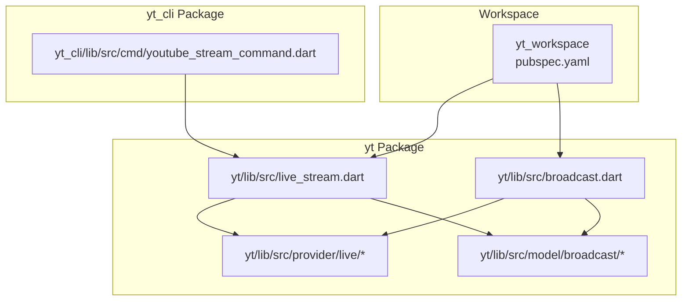

**Diagram sources**
- [pubspec.yaml:17-22](file://pubspec.yaml#L17-L22)
- [live_stream.dart:1-81](file://packages/yt/lib/src/live_stream.dart#L1-L81)
- [broadcast.dart:1-168](file://packages/yt/lib/src/broadcast.dart#L1-L168)
- [stream.dart:1-26](file://packages/yt/lib/src/provider/live/stream.dart#L1-L26)
- [youtube_stream_command.dart:99-145](file://packages/yt_cli/lib/src/cmd/youtube_stream_command.dart#L99-L145)

**Section sources**
- [pubspec.yaml:17-22](file://pubspec.yaml#L17-L22)
- [README.md:8-18](file://README.md#L8-L18)

## Core Components
This section outlines the primary building blocks for live streaming operations.

- LiveStream client
  - Provides CRUD operations for live streams: list, insert, update, delete.
  - Uses Retrofit-generated StreamClient under the hood to call the YouTube Live Streaming API.

- Broadcast client
  - Manages broadcasts: list, insert, update, transition, bind, delete.
  - Includes convenience helpers to fetch active/upcoming broadcasts.

- LiveBroadcastItem model
  - Represents a broadcast resource with snippet, status, contentDetails, and statistics.
  - Implements Comparable to sort and select the closest upcoming broadcast.

- ContentDetails model
  - Encapsulates broadcast content settings: auto-start/stop, encryption, DVR, embedding, latency preference, monitor stream, projection, recording, and slate behavior.

- Snippet model
  - Contains broadcast metadata: title, description, scheduling, thumbnails, and live chat ID.

- Status model
  - Tracks lifecycle, privacy, recording status, and kid-directed flags.

- Statistics model
  - Live chat metrics available during a live broadcast.

- MonitorStream model
  - Defines monitor stream enablement, delay, and embed HTML.

- HealthStatus model
  - Reports stream health status, last update time, and configuration issues.

- ConfigurationIssue model
  - Describes configuration issues with type, severity, reason, and description.

**Section sources**
- [live_stream.dart:6-81](file://packages/yt/lib/src/live_stream.dart#L6-L81)
- [broadcast.dart:6-168](file://packages/yt/lib/src/broadcast.dart#L6-L168)
- [live_broadcast_item.dart:13-63](file://packages/yt/lib/src/model/broadcast/live_broadcast_item.dart#L13-L63)
- [content_details.dart:9-121](file://packages/yt/lib/src/model/broadcast/content_details.dart#L9-L121)
- [snippet.dart:9-64](file://packages/yt/lib/src/model/broadcast/snippet.dart#L9-L64)
- [status.dart:7-60](file://packages/yt/lib/src/model/broadcast/status.dart#L7-L60)
- [statistics.dart:7-23](file://packages/yt/lib/src/model/broadcast/statistics.dart#L7-L23)
- [monitor_stream.dart:7-41](file://packages/yt/lib/src/model/broadcast/monitor_stream.dart#L7-L41)
- [health_status.dart:9-41](file://packages/yt/lib/src/model/broadcast/health_status.dart#L9-L41)
- [configuration_issue.dart:7-37](file://packages/yt/lib/src/model/broadcast/configuration_issue.dart#L7-L37)

## Architecture Overview
The Live Streaming workflow connects streams and broadcasts through a series of API operations. The following diagram maps the major components and their interactions.

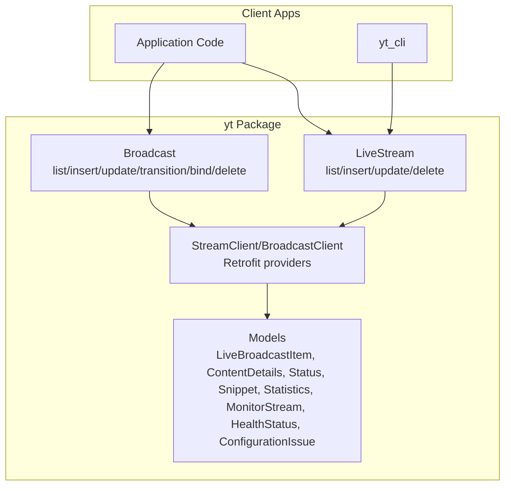

**Diagram sources**
- [live_stream.dart:6-81](file://packages/yt/lib/src/live_stream.dart#L6-L81)
- [broadcast.dart:6-168](file://packages/yt/lib/src/broadcast.dart#L6-L168)
- [stream.dart:7-26](file://packages/yt/lib/src/provider/live/stream.dart#L7-L26)
- [live_broadcast_item.dart:13-63](file://packages/yt/lib/src/model/broadcast/live_broadcast_item.dart#L13-L63)

## Detailed Component Analysis

### LiveStream Management
The LiveStream client encapsulates stream lifecycle operations:
- list: Retrieve streams with configurable parts and filters.
- insert: Create a new stream with a request body.
- update: Modify stream properties where permitted.
- delete: Remove a stream by ID.

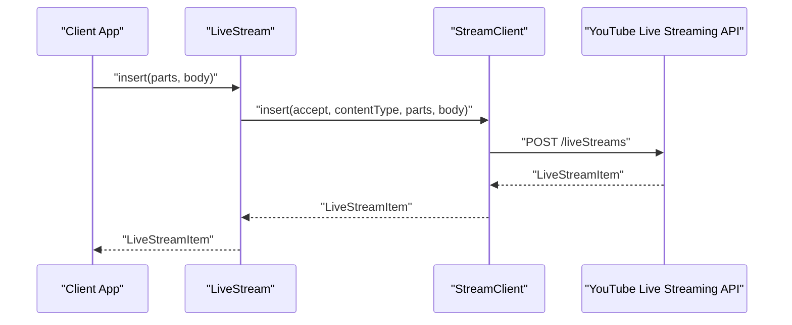

**Diagram sources**
- [live_stream.dart:36-49](file://packages/yt/lib/src/live_stream.dart#L36-L49)
- [stream.dart:12-26](file://packages/yt/lib/src/provider/live/stream.dart#L12-L26)

**Section sources**
- [live_stream.dart:12-81](file://packages/yt/lib/src/live_stream.dart#L12-L81)
- [stream.dart:7-26](file://packages/yt/lib/src/provider/live/stream.dart#L7-L26)

### Broadcast Lifecycle and Binding
Broadcast operations include listing, inserting, updating, transitioning, binding to a stream, and deletion. Convenience helpers assist in selecting active or upcoming broadcasts.

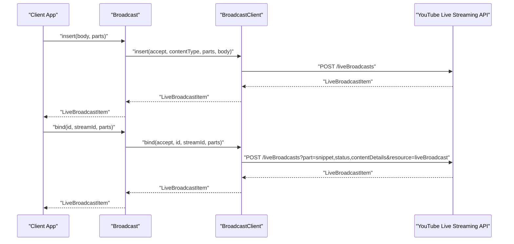

**Diagram sources**
- [broadcast.dart:39-111](file://packages/yt/lib/src/broadcast.dart#L39-L111)
- [live_broadcast_item.dart:13-40](file://packages/yt/lib/src/model/broadcast/live_broadcast_item.dart#L13-L40)

**Section sources**
- [broadcast.dart:12-168](file://packages/yt/lib/src/broadcast.dart#L12-L168)

### LiveBroadcastItem Model
LiveBroadcastItem aggregates the essential broadcast attributes and supports sorting by scheduled start time.

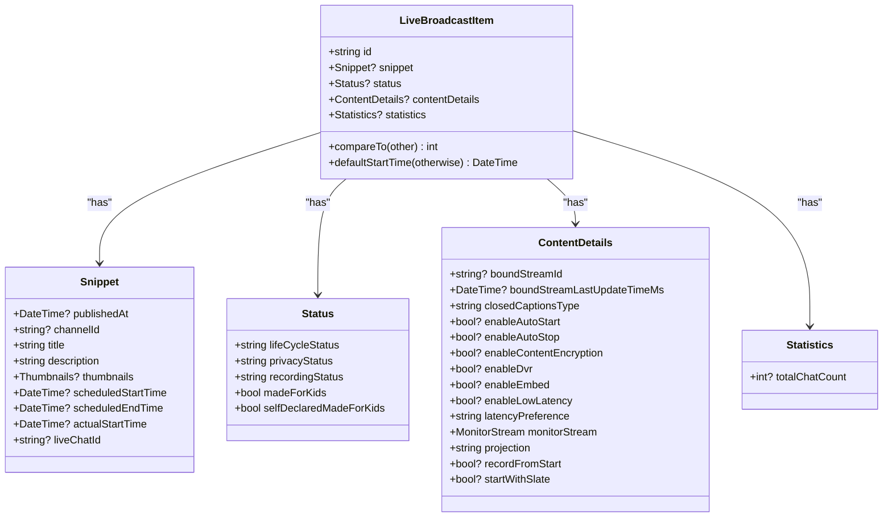

**Diagram sources**
- [live_broadcast_item.dart:13-63](file://packages/yt/lib/src/model/broadcast/live_broadcast_item.dart#L13-L63)
- [snippet.dart:9-64](file://packages/yt/lib/src/model/broadcast/snippet.dart#L9-L64)
- [status.dart:7-60](file://packages/yt/lib/src/model/broadcast/status.dart#L7-L60)
- [content_details.dart:9-121](file://packages/yt/lib/src/model/broadcast/content_details.dart#L9-L121)
- [statistics.dart:7-23](file://packages/yt/lib/src/model/broadcast/statistics.dart#L7-L23)

**Section sources**
- [live_broadcast_item.dart:13-63](file://packages/yt/lib/src/model/broadcast/live_broadcast_item.dart#L13-L63)

### Stream Health Monitoring
HealthStatus provides the current health state of a stream, including severity levels and configuration issues.

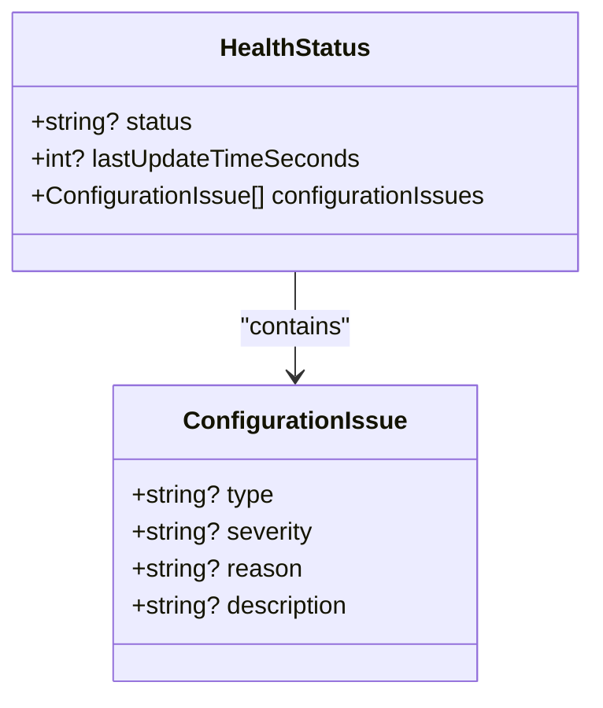

**Diagram sources**
- [health_status.dart:9-41](file://packages/yt/lib/src/model/broadcast/health_status.dart#L9-L41)
- [configuration_issue.dart:7-37](file://packages/yt/lib/src/model/broadcast/configuration_issue.dart#L7-L37)

**Section sources**
- [health_status.dart:9-41](file://packages/yt/lib/src/model/broadcast/health_status.dart#L9-L41)
- [configuration_issue.dart:7-37](file://packages/yt/lib/src/model/broadcast/configuration_issue.dart#L7-L37)

### Monitor Stream and Latency Preferences
MonitorStream defines whether a monitor stream is enabled and the broadcast delay. ContentDetails includes latency preferences and closed captions mode.

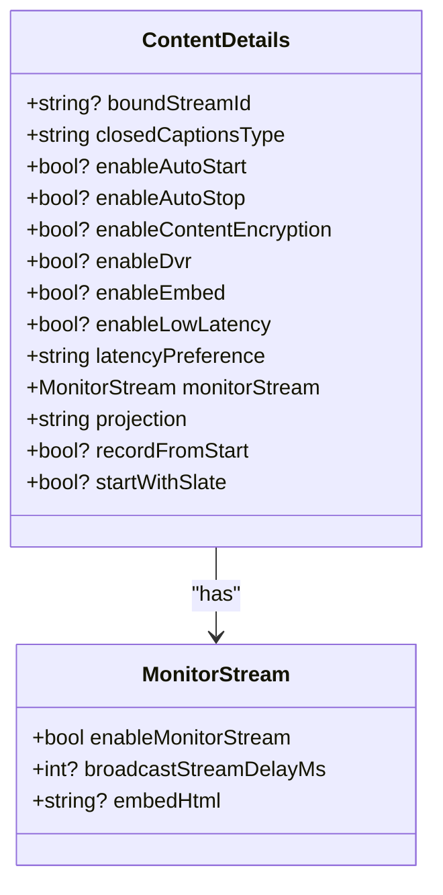

**Diagram sources**
- [monitor_stream.dart:7-41](file://packages/yt/lib/src/model/broadcast/monitor_stream.dart#L7-L41)
- [content_details.dart:9-121](file://packages/yt/lib/src/model/broadcast/content_details.dart#L9-L121)

**Section sources**
- [monitor_stream.dart:7-41](file://packages/yt/lib/src/model/broadcast/monitor_stream.dart#L7-L41)
- [content_details.dart:9-121](file://packages/yt/lib/src/model/broadcast/content_details.dart#L9-L121)

### Practical Workflows

#### Stream Creation and Configuration
- Use LiveStream.insert to create a stream with a request body containing snippet, contentDetails, and status parts.
- Configure contentDetails for latency preference, monitor stream, closed captions type, and other broadcast-related flags.
- Use the CLI insert command to quickly create a stream from a JSON body.

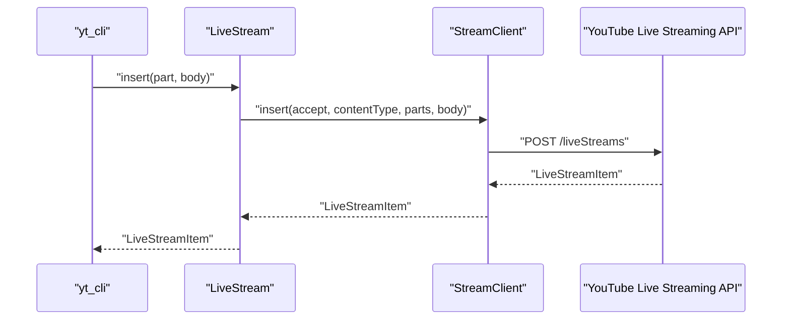

**Diagram sources**
- [youtube_stream_command.dart:118-134](file://packages/yt_cli/lib/src/cmd/youtube_stream_command.dart#L118-L134)
- [live_stream.dart:36-49](file://packages/yt/lib/src/live_stream.dart#L36-L49)
- [stream.dart:12-26](file://packages/yt/lib/src/provider/live/stream.dart#L12-L26)

**Section sources**
- [live_stream.dart:36-49](file://packages/yt/lib/src/live_stream.dart#L36-L49)
- [youtube_stream_command.dart:99-145](file://packages/yt_cli/lib/src/cmd/youtube_stream_command.dart#L99-L145)

#### Binding Streams to Broadcasts
- Create a broadcast with Broadcast.insert.
- Bind the broadcast to a stream using Broadcast.bind with the desired streamId.
- Transition the broadcast to testing or live using Broadcast.transition.

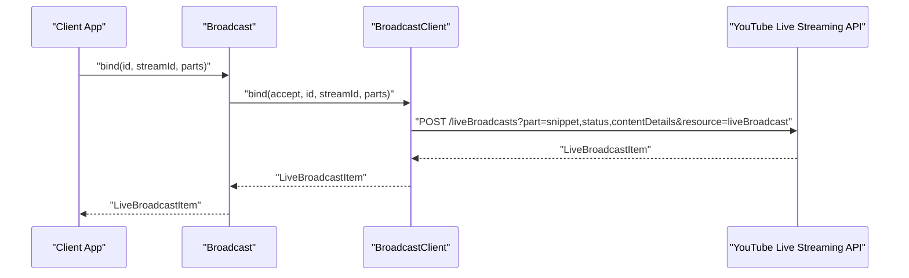

**Diagram sources**
- [broadcast.dart:95-111](file://packages/yt/lib/src/broadcast.dart#L95-L111)

**Section sources**
- [broadcast.dart:95-111](file://packages/yt/lib/src/broadcast.dart#L95-L111)

#### Stream Health Monitoring and Troubleshooting
- Retrieve stream health via the models’ health status fields.
- Inspect configuration issues to identify causes (type, severity, reason).
- Address issues based on severity and recommendations.

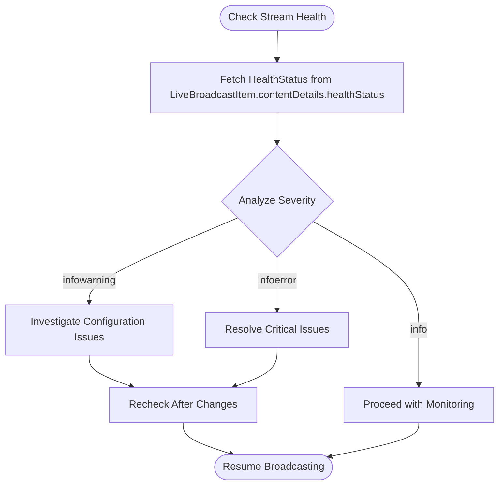

**Diagram sources**
- [health_status.dart:9-41](file://packages/yt/lib/src/model/broadcast/health_status.dart#L9-L41)
- [configuration_issue.dart:7-37](file://packages/yt/lib/src/model/broadcast/configuration_issue.dart#L7-L37)

**Section sources**
- [health_status.dart:9-41](file://packages/yt/lib/src/model/broadcast/health_status.dart#L9-L41)
- [configuration_issue.dart:7-37](file://packages/yt/lib/src/model/broadcast/configuration_issue.dart#L7-L37)

#### Managing Multiple Stream Sources and Interruptions
- Use separate LiveStream resources for different sources or scenarios.
- Bind a broadcast to the active stream using Broadcast.bind.
- Monitor broadcast statistics and transition to testing or live as needed.
- If interruptions occur, inspect HealthStatus and ConfigurationIssue to diagnose and recover.

[No sources needed since this section provides general guidance]

#### Optimizing Stream Quality and Latency
- Set ContentDetails.latencyPreference to balance latency and quality.
- Consider ultraLow latency for interactive scenarios, noting limitations.
- Enable monitor stream to preview and adjust settings before going live.

**Section sources**
- [content_details.dart:53-66](file://packages/yt/lib/src/model/broadcast/content_details.dart#L53-L66)
- [monitor_stream.dart:10-17](file://packages/yt/lib/src/model/broadcast/monitor_stream.dart#L10-L17)

#### Stream Testing and Production Deployment
- Use MonitorStream.enableMonitorStream and delay to test and refine the broadcast.
- Transition to testing first, then to live after verifying stream health.
- Ensure contentDetails flags align with production requirements (DVR, embedding, encryption).
- Validate broadcast status transitions and handle errors gracefully.

**Section sources**
- [monitor_stream.dart:10-22](file://packages/yt/lib/src/model/broadcast/monitor_stream.dart#L10-L22)
- [content_details.dart:32-89](file://packages/yt/lib/src/model/broadcast/content_details.dart#L32-L89)
- [status.dart:10-21](file://packages/yt/lib/src/model/broadcast/status.dart#L10-L21)

## Dependency Analysis
The Live Streaming module depends on Retrofit-generated clients and JSON-serializable models. The CLI integrates with the LiveStream client to provide quick insertion and updates.

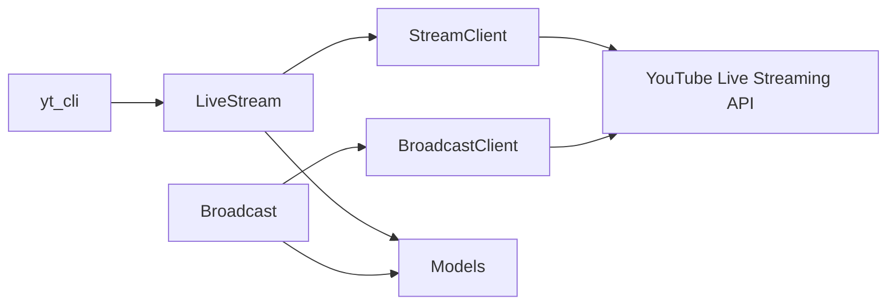

**Diagram sources**
- [live_stream.dart:6-10](file://packages/yt/lib/src/live_stream.dart#L6-L10)
- [broadcast.dart:7-10](file://packages/yt/lib/src/broadcast.dart#L7-L10)
- [stream.dart:7-10](file://packages/yt/lib/src/provider/live/stream.dart#L7-L10)

**Section sources**
- [live_stream.dart:6-10](file://packages/yt/lib/src/live_stream.dart#L6-L10)
- [broadcast.dart:7-10](file://packages/yt/lib/src/broadcast.dart#L7-L10)
- [stream.dart:7-10](file://packages/yt/lib/src/provider/live/stream.dart#L7-L10)

## Performance Considerations
- Choose latency preference carefully: ultraLow reduces latency but restricts features and resolution.
- Enable monitor stream to pre-validate quality and timing before going live.
- Keep contentDetails flags consistent with production needs to avoid post-transition errors.
- Monitor broadcast statistics during live events to track engagement and troubleshoot issues promptly.

[No sources needed since this section provides general guidance]

## Troubleshooting Guide
Common issues and actions:
- Stream health status “bad” or “error”: Review HealthStatus and ConfigurationIssue entries to identify and resolve critical configuration problems.
- Stream not appearing live: Verify broadcast binding and status transitions; ensure monitor stream testing completes successfully.
- Auto-start/stop misconfiguration: Confirm ContentDetails.enableAutoStart and enableAutoStop flags align with intended behavior.
- Latency concerns: Adjust ContentDetails.latencyPreference and evaluate trade-offs between latency and quality.

**Section sources**
- [health_status.dart:12-18](file://packages/yt/lib/src/model/broadcast/health_status.dart#L12-L18)
- [configuration_issue.dart:13-19](file://packages/yt/lib/src/model/broadcast/configuration_issue.dart#L13-L19)
- [content_details.dart:26-30](file://packages/yt/lib/src/model/broadcast/content_details.dart#L26-L30)
- [broadcast.dart:77-93](file://packages/yt/lib/src/broadcast.dart#L77-L93)

## Conclusion
The yt package provides a comprehensive, model-driven approach to YouTube Live Streaming. By leveraging LiveStream and Broadcast clients alongside robust models for broadcasts, content details, health status, and monitor stream settings, developers can automate stream creation, manage bindings, monitor health, and operate reliable live events. Use the CLI for quick tasks and integrate the core package for advanced automation and production-grade workflows.

[No sources needed since this section summarizes without analyzing specific files]

## Appendices

### API Operation Reference Map
- LiveStream
  - list: [live_stream.dart:12-34](file://packages/yt/lib/src/live_stream.dart#L12-L34)
  - insert: [live_stream.dart:36-49](file://packages/yt/lib/src/live_stream.dart#L36-L49)
  - update: [live_stream.dart:51-66](file://packages/yt/lib/src/live_stream.dart#L51-L66)
  - delete: [live_stream.dart:68-79](file://packages/yt/lib/src/live_stream.dart#L68-L79)

- Broadcast
  - list: [broadcast.dart:12-37](file://packages/yt/lib/src/broadcast.dart#L12-L37)
  - insert: [broadcast.dart:39-56](file://packages/yt/lib/src/broadcast.dart#L39-L56)
  - update: [broadcast.dart:58-75](file://packages/yt/lib/src/broadcast.dart#L58-L75)
  - transition: [broadcast.dart:77-93](file://packages/yt/lib/src/broadcast.dart#L77-L93)
  - bind: [broadcast.dart:95-111](file://packages/yt/lib/src/broadcast.dart#L95-L111)
  - delete: [broadcast.dart:113-126](file://packages/yt/lib/src/broadcast.dart#L113-L126)

**Section sources**
- [live_stream.dart:12-79](file://packages/yt/lib/src/live_stream.dart#L12-L79)
- [broadcast.dart:12-126](file://packages/yt/lib/src/broadcast.dart#L12-L126)