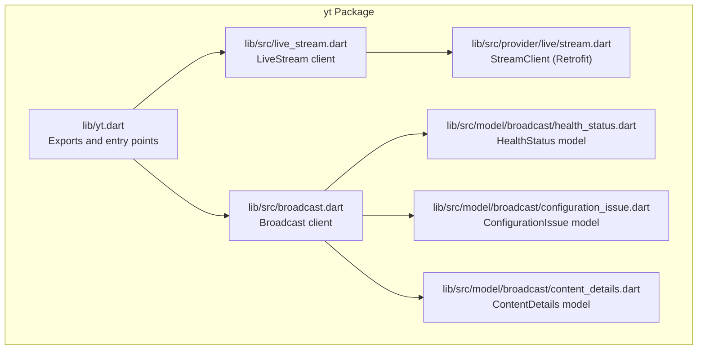
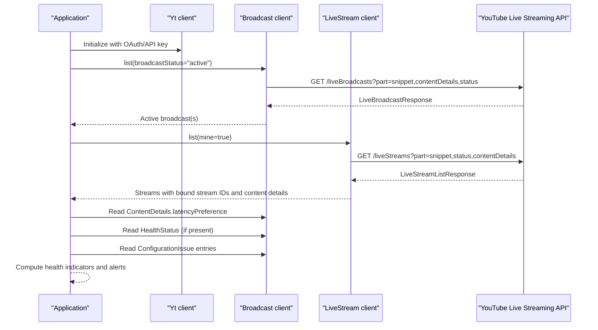
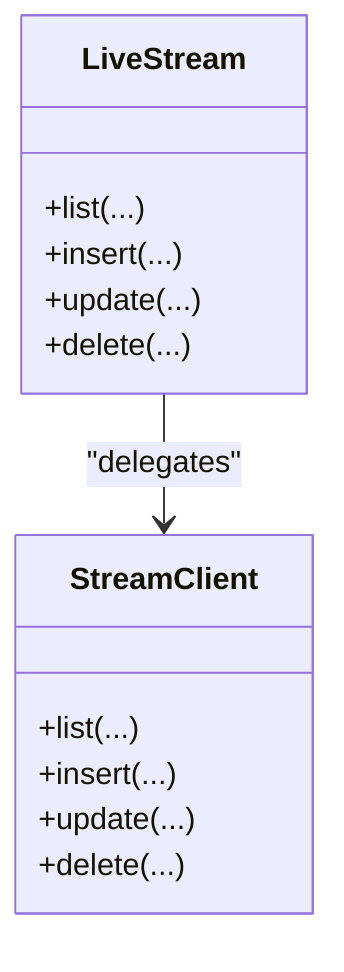
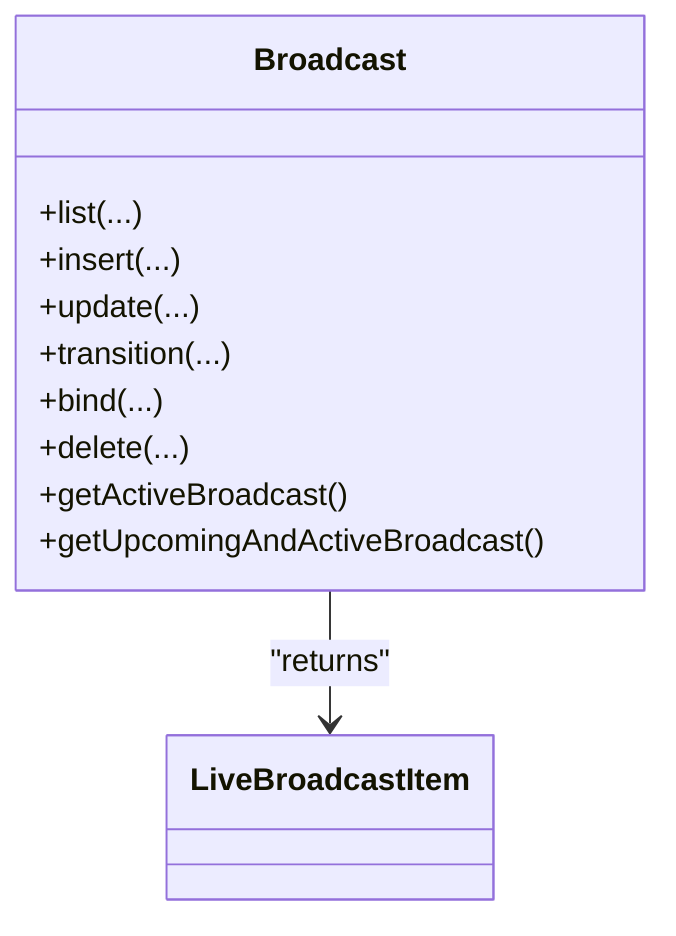
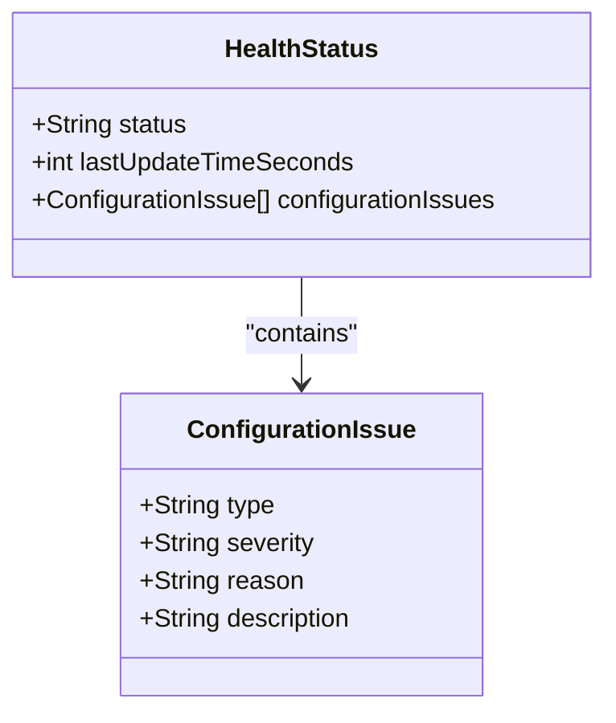
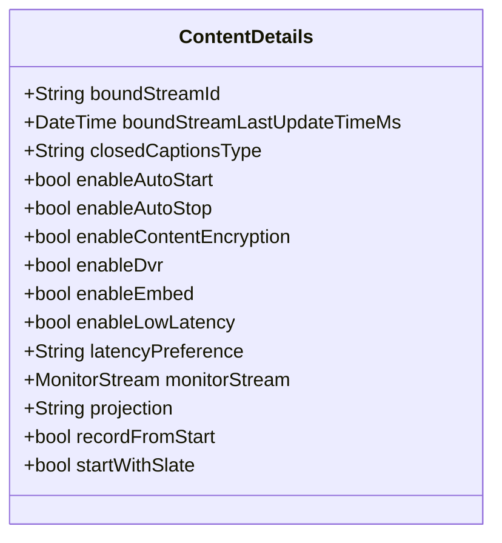
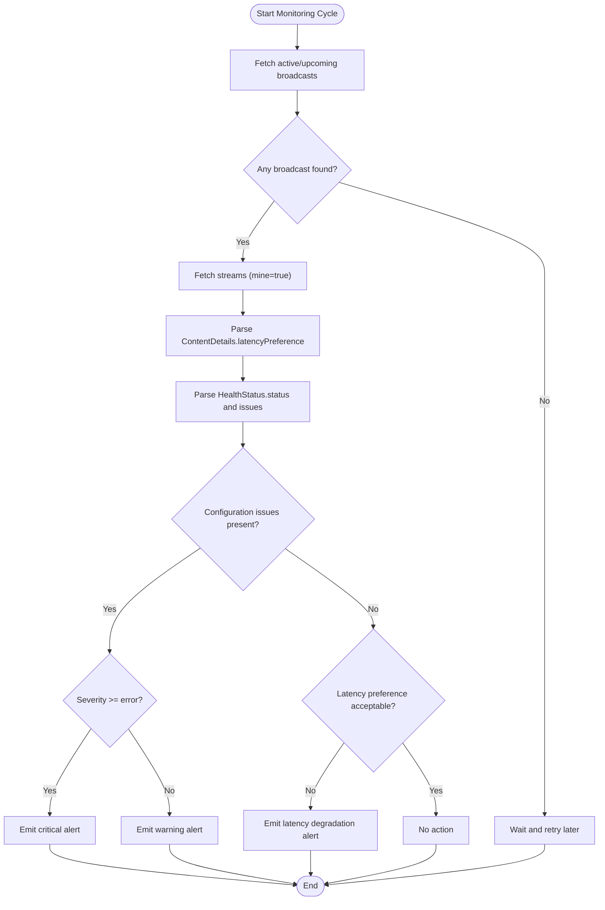
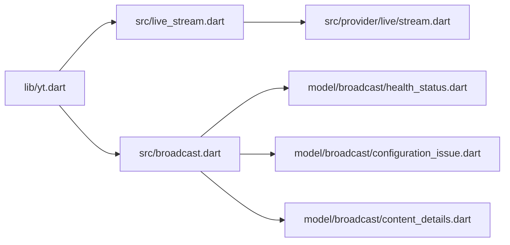

# Stream Health and Performance Monitoring

<cite>
**Referenced Files in This Document**
- [README.md](file://README.md)
- [pubspec.yaml](file://pubspec.yaml)
- [packages/yt/README.md](file://packages/yt/README.md)
- [packages/yt/lib/yt.dart](file://packages/yt/lib/yt.dart)
- [packages/yt/lib/src/live_stream.dart](file://packages/yt/lib/src/live_stream.dart)
- [packages/yt/lib/src/broadcast.dart](file://packages/yt/lib/src/broadcast.dart)
- [packages/yt/lib/src/model/broadcast/health_status.dart](file://packages/yt/lib/src/model/broadcast/health_status.dart)
- [packages/yt/lib/src/model/broadcast/configuration_issue.dart](file://packages/yt/lib/src/model/broadcast/configuration_issue.dart)
- [packages/yt/lib/src/model/broadcast/content_details.dart](file://packages/yt/lib/src/model/broadcast/content_details.dart)
- [packages/yt/lib/src/provider/live/stream.dart](file://packages/yt/lib/src/provider/live/stream.dart)
- [packages/yt/example/example.dart](file://packages/yt/example/example.dart)
- [packages/yt/example/livechat_example.dart](file://packages/yt/example/livechat_example.dart)
</cite>

## Table of Contents
1. [Introduction](#introduction)
2. [Project Structure](#project-structure)
3. [Core Components](#core-components)
4. [Architecture Overview](#architecture-overview)
5. [Detailed Component Analysis](#detailed-component-analysis)
6. [Dependency Analysis](#dependency-analysis)
7. [Performance Considerations](#performance-considerations)
8. [Troubleshooting Guide](#troubleshooting-guide)
9. [Conclusion](#conclusion)
10. [Appendices](#appendices)

## Introduction
This document explains how to monitor live stream health and performance using the yt Dart package. It focuses on:
- Monitoring stream status and ingestion quality
- Collecting stream statistics and health indicators
- Tracking latency and connectivity
- Identifying quality degradation and technical issues
- Setting up alerting and automated monitoring
- Integrating with external monitoring tools

The yt package exposes the YouTube Live Streaming API and Data API clients, enabling you to:
- List and manage live streams and broadcasts
- Inspect broadcast content details and health status
- Retrieve configuration issues that impact stream quality
- Track latency preferences and monitor stream behavior

## Project Structure
The yt workspace contains multiple packages. For live streaming monitoring, the relevant components are in the core yt package:
- Public exports and API entry points
- Live stream and broadcast clients
- Model definitions for health status, configuration issues, and content details
- Provider-level Retrofit clients for REST endpoints
- Example usage for listing broadcasts and streams

**Diagram sources**
- [packages/yt/lib/yt.dart:11-75](file://packages/yt/lib/yt.dart#L11-L75)
- [packages/yt/lib/src/live_stream.dart:1-81](file://packages/yt/lib/src/live_stream.dart#L1-L81)
- [packages/yt/lib/src/broadcast.dart:1-168](file://packages/yt/lib/src/broadcast.dart#L1-L168)
- [packages/yt/lib/src/model/broadcast/health_status.dart:1-41](file://packages/yt/lib/src/model/broadcast/health_status.dart#L1-L41)
- [packages/yt/lib/src/model/broadcast/configuration_issue.dart:1-37](file://packages/yt/lib/src/model/broadcast/configuration_issue.dart#L1-L37)
- [packages/yt/lib/src/model/broadcast/content_details.dart:1-121](file://packages/yt/lib/src/model/broadcast/content_details.dart#L1-L121)
- [packages/yt/lib/src/provider/live/stream.dart:1-68](file://packages/yt/lib/src/provider/live/stream.dart#L1-L68)

**Section sources**
- [README.md:1-119](file://README.md#L1-L119)
- [pubspec.yaml:1-69](file://pubspec.yaml#L1-L69)
- [packages/yt/README.md:1-523](file://packages/yt/README.md#L1-L523)

## Core Components
- LiveStream client: Lists, creates, updates, and deletes live streams. It uses a Retrofit-generated StreamClient under the hood.
- Broadcast client: Manages broadcasts, transitions statuses, binds streams, and retrieves active/upcoming broadcasts.
- HealthStatus model: Encapsulates stream health status, last update time, and configuration issues.
- ConfigurationIssue model: Describes types, severities, reasons, and descriptions of issues affecting the stream.
- ContentDetails model: Provides broadcast content settings including latency preference, auto-start/stop, DVR, embedding, and monitor stream configuration.

These components collectively enable monitoring of stream health, ingestion quality, and technical performance.

**Section sources**
- [packages/yt/lib/src/live_stream.dart:1-81](file://packages/yt/lib/src/live_stream.dart#L1-L81)
- [packages/yt/lib/src/broadcast.dart:1-168](file://packages/yt/lib/src/broadcast.dart#L1-L168)
- [packages/yt/lib/src/model/broadcast/health_status.dart:1-41](file://packages/yt/lib/src/model/broadcast/health_status.dart#L1-L41)
- [packages/yt/lib/src/model/broadcast/configuration_issue.dart:1-37](file://packages/yt/lib/src/model/broadcast/configuration_issue.dart#L1-L37)
- [packages/yt/lib/src/model/broadcast/content_details.dart:1-121](file://packages/yt/lib/src/model/broadcast/content_details.dart#L1-L121)

## Architecture Overview
The monitoring architecture centers on polling and parsing YouTube API responses to derive health and performance signals.

**Diagram sources**
- [packages/yt/lib/src/broadcast.dart:12-37](file://packages/yt/lib/src/broadcast.dart#L12-L37)
- [packages/yt/lib/src/live_stream.dart:12-34](file://packages/yt/lib/src/live_stream.dart#L12-L34)
- [packages/yt/lib/src/model/broadcast/content_details.dart:56-66](file://packages/yt/lib/src/model/broadcast/content_details.dart#L56-L66)
- [packages/yt/lib/src/model/broadcast/health_status.dart:12-18](file://packages/yt/lib/src/model/broadcast/health_status.dart#L12-L18)
- [packages/yt/lib/src/model/broadcast/configuration_issue.dart:10-18](file://packages/yt/lib/src/model/broadcast/configuration_issue.dart#L10-L18)

## Detailed Component Analysis

### LiveStream Client
The LiveStream client wraps a Retrofit-generated StreamClient to manage live streams:
- list(): Retrieves streams with configurable parts (e.g., snippet, status, contentDetails).
- insert(): Creates a new stream with a structured body.
- update(): Updates stream properties.
- delete(): Removes a stream.

**Diagram sources**
- [packages/yt/lib/src/live_stream.dart:7-80](file://packages/yt/lib/src/live_stream.dart#L7-L80)
- [packages/yt/lib/src/provider/live/stream.dart:8-67](file://packages/yt/lib/src/provider/live/stream.dart#L8-L67)

**Section sources**
- [packages/yt/lib/src/live_stream.dart:12-34](file://packages/yt/lib/src/live_stream.dart#L12-L34)
- [packages/yt/lib/src/live_stream.dart:36-49](file://packages/yt/lib/src/live_stream.dart#L36-L49)
- [packages/yt/lib/src/live_stream.dart:51-66](file://packages/yt/lib/src/live_stream.dart#L51-L66)
- [packages/yt/lib/src/live_stream.dart:68-79](file://packages/yt/lib/src/live_stream.dart#L68-L79)

### Broadcast Client
The Broadcast client manages broadcasts and integrates with health and content details:
- list(): Filters by status (active, upcoming, etc.) and returns broadcast items.
- insert(), update(), delete(): Manage broadcast lifecycle.
- transition(): Changes broadcast status (e.g., testing, live).
- bind(): Binds a stream to a broadcast.
- Helper methods: getActiveBroadcast(), getUpcomingAndActiveBroadcast().

**Diagram sources**
- [packages/yt/lib/src/broadcast.dart:7-167](file://packages/yt/lib/src/broadcast.dart#L7-L167)

**Section sources**
- [packages/yt/lib/src/broadcast.dart:12-37](file://packages/yt/lib/src/broadcast.dart#L12-L37)
- [packages/yt/lib/src/broadcast.dart:46-56](file://packages/yt/lib/src/broadcast.dart#L46-L56)
- [packages/yt/lib/src/broadcast.dart:65-75](file://packages/yt/lib/src/broadcast.dart#L65-L75)
- [packages/yt/lib/src/broadcast.dart:77-93](file://packages/yt/lib/src/broadcast.dart#L77-L93)
- [packages/yt/lib/src/broadcast.dart:95-111](file://packages/yt/lib/src/broadcast.dart#L95-L111)
- [packages/yt/lib/src/broadcast.dart:113-126](file://packages/yt/lib/src/broadcast.dart#L113-L126)
- [packages/yt/lib/src/broadcast.dart:128-136](file://packages/yt/lib/src/broadcast.dart#L128-L136)
- [packages/yt/lib/src/broadcast.dart:138-166](file://packages/yt/lib/src/broadcast.dart#L138-L166)

### HealthStatus and ConfigurationIssue Models
HealthStatus encapsulates:
- status: good, ok, bad, noData
- lastUpdateTimeSeconds: last update timestamp
- configurationIssues: list of ConfigurationIssue

ConfigurationIssue describes:
- type: issue type
- severity: info, infowarning, infoerror
- reason: short description
- description: detailed resolution guidance

**Diagram sources**
- [packages/yt/lib/src/model/broadcast/health_status.dart:11-40](file://packages/yt/lib/src/model/broadcast/health_status.dart#L11-L40)
- [packages/yt/lib/src/model/broadcast/configuration_issue.dart:9-36](file://packages/yt/lib/src/model/broadcast/configuration_issue.dart#L9-L36)

**Section sources**
- [packages/yt/lib/src/model/broadcast/health_status.dart:12-18](file://packages/yt/lib/src/model/broadcast/health_status.dart#L12-L18)
- [packages/yt/lib/src/model/broadcast/health_status.dart:21-25](file://packages/yt/lib/src/model/broadcast/health_status.dart#L21-L25)
- [packages/yt/lib/src/model/broadcast/configuration_issue.dart:10-18](file://packages/yt/lib/src/model/broadcast/configuration_issue.dart#L10-L18)
- [packages/yt/lib/src/model/broadcast/configuration_issue.dart:21-25](file://packages/yt/lib/src/model/broadcast/configuration_issue.dart#L21-L25)

### ContentDetails and Latency Preferences
ContentDetails includes:
- latencyPreference: normal, low, ultraLow
- enableAutoStart/enableAutoStop
- enableDvr, enableEmbed, enableLowLatency
- monitorStream configuration

These fields are essential for understanding latency behavior and enabling low-latency streaming configurations.

**Diagram sources**
- [packages/yt/lib/src/model/broadcast/content_details.dart:11-120](file://packages/yt/lib/src/model/broadcast/content_details.dart#L11-L120)

**Section sources**
- [packages/yt/lib/src/model/broadcast/content_details.dart:56-66](file://packages/yt/lib/src/model/broadcast/content_details.dart#L56-L66)
- [packages/yt/lib/src/model/broadcast/content_details.dart:26-30](file://packages/yt/lib/src/model/broadcast/content_details.dart#L26-L30)
- [packages/yt/lib/src/model/broadcast/content_details.dart:39-44](file://packages/yt/lib/src/model/broadcast/content_details.dart#L39-L44)
- [packages/yt/lib/src/model/broadcast/content_details.dart:53-60](file://packages/yt/lib/src/model/broadcast/content_details.dart#L53-L60)

### Monitoring Workflow: Health Indicators and Alerts
Use the following process to monitor stream health and performance:

**Diagram sources**
- [packages/yt/lib/src/broadcast.dart:128-136](file://packages/yt/lib/src/broadcast.dart#L128-L136)
- [packages/yt/lib/src/broadcast.dart:138-166](file://packages/yt/lib/src/broadcast.dart#L138-L166)
- [packages/yt/lib/src/live_stream.dart:12-34](file://packages/yt/lib/src/live_stream.dart#L12-L34)
- [packages/yt/lib/src/model/broadcast/content_details.dart:56-66](file://packages/yt/lib/src/model/broadcast/content_details.dart#L56-L66)
- [packages/yt/lib/src/model/broadcast/health_status.dart:12-18](file://packages/yt/lib/src/model/broadcast/health_status.dart#L12-L18)
- [packages/yt/lib/src/model/broadcast/configuration_issue.dart:10-18](file://packages/yt/lib/src/model/broadcast/configuration_issue.dart#L10-L18)

## Dependency Analysis
The following diagram shows key dependencies among monitoring-related components:

**Diagram sources**
- [packages/yt/lib/yt.dart:11-75](file://packages/yt/lib/yt.dart#L11-L75)
- [packages/yt/lib/src/live_stream.dart:1-81](file://packages/yt/lib/src/live_stream.dart#L1-L81)
- [packages/yt/lib/src/broadcast.dart:1-168](file://packages/yt/lib/src/broadcast.dart#L1-L168)
- [packages/yt/lib/src/provider/live/stream.dart:1-68](file://packages/yt/lib/src/provider/live/stream.dart#L1-L68)
- [packages/yt/lib/src/model/broadcast/health_status.dart:1-41](file://packages/yt/lib/src/model/broadcast/health_status.dart#L1-L41)
- [packages/yt/lib/src/model/broadcast/configuration_issue.dart:1-37](file://packages/yt/lib/src/model/broadcast/configuration_issue.dart#L1-L37)
- [packages/yt/lib/src/model/broadcast/content_details.dart:1-121](file://packages/yt/lib/src/model/broadcast/content_details.dart#L1-L121)

**Section sources**
- [packages/yt/lib/yt.dart:11-75](file://packages/yt/lib/yt.dart#L11-L75)
- [packages/yt/lib/src/live_stream.dart:1-81](file://packages/yt/lib/src/live_stream.dart#L1-L81)
- [packages/yt/lib/src/broadcast.dart:1-168](file://packages/yt/lib/src/broadcast.dart#L1-L168)

## Performance Considerations
- Latency preferences: Choose latencyPreference based on your needs. ultraLow reduces latency but restricts closed captions and resolutions above 1080p.
- Auto-start/stop: enableAutoStart and enableAutoStop can reduce manual intervention and improve reliability.
- DVR and embedding: Enabling DVR and embed affects archival and playback availability; ensure these align with your operational goals.
- Monitor stream: Use monitorStream to preview content before going live, reducing on-air issues.

Practical guidance:
- Prefer low or ultraLow latency for interactive events; evaluate trade-offs with closed captions and resolution.
- Enable auto-start to minimize downtime during transitions.
- Track boundStreamLastUpdateTimeMs to detect stale or inactive streams.

**Section sources**
- [packages/yt/lib/src/model/broadcast/content_details.dart:53-66](file://packages/yt/lib/src/model/broadcast/content_details.dart#L53-L66)
- [packages/yt/lib/src/model/broadcast/content_details.dart:26-30](file://packages/yt/lib/src/model/broadcast/content_details.dart#L26-L30)
- [packages/yt/lib/src/model/broadcast/content_details.dart:39-44](file://packages/yt/lib/src/model/broadcast/content_details.dart#L39-L44)
- [packages/yt/lib/src/model/broadcast/content_details.dart:78-89](file://packages/yt/lib/src/model/broadcast/content_details.dart#L78-L89)

## Troubleshooting Guide
Common scenarios and actionable checks:

- No active broadcast found
  - Use getActiveBroadcast() and getUpcomingAndActiveBroadcast() to locate current or nearest broadcast.
  - If none found, wait or trigger a new broadcast.

- Health status shows “bad” or “noData”
  - Inspect HealthStatus.status and lastUpdateTimeSeconds.
  - Review ConfigurationIssue entries for types and severities.
  - Critical issues (severity error) require immediate remediation; warnings (infowarning) indicate suboptimal performance.

- Connectivity problems
  - Verify boundStreamId and boundStreamLastUpdateTimeMs.
  - Confirm stream is bound to the intended broadcast and recently updated.

- Quality degradation
  - Check latencyPreference against operational requirements.
  - Evaluate enableLowLatency and projection settings.

- Alerting
  - Emit critical alerts when HealthStatus.status is “bad” or severity is “infoerror”.
  - Emit warning alerts for “infowarning” issues.
  - Emit latency degradation alerts when latencyPreference is not aligned with expectations.

**Section sources**
- [packages/yt/lib/src/broadcast.dart:128-136](file://packages/yt/lib/src/broadcast.dart#L128-L136)
- [packages/yt/lib/src/broadcast.dart:138-166](file://packages/yt/lib/src/broadcast.dart#L138-L166)
- [packages/yt/lib/src/model/broadcast/health_status.dart:12-18](file://packages/yt/lib/src/model/broadcast/health_status.dart#L12-L18)
- [packages/yt/lib/src/model/broadcast/configuration_issue.dart:10-18](file://packages/yt/lib/src/model/broadcast/configuration_issue.dart#L10-L18)
- [packages/yt/lib/src/model/broadcast/content_details.dart:15-16](file://packages/yt/lib/src/model/broadcast/content_details.dart#L15-L16)

## Conclusion
By combining the Broadcast and LiveStream clients with HealthStatus and ContentDetails models, you can build robust monitoring for live streams. Track health status, configuration issues, latency preferences, and stream binding timestamps to detect and resolve issues proactively. Integrate these signals into your alerting and automation systems to maintain high-quality live broadcasts.

## Appendices

### Example Usage References
- Listing broadcasts and printing basic metadata
  - [packages/yt/example/example.dart:37-45](file://packages/yt/example/example.dart#L37-L45)
- Live chat example (context for broadcast retrieval)
  - [packages/yt/example/livechat_example.dart:11-16](file://packages/yt/example/livechat_example.dart#L11-L16)