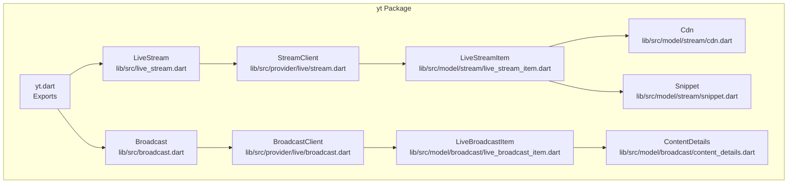
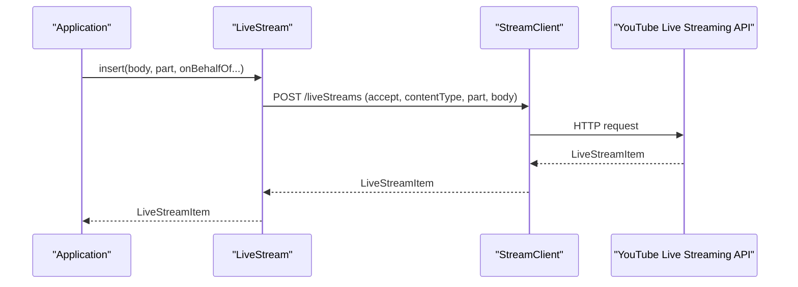
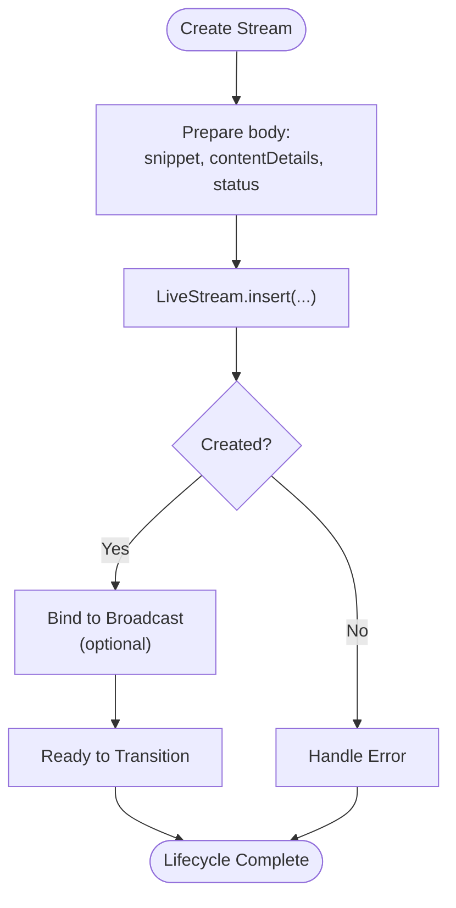
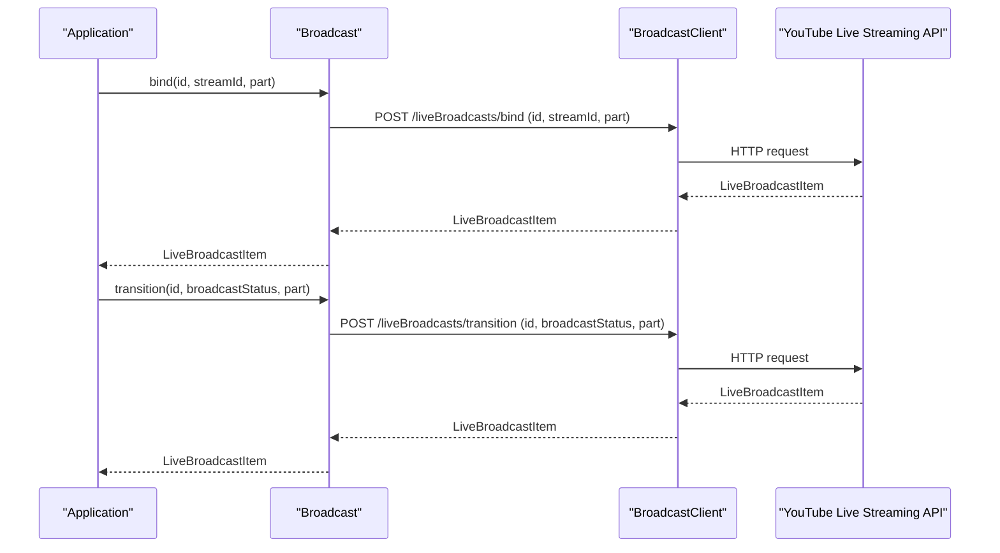
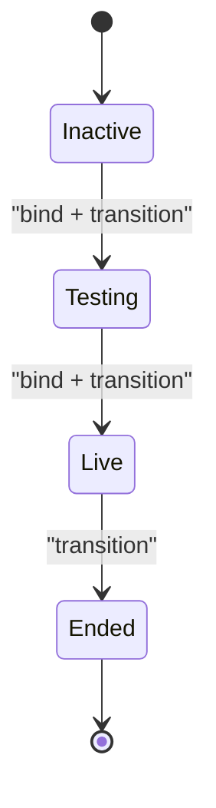
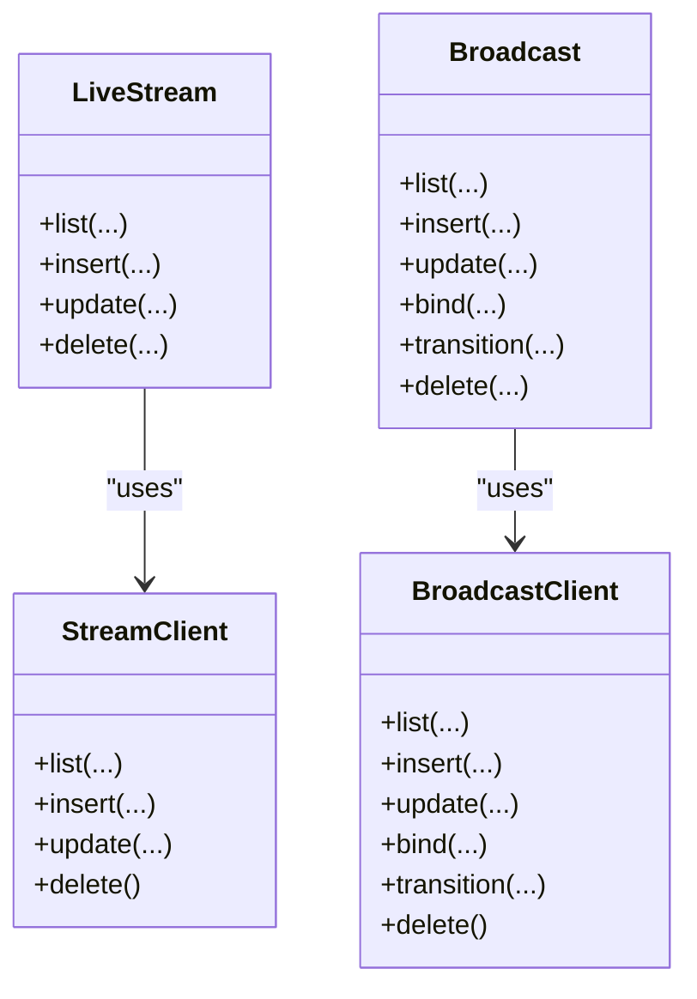

# Stream Lifecycle Management

<cite>
**Referenced Files in This Document**
- [README.md](file://README.md)
- [packages/yt/README.md](file://packages/yt/README.md)
- [packages/yt/lib/yt.dart](file://packages/yt/lib/yt.dart)
- [packages/yt/lib/src/live_stream.dart](file://packages/yt/lib/src/live_stream.dart)
- [packages/yt/lib/src/broadcast.dart](file://packages/yt/lib/src/broadcast.dart)
- [packages/yt/lib/src/provider/live/stream.dart](file://packages/yt/lib/src/provider/live/stream.dart)
- [packages/yt/lib/src/provider/live/broadcast.dart](file://packages/yt/lib/src/provider/live/broadcast.dart)
- [packages/yt/lib/src/model/stream/live_stream_item.dart](file://packages/yt/lib/src/model/stream/live_stream_item.dart)
- [packages/yt/lib/src/model/broadcast/live_broadcast_item.dart](file://packages/yt/lib/src/model/broadcast/live_broadcast_item.dart)
- [packages/yt/lib/src/model/stream/cdn.dart](file://packages/yt/lib/src/model/stream/cdn.dart)
- [packages/yt/lib/src/model/stream/snippet.dart](file://packages/yt/lib/src/model/stream/snippet.dart)
- [packages/yt/lib/src/model/broadcast/content_details.dart](file://packages/yt/lib/src/model/broadcast/content_details.dart)
- [packages/yt/example/example.dart](file://packages/yt/example/example.dart)
- [packages/yt/example/livechat_example.dart](file://packages/yt/example/livechat_example.dart)
</cite>

## Table of Contents
1. [Introduction](#introduction)
2. [Project Structure](#project-structure)
3. [Core Components](#core-components)
4. [Architecture Overview](#architecture-overview)
5. [Detailed Component Analysis](#detailed-component-analysis)
6. [Dependency Analysis](#dependency-analysis)
7. [Performance Considerations](#performance-considerations)
8. [Troubleshooting Guide](#troubleshooting-guide)
9. [Conclusion](#conclusion)
10. [Appendices](#appendices)

## Introduction
This document explains the complete lifecycle management of YouTube Live Streams using the yt Dart package. It covers stream creation, configuration, updates, binding to broadcasts, transitions, and deletion. It also documents state transitions, validation rules, error handling, ownership management, and practical examples for common workflows.

## Project Structure
The yt package exposes a clean API surface for YouTube Data and Live Streaming operations. The relevant modules for live stream lifecycle are:
- LiveStream API wrapper for listing, inserting, updating, and deleting live streams
- Broadcast API wrapper for listing, inserting, updating, binding to streams, transitioning statuses, and deleting broadcasts
- Provider clients implementing Retrofit endpoints for live streams and broadcasts
- Strongly typed models for streams and broadcasts, including CDN, snippet, and content details

**Diagram sources**
- [packages/yt/lib/yt.dart:11-56](file://packages/yt/lib/yt.dart#L11-L56)
- [packages/yt/lib/src/live_stream.dart:7-80](file://packages/yt/lib/src/live_stream.dart#L7-L80)
- [packages/yt/lib/src/broadcast.dart:7-167](file://packages/yt/lib/src/broadcast.dart#L7-L167)
- [packages/yt/lib/src/provider/live/stream.dart:8-67](file://packages/yt/lib/src/provider/live/stream.dart#L8-L67)
- [packages/yt/lib/src/provider/live/broadcast.dart:8-95](file://packages/yt/lib/src/provider/live/broadcast.dart#L8-L95)
- [packages/yt/lib/src/model/stream/live_stream_item.dart:12-43](file://packages/yt/lib/src/model/stream/live_stream_item.dart#L12-L43)
- [packages/yt/lib/src/model/broadcast/live_broadcast_item.dart:13-62](file://packages/yt/lib/src/model/broadcast/live_broadcast_item.dart#L13-L62)
- [packages/yt/lib/src/model/stream/cdn.dart:9-29](file://packages/yt/lib/src/model/stream/cdn.dart#L9-L29)
- [packages/yt/lib/src/model/stream/snippet.dart:7-40](file://packages/yt/lib/src/model/stream/snippet.dart#L7-L40)
- [packages/yt/lib/src/model/broadcast/content_details.dart:9-120](file://packages/yt/lib/src/model/broadcast/content_details.dart#L9-L120)

**Section sources**
- [packages/yt/README.md:30-42](file://packages/yt/README.md#L30-L42)
- [packages/yt/lib/yt.dart:11-56](file://packages/yt/lib/yt.dart#L11-L56)

## Core Components
- LiveStream: Provides CRUD operations for live streams and supports on-behalf-of content owner parameters.
- Broadcast: Provides CRUD operations for broadcasts, binding to streams, and status transitions.
- StreamClient/BroadcastClient: Retrofit-backed HTTP clients for live streams and broadcasts.
- LiveStreamItem/Cdn/Snippet: Stream model with snippet, CDN, and status details.
- LiveBroadcastItem/ContentDetails: Broadcast model with snippet, status, content details, and statistics.

Key capabilities:
- Create streams with snippet, CDN, and status parts
- Update streams when allowed by YouTube API constraints
- Delete streams
- List streams with filters (mine, id, pageToken)
- Insert/update broadcasts, bind to streams, transition statuses, delete broadcasts
- Retrieve active/upcoming broadcasts and select nearest broadcast

**Section sources**
- [packages/yt/lib/src/live_stream.dart:7-80](file://packages/yt/lib/src/live_stream.dart#L7-L80)
- [packages/yt/lib/src/broadcast.dart:7-167](file://packages/yt/lib/src/broadcast.dart#L7-L167)
- [packages/yt/lib/src/provider/live/stream.dart:8-67](file://packages/yt/lib/src/provider/live/stream.dart#L8-L67)
- [packages/yt/lib/src/provider/live/broadcast.dart:8-95](file://packages/yt/lib/src/provider/live/broadcast.dart#L8-L95)
- [packages/yt/lib/src/model/stream/live_stream_item.dart:12-43](file://packages/yt/lib/src/model/stream/live_stream_item.dart#L12-L43)
- [packages/yt/lib/src/model/broadcast/live_broadcast_item.dart:13-62](file://packages/yt/lib/src/model/broadcast/live_broadcast_item.dart#L13-L62)

## Architecture Overview
The lifecycle follows a clear separation of concerns:
- API wrappers (LiveStream, Broadcast) expose high-level operations
- Provider clients encapsulate Retrofit endpoints and HTTP interactions
- Models represent YouTube resource shapes and are JSON-serializable

**Diagram sources**
- [packages/yt/lib/src/live_stream.dart:36-49](file://packages/yt/lib/src/live_stream.dart#L36-L49)
- [packages/yt/lib/src/provider/live/stream.dart:28-40](file://packages/yt/lib/src/provider/live/stream.dart#L28-L40)

## Detailed Component Analysis

### Live Stream Lifecycle
- Creation: Use LiveStream.insert with a body containing snippet, contentDetails, and status parts. The snippet includes channelId, title, and description. The CDN settings define ingestion type, ingestion info, resolution, and frame rate.
- Listing: LiveStream.list supports filtering by id, mine, and pagination. Ownership parameters allow acting on behalf of a content owner or channel.
- Updating: LiveStream.update allows changing mutable properties; certain properties may require creating a new stream.
- Deleting: LiveStream.delete removes a stream by id with optional ownership parameters.

**Diagram sources**
- [packages/yt/lib/src/live_stream.dart:36-49](file://packages/yt/lib/src/live_stream.dart#L36-L49)
- [packages/yt/lib/src/model/stream/live_stream_item.dart:12-43](file://packages/yt/lib/src/model/stream/live_stream_item.dart#L12-L43)
- [packages/yt/lib/src/model/stream/cdn.dart:9-29](file://packages/yt/lib/src/model/stream/cdn.dart#L9-L29)
- [packages/yt/lib/src/model/stream/snippet.dart:7-40](file://packages/yt/lib/src/model/stream/snippet.dart#L7-L40)

**Section sources**
- [packages/yt/lib/src/live_stream.dart:12-80](file://packages/yt/lib/src/live_stream.dart#L12-L80)
- [packages/yt/lib/src/provider/live/stream.dart:12-66](file://packages/yt/lib/src/provider/live/stream.dart#L12-L66)
- [packages/yt/lib/src/model/stream/live_stream_item.dart:12-43](file://packages/yt/lib/src/model/stream/live_stream_item.dart#L12-L43)
- [packages/yt/lib/src/model/stream/cdn.dart:9-29](file://packages/yt/lib/src/model/stream/cdn.dart#L9-L29)
- [packages/yt/lib/src/model/stream/snippet.dart:7-40](file://packages/yt/lib/src/model/stream/snippet.dart#L7-L40)

### Broadcast Lifecycle and Binding
- Creation: Broadcast.insert creates a broadcast with snippet, contentDetails, and status. ContentDetails includes monitoring, embedding, DVR, latency preferences, and recording settings.
- Binding: Broadcast.bind associates a broadcast with a stream (one-to-many streams per broadcast). Unbind by passing null or omitting streamId.
- Transitions: Broadcast.transition moves a broadcast through states (testing, live, ended, unlisted). Ensure bound stream is active before transitioning.
- Deletion: Broadcast.delete removes a broadcast by id.

**Diagram sources**
- [packages/yt/lib/src/broadcast.dart:95-111](file://packages/yt/lib/src/broadcast.dart#L95-L111)
- [packages/yt/lib/src/broadcast.dart:77-93](file://packages/yt/lib/src/broadcast.dart#L77-L93)
- [packages/yt/lib/src/provider/live/broadcast.dart:56-82](file://packages/yt/lib/src/provider/live/broadcast.dart#L56-L82)

**Section sources**
- [packages/yt/lib/src/broadcast.dart:39-126](file://packages/yt/lib/src/broadcast.dart#L39-L126)
- [packages/yt/lib/src/provider/live/broadcast.dart:12-94](file://packages/yt/lib/src/provider/live/broadcast.dart#L12-L94)
- [packages/yt/lib/src/model/broadcast/live_broadcast_item.dart:13-62](file://packages/yt/lib/src/model/broadcast/live_broadcast_item.dart#L13-L62)
- [packages/yt/lib/src/model/broadcast/content_details.dart:9-120](file://packages/yt/lib/src/model/broadcast/content_details.dart#L9-L120)

### Stream State Transitions and Validation
- Stream states: Managed via bound broadcast status. Typical progression includes inactive, testing, live, and ended.
- Validation rules:
  - Certain contentDetails properties cannot be updated once a broadcast enters testing or live state.
  - enableDvr and recordFromStart have interdependencies and timing constraints.
  - Latency preference affects closed captions and resolution limits.
  - Ownership parameters must match authenticated credentials and channel permissions.

**Diagram sources**
- [packages/yt/lib/src/broadcast.dart:77-93](file://packages/yt/lib/src/broadcast.dart#L77-L93)
- [packages/yt/lib/src/model/broadcast/content_details.dart:32-89](file://packages/yt/lib/src/model/broadcast/content_details.dart#L32-L89)

**Section sources**
- [packages/yt/lib/src/broadcast.dart:77-93](file://packages/yt/lib/src/broadcast.dart#L77-L93)
- [packages/yt/lib/src/model/broadcast/content_details.dart:32-89](file://packages/yt/lib/src/model/broadcast/content_details.dart#L32-L89)

### Ownership Management and Channel Association
- Both LiveStream and Broadcast operations accept onBehalfOfContentOwner and onBehalfOfContentOwnerChannel parameters.
- Channel association is implicit via snippet.channelId for streams and broadcasts.
- Ensure OAuth credentials grant the required YouTube scopes and that the authenticated account has rights on the target channel or content owner entity.

**Section sources**
- [packages/yt/lib/src/live_stream.dart:37-79](file://packages/yt/lib/src/live_stream.dart#L37-L79)
- [packages/yt/lib/src/broadcast.dart:39-126](file://packages/yt/lib/src/broadcast.dart#L39-L126)
- [packages/yt/lib/src/model/stream/snippet.dart:13-14](file://packages/yt/lib/src/model/stream/snippet.dart#L13-L14)
- [packages/yt/lib/src/model/broadcast/live_broadcast_item.dart:17-18](file://packages/yt/lib/src/model/broadcast/live_broadcast_item.dart#L17-L18)

### Practical Examples

#### Creating a Stream with Different Configurations
- Basic stream creation with snippet and CDN settings
- Example path: [packages/yt/README.md:205-249](file://packages/yt/README.md#L205-L249)

#### Updating Stream Metadata
- Use LiveStream.update to modify mutable properties
- Example path: [packages/yt/lib/src/live_stream.dart:51-66](file://packages/yt/lib/src/live_stream.dart#L51-L66)

#### Safely Deleting Unused Streams
- Use LiveStream.delete with id
- Example path: [packages/yt/lib/src/live_stream.dart:68-79](file://packages/yt/lib/src/live_stream.dart#L68-L79)

#### Managing Broadcasts and Binding to Streams
- Create broadcast, bind to stream, transition to testing/live, and delete
- Example path: [packages/yt/README.md:205-249](file://packages/yt/README.md#L205-L249)

#### Retrieving Active/Upcoming Broadcasts
- Use Broadcast.list with broadcastStatus or convenience helpers
- Example path: [packages/yt/lib/src/broadcast.dart:128-166](file://packages/yt/lib/src/broadcast.dart#L128-L166)

**Section sources**
- [packages/yt/README.md:205-249](file://packages/yt/README.md#L205-L249)
- [packages/yt/lib/src/live_stream.dart:51-79](file://packages/yt/lib/src/live_stream.dart#L51-L79)
- [packages/yt/lib/src/broadcast.dart:128-166](file://packages/yt/lib/src/broadcast.dart#L128-L166)

## Dependency Analysis
The API wrappers depend on Retrofit-generated clients, which in turn depend on the underlying HTTP client and JSON serialization.

**Diagram sources**
- [packages/yt/lib/src/live_stream.dart:7-80](file://packages/yt/lib/src/live_stream.dart#L7-L80)
- [packages/yt/lib/src/broadcast.dart:7-167](file://packages/yt/lib/src/broadcast.dart#L7-L167)
- [packages/yt/lib/src/provider/live/stream.dart:8-67](file://packages/yt/lib/src/provider/live/stream.dart#L8-L67)
- [packages/yt/lib/src/provider/live/broadcast.dart:8-95](file://packages/yt/lib/src/provider/live/broadcast.dart#L8-L95)

**Section sources**
- [packages/yt/lib/src/live_stream.dart:7-80](file://packages/yt/lib/src/live_stream.dart#L7-L80)
- [packages/yt/lib/src/broadcast.dart:7-167](file://packages/yt/lib/src/broadcast.dart#L7-L167)
- [packages/yt/lib/src/provider/live/stream.dart:8-67](file://packages/yt/lib/src/provider/live/stream.dart#L8-L67)
- [packages/yt/lib/src/provider/live/broadcast.dart:8-95](file://packages/yt/lib/src/provider/live/broadcast.dart#L8-L95)

## Performance Considerations
- Use appropriate part parameters to minimize payload size (e.g., snippet, status, contentDetails).
- Batch operations where possible; avoid frequent polling for broadcast status.
- Cache immutable metadata locally to reduce repeated API calls.
- Respect rate limits and handle 429/5xx responses with exponential backoff.

## Troubleshooting Guide
Common issues and remedies:
- Authentication failures: Ensure OAuth credentials are configured and the access token has required scopes.
- Forbidden errors on contentDetails updates: Some properties cannot be changed after testing/live states.
- No active broadcast found: Use Broadcast.getActiveBroadcast or Broadcast.getUpcomingAndActiveBroadcast helpers.
- Ownership mismatch: Verify onBehalfOfContentOwner and channel associations align with authenticated account.

**Section sources**
- [packages/yt/lib/src/broadcast.dart:128-166](file://packages/yt/lib/src/broadcast.dart#L128-L166)
- [packages/yt/lib/src/model/broadcast/content_details.dart:32-89](file://packages/yt/lib/src/model/broadcast/content_details.dart#L32-L89)

## Conclusion
The yt package provides a robust, strongly-typed interface for managing YouTube Live Streams and Broadcasts. By leveraging the LiveStream and Broadcast wrappers, Retrofit clients, and well-defined models, developers can implement reliable stream lifecycle workflows including creation, configuration, binding, transitions, and deletion, while adhering to YouTube API constraints and ownership requirements.

## Appendices

### API Endpoints Summary
- Live Streams
  - GET /liveStreams: list
  - POST /liveStreams: insert
  - PUT /liveStreams: update
  - DELETE /liveStreams: delete
- Live Broadcasts
  - GET /liveBroadcasts: list
  - POST /liveBroadcasts: insert
  - PUT /liveBroadcasts: update
  - POST /liveBroadcasts/bind: bind/unbind
  - POST /liveBroadcasts/transition: transition
  - DELETE /liveBroadcasts: delete

**Section sources**
- [packages/yt/lib/src/provider/live/stream.dart:12-66](file://packages/yt/lib/src/provider/live/stream.dart#L12-L66)
- [packages/yt/lib/src/provider/live/broadcast.dart:12-94](file://packages/yt/lib/src/provider/live/broadcast.dart#L12-L94)