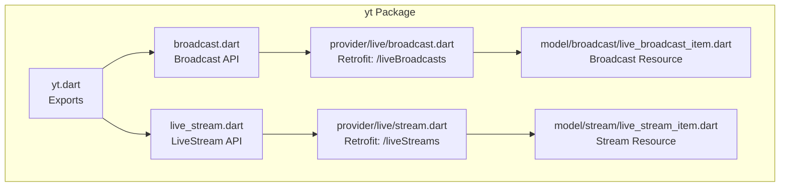
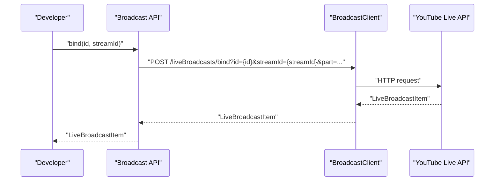
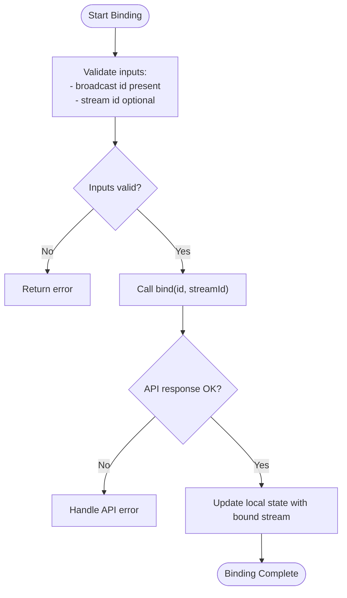
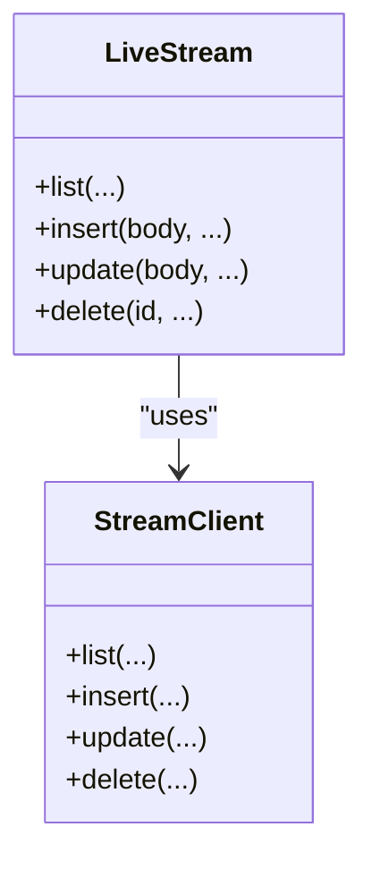
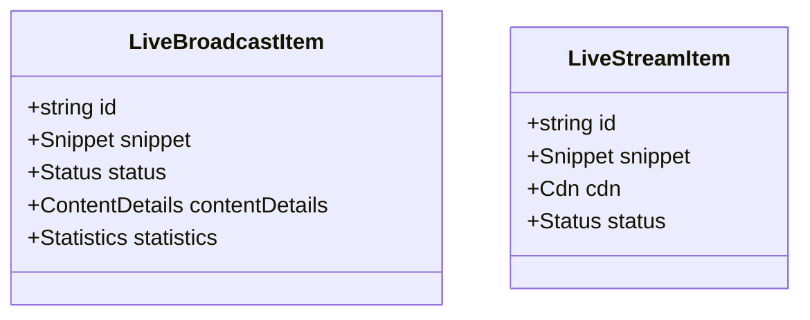
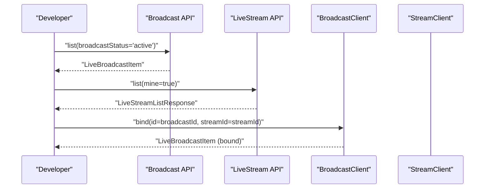
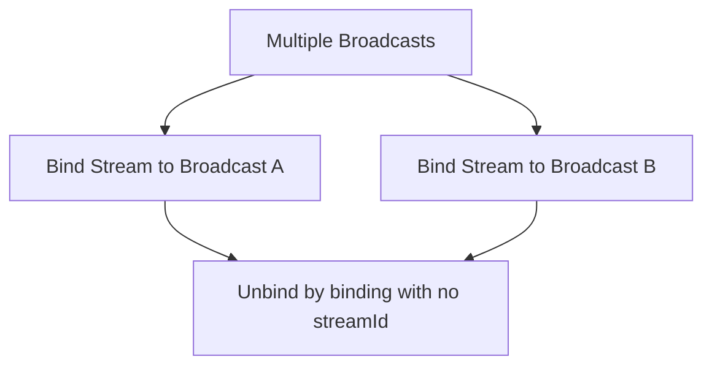
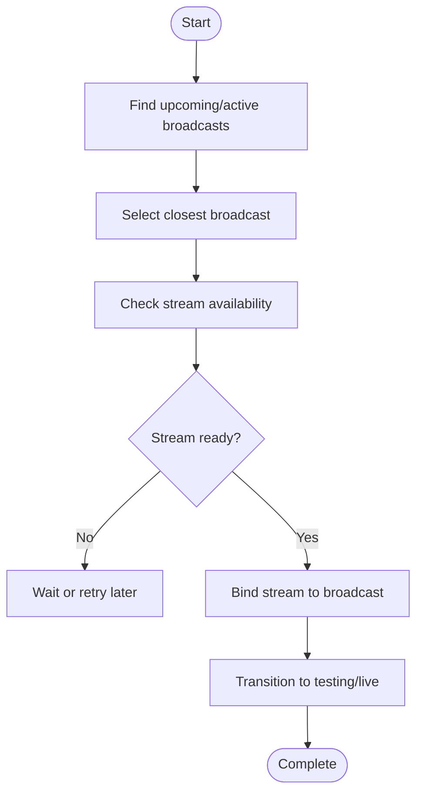
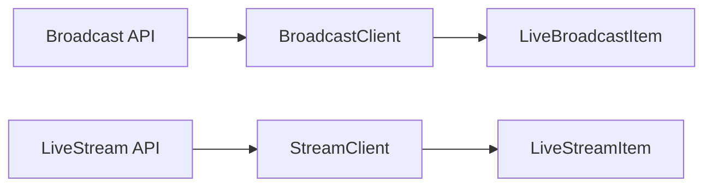

# Stream-Broadcast Binding

<cite>
**Referenced Files in This Document**
- [README.md](file://README.md)
- [packages/yt/README.md](file://packages/yt/README.md)
- [packages/yt/lib/yt.dart](file://packages/yt/lib/yt.dart)
- [packages/yt/lib/src/broadcast.dart](file://packages/yt/lib/src/broadcast.dart)
- [packages/yt/lib/src/live_stream.dart](file://packages/yt/lib/src/live_stream.dart)
- [packages/yt/lib/src/provider/live/broadcast.dart](file://packages/yt/lib/src/provider/live/broadcast.dart)
- [packages/yt/lib/src/provider/live/stream.dart](file://packages/yt/lib/src/provider/live/stream.dart)
- [packages/yt/lib/src/model/broadcast/live_broadcast_item.dart](file://packages/yt/lib/src/model/broadcast/live_broadcast_item.dart)
- [packages/yt/lib/src/model/stream/live_stream_item.dart](file://packages/yt/lib/src/model/stream/live_stream_item.dart)
- [packages/yt/example/example.dart](file://packages/yt/example/example.dart)
- [packages/yt/example/livechat_example.dart](file://packages/yt/example/livechat_example.dart)
- [packages/yt_cli/lib/src/cmd/youtube_broadcast_command.dart](file://packages/yt_cli/lib/src/cmd/youtube_broadcast_command.dart)
</cite>

## Table of Contents
1. [Introduction](#introduction)
2. [Project Structure](#project-structure)
3. [Core Components](#core-components)
4. [Architecture Overview](#architecture-overview)
5. [Detailed Component Analysis](#detailed-component-analysis)
6. [Dependency Analysis](#dependency-analysis)
7. [Performance Considerations](#performance-considerations)
8. [Troubleshooting Guide](#troubleshooting-guide)
9. [Conclusion](#conclusion)
10. [Appendices](#appendices)

## Introduction
This document explains how to bind live streams to broadcasts using the yt package’s Live Streaming API. It covers the relationship between streams and broadcasts, one-to-many binding scenarios, the binding/unbinding process, state management, validation, conflict resolution, and practical workflows. It also provides guidance on stream availability checks, broadcast readiness verification, and troubleshooting.

## Project Structure
The yt package exposes a high-level API for YouTube Live Streaming. The relevant components for stream-broadcast binding are organized as follows:
- Public API exports and model types are exposed from the main library entry.
- Broadcast and LiveStream clients encapsulate REST operations.
- Provider classes define Retrofit endpoints for liveBroadcasts and liveStreams.
- Model classes represent broadcast and stream resources returned by the API.

**Diagram sources**
- [packages/yt/lib/yt.dart:11-56](file://packages/yt/lib/yt.dart#L11-L56)
- [packages/yt/lib/src/broadcast.dart:1-168](file://packages/yt/lib/src/broadcast.dart#L1-L168)
- [packages/yt/lib/src/live_stream.dart:1-81](file://packages/yt/lib/src/live_stream.dart#L1-L81)
- [packages/yt/lib/src/provider/live/broadcast.dart:1-96](file://packages/yt/lib/src/provider/live/broadcast.dart#L1-L96)
- [packages/yt/lib/src/provider/live/stream.dart:1-68](file://packages/yt/lib/src/provider/live/stream.dart#L1-L68)
- [packages/yt/lib/src/model/broadcast/live_broadcast_item.dart:1-63](file://packages/yt/lib/src/model/broadcast/live_broadcast_item.dart#L1-L63)
- [packages/yt/lib/src/model/stream/live_stream_item.dart:1-44](file://packages/yt/lib/src/model/stream/live_stream_item.dart#L1-L44)

**Section sources**
- [packages/yt/lib/yt.dart:11-56](file://packages/yt/lib/yt.dart#L11-L56)
- [packages/yt/README.md:55-62](file://packages/yt/README.md#L55-L62)

## Core Components
- Broadcast API: Provides listing, inserting/updating broadcasts, transitioning statuses, binding to streams, and deletion.
- LiveStream API: Provides listing, inserting/updating streams, and deletion.
- Provider Clients: Retrofit-backed HTTP clients for liveBroadcasts and liveStreams endpoints.
- Models: Strongly typed resources for broadcast and stream items.

Key capabilities for binding:
- One broadcast binds to exactly one stream at a time.
- One stream may be bound to multiple broadcasts.
- Binding is performed via a dedicated endpoint that accepts a broadcast ID and optional stream ID.

**Section sources**
- [packages/yt/lib/src/broadcast.dart:95-111](file://packages/yt/lib/src/broadcast.dart#L95-L111)
- [packages/yt/lib/src/provider/live/broadcast.dart:56-68](file://packages/yt/lib/src/provider/live/broadcast.dart#L56-L68)
- [packages/yt/lib/src/live_stream.dart:6-7](file://packages/yt/lib/src/live_stream.dart#L6-L7)
- [packages/yt/lib/src/model/broadcast/live_broadcast_item.dart:13-63](file://packages/yt/lib/src/model/broadcast/live_broadcast_item.dart#L13-L63)
- [packages/yt/lib/src/model/stream/live_stream_item.dart:12-44](file://packages/yt/lib/src/model/stream/live_stream_item.dart#L12-L44)

## Architecture Overview
The binding workflow connects two resources:
- A broadcast (event) that will be streamed.
- A stream (transmission pipeline) that carries the video content.

**Diagram sources**
- [packages/yt/lib/src/broadcast.dart:96-111](file://packages/yt/lib/src/broadcast.dart#L96-L111)
- [packages/yt/lib/src/provider/live/broadcast.dart:57-68](file://packages/yt/lib/src/provider/live/broadcast.dart#L57-L68)

## Detailed Component Analysis

### Broadcast API and Binding
The Broadcast API exposes a bind method that updates the binding between a broadcast and a stream. Unbinding is achieved by passing a null or missing stream ID in the underlying provider call semantics.

**Diagram sources**
- [packages/yt/lib/src/broadcast.dart:96-111](file://packages/yt/lib/src/broadcast.dart#L96-L111)
- [packages/yt/lib/src/provider/live/broadcast.dart:57-68](file://packages/yt/lib/src/provider/live/broadcast.dart#L57-L68)

**Section sources**
- [packages/yt/lib/src/broadcast.dart:95-111](file://packages/yt/lib/src/broadcast.dart#L95-L111)
- [packages/yt/lib/src/provider/live/broadcast.dart:56-68](file://packages/yt/lib/src/provider/live/broadcast.dart#L56-L68)

### LiveStream API and Availability
The LiveStream API retrieves streams and supports creation/update/delete operations. For binding, ensure the target stream exists and is in an appropriate state.

**Diagram sources**
- [packages/yt/lib/src/live_stream.dart:1-81](file://packages/yt/lib/src/live_stream.dart#L1-L81)
- [packages/yt/lib/src/provider/live/stream.dart:1-68](file://packages/yt/lib/src/provider/live/stream.dart#L1-L68)

**Section sources**
- [packages/yt/lib/src/live_stream.dart:12-34](file://packages/yt/lib/src/live_stream.dart#L12-L34)
- [packages/yt/lib/src/provider/live/stream.dart:12-26](file://packages/yt/lib/src/provider/live/stream.dart#L12-L26)

### Data Models for Streams and Broadcasts
- LiveBroadcastItem: Represents a broadcast with snippet, status, contentDetails, and statistics.
- LiveStreamItem: Represents a stream with snippet, CDN, and status.

**Diagram sources**
- [packages/yt/lib/src/model/broadcast/live_broadcast_item.dart:13-63](file://packages/yt/lib/src/model/broadcast/live_broadcast_item.dart#L13-L63)
- [packages/yt/lib/src/model/stream/live_stream_item.dart:12-44](file://packages/yt/lib/src/model/stream/live_stream_item.dart#L12-L44)

**Section sources**
- [packages/yt/lib/src/model/broadcast/live_broadcast_item.dart:13-63](file://packages/yt/lib/src/model/broadcast/live_broadcast_item.dart#L13-L63)
- [packages/yt/lib/src/model/stream/live_stream_item.dart:12-44](file://packages/yt/lib/src/model/stream/live_stream_item.dart#L12-L44)

### Practical Binding Workflows

#### Binding a Stream to an Active Broadcast
- Retrieve an active broadcast.
- Ensure a stream exists and is ready.
- Bind the stream to the broadcast.

**Diagram sources**
- [packages/yt/lib/src/broadcast.dart:128-136](file://packages/yt/lib/src/broadcast.dart#L128-L136)
- [packages/yt/lib/src/live_stream.dart:12-34](file://packages/yt/lib/src/live_stream.dart#L12-L34)
- [packages/yt/lib/src/provider/live/broadcast.dart:57-68](file://packages/yt/lib/src/provider/live/broadcast.dart#L57-L68)
- [packages/yt/lib/src/provider/live/stream.dart:12-26](file://packages/yt/lib/src/provider/live/stream.dart#L12-L26)

#### Managing Multiple Stream Bindings
- A stream can be bound to multiple broadcasts.
- To unbind, call bind with the broadcast ID and no stream ID.

**Diagram sources**
- [packages/yt/lib/src/provider/live/broadcast.dart:56-68](file://packages/yt/lib/src/provider/live/broadcast.dart#L56-L68)
- [packages/yt/lib/src/live_stream.dart:6-7](file://packages/yt/lib/src/live_stream.dart#L6-L7)

#### Automated Binding Workflow
- Discover upcoming or active broadcasts.
- Select the nearest scheduled broadcast.
- Verify stream readiness.
- Perform binding and transition to testing or live as needed.

**Diagram sources**
- [packages/yt/lib/src/broadcast.dart:138-166](file://packages/yt/lib/src/broadcast.dart#L138-L166)
- [packages/yt/lib/src/provider/live/broadcast.dart:70-82](file://packages/yt/lib/src/provider/live/broadcast.dart#L70-L82)

**Section sources**
- [packages/yt/lib/src/broadcast.dart:128-166](file://packages/yt/lib/src/broadcast.dart#L128-L166)
- [packages/yt/README.md:205-249](file://packages/yt/README.md#L205-L249)

## Dependency Analysis
- The Broadcast API depends on the BroadcastClient for HTTP operations.
- The LiveStream API depends on the StreamClient for HTTP operations.
- Both clients target official YouTube Live Streaming endpoints.
- Models are generated from JSON and carry metadata for deserialization.

**Diagram sources**
- [packages/yt/lib/src/broadcast.dart:1-11](file://packages/yt/lib/src/broadcast.dart#L1-L11)
- [packages/yt/lib/src/live_stream.dart:1-10](file://packages/yt/lib/src/live_stream.dart#L1-L10)
- [packages/yt/lib/src/provider/live/broadcast.dart:8-10](file://packages/yt/lib/src/provider/live/broadcast.dart#L8-L10)
- [packages/yt/lib/src/provider/live/stream.dart:8-10](file://packages/yt/lib/src/provider/live/stream.dart#L8-L10)

**Section sources**
- [packages/yt/lib/src/broadcast.dart:1-11](file://packages/yt/lib/src/broadcast.dart#L1-L11)
- [packages/yt/lib/src/live_stream.dart:1-10](file://packages/yt/lib/src/live_stream.dart#L1-L10)
- [packages/yt/lib/src/provider/live/broadcast.dart:8-10](file://packages/yt/lib/src/provider/live/broadcast.dart#L8-L10)
- [packages/yt/lib/src/provider/live/stream.dart:8-10](file://packages/yt/lib/src/provider/live/stream.dart#L8-L10)

## Performance Considerations
- Minimize repeated listing calls by caching recent results locally.
- Batch operations where feasible (e.g., list streams/broadcasts with appropriate filters).
- Use pagination parameters to limit result sets when listing large collections.
- Avoid unnecessary transitions; only move to testing/live when the stream is confirmed ready.

## Troubleshooting Guide
Common issues and resolutions:
- No active broadcast found: Use the helper to fetch upcoming and active broadcasts and select the closest one.
- Stream not available or not ready: Verify the stream exists and its status indicates readiness before binding.
- Binding fails due to invalid IDs: Confirm broadcast and stream IDs exist and belong to the authenticated account.
- Conflicting bindings: A broadcast can only be bound to one stream at a time; unbind the current stream before binding a new one.

Operational tips:
- Use the CLI command to bind a broadcast to a stream, which demonstrates the expected parameters and behavior.
- Inspect broadcast and stream resources to verify state and metadata prior to binding.

**Section sources**
- [packages/yt/lib/src/broadcast.dart:128-136](file://packages/yt/lib/src/broadcast.dart#L128-L136)
- [packages/yt/lib/src/broadcast.dart:138-166](file://packages/yt/lib/src/broadcast.dart#L138-L166)
- [packages/yt_cli/lib/src/cmd/youtube_broadcast_command.dart:321-373](file://packages/yt_cli/lib/src/cmd/youtube_broadcast_command.dart#L321-L373)

## Conclusion
The yt package provides a clear, structured approach to binding live streams to broadcasts. By leveraging the Broadcast and LiveStream APIs, validating readiness, and following the documented workflows, developers can reliably coordinate stream lifecycle events with broadcast schedules and automate binding tasks.

## Appendices

### Example Usage References
- End-to-end example showing broadcast creation and binding to a stream.
- Example scanning for active or upcoming broadcasts for interactive binding.

**Section sources**
- [packages/yt/README.md:205-249](file://packages/yt/README.md#L205-L249)
- [packages/yt/example/livechat_example.dart:11-16](file://packages/yt/example/livechat_example.dart#L11-L16)