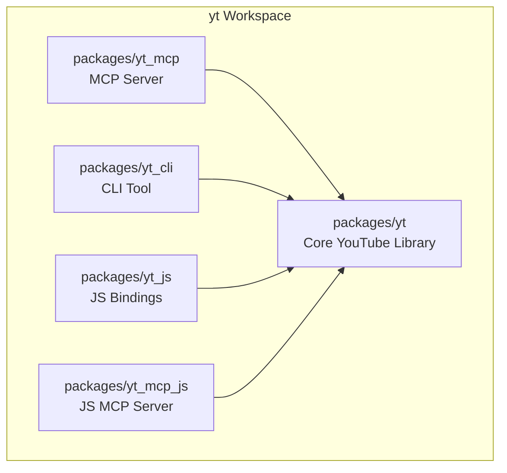
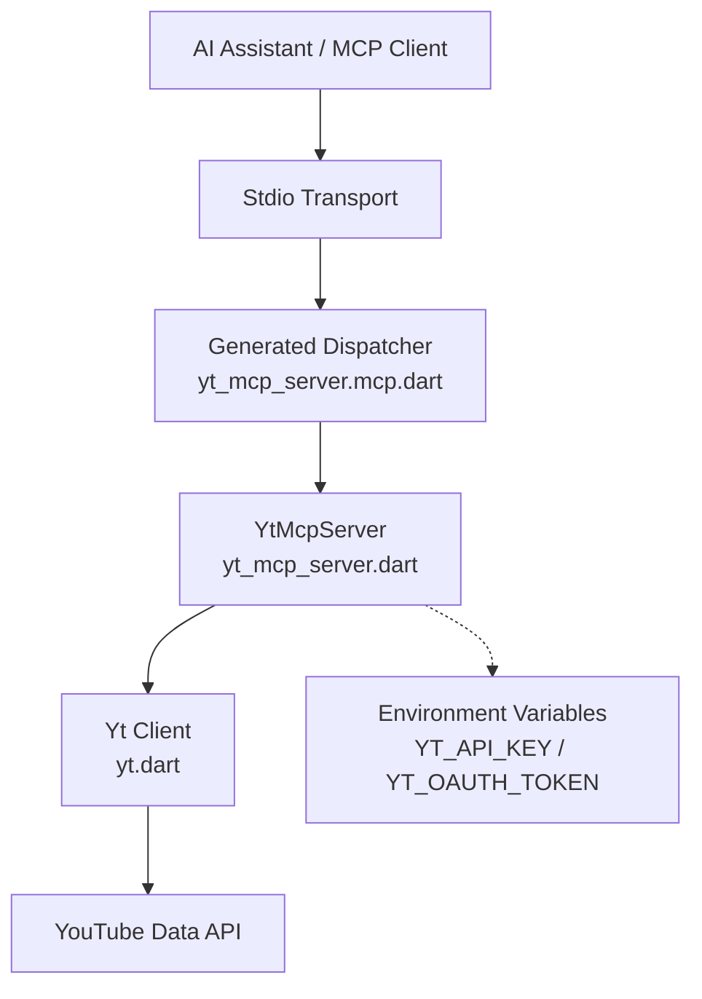
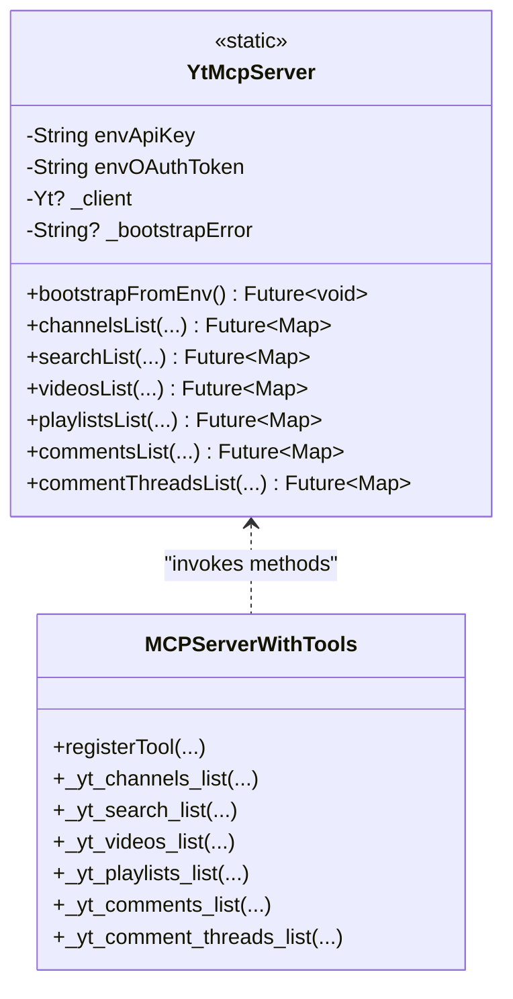
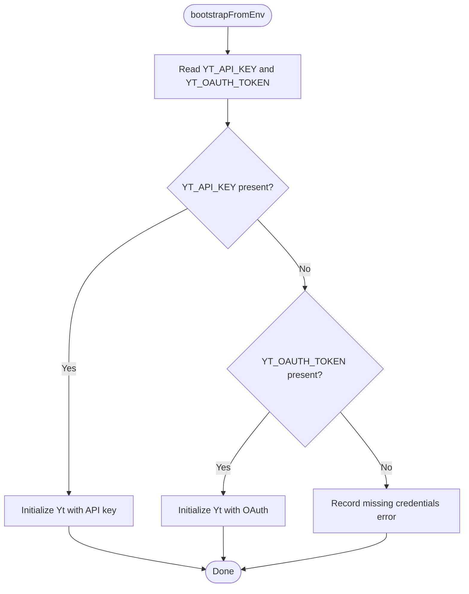
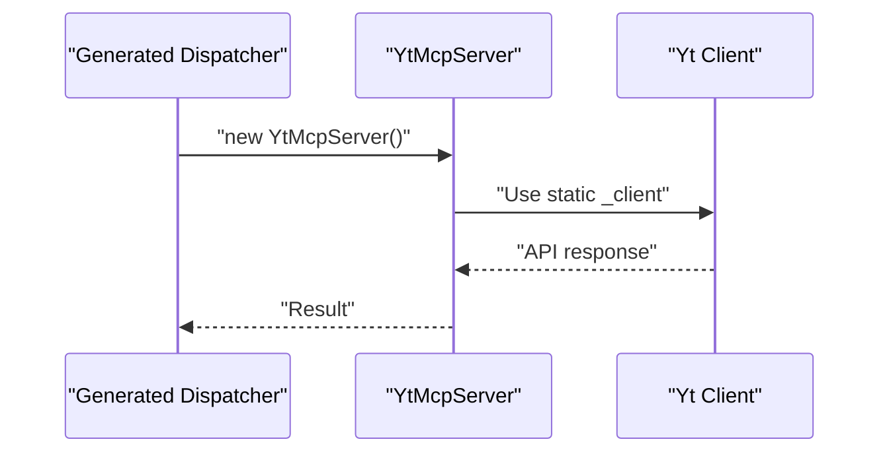
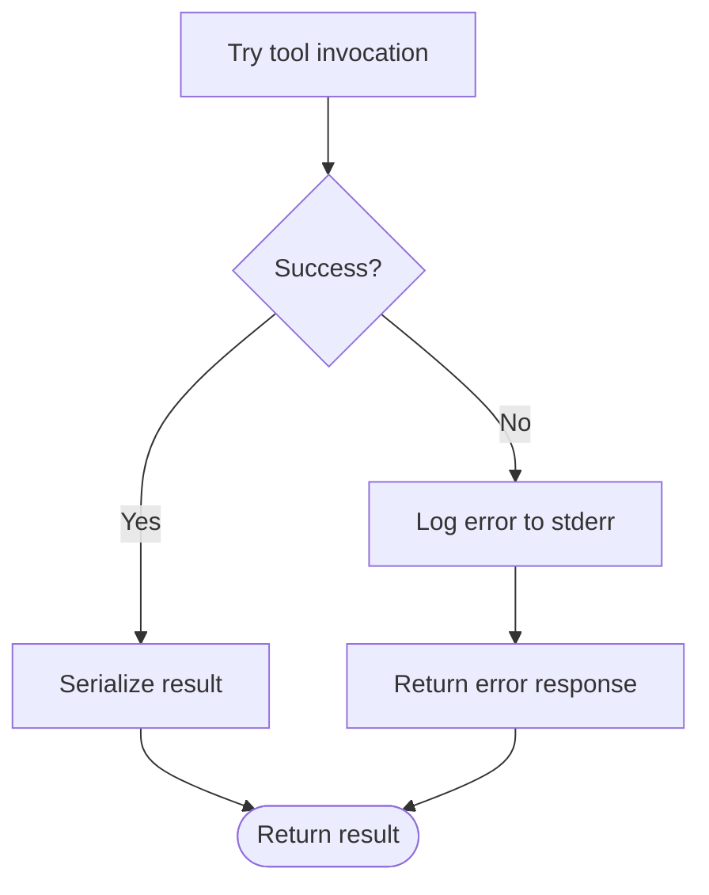
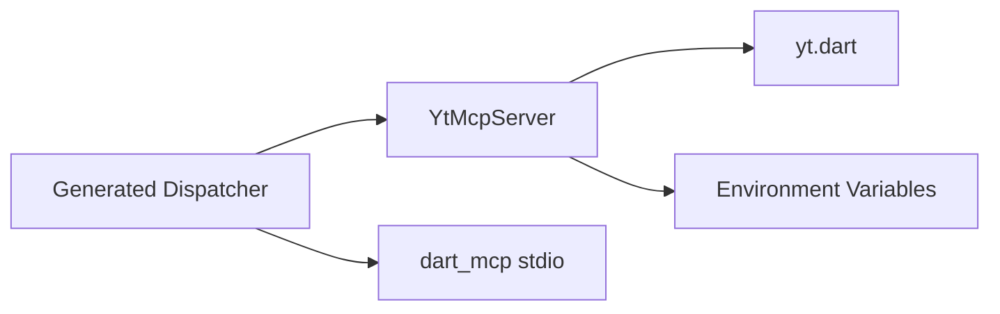
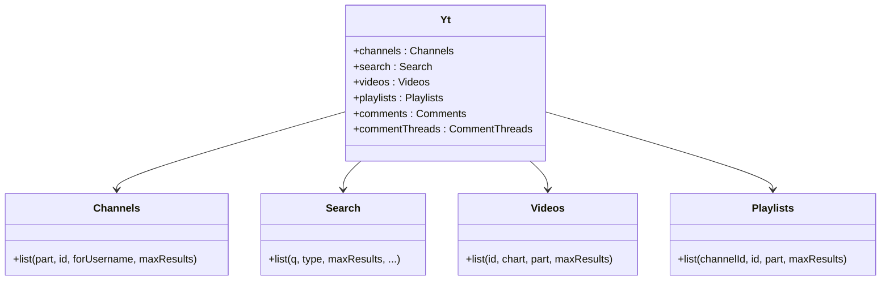

# Dart MCP Server Implementation

<cite>
**Referenced Files in This Document**
- [yt_mcp_server.dart](file://packages/yt_mcp/lib/src/yt_mcp_server.dart)
- [yt_mcp_server.mcp.dart](file://packages/yt_mcp/lib/src/yt_mcp_server.mcp.dart)
- [yt_mcp_server.dart](file://packages/yt_mcp/bin/yt_mcp_server.dart)
- [README.md](file://packages/yt_mcp/README.md)
- [README.md](file://README.md)
- [pubspec.yaml](file://pubspec.yaml)
- [yt.dart](file://packages/yt/lib/yt.dart)
- [channels.dart](file://packages/yt/lib/src/channels.dart)
- [search.dart](file://packages/yt/lib/src/search.dart)
- [videos.dart](file://packages/yt/lib/src/videos.dart)
- [playlists.dart](file://packages/yt/lib/src/playlists.dart)
</cite>

## Table of Contents
1. [Introduction](#introduction)
2. [Project Structure](#project-structure)
3. [Core Components](#core-components)
4. [Architecture Overview](#architecture-overview)
5. [Detailed Component Analysis](#detailed-component-analysis)
6. [Dependency Analysis](#dependency-analysis)
7. [Performance Considerations](#performance-considerations)
8. [Troubleshooting Guide](#troubleshooting-guide)
9. [Conclusion](#conclusion)
10. [Appendices](#appendices)

## Introduction
This document explains the Dart-based Model Context Protocol (MCP) server implementation for YouTube APIs. It focuses on the YtMcpServer class architecture, tool annotations, environment-based authentication, and the full set of YouTube API tools exposed by the server. It also covers practical invocation patterns, parameter configuration, response handling, credential bootstrapping, static client persistence, error handling, and guidance for building, running, integrating with AI assistants, and extending functionality.

## Project Structure
The yt workspace is a Melos-managed monorepo with multiple packages. The MCP server resides in the yt_mcp package and integrates with the core yt library that provides the YouTube Data and Live Streaming API clients.

**Diagram sources**
- [pubspec.yaml:17-22](file://pubspec.yaml#L17-L22)

**Section sources**
- [pubspec.yaml:17-22](file://pubspec.yaml#L17-L22)
- [README.md:8-18](file://README.md#L8-L18)

## Core Components
- YtMcpServer: The primary MCP server class that annotates methods as tools and delegates to the yt library. It manages environment-based authentication and static client persistence.
- Generated Dispatcher: The mcp_generator produces a stdio-based MCP server that registers tools and routes requests to YtMcpServer methods.
- Entry Point: The binary initializes environment credentials and starts the stdio channel server.

Key responsibilities:
- Tool annotations define tool names, descriptions, and parameters.
- bootstrapFromEnv loads credentials from environment variables and initializes the static client.
- Static client ensures the underlying Yt instance persists across per-tool-call instances created by the dispatcher.
- Error handling is centralized in the generated dispatcher with logging and standardized error responses.

**Section sources**
- [yt_mcp_server.dart:20-86](file://packages/yt_mcp/lib/src/yt_mcp_server.dart#L20-L86)
- [yt_mcp_server.mcp.dart:21-66](file://packages/yt_mcp/lib/src/yt_mcp_server.mcp.dart#L21-L66)
- [yt_mcp_server.dart:21-28](file://packages/yt_mcp/bin/yt_mcp_server.dart#L21-L28)

## Architecture Overview
The MCP server architecture consists of:
- A stdio transport server generated by the mcp_generator.
- A dispatcher that registers tools and handles request routing.
- A facade (YtMcpServer) that exposes YouTube API operations as tools.
- The yt library providing typed clients for channels, search, videos, playlists, comments, and comment threads.

**Diagram sources**
- [yt_mcp_server.mcp.dart:14-19](file://packages/yt_mcp/lib/src/yt_mcp_server.mcp.dart#L14-L19)
- [yt_mcp_server.dart:21-28](file://packages/yt_mcp/bin/yt_mcp_server.dart#L21-L28)
- [yt_mcp_server.dart:66-86](file://packages/yt_mcp/lib/src/yt_mcp_server.dart#L66-L86)
- [yt.dart:11-66](file://packages/yt/lib/yt.dart#L11-L66)

## Detailed Component Analysis

### YtMcpServer Class
YtMcpServer is the central MCP facade that:
- Defines tool annotations for six YouTube API operations.
- Manages environment-based authentication via bootstrapFromEnv.
- Persists a static Yt client instance across tool invocations.
- Provides a getter that throws a descriptive StateError if credentials are missing.

**Diagram sources**
- [yt_mcp_server.dart:31-224](file://packages/yt_mcp/lib/src/yt_mcp_server.dart#L31-L224)
- [yt_mcp_server.mcp.dart:21-203](file://packages/yt_mcp/lib/src/yt_mcp_server.mcp.dart#L21-L203)

**Section sources**
- [yt_mcp_server.dart:20-86](file://packages/yt_mcp/lib/src/yt_mcp_server.dart#L20-L86)
- [yt_mcp_server.dart:88-224](file://packages/yt_mcp/lib/src/yt_mcp_server.dart#L88-L224)

### Tool Annotations and Parameter Definitions
Each tool method is annotated with a name and description and uses @Parameter annotations to describe inputs. The generated dispatcher registers these tools and validates arguments.

Available tools:
- yt_channels_list: Lists channels by ID or username.
- yt_search_list: Searches videos, channels, and playlists.
- yt_videos_list: Lists videos by ID or chart.
- yt_playlists_list: Lists playlists for a channel or by IDs.
- yt_comments_list: Lists comments with optional parent filtering.
- yt_comment_threads_list: Lists comment threads for a video.

Parameters are mapped from the dispatcher’s request arguments to the tool methods. Defaults and constraints are enforced in the tool methods.

**Section sources**
- [yt_mcp_server.dart:92-111](file://packages/yt_mcp/lib/src/yt_mcp_server.dart#L92-L111)
- [yt_mcp_server.dart:117-137](file://packages/yt_mcp/lib/src/yt_mcp_server.dart#L117-L137)
- [yt_mcp_server.dart:143-159](file://packages/yt_mcp/lib/src/yt_mcp_server.dart#L143-L159)
- [yt_mcp_server.dart:165-182](file://packages/yt_mcp/lib/src/yt_mcp_server.dart#L165-L182)
- [yt_mcp_server.dart:188-201](file://packages/yt_mcp/lib/src/yt_mcp_server.dart#L188-L201)
- [yt_mcp_server.dart:211-223](file://packages/yt_mcp/lib/src/yt_mcp_server.dart#L211-L223)

### Environment-Based Authentication Setup
The server supports two authentication modes:
- API key: Uses YT_API_KEY for read-only public data access.
- OAuth token: Uses YT_OAUTH_TOKEN for full access.

bootstrapFromEnv reads environment variables and initializes a static Yt client. If neither is present, it records an error for later reporting via the _yt getter.

**Diagram sources**
- [yt_mcp_server.dart:70-86](file://packages/yt_mcp/lib/src/yt_mcp_server.dart#L70-L86)

**Section sources**
- [yt_mcp_server.dart:32-64](file://packages/yt_mcp/lib/src/yt_mcp_server.dart#L32-L64)
- [yt_mcp_server.dart:66-86](file://packages/yt_mcp/lib/src/yt_mcp_server.dart#L66-L86)

### Static Client Persistence Across Tool Calls
Because the generated dispatcher creates a fresh YtMcpServer instance for each tool invocation, the static client field preserves the Yt instance across calls. The _yt getter ensures callers receive the initialized client or a descriptive error if initialization failed.

**Diagram sources**
- [yt_mcp_server.mcp.dart:68-90](file://packages/yt_mcp/lib/src/yt_mcp_server.mcp.dart#L68-L90)
- [yt_mcp_server.dart:40-64](file://packages/yt_mcp/lib/src/yt_mcp_server.dart#L40-L64)

**Section sources**
- [yt_mcp_server.mcp.dart:68-90](file://packages/yt_mcp/lib/src/yt_mcp_server.mcp.dart#L68-L90)
- [yt_mcp_server.dart:38-64](file://packages/yt_mcp/lib/src/yt_mcp_server.dart#L38-L64)

### Error Handling Patterns
The generated dispatcher wraps tool invocations in try/catch blocks:
- Logs errors to stderr when enabled.
- Returns a standardized error response with isError set to true.
- The _yt getter throws a StateError if the client was not initialized, including contextual information about the last bootstrap failure.

**Diagram sources**
- [yt_mcp_server.mcp.dart:68-90](file://packages/yt_mcp/lib/src/yt_mcp_server.mcp.dart#L68-L90)
- [yt_mcp_server.dart:50-64](file://packages/yt_mcp/lib/src/yt_mcp_server.dart#L50-L64)

**Section sources**
- [yt_mcp_server.mcp.dart:68-90](file://packages/yt_mcp/lib/src/yt_mcp_server.mcp.dart#L68-L90)
- [yt_mcp_server.dart:50-64](file://packages/yt_mcp/lib/src/yt_mcp_server.dart#L50-L64)

### Practical Examples of Tool Invocation
Note: The following examples describe invocation patterns and parameter configuration. They do not reproduce code content.

- yt_channels_list
  - Purpose: List channels by ID or username.
  - Parameters: part (comma-separated properties), id (comma-separated IDs), forUsername (username), maxResults (1-50).
  - Typical usage: Provide either id or forUsername; adjust maxResults for pagination.

- yt_search_list
  - Purpose: Search videos, channels, and playlists.
  - Parameters: q (required search query), part (properties), type (video, channel, playlist), maxResults (1-50).
  - Typical usage: Use type to constrain results; combine with part to limit returned fields.

- yt_videos_list
  - Purpose: List videos by ID or chart.
  - Parameters: id (comma-separated IDs), chart (e.g., mostPopular), part (properties), maxResults (1-50).
  - Typical usage: Use chart for trending; use id for targeted retrieval.

- yt_playlists_list
  - Purpose: List playlists for a channel or by IDs.
  - Parameters: channelId, id (comma-separated), part (properties), maxResults (1-50).
  - Typical usage: Provide channelId to enumerate a channel’s playlists.

- yt_comments_list
  - Purpose: List comments.
  - Parameters: part (properties), parentId (to list replies), maxResults.
  - Typical usage: Use parentId to traverse nested comment threads.

- yt_comment_threads_list
  - Purpose: List comment threads for a video.
  - Parameters: part (properties), videoId, maxResults.
  - Typical usage: Provide videoId to fetch top-level threads.

Response handling:
- Each tool returns a JSON-serializable map produced by response.toJson().
- The dispatcher serializes results and returns them as TextContent.

**Section sources**
- [yt_mcp_server.dart:92-111](file://packages/yt_mcp/lib/src/yt_mcp_server.dart#L92-L111)
- [yt_mcp_server.dart:117-137](file://packages/yt_mcp/lib/src/yt_mcp_server.dart#L117-L137)
- [yt_mcp_server.dart:143-159](file://packages/yt_mcp/lib/src/yt_mcp_server.dart#L143-L159)
- [yt_mcp_server.dart:165-182](file://packages/yt_mcp/lib/src/yt_mcp_server.dart#L165-L182)
- [yt_mcp_server.dart:188-201](file://packages/yt_mcp/lib/src/yt_mcp_server.dart#L188-L201)
- [yt_mcp_server.dart:211-223](file://packages/yt_mcp/lib/src/yt_mcp_server.dart#L211-L223)
- [yt_mcp_server.mcp.dart:502-520](file://packages/yt_mcp/lib/src/yt_mcp_server.mcp.dart#L502-L520)

### Building and Running the MCP Server
- Install globally:
  - Activate the yt_mcp package via pub.
- Start the server:
  - Run the binary which calls bootstrapFromEnv before starting the stdio server.
- Integration:
  - Configure MCP clients to launch the yt_mcp command with desired arguments.

**Section sources**
- [yt_mcp_server.dart:21-28](file://packages/yt_mcp/bin/yt_mcp_server.dart#L21-L28)
- [README.md:49-53](file://README.md#L49-L53)
- [README.md:53-66](file://README.md#L53-L66)

### Integrating with AI Assistants
- The MCP server can be integrated with AI tools that support the Model Context Protocol.
- Clients discover tools via the search tool and execute them using execute or direct tool calls.
- The generated dispatcher includes a search tool and an execute tool for code mode.

**Section sources**
- [yt_mcp_server.mcp.dart:21-66](file://packages/yt_mcp/lib/src/yt_mcp_server.mcp.dart#L21-L66)
- [README.md:53-66](file://README.md#L53-L66)

### Extending Functionality with Custom Tools
- Add new tool methods to YtMcpServer with @Tool and @Parameter annotations.
- The mcp_generator will include the new tool in the generated dispatcher.
- Ensure the static client is used for API calls and handle errors consistently.

**Section sources**
- [yt_mcp_server.dart:25-30](file://packages/yt_mcp/lib/src/yt_mcp_server.dart#L25-L30)
- [yt_mcp_server.mcp.dart:204-204](file://packages/yt_mcp/lib/src/yt_mcp_server.mcp.dart#L204-L204)

## Dependency Analysis
The MCP server depends on:
- The yt library for YouTube API operations.
- The mcp_generator to produce the stdio server and tool registration code.
- The dart_mcp stdio transport for communication.

**Diagram sources**
- [yt_mcp_server.dart:17-18](file://packages/yt_mcp/lib/src/yt_mcp_server.dart#L17-L18)
- [yt_mcp_server.mcp.dart:8-12](file://packages/yt_mcp/lib/src/yt_mcp_server.mcp.dart#L8-L12)
- [yt_mcp_server.dart:17-18](file://packages/yt_mcp/lib/src/yt_mcp_server.dart#L17-L18)

**Section sources**
- [yt_mcp_server.dart:17-18](file://packages/yt_mcp/lib/src/yt_mcp_server.dart#L17-L18)
- [yt_mcp_server.mcp.dart:8-12](file://packages/yt_mcp/lib/src/yt_mcp_server.mcp.dart#L8-L12)

## Performance Considerations
- Static client reuse avoids repeated initialization overhead across tool calls.
- Limit maxResults per request to reduce payload sizes and API latency.
- Use specific part lists to minimize response sizes when only certain fields are needed.

## Troubleshooting Guide
Common issues and resolutions:
- Client not initialized:
  - Symptom: StateError indicating missing credentials.
  - Cause: bootstrapFromEnv did not find YT_API_KEY or YT_OAUTH_TOKEN.
  - Resolution: Set the appropriate environment variable and restart the server.

- Tool invocation failures:
  - Symptom: Error responses from the dispatcher.
  - Cause: Exceptions during tool execution or invalid parameters.
  - Resolution: Check stderr logs emitted by the dispatcher; verify parameter types and constraints.

- Authentication errors:
  - Symptom: API responses indicate invalid or missing credentials.
  - Cause: Expired OAuth token or incorrect API key.
  - Resolution: Reauthorize via the CLI tool and regenerate tokens; confirm environment variable values.

**Section sources**
- [yt_mcp_server.dart:50-64](file://packages/yt_mcp/lib/src/yt_mcp_server.dart#L50-L64)
- [yt_mcp_server.mcp.dart:68-90](file://packages/yt_mcp/lib/src/yt_mcp_server.mcp.dart#L68-L90)

## Conclusion
The Dart MCP server provides a robust, annotation-driven facade over the YouTube Data and Live Streaming APIs. It supports environment-based authentication, static client persistence, and comprehensive error handling. The generated dispatcher simplifies tool registration and invocation, enabling seamless integration with AI assistants that support the Model Context Protocol.

## Appendices

### API Reference: Tool Parameters and Capabilities
- yt_channels_list
  - part: Comma-separated channel property names.
  - id: Comma-separated channel IDs.
  - forUsername: YouTube username.
  - maxResults: Integer in range 1-50.

- yt_search_list
  - q: Required search query term.
  - part: Comma-separated resource property names.
  - type: Resource type filter (video, channel, playlist).
  - maxResults: Integer in range 1-50.

- yt_videos_list
  - id: Comma-separated video IDs.
  - chart: Chart type (e.g., mostPopular).
  - part: Comma-separated video property names.
  - maxResults: Integer in range 1-50.

- yt_playlists_list
  - channelId: Channel ID to list playlists for.
  - id: Comma-separated playlist IDs.
  - part: Comma-separated playlist property names.
  - maxResults: Integer in range 1-50.

- yt_comments_list
  - part: Comma-separated comment property names.
  - parentId: Parent comment ID.
  - maxResults: Integer.

- yt_comment_threads_list
  - part: Comma-separated comment thread property names.
  - videoId: Video ID.
  - maxResults: Integer.

**Section sources**
- [yt_mcp_server.dart:96-111](file://packages/yt_mcp/lib/src/yt_mcp_server.dart#L96-L111)
- [yt_mcp_server.dart:121-137](file://packages/yt_mcp/lib/src/yt_mcp_server.dart#L121-L137)
- [yt_mcp_server.dart:144-159](file://packages/yt_mcp/lib/src/yt_mcp_server.dart#L144-L159)
- [yt_mcp_server.dart:166-182](file://packages/yt_mcp/lib/src/yt_mcp_server.dart#L166-L182)
- [yt_mcp_server.dart:189-201](file://packages/yt_mcp/lib/src/yt_mcp_server.dart#L189-L201)
- [yt_mcp_server.dart:211-223](file://packages/yt_mcp/lib/src/yt_mcp_server.dart#L211-L223)

### Underlying API Clients
The yt library exposes typed clients for each resource type. The YtMcpServer methods delegate to these clients.

**Diagram sources**
- [yt.dart:11-66](file://packages/yt/lib/yt.dart#L11-L66)
- [channels.dart:6-41](file://packages/yt/lib/src/channels.dart#L6-L41)
- [search.dart:7-79](file://packages/yt/lib/src/search.dart#L7-L79)
- [videos.dart:8-42](file://packages/yt/lib/src/videos.dart#L8-L42)
- [playlists.dart:15-46](file://packages/yt/lib/src/playlists.dart#L15-L46)