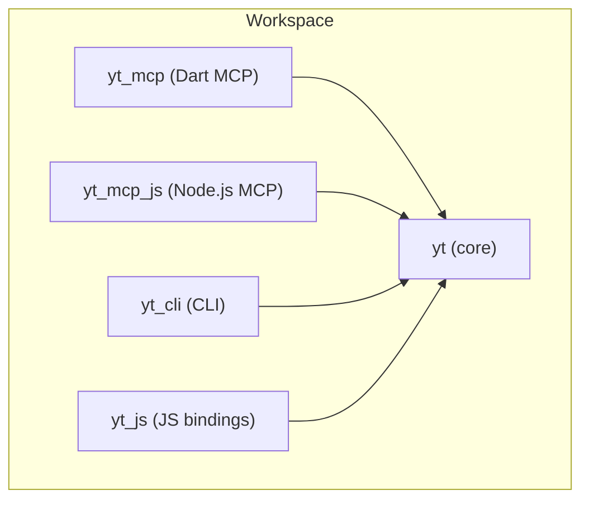
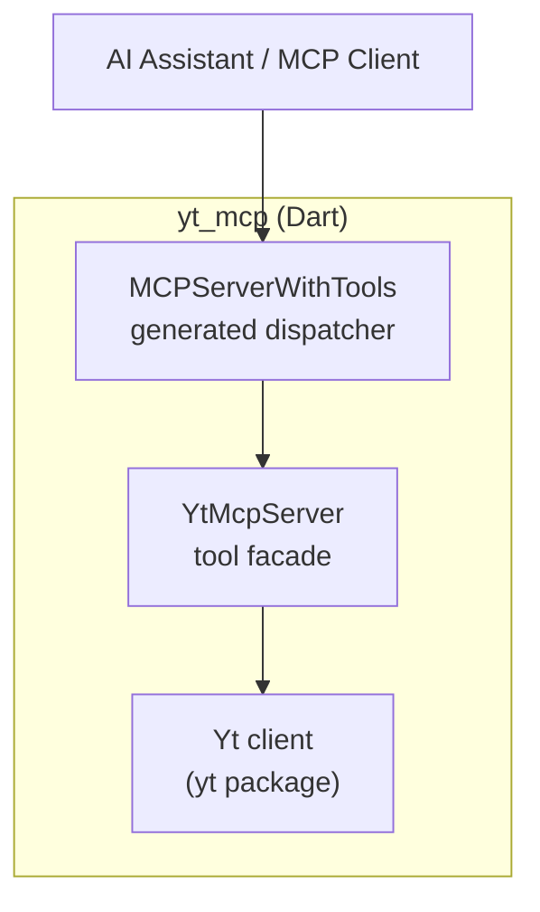
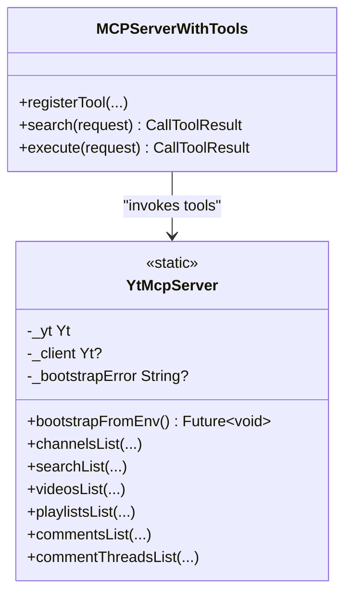
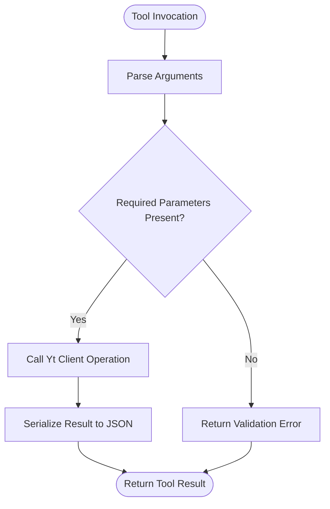
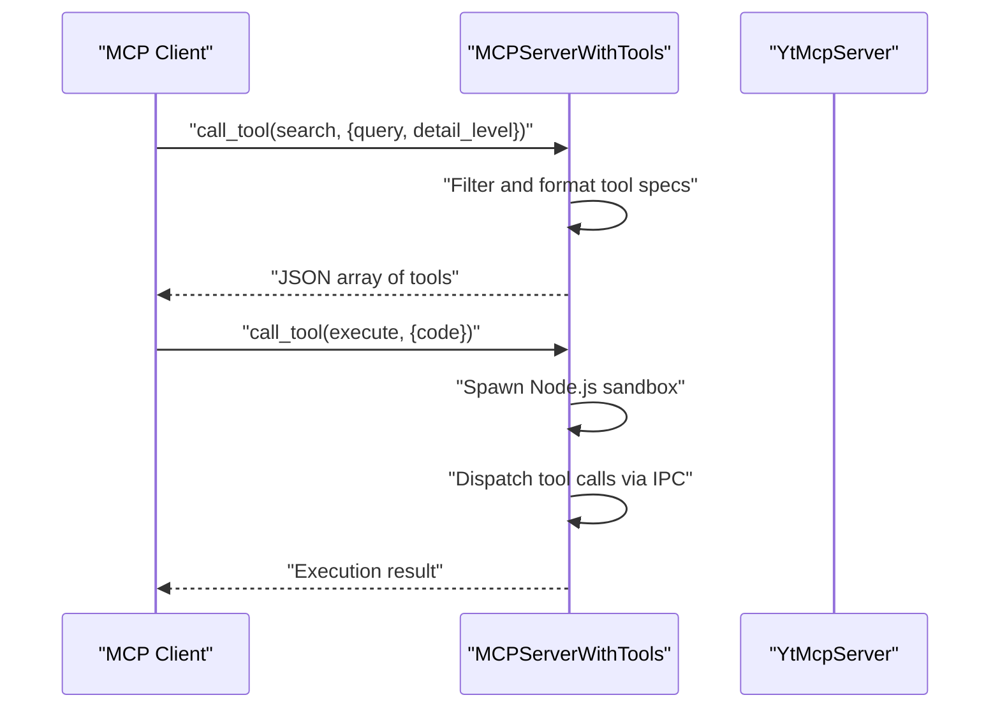
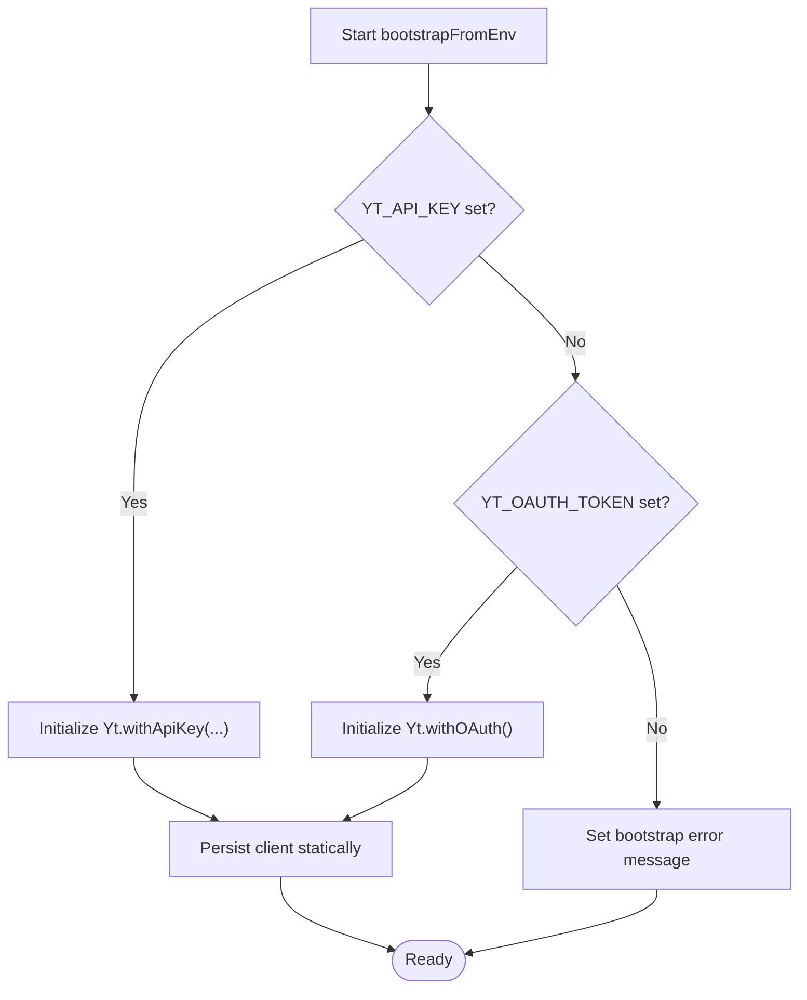
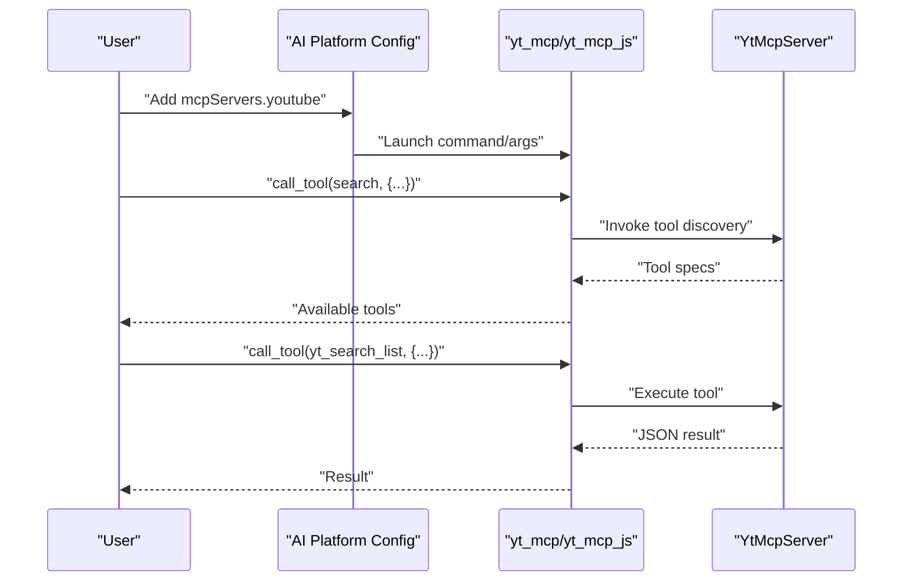
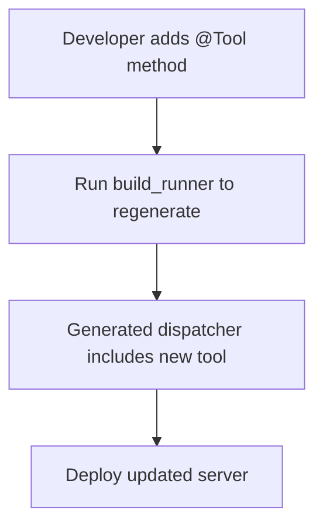
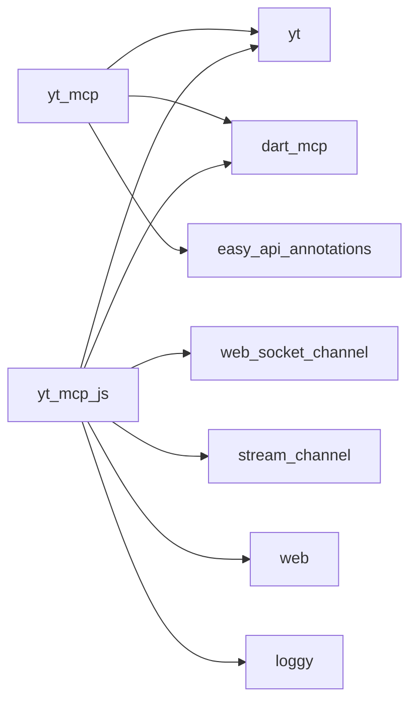

# MCP Server Integration

<cite>
**Referenced Files in This Document**
- [README.md](file://README.md)
- [pubspec.yaml](file://pubspec.yaml)
- [packages/yt_mcp/pubspec.yaml](file://packages/yt_mcp/pubspec.yaml)
- [packages/yt_mcp/README.md](file://packages/yt_mcp/README.md)
- [packages/yt_mcp/bin/yt_mcp_server.dart](file://packages/yt_mcp/bin/yt_mcp_server.dart)
- [packages/yt_mcp/lib/src/yt_mcp_server.dart](file://packages/yt_mcp/lib/src/yt_mcp_server.dart)
- [packages/yt_mcp/lib/src/yt_mcp_server.mcp.dart](file://packages/yt_mcp/lib/src/yt_mcp_server.mcp.dart)
- [packages/yt_mcp/build.yaml](file://packages/yt_mcp/build.yaml)
- [packages/yt_mcp_js/pubspec.yaml](file://packages/yt_mcp_js/pubspec.yaml)
- [packages/yt_mcp_js/README.md](file://packages/yt_mcp_js/README.md)
- [packages/yt_mcp_js/bin/yt-mcp-server.js](file://packages/yt_mcp_js/bin/yt-mcp-server.js)
</cite>

## Table of Contents
1. [Introduction](#introduction)
2. [Project Structure](#project-structure)
3. [Core Components](#core-components)
4. [Architecture Overview](#architecture-overview)
5. [Detailed Component Analysis](#detailed-component-analysis)
6. [Dependency Analysis](#dependency-analysis)
7. [Performance Considerations](#performance-considerations)
8. [Troubleshooting Guide](#troubleshooting-guide)
9. [Conclusion](#conclusion)
10. [Appendices](#appendices)

## Introduction
This document explains how to integrate YouTube Data and Live Streaming APIs into AI assistants using the Model Context Protocol (MCP). It covers the yt_mcp package for Dart/CLI and the yt_mcp_js package for Node.js, including tool definitions, capability negotiation, credential management, and integration patterns with AI platforms. Practical guidance is provided for creating YouTube-related tools, configuring MCP servers, and deploying in production.

## Project Structure
The repository is a Melos-managed workspace containing multiple packages:
- yt: Core Dart library for YouTube APIs
- yt_cli: CLI tool for YouTube APIs
- yt_js: JavaScript/TypeScript bindings
- yt_mcp: Dart MCP server executable for AI integration
- yt_mcp_js: JavaScript MCP server for Node.js

**Diagram sources**
- [pubspec.yaml:17-21](file://pubspec.yaml#L17-L21)
- [packages/yt_mcp/pubspec.yaml:22-25](file://packages/yt_mcp/pubspec.yaml#L22-L25)
- [packages/yt_mcp_js/pubspec.yaml:10-12](file://packages/yt_mcp_js/pubspec.yaml#L10-L12)

**Section sources**
- [README.md:8-18](file://README.md#L8-L18)
- [pubspec.yaml:17-21](file://pubspec.yaml#L17-L21)

## Core Components
- yt_mcp (Dart MCP server):
  - Exposes YouTube Data and Live Streaming operations as MCP tools
  - Supports environment-based credential bootstrapping (API key or OAuth)
  - Provides a stdio-based MCP server with generated tool registration
- yt_mcp_js (Node.js MCP server):
  - Compiled JavaScript distribution for Node.js environments
  - Integrates via npx or global installation
  - Mirrors capabilities of the Dart version

Key capabilities:
- Channel listing by ID or username
- Video listing by ID or chart
- Playlist listing
- Search across videos, channels, and playlists
- Comments and comment threads retrieval

**Section sources**
- [packages/yt_mcp/README.md:32-41](file://packages/yt_mcp/README.md#L32-L41)
- [packages/yt_mcp/lib/src/yt_mcp_server.dart:92-224](file://packages/yt_mcp/lib/src/yt_mcp_server.dart#L92-L224)
- [packages/yt_mcp_js/README.md:25-32](file://packages/yt_mcp_js/README.md#L25-L32)

## Architecture Overview
The yt_mcp server is a thin MCP facade around the yt core client. It:
- Bootstraps credentials from environment variables
- Registers YouTube tools via annotations
- Generates a stdio MCP server with a built-in search and code execution tool
- Executes tool invocations and serializes results

**Diagram sources**
- [packages/yt_mcp/lib/src/yt_mcp_server.mcp.dart:21-66](file://packages/yt_mcp/lib/src/yt_mcp_server.mcp.dart#L21-L66)
- [packages/yt_mcp/lib/src/yt_mcp_server.dart:31-86](file://packages/yt_mcp/lib/src/yt_mcp_server.dart#L31-L86)

## Detailed Component Analysis

### yt_mcp Server Facade
The facade class defines the MCP tools and bootstraps credentials:
- Credential bootstrap supports API key or OAuth tokens
- Tool methods wrap yt client operations and return JSON-serializable results
- Static client persistence ensures efficient reuse across tool invocations

**Diagram sources**
- [packages/yt_mcp/lib/src/yt_mcp_server.dart:31-86](file://packages/yt_mcp/lib/src/yt_mcp_server.dart#L31-L86)
- [packages/yt_mcp/lib/src/yt_mcp_server.mcp.dart:21-66](file://packages/yt_mcp/lib/src/yt_mcp_server.mcp.dart#L21-L66)

**Section sources**
- [packages/yt_mcp/lib/src/yt_mcp_server.dart:31-86](file://packages/yt_mcp/lib/src/yt_mcp_server.dart#L31-L86)
- [packages/yt_mcp/lib/src/yt_mcp_server.dart:92-224](file://packages/yt_mcp/lib/src/yt_mcp_server.dart#L92-L224)

### Tool Definitions and Parameter Schemas
Each tool is defined with:
- Name and description
- Parameter metadata for discovery and validation
- Return value serialization to JSON

Representative tools:
- yt_channels_list: part, id, forUsername, maxResults
- yt_search_list: q (required), part, type, maxResults
- yt_videos_list: id, chart, part, maxResults
- yt_playlists_list: channelId, id, part, maxResults
- yt_comments_list: part, parentId, maxResults
- yt_comment_threads_list: part, videoId, maxResults

**Diagram sources**
- [packages/yt_mcp/lib/src/yt_mcp_server.mcp.dart:68-203](file://packages/yt_mcp/lib/src/yt_mcp_server.mcp.dart#L68-L203)
- [packages/yt_mcp/lib/src/yt_mcp_server.dart:92-224](file://packages/yt_mcp/lib/src/yt_mcp_server.dart#L92-L224)

**Section sources**
- [packages/yt_mcp/lib/src/yt_mcp_server.dart:92-224](file://packages/yt_mcp/lib/src/yt_mcp_server.dart#L92-L224)
- [packages/yt_mcp/lib/src/yt_mcp_server.mcp.dart:204-293](file://packages/yt_mcp/lib/src/yt_mcp_server.mcp.dart#L204-L293)

### Capability Negotiation and Discovery
The generated server registers:
- search: Discover tools by name/description with configurable detail level
- execute: Code execution mode that can call any registered tool via IPC to a Node.js sandbox

**Diagram sources**
- [packages/yt_mcp/lib/src/yt_mcp_server.mcp.dart:205-314](file://packages/yt_mcp/lib/src/yt_mcp_server.mcp.dart#L205-L314)

**Section sources**
- [packages/yt_mcp/lib/src/yt_mcp_server.mcp.dart:21-66](file://packages/yt_mcp/lib/src/yt_mcp_server.mcp.dart#L21-L66)
- [packages/yt_mcp/lib/src/yt_mcp_server.mcp.dart:205-314](file://packages/yt_mcp/lib/src/yt_mcp_server.mcp.dart#L205-L314)

### Secure Credential Management
Credential bootstrap logic:
- Reads YT_API_KEY or YT_OAUTH_TOKEN from the environment
- Initializes a persistent Yt client instance
- Throws a descriptive error if neither is present

**Diagram sources**
- [packages/yt_mcp/lib/src/yt_mcp_server.dart:70-86](file://packages/yt_mcp/lib/src/yt_mcp_server.dart#L70-L86)

**Section sources**
- [packages/yt_mcp/lib/src/yt_mcp_server.dart:32-86](file://packages/yt_mcp/lib/src/yt_mcp_server.dart#L32-L86)

### Integration Patterns with AI Platforms
- Configure the MCP server in your AI platform’s configuration under mcpServers.youtube
- Use yt_mcp for Dart-based environments or yt_mcp_js via npx for Node.js environments
- Use the search tool to discover available tools and their parameters before invoking execute

**Diagram sources**
- [packages/yt_mcp/README.md:57-66](file://packages/yt_mcp/README.md#L57-L66)
- [packages/yt_mcp_js/README.md:38-47](file://packages/yt_mcp_js/README.md#L38-L47)

**Section sources**
- [packages/yt_mcp/README.md:53-66](file://packages/yt_mcp/README.md#L53-L66)
- [packages/yt_mcp_js/README.md:34-47](file://packages/yt_mcp_js/README.md#L34-L47)

### Extending MCP Functionality and Custom Tools
- Add new tool methods to the YtMcpServer facade with @Tool and @Parameter annotations
- Re-run code generation to update the MCP dispatcher
- Register the new tool in the generated server if needed

**Diagram sources**
- [packages/yt_mcp/build.yaml:4-6](file://packages/yt_mcp/build.yaml#L4-L6)
- [packages/yt_mcp/lib/src/yt_mcp_server.mcp.dart:21-66](file://packages/yt_mcp/lib/src/yt_mcp_server.mcp.dart#L21-L66)

**Section sources**
- [packages/yt_mcp/lib/src/yt_mcp_server.dart:25-30](file://packages/yt_mcp/lib/src/yt_mcp_server.dart#L25-L30)
- [packages/yt_mcp/build.yaml:4-6](file://packages/yt_mcp/build.yaml#L4-L6)

## Dependency Analysis
- yt_mcp depends on:
  - yt: Core YouTube client
  - dart_mcp: MCP server runtime
  - easy_api_annotations/easy_api_generator: Tool annotation and code generation
- yt_mcp_js depends on:
  - yt: Core YouTube client
  - dart_mcp: MCP server runtime
  - Additional web and socket libraries for Node.js compatibility

**Diagram sources**
- [packages/yt_mcp/pubspec.yaml:22-30](file://packages/yt_mcp/pubspec.yaml#L22-L30)
- [packages/yt_mcp_js/pubspec.yaml:10-16](file://packages/yt_mcp_js/pubspec.yaml#L10-L16)

**Section sources**
- [packages/yt_mcp/pubspec.yaml:22-30](file://packages/yt_mcp/pubspec.yaml#L22-L30)
- [packages/yt_mcp_js/pubspec.yaml:10-16](file://packages/yt_mcp_js/pubspec.yaml#L10-L16)

## Performance Considerations
- Persistent client: The yt client is stored statically to avoid repeated initialization overhead across tool invocations.
- Result serialization: Results are serialized to JSON for transport; ensure tool outputs remain lightweight for real-time AI interactions.
- Code execution sandbox: The execute tool spawns a Node.js process; manage timeouts and resource limits appropriately.

[No sources needed since this section provides general guidance]

## Troubleshooting Guide
Common issues and resolutions:
- Credentials not initialized: Ensure YT_API_KEY or YT_OAUTH_TOKEN is set in the environment before starting the server.
- Tool invocation errors: The generated dispatcher logs errors to stderr and returns a generic error message; check stderr for stack traces.
- Code mode requires Node.js: The execute tool relies on a local Node.js installation; install Node.js if missing.

**Section sources**
- [packages/yt_mcp/lib/src/yt_mcp_server.dart:52-64](file://packages/yt_mcp/lib/src/yt_mcp_server.dart#L52-L64)
- [packages/yt_mcp/lib/src/yt_mcp_server.mcp.dart:79-88](file://packages/yt_mcp/lib/src/yt_mcp_server.mcp.dart#L79-L88)
- [packages/yt_mcp/lib/src/yt_mcp_server.mcp.dart:328-331](file://packages/yt_mcp/lib/src/yt_mcp_server.mcp.dart#L328-L331)

## Conclusion
The yt_mcp and yt_mcp_js packages provide a robust, standardized way to integrate YouTube Data and Live Streaming APIs into AI assistants via the Model Context Protocol. By leveraging environment-based credential management, generated tool discovery, and a code execution mode, developers can quickly build AI-assisted workflows for YouTube content management. The modular design allows straightforward extension and deployment across Dart and Node.js environments.

[No sources needed since this section summarizes without analyzing specific files]

## Appendices

### Quick Start References
- Install and run the Dart MCP server
  - [packages/yt_mcp/README.md:11-22](file://packages/yt_mcp/README.md#L11-L22)
- Install and run the Node.js MCP server
  - [packages/yt_mcp_js/README.md:11-19](file://packages/yt_mcp_js/README.md#L11-L19)
- Entry point for the Dart MCP server
  - [packages/yt_mcp/bin/yt_mcp_server.dart:21-27](file://packages/yt_mcp/bin/yt_mcp_server.dart#L21-L27)
- JavaScript entry point for Node.js MCP server
  - [packages/yt_mcp_js/bin/yt-mcp-server.js](file://packages/yt_mcp_js/bin/yt-mcp-server.js)

**Section sources**
- [packages/yt_mcp/README.md:11-22](file://packages/yt_mcp/README.md#L11-L22)
- [packages/yt_mcp_js/README.md:11-19](file://packages/yt_mcp_js/README.md#L11-L19)
- [packages/yt_mcp/bin/yt_mcp_server.dart:21-27](file://packages/yt_mcp/bin/yt_mcp_server.dart#L21-L27)
- [packages/yt_mcp_js/bin/yt-mcp-server.js](file://packages/yt_mcp_js/bin/yt-mcp-server.js)