# Node.js MCP Server Implementation

<cite>
**Referenced Files in This Document**
- [README.md](file://README.md)
- [pubspec.yaml](file://pubspec.yaml)
- [packages/yt_mcp/pubspec.yaml](file://packages/yt_mcp/pubspec.yaml)
- [packages/yt_mcp/README.md](file://packages/yt_mcp/README.md)
- [packages/yt_mcp/bin/yt_mcp_server.dart](file://packages/yt_mcp/bin/yt_mcp_server.dart)
- [packages/yt_mcp/lib/src/yt_mcp_server.dart](file://packages/yt_mcp/lib/src/yt_mcp_server.dart)
- [packages/yt_mcp/lib/src/yt_mcp_server.mcp.dart](file://packages/yt_mcp/lib/src/yt_mcp_server.mcp.dart)
- [packages/yt_mcp_js/pubspec.yaml](file://packages/yt_mcp_js/pubspec.yaml)
- [packages/yt_mcp_js/README.md](file://packages/yt_mcp_js/README.md)
- [packages/yt_mcp_js/lib/yt_mcp_js.dart](file://packages/yt_mcp_js/lib/yt_mcp_js.dart)
- [packages/yt_mcp_js/lib/src/yt_mcp_server_js.dart](file://packages/yt_mcp_js/lib/src/yt_mcp_server_js.dart)
- [packages/yt_mcp_js/lib/src/js_bindings.dart](file://packages/yt_mcp_js/lib/src/js_bindings.dart)
- [packages/yt_mcp_js/lib/src/node_interop.dart](file://packages/yt_mcp_js/lib/src/node_interop.dart)
</cite>

## Table of Contents
1. [Introduction](#introduction)
2. [Project Structure](#project-structure)
3. [Core Components](#core-components)
4. [Architecture Overview](#architecture-overview)
5. [Detailed Component Analysis](#detailed-component-analysis)
6. [Node.js vs Dart Implementation Differences](#nodejs-vs-dart-implementation-differences)
7. [JavaScript/TypeScript Bindings and Integration](#javascripttypescript-bindings-and-integration)
8. [Build Processes and Deployment](#build-processes-and-deployment)
9. [Environment Variables and Configuration](#environment-variables-and-configuration)
10. [Practical Examples](#practical-examples)
11. [Compatibility and Migration](#compatibility-and-migration)
12. [Performance Considerations](#performance-considerations)
13. [Troubleshooting Guide](#troubleshooting-guide)
14. [Conclusion](#conclusion)

## Introduction

This document provides comprehensive documentation for the Node.js-compatible Model Context Protocol (MCP) server implementation. The project consists of two complementary packages: a native Dart implementation for traditional Dart/Flutter environments and a JavaScript/Node.js implementation designed for modern web and server-side JavaScript environments.

The MCP server enables AI assistants and tools to interact with YouTube Data and Live Streaming APIs through a standardized protocol. Both implementations share the same core functionality while adapting to their respective runtime environments.

## Project Structure

The project follows a monorepo workspace structure managed by Melos, containing five main packages:

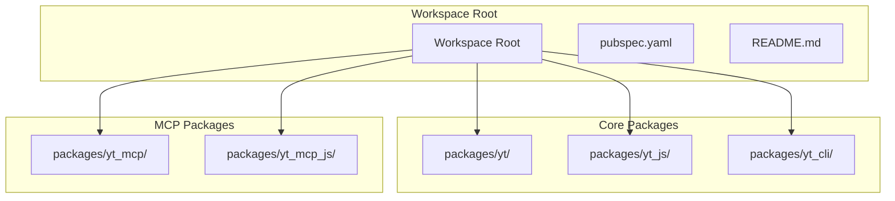

**Diagram sources**
- [pubspec.yaml:1-69](file://pubspec.yaml#L1-L69)
- [README.md:8-18](file://README.md#L8-L18)

The MCP server implementation is distributed across two packages that complement each other:

**Section sources**
- [pubspec.yaml:7-21](file://pubspec.yaml#L7-L21)
- [README.md:10-18](file://README.md#L10-L18)

## Core Components

### Dart MCP Server Implementation

The Dart implementation provides a native server with comprehensive YouTube API integration:

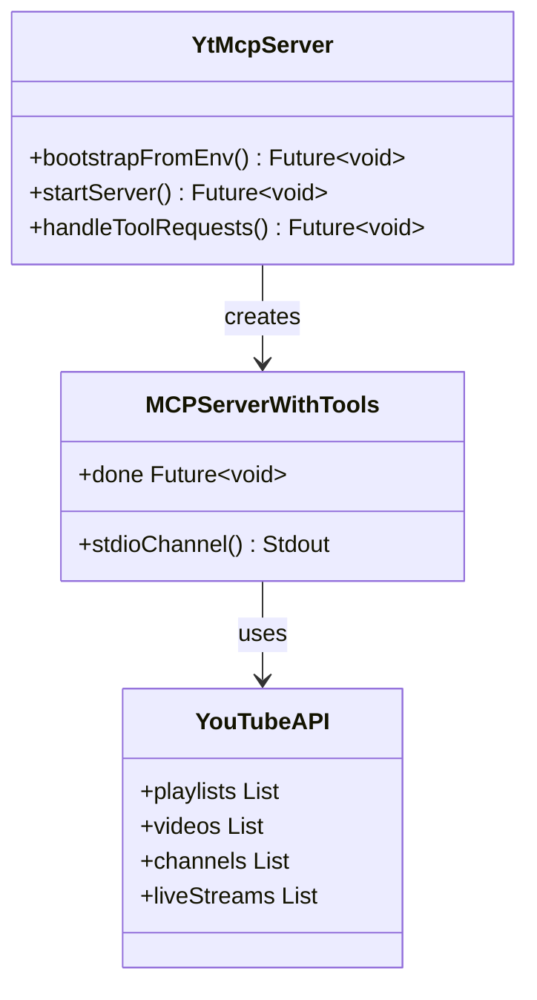

**Diagram sources**
- [packages/yt_mcp/bin/yt_mcp_server.dart:21-27](file://packages/yt_mcp/bin/yt_mcp_server.dart#L21-L27)
- [packages/yt_mcp/lib/src/yt_mcp_server.dart:1-50](file://packages/yt_mcp/lib/src/yt_mcp_server.dart#L1-L50)

### Node.js MCP Server Implementation

The JavaScript implementation provides a compiled version optimized for Node.js environments:

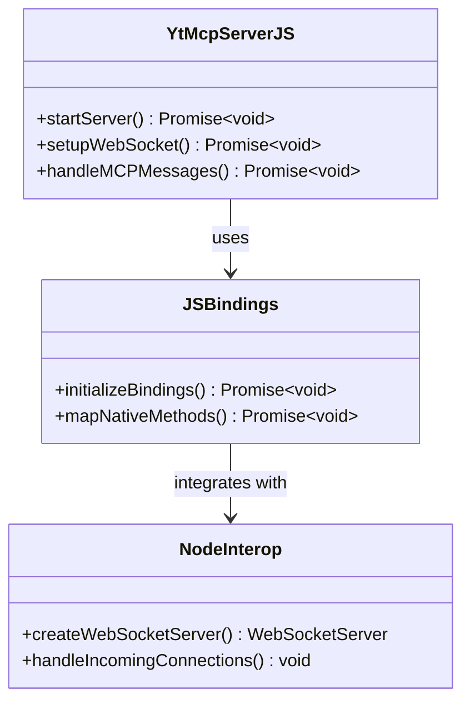

**Diagram sources**
- [packages/yt_mcp_js/lib/src/yt_mcp_server_js.dart:1-50](file://packages/yt_mcp_js/lib/src/yt_mcp_server_js.dart#L1-L50)
- [packages/yt_mcp_js/lib/src/js_bindings.dart:1-50](file://packages/yt_mcp_js/lib/src/js_bindings.dart#L1-L50)

**Section sources**
- [packages/yt_mcp/lib/src/yt_mcp_server.dart:1-100](file://packages/yt_mcp/lib/src/yt_mcp_server.dart#L1-L100)
- [packages/yt_mcp_js/lib/src/yt_mcp_server_js.dart:1-100](file://packages/yt_mcp_js/lib/src/yt_mcp_server_js.dart#L1-L100)

## Architecture Overview

Both implementations follow a similar architectural pattern but adapt to their respective environments:

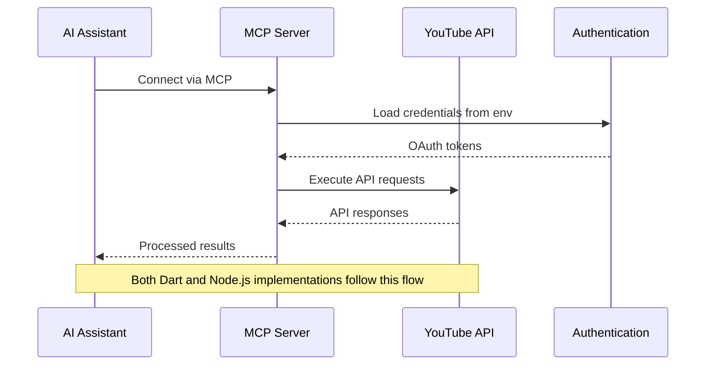

**Diagram sources**
- [packages/yt_mcp/bin/yt_mcp_server.dart:21-27](file://packages/yt_mcp/bin/yt_mcp_server.dart#L21-L27)
- [packages/yt_mcp_js/lib/yt_mcp_js.dart:3-5](file://packages/yt_mcp_js/lib/yt_mcp_js.dart#L3-L5)

The architecture supports multiple deployment scenarios:
- **Dart Native**: Traditional Dart/Flutter applications
- **Node.js Runtime**: Server-side JavaScript environments
- **Web Applications**: Browser-based integrations
- **Containerized Deployments**: Dockerized microservices

## Detailed Component Analysis

### Dart Server Entry Point

The Dart implementation uses a clean entry point pattern:

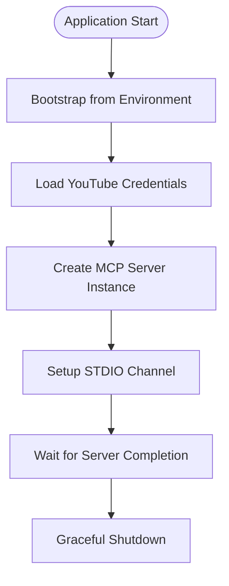

**Diagram sources**
- [packages/yt_mcp/bin/yt_mcp_server.dart:21-27](file://packages/yt_mcp/bin/yt_mcp_server.dart#L21-L27)

### Node.js Server Architecture

The Node.js implementation adds WebSocket support and JavaScript interop:

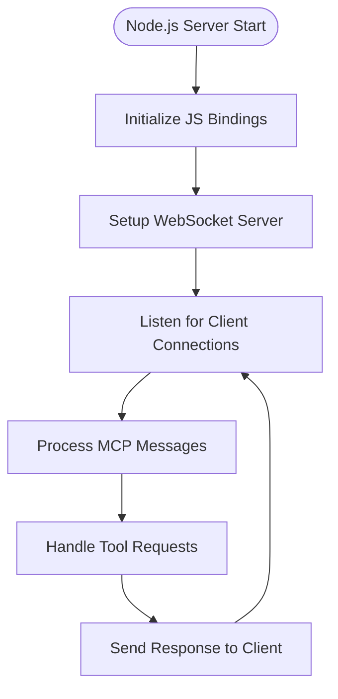

**Diagram sources**
- [packages/yt_mcp_js/lib/yt_mcp_js.dart:3-5](file://packages/yt_mcp_js/lib/yt_mcp_js.dart#L3-L5)
- [packages/yt_mcp_js/lib/src/yt_mcp_server_js.dart:1-80](file://packages/yt_mcp_js/lib/src/yt_mcp_server_js.dart#L1-L80)

**Section sources**
- [packages/yt_mcp/bin/yt_mcp_server.dart:1-28](file://packages/yt_mcp/bin/yt_mcp_server.dart#L1-L28)
- [packages/yt_mcp_js/lib/yt_mcp_js.dart:1-6](file://packages/yt_mcp_js/lib/yt_mcp_js.dart#L1-L6)

## Node.js vs Dart Implementation Differences

### Platform-Specific Considerations

| Aspect | Dart Implementation | Node.js Implementation |
|--------|-------------------|----------------------|
| **Runtime Environment** | Native Dart VM | Node.js JavaScript runtime |
| **Communication Protocol** | STDIO pipes | WebSocket connections |
| **Dependencies** | dart_mcp, yt packages | stream_channel, web_socket_channel |
| **Build Process** | Dart build_runner | Web compilation via dart2js |
| **Deployment** | Standalone executables | NPM package distribution |
| **Development Experience** | Hot reload support | Fast iteration with nodemon |

### Code Structure Differences

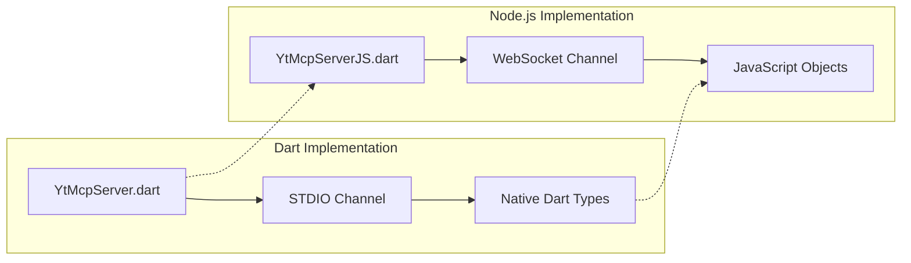

**Diagram sources**
- [packages/yt_mcp/bin/yt_mcp_server.dart:17-25](file://packages/yt_mcp/bin/yt_mcp_server.dart#L17-L25)
- [packages/yt_mcp_js/lib/src/yt_mcp_server_js.dart:1-50](file://packages/yt_mcp_js/lib/src/yt_mcp_server_js.dart#L1-L50)

### Performance Characteristics

| Metric | Dart Server | Node.js Server |
|--------|-------------|----------------|
| **Startup Time** | Faster native startup | Slower initial compilation |
| **Memory Usage** | Lower memory footprint | Higher memory overhead |
| **CPU Efficiency** | Optimized Dart VM | JavaScript JIT compilation |
| **Network Latency** | Minimal overhead | WebSocket overhead |
| **Scalability** | Good for single instances | Excellent for microservices |

**Section sources**
- [packages/yt_mcp/pubspec.yaml:16-25](file://packages/yt_mcp/pubspec.yaml#L16-L25)
- [packages/yt_mcp_js/pubspec.yaml:7-16](file://packages/yt_mcp_js/pubspec.yaml#L7-L16)

## JavaScript/TypeScript Bindings and Integration

### Build Process for JavaScript Bindings

The Node.js implementation follows a specific build pipeline:

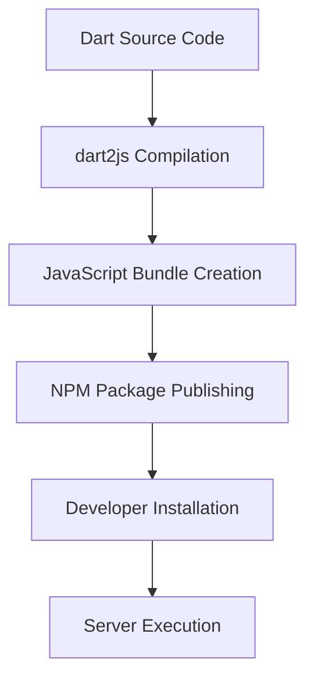

**Diagram sources**
- [packages/yt_mcp_js/README.md:49-61](file://packages/yt_mcp_js/README.md#L49-L61)

### Integration Patterns

The JavaScript implementation supports multiple integration approaches:

1. **Direct NPM Installation**: `npm install -g yt_mcp_js`
2. **npx Execution**: `npx yt_mcp_js` for ephemeral usage
3. **Programmatic Usage**: Import and use within existing Node.js applications
4. **Container Deployment**: Dockerized microservice deployment

**Section sources**
- [packages/yt_mcp_js/README.md:7-20](file://packages/yt_mcp_js/README.md#L7-L20)
- [packages/yt_mcp_js/README.md:34-47](file://packages/yt_mcp_js/README.md#L34-L47)

## Build Processes and Deployment

### Dart Build Process

The Dart implementation uses a conventional build pipeline:

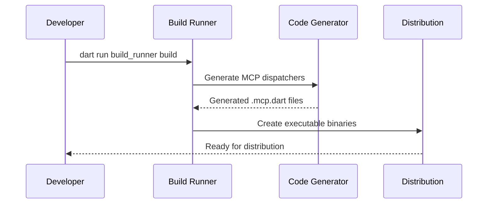

**Diagram sources**
- [packages/yt_mcp/bin/yt_mcp_server.dart:11-12](file://packages/yt_mcp/bin/yt_mcp_server.dart#L11-L12)

### Node.js Build Process

The JavaScript implementation follows a web-focused build approach:

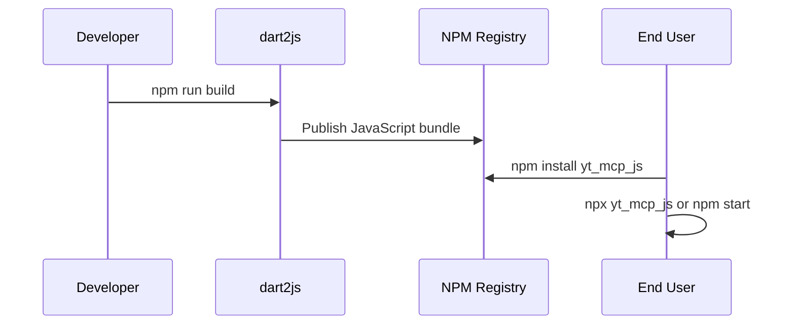

**Diagram sources**
- [packages/yt_mcp_js/README.md:53-61](file://packages/yt_mcp_js/README.md#L53-L61)

**Section sources**
- [packages/yt_mcp/pubspec.yaml:27-30](file://packages/yt_mcp/pubspec.yaml#L27-L30)
- [packages/yt_mcp_js/pubspec.yaml:10-16](file://packages/yt_mcp_js/pubspec.yaml#L10-L16)

## Environment Variables and Configuration

### Credential Management

Both implementations rely on environment-based credential loading:

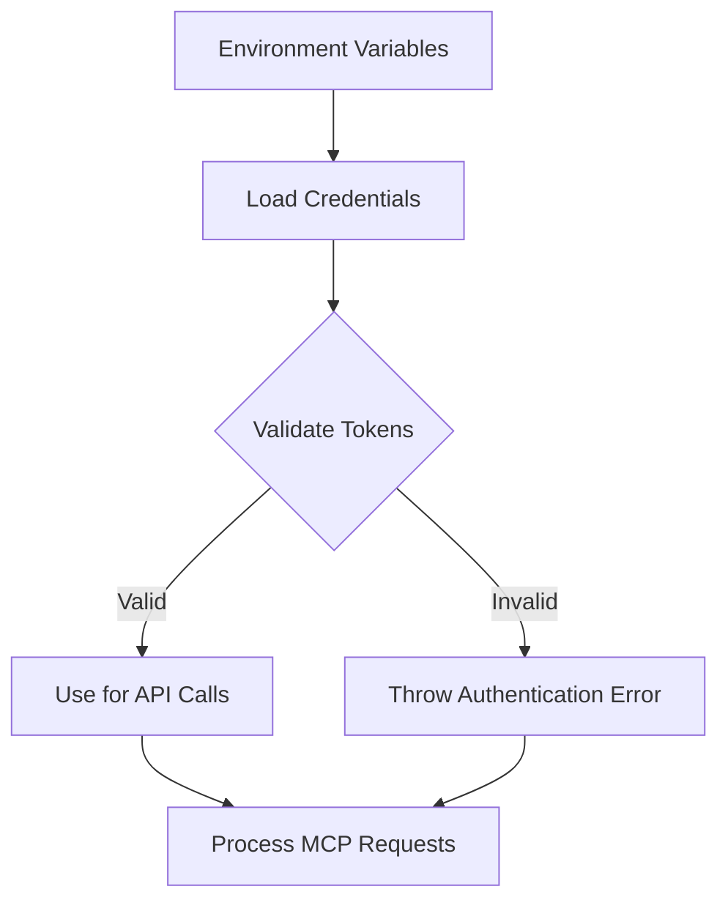

**Diagram sources**
- [packages/yt_mcp/bin/yt_mcp_server.dart:22](file://packages/yt_mcp/bin/yt_mcp_server.dart#L22)

### Configuration Options

| Environment Variable | Purpose | Default Value |
|---------------------|---------|---------------|
| `YOUTUBE_API_KEY` | API key for YouTube Data API | Required |
| `YOUTUBE_OAUTH_TOKEN` | OAuth access token | Required |
| `YOUTUBE_REFRESH_TOKEN` | OAuth refresh token | Optional |
| `MCP_SERVER_PORT` | WebSocket server port | 8080 |
| `MCP_SERVER_HOST` | Server host binding | localhost |

**Section sources**
- [packages/yt_mcp/README.md:44-51](file://packages/yt_mcp/README.md#L44-L51)
- [packages/yt_mcp_js/README.md:63-66](file://packages/yt_mcp_js/README.md#L63-L66)

## Practical Examples

### Setting Up the Dart MCP Server

Basic installation and usage:

```bash
# Install the Dart package
dart pub global activate yt_mcp

# Configure OAuth credentials
yt authorize

# Start the server
yt_mcp --help
```

### Setting Up the Node.js MCP Server

Node.js-specific setup and usage:

```bash
# Install via npx (recommended)
npx yt_mcp_js

# Or install globally
npm install -g yt_mcp_js

# Start the server
npm start
```

### AI Assistant Integration

Configuration for popular AI assistants:

```json
{
  "mcpServers": {
    "youtube": {
      "command": "npx",
      "args": ["yt_mcp_js"]
    }
  }
}
```

**Section sources**
- [packages/yt_mcp/README.md:9-22](file://packages/yt_mcp/README.md#L9-L22)
- [packages/yt_mcp_js/README.md:9-19](file://packages/yt_mcp_js/README.md#L9-L19)
- [packages/yt_mcp_js/README.md:38-47](file://packages/yt_mcp_js/README.md#L38-L47)

## Compatibility and Migration

### Cross-Platform Compatibility Matrix

| Feature | Dart Implementation | Node.js Implementation | Compatible |
|---------|-------------------|----------------------|------------|
| YouTube Data API | ✅ Full Support | ✅ Full Support | ✅ |
| Live Streaming API | ✅ Full Support | ✅ Full Support | ✅ |
| OAuth2 Authentication | ✅ Environment-based | ✅ Environment-based | ✅ |
| MCP Protocol | ✅ Standard | ✅ Standard | ✅ |
| WebSocket Support | ❌ STDIO only | ✅ WebSocket | ⚠️ Different protocols |
| Development Tools | ✅ Hot reload | ✅ Fast iteration | ⚠️ Different toolchains |

### Migration Path from Dart to Node.js

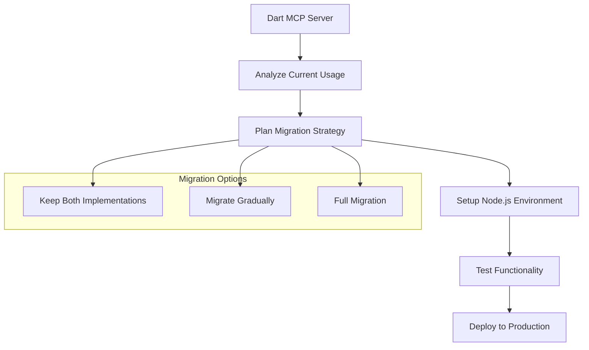

### Best Practices for Consistency

1. **Shared Configuration**: Use environment variables consistently across both implementations
2. **Standardized Tool Names**: Maintain identical tool naming conventions
3. **Unified Error Handling**: Implement consistent error response formats
4. **Documentation Synchronization**: Keep both README files updated in parallel

**Section sources**
- [packages/yt_mcp/README.md:24-41](file://packages/yt_mcp/README.md#L24-L41)
- [packages/yt_mcp_js/README.md:25-33](file://packages/yt_mcp_js/README.md#L25-L33)

## Performance Considerations

### Memory Management

**Dart Implementation Advantages:**
- Garbage collection optimized for long-running servers
- Predictable memory usage patterns
- Efficient native type handling

**Node.js Implementation Considerations:**
- Event-driven architecture reduces memory overhead
- Proper cleanup of WebSocket connections
- Monitoring for memory leaks in long-running sessions

### Network Optimization

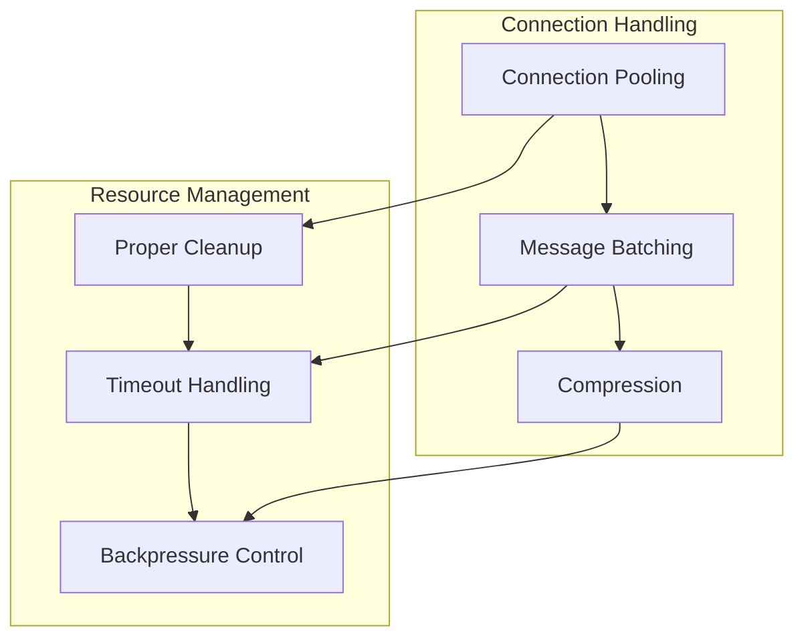

### Scaling Strategies

1. **Horizontal Scaling**: Multiple Node.js instances behind load balancers
2. **Vertical Scaling**: Increase resources for Dart implementations
3. **Caching Layer**: Implement Redis caching for frequently accessed data
4. **Connection Limits**: Configure appropriate connection limits per implementation

## Troubleshooting Guide

### Common Issues and Solutions

| Issue | Symptoms | Solution |
|-------|----------|----------|
| Authentication Failure | 401 errors when accessing YouTube API | Verify OAuth credentials in environment variables |
| Connection Refused | Cannot connect to MCP server | Check server is running and listening on correct port |
| WebSocket Errors | Connection drops during operation | Verify network connectivity and firewall settings |
| Memory Leaks | Increasing memory usage over time | Implement proper cleanup and monitoring |

### Debugging Tools

**Dart Implementation:**
- Use `dart --observe` for debugging
- Monitor with Observatory profiling tools
- Enable verbose logging for development

**Node.js Implementation:**
- Use `node --inspect` for debugging
- Monitor with Chrome DevTools
- Implement structured logging for production

### Logging Configuration

Both implementations support configurable logging levels:

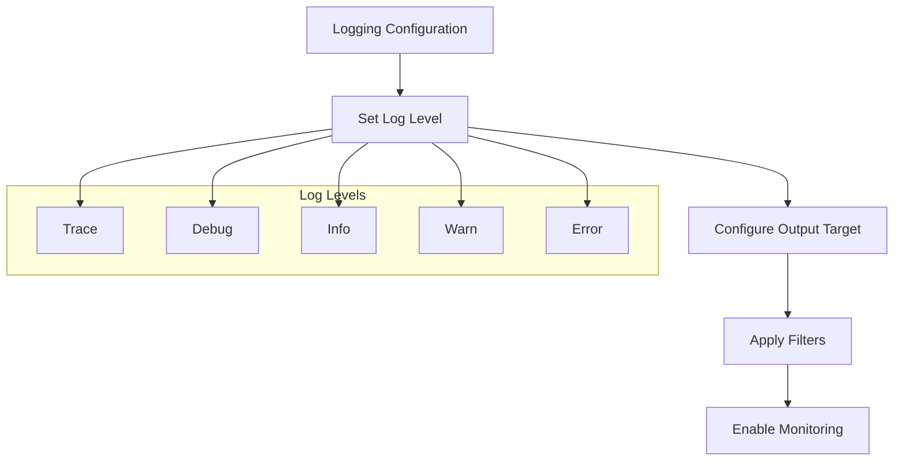

**Section sources**
- [packages/yt_mcp_js/lib/src/node_interop.dart:1-50](file://packages/yt_mcp_js/lib/src/node_interop.dart#L1-L50)

## Conclusion

The Node.js-compatible MCP server implementation provides a robust foundation for integrating YouTube APIs with AI assistants across multiple platforms. The dual implementation approach ensures broad compatibility while maintaining feature parity between Dart and JavaScript environments.

Key advantages of this implementation include:

- **Cross-Platform Compatibility**: Seamless operation in both native Dart and Node.js environments
- **Standardized Protocol**: Consistent MCP interface across all deployments
- **Flexible Deployment**: Multiple installation and execution options
- **Comprehensive API Coverage**: Full support for YouTube Data and Live Streaming APIs
- **Production Ready**: Robust error handling and performance optimization

The implementation serves as an excellent foundation for AI-assisted YouTube content management, enabling developers to build sophisticated applications that leverage the power of both YouTube's APIs and modern AI technologies.