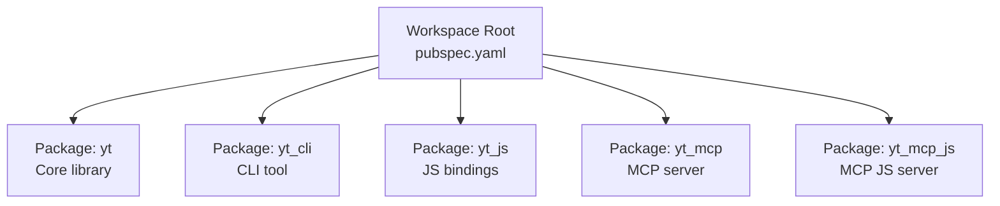
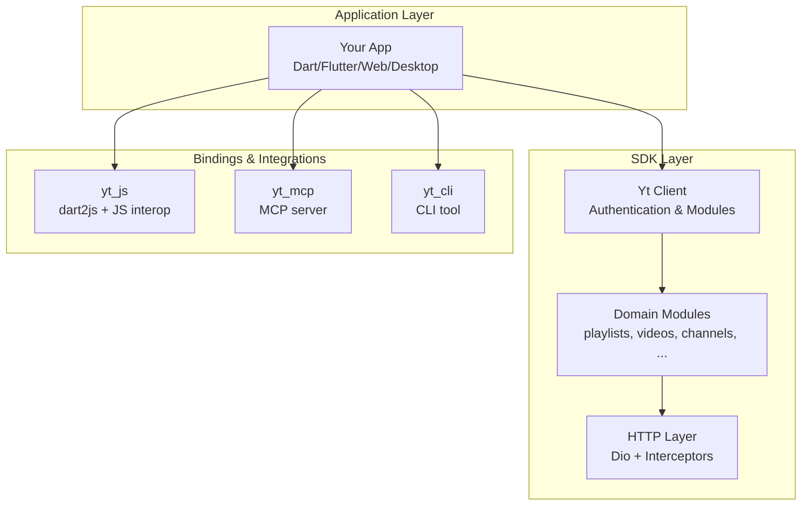
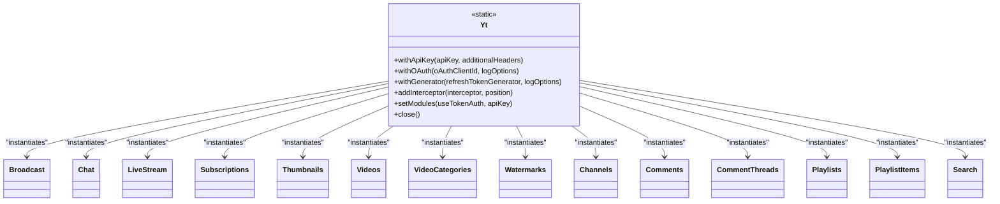
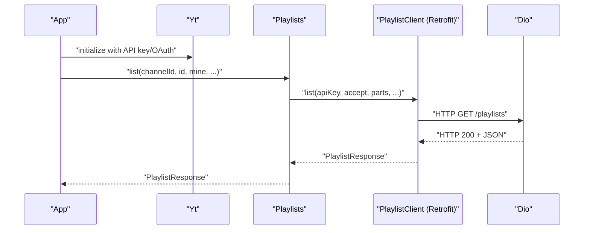
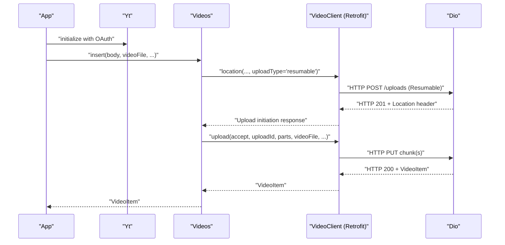
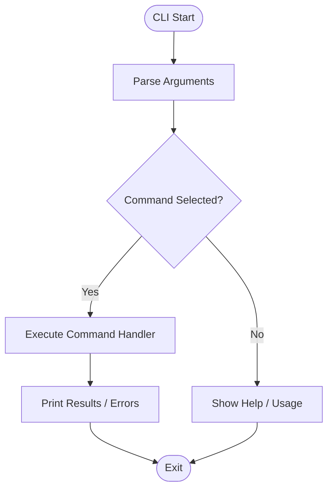
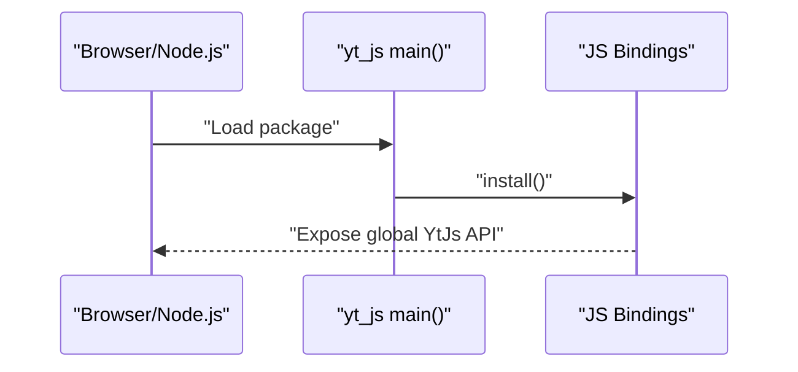
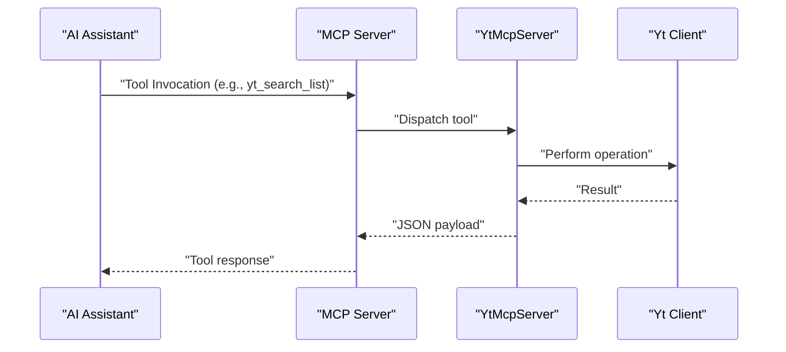
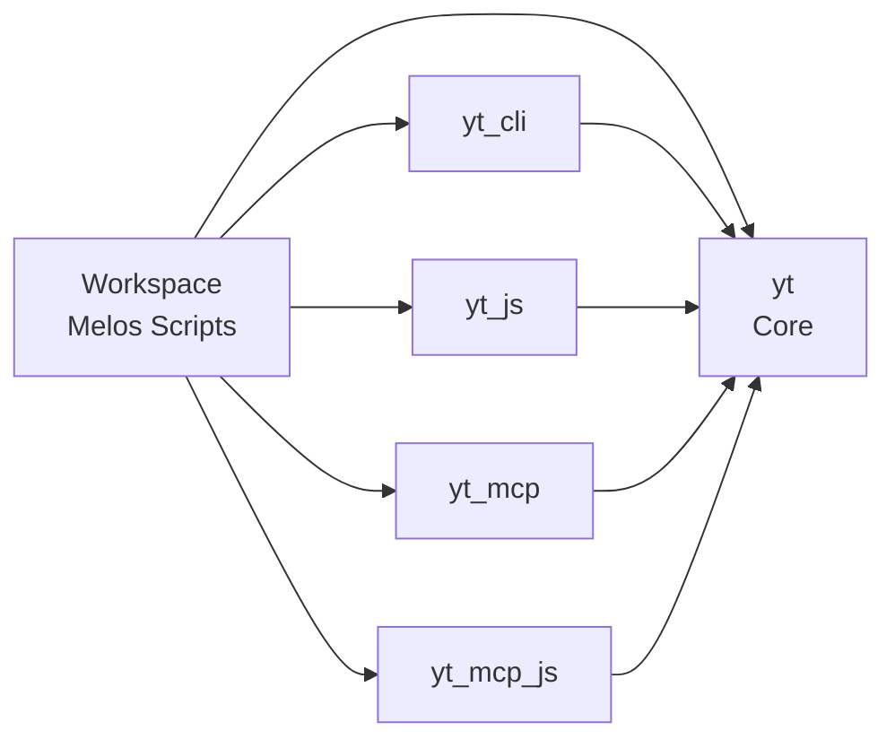

# Project Overview

<cite>
**Referenced Files in This Document**
- [README.md](file://README.md)
- [pubspec.yaml](file://pubspec.yaml)
- [packages/yt/pubspec.yaml](file://packages/yt/pubspec.yaml)
- [packages/yt/lib/yt.dart](file://packages/yt/lib/yt.dart)
- [packages/yt/lib/src/yt_base.dart](file://packages/yt/lib/src/yt_base.dart)
- [packages/yt/lib/src/playlists.dart](file://packages/yt/lib/src/playlists.dart)
- [packages/yt/lib/src/videos.dart](file://packages/yt/lib/src/videos.dart)
- [packages/yt_cli/pubspec.yaml](file://packages/yt_cli/pubspec.yaml)
- [packages/yt_cli/bin/yt.dart](file://packages/yt_cli/bin/yt.dart)
- [packages/yt_cli/lib/yt_cli.dart](file://packages/yt_cli/lib/yt_cli.dart)
- [packages/yt_js/pubspec.yaml](file://packages/yt_js/pubspec.yaml)
- [packages/yt_js/lib/yt_js.dart](file://packages/yt_js/lib/yt_js.dart)
- [packages/yt_mcp/pubspec.yaml](file://packages/yt_mcp/pubspec.yaml)
- [packages/yt_mcp/lib/src/yt_mcp_server.dart](file://packages/yt_mcp/lib/src/yt_mcp_server.dart)
- [packages/yt_mcp_js/pubspec.yaml](file://packages/yt_mcp_js/pubspec.yaml)
</cite>

## Table of Contents
1. [Introduction](#introduction)
2. [Project Structure](#project-structure)
3. [Core Components](#core-components)
4. [Architecture Overview](#architecture-overview)
5. [Detailed Component Analysis](#detailed-component-analysis)
6. [Dependency Analysis](#dependency-analysis)
7. [Performance Considerations](#performance-considerations)
8. [Troubleshooting Guide](#troubleshooting-guide)
9. [Conclusion](#conclusion)
10. [Appendices](#appendices)

## Introduction
This project provides a native Dart interface to multiple YouTube REST APIs, including the YouTube Data API and the YouTube Live Streaming API. It is organized as a multi-package monorepo with five primary packages that together enable:
- A core Dart library for YouTube Data and Live Streaming APIs
- A command-line interface (CLI) tool
- JavaScript/TypeScript bindings for web and Node.js environments
- An MCP (Model Context Protocol) server for AI assistant integration
- A JavaScript variant of the MCP server for Node.js

The SDK emphasizes cross-platform support and offers a cohesive developer experience across Dart/Flutter, CLI, web, desktop, and AI-assisted workflows.

## Project Structure
The repository is a Melos-managed workspace that groups related packages under a single development environment. The workspace defines the core packages and shared tooling for bootstrapping, building, analyzing, formatting, and testing.

**Diagram sources**
- [pubspec.yaml:17-21](file://pubspec.yaml#L17-L21)

**Section sources**
- [pubspec.yaml:1-69](file://pubspec.yaml#L1-L69)
- [README.md:8-18](file://README.md#L8-L18)

## Core Components
The core library package (yt) exposes a unified client for YouTube’s Data and Live Streaming APIs. It organizes functionality into domain-focused modules (e.g., playlists, videos, channels, search) and provides authentication modes (API key and OAuth). The client leverages Retrofit for endpoint definitions and Dio for HTTP networking.

Key capabilities:
- YouTube Data API: channels, videos, playlists, search, comments, thumbnails, subscriptions, video categories, watermarks
- YouTube Live Streaming API: live broadcasts, live streams, live chat
- Authentication: API key and OAuth flows
- Cross-platform: Dart CLI, Flutter (mobile/web/desktop), web browsers via JS bindings

Practical usage examples (conceptual):
- Initialize the client with API key or OAuth
- List playlists for a channel
- Upload a video with metadata
- Search for videos, channels, or playlists
- Manage live broadcasts and live chat

**Section sources**
- [README.md:20-62](file://README.md#L20-L62)
- [packages/yt/lib/yt.dart:11-75](file://packages/yt/lib/yt.dart#L11-L75)
- [packages/yt/lib/src/yt_base.dart:88-141](file://packages/yt/lib/src/yt_base.dart#L88-L141)

## Architecture Overview
The SDK follows a layered architecture:
- Client layer: Yt orchestrates authentication and exposes domain modules
- Module layer: Each domain (e.g., playlists, videos) encapsulates API operations
- HTTP layer: Dio handles requests and interceptors; Retrofit generates clients
- Cross-platform layer: yt_js enables web/Node.js usage; yt_mcp bridges to AI assistants

**Diagram sources**
- [packages/yt/lib/src/yt_base.dart:9-259](file://packages/yt/lib/src/yt_base.dart#L9-L259)
- [packages/yt/lib/src/playlists.dart:15-89](file://packages/yt/lib/src/playlists.dart#L15-L89)
- [packages/yt/lib/src/videos.dart:8-135](file://packages/yt/lib/src/videos.dart#L8-L135)
- [packages/yt_js/lib/yt_js.dart:1-14](file://packages/yt_js/lib/yt_js.dart#L1-L14)
- [packages/yt_mcp/lib/src/yt_mcp_server.dart:15-225](file://packages/yt_mcp/lib/src/yt_mcp_server.dart#L15-L225)
- [packages/yt_cli/bin/yt.dart:5-38](file://packages/yt_cli/bin/yt.dart#L5-L38)

## Detailed Component Analysis

### Core Client: Yt
The Yt class centralizes initialization, authentication, and module instantiation. It supports:
- API key mode for read-only access
- OAuth mode for full access
- Token refresh generators
- Global interceptors for logging and auth headers
- Lazy-loading of domain modules

**Diagram sources**
- [packages/yt/lib/src/yt_base.dart:9-259](file://packages/yt/lib/src/yt_base.dart#L9-L259)

**Section sources**
- [packages/yt/lib/src/yt_base.dart:88-141](file://packages/yt/lib/src/yt_base.dart#L88-L141)
- [packages/yt/lib/src/yt_base.dart:187-255](file://packages/yt/lib/src/yt_base.dart#L187-L255)

### Domain Module: Playlists
The Playlists module provides CRUD operations for YouTube playlists, delegating HTTP calls to a Retrofit-generated client. It supports filtering by channel ID, playlist ID, and ownership flags, with pagination and content parts selection.

**Diagram sources**
- [packages/yt/lib/src/playlists.dart:15-89](file://packages/yt/lib/src/playlists.dart#L15-L89)

**Section sources**
- [packages/yt/lib/src/playlists.dart:20-46](file://packages/yt/lib/src/playlists.dart#L20-L46)

### Domain Module: Videos
The Videos module supports listing, inserting (upload), updating, rating, retrieving ratings, reporting abuse, and deleting videos. Uploads use resumable uploads with location negotiation and streaming file upload.

**Diagram sources**
- [packages/yt/lib/src/videos.dart:44-83](file://packages/yt/lib/src/videos.dart#L44-L83)

**Section sources**
- [packages/yt/lib/src/videos.dart:13-42](file://packages/yt/lib/src/videos.dart#L13-L42)
- [packages/yt/lib/src/videos.dart:53-83](file://packages/yt/lib/src/videos.dart#L53-L83)

### CLI Tool: yt_cli
The CLI package provides a command-line interface for YouTube operations. It registers commands for authorization, broadcasts, channels, chat, comments, playlists, search, streams, subscriptions, thumbnails, versions, videos, video categories, and watermarks.

**Diagram sources**
- [packages/yt_cli/bin/yt.dart:5-38](file://packages/yt_cli/bin/yt.dart#L5-L38)

**Section sources**
- [packages/yt_cli/bin/yt.dart:5-38](file://packages/yt_cli/bin/yt.dart#L5-L38)
- [packages/yt_cli/lib/yt_cli.dart:1-20](file://packages/yt_cli/lib/yt_cli.dart#L1-L20)

### JavaScript Bindings: yt_js
The yt_js package compiles the core library to JavaScript via dart2js and exposes a global namespace for interop-friendly usage in browsers and Node.js. A main entry point installs the bindings.

**Diagram sources**
- [packages/yt_js/lib/yt_js.dart:1-14](file://packages/yt_js/lib/yt_js.dart#L1-L14)

**Section sources**
- [packages/yt_js/lib/yt_js.dart:1-14](file://packages/yt_js/lib/yt_js.dart#L1-L14)
- [packages/yt_js/pubspec.yaml:1-19](file://packages/yt_js/pubspec.yaml#L1-L19)

### MCP Server: yt_mcp
The yt_mcp package exposes YouTube Data and Live Streaming APIs as MCP tools. It reads credentials from environment variables and provides tools for channels, search, videos, playlists, comments, and comment threads.

**Diagram sources**
- [packages/yt_mcp/lib/src/yt_mcp_server.dart:66-86](file://packages/yt_mcp/lib/src/yt_mcp_server.dart#L66-L86)
- [packages/yt_mcp/lib/src/yt_mcp_server.dart:92-223](file://packages/yt_mcp/lib/src/yt_mcp_server.dart#L92-L223)

**Section sources**
- [packages/yt_mcp/lib/src/yt_mcp_server.dart:15-225](file://packages/yt_mcp/lib/src/yt_mcp_server.dart#L15-L225)

### Conceptual Overview
Beginners can think of the SDK as a structured toolkit:
- Use the core client for programmatic access to YouTube data and live features
- Use the CLI for quick tasks and automation
- Use the JS bindings to integrate YouTube APIs in web applications
- Use the MCP server to connect AI assistants to YouTube operations

Experienced developers can leverage:
- Retrofit-generated clients for strongly-typed endpoints
- Dio interceptors for logging, retries, and auth
- Modular domain classes for maintainable code
- MCP annotations for declarative tool exposure

[No sources needed since this section doesn't analyze specific files]

## Dependency Analysis
The workspace coordinates five packages with shared tooling. Each package declares its own dependencies, while the core package depends on Retrofit, Dio, and Google APIs authentication.

**Diagram sources**
- [pubspec.yaml:17-21](file://pubspec.yaml#L17-L21)
- [packages/yt_cli/pubspec.yaml:21-27](file://packages/yt_cli/pubspec.yaml#L21-L27)
- [packages/yt_js/pubspec.yaml:12-14](file://packages/yt_js/pubspec.yaml#L12-L14)
- [packages/yt_mcp/pubspec.yaml:22-26](file://packages/yt_mcp/pubspec.yaml#L22-L26)
- [packages/yt_mcp_js/pubspec.yaml:10-16](file://packages/yt_mcp_js/pubspec.yaml#L10-L16)

**Section sources**
- [pubspec.yaml:17-69](file://pubspec.yaml#L17-L69)
- [packages/yt/pubspec.yaml:17-36](file://packages/yt/pubspec.yaml#L17-L36)

## Performance Considerations
- Use Dio interceptors for logging and optional caching strategies
- Prefer paginated queries with appropriate maxResults to limit payload sizes
- For uploads, leverage resumable uploads to handle interruptions gracefully
- Minimize unnecessary parts in API requests to reduce bandwidth and latency
- Cache frequently accessed public data where appropriate

[No sources needed since this section provides general guidance]

## Troubleshooting Guide
Common issues and resolutions:
- Authentication failures: Ensure API key or OAuth token is configured and valid
- Missing module errors: Some features require OAuth; verify client initialization
- Upload failures: Confirm upload location negotiation and network stability
- CLI usage errors: Review command help and argument validation

**Section sources**
- [packages/yt/lib/src/yt_base.dart:16-17](file://packages/yt/lib/src/yt_base.dart#L16-L17)
- [packages/yt/lib/src/yt_base.dart:34-36](file://packages/yt/lib/src/yt_base.dart#L34-L36)
- [packages/yt/lib/src/videos.dart:72-74](file://packages/yt/lib/src/videos.dart#L72-L74)
- [packages/yt_cli/bin/yt.dart:30-36](file://packages/yt_cli/bin/yt.dart#L30-L36)

## Conclusion
This SDK delivers a comprehensive, cross-platform solution for integrating YouTube Data and Live Streaming APIs into Dart/Flutter applications, CLIs, web apps, and AI-assisted workflows. Its modular design, Retrofit-based endpoints, and Dio-powered HTTP client provide a robust foundation for production-grade integrations.

[No sources needed since this section summarizes without analyzing specific files]

## Appendices

### Package Ecosystem Summary
- yt: Core Dart library for YouTube Data and Live Streaming APIs
- yt_cli: CLI tool for YouTube operations
- yt_js: JavaScript/TypeScript bindings for web and Node.js
- yt_mcp: MCP server for AI assistant integration
- yt_mcp_js: MCP server compiled to JavaScript for Node.js

**Section sources**
- [README.md:10-18](file://README.md#L10-L18)